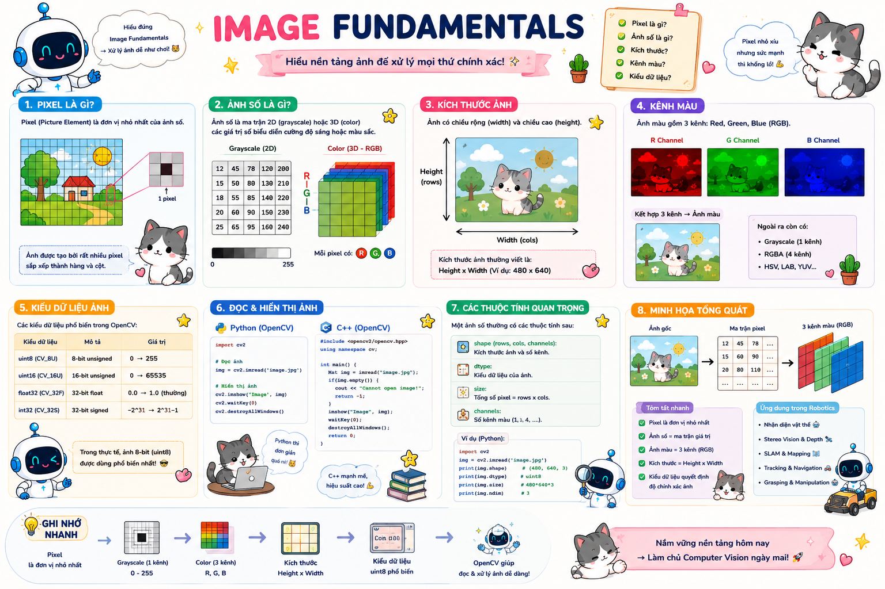
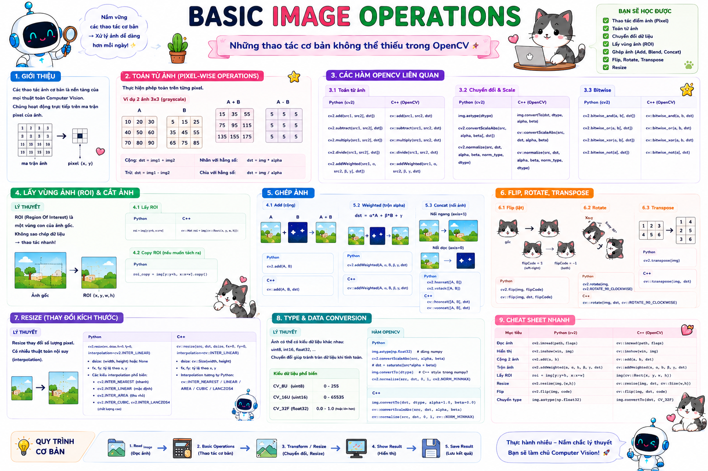
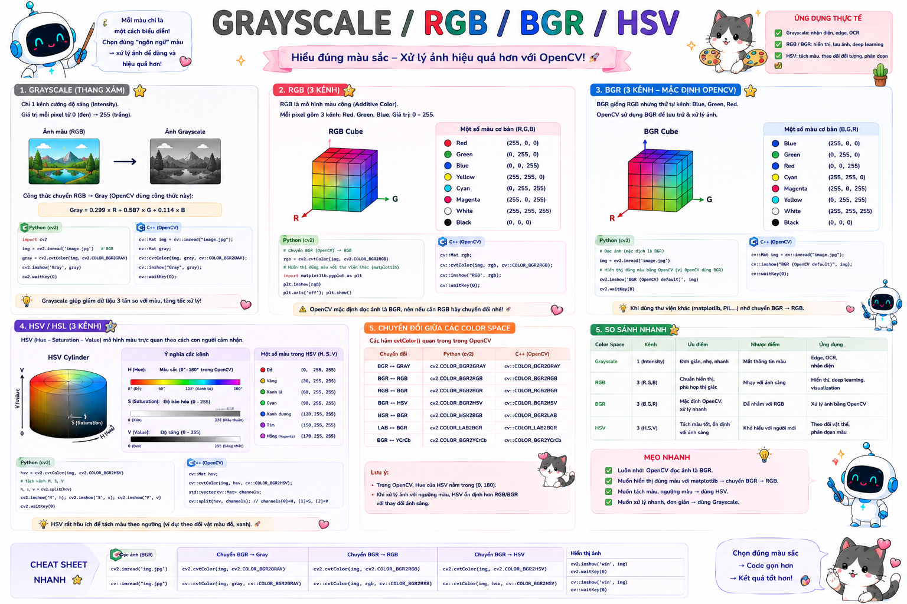
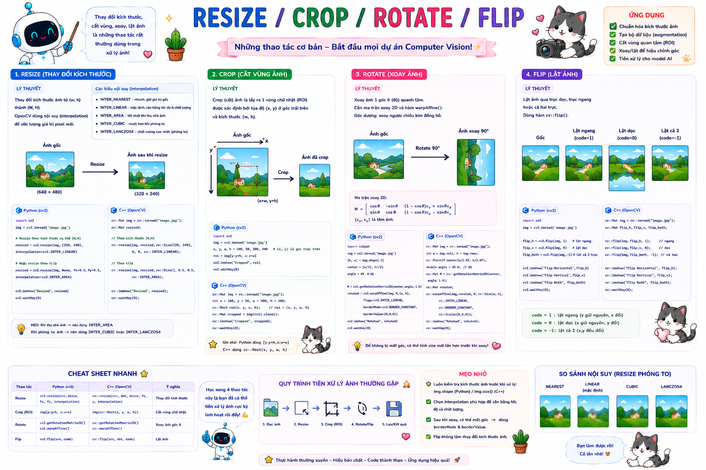
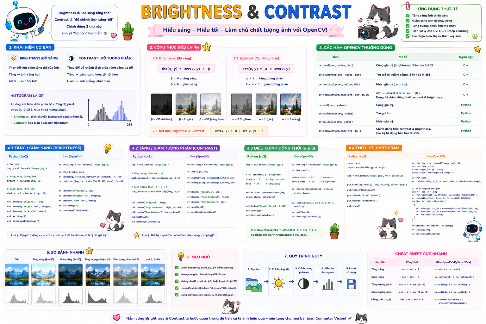
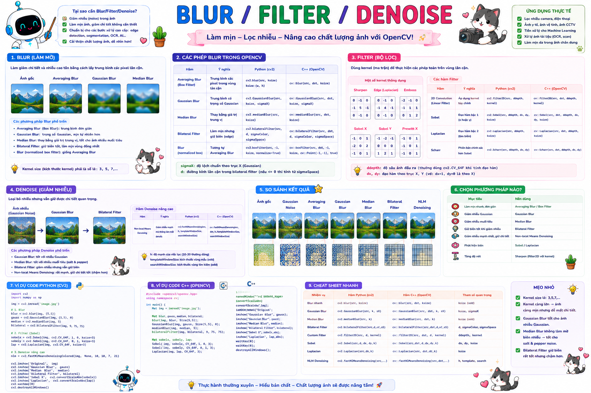
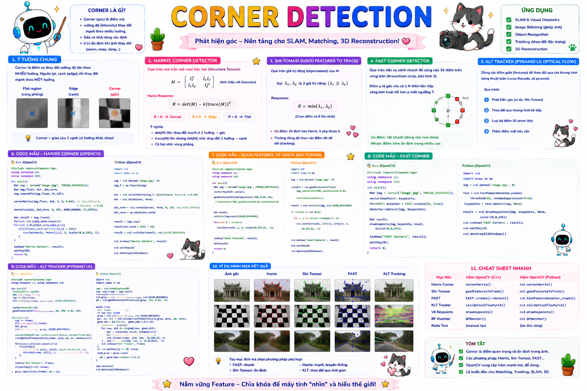

<br>

<div align="center">

# ✨ Computer Vision Knowledge Roadmap
## Clean • Aesthetic • Robotics-Oriented README


</div>

---

## 📌 Overview

README này được thiết kế lại theo hướng **thẩm mỹ hơn, gọn hơn, dễ đọc hơn** nhưng vẫn giữ đúng nội dung kiến thức Computer Vision ban đầu.

Mục tiêu:

- Học Computer Vision từ nền tảng ảnh, pixel, channel đến stereo, depth, robot perception
- Có ví dụ song song **Python + C++ + OpenCV**
- Phù hợp định hướng **Robotics Vision • AI Perception • Humanoid Robot**
- Có cấu trúc phase rõ ràng để học theo từng đợt

---

## 🧭 Quick Navigation

| Phase | Nội dung | Chủ đề chính |
|---:|---|---|
| Phase 1 | [Phase 1 — Computer Vision Foundations](#phase-1-computer-vision-foundations) | Python • C++ • OpenCV • Image Basics • Coordinate System • Basic Image Operations |
| Phase 2 | [Phase 2 — Image Processing](#phase-2-image-processing) | Python • C++ • OpenCV • Color Spaces • Geometric Transformations • Filtering • Thresholding • Morphology |
| Phase 3 | [Phase 3 — Feature Detection & Matching](#phase-3-feature-detection-matching) | Python • C++ • OpenCV • Features • Corners • SIFT / ORB • Descriptors • Matching • Homography • Image Registration |
| Phase 4 | [Phase 4 — Camera Geometry](#phase-4-camera-geometry) | Python • C++ • OpenCV • Pinhole Camera • Intrinsic Matrix • Extrinsic Matrix • Projection • Back-Projection • Calibration |
| Phase 5 | [Phase 5 — Stereo Vision & Depth](#phase-5-stereo-vision-depth) | Python • C++ • OpenCV • Stereo Camera • Disparity • Block Matching • SGM • Depth Estimation • Depth Map • Point Cloud |
| Phase 6 | [Phase 6 — Motion & Video Vision](#phase-6-motion-video-vision) | Python • C++ • OpenCV • Video I/O • Frame Processing • Optical Flow • Motion Detection • Background Subtraction • Tracking |
| Phase 7 | [Phase 7 — Segmentation & Contours](#phase-7-segmentation-contours) | Python • C++ • OpenCV • Contours • Shape Analysis • Classical Segmentation • Watershed • GrabCut • Connected Components |
| Phase 8 | [Phase 8 — Object Detection & Classical Recognition](#phase-8-object-detection-classical-recognition) | Python • C++ • OpenCV • Template Matching • Haar Cascade • HOG • Sliding Window • NMS • Classical Recognition |
| Phase 9 | [Phase 9 — Deep Learning For Computer Vision](#phase-9-deep-learning-for-computer-vision) | Python • C++ • OpenCV DNN • PyTorch/TensorFlow Concepts • CNN • Transfer Learning • Detection • Segmentation • Embeddings |
| Phase 10 | [Phase 10 — 3D Vision & Pose Estimation](#phase-10-3d-vision-pose-estimation) | Python • C++ • OpenCV • PnP • Epipolar Geometry • Stereo 3D • Point Cloud • Pose Estimation • Camera-World Geometry |
| Phase 11 | [Phase 11 — Visual Odometry, Slam & Robot Perception Integration](#phase-11-visual-odometry-slam-robot-perception-integration) | Python • C++ • OpenCV • Feature Tracking • Motion Estimation • Mapping • SLAM Concepts • ROS2 Perception Pipelines |
| Phase 12 | [Phase 12 — Advanced Robot Vision Systems & Humanoid Perception Pipeline](#phase-12-advanced-robot-vision-systems-humanoid-perception-pipeline) | Python • C++ • OpenCV • ROS2 • Real-Time Vision • Multi-Sensor Perception • Humanoid Robot Vision |
| Phase 13 | [Phase 13 — Human Perception & Hri Vision](#phase-13-human-perception-hri-vision) | Python • C++ • OpenCV • Deep Vision • Human Detection • Pose Estimation • Face / Gesture / Tracking • Humanoid HRI Perception |
| Phase 14 | [Phase 14 — Advanced 3D Manipulation Vision](#phase-14-advanced-3d-manipulation-vision) | Python • C++ • OpenCV • RGB-D • Stereo • Point Cloud • 6D Pose • Grasp Vision • Manipulation Perception |
| Phase 15 | [Phase 15 — Embodied / Humanoid Scene Understanding & Vision-Language Perception](#phase-15-embodied-humanoid-scene-understanding-vision-language-perception) | Python • C++ • Computer Vision • Robotics Perception • Scene Understanding • Semantic Mapping • Affordance • Vision-Language • Embodied AI |

---

## 🧱 Learning Style

```text
Concept  →  Python Structure  →  C++ Structure  →  OpenCV Example  →  Robotics Application  →  Cheat Sheet
```

---

## 🗂️ Repository Structure Suggestion

```text
computer-vision-knowledge-roadmap/
│
├─ README.md
├─ images/
├─ outputs/
├─ phase_01_cv_foundations/
├─ phase_02_image_processing/
├─ phase_03_feature_detection_matching/
├─ phase_04_camera_geometry/
├─ phase_05_stereo_vision_depth/
├─ phase_06_motion_video_vision/
├─ phase_07_recognition_ai_vision/
├─ phase_08_robotics_vision/
├─ phase_09_slam_advanced_vision/
│
├─ python/
│  ├─ requirements.txt
│  └─ src/
│
└─ cpp/
   ├─ CMakeLists.txt
   └─ src/
```

---

## ✅ Suggested Study Order

```text
Phase 1 → Image / Pixel / Channel / Coordinate / OpenCV setup
Phase 2 → Color / Transform / Filter / Threshold / Morphology / Edge / Contour
Phase 3 → Feature / Corner / SIFT / ORB / Matching / Homography
Phase 4 → Camera Geometry / Intrinsic / Extrinsic / Projection / Calibration
Phase 5 → Stereo / Disparity / Depth / Point Cloud
Phase 6 → Video / Optical Flow / Tracking / Motion
Phase 7 → Detection / Segmentation / Pose / OCR / AI Vision
Phase 8 → Robot Perception / Camera-to-Robot / Pick / Clean / Humanoid
Phase 9 → Visual Odometry / SLAM / Localization / VLM / Frontier Vision
```

---

## 🤖 Robotics Vision Notes

```text
Python  → prototype nhanh, visualize, thử thuật toán
C++     → OpenCV runtime, ROS2 node, integration robot
OpenCV  → image processing, geometry, stereo, tracking
CV Core → pixel → feature → geometry → depth → perception pipeline
```

---

<br>

<br>

<div align="center">

# ✦━━━━━━━━━━━━━━━━━━━━━━━━━━━━━━━━━━━━✦
# PHASE 1 — COMPUTER VISION FOUNDATIONS
# Python • C++ • OpenCV • Image Basics • Coordinate System • Basic Image Operations
# ✦━━━━━━━━━━━━━━━━━━━━━━━━━━━━━━━━━━━━✦

</div>

<br>

# 1. Image Fundamentals

## 1.1. Image là gì?

Trong Computer Vision, `image` là dữ liệu biểu diễn thông tin thị giác của một cảnh dưới dạng ma trận pixel.

Nói đơn giản:

```text
Ảnh = tập hợp rất nhiều pixel sắp xếp theo hàng và cột
```

Mỗi pixel lưu thông tin về:

- độ sáng (nếu là ảnh grayscale)
- màu sắc (nếu là ảnh color)
- đôi khi là thêm alpha channel hoặc depth

Ví dụ:

- ảnh grayscale: mỗi pixel có 1 giá trị
- ảnh RGB / BGR: mỗi pixel có 3 giá trị màu
- ảnh RGBA: mỗi pixel có 4 giá trị

---

## 1.2. Vì sao phải hiểu Image Fundamentals?

Đây là phần gốc của toàn bộ Computer Vision. Nếu chưa chắc phần này thì các phần sau như:

- filtering
- edge detection
- feature extraction
- stereo
- detection
- segmentation
- robot perception

sẽ rất dễ bị học kiểu “dùng hàm nhưng không hiểu dữ liệu đang đi qua như thế nào”.

Hiểu image fundamentals giúp bạn biết:

- ảnh đang được lưu ra sao trong bộ nhớ
- pixel là gì
- shape của ảnh là gì
- vì sao color image có 3 channels
- vì sao OpenCV đọc ảnh thành ma trận NumPy hoặc `cv::Mat`

---

## 1.3. Ảnh trong Computer Vision được biểu diễn như thế nào?

Ảnh số thường được biểu diễn bằng **ma trận**.

Ví dụ ảnh grayscale:

```text
[
  [  0,  10,  50 ],
  [ 80, 120, 255 ],
  [ 30,  60,  90 ]
]
```

Mỗi phần tử là một pixel intensity.

Ví dụ ảnh màu RGB/BGR sẽ có thêm chiều channel:

```text
height x width x channels
```

Ví dụ ảnh 480x640 màu:

```text
480 hàng x 640 cột x 3 channels
```

---

## 1.4. Pixel là gì?

`Pixel` là đơn vị nhỏ nhất của ảnh số.

Mỗi pixel biểu diễn thông tin của một điểm nhỏ trong ảnh.

Ví dụ:

- grayscale pixel: `120`
- color pixel: `(255, 0, 0)` hoặc `(0, 0, 255)` tùy hệ màu

Pixel là dữ liệu nền tảng nhất trong Computer Vision, vì mọi thuật toán cuối cùng đều đọc, biến đổi hoặc suy luận từ pixel.

---

## 1.5. Intensity là gì?

`Intensity` là độ sáng của pixel.

Với ảnh grayscale 8-bit:

```text
0   -> đen
255 -> trắng
```

Các giá trị ở giữa biểu diễn các mức xám khác nhau.

Ví dụ:

```text
0, 50, 120, 200, 255
```

---

## 1.6. Ảnh grayscale và ảnh color khác nhau thế nào?

### Ảnh grayscale
Mỗi pixel có **1 giá trị intensity**.

Ví dụ shape:

```python
(height, width)
```

### Ảnh color
Mỗi pixel có **3 giá trị màu**.

Ví dụ shape:

```python
(height, width, 3)
```

Trong OpenCV, ảnh màu thường mặc định là **BGR**, không phải RGB.

---

## 1.7. Resolution là gì?

`Resolution` là kích thước ảnh theo số pixel.

Ví dụ:

- 640 x 480
- 1280 x 720
- 1920 x 1080

Resolution lớn hơn thường nghĩa là:

- nhiều chi tiết hơn
- nhiều dữ liệu hơn
- xử lý nặng hơn

---

## 1.8. Python structure — tạo ma trận ảnh đơn giản

```python
image = [
    [0, 50, 100],
    [150, 200, 255]
]

print(image)
```

---

## 1.9. C++ structure — tạo ma trận ảnh đơn giản

```cpp
#include <iostream>
#include <vector>
using namespace std;

int main() {
    vector<vector<int>> image = {
        {0, 50, 100},
        {150, 200, 255}
    };

    for (const auto& row : image) {
        for (int pixel : row) {
            cout << pixel << " ";
        }
        cout << endl;
    }

    return 0;
}
```

---

## 1.10. OpenCV Python example — tạo ảnh NumPy

```python
import numpy as np

image = np.array([
    [0, 50, 100],
    [150, 200, 255]
], dtype=np.uint8)

print(image)
print(image.shape)
```

---

## 1.11. OpenCV C++ example — tạo `cv::Mat`

```cpp
#include <opencv2/opencv.hpp>
#include <iostream>
using namespace std;
using namespace cv;

int main() {
    Mat image = (Mat_<uchar>(2, 3) << 0, 50, 100,
                                      150, 200, 255);

    cout << image << endl;
    return 0;
}
```

---

## 1.12. Ứng dụng trong Robotics

Trong robotics, hiểu image fundamentals là bước đầu để:

- đọc camera stream
- xử lý ảnh robot nhìn thấy
- làm threshold / edge / contour
- chuyển ảnh sang grayscale trước khi detect feature
- xử lý depth image / segmentation mask

Nếu robot nhìn thấy một frame camera, frame đó trước hết vẫn chỉ là **ma trận pixel**.

---

## 1.13. Cheat Sheet — Image Fundamentals

```text
Image       -> ma trận pixel
Pixel       -> đơn vị nhỏ nhất của ảnh
Grayscale   -> mỗi pixel có 1 intensity
Color Image -> mỗi pixel có 3 channels
Resolution  -> kích thước ảnh theo pixel
Intensity   -> độ sáng pixel
```

<p align="center">
  
</p>

---

# 2. Pixel, Image Matrix & Channels

## 2.1. Pixel matrix là gì?

Một ảnh thực chất là một ma trận.

Ví dụ ảnh grayscale:

```text
[
  [  0,  20,  40 ],
  [ 60,  80, 100 ]
]
```

Ở đây:

- mỗi hàng là một dòng pixel
- mỗi cột là một pixel theo chiều ngang

Nếu là ảnh màu, mỗi phần tử không còn là 1 số mà là 1 bộ 3 giá trị màu.

---

## 2.2. Image shape là gì?

Trong Python / NumPy / OpenCV, ảnh thường có `shape`.

### Grayscale:
```python
(height, width)
```

### Color:
```python
(height, width, channels)
```

Ví dụ:

```python
(480, 640)      # grayscale
(480, 640, 3)   # color
```

---

## 2.3. Channel là gì?

`Channel` là thành phần lưu thông tin của từng màu hoặc từng loại dữ liệu trong pixel.

Ví dụ ảnh màu có 3 channels:

- Red
- Green
- Blue

Nhưng trong OpenCV:

- Blue
- Green
- Red

tức là **BGR**.

---

## 2.4. Ảnh BGR trong OpenCV

OpenCV mặc định đọc ảnh màu theo thứ tự:

```text
B, G, R
```

chứ không phải:

```text
R, G, B
```

Ví dụ pixel màu đỏ trong OpenCV sẽ thường là:

```python
[0, 0, 255]
```

---

## 2.5. Ảnh grayscale có channel không?

Có thể hiểu grayscale là ảnh có **1 channel**.

Ví dụ pixel grayscale chỉ có một số:

```text
128
```

chứ không phải bộ ba giá trị màu.

---

## 2.6. Dtype của ảnh

Trong Computer Vision, ảnh thường có kiểu dữ liệu như:

- `uint8`  -> phổ biến nhất, giá trị 0–255
- `float32`
- `uint16` -> một số ảnh depth
- `bool`   -> mask nhị phân

Với OpenCV, ảnh RGB/grayscale thông thường thường là `uint8`.

---

## 2.7. Python structure — truy cập pixel

```python
import numpy as np

image = np.array([
    [10, 20, 30],
    [40, 50, 60]
], dtype=np.uint8)

print(image[0, 0])   # pixel hàng 0 cột 0
print(image[1, 2])   # pixel hàng 1 cột 2
```

---

## 2.8. C++ structure — truy cập pixel

```cpp
#include <opencv2/opencv.hpp>
#include <iostream>
using namespace std;
using namespace cv;

int main() {
    Mat image = (Mat_<uchar>(2, 3) << 10, 20, 30,
                                      40, 50, 60);

    cout << (int)image.at<uchar>(0, 0) << endl;
    cout << (int)image.at<uchar>(1, 2) << endl;

    return 0;
}
```

---

## 2.9. OpenCV Python example — đọc shape và dtype

```python
import cv2

image = cv2.imread("image.jpg")
print("Shape:", image.shape)
print("Dtype:", image.dtype)
```

---

## 2.10. OpenCV C++ example — đọc rows, cols, channels

```cpp
#include <opencv2/opencv.hpp>
#include <iostream>
using namespace std;
using namespace cv;

int main() {
    Mat image = imread("image.jpg");

    cout << "Rows: " << image.rows << endl;
    cout << "Cols: " << image.cols << endl;
    cout << "Channels: " << image.channels() << endl;

    return 0;
}
```

---

## 2.11. Ứng dụng trong Robotics

Biết ảnh có shape và channels thế nào giúp bạn:

- xử lý camera RGB
- xử lý depth map 1 channel
- tạo mask nhị phân cho object
- chuyển ảnh từ color sang grayscale trước khi tracking
- tách channel nếu cần color-based detection

---

## 2.12. Cheat Sheet — Pixel, Matrix & Channels

```text
Image shape (gray)   -> (H, W)
Image shape (color)  -> (H, W, 3)
Channel              -> thành phần dữ liệu trong pixel
OpenCV color order   -> BGR
Dtype phổ biến       -> uint8
Pixel access         -> image[y, x] hoặc image.at<type>(y, x)
```

<p align="center">
  
</p>

---

# 3. Image Coordinate System

## 3.1. Image coordinate system là gì?

`Image Coordinate System` là hệ tọa độ dùng để xác định vị trí pixel trên ảnh.

Thông thường trong Computer Vision:

- gốc tọa độ ở góc trên bên trái ảnh
- trục ngang tăng sang phải
- trục dọc tăng xuống dưới

---

## 3.2. Cách đặt tọa độ trên ảnh

Ví dụ:

```text
(0,0) -----> x
  |
  |
  v
  y
```

Trong đó:

- `x` là cột
- `y` là hàng

Pixel ở góc trên trái là `(0, 0)`.

---

## 3.3. Vì sao phải nắm coordinate system?

Vì gần như mọi tác vụ vision đều dùng tọa độ ảnh:

- crop ảnh
- vẽ bounding box
- detect feature
- tracking object
- camera projection
- back-projection
- stereo matching

Nếu nhầm `x/y` hoặc `row/col`, code rất dễ sai.

---

## 3.4. Row / Col và x / y

Trong NumPy / OpenCV Python:

```python
image[y, x]
```

vì ảnh là ma trận nên thứ tự truy cập là:

```text
[row, col] = [y, x]
```

Đây là chỗ rất dễ nhầm khi mới học.

---

## 3.5. Python structure — truy cập theo tọa độ ảnh

```python
import numpy as np

image = np.array([
    [10, 20, 30],
    [40, 50, 60]
], dtype=np.uint8)

x, y = 2, 1
print(image[y, x])   # 60
```

---

## 3.6. C++ structure — truy cập theo tọa độ ảnh

```cpp
#include <opencv2/opencv.hpp>
#include <iostream>
using namespace std;
using namespace cv;

int main() {
    Mat image = (Mat_<uchar>(2, 3) << 10, 20, 30,
                                      40, 50, 60);

    int x = 2;
    int y = 1;

    cout << (int)image.at<uchar>(y, x) << endl;
    return 0;
}
```

---

## 3.7. OpenCV Python example — vẽ điểm tại tọa độ

```python
import cv2

image = cv2.imread("image.jpg")
cv2.circle(image, (100, 150), 5, (0, 0, 255), -1)

cv2.imshow("Point", image)
cv2.waitKey(0)
cv2.destroyAllWindows()
```

---

## 3.8. OpenCV C++ example — vẽ điểm tại tọa độ

```cpp
#include <opencv2/opencv.hpp>
using namespace cv;

int main() {
    Mat image = imread("image.jpg");
    circle(image, Point(100, 150), 5, Scalar(0, 0, 255), -1);

    imshow("Point", image);
    waitKey(0);
    return 0;
}
```

---

## 3.9. Ứng dụng trong Robotics

Tọa độ ảnh là đầu vào cho rất nhiều bước perception robot:

- pixel center của object detection
- keypoints của human pose
- điểm ảnh dùng để back-project sang 3D
- vị trí object trong camera frame sau khi có depth
- stereo correspondence

---

## 3.10. Cheat Sheet — Image Coordinate System

```text
Gốc ảnh          -> góc trên bên trái
x                -> tăng sang phải
y                -> tăng xuống dưới
NumPy / OpenCV   -> image[y, x]
row = y, col = x
```

<p align="center">
  
</p>

---

# 4. OpenCV Setup for Python & C++

## 4.1. OpenCV là gì?

`OpenCV` là thư viện mã nguồn mở rất phổ biến cho Computer Vision.

Nó hỗ trợ:

- xử lý ảnh
- xử lý video
- feature detection
- calibration
- stereo
- tracking
- pose estimation
- nhiều tác vụ robotics vision

---

## 4.2. Vì sao Phase 1 phải có OpenCV setup?

Vì nếu roadmap này dành cho cả **Python + C++**, thì ngay từ phase đầu bạn cần biết cách chạy project ở cả 2 ngôn ngữ.

Ở đây mình chỉ để phần setup ở mức thực hành tối thiểu để bắt đầu code.

---

## 4.3. Cài OpenCV cho Python

Cài bản cơ bản:

```bash
pip install opencv-python
```

Nếu cần thêm nhiều module nâng cao hơn:

```bash
pip install opencv-contrib-python
```

Kiểm tra:

```python
import cv2
print(cv2.__version__)
```

---

## 4.4. Cài OpenCV cho C++

Cách cài tùy hệ điều hành.

### Ubuntu / WSL

```bash
sudo apt update
sudo apt install libopencv-dev
```

### Kiểm tra pkg-config

```bash
pkg-config --modversion opencv4
```

---

## 4.5. Cấu trúc project Python cơ bản

```text
computer_vision_python/
├── images/
├── outputs/
├── src/
│   └── main.py
└── README.md
```

---

## 4.6. Cấu trúc project C++ cơ bản

```text
computer_vision_cpp/
├── images/
├── outputs/
├── src/
│   └── main.cpp
├── CMakeLists.txt
└── README.md
```

---

## 4.7. Python structure — test import OpenCV

```python
import cv2

def main():
    print("OpenCV version:", cv2.__version__)

if __name__ == "__main__":
    main()
```

---

## 4.8. C++ structure — test OpenCV

```cpp
#include <opencv2/opencv.hpp>
#include <iostream>
using namespace std;

int main() {
    cout << "OpenCV loaded successfully!" << endl;
    return 0;
}
```

---

## 4.9. CMakeLists.txt cơ bản cho OpenCV C++

```cmake
cmake_minimum_required(VERSION 3.10)
project(cv_phase1)

find_package(OpenCV REQUIRED)

add_executable(main src/main.cpp)
target_link_libraries(main PRIVATE ${OpenCV_LIBS})
```

---

## 4.10. Compile C++ với CMake

```bash
cmake -B build
cmake --build build
```

Sau đó chạy executable trong thư mục `build`.

---

## 4.11. Ứng dụng trong Robotics

Nếu bạn đi theo robotics vision, việc chạy được OpenCV ở cả Python và C++ rất quan trọng vì:

- Python tiện cho prototype nhanh
- C++ tiện cho ROS2 node, real-time pipeline và integration robot

Tức là học song song từ đầu sẽ đỡ bị lệch hẳn về một phía.

---

## 4.12. Cheat Sheet — OpenCV Setup

```text
Python package       -> opencv-python / opencv-contrib-python
C++ Ubuntu package   -> libopencv-dev
Python import        -> import cv2
C++ include          -> #include <opencv2/opencv.hpp>
C++ build            -> CMake + find_package(OpenCV REQUIRED)
```

<p align="center">
  
</p>

---

# 5. Read / Show / Save Image

## 5.1. Đọc ảnh là bước gì?

Đây là bước đưa file ảnh từ ổ đĩa vào chương trình để xử lý.

Trong CV thực tế, gần như mọi pipeline đều bắt đầu từ một trong ba nguồn:

- ảnh từ file
- frame từ video
- frame từ camera live

Ở Phase 1, ta bắt đầu từ ảnh file.

---

## 5.2. OpenCV Python — đọc ảnh

```python
import cv2

image = cv2.imread("image.jpg")
print(image.shape)
```

Nếu `image` là `None` thì thường là:

- sai đường dẫn
- file không tồn tại
- OpenCV không đọc được file

---

## 5.3. OpenCV C++ — đọc ảnh

```cpp
#include <opencv2/opencv.hpp>
#include <iostream>
using namespace std;
using namespace cv;

int main() {
    Mat image = imread("image.jpg");

    if (image.empty()) {
        cout << "Failed to load image" << endl;
        return 1;
    }

    cout << image.rows << " x " << image.cols << endl;
    return 0;
}
```

---

## 5.4. Hiển thị ảnh bằng Python

```python
import cv2

image = cv2.imread("image.jpg")
cv2.imshow("Image", image)
cv2.waitKey(0)
cv2.destroyAllWindows()
```

---

## 5.5. Hiển thị ảnh bằng C++

```cpp
#include <opencv2/opencv.hpp>
using namespace cv;

int main() {
    Mat image = imread("image.jpg");
    imshow("Image", image);
    waitKey(0);
    return 0;
}
```

---

## 5.6. Lưu ảnh bằng Python

```python
import cv2

image = cv2.imread("image.jpg")
cv2.imwrite("output.jpg", image)
```

---

## 5.7. Lưu ảnh bằng C++

```cpp
#include <opencv2/opencv.hpp>
using namespace cv;

int main() {
    Mat image = imread("image.jpg");
    imwrite("output.jpg", image);
    return 0;
}
```

---

## 5.8. Đọc ảnh grayscale

### Python

```python
gray = cv2.imread("image.jpg", cv2.IMREAD_GRAYSCALE)
```

### C++

```cpp
Mat gray = imread("image.jpg", IMREAD_GRAYSCALE);
```

---

## 5.9. Vì sao phải biết đọc / hiển thị / lưu ảnh thật chắc?

Vì mọi project CV đều cần:

- đọc dữ liệu đầu vào
- kiểm tra ảnh sau từng bước xử lý
- lưu kết quả để debug / báo cáo / training

Nếu thiếu bước visualize, bạn rất khó biết pipeline của mình đang đúng hay sai.

---

## 5.10. Ứng dụng trong Robotics

Trong robotics, thao tác đọc / hiển thị / lưu ảnh được dùng để:

- debug camera node
- lưu frame lỗi khi robot chạy thật
- hiển thị detection / tracking result
- chụp dataset cho calibration hoặc training

---

## 5.11. Cheat Sheet — Read / Show / Save Image

```text
Python read   -> cv2.imread(path)
C++ read      -> imread(path)

Python show   -> cv2.imshow(), cv2.waitKey(), cv2.destroyAllWindows()
C++ show      -> imshow(), waitKey()

Python save   -> cv2.imwrite(path, image)
C++ save      -> imwrite(path, image)

Grayscale flag -> cv2.IMREAD_GRAYSCALE / IMREAD_GRAYSCALE
```

<p align="center">
  
</p>

---

# 6. Basic Image Operations

## 6.1. Basic Image Operations gồm những gì?

Đây là các thao tác cơ bản nhất trực tiếp lên ảnh hoặc pixel, ví dụ:

- đọc kích thước ảnh
- truy cập pixel
- sửa pixel
- copy ảnh
- lấy ROI
- đổi màu một vùng
- kiểm tra số channel

---

## 6.2. Đọc shape / rows / cols / channels

### Python

```python
import cv2

image = cv2.imread("image.jpg")
print(image.shape)
```

### C++

```cpp
#include <opencv2/opencv.hpp>
#include <iostream>
using namespace std;
using namespace cv;

int main() {
    Mat image = imread("image.jpg");
    cout << "Rows: " << image.rows << endl;
    cout << "Cols: " << image.cols << endl;
    cout << "Channels: " << image.channels() << endl;
    return 0;
}
```

---

## 6.3. Truy cập pixel

### Python

```python
import cv2

image = cv2.imread("image.jpg")
pixel = image[100, 200]
print(pixel)
```

### C++

```cpp
Vec3b pixel = image.at<Vec3b>(100, 200);
cout << (int)pixel[0] << " " << (int)pixel[1] << " " << (int)pixel[2] << endl;
```

---

## 6.4. Sửa giá trị pixel

### Python

```python
image[100, 200] = [0, 0, 255]
```

### C++

```cpp
image.at<Vec3b>(100, 200) = Vec3b(0, 0, 255);
```

---

## 6.5. Copy ảnh

### Python

```python
copy_image = image.copy()
```

### C++

```cpp
Mat copy_image = image.clone();
```

---

## 6.6. ROI là gì?

`ROI` là viết tắt của:

```text
Region Of Interest
```

Nghĩa là một vùng con của ảnh mà bạn muốn xử lý riêng.

Ví dụ:

- cắt khuôn mặt
- cắt object detection box
- chỉ xử lý vùng bàn thay vì cả frame

---

## 6.7. Cắt ROI

### Python

```python
roi = image[100:300, 200:400]
```

### C++

```cpp
Rect roi_rect(200, 100, 200, 200);
Mat roi = image(roi_rect);
```

---

## 6.8. Đổi màu một vùng ảnh

### Python

```python
image[50:150, 50:150] = [0, 255, 0]
```

### C++

```cpp
rectangle(image, Rect(50, 50, 100, 100), Scalar(0, 255, 0), FILLED);
```

---

## 6.9. Ví dụ mini project Phase 1 — đánh dấu tâm ảnh

### Python

```python
import cv2

image = cv2.imread("image.jpg")
h, w = image.shape[:2]

cx = w // 2
cy = h // 2

cv2.circle(image, (cx, cy), 8, (0, 0, 255), -1)
cv2.imshow("Center", image)
cv2.waitKey(0)
cv2.destroyAllWindows()
```

### C++

```cpp
#include <opencv2/opencv.hpp>
using namespace cv;

int main() {
    Mat image = imread("image.jpg");

    int cx = image.cols / 2;
    int cy = image.rows / 2;

    circle(image, Point(cx, cy), 8, Scalar(0, 0, 255), -1);

    imshow("Center", image);
    waitKey(0);
    return 0;
}
```

---

## 6.10. Ứng dụng trong Robotics

Basic image operations là thứ bạn sẽ dùng liên tục trong robot vision:

- crop ROI quanh object
- lấy pixel center để tính depth
- đọc image size từ camera
- lưu mask / frame / debug image
- sửa hoặc vẽ kết quả perception để kiểm tra

Đây là phần nhỏ nhưng cực hay dùng.

---

## 6.11. Cheat Sheet — Basic Image Operations

```text
Read shape / size -> image.shape / rows / cols
Access pixel      -> image[y, x]
Modify pixel      -> gán giá trị mới cho pixel
Copy image        -> copy() / clone()
ROI               -> cắt vùng con của ảnh
Channels          -> image.shape[2] hoặc image.channels()
```

<p align="center">
  
</p>

---

# End of Phase 1

<div align="center">

## ✅ Phase 1 Completed  
### Computer Vision Foundations: Image Fundamentals • Pixel & Channels • Image Coordinate System • OpenCV Setup • Read / Show / Save Image • Basic Image Operations

</div>
<br>

<div align="center">

# ✦━━━━━━━━━━━━━━━━━━━━━━━━━━━━━━━━━━━━✦
# PHASE 2 — IMAGE PROCESSING
# Python • C++ • OpenCV • Color Spaces • Geometric Transformations • Filtering • Thresholding • Morphology
# ✦━━━━━━━━━━━━━━━━━━━━━━━━━━━━━━━━━━━━✦

</div>

<br>

# 7. Color Spaces

## 7.1. Color Space là gì?

`Color Space` là cách biểu diễn màu sắc bằng một hệ tọa độ hoặc một tập giá trị số.

Nói đơn giản:

```text
Color Space = cách máy tính mã hóa màu
```

Mỗi pixel màu không chỉ là “màu đỏ” hay “màu xanh”, mà được lưu dưới dạng các con số trong một hệ màu nhất định.

Ví dụ:

- RGB
- BGR
- HSV
- LAB
- YCrCb
- Grayscale

---

## 7.2. Vì sao phải học Color Spaces?

Vì trong Computer Vision, không phải lúc nào bạn cũng nên xử lý ảnh trực tiếp ở RGB/BGR.

Một số bài toán sẽ dễ hơn nếu đổi sang hệ màu khác, ví dụ:

- tách vật thể theo màu -> HSV
- OCR hoặc threshold -> grayscale
- xử lý độ sáng riêng với màu -> LAB / YCrCb
- phát hiện da người / vùng sáng tối -> YCrCb / HSV

Nếu chỉ biết mỗi ảnh màu BGR thì rất khó làm nhiều bài CV thực tế.

---

## 7.3. RGB là gì?

`RGB` là hệ màu gồm 3 kênh:

- Red
- Green
- Blue

Mỗi pixel sẽ có dạng:

```text
(R, G, B)
```

Ví dụ:

```text
(255, 0, 0)   -> đỏ
(0, 255, 0)   -> xanh lá
(0, 0, 255)   -> xanh dương
(255, 255, 255) -> trắng
(0, 0, 0) -> đen
```

---

## 7.4. BGR trong OpenCV

OpenCV mặc định dùng `BGR`, không phải RGB.

Tức là pixel màu đỏ trong OpenCV sẽ thường là:

```text
(0, 0, 255)
```

vì thứ tự là:

```text
(B, G, R)
```

Đây là một điểm cực dễ nhầm khi bạn:

- đọc ảnh bằng OpenCV
- hiển thị ảnh bằng matplotlib
- debug pixel values

---

## 7.5. HSV là gì?

`HSV` là hệ màu gồm:

- `H` = Hue (loại màu)
- `S` = Saturation (độ bão hòa màu)
- `V` = Value (độ sáng)

HSV rất mạnh khi xử lý bài toán tách màu, vì nó tách “màu gì” ra khỏi “sáng tối”.

Ví dụ:

- detect vật màu đỏ
- detect áo màu xanh
- tách quả bóng màu cam
- lọc lane màu vàng / trắng trong một số bài toán vision

---

## 7.6. Grayscale là gì trong context color spaces?

`Grayscale` có thể xem là hệ biểu diễn ảnh chỉ bằng **độ sáng**.

Mỗi pixel chỉ có 1 giá trị thay vì 3 giá trị màu.

Grayscale rất hay được dùng cho:

- threshold
- edge detection
- contour
- OCR preprocessing
- feature detection
- một số bài toán classical CV

---

## 7.7. LAB và YCrCb là gì?

Đây là các color space khác thường dùng trong vision.

### LAB
Tách ảnh thành:
- `L`: lightness
- `A`: trục màu xanh lá ↔ đỏ
- `B`: trục màu xanh dương ↔ vàng

LAB hữu ích khi muốn xử lý độ sáng riêng với màu.

### YCrCb
Tách thành:
- `Y`: luminance
- `Cr`, `Cb`: chrominance

YCrCb đôi khi hữu ích trong:
- xử lý ánh sáng
- skin detection
- một số bài video / compression / face-related preprocessing

---

## 7.8. Python structure — biểu diễn pixel màu

```python
red_pixel_rgb = (255, 0, 0)
red_pixel_bgr = (0, 0, 255)

print("RGB red:", red_pixel_rgb)
print("BGR red in OpenCV:", red_pixel_bgr)
```

---

## 7.9. C++ structure — biểu diễn pixel màu

```cpp
#include <iostream>
using namespace std;

int main() {
    int red_rgb[3] = {255, 0, 0};
    int red_bgr[3] = {0, 0, 255};

    cout << "RGB red: (" << red_rgb[0] << ", " << red_rgb[1] << ", " << red_rgb[2] << ")\n";
    cout << "BGR red in OpenCV: (" << red_bgr[0] << ", " << red_bgr[1] << ", " << red_bgr[2] << ")\n";

    return 0;
}
```

---

## 7.10. OpenCV Python example — BGR sang HSV

```python
import cv2

image = cv2.imread("image.jpg")
hsv = cv2.cvtColor(image, cv2.COLOR_BGR2HSV)

print("Original shape:", image.shape)
print("HSV shape:", hsv.shape)
```

---

## 7.11. OpenCV C++ example — BGR sang HSV

```cpp
#include <opencv2/opencv.hpp>
#include <iostream>
using namespace std;
using namespace cv;

int main() {
    Mat image = imread("image.jpg");
    Mat hsv;

    cvtColor(image, hsv, COLOR_BGR2HSV);

    cout << "Original channels: " << image.channels() << endl;
    cout << "HSV channels: " << hsv.channels() << endl;

    return 0;
}
```

---

## 7.12. Ứng dụng trong Robotics

Color spaces rất quan trọng trong robotics vision, ví dụ:

- robot detect quả bóng đỏ -> dùng HSV threshold
- robot tìm lane hoặc vật thể màu nổi bật
- robot tách foreground khỏi background bằng màu
- preprocessing cho OCR hoặc face / hand detection
- phân tích scene dưới điều kiện ánh sáng khác nhau

---

## 7.13. Cheat Sheet — Color Spaces

```text
RGB        -> Red, Green, Blue
BGR        -> Blue, Green, Red (OpenCV mặc định)
HSV        -> Hue, Saturation, Value
Grayscale  -> 1 channel intensity
LAB        -> Lightness + color components
YCrCb      -> luminance + chrominance
```

<p align="center">
  
</p>

---

# 8. Grayscale / RGB / BGR / HSV

## 8.1. Vì sao tách riêng grayscale, RGB, BGR, HSV?

Phần trước giải thích color space là gì. Phần này tập trung vào **khi nào nên dùng từng hệ màu** trong thực tế.

Trong project Computer Vision, bạn thường phải quyết định:

- giữ ảnh màu gốc?
- đổi sang grayscale?
- đổi sang HSV để lọc màu?
- đổi sang RGB để hiển thị với matplotlib?

---

## 8.2. Khi nào dùng Grayscale?

Dùng grayscale khi bạn không cần thông tin màu mà chỉ cần cấu trúc sáng tối.

Rất hay dùng cho:

- threshold
- Canny edge detection
- contour
- OCR preprocessing
- feature detection như ORB / SIFT
- classical CV pipeline

Ưu điểm:

- nhẹ hơn ảnh màu
- xử lý nhanh hơn
- đơn giản hơn

---

## 8.3. Khi nào dùng BGR?

Nếu bạn đang làm việc trực tiếp với OpenCV, ảnh đọc bằng `cv2.imread()` hoặc `imread()` thường là BGR.

Bạn sẽ giữ BGR khi:

- chỉ cần đọc / hiển thị / lưu ảnh bằng OpenCV
- chưa cần chuyển sang hệ màu khác
- đang vẽ box / circle / text bằng OpenCV

---

## 8.4. Khi nào dùng RGB?

RGB thường cần khi:

- hiển thị ảnh bằng matplotlib
- đưa ảnh vào một số thư viện deep learning / PIL / torchvision
- cần đồng nhất với tài liệu hoặc dữ liệu chuẩn RGB

Nếu bạn lấy ảnh từ OpenCV rồi đưa sang matplotlib mà không đổi BGR -> RGB, màu ảnh thường sẽ bị sai.

---

## 8.5. Khi nào dùng HSV?

HSV rất hữu ích khi bài toán liên quan tới **màu cụ thể**.

Ví dụ:

- detect áo đỏ
- detect quả bóng cam
- lọc vật thể xanh lá
- tìm lane vàng / trắng trong một số hệ thống vision

HSV thường ổn hơn BGR cho color threshold vì “màu” được tách riêng khỏi độ sáng tương đối rõ hơn.

---

## 8.6. Python structure — BGR sang Gray / RGB / HSV

```python
import cv2

image = cv2.imread("image.jpg")

gray = cv2.cvtColor(image, cv2.COLOR_BGR2GRAY)
rgb  = cv2.cvtColor(image, cv2.COLOR_BGR2RGB)
hsv  = cv2.cvtColor(image, cv2.COLOR_BGR2HSV)

print(gray.shape)
print(rgb.shape)
print(hsv.shape)
```

---

## 8.7. C++ structure — BGR sang Gray / RGB / HSV

```cpp
#include <opencv2/opencv.hpp>
#include <iostream>
using namespace std;
using namespace cv;

int main() {
    Mat image = imread("image.jpg");

    Mat gray, rgb, hsv;

    cvtColor(image, gray, COLOR_BGR2GRAY);
    cvtColor(image, rgb, COLOR_BGR2RGB);
    cvtColor(image, hsv, COLOR_BGR2HSV);

    cout << "Gray channels: " << gray.channels() << endl;
    cout << "RGB channels: " << rgb.channels() << endl;
    cout << "HSV channels: " << hsv.channels() << endl;

    return 0;
}
```

---

## 8.8. OpenCV Python example — hiển thị grayscale

```python
import cv2

image = cv2.imread("image.jpg")
gray = cv2.cvtColor(image, cv2.COLOR_BGR2GRAY)

cv2.imshow("Gray", gray)
cv2.waitKey(0)
cv2.destroyAllWindows()
```

---

## 8.9. OpenCV C++ example — hiển thị HSV (raw)

```cpp
#include <opencv2/opencv.hpp>
using namespace cv;

int main() {
    Mat image = imread("image.jpg");
    Mat hsv;

    cvtColor(image, hsv, COLOR_BGR2HSV);

    imshow("HSV Raw", hsv);
    waitKey(0);
    return 0;
}
```

---

## 8.10. Ứng dụng trong Robotics

Ví dụ thực tế:

- robot detect cốc đỏ -> HSV
- robot OCR nhãn trắng đen -> grayscale
- robot nhận frame từ camera OpenCV -> BGR
- robot đưa ảnh sang model deep learning -> có thể cần RGB

Chọn sai hệ màu có thể làm pipeline perception yếu đi rất nhiều.

---

## 8.11. Cheat Sheet — Gray / RGB / BGR / HSV

```text
Grayscale -> dùng khi chỉ cần intensity / cấu trúc
BGR       -> ảnh gốc từ OpenCV
RGB       -> thường dùng khi hiển thị với matplotlib / DL pipeline
HSV       -> mạnh cho color threshold / color-based detection
```

<p align="center">
  
</p>

---

# 9. Resize / Crop / Rotate / Flip

## 9.1. Geometric Image Transformations là gì?

Đây là các phép biến đổi hình học cơ bản trên ảnh, ví dụ:

- đổi kích thước
- cắt vùng ảnh
- xoay ảnh
- lật ảnh

Những thao tác này xuất hiện liên tục trong Computer Vision vì bạn hiếm khi dùng ảnh đúng nguyên bản ở mọi bước.

---

## 9.2. Resize là gì?

`Resize` là thay đổi kích thước ảnh.

Ví dụ:

- 1920x1080 -> 640x480
- 640x480 -> 224x224

Resize thường dùng để:

- chuẩn hóa input cho model
- giảm chi phí tính toán
- tạo ảnh preview
- đưa ảnh về đúng size cho network / pipeline

---

## 9.3. Crop là gì?

`Crop` là cắt lấy một vùng con của ảnh.

Ví dụ:

- cắt khuôn mặt
- cắt vùng object detection box
- chỉ lấy ROI của bàn
- chỉ lấy phần trên / dưới của ảnh

Crop rất hay dùng để giảm nhiễu và tập trung xử lý vào vùng quan trọng.

---

## 9.4. Rotate là gì?

`Rotate` là xoay ảnh quanh một tâm nào đó, thường là tâm ảnh.

Rotate được dùng cho:

- chỉnh ảnh bị nghiêng
- data augmentation
- tiền xử lý tài liệu / OCR
- thay đổi góc nhìn trong một số bài toán vision

---

## 9.5. Flip là gì?

`Flip` là lật ảnh theo trục.

Ví dụ:

- lật ngang
- lật dọc
- lật cả hai chiều

Flip thường được dùng cho:

- data augmentation
- kiểm tra tính đối xứng
- xử lý một số pipeline camera / mirror effect

---

## 9.6. Python structure — resize / crop / rotate / flip

```python
import cv2

image = cv2.imread("image.jpg")

resized = cv2.resize(image, (640, 480))
crop = image[100:300, 200:400]
rotated = cv2.rotate(image, cv2.ROTATE_90_CLOCKWISE)
flipped = cv2.flip(image, 1)
```

---

## 9.7. C++ structure — resize / crop / rotate / flip

```cpp
#include <opencv2/opencv.hpp>
using namespace cv;

int main() {
    Mat image = imread("image.jpg");

    Mat resized, crop, rotated, flipped;

    resize(image, resized, Size(640, 480));

    Rect roi(200, 100, 200, 200);
    crop = image(roi);

    rotate(image, rotated, ROTATE_90_CLOCKWISE);
    flip(image, flipped, 1);

    return 0;
}
```

---

## 9.8. OpenCV Python example — resize và crop

```python
import cv2

image = cv2.imread("image.jpg")

resized = cv2.resize(image, (640, 480))
crop = image[100:300, 200:400]

cv2.imshow("Resized", resized)
cv2.imshow("Crop", crop)
cv2.waitKey(0)
cv2.destroyAllWindows()
```

---

## 9.9. OpenCV C++ example — rotate và flip

```cpp
#include <opencv2/opencv.hpp>
using namespace cv;

int main() {
    Mat image = imread("image.jpg");
    Mat rotated, flipped;

    rotate(image, rotated, ROTATE_90_CLOCKWISE);
    flip(image, flipped, 1);

    imshow("Rotated", rotated);
    imshow("Flipped", flipped);
    waitKey(0);
    return 0;
}
```

---

## 9.10. Ứng dụng trong Robotics

Trong robotics vision:

- crop ROI quanh object trước khi OCR
- resize ảnh để detector chạy real-time
- rotate / rectify ảnh từ camera nếu bị lệch
- flip hoặc augment dữ liệu khi train model cho robot

---

## 9.11. Cheat Sheet — Resize / Crop / Rotate / Flip

```text
Resize -> đổi kích thước ảnh
Crop   -> cắt ROI
Rotate -> xoay ảnh
Flip   -> lật ảnh ngang / dọc
```

<p align="center">
  
</p>

---

# 10. Brightness & Contrast

## 10.1. Brightness là gì?

`Brightness` là độ sáng tổng quát của ảnh.

Tăng brightness thường làm pixel sáng hơn, giảm brightness làm ảnh tối hơn.

---

## 10.2. Contrast là gì?

`Contrast` là mức độ khác biệt giữa vùng sáng và vùng tối trong ảnh.

Contrast cao:
- vùng sáng và tối khác nhau rõ hơn

Contrast thấp:
- ảnh nhìn “phẳng”, ít nổi bật chi tiết

---

## 10.3. Vì sao brightness / contrast quan trọng?

Rất nhiều ảnh thực tế có thể:

- quá tối
- quá sáng
- thiếu tương phản
- khó threshold hoặc OCR

Điều chỉnh brightness / contrast có thể giúp:

- làm rõ object
- cải thiện preprocessing
- hỗ trợ detection hoặc OCR

---

## 10.4. Công thức cơ bản

Một cách điều chỉnh phổ biến:

```text
new_image = alpha * image + beta
```

Trong đó:

- `alpha` điều chỉnh contrast
- `beta` điều chỉnh brightness

---

## 10.5. Python structure — brightness / contrast

```python
import cv2

image = cv2.imread("image.jpg")

alpha = 1.5   # contrast
beta = 30     # brightness

adjusted = cv2.convertScaleAbs(image, alpha=alpha, beta=beta)
```

---

## 10.6. C++ structure — brightness / contrast

```cpp
#include <opencv2/opencv.hpp>
using namespace cv;

int main() {
    Mat image = imread("image.jpg");
    Mat adjusted;

    double alpha = 1.5;
    int beta = 30;

    convertScaleAbs(image, adjusted, alpha, beta);
    return 0;
}
```

---

## 10.7. OpenCV Python example — tăng sáng

```python
import cv2

image = cv2.imread("image.jpg")
bright = cv2.convertScaleAbs(image, alpha=1.0, beta=50)

cv2.imshow("Bright", bright)
cv2.waitKey(0)
cv2.destroyAllWindows()
```

---

## 10.8. OpenCV C++ example — tăng contrast

```cpp
#include <opencv2/opencv.hpp>
using namespace cv;

int main() {
    Mat image = imread("image.jpg");
    Mat contrast;

    convertScaleAbs(image, contrast, 1.8, 0);

    imshow("Contrast", contrast);
    waitKey(0);
    return 0;
}
```

---

## 10.9. Ứng dụng trong Robotics

- robot đọc nhãn trong môi trường tối -> tăng brightness
- robot OCR tài liệu hoặc bảng -> tăng contrast
- robot camera warehouse thiếu sáng -> preprocessing ảnh trước detector

---

## 10.10. Cheat Sheet — Brightness & Contrast

```text
Brightness -> độ sáng tổng quát
Contrast   -> độ khác biệt sáng / tối
alpha      -> contrast factor
beta       -> brightness offset
```

<p align="center">
  
</p>

---

# 11. Blur / Filter / Denoise

## 11.1. Vì sao phải làm mượt hoặc giảm nhiễu?

Ảnh thực tế thường có:

- nhiễu cảm biến
- texture lộn xộn
- chi tiết nhỏ gây nhiễu cho threshold / edge / feature detection

Filter giúp:

- làm mượt ảnh
- giảm nhiễu
- giữ hoặc nhấn mạnh cấu trúc quan trọng tùy loại filter

---

## 11.2. Blur là gì?

`Blur` là làm mượt ảnh bằng cách thay pixel hiện tại bằng thông tin từ vùng lân cận.

Blur thường giúp:

- giảm nhiễu
- làm mềm ảnh
- chuẩn bị cho threshold / edge detection

---

## 11.3. Các loại filter cơ bản

Trong Phase 2, bạn nên biết ít nhất:

- `Average Blur`
- `Gaussian Blur`
- `Median Blur`
- `Bilateral Filter`

---

## 11.4. Average Blur

Lấy trung bình các pixel trong kernel.

Đơn giản nhưng có thể làm mờ biên khá mạnh.

### Python

```python
blur = cv2.blur(image, (5, 5))
```

### C++

```cpp
blur(image, output, Size(5, 5));
```

---

## 11.5. Gaussian Blur

Dùng kernel Gaussian để làm mượt.

Rất phổ biến trong preprocessing và edge detection.

### Python

```python
gaussian = cv2.GaussianBlur(image, (5, 5), 0)
```

### C++

```cpp
GaussianBlur(image, output, Size(5, 5), 0);
```

---

## 11.6. Median Blur

Thay pixel bằng median của vùng lân cận.

Rất hữu ích cho salt-and-pepper noise.

### Python

```python
median = cv2.medianBlur(image, 5)
```

### C++

```cpp
medianBlur(image, output, 5);
```

---

## 11.7. Bilateral Filter

Làm mượt nhưng cố gắng giữ biên.

Rất hay khi muốn giảm nhiễu mà không phá biên quá mạnh.

### Python

```python
bilateral = cv2.bilateralFilter(image, 9, 75, 75)
```

### C++

```cpp
bilateralFilter(image, output, 9, 75, 75);
```

---

## 11.8. OpenCV Python example — so sánh blur

```python
import cv2

image = cv2.imread("image.jpg")

avg = cv2.blur(image, (5, 5))
gaussian = cv2.GaussianBlur(image, (5, 5), 0)
median = cv2.medianBlur(image, 5)

cv2.imshow("Average", avg)
cv2.imshow("Gaussian", gaussian)
cv2.imshow("Median", median)
cv2.waitKey(0)
cv2.destroyAllWindows()
```

---

## 11.9. OpenCV C++ example — bilateral filter

```cpp
#include <opencv2/opencv.hpp>
using namespace cv;

int main() {
    Mat image = imread("image.jpg");
    Mat bilateral;

    bilateralFilter(image, bilateral, 9, 75, 75);

    imshow("Bilateral", bilateral);
    waitKey(0);
    return 0;
}
```

---

## 11.10. Ứng dụng trong Robotics

- giảm nhiễu ảnh trước stereo matching
- làm mượt ảnh trước threshold / OCR
- giảm noise từ camera robot
- giữ biên object cho segmentation cổ điển

---

## 11.11. Cheat Sheet — Blur / Filter / Denoise

```text
Average Blur   -> trung bình kernel
Gaussian Blur  -> blur kiểu Gaussian, rất phổ biến
Median Blur    -> tốt cho salt-and-pepper noise
Bilateral      -> làm mượt nhưng giữ biên tốt hơn
```

<p align="center">
  
</p>

---

# 12. Thresholding

## 12.1. Thresholding là gì?

`Thresholding` là quá trình biến ảnh thành ảnh nhị phân dựa trên ngưỡng.

Ý tưởng cơ bản:

```text
pixel > threshold  -> trắng
pixel <= threshold -> đen
```

---

## 12.2. Thresholding dùng để làm gì?

Rất hay dùng cho:

- tách foreground / background
- OCR preprocessing
- contour detection
- binary mask
- classical segmentation đơn giản

---

## 12.3. Binary Threshold

Ví dụ threshold 127:

```text
pixel > 127  -> 255
pixel <= 127 -> 0
```

---

## 12.4. Python structure — threshold

```python
import cv2

gray = cv2.imread("image.jpg", cv2.IMREAD_GRAYSCALE)
_, binary = cv2.threshold(gray, 127, 255, cv2.THRESH_BINARY)
```

---

## 12.5. C++ structure — threshold

```cpp
#include <opencv2/opencv.hpp>
using namespace cv;

int main() {
    Mat gray = imread("image.jpg", IMREAD_GRAYSCALE);
    Mat binary;

    threshold(gray, binary, 127, 255, THRESH_BINARY);
    return 0;
}
```

---

## 12.6. Adaptive Threshold

Khi ánh sáng không đồng đều, dùng một ngưỡng toàn cục có thể kém hiệu quả.

`Adaptive Threshold` tính threshold cục bộ cho từng vùng nhỏ.

### Python

```python
adaptive = cv2.adaptiveThreshold(
    gray, 255,
    cv2.ADAPTIVE_THRESH_GAUSSIAN_C,
    cv2.THRESH_BINARY,
    11, 2
)
```

### C++

```cpp
adaptiveThreshold(gray, adaptive, 255,
                  ADAPTIVE_THRESH_GAUSSIAN_C,
                  THRESH_BINARY,
                  11, 2);
```

---

## 12.7. OpenCV Python example — threshold grayscale

```python
import cv2

gray = cv2.imread("image.jpg", cv2.IMREAD_GRAYSCALE)
_, binary = cv2.threshold(gray, 127, 255, cv2.THRESH_BINARY)

cv2.imshow("Binary", binary)
cv2.waitKey(0)
cv2.destroyAllWindows()
```

---

## 12.8. OpenCV C++ example — adaptive threshold

```cpp
#include <opencv2/opencv.hpp>
using namespace cv;

int main() {
    Mat gray = imread("image.jpg", IMREAD_GRAYSCALE);
    Mat adaptive;

    adaptiveThreshold(gray, adaptive, 255,
                      ADAPTIVE_THRESH_GAUSSIAN_C,
                      THRESH_BINARY,
                      11, 2);

    imshow("Adaptive", adaptive);
    waitKey(0);
    return 0;
}
```

---

## 12.9. Ứng dụng trong Robotics

- OCR nhãn, giấy, biển báo
- tạo mask vùng sáng / tối
- tách vật thể đơn giản khỏi nền
- tiền xử lý cho contour-based detection

---

## 12.10. Cheat Sheet — Thresholding

```text
Thresholding        -> biến ảnh thành binary mask
Global Threshold    -> dùng 1 ngưỡng cho toàn ảnh
Adaptive Threshold  -> ngưỡng cục bộ cho từng vùng
Ứng dụng            -> OCR, contour, segmentation đơn giản
```

<p align="center">
  
</p>

---

# 13. Morphology

## 13.1. Morphology là gì?

`Morphology` là nhóm phép toán xử lý ảnh nhị phân hoặc mask dựa trên hình dạng vùng pixel.

Nó rất hữu ích để:

- xóa nhiễu nhỏ
- làm đầy lỗ nhỏ
- nối vùng bị đứt
- tách hoặc làm sạch mask

---

## 13.2. Kernel / Structuring Element là gì?

Morphology dùng một `kernel` (hay `structuring element`) để quét qua ảnh.

Ví dụ kernel 3x3:

```text
1 1 1
1 1 1
1 1 1
```

Kích thước và hình dạng kernel ảnh hưởng mạnh tới kết quả morphology.

---

## 13.3. Erosion là gì?

`Erosion` làm vùng trắng co lại.

Tác dụng:

- xóa nhiễu trắng nhỏ
- làm mỏng object
- tách các vùng dính nhau nhẹ

### Python

```python
eroded = cv2.erode(binary, kernel, iterations=1)
```

### C++

```cpp
erode(binary, eroded, kernel);
```

---

## 13.4. Dilation là gì?

`Dilation` làm vùng trắng nở ra.

Tác dụng:

- lấp các lỗ nhỏ
- nối vùng trắng gần nhau
- làm object dày hơn

### Python

```python
dilated = cv2.dilate(binary, kernel, iterations=1)
```

### C++

```cpp
dilate(binary, dilated, kernel);
```

---

## 13.5. Opening là gì?

`Opening = Erosion rồi Dilation`

Thường dùng để:

- xóa nhiễu trắng nhỏ
- giữ object chính

---

## 13.6. Closing là gì?

`Closing = Dilation rồi Erosion`

Thường dùng để:

- lấp lỗ nhỏ trong object
- nối vùng bị đứt nhẹ

---

## 13.7. Python structure — morphology

```python
import cv2
import numpy as np

gray = cv2.imread("image.jpg", cv2.IMREAD_GRAYSCALE)
_, binary = cv2.threshold(gray, 127, 255, cv2.THRESH_BINARY)

kernel = np.ones((3, 3), np.uint8)

eroded = cv2.erode(binary, kernel, iterations=1)
dilated = cv2.dilate(binary, kernel, iterations=1)
opened = cv2.morphologyEx(binary, cv2.MORPH_OPEN, kernel)
closed = cv2.morphologyEx(binary, cv2.MORPH_CLOSE, kernel)
```

---

## 13.8. C++ structure — morphology

```cpp
#include <opencv2/opencv.hpp>
using namespace cv;

int main() {
    Mat gray = imread("image.jpg", IMREAD_GRAYSCALE);
    Mat binary;

    threshold(gray, binary, 127, 255, THRESH_BINARY);

    Mat kernel = getStructuringElement(MORPH_RECT, Size(3, 3));

    Mat eroded, dilated, opened, closed;

    erode(binary, eroded, kernel);
    dilate(binary, dilated, kernel);
    morphologyEx(binary, opened, MORPH_OPEN, kernel);
    morphologyEx(binary, closed, MORPH_CLOSE, kernel);

    return 0;
}
```

---

## 13.9. OpenCV Python example — opening

```python
import cv2
import numpy as np

gray = cv2.imread("image.jpg", cv2.IMREAD_GRAYSCALE)
_, binary = cv2.threshold(gray, 127, 255, cv2.THRESH_BINARY)

kernel = np.ones((3, 3), np.uint8)
opened = cv2.morphologyEx(binary, cv2.MORPH_OPEN, kernel)

cv2.imshow("Opened", opened)
cv2.waitKey(0)
cv2.destroyAllWindows()
```

---

## 13.10. OpenCV C++ example — closing

```cpp
#include <opencv2/opencv.hpp>
using namespace cv;

int main() {
    Mat gray = imread("image.jpg", IMREAD_GRAYSCALE);
    Mat binary, closed;

    threshold(gray, binary, 127, 255, THRESH_BINARY);

    Mat kernel = getStructuringElement(MORPH_RECT, Size(3, 3));
    morphologyEx(binary, closed, MORPH_CLOSE, kernel);

    imshow("Closed", closed);
    waitKey(0);
    return 0;
}
```

---

## 13.11. Ứng dụng trong Robotics

- làm sạch mask object trước contour detection
- làm rõ text / nhãn trước OCR
- dọn noise trong segmentation cổ điển
- xử lý binary map hoặc occupancy-like mask đơn giản

---

## 13.12. Cheat Sheet — Morphology

```text
Erosion  -> co vùng trắng
Dilation -> nở vùng trắng
Opening  -> erosion + dilation (xóa noise nhỏ)
Closing  -> dilation + erosion (lấp lỗ nhỏ)
Kernel   -> structuring element cho morphology
```

<p align="center">
  
</p>

---

# End of Phase 2

<div align="center">

## ✅ Phase 2 Completed  
### Image Processing: Color Spaces • Gray/RGB/BGR/HSV • Resize/Crop/Rotate/Flip • Brightness & Contrast • Blur/Filter/Denoise • Thresholding • Morphology

</div>

<br>

<div align="center">

# ✦━━━━━━━━━━━━━━━━━━━━━━━━━━━━━━━━━━━━✦
# PHASE 3 — FEATURE DETECTION & MATCHING
# Python • C++ • OpenCV • Features • Corners • SIFT / ORB • Descriptors • Matching • Homography • Image Registration
# ✦━━━━━━━━━━━━━━━━━━━━━━━━━━━━━━━━━━━━✦

</div>

<br>

# 14. Feature là gì?

## 14.1. Feature trong Computer Vision là gì?

Trong Computer Vision, `feature` là những đặc trưng nổi bật trong ảnh mà thuật toán có thể dùng để nhận biết, so khớp hoặc theo dõi.

Ví dụ feature có thể là:

- góc của bàn
- góc cửa sổ
- điểm giao nhau của cạnh
- vùng texture nổi bật
- pattern đặc trưng trên object

Nói ngắn gọn:

```text
Feature = điểm hoặc vùng trong ảnh có thông tin “đủ đặc biệt” để nhận ra lại ở frame / ảnh khác
```

---

## 14.2. Vì sao feature quan trọng?

Feature là nền tảng cho rất nhiều bài toán vision cổ điển và cả robotics vision:

- feature matching giữa 2 ảnh
- visual odometry
- SLAM front-end
- panorama stitching
- image registration
- pose estimation
- tracking cổ điển
- localization bằng keypoints

Nếu không có feature đủ tốt, việc nối các frame với nhau hoặc so khớp hai ảnh sẽ rất khó.

---

## 14.3. Feature tốt thường có tính chất gì?

Một feature tốt thường:

- **dễ nhận ra lại** ở ảnh khác
- **ổn định** khi ảnh thay đổi nhẹ
- **không quá phẳng** như vùng đồng màu
- **có cấu trúc cục bộ rõ** như corner / texture
- **ít mơ hồ** hơn so với một cạnh thẳng đơn giản

Ví dụ:

- một vùng trắng trơn thường không phải feature tốt
- góc của cuốn sách trên bàn thường là feature tốt hơn

---

## 14.4. Corner, edge và flat region khác nhau thế nào?

### Flat region
Vùng gần như đồng màu, ít thông tin.

### Edge
Có thay đổi mạnh theo một hướng, nhưng nếu chỉ nhìn một patch nhỏ thì vẫn có thể mơ hồ dọc theo cạnh.

### Corner
Có thay đổi mạnh theo nhiều hướng, nên thường là feature tốt hơn để match.

---

## 14.5. Feature point và keypoint

Hai từ này thường được dùng khá gần nhau.

- `feature point`: điểm đặc trưng
- `keypoint`: điểm đặc trưng được detector phát hiện và lưu thông tin vị trí / scale / orientation

Trong OpenCV, khi detect ORB / SIFT, kết quả thường là một danh sách `keypoints`.

---

## 14.6. Classical feature-based vision

Trước khi deep learning phổ biến, rất nhiều hệ vision dùng pipeline:

```text
Detect keypoints
-> compute descriptors
-> match features
-> estimate geometry
```

Pipeline này vẫn cực kỳ quan trọng trong:

- stereo / multi-view geometry
- SLAM
- visual odometry
- image registration
- calibration support tasks

---

## 14.7. Python structure — ví dụ feature point khái niệm

```python
feature_points = [
    (120, 80),
    (250, 160),
    (400, 220)
]

for pt in feature_points:
    print("Feature:", pt)
```

---

## 14.8. C++ structure — ví dụ feature point khái niệm

```cpp
#include <iostream>
#include <vector>
using namespace std;

int main() {
    vector<pair<int, int>> feature_points = {
        {120, 80},
        {250, 160},
        {400, 220}
    };

    for (const auto& pt : feature_points) {
        cout << "Feature: (" << pt.first << ", " << pt.second << ")\n";
    }

    return 0;
}
```

---

## 14.9. OpenCV Python example — vẽ feature point thủ công

```python
import cv2

image = cv2.imread("image.jpg")

points = [(100, 120), (200, 180), (320, 250)]
for x, y in points:
    cv2.circle(image, (x, y), 5, (0, 0, 255), -1)

cv2.imshow("Feature Points", image)
cv2.waitKey(0)
cv2.destroyAllWindows()
```

---

## 14.10. OpenCV C++ example — vẽ feature point thủ công

```cpp
#include <opencv2/opencv.hpp>
using namespace cv;

int main() {
    Mat image = imread("image.jpg");

    std::vector<Point> points = {
        Point(100, 120),
        Point(200, 180),
        Point(320, 250)
    };

    for (const auto& pt : points) {
        circle(image, pt, 5, Scalar(0, 0, 255), FILLED);
    }

    imshow("Feature Points", image);
    waitKey(0);
    return 0;
}
```

---

## 14.11. Ứng dụng trong Robotics

Feature là xương sống của nhiều bài robotics vision cổ điển:

- robot dùng feature để so khớp frame khi di chuyển
- stereo vision match keypoints giữa camera trái / phải
- SLAM dùng feature để tracking map points
- robot localization dùng feature để nhận ra nơi cũ

---

## 14.12. Cheat Sheet — Feature

```text
Feature       -> đặc trưng nổi bật trong ảnh
Keypoint      -> feature point được detector phát hiện
Corner        -> thường là feature tốt
Flat region   -> ít thông tin, khó match
Feature pipeline -> detect -> describe -> match -> estimate geometry
```

<p align="center">
  
</p>

---

# 15. Corner Detection

## 15.1. Corner là gì?

`Corner` là vị trí trong ảnh mà intensity thay đổi mạnh theo **nhiều hướng**.

Ví dụ trực quan:

- góc bàn
- góc quyển sách
- góc cửa
- giao điểm giữa hai cạnh

Corner thường là feature tốt vì khi bạn nhìn một patch quanh corner, patch đó có cấu trúc đủ đặc trưng để nhận ra lại.

---

## 15.2. Vì sao corner tốt hơn edge cho matching?

Nếu chỉ nhìn một đoạn cạnh thẳng, bạn có thể biết có cạnh, nhưng rất khó xác định “điểm nào trên cạnh là đúng” theo hướng dọc cạnh.

Corner thì khác:

- thay đổi theo nhiều hướng
- định vị rõ hơn
- ít mơ hồ hơn khi match

Vì vậy nhiều thuật toán feature detector rất thích corner.

---

## 15.3. Harris Corner Detector là gì?

`Harris Corner Detector` là một trong những thuật toán corner detection kinh điển.

Ý tưởng:

- xem patch quanh một pixel thay đổi ra sao khi dịch chuyển theo các hướng
- nếu patch thay đổi mạnh theo nhiều hướng -> corner
- nếu chỉ mạnh theo một hướng -> edge
- nếu không mạnh -> flat region

---

## 15.4. Shi-Tomasi Corner Detector là gì?

`Shi-Tomasi` là một biến thể nổi tiếng của corner detection, thường dùng trong thực tế vì ổn định và đơn giản.

Trong OpenCV, `goodFeaturesToTrack()` thường dùng tiêu chí kiểu Shi-Tomasi để chọn các corner tốt.

---

## 15.5. Corner detection dùng để làm gì?

Corner detection được dùng cho:

- tracking các điểm tốt qua video
- optical flow
- feature initialization
- image matching cổ điển
- visual odometry / SLAM front-end cơ bản

---

## 15.6. Python structure — Harris corner

```python
import cv2
import numpy as np

image = cv2.imread("image.jpg")
gray = cv2.cvtColor(image, cv2.COLOR_BGR2GRAY)
gray = np.float32(gray)

corners = cv2.cornerHarris(gray, 2, 3, 0.04)
```

---

## 15.7. C++ structure — Harris corner

```cpp
#include <opencv2/opencv.hpp>
using namespace cv;

int main() {
    Mat image = imread("image.jpg");
    Mat gray;
    cvtColor(image, gray, COLOR_BGR2GRAY);
    gray.convertTo(gray, CV_32F);

    Mat corners;
    cornerHarris(gray, corners, 2, 3, 0.04);

    return 0;
}
```

---

## 15.8. OpenCV Python example — goodFeaturesToTrack

```python
import cv2
import numpy as np

image = cv2.imread("image.jpg")
gray = cv2.cvtColor(image, cv2.COLOR_BGR2GRAY)

corners = cv2.goodFeaturesToTrack(gray, maxCorners=100, qualityLevel=0.01, minDistance=10)

if corners is not None:
    corners = np.int32(corners)
    for corner in corners:
        x, y = corner.ravel()
        cv2.circle(image, (x, y), 4, (0, 0, 255), -1)

cv2.imshow("Corners", image)
cv2.waitKey(0)
cv2.destroyAllWindows()
```

---

## 15.9. OpenCV C++ example — goodFeaturesToTrack

```cpp
#include <opencv2/opencv.hpp>
using namespace cv;

int main() {
    Mat image = imread("image.jpg");
    Mat gray;
    cvtColor(image, gray, COLOR_BGR2GRAY);

    std::vector<Point2f> corners;
    goodFeaturesToTrack(gray, corners, 100, 0.01, 10);

    for (const auto& pt : corners) {
        circle(image, pt, 4, Scalar(0, 0, 255), FILLED);
    }

    imshow("Corners", image);
    waitKey(0);
    return 0;
}
```

---

## 15.10. Ứng dụng trong Robotics

- chọn điểm tốt để track khi robot di chuyển
- optical flow giữa các frame camera
- hỗ trợ visual odometry
- tìm các điểm bền vững trên môi trường indoor

---

## 15.11. Cheat Sheet — Corner Detection

```text
Corner        -> điểm đổi intensity mạnh theo nhiều hướng
Harris        -> detector corner cổ điển
Shi-Tomasi    -> corner detector / criterion phổ biến
goodFeaturesToTrack -> hàm OpenCV hay dùng để lấy corner tốt
```

<p align="center">
  
</p>

---

# 16. SIFT / ORB

## 16.1. Vì sao chỉ corner là chưa đủ?

Corner detector chỉ cho bạn biết **điểm nào đáng chú ý**. Nhưng để match giữa hai ảnh, bạn còn cần mô tả xung quanh điểm đó theo cách ổn định.

Vì vậy trong feature-based vision, ta thường cần:

```text
Detector + Descriptor
```

Một số thuật toán như `SIFT`, `ORB` vừa có phần detect keypoints, vừa có phần tạo descriptor.

---

## 16.2. SIFT là gì?

`SIFT` là viết tắt của:

```text
Scale-Invariant Feature Transform
```

SIFT là một thuật toán feature nổi tiếng vì nó cố gắng tạo keypoints và descriptors bền vững trước:

- thay đổi scale
- xoay
- thay đổi ánh sáng ở mức nhất định
- thay đổi góc nhìn nhỏ

SIFT từng là một chuẩn cực mạnh trong feature matching cổ điển.

---

## 16.3. ORB là gì?

`ORB` là viết tắt của:

```text
Oriented FAST and Rotated BRIEF
```

ORB được thiết kế để:

- nhanh hơn SIFT
- phù hợp real-time hơn
- miễn phí / phổ biến hơn trong thực tế OpenCV

ORB rất hay dùng trong robotics, visual odometry, SLAM, project thực hành vì tốc độ tốt và dễ dùng.

---

## 16.4. SIFT và ORB khác nhau thế nào?

### SIFT
- thường mạnh và ổn định
- descriptor dạng float
- chậm hơn
- historically nổi tiếng cho matching chất lượng cao

### ORB
- nhanh hơn
- descriptor nhị phân
- phù hợp real-time hơn
- rất phổ biến trong robotics / SLAM thực hành

---

## 16.5. Keypoint trong SIFT / ORB chứa gì?

Một `cv2.KeyPoint` hoặc `cv::KeyPoint` thường chứa:

- vị trí `(x, y)`
- scale / size
- orientation
- response
- octave (tùy detector)

Nghĩa là keypoint không chỉ là một điểm tọa độ đơn giản.

---

## 16.6. Python structure — ORB detect and compute

```python
import cv2

image = cv2.imread("image.jpg", cv2.IMREAD_GRAYSCALE)

orb = cv2.ORB_create()
keypoints, descriptors = orb.detectAndCompute(image, None)

print("Number of keypoints:", len(keypoints))
print("Descriptor shape:", descriptors.shape if descriptors is not None else None)
```

---

## 16.7. C++ structure — ORB detect and compute

```cpp
#include <opencv2/opencv.hpp>
#include <iostream>
using namespace std;
using namespace cv;

int main() {
    Mat image = imread("image.jpg", IMREAD_GRAYSCALE);

    Ptr<ORB> orb = ORB::create();

    vector<KeyPoint> keypoints;
    Mat descriptors;

    orb->detectAndCompute(image, noArray(), keypoints, descriptors);

    cout << "Number of keypoints: " << keypoints.size() << endl;
    cout << "Descriptor rows: " << descriptors.rows << endl;

    return 0;
}
```

---

## 16.8. OpenCV Python example — vẽ ORB keypoints

```python
import cv2

image = cv2.imread("image.jpg")
gray = cv2.cvtColor(image, cv2.COLOR_BGR2GRAY)

orb = cv2.ORB_create(500)
keypoints, descriptors = orb.detectAndCompute(gray, None)

output = cv2.drawKeypoints(image, keypoints, None, color=(0, 255, 0))

cv2.imshow("ORB Keypoints", output)
cv2.waitKey(0)
cv2.destroyAllWindows()
```

---

## 16.9. OpenCV C++ example — vẽ ORB keypoints

```cpp
#include <opencv2/opencv.hpp>
using namespace cv;

int main() {
    Mat image = imread("image.jpg");
    Mat gray;
    cvtColor(image, gray, COLOR_BGR2GRAY);

    Ptr<ORB> orb = ORB::create(500);

    std::vector<KeyPoint> keypoints;
    Mat descriptors;

    orb->detectAndCompute(gray, noArray(), keypoints, descriptors);

    Mat output;
    drawKeypoints(image, keypoints, output, Scalar(0, 255, 0));

    imshow("ORB Keypoints", output);
    waitKey(0);
    return 0;
}
```

---

## 16.10. OpenCV Python example — SIFT

```python
import cv2

image = cv2.imread("image.jpg", cv2.IMREAD_GRAYSCALE)

sift = cv2.SIFT_create()
keypoints, descriptors = sift.detectAndCompute(image, None)

print("SIFT keypoints:", len(keypoints))
```

---

## 16.11. OpenCV C++ example — SIFT

```cpp
#include <opencv2/opencv.hpp>
#include <iostream>
using namespace std;
using namespace cv;

int main() {
    Mat image = imread("image.jpg", IMREAD_GRAYSCALE);

    Ptr<SIFT> sift = SIFT::create();

    vector<KeyPoint> keypoints;
    Mat descriptors;

    sift->detectAndCompute(image, noArray(), keypoints, descriptors);

    cout << "SIFT keypoints: " << keypoints.size() << endl;
    return 0;
}
```

---

## 16.12. Ứng dụng trong Robotics

- ORB feature cho visual odometry / SLAM
- match object hoặc scene giữa các frame
- nhận ra vị trí cũ trong localization
- image registration giữa nhiều ảnh camera

---

## 16.13. Cheat Sheet — SIFT / ORB

```text
SIFT -> feature detector + descriptor mạnh, bền vững nhưng nặng hơn
ORB  -> feature detector + descriptor nhanh, phù hợp real-time
Keypoint -> điểm đặc trưng có thêm scale / orientation / response
Descriptor -> vector mô tả vùng quanh keypoint
```

---

# 17. Descriptor

## 17.1. Descriptor là gì?

`Descriptor` là vector đặc trưng mô tả vùng xung quanh một keypoint.

Nếu keypoint trả lời:

```text
Điểm nào đáng chú ý?
```

thì descriptor trả lời:

```text
Vùng quanh điểm đó trông như thế nào?
```

Descriptor giúp ta so sánh keypoint giữa các ảnh khác nhau.

---

## 17.2. Vì sao descriptor cần thiết?

Giả sử ảnh A có 500 keypoints, ảnh B có 600 keypoints.

Nếu chỉ biết tọa độ keypoint thì chưa đủ để biết điểm nào ở ảnh A tương ứng với điểm nào ở ảnh B.

Descriptor chính là “dấu vân tay” cục bộ để match các keypoint.

---

## 17.3. Descriptor thường có dạng gì?

Tùy thuật toán, descriptor có thể là:

- vector `float`
- vector `binary`

Ví dụ:

- SIFT -> descriptor float
- ORB -> descriptor nhị phân

---

## 17.4. Descriptor tốt cần gì?

Một descriptor tốt nên:

- ổn định khi ảnh thay đổi nhỏ
- phân biệt được các vùng khác nhau
- đủ gọn để match nhanh
- phù hợp với detector đi kèm

---

## 17.5. Python structure — xem descriptor ORB

```python
import cv2

image = cv2.imread("image.jpg", cv2.IMREAD_GRAYSCALE)

orb = cv2.ORB_create()
keypoints, descriptors = orb.detectAndCompute(image, None)

print(descriptors.shape)
print(descriptors[0])
```

---

## 17.6. C++ structure — xem descriptor ORB

```cpp
#include <opencv2/opencv.hpp>
#include <iostream>
using namespace std;
using namespace cv;

int main() {
    Mat image = imread("image.jpg", IMREAD_GRAYSCALE);

    Ptr<ORB> orb = ORB::create();

    vector<KeyPoint> keypoints;
    Mat descriptors;

    orb->detectAndCompute(image, noArray(), keypoints, descriptors);

    cout << "Descriptor size: " << descriptors.rows << " x " << descriptors.cols << endl;
    return 0;
}
```

---

## 17.7. Descriptor và feature matching

Khi matching, thuật toán sẽ so sánh descriptor của keypoint ở ảnh A với descriptor ở ảnh B.

Nếu descriptor giống nhau đủ nhiều, ta coi đó là một match tiềm năng.

---

## 17.8. Ứng dụng trong Robotics

Descriptor là phần cốt lõi trong:

- visual odometry
- SLAM front-end
- loop closure candidates
- stereo / multi-view matching
- place recognition kiểu cổ điển

---

## 17.9. Cheat Sheet — Descriptor

```text
Descriptor -> vector mô tả vùng quanh keypoint
SIFT descriptor -> float descriptor
ORB descriptor  -> binary descriptor
Mục tiêu        -> giúp match keypoints giữa nhiều ảnh
```

---

# 18. Feature Matching

## 18.1. Feature Matching là gì?

`Feature Matching` là quá trình tìm các cặp keypoint tương ứng giữa hai ảnh dựa trên descriptor.

Ví dụ:

- ảnh 1 là cảnh bàn làm việc
- ảnh 2 là cùng cảnh đó nhưng camera dịch sang phải

Feature matching cố gắng tìm:

```text
keypoint nào ở ảnh 1 tương ứng với keypoint nào ở ảnh 2
```

---

## 18.2. Matching dùng để làm gì?

Feature matching là bước cực quan trọng cho:

- image registration
- panorama stitching
- stereo correspondence kiểu sparse
- visual odometry
- SLAM
- localization
- pose estimation từ nhiều ảnh

---

## 18.3. BFMatcher là gì?

`BFMatcher` là `Brute-Force Matcher`.

Ý tưởng:

- lấy mỗi descriptor ở ảnh A
- so với descriptor ở ảnh B
- tìm descriptor giống nhất theo một metric khoảng cách

Đây là cách đơn giản, dễ hiểu và rất hay dùng khi mới học.

---

## 18.4. Khoảng cách dùng để match

Tùy descriptor:

- ORB / binary descriptor -> thường dùng `Hamming distance`
- SIFT / float descriptor -> thường dùng `L2 distance`

---

## 18.5. Cross-check là gì?

Nếu dùng `crossCheck=True`, một match chỉ được chấp nhận nếu:

- descriptor A chọn B là best match
- descriptor B cũng chọn A là best match

Điều này thường giúp match “sạch” hơn nhưng cũng có thể làm mất một số match tốt.

---

## 18.6. KNN Match và Lowe Ratio Test

Một cách mạnh hơn là dùng `knnMatch()` để lấy 2 match gần nhất cho mỗi descriptor, rồi dùng `ratio test`.

Ý tưởng của Lowe ratio test:

- nếu best match tốt hơn second-best một khoảng đủ lớn thì match đáng tin hơn
- nếu best và second-best quá giống nhau thì match mơ hồ, nên bỏ

---

## 18.7. Python structure — ORB + BFMatcher

```python
import cv2

img1 = cv2.imread("image1.jpg", cv2.IMREAD_GRAYSCALE)
img2 = cv2.imread("image2.jpg", cv2.IMREAD_GRAYSCALE)

orb = cv2.ORB_create()

kp1, des1 = orb.detectAndCompute(img1, None)
kp2, des2 = orb.detectAndCompute(img2, None)

bf = cv2.BFMatcher(cv2.NORM_HAMMING, crossCheck=True)
matches = bf.match(des1, des2)

matches = sorted(matches, key=lambda x: x.distance)
print("Matches:", len(matches))
```

---

## 18.8. C++ structure — ORB + BFMatcher

```cpp
#include <opencv2/opencv.hpp>
#include <algorithm>
#include <iostream>
using namespace std;
using namespace cv;

int main() {
    Mat img1 = imread("image1.jpg", IMREAD_GRAYSCALE);
    Mat img2 = imread("image2.jpg", IMREAD_GRAYSCALE);

    Ptr<ORB> orb = ORB::create();

    vector<KeyPoint> kp1, kp2;
    Mat des1, des2;

    orb->detectAndCompute(img1, noArray(), kp1, des1);
    orb->detectAndCompute(img2, noArray(), kp2, des2);

    BFMatcher bf(NORM_HAMMING, true);
    vector<DMatch> matches;
    bf.match(des1, des2, matches);

    sort(matches.begin(), matches.end(),
         [](const DMatch& a, const DMatch& b) {
             return a.distance < b.distance;
         });

    cout << "Matches: " << matches.size() << endl;
    return 0;
}
```

---

## 18.9. OpenCV Python example — vẽ matches

```python
import cv2

img1 = cv2.imread("image1.jpg", cv2.IMREAD_GRAYSCALE)
img2 = cv2.imread("image2.jpg", cv2.IMREAD_GRAYSCALE)

orb = cv2.ORB_create()

kp1, des1 = orb.detectAndCompute(img1, None)
kp2, des2 = orb.detectAndCompute(img2, None)

bf = cv2.BFMatcher(cv2.NORM_HAMMING, crossCheck=True)
matches = bf.match(des1, des2)
matches = sorted(matches, key=lambda x: x.distance)

matched_img = cv2.drawMatches(img1, kp1, img2, kp2, matches[:50], None)

cv2.imshow("Matches", matched_img)
cv2.waitKey(0)
cv2.destroyAllWindows()
```

---

## 18.10. OpenCV C++ example — vẽ matches

```cpp
#include <opencv2/opencv.hpp>
#include <algorithm>
using namespace cv;

int main() {
    Mat img1 = imread("image1.jpg", IMREAD_GRAYSCALE);
    Mat img2 = imread("image2.jpg", IMREAD_GRAYSCALE);

    Ptr<ORB> orb = ORB::create();

    std::vector<KeyPoint> kp1, kp2;
    Mat des1, des2;

    orb->detectAndCompute(img1, noArray(), kp1, des1);
    orb->detectAndCompute(img2, noArray(), kp2, des2);

    BFMatcher bf(NORM_HAMMING, true);
    std::vector<DMatch> matches;
    bf.match(des1, des2, matches);

    std::sort(matches.begin(), matches.end(),
              [](const DMatch& a, const DMatch& b) {
                  return a.distance < b.distance;
              });

    Mat matched;
    drawMatches(img1, kp1, img2, kp2, matches, matched);

    imshow("Matches", matched);
    waitKey(0);
    return 0;
}
```

---

## 18.11. OpenCV Python example — KNN + ratio test

```python
import cv2

img1 = cv2.imread("image1.jpg", cv2.IMREAD_GRAYSCALE)
img2 = cv2.imread("image2.jpg", cv2.IMREAD_GRAYSCALE)

sift = cv2.SIFT_create()
kp1, des1 = sift.detectAndCompute(img1, None)
kp2, des2 = sift.detectAndCompute(img2, None)

bf = cv2.BFMatcher(cv2.NORM_L2)
knn_matches = bf.knnMatch(des1, des2, k=2)

good_matches = []
for m, n in knn_matches:
    if m.distance < 0.75 * n.distance:
        good_matches.append(m)

print("Good matches:", len(good_matches))
```

---

## 18.12. Ứng dụng trong Robotics

- robot match frame hiện tại với frame trước để estimate motion
- SLAM front-end tìm correspondences giữa keyframe và current frame
- localization match scene hiện tại với database map
- image registration hoặc panorama cho dữ liệu camera

---

## 18.13. Cheat Sheet — Feature Matching

```text
Feature Matching -> tìm keypoint tương ứng giữa hai ảnh
BFMatcher        -> brute-force matcher
ORB descriptor   -> dùng Hamming distance
SIFT descriptor  -> dùng L2 distance
Cross-check      -> match hai chiều để lọc
KNN + Ratio Test -> cách lọc match phổ biến và mạnh hơn
```

---

# 19. Homography

## 19.1. Homography là gì?

`Homography` là ma trận 3x3 mô tả một phép biến đổi projective giữa hai ảnh của cùng một mặt phẳng, hoặc giữa hai góc nhìn mà quan hệ hình học có thể xấp xỉ bằng một phép warp phẳng.

Nói ngắn gọn:

```text
Homography giúp “biến đổi” các điểm từ ảnh này sang vị trí tương ứng trên ảnh kia
```

---

## 19.2. Homography dùng khi nào?

Homography thường được dùng trong:

- panorama stitching
- image registration
- document alignment
- planar object detection
- perspective correction
- một số bước trong AR / localization

---

## 19.3. Vì sao feature matching liên quan đến homography?

Nếu bạn đã có các cặp điểm tương ứng giữa 2 ảnh, bạn có thể dùng chúng để ước lượng homography.

Pipeline điển hình:

```text
Detect features
-> compute descriptors
-> match features
-> lấy các cặp điểm matched
-> findHomography()
```

---

## 19.4. RANSAC là gì trong bối cảnh homography?

Match giữa hai ảnh thường có outlier.

`RANSAC` giúp:

- thử nhiều tập điểm con
- ước lượng homography
- giữ lại các điểm phù hợp với mô hình
- loại các match sai

RANSAC gần như là bước mặc định khi estimate homography từ feature matches.

---

## 19.5. Python structure — findHomography

```python
import cv2
import numpy as np

# giả sử đã có src_pts và dst_pts
H, mask = cv2.findHomography(src_pts, dst_pts, cv2.RANSAC, 5.0)
```

---

## 19.6. C++ structure — findHomography

```cpp
#include <opencv2/opencv.hpp>
using namespace cv;

int main() {
    std::vector<Point2f> src_pts, dst_pts;

    // giả sử đã push dữ liệu vào 2 vector này
    Mat H = findHomography(src_pts, dst_pts, RANSAC, 5.0);

    return 0;
}
```

---

## 19.7. OpenCV Python example — ORB + Homography

```python
import cv2
import numpy as np

img1 = cv2.imread("image1.jpg", cv2.IMREAD_GRAYSCALE)
img2 = cv2.imread("image2.jpg", cv2.IMREAD_GRAYSCALE)

orb = cv2.ORB_create(1000)
kp1, des1 = orb.detectAndCompute(img1, None)
kp2, des2 = orb.detectAndCompute(img2, None)

bf = cv2.BFMatcher(cv2.NORM_HAMMING, crossCheck=True)
matches = bf.match(des1, des2)
matches = sorted(matches, key=lambda x: x.distance)

src_pts = np.float32([kp1[m.queryIdx].pt for m in matches[:100]]).reshape(-1, 1, 2)
dst_pts = np.float32([kp2[m.trainIdx].pt for m in matches[:100]]).reshape(-1, 1, 2)

H, mask = cv2.findHomography(src_pts, dst_pts, cv2.RANSAC, 5.0)

print("Homography:\n", H)
```

---

## 19.8. OpenCV C++ example — ORB + Homography

```cpp
#include <opencv2/opencv.hpp>
#include <algorithm>
#include <iostream>
using namespace std;
using namespace cv;

int main() {
    Mat img1 = imread("image1.jpg", IMREAD_GRAYSCALE);
    Mat img2 = imread("image2.jpg", IMREAD_GRAYSCALE);

    Ptr<ORB> orb = ORB::create(1000);

    vector<KeyPoint> kp1, kp2;
    Mat des1, des2;

    orb->detectAndCompute(img1, noArray(), kp1, des1);
    orb->detectAndCompute(img2, noArray(), kp2, des2);

    BFMatcher bf(NORM_HAMMING, true);
    vector<DMatch> matches;
    bf.match(des1, des2, matches);

    sort(matches.begin(), matches.end(),
         [](const DMatch& a, const DMatch& b) {
             return a.distance < b.distance;
         });

    vector<Point2f> src_pts, dst_pts;
    int num_matches = std::min(100, (int)matches.size());

    for (int i = 0; i < num_matches; ++i) {
        src_pts.push_back(kp1[matches[i].queryIdx].pt);
        dst_pts.push_back(kp2[matches[i].trainIdx].pt);
    }

    Mat H = findHomography(src_pts, dst_pts, RANSAC, 5.0);

    cout << "Homography:\n" << H << endl;
    return 0;
}
```

---

## 19.9. Ứng dụng trong Robotics

- align ảnh của robot khi quan sát mặt phẳng
- image registration cho camera
- nhận diện planar object / marker / poster / bảng
- hỗ trợ mapping hoặc scene alignment trong một số tình huống

---

## 19.10. Cheat Sheet — Homography

```text
Homography -> ma trận 3x3 cho phép biến đổi projective giữa hai ảnh
Dùng cho   -> panorama, registration, planar alignment
findHomography() -> hàm OpenCV để ước lượng H
RANSAC     -> lọc outlier khi estimate H
```

---

# 20. Image Registration

## 20.1. Image Registration là gì?

`Image Registration` là quá trình căn chỉnh hai hoặc nhiều ảnh sao cho các cấu trúc tương ứng nằm đúng vị trí với nhau.

Nói đơn giản:

```text
Registration = làm cho ảnh A “khớp” với ảnh B trong cùng hệ quy chiếu
```

---

## 20.2. Registration dùng để làm gì?

Rất hay dùng trong:

- panorama stitching
- multi-view alignment
- medical imaging
- visual localization
- mapping
- so sánh ảnh trước / sau
- align frame camera trong robotics

---

## 20.3. Feature-based registration pipeline

Một pipeline registration cổ điển:

```text
1. Detect keypoints ở ảnh 1 và ảnh 2
2. Compute descriptors
3. Match features
4. Estimate homography / affine transform
5. Warp ảnh này để khớp ảnh kia
```

---

## 20.4. Warp ảnh là gì?

Sau khi có phép biến đổi hình học, ta có thể dùng nó để “bẻ” hoặc “chiếu” ảnh từ hệ quy chiếu cũ sang hệ quy chiếu mới.

Trong OpenCV, với homography 3x3, ta thường dùng:

```text
cv2.warpPerspective()
warpPerspective()
```

---

## 20.5. Python structure — warpPerspective

```python
import cv2

aligned = cv2.warpPerspective(image, H, (width, height))
```

---

## 20.6. C++ structure — warpPerspective

```cpp
#include <opencv2/opencv.hpp>
using namespace cv;

int main() {
    Mat aligned;
    warpPerspective(image, aligned, H, Size(width, height));
    return 0;
}
```

---

## 20.7. OpenCV Python example — registration cơ bản

```python
import cv2
import numpy as np

img1 = cv2.imread("image1.jpg", cv2.IMREAD_GRAYSCALE)
img2 = cv2.imread("image2.jpg", cv2.IMREAD_GRAYSCALE)

orb = cv2.ORB_create(1000)
kp1, des1 = orb.detectAndCompute(img1, None)
kp2, des2 = orb.detectAndCompute(img2, None)

bf = cv2.BFMatcher(cv2.NORM_HAMMING, crossCheck=True)
matches = bf.match(des1, des2)
matches = sorted(matches, key=lambda x: x.distance)

src_pts = np.float32([kp1[m.queryIdx].pt for m in matches[:100]]).reshape(-1, 1, 2)
dst_pts = np.float32([kp2[m.trainIdx].pt for m in matches[:100]]).reshape(-1, 1, 2)

H, mask = cv2.findHomography(src_pts, dst_pts, cv2.RANSAC, 5.0)

height, width = img2.shape
aligned = cv2.warpPerspective(img1, H, (width, height))

cv2.imshow("Aligned", aligned)
cv2.waitKey(0)
cv2.destroyAllWindows()
```

---

## 20.8. OpenCV C++ example — registration cơ bản

```cpp
#include <opencv2/opencv.hpp>
#include <algorithm>
using namespace cv;

int main() {
    Mat img1 = imread("image1.jpg", IMREAD_GRAYSCALE);
    Mat img2 = imread("image2.jpg", IMREAD_GRAYSCALE);

    Ptr<ORB> orb = ORB::create(1000);

    std::vector<KeyPoint> kp1, kp2;
    Mat des1, des2;

    orb->detectAndCompute(img1, noArray(), kp1, des1);
    orb->detectAndCompute(img2, noArray(), kp2, des2);

    BFMatcher bf(NORM_HAMMING, true);
    std::vector<DMatch> matches;
    bf.match(des1, des2, matches);

    std::sort(matches.begin(), matches.end(),
              [](const DMatch& a, const DMatch& b) {
                  return a.distance < b.distance;
              });

    std::vector<Point2f> src_pts, dst_pts;
    int num_matches = std::min(100, (int)matches.size());

    for (int i = 0; i < num_matches; ++i) {
        src_pts.push_back(kp1[matches[i].queryIdx].pt);
        dst_pts.push_back(kp2[matches[i].trainIdx].pt);
    }

    Mat H = findHomography(src_pts, dst_pts, RANSAC, 5.0);

    Mat aligned;
    warpPerspective(img1, aligned, H, Size(img2.cols, img2.rows));

    imshow("Aligned", aligned);
    waitKey(0);
    return 0;
}
```

---

## 20.9. Ứng dụng trong Robotics

- align ảnh giữa các frame camera để xây map
- ghép nhiều góc nhìn của cùng scene
- hỗ trợ localization hoặc visual inspection
- căn chỉnh dữ liệu từ camera khi robot thao tác với mặt phẳng / scene cố định

---

## 20.10. Cheat Sheet — Image Registration

```text
Image Registration -> căn chỉnh hai ảnh vào cùng hệ quy chiếu
Pipeline           -> detect -> describe -> match -> estimate transform -> warp
warpPerspective    -> warp ảnh bằng homography
Ứng dụng           -> panorama, mapping, localization, alignment
```

---

# End of Phase 3

<div align="center">

## ✅ Phase 3 Completed  
### Feature Detection & Matching: Feature • Corner Detection • SIFT / ORB • Descriptor • Feature Matching • Homography • Image Registration

</div>

<br>

<div align="center">

# ✦━━━━━━━━━━━━━━━━━━━━━━━━━━━━━━━━━━━━✦
# PHASE 4 — CAMERA GEOMETRY
# Python • C++ • OpenCV • Pinhole Camera • Intrinsic Matrix • Extrinsic Matrix • Projection • Back-Projection • Calibration
# ✦━━━━━━━━━━━━━━━━━━━━━━━━━━━━━━━━━━━━✦

</div>

<br>

# 21. Pinhole Camera Model

## 21.1. Pinhole Camera Model là gì?

`Pinhole Camera Model` là mô hình toán học cơ bản mô tả cách camera chiếu một điểm 3D trong không gian xuống ảnh 2D.

Ý tưởng:

```text
Điểm 3D -> tia sáng đi qua tâm camera -> cắt image plane -> tạo pixel 2D
```

Mô hình này không mô tả hoàn hảo camera thật, nhưng là nền tảng để hiểu:

- camera projection
- intrinsic matrix
- extrinsic matrix
- stereo vision
- calibration
- back-projection
- 3D reconstruction

---

## 21.2. Vì sao cần học Camera Geometry?

Image processing chỉ xử lý ảnh như ma trận pixel.

Camera geometry giúp bạn hiểu ảnh đến từ thế giới 3D như thế nào.

Nó trả lời các câu hỏi:

- một điểm 3D chiếu lên pixel nào?
- pixel này tương ứng với tia nào trong không gian?
- camera đang ở đâu so với robot?
- làm sao từ pixel + depth suy ra tọa độ 3D?
- làm sao robot dùng camera để gắp vật?

---

## 21.3. Camera Coordinate System

Trong camera coordinate system, một điểm 3D thường được ký hiệu:

```text
P_camera = (X, Y, Z)
```

Trong đó:

- `X`: ngang
- `Y`: dọc
- `Z`: độ sâu, hướng nhìn của camera

`Z` rất quan trọng vì nó cho biết điểm đó cách camera bao xa.

---

## 21.4. Image Plane

`Image Plane` là mặt phẳng nơi điểm 3D được chiếu xuống thành điểm ảnh 2D.

Trong mô hình pinhole, phép chiếu cơ bản là:

```text
x = X / Z
y = Y / Z
```

Nếu có focal length `f`:

```text
x = fX / Z
y = fY / Z
```

---

## 21.5. Projection trực quan

Nếu object ở gần camera:

```text
Z nhỏ -> ảnh object lớn
```

Nếu object ở xa camera:

```text
Z lớn -> ảnh object nhỏ
```

Đây chính là hiệu ứng phối cảnh.

---

## 21.6. Python structure — projection đơn giản

```python
X, Y, Z = 1.0, 0.5, 5.0
f = 800

x = f * X / Z
y = f * Y / Z

print(x, y)
```

---

## 21.7. C++ structure — projection đơn giản

```cpp
#include <iostream>
using namespace std;

int main() {
    double X = 1.0;
    double Y = 0.5;
    double Z = 5.0;
    double f = 800.0;

    double x = f * X / Z;
    double y = f * Y / Z;

    cout << x << " " << y << endl;
    return 0;
}
```

---

## 21.8. OpenCV Python example — biểu diễn điểm 2D

```python
import cv2
import numpy as np

image = np.zeros((480, 640, 3), dtype=np.uint8)

u, v = 420, 300
cv2.circle(image, (u, v), 6, (0, 0, 255), -1)

cv2.imshow("Projected Point", image)
cv2.waitKey(0)
cv2.destroyAllWindows()
```

---

## 21.9. OpenCV C++ example — biểu diễn điểm 2D

```cpp
#include <opencv2/opencv.hpp>
using namespace cv;

int main() {
    Mat image = Mat::zeros(480, 640, CV_8UC3);

    int u = 420;
    int v = 300;

    circle(image, Point(u, v), 6, Scalar(0, 0, 255), FILLED);

    imshow("Projected Point", image);
    waitKey(0);
    return 0;
}
```

---

## 21.10. Ứng dụng trong Robotics

Pinhole camera model là nền tảng để robot:

- biết object trong ảnh tương ứng với vị trí nào
- dùng depth để tính tọa độ 3D
- chuyển camera perception sang robot action
- làm stereo vision và calibration

---

## 21.11. Cheat Sheet — Pinhole Camera Model

```text
Pinhole Model -> mô hình chiếu 3D sang 2D
3D point      -> (X, Y, Z)
Projection    -> x = fX/Z, y = fY/Z
Z             -> depth / khoảng cách tới camera
Image Plane   -> mặt phẳng ảnh
```

---

# 22. Intrinsic Matrix

## 22.1. Intrinsic Matrix là gì?

`Intrinsic Matrix` là ma trận chứa các tham số bên trong của camera.

Nó mô tả cách camera biến normalized camera coordinates thành pixel coordinates.

Dạng phổ biến:

```text
K = [ fx   0   cx ]
    [  0  fy   cy ]
    [  0   0    1 ]
```

---

## 22.2. Các thành phần của Intrinsic Matrix

Trong ma trận:

```text
fx, fy -> focal length theo pixel
cx, cy -> principal point
```

Trong đó:

- `fx`: focal length theo trục x
- `fy`: focal length theo trục y
- `cx`: tọa độ x của principal point
- `cy`: tọa độ y của principal point

---

## 22.3. Focal length theo pixel là gì?

Trong camera thật, focal length có thể tính bằng mm.

Trong Computer Vision, ta thường dùng focal length theo pixel:

```text
fx, fy
```

Nó cho biết mức độ scale từ normalized coordinates sang pixel coordinates.

---

## 22.4. Principal Point là gì?

`Principal Point` là điểm trục quang học cắt mặt phẳng ảnh.

Ký hiệu:

```text
(cx, cy)
```

Nó thường gần tâm ảnh nhưng không nhất thiết đúng bằng tâm ảnh.

---

## 22.5. Công thức từ camera coordinate sang pixel

Với điểm camera:

```text
(X, Y, Z)
```

Tọa độ pixel:

```text
u = fx * X / Z + cx
v = fy * Y / Z + cy
```

Đây là một công thức cực quan trọng.

---

## 22.6. Python structure — intrinsic projection

```python
X, Y, Z = 1.0, 0.5, 5.0

fx, fy = 800, 800
cx, cy = 320, 240

u = fx * X / Z + cx
v = fy * Y / Z + cy

print(u, v)
```

---

## 22.7. C++ structure — intrinsic projection

```cpp
#include <iostream>
using namespace std;

int main() {
    double X = 1.0, Y = 0.5, Z = 5.0;
    double fx = 800, fy = 800;
    double cx = 320, cy = 240;

    double u = fx * X / Z + cx;
    double v = fy * Y / Z + cy;

    cout << u << " " << v << endl;
    return 0;
}
```

---

## 22.8. OpenCV Python example — tạo camera matrix

```python
import numpy as np

K = np.array([
    [800, 0, 320],
    [0, 800, 240],
    [0, 0, 1]
], dtype=np.float64)

print(K)
```

---

## 22.9. OpenCV C++ example — tạo camera matrix

```cpp
#include <opencv2/opencv.hpp>
#include <iostream>
using namespace std;
using namespace cv;

int main() {
    Mat K = (Mat_<double>(3, 3) << 800, 0, 320,
                                  0, 800, 240,
                                  0, 0, 1);

    cout << K << endl;
    return 0;
}
```

---

## 22.10. Ứng dụng trong Robotics

Intrinsic matrix dùng trong:

- back-project pixel thành điểm 3D
- camera calibration
- stereo depth
- pose estimation bằng solvePnP
- chuyển object center pixel sang camera ray

---

## 22.11. Cheat Sheet — Intrinsic Matrix

```text
K      -> intrinsic matrix
fx, fy -> focal length theo pixel
cx, cy -> principal point
u      -> pixel x
v      -> pixel y
Formula -> u = fxX/Z + cx, v = fyY/Z + cy
```

---

# 23. Extrinsic Matrix

## 23.1. Extrinsic Matrix là gì?

`Extrinsic Matrix` mô tả vị trí và hướng của camera so với một hệ tọa độ khác.

Ví dụ:

- camera so với world frame
- camera so với robot base frame
- camera trái so với camera phải
- camera so với chessboard

Extrinsic thường gồm:

```text
R -> rotation
t -> translation
```

---

## 23.2. World Coordinate và Camera Coordinate

Một điểm trong world frame:

```text
P_world
```

có thể được đổi sang camera frame bằng:

```text
P_camera = R * P_world + t
```

Trong đó:

- `R` quay hệ tọa độ
- `t` tịnh tiến hệ tọa độ

---

## 23.3. Rotation Matrix là gì?

`Rotation Matrix` biểu diễn phép quay trong không gian.

Với 3D, rotation matrix thường là ma trận 3x3:

```text
R = 3x3
```

Nó phải thỏa:

```text
R^T R = I
det(R) = 1
```

---

## 23.4. Translation Vector là gì?

`Translation Vector` biểu diễn độ dịch chuyển giữa hai hệ tọa độ.

Trong 3D:

```text
t = [tx, ty, tz]^T
```

---

## 23.5. Homogeneous Transform

Extrinsic có thể viết thành ma trận 4x4:

```text
T = [ R  t ]
    [ 0  1 ]
```

Dạng này rất phổ biến trong robotics vì tiện để chain nhiều transformation.

---

## 23.6. Python structure — R và t

```python
import numpy as np

R = np.eye(3)
t = np.array([[1.0], [0.0], [0.5]])

P_world = np.array([[2.0], [1.0], [4.0]])
P_camera = R @ P_world + t

print(P_camera)
```

---

## 23.7. C++ structure — R và t

```cpp
#include <opencv2/opencv.hpp>
#include <iostream>
using namespace std;
using namespace cv;

int main() {
    Mat R = Mat::eye(3, 3, CV_64F);
    Mat t = (Mat_<double>(3, 1) << 1.0, 0.0, 0.5);

    Mat P_world = (Mat_<double>(3, 1) << 2.0, 1.0, 4.0);
    Mat P_camera = R * P_world + t;

    cout << P_camera << endl;
    return 0;
}
```

---

## 23.8. OpenCV Python example — Rodrigues

```python
import cv2
import numpy as np

rvec = np.array([[0.0], [0.0], [0.5]], dtype=np.float64)
R, _ = cv2.Rodrigues(rvec)

print(R)
```

---

## 23.9. OpenCV C++ example — Rodrigues

```cpp
#include <opencv2/opencv.hpp>
#include <iostream>
using namespace std;
using namespace cv;

int main() {
    Mat rvec = (Mat_<double>(3, 1) << 0.0, 0.0, 0.5);
    Mat R;

    Rodrigues(rvec, R);

    cout << R << endl;
    return 0;
}
```

---

## 23.10. Ứng dụng trong Robotics

Extrinsic cực kỳ quan trọng khi robot cần:

- đổi điểm từ camera frame sang robot base frame
- biết camera gắn ở đâu trên robot
- kết hợp nhiều camera / sensor
- dùng hand-eye calibration
- nối perception với manipulation

---

## 23.11. Cheat Sheet — Extrinsic Matrix

```text
Extrinsic -> vị trí + hướng camera so với frame khác
R         -> rotation matrix
t         -> translation vector
P_camera  -> R * P_world + t
T 4x4     -> homogeneous transform
Rodrigues -> đổi rvec <-> rotation matrix
```

---

# 24. Projection 3D → 2D

## 24.1. Projection 3D → 2D là gì?

`Projection` là quá trình đưa một điểm 3D trong không gian xuống thành một điểm 2D trên ảnh.

Pipeline đầy đủ:

```text
P_world -> extrinsic -> P_camera -> intrinsic -> pixel (u, v)
```

---

## 24.2. Công thức tổng quát

Với điểm:

```text
P_world
```

Đổi sang camera frame:

```text
P_camera = R * P_world + t
```

Sau đó chiếu sang pixel:

```text
u = fx * X / Z + cx
v = fy * Y / Z + cy
```

---

## 24.3. Python structure — projection đầy đủ

```python
import numpy as np

P_world = np.array([[1.0], [0.5], [4.0]])

R = np.eye(3)
t = np.array([[0.0], [0.0], [0.0]])

fx, fy = 800, 800
cx, cy = 320, 240

P_cam = R @ P_world + t
X, Y, Z = P_cam.flatten()

u = fx * X / Z + cx
v = fy * Y / Z + cy

print(u, v)
```

---

## 24.4. C++ structure — projection đầy đủ

```cpp
#include <opencv2/opencv.hpp>
#include <iostream>
using namespace std;
using namespace cv;

int main() {
    Mat P_world = (Mat_<double>(3, 1) << 1.0, 0.5, 4.0);

    Mat R = Mat::eye(3, 3, CV_64F);
    Mat t = Mat::zeros(3, 1, CV_64F);

    Mat P_cam = R * P_world + t;

    double X = P_cam.at<double>(0, 0);
    double Y = P_cam.at<double>(1, 0);
    double Z = P_cam.at<double>(2, 0);

    double fx = 800, fy = 800, cx = 320, cy = 240;

    double u = fx * X / Z + cx;
    double v = fy * Y / Z + cy;

    cout << u << " " << v << endl;
    return 0;
}
```

---

## 24.5. OpenCV Python example — projectPoints

```python
import cv2
import numpy as np

object_points = np.array([
    [0, 0, 5],
    [1, 0, 5],
    [0, 1, 5]
], dtype=np.float32)

rvec = np.zeros((3, 1), dtype=np.float64)
tvec = np.zeros((3, 1), dtype=np.float64)

K = np.array([
    [800, 0, 320],
    [0, 800, 240],
    [0, 0, 1]
], dtype=np.float64)

dist = np.zeros((5, 1), dtype=np.float64)

image_points, _ = cv2.projectPoints(object_points, rvec, tvec, K, dist)

print(image_points)
```

---

## 24.6. OpenCV C++ example — projectPoints

```cpp
#include <opencv2/opencv.hpp>
#include <iostream>
using namespace std;
using namespace cv;

int main() {
    vector<Point3f> object_points = {
        Point3f(0, 0, 5),
        Point3f(1, 0, 5),
        Point3f(0, 1, 5)
    };

    Mat rvec = Mat::zeros(3, 1, CV_64F);
    Mat tvec = Mat::zeros(3, 1, CV_64F);

    Mat K = (Mat_<double>(3, 3) << 800, 0, 320,
                                  0, 800, 240,
                                  0, 0, 1);

    Mat dist = Mat::zeros(5, 1, CV_64F);

    vector<Point2f> image_points;
    projectPoints(object_points, rvec, tvec, K, dist, image_points);

    for (const auto& p : image_points) {
        cout << p << endl;
    }

    return 0;
}
```

---

## 24.7. Ứng dụng trong Robotics

Projection dùng để:

- dự đoán object 3D sẽ xuất hiện ở pixel nào
- overlay mô hình 3D lên ảnh camera
- kiểm tra camera calibration bằng reprojection
- visual servoing
- AR / simulation camera visualization

---

## 24.8. Cheat Sheet — Projection

```text
Projection -> 3D point sang 2D pixel
World -> Camera -> Pixel
P_camera = R * P_world + t
u = fxX/Z + cx
v = fyY/Z + cy
OpenCV -> projectPoints()
```

---

# 25. Back-Projection 2D → 3D

## 25.1. Back-Projection là gì?

`Back-Projection` là quá trình biến một pixel 2D cùng với depth thành một điểm 3D trong camera coordinate.

Nếu projection là:

```text
3D -> 2D
```

thì back-projection là:

```text
2D + depth -> 3D
```

---

## 25.2. Vì sao cần depth?

Một pixel 2D không đủ để xác định duy nhất một điểm 3D.

Pixel chỉ cho ta một **tia nhìn** từ camera ra ngoài.

Muốn biết điểm 3D cụ thể nằm ở đâu trên tia đó, ta cần thêm depth `Z`.

---

## 25.3. Công thức Back-Projection

Với pixel:

```text
(u, v)
```

và depth:

```text
Z
```

Công thức:

```text
X = (u - cx) * Z / fx
Y = (v - cy) * Z / fy
Z = depth
```

---

## 25.4. Python structure — back-project một pixel

```python
u, v = 400, 260
Z = 2.0

fx, fy = 800, 800
cx, cy = 320, 240

X = (u - cx) * Z / fx
Y = (v - cy) * Z / fy

print(X, Y, Z)
```

---

## 25.5. C++ structure — back-project một pixel

```cpp
#include <iostream>
using namespace std;

int main() {
    double u = 400, v = 260;
    double Z = 2.0;

    double fx = 800, fy = 800;
    double cx = 320, cy = 240;

    double X = (u - cx) * Z / fx;
    double Y = (v - cy) * Z / fy;

    cout << X << " " << Y << " " << Z << endl;
    return 0;
}
```

---

## 25.6. OpenCV Python example — back-project depth pixel

```python
import numpy as np

K = np.array([
    [800, 0, 320],
    [0, 800, 240],
    [0, 0, 1]
], dtype=np.float64)

u, v = 400, 260
Z = 2.0

pixel = np.array([u, v, 1.0])
ray = np.linalg.inv(K) @ pixel
point_3d = ray * Z

print(point_3d)
```

---

## 25.7. OpenCV C++ example — back-project depth pixel

```cpp
#include <opencv2/opencv.hpp>
#include <iostream>
using namespace std;
using namespace cv;

int main() {
    Mat K = (Mat_<double>(3, 3) << 800, 0, 320,
                                  0, 800, 240,
                                  0, 0, 1);

    Mat pixel = (Mat_<double>(3, 1) << 400, 260, 1);
    double Z = 2.0;

    Mat ray = K.inv() * pixel;
    Mat point_3d = ray * Z;

    cout << point_3d << endl;
    return 0;
}
```

---

## 25.8. Ứng dụng trong Robotics

Back-projection cực kỳ quan trọng trong robot manipulation:

```text
object center pixel + depth
-> 3D point in camera frame
-> transform sang robot base frame
-> robot arm đi tới gắp
```

Nó cũng dùng trong:

- point cloud generation
- 3D reconstruction
- depth camera processing
- stereo camera perception

---

## 25.9. Cheat Sheet — Back-Projection

```text
Back-Projection -> pixel + depth thành điểm 3D
Pixel alone     -> chỉ là một tia nhìn
Need depth      -> để xác định điểm cụ thể
X = (u-cx)Z/fx
Y = (v-cy)Z/fy
Z = depth
```

---

# 26. Camera Calibration

## 26.1. Camera Calibration là gì?

`Camera Calibration` là quá trình ước lượng tham số camera thật, gồm:

- intrinsic matrix
- distortion coefficients
- extrinsic parameters trong từng ảnh calibration

Camera thật không hoàn hảo như mô hình pinhole, nên calibration giúp ta mô hình hóa camera chính xác hơn.

---

## 26.2. Vì sao cần Calibration?

Nếu không calibration, các phép tính như:

- depth estimation
- pose estimation
- projection
- back-projection
- stereo vision

có thể sai đáng kể.

Calibration giúp robot biết camera thật của mình có:

- focal length bao nhiêu
- principal point ở đâu
- lens distortion như thế nào

---

## 26.3. Distortion là gì?

`Distortion` là hiện tượng ảnh bị méo do lens.

Hai loại quan trọng:

### Radial distortion
Ảnh bị phình hoặc bóp ở rìa.

### Tangential distortion
Ảnh bị méo do lens và sensor không thẳng hàng hoàn hảo.

---

## 26.4. Chessboard Calibration

Cách phổ biến để calibration là chụp nhiều ảnh chessboard.

Vì chessboard có:

- các góc rõ ràng
- cấu trúc hình học biết trước
- dễ phát hiện corner bằng OpenCV

Pipeline:

```text
Chụp nhiều ảnh chessboard
-> tìm corner trên ảnh
-> tạo object points 3D
-> calibrateCamera()
-> lấy camera matrix + distortion
```

---

## 26.5. Python structure — calibration pipeline

```python
import cv2
import numpy as np
import glob

pattern_size = (9, 6)

objp = np.zeros((pattern_size[0] * pattern_size[1], 3), np.float32)
objp[:, :2] = np.mgrid[0:pattern_size[0], 0:pattern_size[1]].T.reshape(-1, 2)

objpoints = []
imgpoints = []

images = glob.glob("calib/*.jpg")

for path in images:
    image = cv2.imread(path)
    gray = cv2.cvtColor(image, cv2.COLOR_BGR2GRAY)

    ret, corners = cv2.findChessboardCorners(gray, pattern_size, None)

    if ret:
        objpoints.append(objp)
        imgpoints.append(corners)

ret, K, dist, rvecs, tvecs = cv2.calibrateCamera(
    objpoints, imgpoints, gray.shape[::-1], None, None
)

print(K)
print(dist)
```

---

## 26.6. C++ structure — calibration pipeline

```cpp
#include <opencv2/opencv.hpp>
#include <iostream>
using namespace std;
using namespace cv;

int main() {
    Size pattern_size(9, 6);

    vector<vector<Point3f>> objpoints;
    vector<vector<Point2f>> imgpoints;

    vector<Point3f> objp;
    for (int y = 0; y < pattern_size.height; ++y) {
        for (int x = 0; x < pattern_size.width; ++x) {
            objp.push_back(Point3f(x, y, 0));
        }
    }

    // Trong project thật, bạn sẽ đọc nhiều ảnh trong folder calib/
    Mat image = imread("calib/image1.jpg");
    Mat gray;
    cvtColor(image, gray, COLOR_BGR2GRAY);

    vector<Point2f> corners;
    bool found = findChessboardCorners(gray, pattern_size, corners);

    if (found) {
        objpoints.push_back(objp);
        imgpoints.push_back(corners);
    }

    Mat K, dist;
    vector<Mat> rvecs, tvecs;

    if (!objpoints.empty()) {
        calibrateCamera(objpoints, imgpoints, gray.size(), K, dist, rvecs, tvecs);
        cout << K << endl;
        cout << dist << endl;
    }

    return 0;
}
```

---

## 26.7. OpenCV Python example — findChessboardCorners

```python
import cv2

image = cv2.imread("chessboard.jpg")
gray = cv2.cvtColor(image, cv2.COLOR_BGR2GRAY)

ret, corners = cv2.findChessboardCorners(gray, (9, 6), None)

if ret:
    cv2.drawChessboardCorners(image, (9, 6), corners, ret)

cv2.imshow("Corners", image)
cv2.waitKey(0)
cv2.destroyAllWindows()
```

---

## 26.8. OpenCV C++ example — findChessboardCorners

```cpp
#include <opencv2/opencv.hpp>
using namespace cv;

int main() {
    Mat image = imread("chessboard.jpg");
    Mat gray;
    cvtColor(image, gray, COLOR_BGR2GRAY);

    Size pattern_size(9, 6);
    std::vector<Point2f> corners;

    bool found = findChessboardCorners(gray, pattern_size, corners);

    if (found) {
        drawChessboardCorners(image, pattern_size, corners, found);
    }

    imshow("Corners", image);
    waitKey(0);
    return 0;
}
```

---

## 26.9. Reprojection Error là gì?

`Reprojection Error` là sai số giữa:

- điểm corner thật được phát hiện trên ảnh
- điểm corner được chiếu lại từ mô hình camera đã calibration

Sai số càng nhỏ thì calibration thường càng tốt.

---

## 26.10. Ứng dụng trong Robotics

Camera calibration dùng trong:

- stereo camera setup
- depth estimation
- robot hand-eye calibration
- pose estimation
- 3D reconstruction
- camera-to-robot coordinate transformation

---

## 26.11. Cheat Sheet — Camera Calibration

```text
Calibration       -> ước lượng tham số camera
Intrinsic Matrix  -> fx, fy, cx, cy
Distortion        -> méo ảnh do lens
Chessboard        -> pattern phổ biến để calibration
findChessboardCorners -> tìm góc chessboard
calibrateCamera   -> ước lượng K và distortion
Reprojection Error -> đánh giá calibration
```

---

# 27. Undistortion

## 27.1. Undistortion là gì?

`Undistortion` là quá trình hiệu chỉnh ảnh bị méo do lens để ảnh gần với mô hình pinhole hơn.

Sau calibration, ta có:

- camera matrix `K`
- distortion coefficients `dist`

Dùng chúng để sửa ảnh méo.

---

## 27.2. Vì sao cần Undistortion?

Nếu ảnh bị méo mà không sửa, các thuật toán hình học sẽ dễ sai:

- line không còn thẳng
- projection / back-projection sai
- stereo matching sai
- pose estimation sai
- measurement trong ảnh sai

Vì vậy undistortion rất quan trọng trong camera geometry.

---

## 27.3. Python structure — undistort

```python
import cv2

image = cv2.imread("image.jpg")
undistorted = cv2.undistort(image, K, dist)
```

---

## 27.4. C++ structure — undistort

```cpp
#include <opencv2/opencv.hpp>
using namespace cv;

int main() {
    Mat image = imread("image.jpg");
    Mat undistorted;

    undistort(image, undistorted, K, dist);
    return 0;
}
```

---

## 27.5. OpenCV Python example — undistort đầy đủ

```python
import cv2
import numpy as np

image = cv2.imread("image.jpg")

K = np.array([
    [800, 0, 320],
    [0, 800, 240],
    [0, 0, 1]
], dtype=np.float64)

dist = np.array([[-0.2, 0.1, 0.0, 0.0, 0.0]], dtype=np.float64)

undistorted = cv2.undistort(image, K, dist)

cv2.imshow("Original", image)
cv2.imshow("Undistorted", undistorted)
cv2.waitKey(0)
cv2.destroyAllWindows()
```

---

## 27.6. OpenCV C++ example — undistort đầy đủ

```cpp
#include <opencv2/opencv.hpp>
using namespace cv;

int main() {
    Mat image = imread("image.jpg");

    Mat K = (Mat_<double>(3, 3) << 800, 0, 320,
                                  0, 800, 240,
                                  0, 0, 1);

    Mat dist = (Mat_<double>(1, 5) << -0.2, 0.1, 0.0, 0.0, 0.0);

    Mat undistorted;
    undistort(image, undistorted, K, dist);

    imshow("Original", image);
    imshow("Undistorted", undistorted);
    waitKey(0);
    return 0;
}
```

---

## 27.7. Undistortion trong Stereo Vision

Stereo vision thường yêu cầu ảnh trái và phải được:

- undistort
- rectify

Nếu không undistort, epipolar geometry và disparity computation có thể sai nhiều.

---

## 27.8. Ứng dụng trong Robotics

Undistortion dùng trước:

- stereo depth
- pose estimation
- AR overlay
- object measurement
- camera calibration validation
- robot perception pipeline cần độ chính xác hình học

---

## 27.9. Cheat Sheet — Undistortion

```text
Undistortion -> sửa méo ảnh do lens
Input        -> image, K, dist
Output       -> ảnh gần pinhole model hơn
OpenCV       -> undistort()
Quan trọng cho -> stereo, pose, projection, measurement
```

---

# End of Phase 4

<div align="center">

## ✅ Phase 4 Completed  
### Camera Geometry: Pinhole Camera • Intrinsic Matrix • Extrinsic Matrix • Projection • Back-Projection • Camera Calibration • Undistortion

</div>

<br>

<div align="center">

# ✦━━━━━━━━━━━━━━━━━━━━━━━━━━━━━━━━━━━━✦
# PHASE 5 — STEREO VISION & DEPTH
# Python • C++ • OpenCV • Stereo Camera • Disparity • Block Matching • SGM • Depth Estimation • Depth Map • Point Cloud
# ✦━━━━━━━━━━━━━━━━━━━━━━━━━━━━━━━━━━━━✦

</div>

<br>

# 28. Stereo Camera

## 28.1. Stereo Camera là gì?

`Stereo Camera` là hệ thống gồm **hai camera** quan sát cùng một cảnh từ hai vị trí hơi khác nhau, thường là:

- một camera trái
- một camera phải

Ý tưởng của stereo vision là bắt chước cách mắt người nhìn thế giới: cùng một vật sẽ xuất hiện ở vị trí hơi khác nhau trên hai ảnh, và từ độ lệch đó ta có thể suy ra **độ sâu**.

---

## 28.2. Vì sao cần hai camera?

Nếu chỉ có một ảnh RGB thông thường, ta chỉ biết:

- màu sắc
- hình dạng 2D
- vị trí pixel trên ảnh

Nhưng rất khó biết vật cách camera **bao xa**.

Với hai camera, ta có thể so sánh ảnh trái và ảnh phải để tìm độ lệch vị trí của cùng một điểm ảnh, từ đó suy ra depth.

---

## 28.3. Baseline là gì?

`Baseline` là khoảng cách giữa tâm quang học của camera trái và camera phải.

Ký hiệu thường dùng:

```text
B = baseline
```

Baseline càng lớn thì chênh lệch thị sai (disparity) thường càng rõ, nhưng cũng làm cấu hình camera khác đi và có thể ảnh hưởng vùng chồng lắp quan sát được.

---

## 28.4. Stereo pair là gì?

`Stereo pair` là cặp ảnh:

- `left image`
- `right image`

chụp cùng một thời điểm từ hai camera stereo.

Trong pipeline stereo vision, mọi bước sau đó như:

- rectification
- correspondence search
- disparity computation
- depth estimation

đều dựa trên stereo pair này.

---

## 28.5. Epipolar idea trực quan

Nếu hệ stereo đã được căn chỉnh tốt, cùng một điểm 3D sẽ xuất hiện trên **cùng một hàng ảnh** ở ảnh trái và phải.

Điều này rất quan trọng vì nó giảm bài toán tìm điểm tương ứng từ:

```text
tìm trên cả 2D
```

thành:

```text
chủ yếu tìm dọc theo một hàng ngang
```

---

## 28.6. Python structure — đọc stereo pair

```python
import cv2

left = cv2.imread("left.jpg")
right = cv2.imread("right.jpg")

print(left.shape)
print(right.shape)
```

---

## 28.7. C++ structure — đọc stereo pair

```cpp
#include <opencv2/opencv.hpp>
#include <iostream>
using namespace std;
using namespace cv;

int main() {
    Mat left = imread("left.jpg");
    Mat right = imread("right.jpg");

    cout << left.rows << " x " << left.cols << endl;
    cout << right.rows << " x " << right.cols << endl;

    return 0;
}
```

---

## 28.8. OpenCV Python example — hiển thị stereo pair

```python
import cv2

left = cv2.imread("left.jpg")
right = cv2.imread("right.jpg")

cv2.imshow("Left", left)
cv2.imshow("Right", right)
cv2.waitKey(0)
cv2.destroyAllWindows()
```

---

## 28.9. OpenCV C++ example — hiển thị stereo pair

```cpp
#include <opencv2/opencv.hpp>
using namespace cv;

int main() {
    Mat left = imread("left.jpg");
    Mat right = imread("right.jpg");

    imshow("Left", left);
    imshow("Right", right);
    waitKey(0);
    return 0;
}
```

---

## 28.10. Ứng dụng trong Robotics

Stereo camera rất quan trọng trong robotics vì robot không chỉ cần “nhìn thấy” vật thể, mà còn cần biết **vật đó ở đâu trong không gian**.

Ví dụ:

- robot tránh vật cản
- robot ước lượng khoảng cách đến bàn / ghế / người
- robot pick-and-place cần biết vị trí 3D của vật
- humanoid robot cần depth để bước đi và thao tác

---

## 28.11. Cheat Sheet — Stereo Camera

```text
Stereo Camera -> 2 camera quan sát cùng scene
Stereo Pair   -> ảnh trái + ảnh phải
Baseline B    -> khoảng cách giữa hai camera
Mục tiêu      -> dùng độ lệch giữa hai ảnh để suy ra depth
```

---

# 29. Disparity

## 29.1. Disparity là gì?

`Disparity` là độ lệch vị trí của cùng một điểm ảnh giữa ảnh trái và ảnh phải.

Nếu một điểm xuất hiện ở:

- ảnh trái tại `x_left`
- ảnh phải tại `x_right`

thì disparity thường được tính:

```text
d = x_left - x_right
```

(giả sử hệ stereo đã rectified đúng kiểu phổ biến)

---

## 29.2. Ý nghĩa trực quan của disparity

Một vật **gần camera** thường có disparity **lớn**.

Một vật **xa camera** thường có disparity **nhỏ**.

Tức là:

```text
gần -> lệch nhiều
xa  -> lệch ít
```

Đây là chìa khóa để từ stereo suy ra depth.

---

## 29.3. Disparity map là gì?

`Disparity Map` là ảnh mà mỗi pixel lưu giá trị disparity của điểm tương ứng.

Nó cho biết mức độ lệch của từng vùng trong ảnh, từ đó có thể chuyển thành depth map.

---

## 29.4. Vì sao disparity quan trọng?

Stereo vision thường đi theo chuỗi:

```text
Stereo pair
-> correspondence
-> disparity
-> depth
```

Nghĩa là disparity là bước trung tâm giữa ảnh stereo và ước lượng độ sâu.

---

## 29.5. Ví dụ disparity đơn giản

Giả sử một điểm có:

```text
x_left  = 250
x_right = 230
```

thì:

```text
d = 250 - 230 = 20
```

Nếu một điểm khác có disparity chỉ là `5`, điểm đó thường ở xa hơn điểm disparity `20`.

---

## 29.6. Python structure — tính disparity cho một điểm

```python
x_left = 250
x_right = 230

d = x_left - x_right
print("Disparity:", d)
```

---

## 29.7. C++ structure — tính disparity cho một điểm

```cpp
#include <iostream>
using namespace std;

int main() {
    int x_left = 250;
    int x_right = 230;

    int d = x_left - x_right;
    cout << "Disparity: " << d << endl;

    return 0;
}
```

---

## 29.8. OpenCV Python example — StereoBM disparity

```python
import cv2

left = cv2.imread("left.jpg", cv2.IMREAD_GRAYSCALE)
right = cv2.imread("right.jpg", cv2.IMREAD_GRAYSCALE)

stereo = cv2.StereoBM_create(numDisparities=64, blockSize=15)
disparity = stereo.compute(left, right)

print(disparity.shape)
```

---

## 29.9. OpenCV C++ example — StereoBM disparity

```cpp
#include <opencv2/opencv.hpp>
#include <opencv2/calib3d.hpp>
#include <iostream>
using namespace std;
using namespace cv;

int main() {
    Mat left = imread("left.jpg", IMREAD_GRAYSCALE);
    Mat right = imread("right.jpg", IMREAD_GRAYSCALE);

    Ptr<StereoBM> stereo = StereoBM::create(64, 15);
    Mat disparity;
    stereo->compute(left, right, disparity);

    cout << disparity.rows << " x " << disparity.cols << endl;
    return 0;
}
```

---

## 29.10. Ứng dụng trong Robotics

Disparity được dùng để:

- tính khoảng cách tới vật cản
- tạo depth map cho navigation
- back-project thành point cloud
- giúp robot biết vật nào gần, vật nào xa

---

## 29.11. Cheat Sheet — Disparity

```text
Disparity d = x_left - x_right
Near object -> disparity lớn
Far object  -> disparity nhỏ
Disparity Map -> ảnh lưu disparity tại mỗi pixel
```

---

# 30. Block Matching

## 30.1. Block Matching là gì?

`Block Matching` là một cách cổ điển để tìm điểm tương ứng giữa ảnh trái và ảnh phải.

Ý tưởng:

- chọn một cửa sổ nhỏ (block / patch) quanh một pixel ở ảnh trái
- trượt cửa sổ đó trên ảnh phải dọc theo cùng hàng
- tìm vị trí nào giống nhất
- từ vị trí đó suy ra disparity

---

## 30.2. Matching Window là gì?

`Matching Window` là patch nhỏ quanh pixel đang xét, ví dụ:

- 3x3
- 5x5
- 9x9
- 15x15

Window quá nhỏ:
- dễ nhiễu
- ít thông tin

Window quá lớn:
- làm mờ chi tiết disparity
- có thể sai ở biên object

---

## 30.3. Matching Cost là gì?

Khi so sánh patch trái với patch phải, ta cần một thước đo “giống nhau đến mức nào”.

Một số cost phổ biến:

- `SAD` — Sum of Absolute Differences
- `SSD` — Sum of Squared Differences
- `NCC` — Normalized Cross-Correlation

---

## 30.4. SAD là gì?

`SAD` tính tổng trị tuyệt đối sai khác giữa hai patch:

```text
SAD = sum(|L - R|)
```

Patch nào cho cost nhỏ hơn thường là patch match tốt hơn.

---

## 30.5. Search Range là gì?

Không phải lúc nào ta cũng tìm trên toàn bộ hàng ảnh.

Thường sẽ có một khoảng disparity / search range hợp lý, ví dụ:

```text
0 đến 64
0 đến 128
```

Điều này giúp:

- giảm tính toán
- tránh match vô lý quá xa

---

## 30.6. Python structure — StereoBM

```python
import cv2

left = cv2.imread("left.jpg", cv2.IMREAD_GRAYSCALE)
right = cv2.imread("right.jpg", cv2.IMREAD_GRAYSCALE)

stereo = cv2.StereoBM_create(numDisparities=64, blockSize=15)
disparity = stereo.compute(left, right)
```

---

## 30.7. C++ structure — StereoBM

```cpp
#include <opencv2/opencv.hpp>
#include <opencv2/calib3d.hpp>
using namespace cv;

int main() {
    Mat left = imread("left.jpg", IMREAD_GRAYSCALE);
    Mat right = imread("right.jpg", IMREAD_GRAYSCALE);

    Ptr<StereoBM> stereo = StereoBM::create(64, 15);
    Mat disparity;
    stereo->compute(left, right, disparity);

    return 0;
}
```

---

## 30.8. OpenCV Python example — visualize StereoBM disparity

```python
import cv2
import numpy as np

left = cv2.imread("left.jpg", cv2.IMREAD_GRAYSCALE)
right = cv2.imread("right.jpg", cv2.IMREAD_GRAYSCALE)

stereo = cv2.StereoBM_create(numDisparities=64, blockSize=15)
disparity = stereo.compute(left, right)

disp_vis = cv2.normalize(disparity, None, 0, 255, cv2.NORM_MINMAX)
disp_vis = np.uint8(disp_vis)

cv2.imshow("Disparity BM", disp_vis)
cv2.waitKey(0)
cv2.destroyAllWindows()
```

---

## 30.9. OpenCV C++ example — visualize StereoBM disparity

```cpp
#include <opencv2/opencv.hpp>
#include <opencv2/calib3d.hpp>
using namespace cv;

int main() {
    Mat left = imread("left.jpg", IMREAD_GRAYSCALE);
    Mat right = imread("right.jpg", IMREAD_GRAYSCALE);

    Ptr<StereoBM> stereo = StereoBM::create(64, 15);
    Mat disparity;
    stereo->compute(left, right, disparity);

    Mat disp_vis;
    normalize(disparity, disp_vis, 0, 255, NORM_MINMAX, CV_8U);

    imshow("Disparity BM", disp_vis);
    waitKey(0);
    return 0;
}
```

---

## 30.10. Ứng dụng trong Robotics

Block Matching phù hợp để hiểu nền tảng stereo và làm prototype nhanh cho:

- depth perception cơ bản
- obstacle distance estimation
- demo stereo pipeline trong robot

---

## 30.11. Cheat Sheet — Block Matching

```text
Block Matching -> so khớp patch giữa ảnh trái và phải
Window size    -> kích thước patch
SAD / SSD      -> cost so sánh patch
StereoBM       -> OpenCV block matching stereo
```

---

# 31. Semi-Global Matching (SGM)

## 31.1. Vì sao chỉ Block Matching là chưa đủ?

Block Matching đơn giản nhưng có nhiều hạn chế:

- nhiễu
- disparity không mượt
- dễ sai ở vùng texture yếu
- biên object có thể kém

Vì vậy người ta dùng các phương pháp tốt hơn, nổi bật là `SGM`.

---

## 31.2. SGM là gì?

`SGM` là viết tắt của:

```text
Semi-Global Matching
```

Ý tưởng của SGM là không chỉ so patch cục bộ, mà còn cộng dồn cost theo nhiều hướng để tìm disparity ổn định hơn, đồng thời áp dụng ràng buộc mượt.

Nó mạnh hơn Block Matching nhưng vẫn thực tế hơn so với tối ưu toàn cục hoàn toàn.

---

## 31.3. Cost Aggregation là gì?

SGM bắt đầu từ matching cost cục bộ, sau đó **aggregate** chi phí dọc theo nhiều hướng khác nhau trên ảnh.

Điều này giúp disparity ở một pixel không chỉ phụ thuộc vào patch cục bộ, mà còn chịu ảnh hưởng của bối cảnh xung quanh.

---

## 31.4. Smoothness Constraint là gì?

Trong ảnh thực, disparity thường thay đổi **mượt** trên cùng một bề mặt, trừ khi gặp biên object hoặc vật thể khác.

SGM thêm các penalty để khuyến khích disparity lân cận không thay đổi quá đột ngột nếu không cần thiết.

---

## 31.5. OpenCV StereoSGBM

OpenCV cung cấp:

```text
StereoSGBM
```

để chạy phiên bản stereo matching kiểu SGM / SGBM.

Đây là lựa chọn rất phổ biến trong các project stereo thực hành.

---

## 31.6. Python structure — StereoSGBM

```python
import cv2

left = cv2.imread("left.jpg", cv2.IMREAD_GRAYSCALE)
right = cv2.imread("right.jpg", cv2.IMREAD_GRAYSCALE)

stereo = cv2.StereoSGBM_create(
    minDisparity=0,
    numDisparities=64,
    blockSize=5
)

disparity = stereo.compute(left, right)
```

---

## 31.7. C++ structure — StereoSGBM

```cpp
#include <opencv2/opencv.hpp>
#include <opencv2/calib3d.hpp>
using namespace cv;

int main() {
    Mat left = imread("left.jpg", IMREAD_GRAYSCALE);
    Mat right = imread("right.jpg", IMREAD_GRAYSCALE);

    Ptr<StereoSGBM> stereo = StereoSGBM::create(0, 64, 5);
    Mat disparity;
    stereo->compute(left, right, disparity);

    return 0;
}
```

---

## 31.8. OpenCV Python example — StereoSGBM đầy đủ

```python
import cv2
import numpy as np

left = cv2.imread("left.jpg", cv2.IMREAD_GRAYSCALE)
right = cv2.imread("right.jpg", cv2.IMREAD_GRAYSCALE)

stereo = cv2.StereoSGBM_create(
    minDisparity=0,
    numDisparities=64,
    blockSize=5,
    P1=8 * 3 * 5 * 5,
    P2=32 * 3 * 5 * 5,
    uniquenessRatio=10,
    speckleWindowSize=100,
    speckleRange=32
)

disparity = stereo.compute(left, right)

disp_vis = cv2.normalize(disparity, None, 0, 255, cv2.NORM_MINMAX)
disp_vis = np.uint8(disp_vis)

cv2.imshow("Disparity SGBM", disp_vis)
cv2.waitKey(0)
cv2.destroyAllWindows()
```

---

## 31.9. OpenCV C++ example — StereoSGBM đầy đủ

```cpp
#include <opencv2/opencv.hpp>
#include <opencv2/calib3d.hpp>
using namespace cv;

int main() {
    Mat left = imread("left.jpg", IMREAD_GRAYSCALE);
    Mat right = imread("right.jpg", IMREAD_GRAYSCALE);

    Ptr<StereoSGBM> stereo = StereoSGBM::create(
        0, 64, 5,
        8 * 3 * 5 * 5,
        32 * 3 * 5 * 5,
        1, 63, 10, 100, 32
    );

    Mat disparity;
    stereo->compute(left, right, disparity);

    Mat disp_vis;
    normalize(disparity, disp_vis, 0, 255, NORM_MINMAX, CV_8U);

    imshow("Disparity SGBM", disp_vis);
    waitKey(0);
    return 0;
}
```

---

## 31.10. Ứng dụng trong Robotics

SGM / SGBM rất phù hợp cho robot cần depth map tốt hơn so với Block Matching, ví dụ:

- obstacle avoidance
- indoor navigation
- humanoid perception
- stereo depth cho manipulation

---

## 31.11. Cheat Sheet — SGM

```text
SGM / SGBM -> stereo matching mạnh hơn block matching
Cost Aggregation -> cộng dồn chi phí theo nhiều hướng
Smoothness Constraint -> khuyến khích disparity mượt
OpenCV -> StereoSGBM
```

---

# 32. Depth Estimation

## 32.1. Từ disparity sang depth

Sau khi có disparity, ta có thể ước lượng độ sâu bằng công thức stereo kinh điển:

```text
Z = fB / d
```

Trong đó:

- `Z` = depth
- `f` = focal length
- `B` = baseline
- `d` = disparity

---

## 32.2. Ý nghĩa của công thức

Nếu disparity lớn:

```text
d lớn -> Z nhỏ -> vật gần
```

Nếu disparity nhỏ:

```text
d nhỏ -> Z lớn -> vật xa
```

Công thức này chính là cầu nối từ stereo image matching sang hiểu không gian 3D.

---

## 32.3. Python structure — tính depth từ disparity

```python
f = 800.0
B = 0.1
d = 20.0

Z = f * B / d
print("Depth:", Z)
```

---

## 32.4. C++ structure — tính depth từ disparity

```cpp
#include <iostream>
using namespace std;

int main() {
    double f = 800.0;
    double B = 0.1;
    double d = 20.0;

    double Z = f * B / d;
    cout << "Depth: " << Z << endl;

    return 0;
}
```

---

## 32.5. Tại sao disparity = 0 là vấn đề?

Nếu:

```text
d = 0
```

thì công thức sẽ chia cho 0.

Điều này thường xảy ra ở:

- vùng không match được
- vùng ngoài khoảng disparity hợp lệ
- vùng texture quá yếu

Vì vậy khi tính depth map, luôn phải xử lý các pixel disparity không hợp lệ.

---

## 32.6. OpenCV Python example — disparity sang depth map

```python
import cv2
import numpy as np

left = cv2.imread("left.jpg", cv2.IMREAD_GRAYSCALE)
right = cv2.imread("right.jpg", cv2.IMREAD_GRAYSCALE)

stereo = cv2.StereoSGBM_create(minDisparity=0, numDisparities=64, blockSize=5)
disparity = stereo.compute(left, right).astype(np.float32) / 16.0

f = 800.0
B = 0.1

depth = np.zeros_like(disparity, dtype=np.float32)
valid = disparity > 0
depth[valid] = f * B / disparity[valid]

print(depth.shape)
```

---

## 32.7. OpenCV C++ example — disparity sang depth map

```cpp
#include <opencv2/opencv.hpp>
#include <opencv2/calib3d.hpp>
using namespace cv;

int main() {
    Mat left = imread("left.jpg", IMREAD_GRAYSCALE);
    Mat right = imread("right.jpg", IMREAD_GRAYSCALE);

    Ptr<StereoSGBM> stereo = StereoSGBM::create(0, 64, 5);

    Mat disparity_raw;
    stereo->compute(left, right, disparity_raw);

    Mat disparity;
    disparity_raw.convertTo(disparity, CV_32F, 1.0 / 16.0);

    float f = 800.0f;
    float B = 0.1f;

    Mat depth = Mat::zeros(disparity.size(), CV_32F);

    for (int y = 0; y < disparity.rows; ++y) {
        for (int x = 0; x < disparity.cols; ++x) {
            float d = disparity.at<float>(y, x);
            if (d > 0.0f) {
                depth.at<float>(y, x) = f * B / d;
            }
        }
    }

    return 0;
}
```

---

## 32.8. Ứng dụng trong Robotics

Depth estimation giúp robot:

- biết vật cản cách bao xa
- biết tay robot cần đi sâu vào bao nhiêu để chạm vật
- xây point cloud / occupancy representation
- hỗ trợ locomotion và manipulation

---

## 32.9. Cheat Sheet — Depth Estimation

```text
Depth formula -> Z = fB / d
d lớn -> vật gần
d nhỏ -> vật xa
d = 0 -> không hợp lệ / nguy hiểm khi chia
```

---

# 33. Depth Map

## 33.1. Depth Map là gì?

`Depth Map` là ảnh mà mỗi pixel lưu **độ sâu** của điểm tương ứng trong không gian.

Khác với disparity map:

- disparity map lưu độ lệch
- depth map lưu khoảng cách / độ sâu

---

## 33.2. Depth map dùng để làm gì?

Depth map rất quan trọng vì nó cho robot một dạng “hiểu 3D” của cảnh.

Từ depth map, robot có thể:

- biết vùng nào gần
- biết mặt phẳng sàn
- biết vật cản
- back-project thành point cloud
- chọn điểm grasp

---

## 33.3. Tại sao depth map không phải lúc nào cũng sạch?

Depth map từ stereo có thể bị lỗi do:

- vùng ít texture
- vùng phản xạ mạnh
- biên object
- occlusion
- mismatch trong correspondence

Vì vậy thực tế thường cần hậu xử lý hoặc lọc thêm.

---

## 33.4. Python structure — visualize depth map

```python
import cv2
import numpy as np

depth = np.load("depth.npy")  # ví dụ depth đã tính sẵn

depth_vis = cv2.normalize(depth, None, 0, 255, cv2.NORM_MINMAX)
depth_vis = np.uint8(depth_vis)

cv2.imshow("Depth", depth_vis)
cv2.waitKey(0)
cv2.destroyAllWindows()
```

---

## 33.5. C++ structure — visualize depth map

```cpp
#include <opencv2/opencv.hpp>
using namespace cv;

int main() {
    Mat depth; // giả sử depth đã có sẵn

    Mat depth_vis;
    normalize(depth, depth_vis, 0, 255, NORM_MINMAX, CV_8U);

    imshow("Depth", depth_vis);
    waitKey(0);
    return 0;
}
```

---

## 33.6. OpenCV Python example — disparity -> depth visualization

```python
import cv2
import numpy as np

left = cv2.imread("left.jpg", cv2.IMREAD_GRAYSCALE)
right = cv2.imread("right.jpg", cv2.IMREAD_GRAYSCALE)

stereo = cv2.StereoSGBM_create(minDisparity=0, numDisparities=64, blockSize=5)
disparity = stereo.compute(left, right).astype(np.float32) / 16.0

f = 800.0
B = 0.1

depth = np.zeros_like(disparity, dtype=np.float32)
valid = disparity > 0
depth[valid] = f * B / disparity[valid]

depth_vis = cv2.normalize(depth, None, 0, 255, cv2.NORM_MINMAX)
depth_vis = np.uint8(depth_vis)

cv2.imshow("Depth Map", depth_vis)
cv2.waitKey(0)
cv2.destroyAllWindows()
```

---

## 33.7. OpenCV C++ example — depth visualization

```cpp
#include <opencv2/opencv.hpp>
#include <opencv2/calib3d.hpp>
using namespace cv;

int main() {
    Mat left = imread("left.jpg", IMREAD_GRAYSCALE);
    Mat right = imread("right.jpg", IMREAD_GRAYSCALE);

    Ptr<StereoSGBM> stereo = StereoSGBM::create(0, 64, 5);

    Mat disparity_raw;
    stereo->compute(left, right, disparity_raw);

    Mat disparity;
    disparity_raw.convertTo(disparity, CV_32F, 1.0 / 16.0);

    float f = 800.0f;
    float B = 0.1f;

    Mat depth = Mat::zeros(disparity.size(), CV_32F);

    for (int y = 0; y < disparity.rows; ++y) {
        for (int x = 0; x < disparity.cols; ++x) {
            float d = disparity.at<float>(y, x);
            if (d > 0.0f) {
                depth.at<float>(y, x) = f * B / d;
            }
        }
    }

    Mat depth_vis;
    normalize(depth, depth_vis, 0, 255, NORM_MINMAX, CV_8U);

    imshow("Depth Map", depth_vis);
    waitKey(0);
    return 0;
}
```

---

## 33.8. Ứng dụng trong Robotics

Depth map là dữ liệu rất mạnh cho:

- navigation
- obstacle avoidance
- tabletop manipulation
- humanoid locomotion perception
- scene understanding

---

## 33.9. Cheat Sheet — Depth Map

```text
Depth Map -> ảnh lưu depth tại mỗi pixel
Nguồn     -> từ disparity hoặc depth camera
Ứng dụng  -> obstacle, navigation, manipulation, 3D perception
```

---

# 34. Point Cloud

## 34.1. Point Cloud là gì?

`Point Cloud` là tập hợp rất nhiều điểm 3D trong không gian.

Mỗi điểm thường có dạng:

```text
(X, Y, Z)
```

và đôi khi còn có thêm:

- màu RGB
- intensity
- normal
- semantic label

---

## 34.2. Point Cloud đến từ đâu?

Trong stereo vision, sau khi có depth map, ta có thể back-project **mỗi pixel** thành một điểm 3D.

Kết quả là một đám mây điểm 3D đại diện cho bề mặt scene.

---

## 34.3. Từ pixel + depth sang point cloud

Với mỗi pixel `(u, v)` và depth `Z`, ta tính:

```text
X = (u - cx) * Z / fx
Y = (v - cy) * Z / fy
Z = depth
```

Lặp lại cho nhiều pixel -> point cloud.

---

## 34.4. Python structure — back-project nhiều pixel

```python
import numpy as np

fx, fy = 800.0, 800.0
cx, cy = 320.0, 240.0

depth = np.array([
    [1.0, 1.2],
    [1.5, 2.0]
], dtype=np.float32)

points = []

for v in range(depth.shape[0]):
    for u in range(depth.shape[1]):
        Z = depth[v, u]
        X = (u - cx) * Z / fx
        Y = (v - cy) * Z / fy
        points.append([X, Y, Z])

points = np.array(points)
print(points)
```

---

## 34.5. C++ structure — back-project nhiều pixel

```cpp
#include <opencv2/opencv.hpp>
#include <iostream>
#include <vector>
using namespace std;

int main() {
    float fx = 800.0f, fy = 800.0f;
    float cx = 320.0f, cy = 240.0f;

    cv::Mat depth = (cv::Mat_<float>(2, 2) << 1.0f, 1.2f,
                                               1.5f, 2.0f);

    vector<cv::Point3f> points;

    for (int v = 0; v < depth.rows; ++v) {
        for (int u = 0; u < depth.cols; ++u) {
            float Z = depth.at<float>(v, u);
            float X = (u - cx) * Z / fx;
            float Y = (v - cy) * Z / fy;
            points.push_back(cv::Point3f(X, Y, Z));
        }
    }

    for (const auto& p : points) {
        cout << p << endl;
    }

    return 0;
}
```

---

## 34.6. OpenCV Python example — depth map sang point list

```python
import cv2
import numpy as np

left = cv2.imread("left.jpg", cv2.IMREAD_GRAYSCALE)
right = cv2.imread("right.jpg", cv2.IMREAD_GRAYSCALE)

stereo = cv2.StereoSGBM_create(minDisparity=0, numDisparities=64, blockSize=5)
disparity = stereo.compute(left, right).astype(np.float32) / 16.0

f = 800.0
B = 0.1
cx, cy = 320.0, 240.0
fx, fy = 800.0, 800.0

depth = np.zeros_like(disparity, dtype=np.float32)
valid = disparity > 0
depth[valid] = f * B / disparity[valid]

points = []
for v in range(depth.shape[0]):
    for u in range(depth.shape[1]):
        Z = depth[v, u]
        if Z > 0:
            X = (u - cx) * Z / fx
            Y = (v - cy) * Z / fy
            points.append([X, Y, Z])

points = np.array(points, dtype=np.float32)
print(points.shape)
```

---

## 34.7. OpenCV C++ example — depth map sang point cloud vector

```cpp
#include <opencv2/opencv.hpp>
#include <opencv2/calib3d.hpp>
#include <vector>
using namespace cv;

int main() {
    Mat left = imread("left.jpg", IMREAD_GRAYSCALE);
    Mat right = imread("right.jpg", IMREAD_GRAYSCALE);

    Ptr<StereoSGBM> stereo = StereoSGBM::create(0, 64, 5);

    Mat disparity_raw;
    stereo->compute(left, right, disparity_raw);

    Mat disparity;
    disparity_raw.convertTo(disparity, CV_32F, 1.0 / 16.0);

    float f = 800.0f, B = 0.1f;
    float fx = 800.0f, fy = 800.0f;
    float cx = 320.0f, cy = 240.0f;

    Mat depth = Mat::zeros(disparity.size(), CV_32F);

    for (int y = 0; y < disparity.rows; ++y) {
        for (int x = 0; x < disparity.cols; ++x) {
            float d = disparity.at<float>(y, x);
            if (d > 0.0f) {
                depth.at<float>(y, x) = f * B / d;
            }
        }
    }

    std::vector<Point3f> cloud;

    for (int v = 0; v < depth.rows; ++v) {
        for (int u = 0; u < depth.cols; ++u) {
            float Z = depth.at<float>(v, u);
            if (Z > 0.0f) {
                float X = (u - cx) * Z / fx;
                float Y = (v - cy) * Z / fy;
                cloud.push_back(Point3f(X, Y, Z));
            }
        }
    }

    return 0;
}
```

---

## 34.8. Ứng dụng trong Robotics

Point cloud rất quan trọng cho:

- obstacle map
- 3D scene understanding
- grasp planning
- tabletop segmentation
- humanoid perception
- navigation / mapping / reconstruction

---

## 34.9. Cheat Sheet — Point Cloud

```text
Point Cloud -> tập hợp các điểm 3D
Nguồn       -> depth map / stereo / LiDAR / RGB-D
Stereo pipeline -> disparity -> depth -> back-project -> point cloud
```

---

# End of Phase 5

<div align="center">

## ✅ Phase 5 Completed  
### Stereo Vision & Depth: Stereo Camera • Disparity • Block Matching • SGM • Depth Estimation • Depth Map • Point Cloud

</div>

<br>

<div align="center">

# ✦━━━━━━━━━━━━━━━━━━━━━━━━━━━━━━━━━━━━✦
# PHASE 6 — MOTION & VIDEO VISION
# Python • C++ • OpenCV • Video I/O • Frame Processing • Optical Flow • Motion Detection • Background Subtraction • Tracking
# ✦━━━━━━━━━━━━━━━━━━━━━━━━━━━━━━━━━━━━✦

</div>

<br>

# 35. Video Basics

## 35.1. Video trong Computer Vision là gì?

Một video có thể xem như **một chuỗi frame ảnh theo thời gian**.

Nói ngắn gọn:

```text
Video = Image 1 + Image 2 + Image 3 + ... + yếu tố thời gian
```

Khác với xử lý ảnh tĩnh, video vision không chỉ nhìn **một frame**, mà còn quan tâm:

- frame trước và frame sau khác nhau thế nào
- vật thể đang di chuyển ra sao
- camera đang dịch chuyển hay không
- object có xuất hiện / biến mất theo thời gian không

---

## 35.2. Vì sao video vision quan trọng?

Rất nhiều bài toán robotics và perception không dùng một ảnh đơn lẻ mà dùng **camera stream**:

- robot quan sát scene liên tục
- robot theo dõi người / vật thể
- robot ước lượng chuyển động của chính nó
- robot phát hiện vật đang di chuyển
- robot phân tích hành vi hoặc luồng chuyển động

---

## 35.3. Frame là gì?

`Frame` là một ảnh đơn lẻ trong video.

Ví dụ video 30 FPS nghĩa là mỗi giây có khoảng:

```text
30 frames
```

Mỗi frame là một ảnh, nhưng ý nghĩa của frame sẽ mạnh hơn khi ta đặt nó trong **chuỗi thời gian**.

---

## 35.4. FPS là gì?

`FPS` = `Frames Per Second`

Nó cho biết video có bao nhiêu frame trong một giây.

Ví dụ:

- 24 FPS
- 30 FPS
- 60 FPS

FPS ảnh hưởng đến:

- độ mượt của video
- lượng dữ liệu cần xử lý
- tốc độ perception của robot

---

## 35.5. Video processing pipeline cơ bản

Một pipeline video vision rất hay gặp:

```text
Open video / camera
-> đọc từng frame
-> preprocess frame
-> chạy thuật toán CV
-> hiển thị / lưu kết quả / publish kết quả
```

---

## 35.6. Python structure — đọc video frame by frame

```python
import cv2

cap = cv2.VideoCapture("video.mp4")

while True:
    ret, frame = cap.read()
    if not ret:
        break

    print(frame.shape)

cap.release()
```

---

## 35.7. C++ structure — đọc video frame by frame

```cpp
#include <opencv2/opencv.hpp>
#include <iostream>
using namespace std;
using namespace cv;

int main() {
    VideoCapture cap("video.mp4");

    Mat frame;
    while (true) {
        bool ret = cap.read(frame);
        if (!ret) break;

        cout << frame.rows << " x " << frame.cols << endl;
    }

    cap.release();
    return 0;
}
```

---

## 35.8. OpenCV Python example — hiển thị video

```python
import cv2

cap = cv2.VideoCapture("video.mp4")

while True:
    ret, frame = cap.read()
    if not ret:
        break

    cv2.imshow("Video", frame)

    if cv2.waitKey(1) & 0xFF == 27:
        break

cap.release()
cv2.destroyAllWindows()
```

---

## 35.9. OpenCV C++ example — hiển thị video

```cpp
#include <opencv2/opencv.hpp>
using namespace cv;

int main() {
    VideoCapture cap("video.mp4");
    Mat frame;

    while (true) {
        bool ret = cap.read(frame);
        if (!ret) break;

        imshow("Video", frame);

        if (waitKey(1) == 27) break;
    }

    cap.release();
    destroyAllWindows();
    return 0;
}
```

---

## 35.10. Ứng dụng trong Robotics

Video là đầu vào cực phổ biến cho robot:

- camera gắn trên humanoid / mobile robot
- camera giám sát khu vực robot làm việc
- camera wrist-mounted trên arm
- stereo stream / RGB stream / RGB-D stream

---

## 35.11. Cheat Sheet — Video Basics

```text
Video -> chuỗi frame theo thời gian
Frame -> một ảnh trong video
FPS   -> số frame mỗi giây
Pipeline -> capture -> process -> display / publish
```

---

# 36. Video Capture & Frame Processing

## 36.1. VideoCapture là gì?

Trong OpenCV, `VideoCapture` là class / object dùng để mở:

- file video
- webcam
- camera index
- stream camera

Ví dụ:

- `"video.mp4"`
- `0` cho webcam mặc định

---

## 36.2. Frame Processing là gì?

`Frame Processing` là việc xử lý từng frame trong luồng video.

Ví dụ:

- convert grayscale
- blur
- threshold
- detect object
- run feature extraction
- track motion

---

## 36.3. Pipeline xử lý từng frame

Một khung tư duy rất quan trọng:

```text
while True:
    đọc frame
    nếu hết video -> break
    xử lý frame
    hiển thị / lưu / publish
```

Đây là xương sống của rất nhiều project video vision.

---

## 36.4. Python structure — grayscale frame processing

```python
import cv2

cap = cv2.VideoCapture("video.mp4")

while True:
    ret, frame = cap.read()
    if not ret:
        break

    gray = cv2.cvtColor(frame, cv2.COLOR_BGR2GRAY)
    cv2.imshow("Gray", gray)

    if cv2.waitKey(1) & 0xFF == 27:
        break

cap.release()
cv2.destroyAllWindows()
```

---

## 36.5. C++ structure — grayscale frame processing

```cpp
#include <opencv2/opencv.hpp>
using namespace cv;

int main() {
    VideoCapture cap("video.mp4");
    Mat frame, gray;

    while (true) {
        bool ret = cap.read(frame);
        if (!ret) break;

        cvtColor(frame, gray, COLOR_BGR2GRAY);
        imshow("Gray", gray);

        if (waitKey(1) == 27) break;
    }

    cap.release();
    destroyAllWindows();
    return 0;
}
```

---

## 36.6. OpenCV Python example — resize frame realtime

```python
import cv2

cap = cv2.VideoCapture("video.mp4")

while True:
    ret, frame = cap.read()
    if not ret:
        break

    frame = cv2.resize(frame, (640, 480))
    cv2.imshow("Resized Frame", frame)

    if cv2.waitKey(1) & 0xFF == 27:
        break

cap.release()
cv2.destroyAllWindows()
```

---

## 36.7. OpenCV C++ example — blur frame realtime

```cpp
#include <opencv2/opencv.hpp>
using namespace cv;

int main() {
    VideoCapture cap("video.mp4");
    Mat frame, blur_frame;

    while (true) {
        bool ret = cap.read(frame);
        if (!ret) break;

        GaussianBlur(frame, blur_frame, Size(5, 5), 0);
        imshow("Blurred Frame", blur_frame);

        if (waitKey(1) == 27) break;
    }

    cap.release();
    destroyAllWindows();
    return 0;
}
```

---

## 36.8. Ứng dụng trong Robotics

Frame processing realtime dùng cho:

- detect vật cản theo thời gian thực
- perception cho arm / mobile robot
- xử lý camera feed trước khi đưa vào detector / tracker
- giám sát hành vi của người hoặc vật thể quanh robot

---

## 36.9. Cheat Sheet — Video Capture & Frame Processing

```text
VideoCapture -> mở video / webcam / stream
Frame loop   -> read -> process -> display
Frame processing -> grayscale / resize / blur / detect / track
```

---

# 37. Optical Flow

## 37.1. Optical Flow là gì?

`Optical Flow` là ước lượng **chuyển động biểu kiến của pixel / điểm ảnh** giữa hai frame liên tiếp.

Nói dễ hiểu:

```text
Optical Flow = pixel / điểm trong frame trước đã “chạy” đi đâu ở frame sau
```

Nó không nhất thiết là chuyển động vật lý thật trong 3D, mà là chuyển động quan sát được trên ảnh.

---

## 37.2. Vì sao Optical Flow quan trọng?

Optical flow giúp ta hiểu:

- object đang di chuyển theo hướng nào
- camera đang dịch chuyển ra sao
- vùng nào trong ảnh đang thay đổi chuyển động
- frame hiện tại liên hệ với frame trước thế nào

Nó rất hữu ích cho:

- tracking
- motion estimation
- visual odometry
- video analysis
- scene dynamics

---

## 37.3. Sparse Optical Flow vs Dense Optical Flow

### Sparse Optical Flow
Chỉ theo dõi **một số điểm đặc trưng** (corner / feature points).

Ví dụ: Lucas-Kanade optical flow.

### Dense Optical Flow
Ước lượng flow cho **rất nhiều pixel** hoặc gần như toàn ảnh.

Ví dụ: Farneback optical flow.

---

## 37.4. Lucas-Kanade Optical Flow

Lucas-Kanade là một thuật toán optical flow cổ điển, rất hay dùng để theo dõi các corner / keypoints qua video.

Pipeline điển hình:

```text
Chọn corner ở frame đầu
-> sang frame tiếp theo dùng optical flow để tìm vị trí mới
-> lặp lại
```

---

## 37.5. Python structure — Lucas-Kanade

```python
import cv2
import numpy as np

cap = cv2.VideoCapture("video.mp4")
ret, old_frame = cap.read()

old_gray = cv2.cvtColor(old_frame, cv2.COLOR_BGR2GRAY)
points = cv2.goodFeaturesToTrack(old_gray, 100, 0.3, 7)

lk_params = dict(winSize=(15, 15), maxLevel=2)

while True:
    ret, frame = cap.read()
    if not ret:
        break

    gray = cv2.cvtColor(frame, cv2.COLOR_BGR2GRAY)

    next_points, status, err = cv2.calcOpticalFlowPyrLK(
        old_gray, gray, points, None, **lk_params
    )

    old_gray = gray.copy()
    points = next_points
```

---

## 37.6. C++ structure — Lucas-Kanade

```cpp
#include <opencv2/opencv.hpp>
#include <vector>
using namespace cv;

int main() {
    VideoCapture cap("video.mp4");

    Mat old_frame;
    cap.read(old_frame);

    Mat old_gray;
    cvtColor(old_frame, old_gray, COLOR_BGR2GRAY);

    std::vector<Point2f> points;
    goodFeaturesToTrack(old_gray, points, 100, 0.3, 7);

    Mat frame, gray;
    std::vector<Point2f> next_points;
    std::vector<uchar> status;
    std::vector<float> err;

    while (true) {
        bool ret = cap.read(frame);
        if (!ret) break;

        cvtColor(frame, gray, COLOR_BGR2GRAY);

        calcOpticalFlowPyrLK(
            old_gray, gray, points, next_points, status, err
        );

        old_gray = gray.clone();
        points = next_points;
    }

    return 0;
}
```

---

## 37.7. OpenCV Python example — vẽ sparse optical flow

```python
import cv2
import numpy as np

cap = cv2.VideoCapture("video.mp4")
ret, old_frame = cap.read()
old_gray = cv2.cvtColor(old_frame, cv2.COLOR_BGR2GRAY)

points = cv2.goodFeaturesToTrack(old_gray, maxCorners=100, qualityLevel=0.3, minDistance=7)
lk_params = dict(winSize=(15, 15), maxLevel=2)

while True:
    ret, frame = cap.read()
    if not ret:
        break

    gray = cv2.cvtColor(frame, cv2.COLOR_BGR2GRAY)
    next_points, status, err = cv2.calcOpticalFlowPyrLK(old_gray, gray, points, None, **lk_params)

    if next_points is not None:
        good_new = next_points[status == 1]
        good_old = points[status == 1]

        for new, old in zip(good_new, good_old):
            x1, y1 = new.ravel()
            x0, y0 = old.ravel()
            cv2.line(frame, (int(x0), int(y0)), (int(x1), int(y1)), (0, 255, 0), 2)
            cv2.circle(frame, (int(x1), int(y1)), 3, (0, 0, 255), -1)

        points = good_new.reshape(-1, 1, 2)

    cv2.imshow("Optical Flow", frame)
    if cv2.waitKey(30) & 0xFF == 27:
        break

    old_gray = gray.copy()

cap.release()
cv2.destroyAllWindows()
```

---

## 37.8. OpenCV C++ example — vẽ sparse optical flow

```cpp
#include <opencv2/opencv.hpp>
#include <vector>
using namespace cv;

int main() {
    VideoCapture cap("video.mp4");

    Mat old_frame;
    cap.read(old_frame);

    Mat old_gray;
    cvtColor(old_frame, old_gray, COLOR_BGR2GRAY);

    std::vector<Point2f> points;
    goodFeaturesToTrack(old_gray, points, 100, 0.3, 7);

    Mat frame, gray;

    while (true) {
        bool ret = cap.read(frame);
        if (!ret) break;

        cvtColor(frame, gray, COLOR_BGR2GRAY);

        std::vector<Point2f> next_points;
        std::vector<uchar> status;
        std::vector<float> err;

        calcOpticalFlowPyrLK(old_gray, gray, points, next_points, status, err);

        std::vector<Point2f> good_new;
        for (size_t i = 0; i < next_points.size(); ++i) {
            if (status[i]) {
                line(frame, points[i], next_points[i], Scalar(0, 255, 0), 2);
                circle(frame, next_points[i], 3, Scalar(0, 0, 255), FILLED);
                good_new.push_back(next_points[i]);
            }
        }

        imshow("Optical Flow", frame);
        if (waitKey(30) == 27) break;

        old_gray = gray.clone();
        points = good_new;
    }

    cap.release();
    destroyAllWindows();
    return 0;
}
```

---

## 37.9. Ứng dụng trong Robotics

Optical flow rất quan trọng cho:

- visual odometry
- theo dõi vật thể hoặc người
- hiểu chuyển động trong scene
- drone / mobile robot motion estimation
- hỗ trợ SLAM front-end

---

## 37.10. Cheat Sheet — Optical Flow

```text
Optical Flow -> ước lượng chuyển động pixel / điểm giữa hai frame
Sparse Flow  -> flow cho một số điểm (Lucas-Kanade)
Dense Flow   -> flow cho nhiều pixel
Ứng dụng     -> tracking, motion estimation, VO, video analysis
```

---

# 38. Motion Detection

## 38.1. Motion Detection là gì?

`Motion Detection` là phát hiện vùng nào trong video đang thay đổi theo thời gian và có khả năng là **vật đang chuyển động**.

Một cách đơn giản nhất là so sánh:

- frame hiện tại
- frame trước đó

Nếu khác nhau đủ nhiều ở một vùng nào đó, vùng đó có thể đang có chuyển động.

---

## 38.2. Frame Differencing

Một kỹ thuật rất cơ bản là:

```text
frame_diff = |frame_t - frame_{t-1}|
```

Nếu sai khác lớn ở một vùng, ta coi đó là vùng chuyển động tiềm năng.

---

## 38.3. Pipeline motion detection cơ bản

```text
Frame t-1
Frame t
-> chuyển grayscale
-> lấy absdiff
-> threshold
-> morphology / contour
-> tìm vùng chuyển động
```

---

## 38.4. Python structure — frame differencing

```python
import cv2

cap = cv2.VideoCapture("video.mp4")
ret, prev = cap.read()

prev_gray = cv2.cvtColor(prev, cv2.COLOR_BGR2GRAY)

while True:
    ret, frame = cap.read()
    if not ret:
        break

    gray = cv2.cvtColor(frame, cv2.COLOR_BGR2GRAY)
    diff = cv2.absdiff(prev_gray, gray)

    prev_gray = gray
```

---

## 38.5. C++ structure — frame differencing

```cpp
#include <opencv2/opencv.hpp>
using namespace cv;

int main() {
    VideoCapture cap("video.mp4");

    Mat prev, prev_gray;
    cap.read(prev);
    cvtColor(prev, prev_gray, COLOR_BGR2GRAY);

    Mat frame, gray, diff;

    while (true) {
        bool ret = cap.read(frame);
        if (!ret) break;

        cvtColor(frame, gray, COLOR_BGR2GRAY);
        absdiff(prev_gray, gray, diff);

        prev_gray = gray.clone();
    }

    return 0;
}
```

---

## 38.6. OpenCV Python example — motion mask

```python
import cv2

cap = cv2.VideoCapture("video.mp4")
ret, prev = cap.read()
prev_gray = cv2.cvtColor(prev, cv2.COLOR_BGR2GRAY)

while True:
    ret, frame = cap.read()
    if not ret:
        break

    gray = cv2.cvtColor(frame, cv2.COLOR_BGR2GRAY)
    diff = cv2.absdiff(prev_gray, gray)
    _, motion_mask = cv2.threshold(diff, 25, 255, cv2.THRESH_BINARY)

    cv2.imshow("Motion Mask", motion_mask)
    if cv2.waitKey(30) & 0xFF == 27:
        break

    prev_gray = gray

cap.release()
cv2.destroyAllWindows()
```

---

## 38.7. OpenCV C++ example — motion mask

```cpp
#include <opencv2/opencv.hpp>
using namespace cv;

int main() {
    VideoCapture cap("video.mp4");

    Mat prev, prev_gray;
    cap.read(prev);
    cvtColor(prev, prev_gray, COLOR_BGR2GRAY);

    Mat frame, gray, diff, motion_mask;

    while (true) {
        bool ret = cap.read(frame);
        if (!ret) break;

        cvtColor(frame, gray, COLOR_BGR2GRAY);
        absdiff(prev_gray, gray, diff);
        threshold(diff, motion_mask, 25, 255, THRESH_BINARY);

        imshow("Motion Mask", motion_mask);
        if (waitKey(30) == 27) break;

        prev_gray = gray.clone();
    }

    cap.release();
    destroyAllWindows();
    return 0;
}
```

---

## 38.8. Ứng dụng trong Robotics

Motion detection giúp robot:

- phát hiện người hoặc vật thể đang di chuyển
- giám sát khu vực
- phát hiện chuyển động bất thường
- lọc vùng quan tâm trước khi chạy detector nặng hơn

---

## 38.9. Cheat Sheet — Motion Detection

```text
Motion Detection -> phát hiện vùng thay đổi theo thời gian
Frame Differencing -> |frame_t - frame_{t-1}|
Pipeline -> diff -> threshold -> clean mask -> detect moving region
```

---

# 39. Background Subtraction

## 39.1. Background Subtraction là gì?

`Background Subtraction` là kỹ thuật tách **foreground chuyển động** khỏi **background tĩnh**.

Ý tưởng:

- học / ước lượng nền của scene
- pixel nào khác nền nhiều thì xem như foreground

Khác với frame differencing đơn giản, background subtraction thường ổn định hơn cho video dài.

---

## 39.2. Khi nào dùng Background Subtraction?

Khi camera gần như cố định và bạn muốn tìm:

- người đi qua
- vật thể chuyển động
- hoạt động trong scene

Ví dụ:

- camera giám sát nhà kho
- camera quan sát khu vực robot làm việc
- hệ thống phát hiện xâm nhập

---

## 39.3. MOG2 là gì?

OpenCV có background subtractor phổ biến là:

```text
BackgroundSubtractorMOG2
```

Nó mô hình nền bằng Gaussian Mixture Model và cho ra foreground mask.

---

## 39.4. Python structure — MOG2

```python
import cv2

cap = cv2.VideoCapture("video.mp4")
bg_sub = cv2.createBackgroundSubtractorMOG2()

while True:
    ret, frame = cap.read()
    if not ret:
        break

    fg_mask = bg_sub.apply(frame)
```

---

## 39.5. C++ structure — MOG2

```cpp
#include <opencv2/opencv.hpp>
using namespace cv;

int main() {
    VideoCapture cap("video.mp4");
    Ptr<BackgroundSubtractor> bg_sub = createBackgroundSubtractorMOG2();

    Mat frame, fg_mask;

    while (true) {
        bool ret = cap.read(frame);
        if (!ret) break;

        bg_sub->apply(frame, fg_mask);
    }

    return 0;
}
```

---

## 39.6. OpenCV Python example — foreground mask

```python
import cv2

cap = cv2.VideoCapture("video.mp4")
bg_sub = cv2.createBackgroundSubtractorMOG2()

while True:
    ret, frame = cap.read()
    if not ret:
        break

    fg_mask = bg_sub.apply(frame)

    cv2.imshow("Foreground Mask", fg_mask)
    if cv2.waitKey(30) & 0xFF == 27:
        break

cap.release()
cv2.destroyAllWindows()
```

---

## 39.7. OpenCV C++ example — foreground mask

```cpp
#include <opencv2/opencv.hpp>
using namespace cv;

int main() {
    VideoCapture cap("video.mp4");
    Ptr<BackgroundSubtractor> bg_sub = createBackgroundSubtractorMOG2();

    Mat frame, fg_mask;

    while (true) {
        bool ret = cap.read(frame);
        if (!ret) break;

        bg_sub->apply(frame, fg_mask);

        imshow("Foreground Mask", fg_mask);
        if (waitKey(30) == 27) break;
    }

    cap.release();
    destroyAllWindows();
    return 0;
}
```

---

## 39.8. Ứng dụng trong Robotics

Background subtraction hữu ích cho:

- camera cố định quan sát khu vực robot
- phát hiện người đi vào vùng nguy hiểm
- phát hiện vật thể chuyển động trong warehouse / lab
- tiền xử lý cho tracking hoặc event detection

---

## 39.9. Cheat Sheet — Background Subtraction

```text
Background Subtraction -> tách foreground khỏi nền
MOG2 -> background subtractor phổ biến trong OpenCV
Phù hợp khi -> camera gần cố định, scene có nền ổn định
```

---

# 40. Object Tracking Basics

## 40.1. Tracking là gì?

`Tracking` là theo dõi một object qua nhiều frame video.

Nếu detection trả lời:

```text
Trong frame này có object ở đâu?
```

thì tracking trả lời:

```text
Object đó đã di chuyển thế nào qua thời gian?
```

---

## 40.2. Detection vs Tracking

### Detection
Tìm object trong từng frame một cách tương đối độc lập.

### Tracking
Liên kết object đó qua nhiều frame để biết quỹ đạo / trajectory.

Tracking giúp:

- giảm chi phí phải detect lại từ đầu ở mọi frame
- giữ ID object theo thời gian
- đo vận tốc / hướng di chuyển

---

## 40.3. Bounding Box Tracking

Một cách đơn giản là chọn một bounding box ban đầu quanh object, rồi dùng tracker để cập nhật box đó qua các frame sau.

OpenCV có nhiều tracker cổ điển như:

- KCF
- CSRT
- MIL
- MOSSE
- MedianFlow

---

## 40.4. Python structure — tracker cơ bản

```python
import cv2

cap = cv2.VideoCapture("video.mp4")
ret, frame = cap.read()

tracker = cv2.TrackerCSRT_create()
bbox = (100, 100, 120, 150)

tracker.init(frame, bbox)

while True:
    ret, frame = cap.read()
    if not ret:
        break

    success, box = tracker.update(frame)
```

---

## 40.5. C++ structure — tracker cơ bản

```cpp
#include <opencv2/opencv.hpp>
using namespace cv;

int main() {
    VideoCapture cap("video.mp4");

    Mat frame;
    cap.read(frame);

    Ptr<Tracker> tracker = TrackerCSRT::create();
    Rect bbox(100, 100, 120, 150);

    tracker->init(frame, bbox);

    while (true) {
        bool ret = cap.read(frame);
        if (!ret) break;

        Rect box;
        bool success = tracker->update(frame, box);
    }

    return 0;
}
```

---

## 40.6. OpenCV Python example — draw tracking box

```python
import cv2

cap = cv2.VideoCapture("video.mp4")
ret, frame = cap.read()

tracker = cv2.TrackerCSRT_create()
bbox = (100, 100, 120, 150)
tracker.init(frame, bbox)

while True:
    ret, frame = cap.read()
    if not ret:
        break

    success, box = tracker.update(frame)

    if success:
        x, y, w, h = [int(v) for v in box]
        cv2.rectangle(frame, (x, y), (x + w, y + h), (0, 255, 0), 2)

    cv2.imshow("Tracking", frame)
    if cv2.waitKey(30) & 0xFF == 27:
        break

cap.release()
cv2.destroyAllWindows()
```

---

## 40.7. OpenCV C++ example — draw tracking box

```cpp
#include <opencv2/opencv.hpp>
using namespace cv;

int main() {
    VideoCapture cap("video.mp4");

    Mat frame;
    cap.read(frame);

    Ptr<Tracker> tracker = TrackerCSRT::create();
    Rect bbox(100, 100, 120, 150);

    tracker->init(frame, bbox);

    while (true) {
        bool ret = cap.read(frame);
        if (!ret) break;

        Rect box;
        bool success = tracker->update(frame, box);

        if (success) {
            rectangle(frame, box, Scalar(0, 255, 0), 2);
        }

        imshow("Tracking", frame);
        if (waitKey(30) == 27) break;
    }

    cap.release();
    destroyAllWindows();
    return 0;
}
```

---

## 40.8. Ứng dụng trong Robotics

Tracking rất hữu ích cho:

- robot follow người
- theo dõi object cần gắp
- giám sát vật di chuyển trong scene
- perception cho HRI
- theo dõi target cho camera pan/tilt hoặc mobile base

---

## 40.9. Cheat Sheet — Object Tracking Basics

```text
Tracking -> theo dõi object qua nhiều frame
Detection -> tìm object trong từng frame
Tracking -> giữ object identity / trajectory theo thời gian
OpenCV trackers -> CSRT, KCF, MIL, MOSSE...
```

---

# End of Phase 6

<div align="center">

## ✅ Phase 6 Completed  
### Motion & Video Vision: Video Basics • Video Capture & Frame Processing • Optical Flow • Motion Detection • Background Subtraction • Object Tracking Basics

</div>

<br>

<div align="center">

# ✦━━━━━━━━━━━━━━━━━━━━━━━━━━━━━━━━━━━━✦
# PHASE 7 — SEGMENTATION & CONTOURS
# Python • C++ • OpenCV • Contours • Shape Analysis • Classical Segmentation • Watershed • GrabCut • Connected Components
# ✦━━━━━━━━━━━━━━━━━━━━━━━━━━━━━━━━━━━━✦

</div>

<br>

# 41. Segmentation là gì?

## 41.1. Segmentation trong Computer Vision là gì?

`Segmentation` là quá trình chia ảnh thành các vùng có ý nghĩa, sao cho ta không chỉ biết **có object hay không**, mà còn biết **pixel nào thuộc object nào**.

Nói ngắn gọn:

```text
Classification -> ảnh thuộc lớp nào
Detection      -> object ở đâu (bounding box)
Segmentation   -> pixel nào thuộc object / vùng nào
```

---

## 41.2. Vì sao Segmentation quan trọng?

Trong nhiều bài toán vision, bounding box là chưa đủ. Robot hoặc hệ thống vision thường cần biết **hình dạng chính xác của object**, ví dụ:

- vùng chính xác của cái cốc trên bàn
- vùng sàn để robot bước đi
- vùng người để tránh va chạm
- vùng vật thể để gắp chính xác

Segmentation cho phép làm việc ở mức **pixel-level understanding**.

---

## 41.3. Các loại segmentation phổ biến

### Semantic Segmentation
Gán nhãn cho từng pixel theo lớp, ví dụ:

- pixel nào là `floor`
- pixel nào là `wall`
- pixel nào là `person`

Nếu có 2 người trong ảnh, semantic segmentation chỉ biết cả hai đều là lớp `person`, chưa tách từng cá thể.

### Instance Segmentation
Không chỉ biết pixel thuộc lớp gì, mà còn biết **instance nào**.

Ví dụ:
- người A
- người B
- cốc 1
- cốc 2

### Panoptic Segmentation
Kết hợp semantic + instance segmentation.

---

## 41.4. Classical segmentation vs deep segmentation

### Classical Segmentation
Dùng các kỹ thuật truyền thống như:

- threshold
- morphology
- contour
- watershed
- GrabCut
- connected components
- region growing kiểu cổ điển

### Deep Segmentation
Dùng deep learning như:

- U-Net
- DeepLab
- Mask R-CNN
- Segment Anything
- YOLO segmentation models

Trong Phase 7, ta tập trung vào **classical segmentation** và nền tảng contour / shape analysis.

---

## 41.5. Segmentation output thường trông như thế nào?

Kết quả segmentation thường là:

- binary mask
- label map
- contour
- vùng foreground / background
- mask cho từng object

---

## 41.6. Python structure — binary mask đơn giản

```python
import cv2

gray = cv2.imread("image.jpg", cv2.IMREAD_GRAYSCALE)
_, mask = cv2.threshold(gray, 127, 255, cv2.THRESH_BINARY)

print(mask.shape)
```

---

## 41.7. C++ structure — binary mask đơn giản

```cpp
#include <opencv2/opencv.hpp>
#include <iostream>
using namespace std;
using namespace cv;

int main() {
    Mat gray = imread("image.jpg", IMREAD_GRAYSCALE);
    Mat mask;

    threshold(gray, mask, 127, 255, THRESH_BINARY);

    cout << mask.rows << " x " << mask.cols << endl;
    return 0;
}
```

---

## 41.8. OpenCV Python example — hiển thị segmentation mask

```python
import cv2

gray = cv2.imread("image.jpg", cv2.IMREAD_GRAYSCALE)
_, mask = cv2.threshold(gray, 127, 255, cv2.THRESH_BINARY)

cv2.imshow("Mask", mask)
cv2.waitKey(0)
cv2.destroyAllWindows()
```

---

## 41.9. OpenCV C++ example — hiển thị segmentation mask

```cpp
#include <opencv2/opencv.hpp>
using namespace cv;

int main() {
    Mat gray = imread("image.jpg", IMREAD_GRAYSCALE);
    Mat mask;

    threshold(gray, mask, 127, 255, THRESH_BINARY);

    imshow("Mask", mask);
    waitKey(0);
    return 0;
}
```

---

## 41.10. Ứng dụng trong Robotics

Segmentation rất quan trọng cho robotics vì robot thường cần biết **vùng chính xác** của môi trường và object, ví dụ:

- segmentation sàn để humanoid bước
- segmentation vật thể để grasp
- segmentation người để tránh va chạm
- segmentation bàn / khu vực thao tác cho manipulation

---

## 41.11. Cheat Sheet — Segmentation

```text
Segmentation -> chia ảnh thành vùng / pixel có ý nghĩa
Semantic Segmentation -> pixel-level class labels
Instance Segmentation -> tách từng object instance
Classical Segmentation -> threshold, contour, watershed, GrabCut...
```

---

# 42. Contours

## 42.1. Contour là gì?

`Contour` là đường biên bao quanh một vùng hoặc object trong ảnh, thường được trích từ **ảnh nhị phân** hoặc mask.

Nói trực quan:

```text
Contour = “đường viền” của object
```

Ví dụ nếu bạn threshold được một cái cốc thành vùng trắng trên nền đen, contour chính là đường bao của vùng trắng đó.

---

## 42.2. Vì sao contour quan trọng?

Contour rất hữu ích cho:

- tìm object shape
- tính diện tích và chu vi
- tìm bounding box
- tìm centroid
- lọc object theo kích thước / hình dạng
- tách object đơn giản trên nền sạch

Contour là một công cụ cực mạnh trong classical CV.

---

## 42.3. Contour thường lấy từ đâu?

Thông thường pipeline là:

```text
Ảnh gốc
-> grayscale / threshold / mask
-> findContours()
-> lấy contour
```

Tức là contour thường không lấy trực tiếp từ ảnh màu gốc, mà từ **ảnh binary / mask**.

---

## 42.4. OpenCV findContours

OpenCV cung cấp:

```text
findContours()
```

để tìm danh sách contour trong ảnh nhị phân.

Mỗi contour là một tập điểm biểu diễn biên của một vùng.

---

## 42.5. Python structure — findContours

```python
import cv2

gray = cv2.imread("image.jpg", cv2.IMREAD_GRAYSCALE)
_, binary = cv2.threshold(gray, 127, 255, cv2.THRESH_BINARY)

contours, hierarchy = cv2.findContours(
    binary,
    cv2.RETR_EXTERNAL,
    cv2.CHAIN_APPROX_SIMPLE
)

print("Contours:", len(contours))
```

---

## 42.6. C++ structure — findContours

```cpp
#include <opencv2/opencv.hpp>
#include <iostream>
using namespace std;
using namespace cv;

int main() {
    Mat gray = imread("image.jpg", IMREAD_GRAYSCALE);
    Mat binary;

    threshold(gray, binary, 127, 255, THRESH_BINARY);

    vector<vector<Point>> contours;
    vector<Vec4i> hierarchy;

    findContours(binary, contours, hierarchy, RETR_EXTERNAL, CHAIN_APPROX_SIMPLE);

    cout << "Contours: " << contours.size() << endl;
    return 0;
}
```

---

## 42.7. OpenCV Python example — vẽ contours

```python
import cv2

image = cv2.imread("image.jpg")
gray = cv2.cvtColor(image, cv2.COLOR_BGR2GRAY)

_, binary = cv2.threshold(gray, 127, 255, cv2.THRESH_BINARY)
contours, hierarchy = cv2.findContours(binary, cv2.RETR_EXTERNAL, cv2.CHAIN_APPROX_SIMPLE)

output = image.copy()
cv2.drawContours(output, contours, -1, (0, 255, 0), 2)

cv2.imshow("Contours", output)
cv2.waitKey(0)
cv2.destroyAllWindows()
```

---

## 42.8. OpenCV C++ example — vẽ contours

```cpp
#include <opencv2/opencv.hpp>
using namespace cv;

int main() {
    Mat image = imread("image.jpg");
    Mat gray;
    cvtColor(image, gray, COLOR_BGR2GRAY);

    Mat binary;
    threshold(gray, binary, 127, 255, THRESH_BINARY);

    std::vector<std::vector<Point>> contours;
    std::vector<Vec4i> hierarchy;
    findContours(binary, contours, hierarchy, RETR_EXTERNAL, CHAIN_APPROX_SIMPLE);

    Mat output = image.clone();
    drawContours(output, contours, -1, Scalar(0, 255, 0), 2);

    imshow("Contours", output);
    waitKey(0);
    return 0;
}
```

---

## 42.9. Ứng dụng trong Robotics

Contours rất hữu ích cho:

- tabletop object extraction
- phát hiện vật thể đơn giản trên nền sạch
- đo kích thước object
- chọn object theo shape trước khi robot gắp

---

## 42.10. Cheat Sheet — Contours

```text
Contour -> đường biên của object / vùng
Nguồn   -> từ binary mask / threshold / segmentation mask
OpenCV  -> findContours(), drawContours()
```

---

# 43. Contour Features & Shape Analysis

## 43.1. Sau khi có contour thì làm gì tiếp?

Khi đã có contour, ta có thể tính rất nhiều đặc trưng hình học của object, ví dụ:

- diện tích
- chu vi
- bounding box
- centroid
- convex hull
- polygon approximation
- circularity / aspect ratio (tự tính thêm)

Đây là phần cực hữu ích cho **shape analysis**.

---

## 43.2. Contour Area

`cv2.contourArea()` / `contourArea()` cho biết diện tích vùng mà contour bao quanh.

Ứng dụng:

- lọc nhiễu nhỏ
- giữ lại object lớn hơn một ngưỡng
- so sánh kích thước tương đối

---

## 43.3. Arc Length / Perimeter

`cv2.arcLength()` / `arcLength()` cho biết chu vi contour.

Nó hay dùng cho:

- đo độ dài biên
- polygon approximation
- shape analysis

---

## 43.4. Bounding Box

Bounding box là hình chữ nhật bao object.

OpenCV:

```text
x, y, w, h = boundingRect(contour)
```

Nó rất tiện để:

- crop object
- vẽ box
- ước lượng kích thước 2D của object

---

## 43.5. Moments và Centroid

Moments giúp tính các đại lượng hình học của vùng, đặc biệt là tâm khối / centroid:

```text
cx = M["m10"] / M["m00"]
cy = M["m01"] / M["m00"]
```

Centroid rất hữu ích nếu robot muốn biết “tâm của object nằm ở đâu trong ảnh”.

---

## 43.6. Convex Hull

`Convex Hull` là bao lồi của contour.

Nó có thể hữu ích khi:

- làm mượt shape
- phân tích hình dạng
- xử lý hand contour / object contour
- so sánh contour với hình dạng lồi của nó

---

## 43.7. Polygon Approximation

`approxPolyDP()` giúp xấp xỉ contour bằng đa giác ít điểm hơn.

Ví dụ:

- contour gần hình chữ nhật -> xấp xỉ còn 4 đỉnh
- contour tam giác -> còn 3 đỉnh

Điều này rất hữu ích cho shape detection cổ điển.

---

## 43.8. Python structure — contour features

```python
import cv2

gray = cv2.imread("image.jpg", cv2.IMREAD_GRAYSCALE)
_, binary = cv2.threshold(gray, 127, 255, cv2.THRESH_BINARY)

contours, _ = cv2.findContours(binary, cv2.RETR_EXTERNAL, cv2.CHAIN_APPROX_SIMPLE)

cnt = contours[0]

area = cv2.contourArea(cnt)
perimeter = cv2.arcLength(cnt, True)
x, y, w, h = cv2.boundingRect(cnt)

M = cv2.moments(cnt)
cx = int(M["m10"] / M["m00"])
cy = int(M["m01"] / M["m00"])
```

---

## 43.9. C++ structure — contour features

```cpp
#include <opencv2/opencv.hpp>
using namespace cv;

int main() {
    Mat gray = imread("image.jpg", IMREAD_GRAYSCALE);
    Mat binary;
    threshold(gray, binary, 127, 255, THRESH_BINARY);

    std::vector<std::vector<Point>> contours;
    findContours(binary, contours, RETR_EXTERNAL, CHAIN_APPROX_SIMPLE);

    std::vector<Point> cnt = contours[0];

    double area = contourArea(cnt);
    double perimeter = arcLength(cnt, true);
    Rect box = boundingRect(cnt);

    Moments M = moments(cnt);
    int cx = int(M.m10 / M.m00);
    int cy = int(M.m01 / M.m00);

    return 0;
}
```

---

## 43.10. OpenCV Python example — draw bounding box + centroid

```python
import cv2

image = cv2.imread("image.jpg")
gray = cv2.cvtColor(image, cv2.COLOR_BGR2GRAY)

_, binary = cv2.threshold(gray, 127, 255, cv2.THRESH_BINARY)
contours, _ = cv2.findContours(binary, cv2.RETR_EXTERNAL, cv2.CHAIN_APPROX_SIMPLE)

output = image.copy()

for cnt in contours:
    area = cv2.contourArea(cnt)
    if area < 100:
        continue

    x, y, w, h = cv2.boundingRect(cnt)
    cv2.rectangle(output, (x, y), (x + w, y + h), (0, 255, 0), 2)

    M = cv2.moments(cnt)
    if M["m00"] != 0:
        cx = int(M["m10"] / M["m00"])
        cy = int(M["m01"] / M["m00"])
        cv2.circle(output, (cx, cy), 4, (0, 0, 255), -1)

cv2.imshow("Contour Features", output)
cv2.waitKey(0)
cv2.destroyAllWindows()
```

---

## 43.11. OpenCV C++ example — draw bounding box + centroid

```cpp
#include <opencv2/opencv.hpp>
using namespace cv;

int main() {
    Mat image = imread("image.jpg");
    Mat gray;
    cvtColor(image, gray, COLOR_BGR2GRAY);

    Mat binary;
    threshold(gray, binary, 127, 255, THRESH_BINARY);

    std::vector<std::vector<Point>> contours;
    findContours(binary, contours, RETR_EXTERNAL, CHAIN_APPROX_SIMPLE);

    Mat output = image.clone();

    for (const auto& cnt : contours) {
        double area = contourArea(cnt);
        if (area < 100) continue;

        Rect box = boundingRect(cnt);
        rectangle(output, box, Scalar(0, 255, 0), 2);

        Moments M = moments(cnt);
        if (M.m00 != 0) {
            int cx = int(M.m10 / M.m00);
            int cy = int(M.m01 / M.m00);
            circle(output, Point(cx, cy), 4, Scalar(0, 0, 255), FILLED);
        }
    }

    imshow("Contour Features", output);
    waitKey(0);
    return 0;
}
```

---

## 43.12. Ứng dụng trong Robotics

Shape analysis rất hữu ích cho:

- lọc đúng object theo diện tích / hình dạng
- tìm tâm object để robot gắp
- đo object trên bàn
- nhận diện shape đơn giản như hộp / nắp / linh kiện

---

## 43.13. Cheat Sheet — Contour Features & Shape Analysis

```text
contourArea() -> diện tích contour
arcLength()   -> chu vi contour
boundingRect() -> bounding box
moments()     -> moments / centroid
convexHull()  -> bao lồi
approxPolyDP() -> xấp xỉ contour bằng đa giác
```

---

# 44. Connected Components

## 44.1. Connected Components là gì?

`Connected Components` là kỹ thuật tìm các vùng liên thông trong ảnh nhị phân.

Nếu một binary mask có nhiều blob trắng khác nhau, connected components sẽ gán **mỗi blob** một nhãn riêng.

Nói ngắn gọn:

```text
Mỗi vùng trắng liên thông -> một component
```

---

## 44.2. Vì sao cần Connected Components?

Nó rất hữu ích khi bạn muốn:

- đếm số object
- tách từng blob trong binary mask
- lấy bounding box / diện tích cho từng vùng
- lọc vùng nhỏ như nhiễu

---

## 44.3. connectedComponentsWithStats

OpenCV có hàm rất tiện:

```text
connectedComponentsWithStats()
```

Hàm này trả về:

- số label
- label map
- thống kê từng component
- centroid từng component

---

## 44.4. Python structure — connected components

```python
import cv2

gray = cv2.imread("image.jpg", cv2.IMREAD_GRAYSCALE)
_, binary = cv2.threshold(gray, 127, 255, cv2.THRESH_BINARY)

num_labels, labels, stats, centroids = cv2.connectedComponentsWithStats(binary)

print("Labels:", num_labels)
```

---

## 44.5. C++ structure — connected components

```cpp
#include <opencv2/opencv.hpp>
#include <iostream>
using namespace std;
using namespace cv;

int main() {
    Mat gray = imread("image.jpg", IMREAD_GRAYSCALE);
    Mat binary;
    threshold(gray, binary, 127, 255, THRESH_BINARY);

    Mat labels, stats, centroids;
    int num_labels = connectedComponentsWithStats(binary, labels, stats, centroids);

    cout << "Labels: " << num_labels << endl;
    return 0;
}
```

---

## 44.6. OpenCV Python example — vẽ box cho từng component

```python
import cv2

image = cv2.imread("image.jpg")
gray = cv2.cvtColor(image, cv2.COLOR_BGR2GRAY)

_, binary = cv2.threshold(gray, 127, 255, cv2.THRESH_BINARY)

num_labels, labels, stats, centroids = cv2.connectedComponentsWithStats(binary)

output = image.copy()

for i in range(1, num_labels):  # bỏ background
    x = stats[i, cv2.CC_STAT_LEFT]
    y = stats[i, cv2.CC_STAT_TOP]
    w = stats[i, cv2.CC_STAT_WIDTH]
    h = stats[i, cv2.CC_STAT_HEIGHT]
    area = stats[i, cv2.CC_STAT_AREA]

    if area < 100:
        continue

    cv2.rectangle(output, (x, y), (x + w, y + h), (0, 255, 0), 2)

cv2.imshow("Connected Components", output)
cv2.waitKey(0)
cv2.destroyAllWindows()
```

---

## 44.7. OpenCV C++ example — vẽ box cho từng component

```cpp
#include <opencv2/opencv.hpp>
using namespace cv;

int main() {
    Mat image = imread("image.jpg");
    Mat gray;
    cvtColor(image, gray, COLOR_BGR2GRAY);

    Mat binary;
    threshold(gray, binary, 127, 255, THRESH_BINARY);

    Mat labels, stats, centroids;
    int num_labels = connectedComponentsWithStats(binary, labels, stats, centroids);

    Mat output = image.clone();

    for (int i = 1; i < num_labels; ++i) {
        int x = stats.at<int>(i, CC_STAT_LEFT);
        int y = stats.at<int>(i, CC_STAT_TOP);
        int w = stats.at<int>(i, CC_STAT_WIDTH);
        int h = stats.at<int>(i, CC_STAT_HEIGHT);
        int area = stats.at<int>(i, CC_STAT_AREA);

        if (area < 100) continue;

        rectangle(output, Rect(x, y, w, h), Scalar(0, 255, 0), 2);
    }

    imshow("Connected Components", output);
    waitKey(0);
    return 0;
}
```

---

## 44.8. Ứng dụng trong Robotics

Connected components rất tiện cho:

- đếm object trên băng chuyền / bàn
- tách blob sau threshold
- xử lý occupancy-like mask đơn giản
- lọc vùng foreground trong perception pipeline

---

## 44.9. Cheat Sheet — Connected Components

```text
Connected Components -> tách các vùng liên thông trong binary image
connectedComponentsWithStats() -> labels + stats + centroids
Dùng cho -> đếm object, tách blob, lọc noise
```

---

# 45. Watershed Segmentation

## 45.1. Watershed là gì?

`Watershed` là một thuật toán segmentation cổ điển rất nổi tiếng, đặc biệt hữu ích khi **các object dính nhau**.

Ý tưởng trực quan của watershed giống như xem ảnh là một bề mặt địa hình:

- vùng tối / thấp như “thung lũng”
- vùng sáng / cao như “núi”

Ta “đổ nước” từ các vùng hạt giống (markers), và khi nước từ hai vùng gặp nhau thì tạo thành biên phân tách.

---

## 45.2. Khi nào dùng Watershed?

Watershed rất hay dùng khi:

- nhiều object chạm nhau
- threshold ra được vùng trắng nhưng các object dính thành một khối
- muốn tách các object liền nhau dựa trên khoảng cách / marker

Ví dụ:
- tách các đồng xu chạm nhau
- tách nhiều cell / particle
- tách nhiều vật thể nhỏ trên nền đơn giản

---

## 45.3. Marker-based Watershed

Trong OpenCV, watershed thường đi với **markers**:

- marker cho vùng foreground chắc chắn
- marker cho vùng background chắc chắn
- vùng chưa biết nằm ở giữa

Sau đó thuật toán sẽ mở rộng các vùng marker để tạo segmentation cuối cùng.

---

## 45.4. Pipeline watershed cơ bản

Một pipeline watershed cổ điển:

```text
Ảnh -> grayscale / threshold
-> morphology
-> distance transform
-> sure foreground
-> sure background
-> unknown region
-> connected components để tạo markers
-> watershed()
```

---

## 45.5. Python structure — watershed pipeline

```python
import cv2
import numpy as np

image = cv2.imread("image.jpg")
gray = cv2.cvtColor(image, cv2.COLOR_BGR2GRAY)

_, binary = cv2.threshold(gray, 0, 255, cv2.THRESH_BINARY + cv2.THRESH_OTSU)

kernel = np.ones((3, 3), np.uint8)
opening = cv2.morphologyEx(binary, cv2.MORPH_OPEN, kernel, iterations=2)

sure_bg = cv2.dilate(opening, kernel, iterations=3)
dist = cv2.distanceTransform(opening, cv2.DIST_L2, 5)

_, sure_fg = cv2.threshold(dist, 0.5 * dist.max(), 255, 0)
sure_fg = np.uint8(sure_fg)

unknown = cv2.subtract(sure_bg, sure_fg)

num_labels, markers = cv2.connectedComponents(sure_fg)
markers = markers + 1
markers[unknown == 255] = 0

markers = cv2.watershed(image, markers)
```

---

## 45.6. C++ structure — watershed pipeline

```cpp
#include <opencv2/opencv.hpp>
using namespace cv;

int main() {
    Mat image = imread("image.jpg");
    Mat gray;
    cvtColor(image, gray, COLOR_BGR2GRAY);

    Mat binary;
    threshold(gray, binary, 0, 255, THRESH_BINARY + THRESH_OTSU);

    Mat kernel = Mat::ones(3, 3, CV_8U);
    Mat opening;
    morphologyEx(binary, opening, MORPH_OPEN, kernel, Point(-1, -1), 2);

    Mat sure_bg;
    dilate(opening, sure_bg, kernel, Point(-1, -1), 3);

    Mat dist;
    distanceTransform(opening, dist, DIST_L2, 5);

    Mat sure_fg;
    threshold(dist, sure_fg, 0.5, 255, THRESH_BINARY);
    sure_fg.convertTo(sure_fg, CV_8U);

    Mat unknown;
    subtract(sure_bg, sure_fg, unknown);

    Mat markers;
    connectedComponents(sure_fg, markers);
    markers = markers + 1;
    markers.setTo(0, unknown == 255);

    watershed(image, markers);

    return 0;
}
```

---

## 45.7. OpenCV Python example — vẽ biên watershed

```python
import cv2
import numpy as np

image = cv2.imread("image.jpg")
gray = cv2.cvtColor(image, cv2.COLOR_BGR2GRAY)

_, binary = cv2.threshold(gray, 0, 255, cv2.THRESH_BINARY + cv2.THRESH_OTSU)

kernel = np.ones((3, 3), np.uint8)
opening = cv2.morphologyEx(binary, cv2.MORPH_OPEN, kernel, iterations=2)

sure_bg = cv2.dilate(opening, kernel, iterations=3)
dist = cv2.distanceTransform(opening, cv2.DIST_L2, 5)

_, sure_fg = cv2.threshold(dist, 0.5 * dist.max(), 255, 0)
sure_fg = np.uint8(sure_fg)

unknown = cv2.subtract(sure_bg, sure_fg)

num_labels, markers = cv2.connectedComponents(sure_fg)
markers = markers + 1
markers[unknown == 255] = 0

markers = cv2.watershed(image, markers)
image[markers == -1] = [0, 0, 255]

cv2.imshow("Watershed", image)
cv2.waitKey(0)
cv2.destroyAllWindows()
```

---

## 45.8. OpenCV C++ example — vẽ biên watershed

```cpp
#include <opencv2/opencv.hpp>
using namespace cv;

int main() {
    Mat image = imread("image.jpg");
    Mat gray;
    cvtColor(image, gray, COLOR_BGR2GRAY);

    Mat binary;
    threshold(gray, binary, 0, 255, THRESH_BINARY + THRESH_OTSU);

    Mat kernel = Mat::ones(3, 3, CV_8U);
    Mat opening;
    morphologyEx(binary, opening, MORPH_OPEN, kernel, Point(-1, -1), 2);

    Mat sure_bg;
    dilate(opening, sure_bg, kernel, Point(-1, -1), 3);

    Mat dist;
    distanceTransform(opening, dist, DIST_L2, 5);

    Mat sure_fg;
    normalize(dist, dist, 0, 1.0, NORM_MINMAX);
    threshold(dist, sure_fg, 0.5, 1.0, THRESH_BINARY);
    sure_fg.convertTo(sure_fg, CV_8U, 255);

    Mat unknown;
    subtract(sure_bg, sure_fg, unknown);

    Mat markers;
    connectedComponents(sure_fg, markers);
    markers = markers + 1;
    markers.setTo(0, unknown == 255);

    watershed(image, markers);

    for (int y = 0; y < markers.rows; ++y) {
        for (int x = 0; x < markers.cols; ++x) {
            if (markers.at<int>(y, x) == -1) {
                image.at<Vec3b>(y, x) = Vec3b(0, 0, 255);
            }
        }
    }

    imshow("Watershed", image);
    waitKey(0);
    return 0;
}
```

---

## 45.9. Ứng dụng trong Robotics

Watershed có thể hữu ích khi robot nhìn thấy nhiều object dính nhau trên bàn và cần tách chúng ra trước khi:

- đếm
- pick-and-place
- đo kích thước
- gán grasp point

---

## 45.10. Cheat Sheet — Watershed

```text
Watershed -> segmentation cổ điển dựa trên markers
Mạnh khi -> object dính nhau
Pipeline -> threshold -> morphology -> distance transform -> markers -> watershed
```

---

# 46. GrabCut

## 46.1. GrabCut là gì?

`GrabCut` là một thuật toán foreground extraction cổ điển, dùng để tách đối tượng chính khỏi nền.

Nó thường bắt đầu từ một **bounding box** hoặc một **mask khởi tạo**, rồi lặp để phân loại pixel thành:

- foreground
- probable foreground
- background
- probable background

---

## 46.2. Khi nào dùng GrabCut?

GrabCut rất hữu ích khi:

- bạn có ảnh và muốn tách vật thể chính khỏi nền
- đã có box tương đối bao quanh object
- muốn refinement mask tốt hơn threshold đơn giản

Ví dụ:
- tách vật thể demo
- foreground extraction bán tự động
- preprocessing trước khi phân tích object

---

## 46.3. Ý tưởng của GrabCut

GrabCut dùng mô hình thống kê màu sắc foreground / background kết hợp với tối ưu năng lượng để cải thiện mask.

Điểm quan trọng là:

- không chỉ nhìn một pixel đơn lẻ
- còn xét quan hệ lân cận và tính nhất quán của vùng

---

## 46.4. Python structure — GrabCut

```python
import cv2
import numpy as np

image = cv2.imread("image.jpg")
mask = np.zeros(image.shape[:2], np.uint8)

bgdModel = np.zeros((1, 65), np.float64)
fgdModel = np.zeros((1, 65), np.float64)

rect = (50, 50, 300, 300)

cv2.grabCut(image, mask, rect, bgdModel, fgdModel, 5, cv2.GC_INIT_WITH_RECT)

result_mask = np.where(
    (mask == cv2.GC_FGD) | (mask == cv2.GC_PR_FGD),
    255,
    0
).astype("uint8")
```

---

## 46.5. C++ structure — GrabCut

```cpp
#include <opencv2/opencv.hpp>
using namespace cv;

int main() {
    Mat image = imread("image.jpg");
    Mat mask(image.size(), CV_8UC1, Scalar(GC_BGD));

    Mat bgdModel, fgdModel;
    Rect rect(50, 50, 300, 300);

    grabCut(image, mask, rect, bgdModel, fgdModel, 5, GC_INIT_WITH_RECT);

    Mat result_mask = (mask == GC_FGD) | (mask == GC_PR_FGD);
    result_mask.convertTo(result_mask, CV_8U, 255);

    return 0;
}
```

---

## 46.6. OpenCV Python example — hiển thị foreground GrabCut

```python
import cv2
import numpy as np

image = cv2.imread("image.jpg")
mask = np.zeros(image.shape[:2], np.uint8)

bgdModel = np.zeros((1, 65), np.float64)
fgdModel = np.zeros((1, 65), np.float64)

rect = (50, 50, image.shape[1] - 100, image.shape[0] - 100)

cv2.grabCut(image, mask, rect, bgdModel, fgdModel, 5, cv2.GC_INIT_WITH_RECT)

result_mask = np.where(
    (mask == cv2.GC_FGD) | (mask == cv2.GC_PR_FGD),
    255,
    0
).astype("uint8")

foreground = cv2.bitwise_and(image, image, mask=result_mask)

cv2.imshow("GrabCut Mask", result_mask)
cv2.imshow("GrabCut Foreground", foreground)
cv2.waitKey(0)
cv2.destroyAllWindows()
```

---

## 46.7. OpenCV C++ example — hiển thị foreground GrabCut

```cpp
#include <opencv2/opencv.hpp>
using namespace cv;

int main() {
    Mat image = imread("image.jpg");
    Mat mask(image.size(), CV_8UC1, Scalar(GC_BGD));

    Mat bgdModel, fgdModel;
    Rect rect(50, 50, image.cols - 100, image.rows - 100);

    grabCut(image, mask, rect, bgdModel, fgdModel, 5, GC_INIT_WITH_RECT);

    Mat result_mask = (mask == GC_FGD) | (mask == GC_PR_FGD);
    result_mask.convertTo(result_mask, CV_8U, 255);

    Mat foreground;
    bitwise_and(image, image, foreground, result_mask);

    imshow("GrabCut Mask", result_mask);
    imshow("GrabCut Foreground", foreground);
    waitKey(0);
    return 0;
}
```

---

## 46.8. Ứng dụng trong Robotics

GrabCut không phải tool real-time phổ biến cho robot, nhưng rất hữu ích để:

- tạo mask object cho dataset
- demo foreground extraction
- preprocessing bán tự động cho object analysis

---

## 46.9. Cheat Sheet — GrabCut

```text
GrabCut -> foreground extraction cổ điển
Input   -> image + rectangle hoặc mask khởi tạo
Output  -> foreground / background mask refined
```

---

# End of Phase 7

<div align="center">

## ✅ Phase 7 Completed  
### Segmentation & Contours: Segmentation • Contours • Shape Analysis • Connected Components • Watershed • GrabCut

</div>

<br>

<div align="center">

# ✦━━━━━━━━━━━━━━━━━━━━━━━━━━━━━━━━━━━━✦
# PHASE 8 — OBJECT DETECTION & CLASSICAL RECOGNITION
# Python • C++ • OpenCV • Template Matching • Haar Cascade • HOG • Sliding Window • NMS • Classical Recognition
# ✦━━━━━━━━━━━━━━━━━━━━━━━━━━━━━━━━━━━━✦

</div>

<br>

# 47. Object Detection là gì?

## 47.1. Object Detection trong Computer Vision là gì?

`Object Detection` là bài toán tìm **object nào xuất hiện trong ảnh** và **nó nằm ở đâu**.

Khác với classification chỉ trả lời:

```text
Ảnh này là gì?
```

object detection trả lời:

```text
Trong ảnh có object gì?
Mỗi object nằm ở vị trí nào?
```

Kết quả thường là:

- tên lớp object
- bounding box
- đôi khi có confidence score

---

## 47.2. Classification vs Detection vs Segmentation

### Classification
Cho cả ảnh và dự đoán một hoặc vài nhãn cho toàn ảnh.

### Detection
Tìm từng object và vẽ bounding box quanh chúng.

### Segmentation
Đi sâu hơn detection: gán nhãn cho từng pixel hoặc mask của object.

---

## 47.3. Bounding Box là gì?

`Bounding Box` là hình chữ nhật bao quanh object.

Thường biểu diễn bằng:

```text
(x, y, w, h)
```

hoặc:

```text
(x1, y1, x2, y2)
```

Bounding box là output cốt lõi của object detection.

---

## 47.4. Classical Object Detection là gì?

Trước deep learning, object detection thường dùng các phương pháp “classical” như:

- template matching
- Haar cascade
- HOG + SVM
- sliding window
- contour / shape-based detection
- color / threshold based object extraction

Trong phase này ta tập trung vào **classical detection & recognition pipeline**, để hiểu nền tảng trước khi sang deep learning detection.

---

## 47.5. Detection pipeline cổ điển thường gồm gì?

Một pipeline detection cổ điển có thể gồm:

```text
Image / video frame
-> preprocess
-> trích đặc trưng hoặc dùng template / cascade / HOG
-> sinh candidate boxes
-> lọc boxes
-> NMS / threshold
-> kết quả detection
```

---

## 47.6. Python structure — vẽ một detection box

```python
import cv2

image = cv2.imread("image.jpg")

x, y, w, h = 100, 80, 150, 120
cv2.rectangle(image, (x, y), (x + w, y + h), (0, 255, 0), 2)

cv2.imshow("Detection Box", image)
cv2.waitKey(0)
cv2.destroyAllWindows()
```

---

## 47.7. C++ structure — vẽ một detection box

```cpp
#include <opencv2/opencv.hpp>
using namespace cv;

int main() {
    Mat image = imread("image.jpg");

    Rect box(100, 80, 150, 120);
    rectangle(image, box, Scalar(0, 255, 0), 2);

    imshow("Detection Box", image);
    waitKey(0);
    return 0;
}
```

---

## 47.8. Ứng dụng trong Robotics

Object detection rất quan trọng trong robotics:

- robot tìm chai nước / cốc / hộp trên bàn
- robot phát hiện người để tương tác
- robot phát hiện vật cản hoặc biển báo
- perception cho pick-and-place, navigation, HRI

---

## 47.9. Cheat Sheet — Object Detection

```text
Object Detection -> tìm object + vị trí của object
Output -> class + bounding box (+ confidence)
Classical methods -> template matching, Haar cascade, HOG, sliding window...
```

---

# 48. Template Matching

## 48.1. Template Matching là gì?

`Template Matching` là cách tìm một mẫu nhỏ (`template`) bên trong ảnh lớn hơn bằng cách trượt template qua ảnh và đo mức độ giống nhau.

Nói ngắn gọn:

```text
Template Matching = “đặt mẫu lên nhiều vị trí trong ảnh để xem chỗ nào giống nhất”
```

---

## 48.2. Khi nào dùng Template Matching?

Template matching phù hợp khi:

- object có hình dạng / góc nhìn tương đối ổn định
- scale không thay đổi quá nhiều
- background không quá phức tạp
- bạn có sẵn một patch mẫu của object

Ví dụ:
- tìm logo đơn giản
- tìm icon / marker
- tìm linh kiện có hình dạng cố định trong môi trường công nghiệp

---

## 48.3. matchTemplate()

OpenCV cung cấp:

```text
matchTemplate()
```

Hàm này tạo ra một **response map** cho biết tại mỗi vị trí, template match tốt đến đâu.

Sau đó ta thường dùng:

```text
minMaxLoc()
```

để tìm vị trí tốt nhất.

---

## 48.4. Python structure — template matching

```python
import cv2

image = cv2.imread("image.jpg", cv2.IMREAD_GRAYSCALE)
template = cv2.imread("template.jpg", cv2.IMREAD_GRAYSCALE)

result = cv2.matchTemplate(image, template, cv2.TM_CCOEFF_NORMED)
min_val, max_val, min_loc, max_loc = cv2.minMaxLoc(result)

print(max_loc, max_val)
```

---

## 48.5. C++ structure — template matching

```cpp
#include <opencv2/opencv.hpp>
#include <iostream>
using namespace std;
using namespace cv;

int main() {
    Mat image = imread("image.jpg", IMREAD_GRAYSCALE);
    Mat templ = imread("template.jpg", IMREAD_GRAYSCALE);

    Mat result;
    matchTemplate(image, templ, result, TM_CCOEFF_NORMED);

    double minVal, maxVal;
    Point minLoc, maxLoc;
    minMaxLoc(result, &minVal, &maxVal, &minLoc, &maxLoc);

    cout << maxLoc << " " << maxVal << endl;
    return 0;
}
```

---

## 48.6. OpenCV Python example — vẽ box template matching

```python
import cv2

image = cv2.imread("image.jpg")
gray = cv2.cvtColor(image, cv2.COLOR_BGR2GRAY)
template = cv2.imread("template.jpg", cv2.IMREAD_GRAYSCALE)

h, w = template.shape[:2]

result = cv2.matchTemplate(gray, template, cv2.TM_CCOEFF_NORMED)
_, max_val, _, max_loc = cv2.minMaxLoc(result)

top_left = max_loc
bottom_right = (top_left[0] + w, top_left[1] + h)

output = image.copy()
cv2.rectangle(output, top_left, bottom_right, (0, 255, 0), 2)

cv2.imshow("Template Matching", output)
cv2.waitKey(0)
cv2.destroyAllWindows()
```

---

## 48.7. OpenCV C++ example — vẽ box template matching

```cpp
#include <opencv2/opencv.hpp>
using namespace cv;

int main() {
    Mat image = imread("image.jpg");
    Mat gray;
    cvtColor(image, gray, COLOR_BGR2GRAY);

    Mat templ = imread("template.jpg", IMREAD_GRAYSCALE);
    int w = templ.cols;
    int h = templ.rows;

    Mat result;
    matchTemplate(gray, templ, result, TM_CCOEFF_NORMED);

    double minVal, maxVal;
    Point minLoc, maxLoc;
    minMaxLoc(result, &minVal, &maxVal, &minLoc, &maxLoc);

    Mat output = image.clone();
    rectangle(output, Rect(maxLoc.x, maxLoc.y, w, h), Scalar(0, 255, 0), 2);

    imshow("Template Matching", output);
    waitKey(0);
    return 0;
}
```

---

## 48.8. Hạn chế của Template Matching

Template matching khá dễ hiểu nhưng có nhiều hạn chế:

- nhạy với thay đổi scale
- nhạy với rotation
- dễ fail nếu ánh sáng thay đổi mạnh
- không linh hoạt khi object có nhiều pose khác nhau

Vì vậy nó hợp cho các case đơn giản / kiểm soát tốt hơn là scene tự nhiên phức tạp.

---

## 48.9. Ứng dụng trong Robotics

Template matching có thể hữu ích cho:

- tìm marker / icon / part đơn giản
- kiểm tra linh kiện trên dây chuyền
- nhận dạng object cố định trong demo nhỏ

---

## 48.10. Cheat Sheet — Template Matching

```text
Template Matching -> tìm patch mẫu trong ảnh
OpenCV -> matchTemplate(), minMaxLoc()
Mạnh khi -> object gần giống template về scale / pose / appearance
```

---

# 49. Haar Cascade Detection

## 49.1. Haar Cascade là gì?

`Haar Cascade` là một phương pháp object detection cổ điển rất nổi tiếng, từng được dùng rộng rãi cho:

- face detection
- eye detection
- frontal face / profile face
- một số detector cổ điển khác

Nó dựa trên:

- các đặc trưng Haar-like
- cascade classifier
- việc quét detector qua nhiều vị trí / scale trong ảnh

---

## 49.2. Ý tưởng trực quan của Haar-like features

Haar-like features đo sự khác biệt sáng tối giữa các vùng chữ nhật trong ảnh.

Ví dụ:

- vùng mắt thường tối hơn vùng má
- sống mũi / trán / mắt tạo ra pattern sáng tối đặc trưng

Cascade classifier dùng rất nhiều đặc trưng như vậy để quyết định vùng nào có khả năng là face / eye / object.

---

## 49.3. Vì sao gọi là Cascade?

Vì detector gồm nhiều “stage” nối tiếp nhau.

Các vùng rất rõ ràng là không phải object sẽ bị loại sớm ở các stage đầu, giúp tăng tốc.

Chỉ những vùng hứa hẹn hơn mới đi tiếp qua các stage sâu hơn.

---

## 49.4. OpenCV CascadeClassifier

OpenCV hỗ trợ `CascadeClassifier` và có sẵn nhiều file XML detector cổ điển, ví dụ:

- `haarcascade_frontalface_default.xml`
- `haarcascade_eye.xml`

---

## 49.5. Python structure — Haar cascade face detection

```python
import cv2

image = cv2.imread("face.jpg")
gray = cv2.cvtColor(image, cv2.COLOR_BGR2GRAY)

face_cascade = cv2.CascadeClassifier("haarcascade_frontalface_default.xml")
faces = face_cascade.detectMultiScale(gray, scaleFactor=1.1, minNeighbors=5)

print(faces)
```

---

## 49.6. C++ structure — Haar cascade face detection

```cpp
#include <opencv2/opencv.hpp>
#include <iostream>
using namespace std;
using namespace cv;

int main() {
    Mat image = imread("face.jpg");
    Mat gray;
    cvtColor(image, gray, COLOR_BGR2GRAY);

    CascadeClassifier face_cascade;
    face_cascade.load("haarcascade_frontalface_default.xml");

    std::vector<Rect> faces;
    face_cascade.detectMultiScale(gray, faces, 1.1, 5);

    cout << faces.size() << endl;
    return 0;
}
```

---

## 49.7. OpenCV Python example — vẽ face boxes

```python
import cv2

image = cv2.imread("face.jpg")
gray = cv2.cvtColor(image, cv2.COLOR_BGR2GRAY)

face_cascade = cv2.CascadeClassifier("haarcascade_frontalface_default.xml")
faces = face_cascade.detectMultiScale(gray, scaleFactor=1.1, minNeighbors=5)

output = image.copy()

for (x, y, w, h) in faces:
    cv2.rectangle(output, (x, y), (x + w, y + h), (0, 255, 0), 2)

cv2.imshow("Haar Face Detection", output)
cv2.waitKey(0)
cv2.destroyAllWindows()
```

---

## 49.8. OpenCV C++ example — vẽ face boxes

```cpp
#include <opencv2/opencv.hpp>
using namespace cv;

int main() {
    Mat image = imread("face.jpg");
    Mat gray;
    cvtColor(image, gray, COLOR_BGR2GRAY);

    CascadeClassifier face_cascade;
    face_cascade.load("haarcascade_frontalface_default.xml");

    std::vector<Rect> faces;
    face_cascade.detectMultiScale(gray, faces, 1.1, 5);

    Mat output = image.clone();
    for (const auto& box : faces) {
        rectangle(output, box, Scalar(0, 255, 0), 2);
    }

    imshow("Haar Face Detection", output);
    waitKey(0);
    return 0;
}
```

---

## 49.9. Hạn chế của Haar Cascade

Haar cascade nhanh và đơn giản, nhưng có các hạn chế lớn:

- dễ fail khi góc mặt thay đổi mạnh
- nhạy với ánh sáng
- không mạnh bằng detector deep learning hiện đại
- cần model riêng cho từng loại object

Tuy nhiên nó vẫn rất đáng học để hiểu lịch sử object detection cổ điển.

---

## 49.10. Ứng dụng trong Robotics

Haar cascade có thể dùng cho demo / bài học nền tảng như:

- phát hiện mặt người cho robot HRI cơ bản
- phát hiện mắt / mặt trong project nhỏ
- prototype nhận diện khuôn mặt kiểu cổ điển

---

## 49.11. Cheat Sheet — Haar Cascade

```text
Haar Cascade -> detector cổ điển dùng Haar-like features + cascade
OpenCV -> CascadeClassifier + XML model
Phổ biến cho -> face detection, eye detection
```

---

# 50. HOG Descriptor & HOG-based Detection

## 50.1. HOG là gì?

`HOG` là viết tắt của:

```text
Histogram of Oriented Gradients
```

Đây là một descriptor cổ điển rất nổi tiếng trong Computer Vision, đặc biệt mạnh cho:

- human detection
- pedestrian detection
- shape / appearance representation

---

## 50.2. Ý tưởng của HOG

Thay vì nhìn trực tiếp giá trị pixel, HOG nhìn **gradient / cạnh** và hướng của chúng.

Ý tưởng:

- chia ảnh thành các cell nhỏ
- tính gradient tại pixel
- gom histogram hướng gradient cho từng cell
- chuẩn hóa theo block
- ghép lại thành descriptor

Kết quả là một vector đặc trưng mô tả hình dạng / cấu trúc cục bộ của object.

---

## 50.3. Vì sao HOG hữu ích?

HOG mạnh vì nó mô tả được:

- cạnh và hình dáng object
- cấu trúc local tương đối ổn định
- bớt phụ thuộc vào cường độ pixel tuyệt đối hơn so với cách nhìn raw pixel

HOG từng là nền tảng của rất nhiều hệ detection cổ điển trước deep learning.

---

## 50.4. HOG + SVM

Một pipeline rất kinh điển là:

```text
Image patch
-> trích HOG descriptor
-> đưa vào classifier (thường là SVM)
-> quyết định có object hay không
```

Khi áp dụng lên ảnh lớn, người ta dùng:

```text
sliding window + HOG + classifier
```

---

## 50.5. OpenCV HOGDescriptor

OpenCV hỗ trợ `HOGDescriptor`, và còn có detector người dựng sẵn:

```text
getDefaultPeopleDetector()
```

---

## 50.6. Python structure — HOG people detector

```python
import cv2

image = cv2.imread("people.jpg")

hog = cv2.HOGDescriptor()
hog.setSVMDetector(cv2.HOGDescriptor_getDefaultPeopleDetector())

boxes, weights = hog.detectMultiScale(image)

print(boxes)
```

---

## 50.7. C++ structure — HOG people detector

```cpp
#include <opencv2/opencv.hpp>
#include <opencv2/objdetect.hpp>
#include <vector>
using namespace cv;

int main() {
    Mat image = imread("people.jpg");

    HOGDescriptor hog;
    hog.setSVMDetector(HOGDescriptor::getDefaultPeopleDetector());

    std::vector<Rect> boxes;
    std::vector<double> weights;

    hog.detectMultiScale(image, boxes, weights);

    return 0;
}
```

---

## 50.8. OpenCV Python example — vẽ HOG detections

```python
import cv2

image = cv2.imread("people.jpg")

hog = cv2.HOGDescriptor()
hog.setSVMDetector(cv2.HOGDescriptor_getDefaultPeopleDetector())

boxes, weights = hog.detectMultiScale(
    image,
    winStride=(8, 8),
    padding=(8, 8),
    scale=1.05
)

output = image.copy()
for (x, y, w, h) in boxes:
    cv2.rectangle(output, (x, y), (x + w, y + h), (0, 255, 0), 2)

cv2.imshow("HOG Detection", output)
cv2.waitKey(0)
cv2.destroyAllWindows()
```

---

## 50.9. OpenCV C++ example — vẽ HOG detections

```cpp
#include <opencv2/opencv.hpp>
#include <opencv2/objdetect.hpp>
using namespace cv;

int main() {
    Mat image = imread("people.jpg");

    HOGDescriptor hog;
    hog.setSVMDetector(HOGDescriptor::getDefaultPeopleDetector());

    std::vector<Rect> boxes;
    std::vector<double> weights;

    hog.detectMultiScale(image, boxes, weights, 0, Size(8, 8), Size(8, 8), 1.05);

    Mat output = image.clone();
    for (const auto& box : boxes) {
        rectangle(output, box, Scalar(0, 255, 0), 2);
    }

    imshow("HOG Detection", output);
    waitKey(0);
    return 0;
}
```

---

## 50.10. Hạn chế của HOG-based detection

HOG rất quan trọng về mặt lịch sử, nhưng có hạn chế:

- không linh hoạt bằng detector deep learning
- performance giảm khi object pose / background quá phức tạp
- thường chậm hơn detector hiện đại khi scale lớn
- cần pipeline thiết kế kỹ hơn cho từng bài toán

---

## 50.11. Ứng dụng trong Robotics

HOG hữu ích để hiểu:

- feature descriptor cổ điển
- pedestrian detection nền tảng
- pipeline sliding window detector
- cách classical detector hoạt động trước deep learning

---

## 50.12. Cheat Sheet — HOG

```text
HOG = Histogram of Oriented Gradients
Mạnh cho -> shape / pedestrian detection cổ điển
Pipeline cổ điển -> HOG + SVM
OpenCV -> HOGDescriptor, getDefaultPeopleDetector()
```

---

# 51. Sliding Window & Image Pyramid

## 51.1. Vì sao cần Sliding Window?

Nếu classifier chỉ biết xử lý **một patch nhỏ**, nhưng ảnh thật lớn và object có thể nằm ở bất kỳ đâu, ta cần một cách để “quét” toàn ảnh.

Đó là ý tưởng của `Sliding Window`:

- lấy một cửa sổ nhỏ
- trượt nó qua ảnh
- mỗi vị trí xem như một candidate patch
- chạy feature extraction / classifier cho patch đó

---

## 51.2. Sliding Window là gì?

`Sliding Window` là kỹ thuật quét ảnh bằng một cửa sổ kích thước cố định hoặc gần cố định.

Ví dụ:

- cửa sổ 64x128 cho pedestrian detection
- trượt mỗi bước 8 pixel
- mỗi patch được đưa vào HOG + classifier

---

## 51.3. Image Pyramid là gì?

Một object có thể xuất hiện với nhiều kích thước khác nhau trong ảnh.

Nếu chỉ dùng một kích thước cửa sổ cố định, ta khó detect object ở scale khác.

Giải pháp là `Image Pyramid`:

- tạo nhiều phiên bản ảnh ở các scale khác nhau
- chạy sliding window trên từng scale

Nhờ đó detector có thể tìm object ở gần / xa hơn.

---

## 51.4. Pipeline cổ điển với Sliding Window

```text
Image
-> image pyramid
-> sliding window ở từng scale
-> trích feature cho từng patch
-> classifier
-> candidate boxes
-> NMS
```

---

## 51.5. Python structure — sliding window đơn giản

```python
import cv2

image = cv2.imread("image.jpg")
window_w, window_h = 64, 64
step = 32

for y in range(0, image.shape[0] - window_h + 1, step):
    for x in range(0, image.shape[1] - window_w + 1, step):
        patch = image[y:y + window_h, x:x + window_w]
        # xử lý patch ở đây
```

---

## 51.6. C++ structure — sliding window đơn giản

```cpp
#include <opencv2/opencv.hpp>
using namespace cv;

int main() {
    Mat image = imread("image.jpg");

    int window_w = 64;
    int window_h = 64;
    int step = 32;

    for (int y = 0; y <= image.rows - window_h; y += step) {
        for (int x = 0; x <= image.cols - window_w; x += step) {
            Mat patch = image(Rect(x, y, window_w, window_h));
            // xử lý patch ở đây
        }
    }

    return 0;
}
```

---

## 51.7. OpenCV Python example — visualize sliding windows

```python
import cv2

image = cv2.imread("image.jpg")
window_w, window_h = 100, 100
step = 80

output = image.copy()

for y in range(0, image.shape[0] - window_h + 1, step):
    for x in range(0, image.shape[1] - window_w + 1, step):
        cv2.rectangle(output, (x, y), (x + window_w, y + window_h), (0, 255, 0), 1)

cv2.imshow("Sliding Windows", output)
cv2.waitKey(0)
cv2.destroyAllWindows()
```

---

## 51.8. OpenCV C++ example — visualize sliding windows

```cpp
#include <opencv2/opencv.hpp>
using namespace cv;

int main() {
    Mat image = imread("image.jpg");
    Mat output = image.clone();

    int window_w = 100;
    int window_h = 100;
    int step = 80;

    for (int y = 0; y <= image.rows - window_h; y += step) {
        for (int x = 0; x <= image.cols - window_w; x += step) {
            rectangle(output, Rect(x, y, window_w, window_h), Scalar(0, 255, 0), 1);
        }
    }

    imshow("Sliding Windows", output);
    waitKey(0);
    return 0;
}
```

---

## 51.9. Hạn chế của Sliding Window

Sliding window rất dễ hiểu nhưng khá tốn tài nguyên vì:

- phải quét rất nhiều patch
- nhiều patch là vô ích
- nếu thêm image pyramid thì số lượng patch còn tăng mạnh

Đó là một lý do lớn khiến deep learning detector hiện đại chuyển sang các kiến trúc khác hiệu quả hơn.

---

## 51.10. Ứng dụng trong Robotics

Sliding window rất đáng học để hiểu:

- cách classical detector quét toàn ảnh
- vì sao HOG + SVM detection hoạt động
- cách candidate box được sinh ra trước khi có deep detectors

---

## 51.11. Cheat Sheet — Sliding Window & Image Pyramid

```text
Sliding Window -> trượt cửa sổ qua ảnh để quét object
Image Pyramid  -> nhiều scale của ảnh để detect object ở nhiều kích thước
Pipeline cổ điển -> pyramid + sliding window + feature + classifier + NMS
```

---

# 52. Non-Maximum Suppression (NMS)

## 52.1. Vì sao cần NMS?

Khi detector quét nhiều vị trí / nhiều scale, nó thường tạo ra **nhiều box chồng lắp lên cùng một object**.

Ví dụ cùng một người có thể bị detector trả về 5 box rất gần nhau.

Ta không muốn giữ cả 5 box đó. Ta muốn giữ **box tốt nhất**.

Đó là nhiệm vụ của `Non-Maximum Suppression`.

---

## 52.2. NMS là gì?

`Non-Maximum Suppression (NMS)` là kỹ thuật lọc các bounding box chồng lắp.

Ý tưởng cơ bản:

1. Chọn box có score cao nhất
2. Xóa / loại bớt các box overlap quá nhiều với nó
3. Lặp lại với các box còn lại

---

## 52.3. IoU là gì?

Để biết hai box chồng lắp nhiều hay ít, người ta hay dùng:

```text
IoU = Intersection over Union
```

IoU càng lớn -> hai box càng overlap mạnh.

Nếu IoU vượt một ngưỡng, box score thấp hơn thường sẽ bị loại trong NMS.

---

## 52.4. Python structure — NMSBoxes

OpenCV có hỗ trợ NMS qua:

```python
cv2.dnn.NMSBoxes(...)
```

Ví dụ:

```python
boxes = [[100, 100, 80, 120], [105, 105, 78, 118]]
scores = [0.9, 0.75]
indices = cv2.dnn.NMSBoxes(boxes, scores, 0.5, 0.4)
```

---

## 52.5. C++ structure — NMSBoxes

```cpp
#include <opencv2/opencv.hpp>
#include <opencv2/dnn.hpp>
#include <vector>
using namespace cv;
using namespace cv::dnn;

int main() {
    std::vector<Rect> boxes = {
        Rect(100, 100, 80, 120),
        Rect(105, 105, 78, 118)
    };

    std::vector<float> scores = {0.9f, 0.75f};
    std::vector<int> indices;

    NMSBoxes(boxes, scores, 0.5f, 0.4f, indices);
    return 0;
}
```

---

## 52.6. OpenCV Python example — NMS trên các box mẫu

```python
import cv2

boxes = [
    [100, 100, 80, 120],
    [105, 105, 78, 118],
    [300, 200, 60, 90]
]

scores = [0.9, 0.75, 0.88]

indices = cv2.dnn.NMSBoxes(boxes, scores, score_threshold=0.5, nms_threshold=0.4)

print(indices)
```

---

## 52.7. OpenCV C++ example — NMS trên các box mẫu

```cpp
#include <opencv2/opencv.hpp>
#include <opencv2/dnn.hpp>
#include <iostream>
using namespace std;
using namespace cv;
using namespace cv::dnn;

int main() {
    vector<Rect> boxes = {
        Rect(100, 100, 80, 120),
        Rect(105, 105, 78, 118),
        Rect(300, 200, 60, 90)
    };

    vector<float> scores = {0.9f, 0.75f, 0.88f};
    vector<int> indices;

    NMSBoxes(boxes, scores, 0.5f, 0.4f, indices);

    for (int idx : indices) {
        cout << idx << endl;
    }

    return 0;
}
```

---

## 52.8. Ứng dụng trong Robotics

NMS cực kỳ quan trọng trong mọi hệ detection:

- robot thấy nhiều candidate box từ detector
- NMS giúp giữ box tốt nhất cho từng object
- tránh duplicate detection trước khi đưa sang tracking / planning / grasping

---

## 52.9. Cheat Sheet — NMS

```text
NMS -> lọc nhiều box chồng lắp thành box tốt nhất
IoU -> đo overlap giữa hai box
OpenCV -> cv2.dnn.NMSBoxes / cv::dnn::NMSBoxes
```

---

# 53. Classical Recognition Pipeline

## 53.1. Classical Recognition Pipeline là gì?

Trước deep learning, một pipeline nhận dạng object / pattern cổ điển thường đi theo tư duy:

```text
1. Chuẩn bị dữ liệu / ROI / candidate patches
2. Preprocess ảnh
3. Trích feature thủ công
4. Dùng classifier / matching / rule-based logic
5. Hậu xử lý kết quả
```

Đây là tư duy rất quan trọng vì nó giúp bạn hiểu **các hệ vision được lắp ghép như thế nào**.

---

## 53.2. Ví dụ các feature cổ điển

Một số feature / representation cổ điển rất hay gặp:

- raw pixel patch (rất đơn giản, ít robust)
- HOG
- histogram màu
- contour shape features
- ORB / SIFT descriptor
- texture features kiểu cổ điển

---

## 53.3. Ví dụ classifier cổ điển

Sau khi có feature, ta có thể dùng:

- SVM
- k-NN
- Random Forest
- rule-based thresholding
- template matching score
- cascade classifier

---

## 53.4. Một pipeline ví dụ

Ví dụ muốn nhận diện object đơn giản trên bàn:

```text
RGB image
-> threshold / segmentation
-> contour / bounding box candidate
-> crop từng ROI
-> resize ROI
-> trích HOG hoặc shape features
-> classifier
-> label object
```

Hoặc:

```text
Image
-> sliding window
-> HOG descriptor
-> SVM
-> candidate detections
-> NMS
```

---

## 53.5. Python skeleton — recognition pipeline

```python
import cv2

image = cv2.imread("image.jpg")

# 1. preprocess
gray = cv2.cvtColor(image, cv2.COLOR_BGR2GRAY)

# 2. segmentation / ROI extraction
_, binary = cv2.threshold(gray, 127, 255, cv2.THRESH_BINARY)

# 3. find candidate regions
contours, _ = cv2.findContours(binary, cv2.RETR_EXTERNAL, cv2.CHAIN_APPROX_SIMPLE)

for cnt in contours:
    x, y, w, h = cv2.boundingRect(cnt)
    roi = image[y:y+h, x:x+w]

    # 4. feature extraction / classification
    # ví dụ: HOG / template / shape rules / ML model
```

---

## 53.6. C++ skeleton — recognition pipeline

```cpp
#include <opencv2/opencv.hpp>
using namespace cv;

int main() {
    Mat image = imread("image.jpg");

    // 1. preprocess
    Mat gray;
    cvtColor(image, gray, COLOR_BGR2GRAY);

    // 2. segmentation / ROI extraction
    Mat binary;
    threshold(gray, binary, 127, 255, THRESH_BINARY);

    // 3. candidate regions
    std::vector<std::vector<Point>> contours;
    findContours(binary, contours, RETR_EXTERNAL, CHAIN_APPROX_SIMPLE);

    for (const auto& cnt : contours) {
        Rect box = boundingRect(cnt);
        Mat roi = image(box);

        // 4. feature extraction / classification
    }

    return 0;
}
```

---

## 53.7. Recognition pipeline trong robotics

Trong robotics, kể cả khi bạn dùng deep learning, tư duy pipeline vẫn rất quan trọng:

- detector cho candidate object
- depth / geometry để biết vị trí 3D
- tracker để giữ object theo thời gian
- pose estimation để biết orientation
- planner / controller để hành động

Tức là perception không chỉ là “detect object”, mà là **một chuỗi các module nối nhau**.

---

## 53.8. Tại sao vẫn nên học Classical Recognition?

Vì nó giúp bạn hiểu rất rõ:

- feature là gì
- detection hoạt động ra sao
- ROI được sinh và lọc thế nào
- vì sao deep learning mạnh hơn ở đâu
- khi nào bài toán đơn giản không cần model nặng

Đặc biệt trong robotics / industrial CV, vẫn có nhiều bài toán mà classical CV giải được nhanh và ổn.

---

## 53.9. Cheat Sheet — Classical Recognition Pipeline

```text
Pipeline cổ điển:
Image -> preprocess -> ROI / candidate -> feature -> classifier / matching -> postprocess

Feature ví dụ:
HOG, contour features, histogram, ORB / SIFT, template score

Classifier ví dụ:
SVM, k-NN, Random Forest, cascade, rule-based
```

---

# End of Phase 8

<div align="center">

## ✅ Phase 8 Completed  
### Object Detection & Classical Recognition: Object Detection • Template Matching • Haar Cascade • HOG • Sliding Window • Image Pyramid • NMS • Classical Recognition Pipeline

</div>

<br>

<div align="center">

# ✦━━━━━━━━━━━━━━━━━━━━━━━━━━━━━━━━━━━━✦
# PHASE 9 — DEEP LEARNING FOR COMPUTER VISION
# Python • C++ • OpenCV DNN • PyTorch/TensorFlow Concepts • CNN • Transfer Learning • Detection • Segmentation • Embeddings
# ✦━━━━━━━━━━━━━━━━━━━━━━━━━━━━━━━━━━━━✦

</div>

<br>

# 54. Deep Learning trong Computer Vision là gì?

## 54.1. Deep Learning for Computer Vision là gì?

`Deep Learning for Computer Vision` là việc dùng **mạng neural sâu** để giải các bài toán thị giác máy tính như:

- classification
- object detection
- segmentation
- pose estimation
- depth estimation
- tracking
- OCR
- video understanding

Nếu classical CV thường dựa vào:

- threshold
- contour
- handcrafted feature
- rule-based pipeline

thì deep learning cho phép model **tự học đặc trưng** từ dữ liệu.

---

## 54.2. Vì sao Deep Learning thay đổi Computer Vision?

Deep learning tạo ra bước nhảy lớn vì nó giúp xử lý tốt hơn các bài toán rất khó cho classical CV, ví dụ:

- object xuất hiện ở nhiều góc nhìn khác nhau
- background phức tạp
- ánh sáng thay đổi
- object bị che khuất một phần
- cần phân biệt nhiều lớp object tương tự nhau

Nói ngắn gọn:

```text
Classical CV -> con người thiết kế feature nhiều hơn
Deep Learning -> model học feature từ dữ liệu
```

---

## 54.3. Deep Learning trong robotics quan trọng ở đâu?

Trong robotics, deep vision cực kỳ quan trọng cho:

- robot nhận diện object trong môi trường thật
- humanoid robot hiểu scene phức tạp
- pick-and-place với nhiều loại vật
- semantic understanding cho navigation
- perception cho manipulation, HRI, embodied AI

---

## 54.4. Các bài toán deep vision phổ biến

Một số task rất hay gặp:

- **Image Classification**
- **Object Detection**
- **Semantic / Instance Segmentation**
- **Keypoint / Pose Estimation**
- **Depth Estimation**
- **Image Embedding / Retrieval**
- **Video Understanding / Action Recognition**

---

## 54.5. Deep learning pipeline tổng quát

Một pipeline điển hình:

```text
Dataset
-> preprocessing / augmentation
-> model
-> forward pass
-> loss
-> backpropagation
-> optimizer update
-> evaluation / inference
```

---

## 54.6. Python structure — load image cho deep model pipeline

```python
import cv2

image = cv2.imread("image.jpg")
image = cv2.resize(image, (224, 224))

print(image.shape)
```

---

## 54.7. C++ structure — load image cho deep model pipeline

```cpp
#include <opencv2/opencv.hpp>
#include <iostream>
using namespace std;
using namespace cv;

int main() {
    Mat image = imread("image.jpg");
    resize(image, image, Size(224, 224));

    cout << image.rows << " x " << image.cols << endl;
    return 0;
}
```

---

## 54.8. Cheat Sheet — Deep Learning in CV

```text
Deep Learning CV -> dùng neural network cho bài toán thị giác
Khác classical CV -> model tự học feature từ dữ liệu
Ứng dụng -> classification, detection, segmentation, pose, depth...
```

---

# 55. CNN Fundamentals

## 55.1. CNN là gì?

`CNN` là viết tắt của:

```text
Convolutional Neural Network
```

Đây là kiến trúc nền tảng cực quan trọng trong deep learning cho ảnh.

CNN được thiết kế để xử lý dữ liệu có cấu trúc dạng lưới như ảnh, nơi pixel có quan hệ không gian với nhau.

---

## 55.2. Vì sao không dùng fully connected từ đầu?

Nếu lấy ảnh 224x224x3 rồi nối thẳng vào fully connected network, số tham số sẽ rất lớn và model khó học.

CNN giải quyết vấn đề này bằng cách:

- dùng **convolution kernels / filters**
- chia sẻ trọng số trên toàn ảnh
- học đặc trưng cục bộ rồi dần dần đặc trưng trừu tượng hơn

---

## 55.3. Convolution là gì?

Convolution dùng một kernel nhỏ trượt trên ảnh / feature map để tạo ra feature map mới.

Ví dụ trực quan:

- kernel có thể học để phát hiện cạnh ngang
- cạnh dọc
- texture
- pattern của object

Qua nhiều layer, CNN có thể học từ low-level feature đến high-level semantic feature.

---

## 55.4. Một CNN cơ bản thường có gì?

Một CNN điển hình thường gồm:

- **Convolution layers**
- **Activation** (thường là ReLU)
- **Pooling**
- **BatchNorm** (thường có trong model hiện đại)
- **Fully connected head** hoặc prediction head

---

## 55.5. Receptive Field là gì?

`Receptive field` là vùng của input ảnh mà một neuron / feature ở layer sâu “nhìn thấy”.

Càng vào layer sâu, receptive field thường càng lớn, giúp model hiểu bối cảnh rộng hơn.

---

## 55.6. Python example — CNN skeleton bằng PyTorch

```python
import torch
import torch.nn as nn

class SimpleCNN(nn.Module):
    def __init__(self, num_classes=10):
        super().__init__()
        self.features = nn.Sequential(
            nn.Conv2d(3, 16, kernel_size=3, padding=1),
            nn.ReLU(),
            nn.MaxPool2d(2),

            nn.Conv2d(16, 32, kernel_size=3, padding=1),
            nn.ReLU(),
            nn.MaxPool2d(2)
        )

        self.classifier = nn.Sequential(
            nn.Flatten(),
            nn.Linear(32 * 56 * 56, num_classes)
        )

    def forward(self, x):
        x = self.features(x)
        x = self.classifier(x)
        return x
```

---

## 55.7. C++ note cho CNN

Trong thực tế, training CNN chủ yếu làm bằng:

- Python + PyTorch
- Python + TensorFlow / Keras

C++ thường xuất hiện ở giai đoạn:

- inference
- deployment
- robotics runtime
- OpenCV DNN / TensorRT / ONNX Runtime / LibTorch

Vì vậy ở phần deep learning, Python sẽ là ngôn ngữ chính để train, còn C++ thiên về triển khai model đã train.

---

## 55.8. Các khối quan trọng trong CNN

### Convolution
Học filter để tạo feature map.

### Activation
Tạo phi tuyến, thường là `ReLU`.

### Pooling
Giảm kích thước feature map, giữ thông tin quan trọng.

### BatchNorm
Ổn định training và giúp tối ưu dễ hơn.

### Classifier / Head
Biến feature cuối thành output mong muốn.

---

## 55.9. Cheat Sheet — CNN Fundamentals

```text
CNN -> mạng neural cho ảnh
Thành phần chính -> Conv + ReLU + Pooling + Head
Mục tiêu -> học feature từ low-level đến high-level
Python thường dùng để train, C++ thường dùng cho deployment / inference
```

---

# 56. Image Classification

## 56.1. Image Classification là gì?

`Image Classification` là bài toán dự đoán **ảnh thuộc lớp nào**.

Ví dụ:

- ảnh này là mèo hay chó?
- ảnh này có phải chai nước không?
- ảnh này là linh kiện loại nào?
- ảnh chụp có phải “person”, “chair”, “cup” hay không?

---

## 56.2. Input và output của classification

### Input
Một ảnh, ví dụ RGB `224x224`.

### Output
Một vector score / logits / probability cho các lớp.

Ví dụ 4 lớp:

```text
cup:   0.72
bottle:0.10
book:  0.08
phone: 0.10
```

Model chọn lớp có score cao nhất làm dự đoán.

---

## 56.3. Softmax là gì?

Trong multi-class classification, model thường sinh ra logits rồi áp dụng `softmax` để biến chúng thành phân phối xác suất.

```text
logits -> softmax -> probabilities
```

---

## 56.4. Training classification thường cần gì?

- dataset ảnh + label
- train/val/test split
- data augmentation
- model backbone / classifier
- loss (thường là Cross Entropy)
- optimizer
- metric như accuracy

---

## 56.5. Python example — classification model skeleton

```python
import torch
import torch.nn as nn
from torchvision import models

model = models.resnet18(weights=None)
model.fc = nn.Linear(model.fc.in_features, 10)
```

---

## 56.6. Python example — forward inference

```python
import torch

x = torch.randn(1, 3, 224, 224)
logits = model(x)

pred = logits.argmax(dim=1)
print(pred)
```

---

## 56.7. C++ inference note

Trong C++, classification model thường được deploy bằng:

- ONNX Runtime
- TensorRT
- OpenCV DNN
- LibTorch

Pipeline vẫn là:

```text
load image -> preprocess -> run model -> lấy output -> argmax / threshold
```

---

## 56.8. Ứng dụng trong Robotics

Classification hữu ích khi robot cần:

- phân loại object crop / ROI
- phân loại linh kiện
- phân loại trạng thái của vật / scene
- nhận diện category sau khi detector đã cắt ROI

---

## 56.9. Cheat Sheet — Image Classification

```text
Image Classification -> dự đoán nhãn cho cả ảnh / ROI
Output -> class scores / probabilities
Loss thường dùng -> Cross Entropy
```

---

# 57. Transfer Learning

## 57.1. Transfer Learning là gì?

`Transfer Learning` là dùng một model đã được pretrained trên dataset lớn (ví dụ ImageNet), rồi **fine-tune** hoặc **adapt** nó cho bài toán mới của bạn.

Ý tưởng:

```text
Không train từ số 0 nếu đã có model học được đặc trưng ảnh rất tốt
```

---

## 57.2. Vì sao Transfer Learning rất quan trọng?

Vì trong thực tế bạn thường không có dataset cực lớn như ImageNet.

Nếu train từ đầu với ít dữ liệu, model có thể:

- học kém
- overfit
- tốn thời gian

Transfer learning giúp:

- hội tụ nhanh hơn
- cần ít dữ liệu hơn
- đạt hiệu năng tốt hơn trong nhiều case

---

## 57.3. Các kiểu transfer learning phổ biến

### Feature Extractor
Giữ phần backbone gần như cố định, chỉ train head cuối.

### Fine-tuning
Train lại một phần hoặc toàn bộ model pretrained với learning rate phù hợp.

---

## 57.4. Python example — fine-tune ResNet

```python
import torch.nn as nn
from torchvision import models

model = models.resnet18(weights="IMAGENET1K_V1")

for param in model.parameters():
    param.requires_grad = False

model.fc = nn.Linear(model.fc.in_features, 5)
```

---

## 57.5. Fine-tuning vs freeze head

Nếu dữ liệu mới ít và khá giống dữ liệu gốc:
- freeze nhiều layer hơn

Nếu dữ liệu mới khác đáng kể:
- fine-tune sâu hơn

Đây không phải luật tuyệt đối, nhưng là trực giác rất quan trọng khi làm dự án.

---

## 57.6. Ứng dụng trong Robotics

Transfer learning cực kỳ quan trọng cho robotics vì dataset robot riêng thường không quá lớn.

Ví dụ:

- robot phân loại object trong lab / nhà
- fine-tune detector cho đồ vật trong kho
- fine-tune segmentation cho môi trường indoor cụ thể

---

## 57.7. Cheat Sheet — Transfer Learning

```text
Transfer Learning -> dùng model pretrained cho task mới
Hai kiểu phổ biến:
1. freeze backbone, train head
2. fine-tune một phần / toàn bộ model
```

---

# 58. Deep Object Detection

## 58.1. Deep Object Detection là gì?

Deep object detection là dùng neural network để dự đoán:

- object class
- bounding box
- đôi khi confidence / mask / keypoints

Đây là bước tiến lớn so với classical detection vì detector deep learning mạnh hơn rất nhiều trong scene tự nhiên phức tạp.

---

## 58.2. Hai họ detector lớn

### Two-stage detectors
Ví dụ:
- R-CNN
- Fast R-CNN
- Faster R-CNN
- Mask R-CNN

Ý tưởng:
- sinh proposal trước
- rồi refine / classify proposal

### One-stage detectors
Ví dụ:
- YOLO
- SSD
- RetinaNet

Ý tưởng:
- dự đoán trực tiếp boxes + classes trên feature map

---

## 58.3. Output của detector thường gồm gì?

Một detector thường xuất ra nhiều detection:

```text
[class_id, confidence, x1, y1, x2, y2]
```

Sau đó thường phải qua:

- confidence threshold
- NMS

---

## 58.4. Python example — concept of detector output

```python
detections = [
    {"class": "person", "score": 0.92, "box": [50, 40, 200, 300]},
    {"class": "bottle", "score": 0.81, "box": [260, 120, 320, 280]}
]
```

---

## 58.5. OpenCV DNN / deployment note

Nếu muốn dùng model deep detection trong C++ / robotics runtime, các hướng phổ biến là:

- ONNX + OpenCV DNN
- ONNX Runtime
- TensorRT
- LibTorch

---

## 58.6. Ứng dụng trong Robotics

Deep detection là trụ cột của nhiều bài toán:

- robot tìm object để gắp
- humanoid phát hiện người / vật cản / bàn ghế
- scene understanding cho navigation
- HRI perception
- warehouse robotics

---

## 58.7. Cheat Sheet — Deep Object Detection

```text
Deep Detection -> detector neural network cho class + bbox
Two-stage -> Faster R-CNN, Mask R-CNN
One-stage -> YOLO, SSD, RetinaNet
```

---

# 59. Deep Segmentation

## 59.1. Deep Segmentation là gì?

Deep segmentation là dùng neural network để dự đoán **mask / label map ở mức pixel**.

Nó mạnh hơn nhiều so với classical segmentation khi scene phức tạp và object đa dạng.

---

## 59.2. Các loại deep segmentation

### Semantic Segmentation
Gán class cho từng pixel.

### Instance Segmentation
Tách từng object instance riêng biệt.

### Panoptic Segmentation
Kết hợp semantic + instance.

---

## 59.3. Model segmentation nổi bật

Một số model rất hay gặp:

- **U-Net**
- **DeepLab**
- **PSPNet**
- **Mask R-CNN**
- **SegFormer**
- **SAM / Segment Anything** (theo cách sử dụng khác hơn)

---

## 59.4. Python example — segmentation output concept

```python
import numpy as np

mask = np.array([
    [0, 0, 1, 1],
    [0, 2, 2, 1],
    [0, 2, 2, 1],
    [3, 3, 1, 1]
], dtype=np.int32)
```

Ở đây mỗi số là class ID của pixel.

---

## 59.5. Ứng dụng trong Robotics

Deep segmentation rất quan trọng cho:

- segmentation sàn / tường / vật cản
- tabletop segmentation
- scene parsing cho humanoid
- tách object chính xác để grasp

---

## 59.6. Cheat Sheet — Deep Segmentation

```text
Deep Segmentation -> pixel-level prediction bằng neural network
Semantic -> class cho từng pixel
Instance -> tách từng object
Model ví dụ -> U-Net, DeepLab, Mask R-CNN, SegFormer
```

---

# 60. Embeddings & Metric Learning Basics

## 60.1. Embedding là gì?

`Embedding` là vector đặc trưng do model sinh ra để biểu diễn ảnh / object / patch trong một không gian đặc trưng.

Ý tưởng là:

- ảnh giống nhau -> embedding gần nhau
- ảnh khác nhau -> embedding xa nhau hơn

---

## 60.2. Vì sao embedding quan trọng?

Embedding rất hữu ích cho:

- image retrieval
- visual search
- re-identification
- similarity matching
- clustering object appearance
- tracking / multi-camera association

---

## 60.3. Metric Learning là gì?

`Metric Learning` là học một không gian embedding sao cho quan hệ gần / xa giữa các mẫu phản ánh đúng ngữ nghĩa mong muốn.

Ví dụ:
- cùng một người -> embedding gần nhau
- người khác nhau -> embedding xa nhau

---

## 60.4. Các loss hay gặp

Một số loss nổi tiếng trong metric learning:

- Contrastive Loss
- Triplet Loss
- ArcFace / CosFace

---

## 60.5. Ứng dụng trong Robotics

Embedding hữu ích cho:

- robot nhận ra object giống object đã thấy trước đó
- retrieval các object tương tự
- tracking người / vật qua nhiều frame hoặc nhiều camera
- visual memory trong embodied systems

---

## 60.6. Cheat Sheet — Embeddings & Metric Learning

```text
Embedding -> vector đặc trưng của ảnh / object
Metric Learning -> học embedding space để mẫu giống nhau gần nhau
Ứng dụng -> retrieval, re-ID, similarity, tracking, visual memory
```

---

# 61. Model Inference & Deployment Basics

## 61.1. Training và Inference khác nhau thế nào?

### Training
Model học từ dữ liệu bằng backpropagation, optimizer, loss.

### Inference
Model đã học xong, ta chỉ dùng nó để dự đoán trên ảnh / video mới.

Trong robotics, nhiều khi bạn **không train trực tiếp trên robot**, mà train offline rồi deploy model lên robot để inference.

---

## 61.2. Deployment nghĩa là gì?

`Deployment` là đưa model đã train vào hệ thống thực tế để chạy.

Ví dụ:

- deploy detector lên robot humanoid
- deploy segmentation model vào perception node ROS2
- deploy classifier vào camera inspection system

---

## 61.3. Các bước inference cơ bản

```text
Load model
-> load image / frame
-> preprocess
-> forward pass
-> decode output
-> postprocess
-> publish / visualize / act
```

---

## 61.4. Python example — inference skeleton

```python
import torch

model.eval()

with torch.no_grad():
    x = torch.randn(1, 3, 224, 224)
    y = model(x)
    pred = y.argmax(dim=1)
    print(pred)
```

---

## 61.5. C++ deployment directions

Trong C++ / robotics runtime, các hướng rất hay gặp là:

- **OpenCV DNN**
- **ONNX Runtime**
- **TensorRT**
- **LibTorch**

---

## 61.6. Những thứ ngoài model mà deployment phải quan tâm

Không chỉ model, deployment còn phải để ý:

- latency
- throughput
- memory
- input resolution
- batching hay single-frame
- CPU vs GPU
- độ ổn định runtime
- đồng bộ với pipeline robot khác

---

## 61.7. Robotics view

Trong robotics, deep model hiếm khi đứng một mình. Nó thường là một module trong pipeline:

```text
Camera -> preprocessing -> model inference -> depth / geometry fusion -> planner / controller
```

Vì vậy nếu muốn đi perception cho humanoid robot, bạn không chỉ học model mà còn phải học cách **đưa model vào hệ thống robot thật**.

---

## 61.8. Cheat Sheet — Inference & Deployment

```text
Training -> học model
Inference -> dùng model để dự đoán
Deployment -> đưa model vào hệ thống thực tế
C++ runtime phổ biến -> OpenCV DNN, ONNX Runtime, TensorRT, LibTorch
```

---

# End of Phase 9

<div align="center">

## ✅ Phase 9 Completed  
### Deep Learning for Computer Vision: Deep Learning Basics • CNN • Classification • Transfer Learning • Deep Detection • Deep Segmentation • Embeddings • Deployment Basics

</div>

<br>

<div align="center">

# ✦━━━━━━━━━━━━━━━━━━━━━━━━━━━━━━━━━━━━✦
# PHASE 10 — 3D VISION & POSE ESTIMATION
# Python • C++ • OpenCV • PnP • Epipolar Geometry • Stereo 3D • Point Cloud • Pose Estimation • Camera-World Geometry
# ✦━━━━━━━━━━━━━━━━━━━━━━━━━━━━━━━━━━━━✦

</div>

<br>

# 62. 3D Vision là gì?

## 62.1. 3D Vision trong Computer Vision là gì?

`3D Vision` là nhánh của Computer Vision tập trung vào việc suy ra **cấu trúc 3D của thế giới** từ dữ liệu cảm biến như:

- camera monocular
- stereo camera
- RGB-D camera
- multi-view camera
- depth sensor

Thay vì chỉ biết pixel nào sáng/tối hay object nằm ở đâu trong ảnh 2D, 3D vision cố gắng trả lời các câu hỏi như:

- điểm này ngoài đời nằm ở đâu trong không gian?
- object cách camera bao xa?
- camera / robot đang ở pose nào?
- bề mặt / point cloud / scene 3D trông như thế nào?

---

## 62.2. Vì sao 3D Vision quan trọng?

Trong robotics, perception 2D thôi là chưa đủ. Robot thường cần biết:

- khoảng cách đến vật thể
- tọa độ 3D của vật để gắp
- pose của object hoặc của camera
- cấu trúc không gian của scene để di chuyển an toàn

Ví dụ:
- humanoid cần biết bàn ở đâu trong 3D để đặt tay
- robot arm cần biết cốc nằm ở tọa độ nào để grasp
- mobile robot cần hiểu địa hình / vật cản trong không gian

---

## 62.3. 3D Vision thường bao gồm những gì?

Một số chủ đề rất quan trọng trong 3D vision:

- camera geometry
- projection / back-projection
- stereo vision
- triangulation
- depth estimation
- pose estimation
- point cloud
- multi-view geometry
- SLAM / visual odometry foundation

---

## 62.4. 3D representation phổ biến

Các biểu diễn 3D hay gặp:

- **3D point**: `(X, Y, Z)`
- **point cloud**
- **depth map**
- **camera pose**: rotation + translation
- **object pose**
- **mesh / surface representation**

---

## 62.5. Python structure — một điểm 3D đơn giản

```python
import numpy as np

point_3d = np.array([1.2, 0.5, 3.8], dtype=np.float32)
print(point_3d)
```

---

## 62.6. C++ structure — một điểm 3D đơn giản

```cpp
#include <opencv2/opencv.hpp>
#include <iostream>
using namespace std;
using namespace cv;

int main() {
    Point3f point_3d(1.2f, 0.5f, 3.8f);
    cout << point_3d << endl;
    return 0;
}
```

---

## 62.7. Ứng dụng trong Robotics

3D vision là nền tảng cho:

- robot grasping
- manipulation
- navigation
- scene understanding
- object pose estimation
- humanoid interaction với môi trường vật lý

---

## 62.8. Cheat Sheet — 3D Vision

```text
3D Vision -> suy ra cấu trúc 3D từ camera / sensor
Mục tiêu -> depth, pose, point cloud, geometry của scene
Rất quan trọng cho robotics vì robot cần hiểu không gian thật
```

---

# 63. Camera Projection & Back-Projection Revisited

## 63.1. Nhắc lại projection

Trong pinhole camera model, một điểm 3D trong camera frame:

```text
(X, Y, Z)
```

được chiếu lên ảnh thành pixel:

```text
u = fx * X / Z + cx
v = fy * Y / Z + cy
```

Đây là **projection** từ 3D -> 2D.

---

## 63.2. Back-projection là gì?

`Back-projection` là đi ngược lại từ pixel về không gian 3D.

Tuy nhiên, từ **một pixel đơn lẻ** ta chưa biết chính xác điểm 3D nằm ở đâu, vì pixel đó tương ứng với **một tia nhìn** đi từ camera ra ngoài không gian.

Nói cách khác:

```text
1 pixel -> 1 ray trong không gian 3D
```

Muốn biết điểm 3D cụ thể, ta cần thêm thông tin như:

- depth
- disparity
- stereo geometry
- plane assumption
- nhiều view khác nhau

---

## 63.3. Từ pixel sang normalized camera coordinates

Nếu biết pixel `(u, v)` và intrinsics `(fx, fy, cx, cy)`, ta có thể đưa pixel về normalized coordinates:

```text
x = (u - cx) / fx
y = (v - cy) / fy
```

Lúc này tia nhìn trong camera frame có thể xem như hướng:

```text
[x, y, 1]
```

---

## 63.4. Nếu biết depth thì sao?

Nếu biết depth `Z`, ta có thể back-project ra điểm 3D:

```text
X = (u - cx) * Z / fx
Y = (v - cy) * Z / fy
Z = Z
```

Đây là công thức cực kỳ quan trọng trong RGB-D camera, stereo depth, point cloud generation.

---

## 63.5. Python structure — back-project pixel có depth

```python
u, v = 320, 240
fx, fy = 600, 600
cx, cy = 320, 240
Z = 2.5

X = (u - cx) * Z / fx
Y = (v - cy) * Z / fy

print(X, Y, Z)
```

---

## 63.6. C++ structure — back-project pixel có depth

```cpp
#include <iostream>
using namespace std;

int main() {
    float u = 320, v = 240;
    float fx = 600, fy = 600;
    float cx = 320, cy = 240;
    float Z = 2.5f;

    float X = (u - cx) * Z / fx;
    float Y = (v - cy) * Z / fy;

    cout << X << " " << Y << " " << Z << endl;
    return 0;
}
```

---

## 63.7. Ứng dụng trong Robotics

Back-projection dùng để:

- đổi pixel object center thành tọa độ 3D
- tạo point cloud từ depth map
- biến mask segmentation thành vùng 3D
- hỗ trợ grasping và scene reconstruction

---

## 63.8. Cheat Sheet — Projection & Back-Projection

```text
Projection: 3D -> 2D
Back-projection: pixel + depth -> 3D point
Nếu chưa có depth thì pixel chỉ cho ta 1 ray, chưa cho điểm 3D duy nhất
```

---

# 64. Triangulation

## 64.1. Triangulation là gì?

`Triangulation` là quá trình suy ra điểm 3D bằng cách giao cắt các tia nhìn từ **hai hoặc nhiều camera / hai góc nhìn khác nhau**.

Nói trực quan:

- camera 1 nhìn thấy pixel của object
- camera 2 cũng nhìn thấy object đó
- từ hai tia nhìn này, ta ước lượng vị trí 3D của object

---

## 64.2. Triangulation trong stereo vision

Trong stereo vision, nếu biết:

- baseline `B`
- focal length `f`
- disparity `d`

thì depth xấp xỉ:

```text
Z = fB / d
```

Sau khi có `Z`, ta back-project để có `(X, Y, Z)`.

---

## 64.3. Triangulation tổng quát hơn stereo

Không chỉ stereo, triangulation còn xuất hiện trong:

- Structure from Motion
- multi-view geometry
- visual SLAM
- pose estimation pipelines

Bất cứ khi nào ta có nhiều quan sát của cùng một điểm từ các pose khác nhau, triangulation là khái niệm cốt lõi.

---

## 64.4. Python structure — depth từ disparity

```python
f = 700.0
B = 0.12
d = 35.0

Z = f * B / d
print(Z)
```

---

## 64.5. C++ structure — depth từ disparity

```cpp
#include <iostream>
using namespace std;

int main() {
    float f = 700.0f;
    float B = 0.12f;
    float d = 35.0f;

    float Z = f * B / d;
    cout << Z << endl;
    return 0;
}
```

---

## 64.6. Ứng dụng trong Robotics

Triangulation giúp robot:

- ước lượng depth bằng stereo
- tìm vị trí 3D của keypoint / object
- tạo point cloud từ hai camera
- làm nền cho visual SLAM / 3D reconstruction

---

## 64.7. Cheat Sheet — Triangulation

```text
Triangulation -> suy ra điểm 3D từ nhiều quan sát
Stereo case -> Z = fB / d
Là nền tảng của stereo, SfM, SLAM, 3D reconstruction
```

---

# 65. Epipolar Geometry Revisited

## 65.1. Epipolar Geometry là gì?

`Epipolar Geometry` mô tả quan hệ hình học giữa **hai camera** quan sát cùng một scene.

Nếu một điểm 3D xuất hiện ở ảnh trái, thì vị trí tương ứng của nó ở ảnh phải **không thể nằm ở bất kỳ đâu**, mà bị ràng buộc trên một đường gọi là **epipolar line**.

Điều này giúp giảm mạnh không gian tìm kiếm khi matching giữa hai ảnh.

---

## 65.2. Các khái niệm quan trọng

### Epipole
Là hình chiếu của tâm camera này lên ảnh của camera kia.

### Epipolar Line
Là đường trên ảnh mà điểm tương ứng phải nằm trên đó.

### Fundamental Matrix `F`
Mô tả ràng buộc epipolar giữa hai ảnh chưa chuẩn hóa intrinsics.

### Essential Matrix `E`
Liên quan đến pose tương đối giữa hai camera khi đã làm việc trong normalized coordinates.

---

## 65.3. Tại sao epipolar geometry quan trọng?

Nó là nền tảng cho:

- stereo matching
- triangulation
- camera pose estimation giữa hai view
- visual odometry / SLAM
- multi-view reconstruction

---

## 65.4. OpenCV functions liên quan

Một số hàm OpenCV hay gặp:

- `findFundamentalMat()`
- `findEssentialMat()`
- `recoverPose()`
- `computeCorrespondEpilines()`

---

## 65.5. Python structure — fundamental matrix

```python
import cv2
import numpy as np

pts1 = np.array([[100, 120], [130, 200], [220, 180], [300, 250]], dtype=np.float32)
pts2 = np.array([[105, 118], [136, 198], [226, 178], [307, 248]], dtype=np.float32)

F, mask = cv2.findFundamentalMat(pts1, pts2, cv2.FM_RANSAC)
print(F)
```

---

## 65.6. C++ structure — fundamental matrix

```cpp
#include <opencv2/opencv.hpp>
#include <vector>
#include <iostream>
using namespace std;
using namespace cv;

int main() {
    vector<Point2f> pts1 = {{100,120}, {130,200}, {220,180}, {300,250}};
    vector<Point2f> pts2 = {{105,118}, {136,198}, {226,178}, {307,248}};

    Mat mask;
    Mat F = findFundamentalMat(pts1, pts2, FM_RANSAC, 3.0, 0.99, mask);

    cout << F << endl;
    return 0;
}
```

---

## 65.7. Ứng dụng trong Robotics

Epipolar geometry dùng cho:

- stereo camera pipelines
- visual odometry
- pose estimation giữa các frame camera
- SLAM front-end
- matching feature robust hơn

---

## 65.8. Cheat Sheet — Epipolar Geometry

```text
Epipolar Geometry -> quan hệ hình học giữa 2 camera / 2 views
Thành phần quan trọng -> epipole, epipolar line, F, E
Ứng dụng -> stereo, matching, triangulation, pose estimation, SLAM
```

---

# 66. Pose Estimation with PnP

## 66.1. PnP là gì?

`PnP` = `Perspective-n-Point`

Bài toán PnP là:

> Nếu ta biết một tập điểm 3D trong thế giới / object frame, và biết chúng xuất hiện ở đâu trên ảnh 2D, thì ta có thể ước lượng **pose của camera hoặc pose của object** tương đối với camera.

Kết quả thường là:

- rotation
- translation

---

## 66.2. Vì sao PnP quan trọng?

PnP cực kỳ quan trọng trong robotics và AR vì nó cho phép:

- xác định pose của marker / object
- ước lượng camera pose từ các điểm mốc
- hỗ trợ hand-eye style pipelines
- làm nền cho visual localization

---

## 66.3. Input của PnP gồm gì?

Thông thường cần:

- tập `N` điểm 3D: `objectPoints`
- tập pixel 2D tương ứng: `imagePoints`
- camera intrinsics `K`
- distortion coefficients

OpenCV sẽ ước lượng:

- `rvec`
- `tvec`

---

## 66.4. solvePnP()

OpenCV cung cấp:

```text
solvePnP()
```

để giải bài toán này.

Sau đó có thể dùng:

```text
Rodrigues()
```

để đổi `rvec` thành rotation matrix.

---

## 66.5. Python structure — solvePnP

```python
import cv2
import numpy as np

object_points = np.array([
    [0, 0, 0],
    [1, 0, 0],
    [1, 1, 0],
    [0, 1, 0]
], dtype=np.float32)

image_points = np.array([
    [320, 240],
    [420, 238],
    [425, 330],
    [315, 335]
], dtype=np.float32)

K = np.array([
    [700, 0, 320],
    [0, 700, 240],
    [0, 0, 1]
], dtype=np.float32)

dist = np.zeros((5, 1), dtype=np.float32)

success, rvec, tvec = cv2.solvePnP(object_points, image_points, K, dist)
print(success, rvec, tvec)
```

---

## 66.6. C++ structure — solvePnP

```cpp
#include <opencv2/opencv.hpp>
#include <vector>
#include <iostream>
using namespace std;
using namespace cv;

int main() {
    vector<Point3f> object_points = {
        {0,0,0}, {1,0,0}, {1,1,0}, {0,1,0}
    };

    vector<Point2f> image_points = {
        {320,240}, {420,238}, {425,330}, {315,335}
    };

    Mat K = (Mat_<double>(3,3) <<
        700, 0, 320,
        0, 700, 240,
        0, 0, 1);

    Mat dist = Mat::zeros(5, 1, CV_64F);
    Mat rvec, tvec;

    bool success = solvePnP(object_points, image_points, K, dist, rvec, tvec);
    cout << success << endl;
    cout << rvec << endl;
    cout << tvec << endl;
    return 0;
}
```

---

## 66.7. Ứng dụng trong Robotics

PnP rất quan trọng cho:

- ước lượng pose của AprilTag / ArUco / marker
- object pose estimation cho grasping
- visual localization
- camera-to-object pose trong manipulation

---

## 66.8. Cheat Sheet — PnP

```text
PnP -> từ 3D points + 2D image points suy ra pose
OpenCV -> solvePnP()
Output -> rotation + translation
Ứng dụng -> object pose, marker pose, camera localization
```

---

# 67. Point Cloud Basics

## 67.1. Point Cloud là gì?

`Point Cloud` là tập hợp rất nhiều điểm 3D biểu diễn bề mặt hoặc cấu trúc của scene / object.

Mỗi điểm thường có:

- tọa độ `(X, Y, Z)`
- đôi khi có thêm màu `(R, G, B)`
- hoặc normal / intensity / semantic label

---

## 67.2. Point cloud đến từ đâu?

Point cloud có thể được tạo từ:

- LiDAR
- stereo depth
- RGB-D camera
- multi-view reconstruction
- back-projection của depth map

---

## 67.3. Vì sao point cloud quan trọng?

Point cloud là một representation cực quan trọng cho robotics vì nó cho phép robot “nhìn” môi trường theo không gian 3D.

Ví dụ:
- robot arm nhìn point cloud của bàn để tìm vật
- humanoid quan sát vật cản / bậc thang
- mobile robot dùng point cloud để mapping

---

## 67.4. Python structure — tạo point cloud đơn giản từ depth

```python
import numpy as np

depth = np.array([[1.0, 1.2],
                  [0.9, 1.1]], dtype=np.float32)

fx, fy = 500.0, 500.0
cx, cy = 0.5, 0.5

points = []

for v in range(depth.shape[0]):
    for u in range(depth.shape[1]):
        Z = depth[v, u]
        X = (u - cx) * Z / fx
        Y = (v - cy) * Z / fy
        points.append([X, Y, Z])

points = np.array(points, dtype=np.float32)
print(points)
```

---

## 67.5. C++ structure — tạo point cloud đơn giản từ depth

```cpp
#include <vector>
#include <iostream>
using namespace std;

struct Point3D {
    float x, y, z;
};

int main() {
    float depth[2][2] = {
        {1.0f, 1.2f},
        {0.9f, 1.1f}
    };

    float fx = 500.0f, fy = 500.0f;
    float cx = 0.5f, cy = 0.5f;

    vector<Point3D> points;

    for (int v = 0; v < 2; ++v) {
        for (int u = 0; u < 2; ++u) {
            float Z = depth[v][u];
            float X = (u - cx) * Z / fx;
            float Y = (v - cy) * Z / fy;
            points.push_back({X, Y, Z});
        }
    }

    for (const auto& p : points) {
        cout << p.x << " " << p.y << " " << p.z << endl;
    }

    return 0;
}
```

---

## 67.6. Ứng dụng trong Robotics

Point cloud dùng cho:

- object segmentation trong 3D
- tabletop perception
- obstacle detection
- scene reconstruction
- manipulation planning
- 3D mapping

---

## 67.7. Cheat Sheet — Point Cloud

```text
Point Cloud -> tập điểm 3D biểu diễn scene / object
Nguồn -> stereo, RGB-D, LiDAR, multi-view
Rất quan trọng cho mapping, grasping, obstacle detection
```

---

# 68. ArUco / Marker Pose Estimation Basics

## 68.1. Marker-based pose estimation là gì?

Một cách rất thực dụng để ước lượng pose trong robotics là dùng **fiducial markers** như:

- ArUco
- AprilTag

Ý tưởng:
- marker có hình dạng và pattern đã biết
- detect 4 corner của marker trên ảnh
- biết kích thước thật của marker
- dùng PnP để suy ra pose

---

## 68.2. Vì sao marker pose estimation quan trọng?

Nó cực kỳ hữu ích cho:

- calibration
- demo robotics
- localization trong lab
- object / tool tracking
- hand-eye style setup
- camera extrinsic estimation cơ bản

---

## 68.3. Pipeline cơ bản

```text
Image
-> detect marker corners
-> biết 3D coordinates của corners trên marker
-> solvePnP
-> lấy rvec / tvec
-> vẽ axes hoặc dùng pose cho robot
```

---

## 68.4. Python structure — ArUco detect markers

```python
import cv2

image = cv2.imread("aruco.jpg")

aruco_dict = cv2.aruco.getPredefinedDictionary(cv2.aruco.DICT_4X4_50)
detector_params = cv2.aruco.DetectorParameters()

corners, ids, rejected = cv2.aruco.detectMarkers(image, aruco_dict, parameters=detector_params)
print(ids)
```

---

## 68.5. C++ note

Trong C++, OpenCV cũng hỗ trợ module ArUco để:

- detect marker
- estimate pose
- draw marker / draw axis

Tùy phiên bản OpenCV, API có thể khác nhẹ giữa các release.

---

## 68.6. Ứng dụng trong Robotics

ArUco / marker pose estimation dùng cho:

- định vị camera với marker board
- pick-and-place demo
- xác định pose của object có gắn marker
- calibration và kiểm thử perception pipeline

---

## 68.7. Cheat Sheet — Marker Pose Estimation

```text
Marker pose estimation -> detect marker corners + solvePnP
Thường dùng -> ArUco / AprilTag
Ứng dụng -> calibration, localization, demo grasping, tracking
```

---

# 69. Registration & ICP Basics

## 69.1. Registration là gì?

`Registration` là bài toán căn chỉnh hai tập dữ liệu hình học sao cho chúng khớp nhau tốt nhất.

Ví dụ:
- hai point cloud của cùng một object nhưng chụp ở hai thời điểm khác nhau
- point cloud hiện tại của robot và bản đồ point cloud trước đó

Mục tiêu là tìm transform sao cho:

```text
source -> align với target
```

---

## 69.2. ICP là gì?

`ICP` = `Iterative Closest Point`

Đây là thuật toán cổ điển rất nổi tiếng để căn chỉnh point cloud.

Ý tưởng đơn giản:
1. với mỗi điểm source, tìm điểm target gần nhất
2. ước lượng rigid transform tốt nhất
3. áp transform lên source
4. lặp lại cho đến khi hội tụ

---

## 69.3. Khi nào dùng ICP?

ICP hay dùng khi:

- đã có hai point cloud tương đối gần nhau
- cần refine alignment
- muốn estimate relative transform trong 3D

---

## 69.4. Ứng dụng trong Robotics

ICP quan trọng cho:

- scan matching
- point cloud registration
- SLAM / mapping
- align object model với scene point cloud
- 3D reconstruction pipelines

---

## 69.5. Cheat Sheet — Registration & ICP

```text
Registration -> căn chỉnh hai point cloud / hai hình học
ICP -> iterative closest point để refine alignment
Ứng dụng -> mapping, scan matching, object alignment, SLAM
```

---

# 70. 3D Vision Pipeline trong Robotics

## 70.1. 3D vision không đứng riêng lẻ

Trong robotics, 3D vision gần như luôn là một phần của pipeline perception lớn hơn.

Ví dụ robot gắp đồ có thể chạy pipeline như sau:

```text
RGB / Stereo / RGB-D input
-> detect object / segment object
-> lấy depth / point cloud
-> ước lượng vị trí hoặc pose 3D
-> chọn grasp point
-> gửi sang planner / controller
```

---

## 70.2. Một số pipeline điển hình

### Tabletop Picking
```text
RGB-D camera
-> segmentation object
-> point cloud object
-> centroid / pose / grasp candidates
-> robot arm pick
```

### Visual Localization
```text
Camera frames
-> feature / matching / PnP / pose tracking
-> estimate robot / camera pose
```

### Humanoid Scene Understanding
```text
RGB + depth + detection + segmentation
-> 3D scene understanding
-> navigation / manipulation decision
```

---

## 70.3. Tư duy quan trọng

Khi học 3D vision cho robotics, đừng chỉ học từng công thức rời rạc. Hãy luôn tự hỏi:

- output của module này là gì?
- output đó có dùng tiếp cho planner / controller / SLAM / grasping không?
- dữ liệu đang ở frame nào? camera frame hay robot base frame?
- có cần transform coordinate không?
- latency / độ chính xác có đủ cho robot thật không?

---

## 70.4. Cheat Sheet — 3D Vision Pipeline

```text
3D Vision trong robotics thường là:
2D perception + depth / geometry + pose estimation + coordinate transforms + planning interface

Không chỉ “thấy” object, mà phải biến nó thành thông tin robot dùng được
```

---

# End of Phase 10

<div align="center">

## ✅ Phase 10 Completed  
### 3D Vision & Pose Estimation: 3D Vision • Back-Projection • Triangulation • Epipolar Geometry • PnP • Point Cloud • Marker Pose Estimation • ICP • Robotics 3D Pipeline

</div>

<br>

<div align="center">

# ✦━━━━━━━━━━━━━━━━━━━━━━━━━━━━━━━━━━━━✦
# PHASE 11 — VISUAL ODOMETRY, SLAM & ROBOT PERCEPTION INTEGRATION
# Python • C++ • OpenCV • Feature Tracking • Motion Estimation • Mapping • SLAM Concepts • ROS2 Perception Pipelines
# ✦━━━━━━━━━━━━━━━━━━━━━━━━━━━━━━━━━━━━✦

</div>

<br>

# 71. Visual Odometry là gì?

## 71.1. Visual Odometry trong Computer Vision / Robotics là gì?

`Visual Odometry (VO)` là quá trình ước lượng **chuyển động của camera / robot theo thời gian** bằng cách phân tích chuỗi ảnh liên tiếp.

Nói đơn giản:

```text
Frame t     -> camera thấy scene ở thời điểm hiện tại
Frame t+1   -> camera thấy scene sau khi robot di chuyển
Visual Odometry -> suy ra robot đã di chuyển như thế nào từ frame này sang frame kia
```

VO thường ước lượng:

- translation tương đối
- rotation tương đối
- trajectory theo thời gian

---

## 71.2. Vì sao Visual Odometry quan trọng?

Robot không thể chỉ “nhìn” scene tại một thời điểm. Nó còn cần biết:

- mình đã đi bao xa
- đang quay theo hướng nào
- pose hiện tại tương đối với pose trước
- trajectory đang thay đổi ra sao

Điều này đặc biệt quan trọng khi:

- GPS không dùng được
- robot ở trong nhà
- humanoid / mobile robot cần localization bằng camera
- drone / rover / wheeled robot cần ước lượng chuyển động từ ảnh

---

## 71.3. Visual Odometry khác gì với SLAM?

### Visual Odometry
Tập trung vào **ước lượng chuyển động** theo thời gian từ chuỗi ảnh.

### SLAM
Không chỉ ước lượng chuyển động, mà còn **đồng thời xây dựng bản đồ** và duy trì localization trong bản đồ đó.

Có thể hiểu ngắn gọn:

```text
VO -> “robot di chuyển thế nào?”
SLAM -> “robot di chuyển thế nào + môi trường xung quanh trông ra sao + robot đang ở đâu trong map?”
```

---

## 71.4. Các loại Visual Odometry

### Monocular VO
Dùng một camera.

### Stereo VO
Dùng stereo camera để có thêm depth / scale tốt hơn.

### RGB-D VO
Dùng camera RGB-D có depth trực tiếp.

### Feature-based VO
Dựa trên keypoints + matching / tracking.

### Direct / Semi-direct VO
Dựa nhiều hơn vào cường độ pixel / photometric consistency.

---

## 71.5. Output của VO thường là gì?

- relative pose giữa frame `t` và `t+1`
- chuỗi poses theo thời gian
- trajectory
- đôi khi có map points / tracked features

---

## 71.6. Cheat Sheet — Visual Odometry

```text
Visual Odometry -> ước lượng chuyển động camera / robot từ chuỗi ảnh
Mục tiêu -> relative motion, trajectory, pose update theo thời gian
Khác SLAM -> VO tập trung motion estimation, SLAM thêm mapping + localization
```

---

# 72. Feature-based Visual Odometry Pipeline

## 72.1. Pipeline feature-based VO thường gồm gì?

Một pipeline VO cổ điển dựa trên feature thường như sau:

```text
Frame t và frame t+1
-> detect keypoints
-> extract descriptors
-> match features / track features
-> estimate relative geometry (E/F/PnP)
-> recover pose
-> update trajectory
```

---

## 72.2. Vì sao dùng features?

Feature-based VO dùng các điểm nổi bật trong ảnh, ví dụ:

- corner
- blob
- texture-rich point

vì các điểm này dễ track / match giữa các frame hơn so với các vùng phẳng ít texture.

---

## 72.3. Các bước chi tiết

### Bước 1: Detect keypoints
Dùng ORB, SIFT, FAST, Shi-Tomasi, v.v.

### Bước 2: Extract descriptors
Ví dụ ORB descriptor, SIFT descriptor.

### Bước 3: Match giữa 2 frame
Tìm điểm nào ở frame sau tương ứng với điểm ở frame trước.

### Bước 4: Estimate motion
Từ correspondences, dùng:
- essential matrix
- recoverPose
- PnP
- triangulation + BA tùy pipeline

### Bước 5: Cập nhật pose
Ghép relative pose vào global trajectory.

---

## 72.4. Python structure — detect + match ORB

```python
import cv2

img1 = cv2.imread("frame1.jpg", cv2.IMREAD_GRAYSCALE)
img2 = cv2.imread("frame2.jpg", cv2.IMREAD_GRAYSCALE)

orb = cv2.ORB_create()

kp1, des1 = orb.detectAndCompute(img1, None)
kp2, des2 = orb.detectAndCompute(img2, None)

bf = cv2.BFMatcher(cv2.NORM_HAMMING, crossCheck=True)
matches = bf.match(des1, des2)

matches = sorted(matches, key=lambda m: m.distance)
print(len(matches))
```

---

## 72.5. C++ structure — detect + match ORB

```cpp
#include <opencv2/opencv.hpp>
#include <opencv2/features2d.hpp>
#include <iostream>
using namespace std;
using namespace cv;

int main() {
    Mat img1 = imread("frame1.jpg", IMREAD_GRAYSCALE);
    Mat img2 = imread("frame2.jpg", IMREAD_GRAYSCALE);

    Ptr<ORB> orb = ORB::create();

    vector<KeyPoint> kp1, kp2;
    Mat des1, des2;

    orb->detectAndCompute(img1, noArray(), kp1, des1);
    orb->detectAndCompute(img2, noArray(), kp2, des2);

    BFMatcher bf(NORM_HAMMING, true);
    vector<DMatch> matches;
    bf.match(des1, des2, matches);

    cout << matches.size() << endl;
    return 0;
}
```

---

## 72.6. OpenCV Python example — vẽ matches

```python
import cv2

img1 = cv2.imread("frame1.jpg", cv2.IMREAD_GRAYSCALE)
img2 = cv2.imread("frame2.jpg", cv2.IMREAD_GRAYSCALE)

orb = cv2.ORB_create()
kp1, des1 = orb.detectAndCompute(img1, None)
kp2, des2 = orb.detectAndCompute(img2, None)

bf = cv2.BFMatcher(cv2.NORM_HAMMING, crossCheck=True)
matches = bf.match(des1, des2)
matches = sorted(matches, key=lambda m: m.distance)

vis = cv2.drawMatches(img1, kp1, img2, kp2, matches[:50], None)
cv2.imshow("ORB Matches", vis)
cv2.waitKey(0)
cv2.destroyAllWindows()
```

---

## 72.7. OpenCV C++ example — vẽ matches

```cpp
#include <opencv2/opencv.hpp>
#include <opencv2/features2d.hpp>
using namespace cv;

int main() {
    Mat img1 = imread("frame1.jpg", IMREAD_GRAYSCALE);
    Mat img2 = imread("frame2.jpg", IMREAD_GRAYSCALE);

    Ptr<ORB> orb = ORB::create();

    std::vector<KeyPoint> kp1, kp2;
    Mat des1, des2;
    orb->detectAndCompute(img1, noArray(), kp1, des1);
    orb->detectAndCompute(img2, noArray(), kp2, des2);

    BFMatcher bf(NORM_HAMMING, true);
    std::vector<DMatch> matches;
    bf.match(des1, des2, matches);

    Mat vis;
    drawMatches(img1, kp1, img2, kp2, matches, vis);

    imshow("ORB Matches", vis);
    waitKey(0);
    return 0;
}
```

---

## 72.8. Ứng dụng trong Robotics

Feature-based VO là nền tảng tốt để hiểu:

- robot camera motion estimation
- stereo VO
- visual SLAM front-end
- correspondence tracking giữa các frame

---

## 72.9. Cheat Sheet — Feature-based VO

```text
Feature-based VO:
frame pair -> detect features -> match -> estimate motion -> update pose
Feature hay dùng -> ORB, SIFT, FAST + descriptor
```

---

# 73. Essential Matrix, recoverPose và Relative Camera Motion

## 73.1. Từ matches sang motion như thế nào?

Sau khi có các cặp điểm tương ứng giữa hai frame, một bước rất quan trọng là ước lượng **quan hệ hình học** giữa hai camera pose.

Nếu camera đã được calibrate, ta có thể dùng **Essential Matrix**.

---

## 73.2. Essential Matrix là gì?

`Essential Matrix (E)` mô tả quan hệ epipolar giữa hai camera đã biết intrinsics.

Từ các điểm tương ứng và matrix `K`, ta có thể ước lượng `E`, rồi từ đó suy ra:

- rotation tương đối `R`
- translation direction `t`

---

## 73.3. OpenCV pipeline phổ biến

Một pipeline rất phổ biến:

```text
matched points
-> findEssentialMat()
-> recoverPose()
-> lấy R, t
```

---

## 73.4. Python structure — findEssentialMat + recoverPose

```python
import cv2
import numpy as np

pts1 = np.array([[100, 120], [130, 200], [220, 180], [300, 250], [350, 260]], dtype=np.float32)
pts2 = np.array([[105, 118], [136, 198], [226, 178], [307, 248], [358, 258]], dtype=np.float32)

K = np.array([
    [700, 0, 320],
    [0, 700, 240],
    [0, 0, 1]
], dtype=np.float32)

E, mask = cv2.findEssentialMat(pts1, pts2, K, method=cv2.RANSAC, prob=0.999, threshold=1.0)
_, R, t, mask_pose = cv2.recoverPose(E, pts1, pts2, K)

print(R)
print(t)
```

---

## 73.5. C++ structure — findEssentialMat + recoverPose

```cpp
#include <opencv2/opencv.hpp>
#include <vector>
#include <iostream>
using namespace std;
using namespace cv;

int main() {
    vector<Point2f> pts1 = {{100,120}, {130,200}, {220,180}, {300,250}, {350,260}};
    vector<Point2f> pts2 = {{105,118}, {136,198}, {226,178}, {307,248}, {358,258}};

    Mat K = (Mat_<double>(3,3) <<
        700, 0, 320,
        0, 700, 240,
        0, 0, 1);

    Mat mask;
    Mat E = findEssentialMat(pts1, pts2, K, RANSAC, 0.999, 1.0, mask);

    Mat R, t;
    recoverPose(E, pts1, pts2, K, R, t, mask);

    cout << R << endl;
    cout << t << endl;
    return 0;
}
```

---

## 73.6. Lưu ý rất quan trọng về scale

Với **monocular VO**, `recoverPose()` chỉ cho ta **translation direction** và relative scale mơ hồ, chứ không cho absolute scale thật.

Đây là điểm cực kỳ quan trọng:

```text
Monocular VO -> thường không biết scale tuyệt đối nếu không có thêm thông tin
```

Scale có thể được giải quyết nhờ:

- stereo camera
- RGB-D
- known object size / ground plane / IMU fusion / wheel odometry
- SLAM optimization

---

## 73.7. Ứng dụng trong Robotics

Bước `E -> recoverPose()` rất quan trọng trong:

- monocular VO
- stereo VO front-end
- visual odometry research prototypes
- SLAM front-end

---

## 73.8. Cheat Sheet — Essential Matrix & recoverPose

```text
Matched points + camera intrinsics -> Essential Matrix
Essential Matrix -> recoverPose() -> relative R, t
Monocular case -> translation thường thiếu absolute scale
```

---

# 74. Tracking Features Across Frames

## 74.1. Matching vs Tracking

Có hai cách phổ biến để liên kết điểm giữa frame `t` và `t+1`:

### Matching
Detect + describe + match features ở cả hai frame.

### Tracking
Chọn feature ở frame trước rồi theo dõi chúng sang frame sau, thường bằng optical flow.

---

## 74.2. Optical flow cho feature tracking

Một kỹ thuật kinh điển là `Lucas-Kanade optical flow`, trong OpenCV là:

```text
calcOpticalFlowPyrLK()
```

Nó cho phép ta lấy một tập điểm ở frame trước và tìm vị trí mới của chúng ở frame sau.

---

## 74.3. Vì sao tracking hữu ích cho VO?

Tracking thường nhanh hơn việc detect + describe + match từ đầu cho mọi frame, và có thể rất hiệu quả cho các pipeline real-time.

---

## 74.4. Python structure — LK tracking

```python
import cv2
import numpy as np

img1 = cv2.imread("frame1.jpg", cv2.IMREAD_GRAYSCALE)
img2 = cv2.imread("frame2.jpg", cv2.IMREAD_GRAYSCALE)

pts1 = cv2.goodFeaturesToTrack(img1, maxCorners=200, qualityLevel=0.01, minDistance=7)

pts2, status, err = cv2.calcOpticalFlowPyrLK(img1, img2, pts1, None)

good1 = pts1[status == 1]
good2 = pts2[status == 1]
print(len(good1))
```

---

## 74.5. C++ structure — LK tracking

```cpp
#include <opencv2/opencv.hpp>
#include <vector>
#include <iostream>
using namespace std;
using namespace cv;

int main() {
    Mat img1 = imread("frame1.jpg", IMREAD_GRAYSCALE);
    Mat img2 = imread("frame2.jpg", IMREAD_GRAYSCALE);

    vector<Point2f> pts1;
    goodFeaturesToTrack(img1, pts1, 200, 0.01, 7);

    vector<Point2f> pts2;
    vector<uchar> status;
    vector<float> err;

    calcOpticalFlowPyrLK(img1, img2, pts1, pts2, status, err);

    int count = 0;
    for (uchar s : status) if (s) count++;
    cout << count << endl;

    return 0;
}
```

---

## 74.6. Ứng dụng trong Robotics

Feature tracking bằng LK thường xuất hiện trong:

- visual odometry
- visual-inertial odometry front-end
- lightweight SLAM front-end
- motion estimation real-time

---

## 74.7. Cheat Sheet — Feature Tracking

```text
Tracking features across frames -> optical flow / feature tracking
OpenCV classic -> calcOpticalFlowPyrLK()
Hay dùng trong VO / SLAM front-end vì nhanh và hiệu quả
```

---

# 75. SLAM là gì?

## 75.1. SLAM viết tắt của gì?

`SLAM` = **Simultaneous Localization and Mapping**

Tức là robot vừa:

1. **Localization** — ước lượng mình đang ở đâu / pose nào
2. **Mapping** — xây dựng bản đồ của môi trường

đồng thời trong quá trình di chuyển.

---

## 75.2. Vì sao SLAM khó hơn VO?

VO chủ yếu tập trung vào **chuyển động tương đối theo thời gian**.

SLAM thì khó hơn vì phải xử lý thêm:

- xây map
- quản lý landmarks / map points
- loop closure
- drift theo thời gian
- tối ưu toàn cục / cục bộ
- data association lâu dài

---

## 75.3. Output của SLAM thường gồm gì?

Tùy hệ, SLAM có thể xuất ra:

- trajectory của robot / camera
- sparse map points
- dense map / occupancy map / submap
- pose graph
- keyframes
- landmark database

---

## 75.4. Các loại SLAM phổ biến

### Visual SLAM
Dùng camera.

### LiDAR SLAM
Dùng LiDAR / point cloud.

### Visual-Inertial SLAM
Camera + IMU.

### RGB-D SLAM
Camera RGB-D.

### Multi-sensor SLAM
Kết hợp nhiều cảm biến.

---

## 75.5. Cheat Sheet — SLAM

```text
SLAM = Simultaneous Localization and Mapping
Robot vừa tự định vị vừa xây bản đồ
Khó hơn VO vì cần map, loop closure, optimization, long-term consistency
```

---

# 76. Các thành phần chính của một hệ SLAM

## 76.1. Front-end

`Front-end` xử lý dữ liệu cảm biến để tạo ra các quan sát và ước lượng hình học ban đầu.

Ví dụ:

- detect / track features
- feature matching
- frame-to-frame motion estimation
- triangulation
- initial pose estimate

---

## 76.2. Back-end

`Back-end` tối ưu hóa và duy trì tính nhất quán của hệ.

Ví dụ:

- bundle adjustment
- pose graph optimization
- loop closure optimization
- map refinement

---

## 76.3. Mapping module

Phần này quản lý:

- map points
- landmarks
- keyframes
- local map / global map

---

## 76.4. Loop Closure

Một thành phần rất quan trọng của SLAM là nhận ra:

> “Robot đã quay lại nơi cũ.”

Khi phát hiện loop closure, hệ có thể giảm drift bằng cách tối ưu lại trajectory / map.

---

## 76.5. Place Recognition

Để phát hiện loop closure, hệ thường cần `place recognition`, tức là khả năng nhận ra một frame hiện tại có giống một nơi đã đi qua trước đó hay không.

---

## 76.6. Cheat Sheet — SLAM Components

```text
SLAM thường gồm:
Front-end -> features / tracking / initial motion
Back-end  -> optimization
Mapping   -> landmarks / map / keyframes
Loop closure -> phát hiện quay lại nơi cũ để giảm drift
```

---

# 77. Monocular vs Stereo vs RGB-D SLAM / VO

## 77.1. Monocular

### Ưu điểm
- rẻ
- đơn giản phần cứng
- dễ triển khai camera đơn

### Nhược điểm
- scale mơ hồ
- depth khó hơn
- initialization và drift thường khó hơn

---

## 77.2. Stereo

### Ưu điểm
- có baseline để suy ra depth
- scale tốt hơn monocular
- mạnh cho VO / SLAM ngắn-trung hạn

### Nhược điểm
- cần calibration tốt
- cần đồng bộ 2 camera
- pipeline phức tạp hơn camera đơn

---

## 77.3. RGB-D

### Ưu điểm
- có depth trực tiếp
- rất tiện cho indoor robotics
- back-projection / point cloud dễ hơn

### Nhược điểm
- range / noise phụ thuộc sensor
- ngoài trời thường khó hơn một số loại RGB-D
- phụ thuộc phần cứng depth

---

## 77.4. Chọn loại nào?

Điều này phụ thuộc vào bài toán:

- indoor manipulation -> RGB-D rất tiện
- stereo perception / outdoor mobile robot -> stereo có lợi
- thiết bị đơn giản / research monocular -> monocular phù hợp nếu chấp nhận scale ambiguity

---

## 77.5. Cheat Sheet — Monocular vs Stereo vs RGB-D

```text
Monocular -> rẻ nhưng thiếu scale tuyệt đối
Stereo    -> có depth / scale tốt hơn
RGB-D     -> có depth trực tiếp, rất mạnh cho indoor robotics
```

---

# 78. Map Representations trong Robotics

## 78.1. Map không chỉ có một loại

Trong robotics, “map” có thể mang nhiều dạng khác nhau tùy bài toán:

- sparse feature map
- dense point cloud map
- occupancy grid map
- TSDF / voxel map
- semantic map

---

## 78.2. Sparse map

Map chỉ giữ một tập landmarks / keypoints / 3D points thưa.

Ưu điểm:
- nhẹ
- đủ cho localization / pose estimation trong nhiều hệ

---

## 78.3. Dense map / point cloud map

Giữ nhiều điểm 3D hoặc mô hình dày hơn của môi trường.

Ưu điểm:
- mô tả môi trường chi tiết hơn
- hữu ích cho planning / obstacle reasoning / visualization

---

## 78.4. Occupancy map

Bản đồ dạng “ô lưới” cho biết vùng nào có vật cản / trống / chưa biết.

Rất phổ biến trong mobile robotics và navigation.

---

## 78.5. Semantic map

Ngoài hình học, map còn lưu **ngữ nghĩa** như:

- đây là bàn
- đây là cửa
- đây là ghế
- đây là vùng đi được

Điều này rất quan trọng cho humanoid robot và embodied AI.

---

## 78.6. Cheat Sheet — Map Representations

```text
Sparse map -> landmarks / keypoints
Dense / point cloud map -> chi tiết hình học hơn
Occupancy map -> navigation / obstacle reasoning
Semantic map -> thêm meaning cho scene
```

---

# 79. Sensor Fusion trong Perception & Localization

## 79.1. Vì sao không chỉ dùng camera?

Camera rất mạnh, nhưng cũng có hạn chế:

- blur
- ánh sáng xấu
- texture ít
- occlusion
- scale ambiguity (monocular)

Vì vậy robot thường kết hợp camera với cảm biến khác.

---

## 79.2. Các kiểu fusion phổ biến

### Camera + IMU
Rất phổ biến trong visual-inertial odometry / SLAM.

### Camera + Wheel Odometry
Hay gặp ở robot bánh xe.

### Camera + LiDAR
Kết hợp semantic / texture từ camera với hình học mạnh từ LiDAR.

### RGB-D / Stereo + IMU
Rất mạnh cho indoor / manipulation / humanoid perception.

---

## 79.3. IMU giúp gì?

IMU đo gia tốc và vận tốc góc, nên rất hữu ích để:

- hỗ trợ motion prior
- bridge khoảng thời gian ảnh mờ / thiếu feature
- cải thiện robustness của odometry / SLAM

---

## 79.4. Cheat Sheet — Sensor Fusion

```text
Perception / localization mạnh hơn khi fusion nhiều sensor:
Camera + IMU
Camera + wheel odom
Camera + LiDAR
Stereo / RGB-D + IMU
```

---

# 80. Robot Perception Integration trong ROS2

## 80.1. Vision model / thuật toán không chạy một mình

Trong robotics thực tế, perception phải nằm trong một hệ phần mềm lớn hơn, ví dụ ROS2 graph.

Một perception module không chỉ “tính ra kết quả”, mà còn phải:

- subscribe camera topics
- publish detection / pose / point cloud / map
- đồng bộ thời gian
- quản lý frame transforms
- giao tiếp với planner / controller / visualization tools

---

## 80.2. Ví dụ perception pipeline trong ROS2

```text
/camera/image_raw
/camera/depth/image
/camera/camera_info
        |
        v
[perception node]
    - detection / segmentation / depth / pose
        |
        +--> /detections
        +--> /object_pose
        +--> /point_cloud
        +--> /debug_image
```

---

## 80.3. Những thứ perception node cần để ý

### Camera info
Để biết intrinsics.

### TF / coordinate frames
Để đổi từ camera frame sang robot base frame / map frame.

### Synchronization
Đồng bộ RGB, depth, IMU, stereo frames.

### Latency
Nếu pipeline quá chậm, robot có thể phản ứng sai thời điểm.

### Message design
Thiết kế message / interface rõ ràng để planner dùng được.

---

## 80.4. Vision output phải “robot-usable”

Một kết quả kiểu:

```text
“Có cái cốc ở pixel (420, 280)”
```

thường chưa đủ cho robot arm.

Robot thường cần dạng:

```text
Object: cup
Pose in base frame: (x, y, z, orientation)
Confidence: ...
```

Đó là lý do perception integration không chỉ là chạy model, mà là **biến output thành dữ liệu có ích cho robot**.

---

## 80.5. Ví dụ perception-to-action pipeline

```text
RGB-D camera
-> object detector / segmenter
-> depth / point cloud
-> estimate object 3D pose
-> transform sang base frame
-> gửi target pose cho motion planner
-> robot grasp
```

---

## 80.6. Cheat Sheet — Robot Perception Integration

```text
Perception integration trong robotics = sensor topics + synchronization + TF + pose outputs + planner interface

Output tốt cho robot không chỉ là “pixel”, mà là thông tin 3D / pose / map có thể hành động được
```

---

# 81. Tư duy học Visual Odometry, SLAM và Perception cho Humanoid / Robotics

## 81.1. Đừng học VO / SLAM như một đống thuật toán rời rạc

Nếu mục tiêu của bạn là robotics, đặc biệt là humanoid / embodied systems, thì khi học VO / SLAM / perception integration, hãy luôn gắn nó với câu hỏi:

- module này phục vụ việc gì cho robot?
- output ở frame nào?
- độ chính xác / latency có đủ cho control không?
- có cần fusion với IMU / depth / LiDAR không?
- khi robot di chuyển thật, hệ có robust không?

---

## 81.2. Một lộ trình tư duy tốt

### Bước 1 — Hiểu hình học
- camera model
- projection / back-projection
- epipolar geometry
- PnP
- triangulation

### Bước 2 — Hiểu perception cơ bản
- feature tracking / matching
- segmentation / detection
- point cloud / depth

### Bước 3 — Hiểu motion estimation
- visual odometry
- essential matrix
- recoverPose
- pose chaining

### Bước 4 — Hiểu SLAM system
- front-end
- back-end
- loop closure
- map representation

### Bước 5 — Hiểu robot integration
- ROS2 nodes
- TF frames
- camera topics
- synchronization
- planner / controller interface

---

## 81.3. Tư duy cuối cùng

Trong robotics, giá trị của vision không nằm ở chỗ “ảnh đẹp” hay “demo chạy được một lần”, mà ở chỗ:

```text
Perception -> tạo ra thông tin đáng tin cậy để robot hành động đúng trong thế giới thật
```

Đó là điểm kết nối giữa computer vision, 3D geometry, localization, planning và control.

---

## 81.4. Cheat Sheet — Learning Mindset

```text
Học VO / SLAM / perception không chỉ để “biết thuật toán”
Mà để hiểu cách biến camera data thành pose / map / object state mà robot dùng được
```

---

# End of Phase 11

<div align="center">

## ✅ Phase 11 Completed  
### Visual Odometry, SLAM & Robot Perception Integration: VO • Feature Tracking • Essential Matrix • recoverPose • SLAM Concepts • Map Representations • Sensor Fusion • ROS2 Perception Integration

</div>

<br>

<div align="center">

# ✦━━━━━━━━━━━━━━━━━━━━━━━━━━━━━━━━━━━━✦
# PHASE 12 — ADVANCED ROBOT VISION SYSTEMS & HUMANOID PERCEPTION PIPELINE
# Python • C++ • OpenCV • ROS2 • Real-Time Vision • Multi-Sensor Perception • Humanoid Robot Vision
# ✦━━━━━━━━━━━━━━━━━━━━━━━━━━━━━━━━━━━━✦

</div>

<br>

# 82. Advanced Robot Vision System là gì?

## 82.1. Robot Vision System là gì?

`Robot Vision System` là hệ thống giúp robot nhận dữ liệu hình ảnh từ camera / sensor, xử lý dữ liệu đó và biến nó thành thông tin có thể dùng để hành động.

Nói đơn giản:

```text
Camera data -> Computer Vision -> 3D / semantic information -> Robot action
```

Một robot vision system không chỉ làm một thuật toán riêng lẻ, mà thường là nhiều module phối hợp:

- camera input
- preprocessing
- detection
- segmentation
- depth / 3D reconstruction
- tracking
- pose estimation
- coordinate transform
- planner / controller interface

---

## 82.2. Vì sao gọi là Advanced Robot Vision?

Vì ở mức nâng cao, bạn không chỉ viết code xử lý ảnh đơn giản, mà phải nghĩ theo kiểu **hệ thống robot thật**:

- chạy realtime được không?
- output có đúng frame tọa độ không?
- có đồng bộ RGB / depth / IMU không?
- detection có đủ ổn định cho robot hành động không?
- perception có publish dữ liệu cho planning được không?
- khi camera rung, ánh sáng thay đổi, object bị che thì hệ có còn chạy được không?

---

## 82.3. Pipeline tổng quát

Một pipeline robot vision nâng cao có thể là:

```text
Sensor Input
-> Synchronization
-> Preprocessing
-> Detection / Segmentation
-> Depth / Point Cloud
-> Pose Estimation
-> Tracking
-> Frame Transform
-> Scene Representation
-> Planning / Control Interface
```

---

## 82.4. Python structure — perception pipeline skeleton

```python
def read_sensor():
    image = None
    depth = None
    return image, depth

def preprocess(image):
    return image

def detect_objects(image):
    detections = []
    return detections

def estimate_3d_position(detections, depth):
    objects_3d = []
    return objects_3d

def publish_results(objects_3d):
    pass

def main():
    image, depth = read_sensor()
    image = preprocess(image)
    detections = detect_objects(image)
    objects_3d = estimate_3d_position(detections, depth)
    publish_results(objects_3d)
```

---

## 82.5. C++ structure — perception pipeline skeleton

```cpp
#include <vector>
#include <string>

struct Detection {
    std::string label;
    float score;
    int x, y, w, h;
};

struct Object3D {
    std::string label;
    float x, y, z;
};

std::vector<Detection> detectObjects() {
    std::vector<Detection> detections;
    return detections;
}

std::vector<Object3D> estimate3D(const std::vector<Detection>& detections) {
    std::vector<Object3D> objects;
    return objects;
}

int main() {
    auto detections = detectObjects();
    auto objects_3d = estimate3D(detections);
    return 0;
}
```

---

## 82.6. Ứng dụng trong Humanoid Robot

Humanoid robot cần vision system để:

- nhìn thấy người
- hiểu object xung quanh
- biết vùng có thể đi
- biết object nào có thể cầm
- biết vị trí 3D của vật
- hiểu scene trong nhà / văn phòng
- phối hợp perception với locomotion và manipulation

---

## 82.7. Cheat Sheet — Advanced Robot Vision System

```text
Robot Vision System -> camera data thành thông tin robot dùng được
Advanced level -> realtime + sensor fusion + frame transform + planning interface
Output tốt -> không chỉ pixel, mà là object pose / scene state / map
```

---

# 83. Real-Time Vision Pipeline

## 83.1. Real-Time Vision là gì?

`Real-Time Vision` là hệ thống vision xử lý dữ liệu đủ nhanh để robot phản ứng kịp với môi trường.

Không phải cứ chạy được là real-time. Điều quan trọng là:

```text
camera capture -> processing -> output -> robot action
```

phải đủ nhanh so với tốc độ robot và môi trường.

---

## 83.2. FPS và Latency khác nhau thế nào?

### FPS
Số frame xử lý được mỗi giây.

### Latency
Độ trễ từ khi camera chụp frame đến khi robot nhận được kết quả.

Ví dụ:

- 30 FPS nhưng latency 500 ms vẫn có thể quá chậm
- 15 FPS nhưng latency thấp có thể đủ cho robot chậm

---

## 83.3. Vì sao latency quan trọng với robot?

Nếu perception chậm, robot có thể hành động dựa trên thông tin cũ.

Ví dụ:

```text
camera thấy người ở vị trí A
processing mất quá lâu
người đã đi sang vị trí B
robot vẫn phản ứng với vị trí A
```

Điều này đặc biệt nguy hiểm trong:

- obstacle avoidance
- human tracking
- manipulation
- humanoid locomotion

---

## 83.4. Bottleneck thường gặp

Một số bottleneck:

- ảnh quá lớn
- model quá nặng
- copy dữ liệu nhiều
- visualization quá nhiều
- CPU inference chậm
- không dùng threading / pipeline buffer
- post-processing không tối ưu

---

## 83.5. Python structure — đo thời gian xử lý

```python
import time
import cv2

image = cv2.imread("image.jpg")

start = time.time()

gray = cv2.cvtColor(image, cv2.COLOR_BGR2GRAY)
blur = cv2.GaussianBlur(gray, (5, 5), 0)

end = time.time()

print("Processing time:", end - start)
```

---

## 83.6. C++ structure — đo thời gian xử lý

```cpp
#include <opencv2/opencv.hpp>
#include <iostream>
using namespace std;
using namespace cv;

int main() {
    Mat image = imread("image.jpg");

    double start = getTickCount();

    Mat gray, blur_img;
    cvtColor(image, gray, COLOR_BGR2GRAY);
    GaussianBlur(gray, blur_img, Size(5, 5), 0);

    double end = getTickCount();
    double time_sec = (end - start) / getTickFrequency();

    cout << "Processing time: " << time_sec << endl;
    return 0;
}
```

---

## 83.7. Tối ưu pipeline realtime

Một số cách tối ưu:

- resize ảnh đầu vào
- chỉ xử lý ROI
- dùng grayscale nếu đủ
- dùng model nhẹ hơn
- chạy inference trên GPU
- tách capture thread và processing thread
- giảm visualization khi chạy thật
- profile từng bước trước khi tối ưu

---

## 83.8. Ứng dụng trong Robotics

Realtime vision cần cho:

- robot follow người
- tránh vật cản
- servoing bằng camera
- humanoid interaction
- manipulation đang di chuyển
- tracking object trên băng chuyền

---

## 83.9. Cheat Sheet — Real-Time Vision

```text
Real-Time Vision -> perception đủ nhanh để robot phản ứng kịp
FPS -> số frame / giây
Latency -> độ trễ từ camera đến output
Tối ưu -> resize, ROI, GPU, threading, profiling
```

---

# 84. Multi-Camera & Multi-Sensor Perception

## 84.1. Multi-Camera Perception là gì?

`Multi-Camera Perception` là hệ thống dùng nhiều camera để quan sát môi trường.

Ví dụ:

- camera trước
- camera sau
- camera trái / phải
- stereo camera
- camera đầu + camera cổ tay robot arm

Mục tiêu là tăng vùng nhìn, tăng độ tin cậy hoặc hỗ trợ perception 3D.

---

## 84.2. Multi-Sensor Perception là gì?

`Multi-Sensor Perception` là kết hợp nhiều loại cảm biến:

- RGB camera
- stereo camera
- depth camera
- LiDAR
- IMU
- wheel odometry
- force / tactile sensor

Mỗi sensor có ưu và nhược điểm riêng. Kết hợp chúng giúp hệ thống mạnh hơn.

---

## 84.3. Vì sao robot cần nhiều sensor?

Camera mạnh về màu sắc và semantic information, nhưng yếu khi:

- ánh sáng xấu
- thiếu texture
- motion blur
- scale ambiguity

IMU mạnh về motion ngắn hạn. LiDAR mạnh về hình học. Depth camera mạnh cho indoor 3D.

Vì vậy robot thường fusion nhiều sensor để tăng robustness.

---

## 84.4. Các mức fusion

### Early Fusion
Kết hợp dữ liệu thô hoặc gần thô.

### Mid-level Fusion
Kết hợp feature / intermediate representation.

### Late Fusion
Kết hợp output cuối từ nhiều module.

---

## 84.5. Python structure — fusion concept

```python
camera_detection = {
    "label": "person",
    "score": 0.92,
    "pixel": (320, 240)
}

depth_value = 2.1
imu_yaw_rate = 0.05

fused_result = {
    "label": camera_detection["label"],
    "distance": depth_value,
    "motion_hint": imu_yaw_rate
}

print(fused_result)
```

---

## 84.6. C++ structure — fusion concept

```cpp
#include <iostream>
#include <string>
using namespace std;

struct CameraDetection {
    string label;
    float score;
    int u, v;
};

struct FusedResult {
    string label;
    float distance;
    float yaw_rate;
};

int main() {
    CameraDetection det{"person", 0.92f, 320, 240};
    float depth = 2.1f;
    float imu_yaw_rate = 0.05f;

    FusedResult result{det.label, depth, imu_yaw_rate};

    cout << result.label << " " << result.distance << endl;
    return 0;
}
```

---

## 84.7. Ứng dụng trong Humanoid Robot

Humanoid robot thường cần nhiều sensor:

- head RGB camera để nhìn scene
- stereo / depth camera để hiểu 3D
- IMU để giữ thăng bằng và motion estimation
- joint encoders để biết trạng thái cơ thể
- tactile / force sensor để thao tác an toàn

---

## 84.8. Cheat Sheet — Multi-Sensor Perception

```text
Multi-Camera -> nhiều camera quan sát scene
Multi-Sensor -> camera + depth + LiDAR + IMU + encoder...
Fusion giúp tăng robustness
Các mức fusion -> early, mid-level, late fusion
```

---

# 85. Camera-to-Robot Coordinate Transform

## 85.1. Vì sao cần Camera-to-Robot Transform?

Camera nhìn thấy object trong **camera frame**.

Nhưng robot arm / robot body thường điều khiển trong:

- base frame
- world frame
- map frame
- end-effector frame

Vì vậy phải đổi tọa độ:

```text
object in camera frame -> object in robot base frame
```

---

## 85.2. Transform cơ bản

Nếu có điểm trong camera frame:

```text
P_camera
```

và transform từ camera sang base:

```text
T_base_camera
```

thì:

```text
P_base = T_base_camera * P_camera
```

---

## 85.3. Homogeneous coordinate

Dùng tọa độ đồng nhất:

```text
P_camera = [X, Y, Z, 1]^T
```

Transform 4x4:

```text
T = [ R  t ]
    [ 0  1 ]
```

---

## 85.4. Python structure — transform point

```python
import numpy as np

P_camera = np.array([0.5, 0.1, 1.2, 1.0])

T_base_camera = np.array([
    [1, 0, 0, 0.2],
    [0, 1, 0, 0.0],
    [0, 0, 1, 0.5],
    [0, 0, 0, 1.0]
], dtype=np.float32)

P_base = T_base_camera @ P_camera
print(P_base)
```

---

## 85.5. C++ structure — transform point

```cpp
#include <opencv2/opencv.hpp>
#include <iostream>
using namespace std;
using namespace cv;

int main() {
    Mat P_camera = (Mat_<double>(4,1) << 0.5, 0.1, 1.2, 1.0);

    Mat T_base_camera = (Mat_<double>(4,4) <<
        1, 0, 0, 0.2,
        0, 1, 0, 0.0,
        0, 0, 1, 0.5,
        0, 0, 0, 1.0
    );

    Mat P_base = T_base_camera * P_camera;
    cout << P_base << endl;

    return 0;
}
```

---

## 85.6. ROS2 TF liên quan thế nào?

Trong ROS2, coordinate transforms thường được quản lý bằng `tf2`.

Ví dụ frame chain:

```text
map -> odom -> base_link -> camera_link -> camera_optical_frame
```

Perception node cần biết object pose ở camera frame rồi dùng TF để đổi sang base hoặc map frame.

---

## 85.7. Ứng dụng trong Robotics

Camera-to-robot transform dùng trong:

- pick-and-place
- object following
- visual servoing
- navigation
- humanoid manipulation
- scene understanding trong robot frame

---

## 85.8. Cheat Sheet — Camera-to-Robot Transform

```text
Camera sees object in camera frame
Robot acts in base / world frame
Need transform:
P_base = T_base_camera * P_camera
ROS2 dùng tf2 để quản lý frame transforms
```

---

# 86. Object Following Robot Vision Pipeline

## 86.1. Object Following là gì?

`Object Following` là bài toán robot dùng camera để theo dõi và di chuyển theo một object hoặc người.

Ví dụ:

- robot đi theo người dùng
- robot bám theo quả bóng
- robot warehouse đi theo pallet / marker
- humanoid quay đầu hoặc di chuyển theo target

---

## 86.2. Pipeline cơ bản

```text
Camera frame
-> detect target
-> estimate target center
-> estimate distance / depth
-> compute error
-> control robot motion
```

---

## 86.3. Error trong ảnh

Nếu target center là:

```text
u_target
```

và tâm ảnh là:

```text
u_center
```

thì error ngang:

```text
error_x = u_target - u_center
```

Robot có thể dùng error này để quay trái / phải.

---

## 86.4. Python structure — compute following error

```python
image_width = 640
u_center = image_width // 2

u_target = 420
error_x = u_target - u_center

print("Error x:", error_x)
```

---

## 86.5. C++ structure — compute following error

```cpp
#include <iostream>
using namespace std;

int main() {
    int image_width = 640;
    int u_center = image_width / 2;

    int u_target = 420;
    int error_x = u_target - u_center;

    cout << "Error x: " << error_x << endl;
    return 0;
}
```

---

## 86.6. Control idea đơn giản

Một control logic rất cơ bản:

```text
Nếu target bên phải ảnh -> robot quay phải
Nếu target bên trái ảnh -> robot quay trái
Nếu target xa quá -> robot tiến tới
Nếu target gần quá -> robot lùi / dừng
```

---

## 86.7. Ứng dụng trong Humanoid Robot

Humanoid robot có thể dùng object following để:

- quay đầu theo người
- đi theo người trong nhà
- giữ object ở trung tâm camera
- hỗ trợ HRI và navigation

---

## 86.8. Cheat Sheet — Object Following

```text
Object Following:
detect target -> center error -> distance error -> robot control

error_x = target_center_x - image_center_x
```

---

# 87. Pick-and-Place Vision Pipeline

## 87.1. Pick-and-Place bằng Vision là gì?

`Pick-and-Place Vision` là pipeline giúp robot nhìn thấy object, tính vị trí / pose của object, rồi dùng thông tin đó để gắp và đặt.

---

## 87.2. Pipeline cơ bản

```text
RGB-D / stereo camera
-> detect / segment object
-> lấy depth tại object
-> back-project sang 3D camera frame
-> transform sang robot base frame
-> gửi target pose cho motion planner
-> robot gắp
```

---

## 87.3. Vì sao chỉ bounding box chưa đủ?

Bounding box chỉ cho biết object ở đâu trên ảnh 2D.

Để robot arm gắp, cần thêm:

- tọa độ 3D
- pose / orientation
- kích thước object
- grasp point
- collision information

---

## 87.4. Python structure — object center to 3D point

```python
u, v = 400, 250
Z = 1.2

fx, fy = 600, 600
cx, cy = 320, 240

X = (u - cx) * Z / fx
Y = (v - cy) * Z / fy

P_camera = [X, Y, Z]
print(P_camera)
```

---

## 87.5. C++ structure — object center to 3D point

```cpp
#include <iostream>
using namespace std;

int main() {
    float u = 400, v = 250;
    float Z = 1.2f;

    float fx = 600, fy = 600;
    float cx = 320, cy = 240;

    float X = (u - cx) * Z / fx;
    float Y = (v - cy) * Z / fy;

    cout << X << " " << Y << " " << Z << endl;
    return 0;
}
```

---

## 87.6. Output tốt cho motion planner

Một output tốt hơn cho planner có thể là:

```text
object_id: cup_01
frame_id: base_link
position: x, y, z
orientation: qx, qy, qz, qw
confidence: 0.91
```

---

## 87.7. Ứng dụng trong Humanoid Robot

Humanoid robot cần pick-and-place vision để:

- nhặt chai nước
- đặt đồ lên bàn
- dọn bàn
- lấy vật theo yêu cầu
- thao tác với object trong môi trường người dùng

---

## 87.8. Cheat Sheet — Pick-and-Place Vision

```text
Pick-and-place vision:
detect / segment -> depth -> 3D point -> robot frame -> grasp planner

Bounding box chưa đủ, cần 3D pose / grasp info
```

---

# 88. Table Cleaning Robot Vision Pipeline

## 88.1. Table Cleaning là gì?

`Table Cleaning Robot Vision` là pipeline giúp robot nhận biết mặt bàn, phát hiện đồ vật trên bàn, lập thứ tự dọn và kiểm tra bàn đã sạch chưa.

Đây là bài toán rất phù hợp để học humanoid / household robot perception.

---

## 88.2. Pipeline cơ bản

```text
RGB-D camera
-> detect table / segment tabletop
-> detect objects on table
-> estimate 3D position of each object
-> classify object type
-> decide pick order
-> remove / place object
-> verify table state
```

---

## 88.3. Vì sao bài này khó?

Vì robot phải xử lý nhiều thứ cùng lúc:

- nhiều object
- object che nhau
- mặt bàn có texture / ánh sáng khác nhau
- object nhỏ / trong suốt / phản chiếu
- cần reasoning thứ tự dọn
- cần kiểm tra sau thao tác

---

## 88.4. Python structure — object list on table

```python
objects = [
    {"label": "cup", "position": [0.4, 0.2, 0.75]},
    {"label": "book", "position": [0.3, -0.1, 0.74]},
    {"label": "bottle", "position": [0.5, 0.0, 0.78]}
]

for obj in objects:
    print(obj["label"], obj["position"])
```

---

## 88.5. C++ structure — object list on table

```cpp
#include <iostream>
#include <string>
#include <vector>
using namespace std;

struct ObjectOnTable {
    string label;
    float x, y, z;
};

int main() {
    vector<ObjectOnTable> objects = {
        {"cup", 0.4f, 0.2f, 0.75f},
        {"book", 0.3f, -0.1f, 0.74f},
        {"bottle", 0.5f, 0.0f, 0.78f}
    };

    for (const auto& obj : objects) {
        cout << obj.label << " " << obj.x << " " << obj.y << " " << obj.z << endl;
    }

    return 0;
}
```

---

## 88.6. Perception output nên có gì?

Một table-cleaning perception output nên có:

- table plane
- object masks
- object labels
- object 3D poses
- confidence
- grasp candidates
- relation: object nằm trên bàn hay không

---

## 88.7. Cheat Sheet — Table Cleaning Vision

```text
Table Cleaning:
table segmentation + object detection + 3D pose + grasp order + verification

Rất phù hợp cho household / humanoid robot perception
```

---

# 89. Humanoid Perception Pipeline

## 89.1. Humanoid Perception khác gì robot thường?

Humanoid robot hoạt động trong môi trường của con người, nên perception cần hiểu:

- người
- đồ vật
- phòng
- bề mặt
- vật cản
- action / gesture
- scene context

Humanoid không chỉ cần tránh vật cản, mà còn cần hiểu để tương tác và thao tác.

---

## 89.2. Pipeline tổng quát cho Humanoid Vision

```text
Head camera / stereo / RGB-D
-> human detection / pose
-> object detection / segmentation
-> depth / point cloud
-> scene understanding
-> object pose / affordance
-> navigation / manipulation / HRI interface
```

---

## 89.3. Các module quan trọng

### Human Perception
- person detection
- human pose
- gesture
- gaze / attention

### Object Perception
- object detection
- segmentation
- pose estimation
- tracking

### Scene Perception
- free space
- furniture
- room layout
- semantic map

### 3D Perception
- depth
- point cloud
- camera-to-base transform

---

## 89.4. Python structure — humanoid perception state

```python
state = {
    "humans": [
        {"id": 1, "pose": "standing", "distance": 2.0}
    ],
    "objects": [
        {"label": "cup", "position": [0.5, 0.1, 0.8]}
    ],
    "free_space": True
}

print(state)
```

---

## 89.5. C++ structure — humanoid perception state

```cpp
#include <iostream>
#include <string>
#include <vector>
using namespace std;

struct HumanState {
    int id;
    string pose;
    float distance;
};

struct ObjectState {
    string label;
    float x, y, z;
};

int main() {
    vector<HumanState> humans = {
        {1, "standing", 2.0f}
    };

    vector<ObjectState> objects = {
        {"cup", 0.5f, 0.1f, 0.8f}
    };

    cout << humans[0].pose << endl;
    cout << objects[0].label << endl;

    return 0;
}
```

---

## 89.6. Ứng dụng trong Humanoid Robot

Humanoid perception dùng cho:

- follow người
- lấy đồ vật theo yêu cầu
- tránh va chạm với người
- hiểu chỉ tay / gesture
- dọn bàn
- đi trong nhà
- thao tác với đồ vật hằng ngày

---

## 89.7. Cheat Sheet — Humanoid Perception

```text
Humanoid Perception = human + object + scene + 3D + action understanding
Không chỉ detect, mà phải tạo scene state để robot hành động
```

---

# 90. Evaluation cho Robot Vision System

## 90.1. Vì sao cần evaluation?

Một hệ robot vision không thể chỉ đánh giá bằng “nhìn demo thấy ổn”.

Cần đo:

- accuracy
- latency
- robustness
- stability
- failure cases
- downstream task success

---

## 90.2. Metric theo module

### Detection
- precision
- recall
- mAP
- false positive / false negative

### Segmentation
- IoU
- Dice
- pixel accuracy

### Depth / 3D
- depth error
- point cloud quality
- pose error

### Tracking
- ID switch
- tracking loss
- trajectory stability

### Robotics task
- grasp success rate
- navigation success
- collision rate
- task completion time

---

## 90.3. Python structure — success rate

```python
total_trials = 50
success_trials = 42

success_rate = success_trials / total_trials
print("Success rate:", success_rate)
```

---

## 90.4. C++ structure — success rate

```cpp
#include <iostream>
using namespace std;

int main() {
    int total_trials = 50;
    int success_trials = 42;

    double success_rate = double(success_trials) / total_trials;
    cout << "Success rate: " << success_rate << endl;

    return 0;
}
```

---

## 90.5. Robotics evaluation mindset

Với robot, metric cuối cùng thường là:

```text
robot có hoàn thành task an toàn, ổn định và lặp lại được không?
```

Một detector có mAP cao nhưng latency quá lớn hoặc output không ổn định vẫn có thể không phù hợp cho robot thật.

---

## 90.6. Cheat Sheet — Robot Vision Evaluation

```text
Robot vision evaluation:
module metric + realtime metric + task success metric

Không chỉ đo model accuracy, mà đo khả năng robot hoàn thành nhiệm vụ
```

---

# 91. Final Roadmap Mindset

## 91.1. Computer Vision cho Robotics nên học theo hướng nào?

Một roadmap tốt nên đi từ:

```text
Image basics
-> image processing
-> feature / matching
-> camera geometry
-> stereo / depth
-> video / tracking
-> segmentation / detection
-> deep learning vision
-> 3D vision / pose
-> VO / SLAM
-> robot integration
-> humanoid perception
```

---

## 91.2. Python và C++ nên dùng thế nào?

### Python
Phù hợp cho:

- học nhanh
- prototype
- training deep learning
- notebook / experiment
- data processing

### C++
Phù hợp cho:

- ROS2 runtime
- realtime pipeline
- deployment
- robot integration
- performance-critical modules

Tốt nhất là học cả hai theo kiểu:

```text
Python để thử nhanh
C++ để triển khai chắc trong robot system
```

---

## 91.3. Điều quan trọng nhất

Computer Vision cho robot không dừng ở việc “xử lý ảnh đúng”.

Mục tiêu cuối cùng là:

```text
biến dữ liệu thị giác thành thông tin giúp robot hành động trong thế giới thật
```

---

## 91.4. Cheat Sheet — Final Mindset

```text
Python -> prototype / AI training
C++ -> deployment / ROS2 / realtime
Robot Vision -> perception output phải dùng được cho planning / control
Humanoid Vision -> human + object + scene + 3D + memory + interaction
```

---

# End of Phase 12

<div align="center">

## ✅ Phase 12 Completed  
### Advanced Robot Vision Systems & Humanoid Perception Pipeline: Real-Time Vision • Multi-Sensor Perception • Camera-to-Robot Transform • Object Following • Pick-and-Place • Table Cleaning • Humanoid Perception • Evaluation

</div>

<br>

<div align="center">

# ✦━━━━━━━━━━━━━━━━━━━━━━━━━━━━━━━━━━━━✦
# PHASE 13 — HUMAN PERCEPTION & HRI VISION
# Python • C++ • OpenCV • Deep Vision • Human Detection • Pose Estimation • Face / Gesture / Tracking • Humanoid HRI Perception
# ✦━━━━━━━━━━━━━━━━━━━━━━━━━━━━━━━━━━━━✦

</div>

<br>

# 92. Human Perception trong Robotics là gì?

## 92.1. Human Perception là gì?

`Human Perception` trong robotics là nhánh perception tập trung vào việc giúp robot **nhìn, nhận biết và hiểu con người** trong môi trường.

Không chỉ là phát hiện “có người hay không”, mà còn có thể bao gồm:

- người đang ở đâu
- người đang đứng / ngồi / đi
- tư thế cơ thể ra sao
- tay đang chỉ vào đâu
- khuôn mặt của ai / có nhìn vào robot không
- người đang làm hành động gì
- robot nên phản ứng thế nào để an toàn và tự nhiên hơn

---

## 92.2. Vì sao Human Perception quan trọng với Humanoid Robot?

Humanoid robot hoạt động trong môi trường của con người, nên perception về con người gần như là bắt buộc.

Ví dụ humanoid cần:

- phát hiện người đang đến gần
- đi theo người dùng
- tránh va chạm với người
- nhìn tay người chỉ vào vật
- nhận biết người đang muốn tương tác
- hỗ trợ giao tiếp người–robot (HRI)

---

## 92.3. Human Perception thường bao gồm gì?

Một pipeline human perception có thể bao gồm:

- human detection
- human tracking
- human pose estimation
- face detection / face recognition
- gesture recognition
- head pose / gaze estimation
- action recognition
- person re-identification (re-ID)
- human-aware navigation cues

---

## 92.4. Human perception output không nên chỉ là “có người”

Trong robot thật, output tốt thường là:

```text
person_id: 3
bbox: ...
distance: 2.1 m
body_pose: standing
hand_raised: true
looking_at_robot: true
track_id: 12
```

Tức là perception phải chuyển ảnh thành **human state** mà robot dùng được.

---

## 92.5. Cheat Sheet — Human Perception

```text
Human Perception = robot nhìn và hiểu con người
Không chỉ detect person, mà còn pose, face, gesture, tracking, action, interaction cues
Rất quan trọng cho humanoid robot và HRI
```

---

# 93. Human Detection

## 93.1. Human Detection là gì?

`Human Detection` là bài toán phát hiện vị trí của người trong ảnh / video, thường dưới dạng:

- bounding box của người
- confidence score
- đôi khi có thêm class / tracking ID

Ví dụ:

```text
person -> box = (x1, y1, x2, y2), score = 0.95
```

---

## 93.2. Vì sao human detection là bước đầu tiên?

Rất nhiều bài toán human perception bắt đầu bằng human detection:

- theo dõi người
- ước lượng pose người
- nhận diện khuôn mặt trong vùng người
- robot follow person
- social navigation

Nếu detector person không ổn định, các bước sau cũng dễ hỏng.

---

## 93.3. Classical vs Deep human detection

### Classical
- HOG + SVM person detector
- background subtraction + heuristics

### Deep Learning
- YOLO / Faster R-CNN / RT-DETR / v.v.
- detector person class mạnh hơn trong scene phức tạp

---

## 93.4. Python structure — detector output example

```python
detections = [
    {"label": "person", "score": 0.95, "box": [120, 80, 280, 420]},
    {"label": "person", "score": 0.88, "box": [350, 100, 500, 430]}
]

for det in detections:
    print(det)
```

---

## 93.5. C++ structure — detector output example

```cpp
#include <iostream>
#include <vector>
#include <string>
using namespace std;

struct Detection {
    string label;
    float score;
    int x1, y1, x2, y2;
};

int main() {
    vector<Detection> detections = {
        {"person", 0.95f, 120, 80, 280, 420},
        {"person", 0.88f, 350, 100, 500, 430}
    };

    for (const auto& det : detections) {
        cout << det.label << " " << det.score << endl;
    }

    return 0;
}
```

---

## 93.6. Ứng dụng trong Humanoid Robot

Human detection dùng cho:

- robot tìm người trong phòng
- follow người
- xác định người để tương tác
- social navigation
- safety monitoring

---

## 93.7. Cheat Sheet — Human Detection

```text
Human Detection -> phát hiện vị trí người trong ảnh / video
Là bước đầu cho tracking, pose, HRI, follow-person, safety
```

---

# 94. Human Pose Estimation

## 94.1. Human Pose Estimation là gì?

`Human Pose Estimation` là bài toán ước lượng **các keypoints / khớp cơ thể** của người.

Ví dụ keypoints 2D thường gồm:

- đầu
- vai trái / phải
- khuỷu tay
- cổ tay
- hông
- gối
- mắt cá chân

---

## 94.2. Output của pose estimation

Thay vì chỉ có bounding box, pose estimation cho ra tập điểm:

```text
[(x_head, y_head), (x_left_shoulder, y_left_shoulder), ...]
```

Mỗi điểm thường đi kèm confidence.

---

## 94.3. Vì sao pose estimation quan trọng?

Pose estimation giúp robot hiểu nhiều thứ mà detection không cho biết rõ:

- người đang đứng hay ngồi
- tay đang giơ lên hay hạ xuống
- người đang chỉ tay
- tư thế cơ thể có bất thường không
- vị trí tay để robot tránh va chạm

---

## 94.4. 2D vs 3D pose estimation

### 2D Pose
Keypoints trên ảnh 2D.

### 3D Pose
Ước lượng vị trí khớp trong không gian 3D, khó hơn nhưng hữu ích hơn cho robotics.

---

## 94.5. Python structure — pose keypoints example

```python
pose = {
    "nose": (320, 100),
    "left_shoulder": (280, 180),
    "right_shoulder": (360, 182),
    "left_wrist": (250, 260),
    "right_wrist": (390, 250)
}

print(pose)
```

---

## 94.6. C++ structure — pose keypoints example

```cpp
#include <iostream>
#include <map>
#include <string>
using namespace std;

int main() {
    map<string, pair<int, int>> pose;
    pose["nose"] = {320, 100};
    pose["left_shoulder"] = {280, 180};
    pose["right_shoulder"] = {360, 182};

    cout << pose["nose"].first << " " << pose["nose"].second << endl;
    return 0;
}
```

---

## 94.7. Ứng dụng trong Humanoid Robot

Human pose estimation dùng cho:

- gesture recognition
- theo dõi tay người
- xác định người đang ngồi / đứng
- HRI
- social robot behavior
- safety around moving humans

---

## 94.8. Cheat Sheet — Human Pose Estimation

```text
Human Pose Estimation -> dự đoán keypoints cơ thể người
Cho robot biết posture, hand position, gesture hints, interaction cues
```

---

# 95. Face Detection vs Face Recognition

## 95.1. Face Detection là gì?

`Face Detection` chỉ trả lời câu hỏi:

> “Trong ảnh có khuôn mặt ở đâu?”

Output thường là bounding box của mặt.

---

## 95.2. Face Recognition là gì?

`Face Recognition` đi xa hơn:

> “Khuôn mặt này là ai?”

Tức là không chỉ detect mặt, mà còn so sánh / nhận diện danh tính dựa trên embedding hoặc database.

---

## 95.3. Vì sao phải phân biệt hai bài toán này?

Vì trong robotics:

- có lúc robot chỉ cần biết “đang có người nhìn vào robot”
- có lúc robot cần biết “đây là người dùng quen thuộc hay người lạ”

Hai nhu cầu này khác nhau và pipeline cũng khác nhau.

---

## 95.4. Các bài toán liên quan đến face

- face detection
- face alignment
- face embedding
- face recognition
- facial expression recognition
- head pose estimation

---

## 95.5. Python structure — face detection result

```python
faces = [
    {"box": [200, 120, 280, 220], "score": 0.98},
    {"box": [400, 130, 470, 225], "score": 0.91}
]

print(faces)
```

---

## 95.6. C++ structure — face detection result

```cpp
#include <iostream>
#include <vector>
using namespace std;

struct FaceBox {
    int x1, y1, x2, y2;
    float score;
};

int main() {
    vector<FaceBox> faces = {
        {200, 120, 280, 220, 0.98f},
        {400, 130, 470, 225, 0.91f}
    };

    cout << faces.size() << endl;
    return 0;
}
```

---

## 95.7. Ứng dụng trong Humanoid Robot

- xác định người đang đối diện robot
- nhận diện người dùng đã đăng ký
- HRI
- kiểm tra người có nhìn vào robot không
- social interaction

---

## 95.8. Cheat Sheet — Face Detection vs Recognition

```text
Face Detection -> mặt ở đâu
Face Recognition -> mặt này là ai
Robotics dùng cho HRI, user identification, social interaction
```

---

# 96. Head Pose & Gaze Cues

## 96.1. Head Pose là gì?

`Head Pose Estimation` là ước lượng hướng đầu / khuôn mặt của người, ví dụ:

- quay trái / phải
- ngẩng / cúi
- nhìn thẳng vào robot hay không

Nó thường được biểu diễn bằng yaw / pitch / roll.

---

## 96.2. Gaze Estimation là gì?

`Gaze Estimation` cố gắng ước lượng **hướng nhìn của mắt / sự chú ý của người**.

Ví dụ:

- người đang nhìn robot
- đang nhìn vào object nào
- đang nhìn sang hướng khác

---

## 96.3. Vì sao head pose / gaze quan trọng cho HRI?

Humanoid robot không chỉ cần biết “có người”, mà còn cần biết:

- người có đang chú ý đến robot không
- robot có nên bắt đầu tương tác không
- người đang nhìn vào object nào khi ra lệnh

---

## 96.4. Python structure — head pose state

```python
head_pose = {
    "yaw": -15.0,
    "pitch": 5.0,
    "roll": 2.0,
    "looking_at_robot": True
}

print(head_pose)
```

---

## 96.5. C++ structure — head pose state

```cpp
#include <iostream>
using namespace std;

struct HeadPose {
    float yaw, pitch, roll;
    bool looking_at_robot;
};

int main() {
    HeadPose hp{-15.0f, 5.0f, 2.0f, true};
    cout << hp.yaw << " " << hp.looking_at_robot << endl;
    return 0;
}
```

---

## 96.6. Ứng dụng trong Humanoid Robot

- robot biết người có đang chú ý tới mình không
- HRI turn-taking
- social interaction
- assistive robot
- human-aware behavior

---

## 96.7. Cheat Sheet — Head Pose & Gaze

```text
Head Pose -> hướng đầu / khuôn mặt
Gaze -> hướng nhìn / attention
Rất hữu ích cho HRI, social interaction, human-aware robot behavior
```

---

# 97. Gesture Recognition

## 97.1. Gesture Recognition là gì?

`Gesture Recognition` là bài toán nhận biết cử chỉ của người, thường từ:

- bàn tay
- cánh tay
- toàn thân

Ví dụ gesture:

- giơ tay
- chỉ tay
- vẫy tay
- thumbs up
- stop gesture

---

## 97.2. Vì sao gesture quan trọng?

Gesture là một kênh giao tiếp tự nhiên giữa người và robot.

Ví dụ:
- người chỉ vào cốc và nói “lấy cái này”
- người giơ tay ra hiệu dừng
- người vẫy tay để gọi robot

---

## 97.3. Gesture có thể dựa trên gì?

- pose keypoints
- hand keypoints
- temporal sequence của động tác
- image / video classifier chuyên cho gesture

---

## 97.4. Python structure — simple gesture label

```python
gesture = {
    "label": "pointing",
    "confidence": 0.87
}

print(gesture)
```

---

## 97.5. C++ structure — simple gesture label

```cpp
#include <iostream>
#include <string>
using namespace std;

struct Gesture {
    string label;
    float confidence;
};

int main() {
    Gesture g{"pointing", 0.87f};
    cout << g.label << " " << g.confidence << endl;
    return 0;
}
```

---

## 97.6. Ứng dụng trong Humanoid Robot

- robot hiểu người đang chỉ vào vật
- ra lệnh bằng cử chỉ
- social interaction
- touchless interface
- assistive robotics

---

## 97.7. Cheat Sheet — Gesture Recognition

```text
Gesture Recognition -> nhận biết cử chỉ người
Rất quan trọng cho HRI, chỉ tay, gọi robot, ra lệnh không chạm
```

---

# 98. Person Tracking

## 98.1. Person Tracking là gì?

`Person Tracking` là theo dõi một người qua nhiều frame video để biết:

- người đang đi đâu
- bounding box thay đổi thế nào
- robot có nên tiếp tục follow người đó không

---

## 98.2. Detection vs Tracking

### Detection
Mỗi frame phát hiện người độc lập.

### Tracking
Cố gắng giữ danh tính / ID của cùng một người theo thời gian.

---

## 98.3. Output tracking thường gồm gì?

Ví dụ:

```text
track_id = 7
bbox = ...
velocity_hint = ...
```

---

## 98.4. Python structure — tracked person

```python
tracked_person = {
    "track_id": 7,
    "box": [200, 100, 320, 420],
    "distance": 1.9
}

print(tracked_person)
```

---

## 98.5. C++ structure — tracked person

```cpp
#include <iostream>
#include <vector>
using namespace std;

struct TrackedPerson {
    int track_id;
    int x1, y1, x2, y2;
    float distance;
};

int main() {
    TrackedPerson p{7, 200, 100, 320, 420, 1.9f};
    cout << p.track_id << " " << p.distance << endl;
    return 0;
}
```

---

## 98.6. Vì sao person tracking quan trọng?

Nếu robot follow người, nó không thể mỗi frame lại “quên” người cũ và chọn nhầm người khác.

Tracking giúp:

- duy trì target
- ước lượng motion của người
- tránh nhầm giữa nhiều người trong scene

---

## 98.7. Ứng dụng trong Humanoid Robot

- follow-person
- HRI kéo dài nhiều giây / phút
- social navigation
- delivery / guide robot
- monitoring an toàn

---

## 98.8. Cheat Sheet — Person Tracking

```text
Person Tracking -> duy trì danh tính và vị trí người qua nhiều frame
Cần cho follow-person, HRI, social navigation
```

---

# 99. Person Re-Identification (Re-ID) Basics

## 99.1. Re-ID là gì?

`Person Re-Identification` là bài toán nhận ra rằng **người này ở camera / thời điểm hiện tại chính là người đã thấy trước đó**, dù góc nhìn hoặc thời điểm đã thay đổi.

Ví dụ:
- người đi khuất khỏi camera một lúc rồi quay lại
- robot đổi camera
- robot cần nhớ đúng người đang tương tác

---

## 99.2. Re-ID khác tracking thế nào?

### Tracking
Theo dõi liên tục trong chuỗi frame gần nhau.

### Re-ID
Nhận lại cùng một người sau khi đã mất track / qua camera khác / sau khoảng thời gian dài hơn.

---

## 99.3. Re-ID thường dùng gì?

- appearance embedding
- metric learning
- clothing / body features
- đôi khi kết hợp face / pose / temporal cues

---

## 99.4. Python structure — re-id embedding concept

```python
person_embedding = [0.12, -0.08, 0.44, 0.91]
print(person_embedding)
```

---

## 99.5. C++ structure — re-id embedding concept

```cpp
#include <iostream>
#include <vector>
using namespace std;

int main() {
    vector<float> embedding = {0.12f, -0.08f, 0.44f, 0.91f};
    cout << embedding.size() << endl;
    return 0;
}
```

---

## 99.6. Ứng dụng trong Humanoid Robot

- robot nhớ đúng người dùng
- multi-camera tracking
- người đi khuất rồi quay lại
- long-term HRI

---

## 99.7. Cheat Sheet — Person Re-ID

```text
Re-ID -> nhận lại cùng một người sau khi mất track hoặc đổi camera
Khác tracking ở chỗ thời gian dài hơn và khó hơn
```

---

# 100. Action Recognition Basics

## 100.1. Action Recognition là gì?

`Action Recognition` là bài toán nhận biết **một hành động / hoạt động của con người theo thời gian**.

Ví dụ:

- walking
- sitting
- waving
- picking up object
- falling
- pointing
- drinking water

---

## 100.2. Vì sao action recognition quan trọng?

Vì robot không chỉ cần biết “người đang ở đâu”, mà còn cần biết “người đang làm gì”.

Ví dụ:
- người đang ngã -> robot hỗ trợ / báo động
- người đang chỉ vào vật -> robot suy luận yêu cầu
- người đang rời đi -> robot không cần tiếp tục tương tác

---

## 100.3. Input của action recognition thường là gì?

- clip video nhiều frame
- pose sequence
- RGB + pose + optical flow tùy hệ

---

## 100.4. Python structure — action label

```python
action = {
    "label": "waving",
    "confidence": 0.82
}

print(action)
```

---

## 100.5. C++ structure — action label

```cpp
#include <iostream>
#include <string>
using namespace std;

struct ActionResult {
    string label;
    float confidence;
};

int main() {
    ActionResult a{"waving", 0.82f};
    cout << a.label << " " << a.confidence << endl;
    return 0;
}
```

---

## 100.6. Ứng dụng trong Humanoid Robot

- nhận biết người đang cần tương tác
- assistive robotics
- elder-care monitoring
- gesture + action understanding
- social robot behavior

---

## 100.7. Cheat Sheet — Action Recognition

```text
Action Recognition -> nhận biết hành động theo thời gian
Robot dùng để hiểu ý định / trạng thái người tốt hơn
```

---

# 101. Human-Aware Navigation & Safety Perception

## 101.1. Human-aware navigation là gì?

Đây là bài toán robot di chuyển **có xét đến con người** chứ không chỉ tránh vật cản vô tri.

Ví dụ robot nên biết:

- người đang đứng ở đâu
- khoảng cách an toàn là bao nhiêu
- người đang đi về hướng nào
- có nên đi vòng thay vì cắt ngang trước mặt người không

---

## 101.2. Human-aware perception cần gì?

Robot thường cần:

- human detection
- human tracking
- human distance estimation
- velocity / motion direction hint
- đôi khi body pose hoặc social cues

---

## 101.3. Safety perception là gì?

Safety perception tập trung vào việc giúp robot tránh gây nguy hiểm cho người:

- không va chạm
- giảm tốc khi người đến gần
- dừng nếu người đi vào vùng nguy hiểm
- tránh vung tay robot arm vào người

---

## 101.4. Python structure — safety state

```python
safety_state = {
    "person_distance": 0.9,
    "too_close": True,
    "robot_should_slow_down": True
}

print(safety_state)
```

---

## 101.5. C++ structure — safety state

```cpp
#include <iostream>
using namespace std;

struct SafetyState {
    float person_distance;
    bool too_close;
    bool robot_should_slow_down;
};

int main() {
    SafetyState s{0.9f, true, true};
    cout << s.person_distance << " " << s.robot_should_slow_down << endl;
    return 0;
}
```

---

## 101.6. Ứng dụng trong Humanoid Robot

- đi cạnh người an toàn
- delivery robot indoor
- humanoid trong nhà / văn phòng
- assistive robot
- social navigation

---

## 101.7. Cheat Sheet — Human-Aware Navigation

```text
Human-aware navigation = robot di chuyển có xét tới người
Safety perception = giảm nguy cơ va chạm / hành vi nguy hiểm với người
```

---

# 102. Human Perception Pipeline cho Humanoid Robot

## 102.1. Một humanoid perception pipeline cho con người có thể trông như thế nào?

Ví dụ pipeline tổng quát:

```text
RGB / RGB-D / stereo input
-> human detection
-> person tracking
-> human pose estimation
-> face / head pose / gaze cues
-> gesture / action understanding
-> distance / 3D localization
-> human state representation
-> HRI / navigation / manipulation interface
```

---

## 102.2. Human state representation là gì?

Đây là điểm rất quan trọng. Output của perception nên được gom thành **state của con người** để robot dùng.

Ví dụ:

```text
HumanState:
- id
- position_3d
- velocity_hint
- body_pose
- face_visible
- looking_at_robot
- gesture
- action
- confidence
```

---

## 102.3. Python structure — HumanState

```python
human_state = {
    "id": 12,
    "position_3d": [1.8, 0.3, 0.0],
    "body_pose": "standing",
    "looking_at_robot": True,
    "gesture": "pointing",
    "action": "talking"
}

print(human_state)
```

---

## 102.4. C++ structure — HumanState

```cpp
#include <iostream>
#include <string>
using namespace std;

struct HumanState {
    int id;
    float x, y, z;
    string body_pose;
    bool looking_at_robot;
    string gesture;
    string action;
};

int main() {
    HumanState h{12, 1.8f, 0.3f, 0.0f, "standing", true, "pointing", "talking"};
    cout << h.id << " " << h.body_pose << endl;
    return 0;
}
```

---

## 102.5. Tư duy quan trọng

Mục tiêu cuối của human perception không phải chỉ là:

```text
“detect được người”
```

mà là:

```text
“robot hiểu trạng thái của người đủ tốt để tương tác, di chuyển và thao tác an toàn”
```

---

## 102.6. Cheat Sheet — Humanoid Human Perception Pipeline

```text
Human Perception Pipeline:
detect -> track -> pose -> face / gaze -> gesture / action -> 3D state -> robot decision

Output tốt là HumanState, không chỉ bbox
```

---

# 103. Evaluation cho Human Perception Systems

## 103.1. Cần đánh giá những gì?

Một human perception system có thể phải đánh giá theo từng module:

### Detection
- precision / recall / mAP person

### Pose
- keypoint accuracy
- keypoint confidence stability

### Tracking
- ID switch
- track fragmentation
- lost target rate

### Face / gaze / gesture / action
- classification accuracy
- robustness theo góc nhìn / ánh sáng / occlusion

### Robotics-level
- follow-person success rate
- HRI task success
- safety incidents
- latency

---

## 103.2. Đừng chỉ nhìn metric CV thuần

Trong robotics, metric cuối cùng vẫn là:

- robot có follow đúng người không?
- robot có phản ứng đúng với gesture không?
- robot có tránh va chạm với người không?
- robot có nhận nhầm người thường xuyên không?

---

## 103.3. Cheat Sheet — Evaluation for Human Perception

```text
Đánh giá theo từng module + theo task robotics thực tế
Metric CV tốt nhưng nếu robot vẫn follow nhầm người hoặc phản ứng chậm thì hệ chưa đủ tốt
```

---

# End of Phase 13

<div align="center">

## ✅ Phase 13 Completed  
### Human Perception & HRI Vision: Human Detection • Pose Estimation • Face / Head Pose / Gaze • Gesture • Tracking • Re-ID • Action Recognition • Human-Aware Navigation

</div>

<br>

<div align="center">

# ✦━━━━━━━━━━━━━━━━━━━━━━━━━━━━━━━━━━━━✦
# PHASE 14 — ADVANCED 3D MANIPULATION VISION
# Python • C++ • OpenCV • RGB-D • Stereo • Point Cloud • 6D Pose • Grasp Vision • Manipulation Perception
# ✦━━━━━━━━━━━━━━━━━━━━━━━━━━━━━━━━━━━━✦

</div>

<br>

# 104. 3D Manipulation Vision là gì?

## 104.1. 3D Manipulation Vision là gì?

`3D Manipulation Vision` là nhánh perception tập trung vào việc giúp robot **nhìn thấy object trong không gian 3D để thao tác với chúng**.

Không chỉ dừng ở việc biết:
- object là gì
- object ở pixel nào

mà phải đi tiếp tới:
- object nằm ở đâu trong không gian 3D
- orientation của object ra sao
- robot nên tiếp cận object từ hướng nào
- vị trí nào có thể grasp
- có vật cản xung quanh không
- có nên nhấc object này trước object kia không

---

## 104.2. Vì sao 3D Manipulation Vision quan trọng với Humanoid Robot?

Humanoid robot hoặc robot arm trong môi trường thật thường phải làm các việc như:

- nhặt cốc trên bàn
- lấy chai nước
- dọn bàn
- nhặt vật trong đống lộn xộn
- mở ngăn kéo / chạm vào tay nắm
- đưa vật cho con người

Để làm được điều đó, robot không thể chỉ dựa vào ảnh 2D. Nó cần **3D geometry + pose + grasp reasoning**.

---

## 104.3. Một pipeline manipulation vision tổng quát

```text
RGB / RGB-D / stereo input
-> detect / segment object
-> estimate depth / point cloud
-> object 3D localization
-> pose estimation / surface analysis
-> grasp candidate generation
-> collision / scene check
-> target pose for planner
```

---

## 104.4. Cheat Sheet — 3D Manipulation Vision

```text
3D Manipulation Vision = perception cho robot gắp / đặt / thao tác object trong không gian 3D
Không chỉ detect object, mà phải hiểu vị trí, orientation, geometry, graspability
```

---

# 105. Object-Centric 3D Localization

## 105.1. Object-Centric 3D Localization là gì?

Đây là bài toán tìm **vị trí 3D của object** thay vì chỉ vị trí 2D trên ảnh.

Ví dụ:
- trong ảnh có cái cốc tại bounding box `(u1, v1, u2, v2)`
- robot cần biết cái cốc nằm ở `(x, y, z)` trong camera frame hoặc base frame

---

## 105.2. Vì sao chỉ bounding box chưa đủ?

Bounding box chỉ cho biết:
- object nằm ở đâu trên ảnh

Nhưng để grasp, robot cần:
- object cách bao xa
- cao bao nhiêu so với bàn
- có nằm bên trái hay phải robot
- có trong vùng với tới được không

---

## 105.3. Cách lấy 3D position cơ bản

Một pipeline cơ bản:

```text
object detection / segmentation
-> lấy pixel đại diện của object (center / mask centroid / grasp point)
-> lấy depth tại vùng đó
-> back-project sang 3D
-> transform sang robot frame
```

---

## 105.4. Python structure — 2D center to 3D point

```python
u, v = 420, 250
Z = 1.1

fx, fy = 600, 600
cx, cy = 320, 240

X = (u - cx) * Z / fx
Y = (v - cy) * Z / fy

object_3d = [X, Y, Z]
print(object_3d)
```

---

## 105.5. C++ structure — 2D center to 3D point

```cpp
#include <iostream>
using namespace std;

int main() {
    float u = 420, v = 250;
    float Z = 1.1f;

    float fx = 600, fy = 600;
    float cx = 320, cy = 240;

    float X = (u - cx) * Z / fx;
    float Y = (v - cy) * Z / fy;

    cout << X << " " << Y << " " << Z << endl;
    return 0;
}
```

---

## 105.6. Cheat Sheet — Object 3D Localization

```text
2D detection -> depth -> back-projection -> 3D point
Mục tiêu: biết object ở đâu trong camera / robot frame
```

---

# 106. Object Segmentation cho Manipulation

## 106.1. Vì sao segmentation quan trọng hơn detection trong nhiều bài manipulation?

Bounding box thường quá thô cho manipulation.

Ví dụ:
- một cái cốc nằm sát chai nước
- bounding box bao cả vùng rộng
- center box không đúng vị trí grasp tốt

`Segmentation` giúp robot biết **pixel nào thực sự thuộc object**.

---

## 106.2. Segmentation giúp gì cho manipulation?

- lấy mask chính xác của object
- tính centroid tốt hơn
- tách object chồng lấn
- trích point cloud của riêng object
- ước lượng kích thước object
- tìm vùng grasp tốt hơn

---

## 106.3. Semantic vs Instance Segmentation

### Semantic Segmentation
Gán class cho từng pixel.

### Instance Segmentation
Phân biệt từng object riêng lẻ, ví dụ:
- cup #1
- cup #2

Trong manipulation, instance segmentation thường hữu ích hơn.

---

## 106.4. Python structure — object mask concept

```python
object_mask = [
    [0, 0, 1, 1],
    [0, 1, 1, 1],
    [0, 0, 1, 0]
]

for row in object_mask:
    print(row)
```

---

## 106.5. C++ structure — object mask concept

```cpp
#include <iostream>
#include <vector>
using namespace std;

int main() {
    vector<vector<int>> mask = {
        {0, 0, 1, 1},
        {0, 1, 1, 1},
        {0, 0, 1, 0}
    };

    for (const auto& row : mask) {
        for (int v : row) cout << v << " ";
        cout << endl;
    }

    return 0;
}
```

---

## 106.6. Cheat Sheet — Segmentation for Manipulation

```text
Segmentation cho biết pixel nào thực sự thuộc object
Rất hữu ích để lấy object point cloud, centroid, size và grasp region
```

---

# 107. Point Cloud của Object

## 107.1. Object Point Cloud là gì?

Nếu robot có depth map / stereo depth / RGB-D, ta có thể back-project các pixel của object thành **tập điểm 3D**.

Tập điểm đó gọi là `object point cloud`.

---

## 107.2. Vì sao point cloud quan trọng?

Point cloud giúp robot biết:
- hình dạng gần đúng của object
- kích thước object
- bề mặt object
- vị trí top surface / side surface
- vùng nào có thể grasp

---

## 107.3. Pipeline tạo object point cloud

```text
RGB image + depth map + object mask
-> lấy các pixel thuộc object
-> với mỗi pixel lấy depth
-> back-project từng pixel thành điểm 3D
-> thu được point cloud của object
```

---

## 107.4. Python structure — object point cloud concept

```python
points = [
    [0.45, 0.10, 0.82],
    [0.46, 0.11, 0.82],
    [0.44, 0.09, 0.83]
]

for p in points:
    print(p)
```

---

## 107.5. C++ structure — object point cloud concept

```cpp
#include <iostream>
#include <vector>
using namespace std;

struct Point3D {
    float x, y, z;
};

int main() {
    vector<Point3D> cloud = {
        {0.45f, 0.10f, 0.82f},
        {0.46f, 0.11f, 0.82f},
        {0.44f, 0.09f, 0.83f}
    };

    for (const auto& p : cloud) {
        cout << p.x << " " << p.y << " " << p.z << endl;
    }

    return 0;
}
```

---

## 107.6. Cheat Sheet — Object Point Cloud

```text
Object mask + depth -> object point cloud
Point cloud giúp robot hiểu hình dạng, bề mặt, kích thước và vùng grasp của object
```

---

# 108. Tabletop Plane Segmentation

## 108.1. Tabletop Plane Segmentation là gì?

Trong nhiều bài manipulation indoor, object nằm trên bàn. Vì vậy robot cần biết **mặt phẳng bàn** ở đâu.

`Tabletop Plane Segmentation` là bài toán tách mặt bàn khỏi các object đặt trên bàn.

---

## 108.2. Vì sao phải tách mặt bàn?

Vì robot cần:
- biết đâu là object, đâu là bàn
- biết chiều cao object so với bàn
- tìm object nằm trên bàn
- loại bỏ background / clutter không liên quan

---

## 108.3. Ý tưởng cơ bản

Từ point cloud hoặc depth:
- fit một plane cho mặt bàn
- các điểm gần plane -> tabletop
- các điểm nổi lên trên plane -> object candidates

---

## 108.4. Python structure — tabletop plane concept

```python
table_plane = {
    "normal": [0.0, 0.0, 1.0],
    "offset": -0.75
}

print(table_plane)
```

---

## 108.5. C++ structure — tabletop plane concept

```cpp
#include <iostream>
using namespace std;

struct Plane {
    float nx, ny, nz;
    float d;
};

int main() {
    Plane table{0.0f, 0.0f, 1.0f, -0.75f};
    cout << table.nz << " " << table.d << endl;
    return 0;
}
```

---

## 108.6. Cheat Sheet — Tabletop Plane Segmentation

```text
Tách mặt bàn ra khỏi scene để dễ tìm object nằm trên bàn
Rất quan trọng cho pick-and-place, table cleaning, household robot
```

---

# 109. 6D Object Pose Estimation Basics

## 109.1. 6D Pose là gì?

`6D Object Pose` thường gồm:

- **3D position**: `(x, y, z)`
- **3D orientation**: rotation của object

Tổng cộng là 6 bậc tự do:
- 3 translation
- 3 rotation

---

## 109.2. Vì sao 6D pose quan trọng?

Nhiều object không thể grasp tốt chỉ bằng center point.

Ví dụ:
- cốc có quai
- chai nước đang nằm nghiêng
- hộp chữ nhật cần cầm theo hướng nhất định
- tay nắm cửa cần tiếp cận đúng orientation

Robot cần biết object đang xoay thế nào để lên grasp pose phù hợp.

---

## 109.3. 6D pose khác gì 3D localization?

### 3D localization
Chỉ biết object ở đâu.

### 6D pose
Biết object ở đâu **và đang quay theo hướng nào**.

---

## 109.4. Python structure — 6D pose concept

```python
object_pose = {
    "position": [0.45, 0.12, 0.80],
    "orientation_rpy": [0.0, 0.0, 1.57]
}

print(object_pose)
```

---

## 109.5. C++ structure — 6D pose concept

```cpp
#include <iostream>
using namespace std;

struct Pose6D {
    float x, y, z;
    float roll, pitch, yaw;
};

int main() {
    Pose6D pose{0.45f, 0.12f, 0.80f, 0.0f, 0.0f, 1.57f};
    cout << pose.x << " " << pose.yaw << endl;
    return 0;
}
```

---

## 109.6. Cheat Sheet — 6D Pose

```text
6D Pose = 3D position + 3D orientation
Quan trọng khi robot cần grasp object theo hướng phù hợp
```

---

# 110. Grasp Pose là gì?

## 110.1. Grasp Pose khác object pose thế nào?

`Object pose` mô tả pose của object.

`Grasp pose` mô tả **pose mà gripper / bàn tay robot nên đi tới để cầm object**.

Tức là:
- object pose = vật đang nằm thế nào
- grasp pose = robot nên tiếp cận vật thế nào

---

## 110.2. Một object có thể có nhiều grasp pose

Ví dụ với một cái hộp:
- grasp từ trên xuống
- grasp từ bên cạnh
- grasp ở cạnh trái
- grasp ở cạnh phải

Không phải grasp nào cũng tốt như nhau.

---

## 110.3. Grasp pose phụ thuộc vào gì?

- hình dạng object
- orientation object
- loại gripper / bàn tay robot
- vật cản xung quanh
- mục tiêu sau khi grasp
- độ ổn định khi cầm

---

## 110.4. Python structure — grasp pose concept

```python
grasp_pose = {
    "position": [0.44, 0.10, 0.85],
    "approach_vector": [0.0, 0.0, -1.0],
    "gripper_width": 0.06
}

print(grasp_pose)
```

---

## 110.5. C++ structure — grasp pose concept

```cpp
#include <iostream>
using namespace std;

struct GraspPose {
    float x, y, z;
    float ax, ay, az;
    float width;
};

int main() {
    GraspPose g{0.44f, 0.10f, 0.85f, 0.0f, 0.0f, -1.0f, 0.06f};
    cout << g.x << " " << g.width << endl;
    return 0;
}
```

---

## 110.6. Cheat Sheet — Grasp Pose

```text
Object pose = pose của vật
Grasp pose = pose robot nên dùng để tiếp cận và cầm vật
Một object thường có nhiều grasp pose ứng viên
```

---

# 111. Grasp Candidate Generation Basics

## 111.1. Grasp candidate là gì?

Robot thường không biết ngay grasp pose tối ưu. Thay vào đó, perception / grasp module sẽ tạo ra **nhiều grasp pose ứng viên**, rồi chọn cái tốt nhất.

---

## 111.2. Ví dụ grasp candidates

Ví dụ với object trên bàn:

- top grasp candidate
- left side grasp candidate
- right side grasp candidate

Mỗi candidate có thể kèm:
- score
- collision risk
- reachability
- confidence

---

## 111.3. Candidate generation dựa trên gì?

- object pose
- point cloud shape
- surface normals
- grasp heuristics
- learned grasp network

---

## 111.4. Python structure — grasp candidates

```python
grasp_candidates = [
    {"position": [0.44, 0.10, 0.85], "score": 0.91},
    {"position": [0.46, 0.08, 0.84], "score": 0.74}
]

for g in grasp_candidates:
    print(g)
```

---

## 111.5. C++ structure — grasp candidates

```cpp
#include <iostream>
#include <vector>
using namespace std;

struct GraspCandidate {
    float x, y, z;
    float score;
};

int main() {
    vector<GraspCandidate> grasps = {
        {0.44f, 0.10f, 0.85f, 0.91f},
        {0.46f, 0.08f, 0.84f, 0.74f}
    };

    for (const auto& g : grasps) {
        cout << g.x << " " << g.score << endl;
    }

    return 0;
}
```

---

## 111.6. Cheat Sheet — Grasp Candidate Generation

```text
Robot thường sinh nhiều grasp candidates rồi chọn grasp tốt nhất
Candidate có thể được chấm điểm theo độ ổn định, va chạm, reachability
```

---

# 112. Surface Normals & Graspable Regions

## 112.1. Surface normal là gì?

`Surface normal` là vector vuông góc với bề mặt tại một điểm.

Trong point cloud / mesh, normal rất hữu ích để biết:
- bề mặt đang hướng về đâu
- robot nên tiếp cận object theo hướng nào

---

## 112.2. Vì sao normal quan trọng cho grasp?

Nếu robot muốn grasp từ trên xuống, nó thường cần tìm bề mặt phù hợp có hướng thuận lợi.

Ví dụ:
- top surface của hộp có normal hướng lên
- robot có thể dùng thông tin đó để đặt hướng tiếp cận gripper

---

## 112.3. Graspable region là gì?

Đó là vùng trên object mà robot có khả năng grasp an toàn / ổn định.

Một vùng grasp tốt thường:
- không quá gần vật cản
- đủ rộng cho gripper
- có orientation phù hợp
- không trơn / không quá mỏng nếu xét bài toán thật

---

## 112.4. Python structure — normal concept

```python
surface_normal = [0.0, 0.0, 1.0]
print(surface_normal)
```

---

## 112.5. C++ structure — normal concept

```cpp
#include <iostream>
using namespace std;

int main() {
    float nx = 0.0f, ny = 0.0f, nz = 1.0f;
    cout << nx << " " << ny << " " << nz << endl;
    return 0;
}
```

---

## 112.6. Cheat Sheet — Surface Normals

```text
Surface normal giúp robot hiểu hướng bề mặt object
Hữu ích cho grasp approach direction và graspable region analysis
```

---

# 113. Cluttered Scene Manipulation

## 113.1. Cluttered scene là gì?

`Cluttered scene` là cảnh có nhiều object gần nhau, chồng lấn hoặc lộn xộn.

Ví dụ:
- bàn có cốc, chai, khăn giấy, sách chồng gần nhau
- thùng đồ có nhiều vật lẫn lộn

---

## 113.2. Vì sao cluttered scene khó?

Vì robot phải giải quyết:
- occlusion
- object chạm nhau
- mask / detection khó hơn
- grasp pose dễ va chạm
- object mục tiêu có thể bị che

---

## 113.3. Cluttered scene manipulation cần gì?

- segmentation tốt
- object-wise point cloud
- collision reasoning
- grasp ranking
- đôi khi cần dọn vật cản trước

---

## 113.4. Python structure — cluttered scene objects

```python
scene_objects = [
    {"label": "cup", "occluded": False},
    {"label": "bottle", "occluded": True},
    {"label": "book", "occluded": False}
]

print(scene_objects)
```

---

## 113.5. C++ structure — cluttered scene objects

```cpp
#include <iostream>
#include <vector>
#include <string>
using namespace std;

struct SceneObject {
    string label;
    bool occluded;
};

int main() {
    vector<SceneObject> objects = {
        {"cup", false},
        {"bottle", true},
        {"book", false}
    };

    cout << objects[1].label << " " << objects[1].occluded << endl;
    return 0;
}
```

---

## 113.6. Cheat Sheet — Cluttered Scene Manipulation

```text
Cluttered scene = nhiều vật gần nhau / chồng lấn / che nhau
Khó vì segmentation, grasping và collision reasoning đều khó hơn
```

---

# 114. Collision-Aware Perception cho Manipulation

## 114.1. Vì sao perception phải quan tâm collision?

Một grasp pose nhìn có vẻ tốt trong ảnh có thể không dùng được nếu:
- gripper đâm vào bàn
- tay robot đụng vào chai bên cạnh
- approach direction bị chặn

Perception cho manipulation không chỉ trả về grasp “đẹp”, mà nên giúp phát hiện grasp nào **khả thi và an toàn hơn**.

---

## 114.2. Collision-aware perception thường xét gì?

- khoảng trống quanh object
- khoảng cách tới bàn / tường / vật cản
- approach direction có bị chặn không
- object có nằm sát mép bàn không

---

## 114.3. Python structure — collision check concept

```python
grasp_candidate = {
    "score": 0.88,
    "collision_risk": False
}

print(grasp_candidate)
```

---

## 114.4. C++ structure — collision check concept

```cpp
#include <iostream>
using namespace std;

struct GraspInfo {
    float score;
    bool collision_risk;
};

int main() {
    GraspInfo g{0.88f, false};
    cout << g.score << " " << g.collision_risk << endl;
    return 0;
}
```

---

## 114.5. Cheat Sheet — Collision-Aware Perception

```text
Perception cho manipulation nên xét cả khả năng va chạm
Grasp tốt không chỉ là grasp ổn định, mà còn phải khả thi trong scene thật
```

---

# 115. Manipulation Vision Pipeline trong ROS2 / Robotics System

## 115.1. Vision module không thể đứng riêng

Trong robot thật, manipulation vision là một phần của pipeline lớn hơn:

```text
camera / depth input
-> perception node
-> object / grasp outputs
-> transform to robot base
-> planner / controller
-> robot arm execution
-> feedback / retry
```

---

## 115.2. Output tốt cho planner nên có gì?

Ví dụ một message hữu ích cho planner:

```text
object_id: cup_01
object_pose_base: ...
grasp_candidates: [...]
preferred_grasp: ...
confidence: ...
```

---

## 115.3. Pipeline ví dụ cho pick-and-place

```text
RGB-D camera
-> object detector / segmenter
-> object point cloud
-> tabletop segmentation
-> object pose / grasp candidates
-> transform sang base frame
-> motion planner chọn trajectory
-> robot grasp
```

---

## 115.4. Pipeline ví dụ cho table cleaning

```text
RGB-D camera
-> tabletop segmentation
-> detect objects on table
-> estimate 3D poses
-> rank object removal order
-> grasp one object
-> verify remaining scene
-> repeat
```

---

## 115.5. Cheat Sheet — Manipulation Vision Pipeline

```text
Manipulation vision phải tích hợp với TF, planner, controller và feedback loop
Output tốt = object pose + grasp candidates + scene context
```

---

# 116. Tư duy học 3D Manipulation Vision cho Humanoid Robot

## 116.1. Đừng học manipulation vision như một danh sách thuật toán rời rạc

Nếu mục tiêu là humanoid robot / household robot, hãy luôn gắn perception với câu hỏi:

- robot cần cầm vật gì?
- vật nằm trên bàn, trong tủ hay trong đống clutter?
- output cần cho planner là gì?
- có cần object pose hay grasp pose?
- camera đang ở đầu robot hay ở cổ tay?
- scene có người xung quanh không?
- thao tác xong robot có cần verify lại scene không?

---

## 116.2. Một lộ trình tư duy tốt

### Bước 1 — Object localization
- từ 2D sang 3D point

### Bước 2 — Segmentation + object point cloud
- tách object khỏi nền và lấy cloud riêng

### Bước 3 — Table / support surface understanding
- tabletop segmentation
- object-on-surface reasoning

### Bước 4 — Pose & grasp reasoning
- 6D pose
- grasp candidates
- surface normals
- collision-aware grasp filtering

### Bước 5 — Robot integration
- camera-to-base transform
- ROS2 messages
- planner interface
- feedback after execution

---

## 116.3. Điều quan trọng nhất

Manipulation vision không chỉ là:
> “robot nhìn thấy vật”

mà là:

> **“robot hiểu đủ hình học và ngữ cảnh để cầm vật đúng, an toàn và lặp lại được.”**

---

## 116.4. Cheat Sheet — Learning Mindset

```text
Manipulation vision = object perception + 3D geometry + grasp reasoning + robot integration
Mục tiêu cuối: robot thao tác được object trong scene thật
```

---

# End of Phase 14

<div align="center">

## ✅ Phase 14 Completed  
### Advanced 3D Manipulation Vision: Object 3D Localization • Segmentation for Manipulation • Object Point Cloud • Tabletop Segmentation • 6D Pose • Grasp Pose • Grasp Candidates • Surface Normals • Cluttered Scene • Collision-Aware Perception

</div>

<br>

<div align="center">

# ✦━━━━━━━━━━━━━━━━━━━━━━━━━━━━━━━━━━━━✦
# PHASE 15 — EMBODIED / HUMANOID SCENE UNDERSTANDING & VISION-LANGUAGE PERCEPTION
# Python • C++ • Computer Vision • Robotics Perception • Scene Understanding • Semantic Mapping • Affordance • Vision-Language • Embodied AI
# ✦━━━━━━━━━━━━━━━━━━━━━━━━━━━━━━━━━━━━✦

</div>

<br>

# 117. Embodied Perception là gì?

## 117.1. Embodied Perception là gì?

`Embodied Perception` là cách nhìn perception từ góc độ **một robot có thân thể, có hành động, có mục tiêu trong thế giới thật**.

Nó khác với kiểu chỉ làm Computer Vision trên ảnh tĩnh.  
Ở embodied perception, câu hỏi không chỉ là:

- ảnh này có gì?
- object này là gì?
- pixel nào thuộc class nào?

mà là:

- robot đang ở đâu trong môi trường?
- object nào liên quan tới nhiệm vụ hiện tại?
- robot có thể tương tác với object đó như thế nào?
- scene này cho phép robot đi, cầm, mở, đặt hay tránh cái gì?
- sau khi robot hành động, scene thay đổi ra sao?

---

## 117.2. Vì sao gọi là “embodied”?

Vì perception gắn chặt với:
- **body của robot**
- **sensor placement**
- **action capability**
- **goal / task**
- **interaction với môi trường**

Ví dụ cùng một cái ghế:
- với detector ảnh thông thường: chỉ là “chair”
- với humanoid robot: ghế có thể là vật cản, mốc định vị, nơi đặt đồ, hoặc chỗ ngồi của con người cần tránh va chạm

---

## 117.3. Embodied perception trong humanoid robot cần gì?

Một humanoid robot thường cần hiểu:
- người
- object
- free space
- furniture / room layout
- affordance của object
- vùng nào có thể bước tới
- vật nào có thể cầm
- đồ vật nào thuộc nhiệm vụ hiện tại

---

## 117.4. Cheat Sheet — Embodied Perception

```text
Embodied Perception = perception gắn với thân robot, hành động và nhiệm vụ
Không chỉ “nhìn thấy cái gì”, mà còn “robot làm được gì với cái nó thấy”
```

---

# 118. Scene Understanding trong Robotics

## 118.1. Scene Understanding là gì?

`Scene Understanding` là quá trình biến dữ liệu cảm biến thành **hiểu biết có cấu trúc về toàn bộ cảnh**.

Ví dụ một scene understanding output có thể trả lời:
- đây là nhà bếp hay phòng khách?
- đâu là bàn, ghế, cửa, tủ?
- object nào đang nằm trên bàn?
- vùng nào robot có thể đi qua?
- người đang đứng gần khu vực nào?
- vật nào liên quan đến nhiệm vụ “dọn bàn”?

---

## 118.2. Scene understanding khác object detection thế nào?

### Object Detection
Tìm object riêng lẻ.

### Scene Understanding
Hiểu **toàn bộ bối cảnh**, bao gồm:
- object
- quan hệ giữa object
- layout của môi trường
- semantics của scene
- affordance / task relevance

---

## 118.3. Scene understanding trong humanoid robot thường gồm gì?

- semantic scene parsing
- object detection / segmentation
- support surface understanding
- room / furniture understanding
- free-space reasoning
- relation reasoning
- task-oriented scene state

---

## 118.4. Cheat Sheet — Scene Understanding

```text
Scene Understanding = hiểu toàn bộ cảnh, không chỉ từng object riêng lẻ
Bao gồm object, layout, quan hệ, free space, affordance và task relevance
```

---

# 119. Semantic Scene Representation

## 119.1. Semantic scene representation là gì?

Đây là cách biểu diễn môi trường sao cho robot không chỉ biết hình học, mà còn biết **ý nghĩa của từng thành phần**.

Ví dụ:
- đây là `table`
- đây là `cup`
- cup đang nằm `on top of` table
- đây là `free space`
- đây là `human`

---

## 119.2. Vì sao cần semantic representation?

Nếu robot chỉ có point cloud thuần, nó biết có hình học nhưng chưa biết:
- đâu là bàn, đâu là tường
- đâu là vật cần cầm
- đâu là vùng nguy hiểm
- đâu là object liên quan tới task

Semantic representation giúp robot reasoning ở mức cao hơn.

---

## 119.3. Ví dụ scene state

```text
Scene:
- table_1 at (...)
- cup_1 on table_1
- bottle_1 on table_1
- human_1 near table_1
- free_space region ...
```

---

## 119.4. Python structure — semantic scene state

```python
scene_state = {
    "objects": [
        {"id": "table_1", "label": "table"},
        {"id": "cup_1", "label": "cup"},
        {"id": "bottle_1", "label": "bottle"}
    ],
    "relations": [
        ("cup_1", "on", "table_1"),
        ("bottle_1", "on", "table_1")
    ]
}

print(scene_state)
```

---

## 119.5. C++ structure — semantic scene state

```cpp
#include <iostream>
#include <vector>
#include <string>
using namespace std;

struct ObjectNode {
    string id;
    string label;
};

int main() {
    vector<ObjectNode> objects = {
        {"table_1", "table"},
        {"cup_1", "cup"},
        {"bottle_1", "bottle"}
    };

    cout << objects[0].id << " " << objects[0].label << endl;
    return 0;
}
```

---

## 119.6. Cheat Sheet — Semantic Scene Representation

```text
Semantic scene representation = biểu diễn scene bằng object + label + relation + geometry
Giúp robot reasoning tốt hơn cho navigation và manipulation
```

---

# 120. Semantic Mapping

## 120.1. Semantic Mapping là gì?

`Semantic Mapping` là xây dựng bản đồ không chỉ chứa hình học / vị trí, mà còn chứa **ý nghĩa của các thành phần trong môi trường**.

Ví dụ map không chỉ có:
- tường ở đâu
- bàn ở đâu

mà còn biết:
- đây là kitchen table
- đây là sink
- đây là sofa
- đây là khu vực thường có người

---

## 120.2. Semantic map khác map hình học thường thế nào?

### Geometric Map
Tập trung vào occupancy, point cloud, mesh, pose graph...

### Semantic Map
Bổ sung nhãn và ngữ nghĩa:
- object categories
- room labels
- support surfaces
- interaction zones

---

## 120.3. Vì sao semantic mapping quan trọng?

Robot household / humanoid cần nhớ môi trường để:
- quay lại tìm đồ
- biết đồ thường ở đâu
- biết phòng nào là bếp / phòng khách
- lập kế hoạch task dài hạn

---

## 120.4. Python structure — semantic map concept

```python
semantic_map = {
    "rooms": ["kitchen", "living_room"],
    "objects": [
        {"label": "table", "room": "kitchen"},
        {"label": "sofa", "room": "living_room"}
    ]
}

print(semantic_map)
```

---

## 120.5. C++ structure — semantic map concept

```cpp
#include <iostream>
#include <vector>
#include <string>
using namespace std;

struct SemanticObject {
    string label;
    string room;
};

int main() {
    vector<SemanticObject> objs = {
        {"table", "kitchen"},
        {"sofa", "living_room"}
    };

    cout << objs[0].label << " " << objs[0].room << endl;
    return 0;
}
```

---

## 120.6. Cheat Sheet — Semantic Mapping

```text
Semantic Mapping = geometric map + semantic labels + room / object meaning
Rất quan trọng cho household robot và long-term autonomy
```

---

# 121. Scene Graph Basics

## 121.1. Scene Graph là gì?

`Scene Graph` là cách biểu diễn scene dưới dạng **đồ thị**:

- **node**: object / person / place
- **edge**: quan hệ giữa chúng

Ví dụ:
- `cup_1` —on→ `table_1`
- `human_1` —near→ `table_1`
- `chair_1` —left_of→ `table_1`

---

## 121.2. Vì sao scene graph hữu ích?

Scene graph giúp robot reasoning rõ hơn về quan hệ:
- vật nào nằm trên bàn
- người đang ở gần vật nào
- vật nào nằm trong ngăn kéo
- object nào cản object nào

---

## 121.3. Python structure — scene graph concept

```python
scene_graph = {
    "nodes": ["table_1", "cup_1", "human_1"],
    "edges": [
        ("cup_1", "on", "table_1"),
        ("human_1", "near", "table_1")
    ]
}

print(scene_graph)
```

---

## 121.4. C++ structure — scene graph concept

```cpp
#include <iostream>
#include <vector>
#include <tuple>
#include <string>
using namespace std;

int main() {
    vector<tuple<string, string, string>> edges = {
        {"cup_1", "on", "table_1"},
        {"human_1", "near", "table_1"}
    };

    cout << get<0>(edges[0]) << " " << get<1>(edges[0]) << " " << get<2>(edges[0]) << endl;
    return 0;
}
```

---

## 121.5. Cheat Sheet — Scene Graph

```text
Scene Graph = node (object / person / place) + edge (relation)
Hữu ích cho reasoning và task planning trong robot
```

---

# 122. Affordance Perception

## 122.1. Affordance là gì?

`Affordance` là khái niệm chỉ **những hành động mà một object / vùng trong môi trường cho phép robot thực hiện**.

Ví dụ:
- tay nắm cửa có affordance là **grasp / pull**
- ghế có affordance là **sit**
- bàn có affordance là **place object**
- cốc có affordance là **grasp / carry / pour** tùy ngữ cảnh

---

## 122.2. Affordance perception là gì?

Đây là bài toán giúp robot không chỉ biết object là gì, mà còn biết:
- object đó dùng để làm gì
- robot có thể tương tác với nó theo cách nào

---

## 122.3. Vì sao affordance quan trọng?

Một humanoid robot trong nhà không thể chỉ nhận ra “drawer handle”. Nó cần hiểu:
- đây là chỗ có thể cầm để kéo ngăn kéo
- đây là mặt bàn có thể đặt đồ
- đây là cốc có thể cầm từ thân hoặc quai

---

## 122.4. Python structure — affordance concept

```python
affordance = {
    "object": "cup",
    "possible_actions": ["grasp", "lift", "place"]
}

print(affordance)
```

---

## 122.5. C++ structure — affordance concept

```cpp
#include <iostream>
#include <vector>
#include <string>
using namespace std;

int main() {
    string object = "cup";
    vector<string> actions = {"grasp", "lift", "place"};

    cout << object << " -> " << actions[0] << endl;
    return 0;
}
```

---

## 122.6. Cheat Sheet — Affordance Perception

```text
Affordance = object / region cho phép robot làm gì
Affordance perception giúp robot nối từ “thấy object” sang “biết cách tương tác với object”
```

---

# 123. Open-Vocabulary Perception Basics

## 123.1. Open-vocabulary perception là gì?

Trong perception truyền thống, robot thường chỉ detect được những class đã train sẵn:
- person
- cup
- chair
- bottle

`Open-vocabulary perception` hướng tới việc cho robot nhận biết / truy vấn object bằng **ngôn ngữ mở hơn**, ví dụ:
- “mug”
- “red cup”
- “cleaning cloth”
- “the thing next to the laptop”

---

## 123.2. Vì sao điều này quan trọng với humanoid robot?

Vì robot tương tác với con người bằng ngôn ngữ tự nhiên. Người dùng có thể nói:
- “lấy chai nước trên bàn”
- “đem cho tôi cái khăn gần bồn rửa”
- “tìm cái hộp màu xanh”

Robot cần perception linh hoạt hơn hệ class đóng cố định.

---

## 123.3. Cheat Sheet — Open-Vocabulary Perception

```text
Open-vocabulary perception giúp robot tìm / nhận object theo mô tả ngôn ngữ linh hoạt hơn
Rất quan trọng cho household robot và embodied AI
```

---

# 124. Vision-Language Perception trong Robotics

## 124.1. Vision-Language Perception là gì?

`Vision-Language Perception` là hướng kết hợp dữ liệu hình ảnh với ngôn ngữ để robot có thể:
- hiểu mô tả bằng lời
- nối object trong ảnh với tên gọi / thuộc tính / quan hệ
- thực hiện nhiệm vụ được mô tả bằng ngôn ngữ

---

## 124.2. Ví dụ trong robot

Người dùng nói:
- “lấy cái cốc màu trắng trên bàn”
- “đi tới cái ghế cạnh cửa sổ”
- “nhặt chai nước gần laptop”

Robot cần kết hợp:
- perception từ camera
- hiểu ngôn ngữ
- reasoning trên scene

---

## 124.3. Vision-language khác detector thường thế nào?

Detector thường chỉ trả:
- class label
- bbox / mask

Vision-language perception cố gắng nối:
- object ↔ mô tả ngôn ngữ
- scene ↔ instruction
- visual observation ↔ task context

---

## 124.4. Python structure — vision-language grounding concept

```python
instruction = "pick the cup on the table"

scene_objects = ["cup", "bottle", "table"]
target_object = "cup"

print(instruction, "->", target_object)
```

---

## 124.5. C++ structure — vision-language grounding concept

```cpp
#include <iostream>
#include <string>
using namespace std;

int main() {
    string instruction = "pick the cup on the table";
    string target_object = "cup";

    cout << instruction << " -> " << target_object << endl;
    return 0;
}
```

---

## 124.6. Cheat Sheet — Vision-Language Perception

```text
Vision-Language Perception = kết hợp ảnh + ngôn ngữ để robot hiểu scene và instruction
Rất quan trọng cho embodied AI và humanoid household robot
```

---

# 125. Task-Oriented Scene State

## 125.1. Vì sao robot cần task-oriented scene state?

Robot không nên giữ toàn bộ scene ở mức quá thô hoặc quá nặng nếu task hiện tại chỉ cần một phần.

Ví dụ:
- task “dọn bàn” cần biết object nào trên bàn
- task “lấy nước” cần biết chai nước ở đâu
- task “đi tới ghế” cần biết free space + vị trí ghế

`Task-oriented scene state` là biểu diễn scene theo cách phục vụ trực tiếp cho nhiệm vụ hiện tại.

---

## 125.2. Ví dụ task-oriented state

### Với task dọn bàn
- table pose
- list object trên bàn
- object nào đã dọn / chưa dọn
- vùng đặt đồ mới

### Với task follow person
- target human state
- obstacles gần target
- free path

---

## 125.3. Python structure — task scene state

```python
task_scene_state = {
    "task": "table_cleaning",
    "table_id": "table_1",
    "objects_on_table": ["cup_1", "bottle_1", "book_1"]
}

print(task_scene_state)
```

---

## 125.4. C++ structure — task scene state

```cpp
#include <iostream>
#include <vector>
#include <string>
using namespace std;

int main() {
    string task = "table_cleaning";
    vector<string> objects = {"cup_1", "bottle_1", "book_1"};

    cout << task << " " << objects[0] << endl;
    return 0;
}
```

---

## 125.5. Cheat Sheet — Task-Oriented Scene State

```text
Task-oriented scene state = scene representation được rút gọn / tổ chức theo đúng nhiệm vụ robot đang làm
Giúp robot reasoning và planning hiệu quả hơn
```

---

# 126. Perception Memory & Long-Term Environment Understanding

## 126.1. Vì sao robot cần memory?

Một humanoid robot sống trong môi trường thật không thể mỗi frame đều “quên sạch”.

Robot cần nhớ:
- chai nước thường ở đâu
- lần trước đã dọn object nào
- người dùng nào hay ngồi ở ghế nào
- phòng nào là bếp
- object nào vừa bị di chuyển

---

## 126.2. Perception memory là gì?

Đây là phần lưu trữ / cập nhật thông tin perception theo thời gian:
- object observations
- semantic map
- human identities
- task progress
- recently seen objects
- likely object locations

---

## 126.3. Long-term environment understanding là gì?

Là khả năng robot tích lũy hiểu biết về môi trường trong nhiều phút, nhiều giờ, thậm chí nhiều ngày:
- layout căn nhà
- vị trí furniture
- thói quen của môi trường
- nơi thường xuất hiện vật

---

## 126.4. Python structure — simple perception memory

```python
memory = {
    "last_seen": {
        "cup_1": "kitchen_table",
        "bottle_1": "fridge_area"
    }
}

print(memory)
```

---

## 126.5. C++ structure — simple perception memory

```cpp
#include <iostream>
#include <map>
#include <string>
using namespace std;

int main() {
    map<string, string> memory;
    memory["cup_1"] = "kitchen_table";
    memory["bottle_1"] = "fridge_area";

    cout << memory["cup_1"] << endl;
    return 0;
}
```

---

## 126.6. Cheat Sheet — Perception Memory

```text
Perception memory giúp robot không “mất trí nhớ” giữa các frame / task
Rất quan trọng cho long-term autonomy và household humanoid robot
```

---

# 127. Embodied Household Robot Perception Pipeline

## 127.1. Một pipeline perception mức embodied cho robot household có thể như thế nào?

Ví dụ:

```text
RGB-D / stereo / multi-sensor input
-> object + human perception
-> free-space / room / furniture understanding
-> semantic scene representation
-> affordance reasoning
-> task-oriented scene state
-> memory update
-> planning / navigation / manipulation interface
```

---

## 127.2. Một state tốt cho embodied robot có thể chứa gì?

```text
EmbodiedSceneState:
- robot pose
- room label
- humans in scene
- object list + 3D poses
- support surfaces
- affordances
- task-relevant targets
- free space / navigation hints
- memory links to previous observations
```

---

## 127.3. Python structure — embodied scene state

```python
embodied_scene_state = {
    "room": "kitchen",
    "objects": [
        {"label": "cup", "pose": [0.5, 0.1, 0.8]},
        {"label": "bottle", "pose": [0.7, -0.1, 0.8]}
    ],
    "humans": [
        {"id": 1, "state": "standing"}
    ],
    "task": "bring_drink"
}

print(embodied_scene_state)
```

---

## 127.4. C++ structure — embodied scene state

```cpp
#include <iostream>
#include <string>
using namespace std;

struct EmbodiedSceneState {
    string room;
    string task;
};

int main() {
    EmbodiedSceneState s{"kitchen", "bring_drink"};
    cout << s.room << " " << s.task << endl;
    return 0;
}
```

---

## 127.5. Cheat Sheet — Embodied Household Perception Pipeline

```text
Embodied household perception = object + human + room + affordance + task state + memory
Mục tiêu là tạo scene state đủ mạnh để robot sống và làm việc trong nhà
```

---

# 128. Evaluation cho Embodied / Scene Understanding Systems

## 128.1. Đánh giá gì ngoài metric CV thông thường?

Với embodied perception, ngoài detection / segmentation accuracy, cần quan tâm:

- semantic map consistency
- scene graph correctness
- affordance prediction usefulness
- task success rate
- memory correctness
- robustness khi scene thay đổi
- latency đủ cho robot hoạt động

---

## 128.2. Câu hỏi đánh giá thực tế hơn

- robot có tìm đúng object theo mô tả không?
- robot có hiểu object nào nằm trên bàn không?
- robot có nhớ vị trí vật sau một khoảng thời gian không?
- robot có dùng scene understanding để hoàn thành task tốt hơn không?

---

## 128.3. Cheat Sheet — Evaluation for Embodied Perception

```text
Đánh giá embodied perception không chỉ bằng mAP / IoU
Cần xem robot có hiểu scene đủ tốt để hoàn thành task trong môi trường thật hay không
```

---

# 129. Final Mindset — Từ Computer Vision sang Embodied Humanoid Perception

## 129.1. Sau 15 phase, điều quan trọng nhất là gì?

Sau toàn bộ roadmap này, điều quan trọng nhất không phải là thuộc tên thật nhiều thuật toán, mà là hiểu chuỗi sau:

```text
image -> geometry -> depth -> object / human perception -> 3D reasoning -> scene understanding -> affordance -> robot action
```

---

## 129.2. Tư duy cần giữ

### Đừng dừng ở “model detect được gì”
Hãy luôn hỏi:
- output này planner dùng được chưa?
- object này đã ở robot frame chưa?
- có đủ 3D chưa?
- robot biết nên cầm ở đâu chưa?
- robot có hiểu scene theo task chưa?

### Đừng học vision tách rời robot system
Perception mạnh cho humanoid robot phải gắn với:
- ROS2 / middleware
- TF / coordinate frames
- navigation / manipulation
- human interaction
- memory / long-term autonomy

---

## 129.3. Bộ 15 phase này dùng để làm gì?

Nếu học kỹ và biến thành project, bộ 15 phase này đủ để bạn xây nền cho:

- stereo / depth perception
- robot object following
- pick-and-place perception
- table cleaning perception
- human perception & HRI
- humanoid household perception
- embodied AI entry-level projects

---

## 129.4. Cheat Sheet — Final Roadmap Mindset

```text
Computer Vision cho humanoid robot không kết thúc ở detection
Đích đến là: robot hiểu người, hiểu object, hiểu scene, hiểu affordance và biến perception thành action
```

---

# End of Phase 15

<div align="center">

## ✅ Phase 15 Completed  
### Embodied / Humanoid Scene Understanding & Vision-Language Perception: Scene Understanding • Semantic Mapping • Scene Graph • Affordance • Open-Vocabulary Perception • Vision-Language • Task-Oriented Scene State • Perception Memory

</div>

---

<div align="center">

# 🌟 End of Computer Vision Knowledge Roadmap

### See the world • Process the image • Build robot perception

</div>
