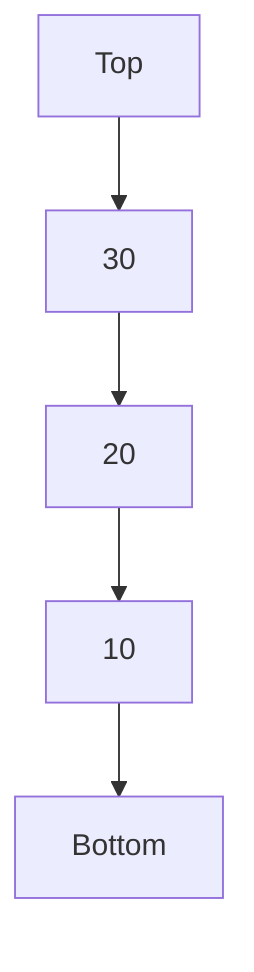
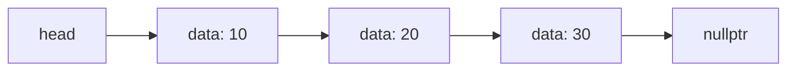
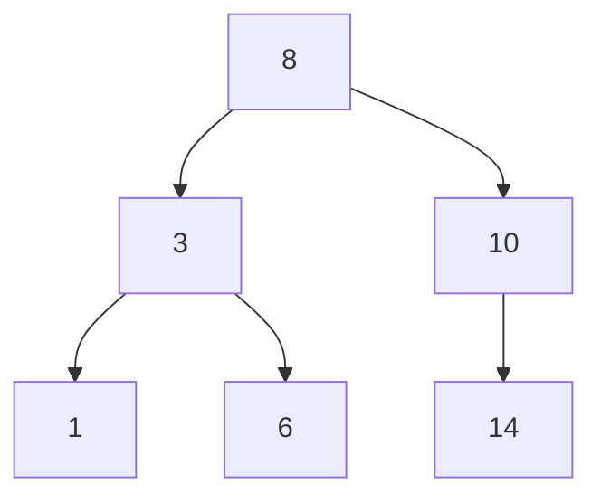
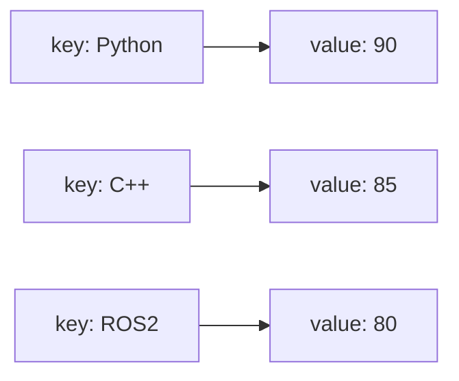
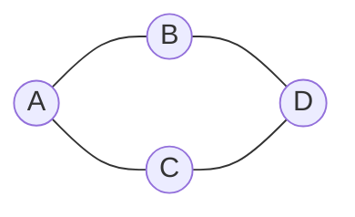
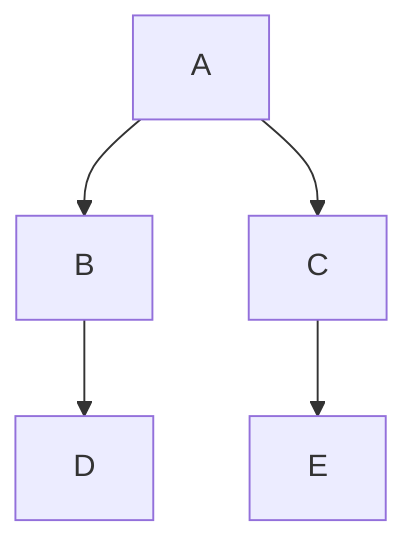
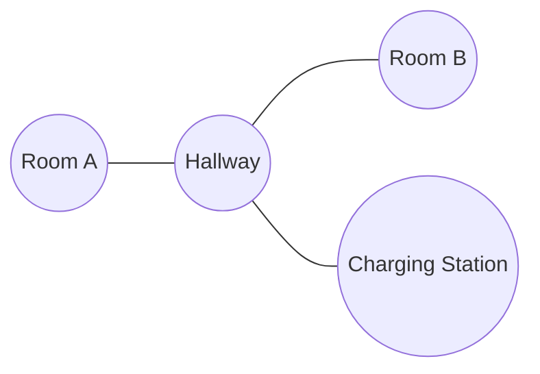

<br>

<div align="center">

# ✨ C++ Knowledge Roadmap
## Clean • Aesthetic • Robotics-Oriented README


</div>

---

## 📌 Overview

README này được thiết kế lại theo hướng **đẹp hơn, gọn hơn, dễ đọc hơn** nhưng vẫn giữ đúng nội dung kiến thức C++ ban đầu.

Mục tiêu:

- Học C++ từ nền tảng đến OOP, STL, DSA, Advanced C++
- Có ví dụ code rõ ràng, dễ copy vào VS Code
- Phù hợp định hướng **Robotics • AI Perception • ROS2 C++**
- Có cấu trúc phase rõ ràng để học theo từng đợt

---

## 🧭 Quick Navigation

| Phase | Nội dung | Chủ đề chính |
|---:|---|---|
| Phase 1 | [Phase 1 — Setup & Basic Syntax](#phase-1-setup-basic-syntax) | Comments • Debugger in VS Code |
| Phase 2 | [Phase 2 — Variables & Basic Data](#phase-2-variables-basic-data) | Variables • Data Types • Type Casting • Auto • Const • Print/Input • Strings |
| Phase 3 | [Phase 3 — Operators & Control Flow](#phase-3-operators-control-flow) | Operators • If Else • Switch • Loops |
| Phase 4 | [Phase 4 — Functions](#phase-4-functions) | Functions • Lambdas • Recursion |
| Phase 5 | [Phase 5 — Arrays, Vectors & References](#phase-5-arrays-vectors-references) | Arrays • Vectors • Pass by Reference |
| Phase 6 | [Phase 6 — Pointers & Memory](#phase-6-pointers-memory) | Addresses • Pointers • Dynamic Memory • nullptr • Dangling Pointer |
| Phase 8 | [Phase 8 — Header Files & Project Structure](#phase-8-header-files-project-structure) | .hpp/.cpp • #pragma once • static • namespace |
| Phase 10 | [Phase 10 — Advanced C++](#phase-10-advanced-c) | Exception Handling • Macros • Templates |
| Phase 11 | [Phase 11 — Ros2 Foundation](#phase-11-ros2-foundation) | Workspace • Package • Node • Topic • Service • Action • Launch |
| Phase 12 | [Phase 12 — Ros2 C++ For Perception](#phase-12-ros2-c-for-perception) | Camera Topics • cv_bridge • OpenCV Node • Detection Pipeline |

---

## 🧱 Learning Style

```text
Concept  →  Syntax  →  Example  →  Common Mistake  →  Cheat Sheet
```

---

## 🗂️ Repository Structure Suggestion

```text
cpp-knowledge-roadmap/
│
├─ README.md
├─ phase_01_basic_syntax/
├─ phase_02_variables_data/
├─ phase_03_control_flow/
├─ phase_04_functions/
├─ phase_05_arrays_vectors_memory/
├─ phase_06_oop/
├─ phase_07_data_structures_1/
├─ phase_08_stl_graph/
├─ phase_09_advanced_cpp/
├─ phase_10_program_organization/
├─ phase_11_cmake_opencv/
└─ phase_12_ros2_perception_cpp/
```

---

## ✅ Suggested Study Order

```text
Phase 1  → Basic Syntax
Phase 2  → Variables / Data / String
Phase 3  → Operators / Control Flow
Phase 4  → Functions / Lambda / Recursion
Phase 5  → Arrays / Vector / Memory
Phase 6  → OOP / Smart Pointer / Virtual
Phase 7  → Stack / Queue / Linked List / BST
Phase 8  → Map / Graph / BFS / DFS
Phase 9  → Exception / Macro / Template
Phase 10 → Namespace / Project Organization
Phase 11 → CMake / OpenCV C++
Phase 12 → ROS2 C++ Perception
```

---

<br>

<div align="center">

# ✦━━━━━━━━━━━━━━━━━━━━━━━━━━━━━━━━━━━━✦
# PHASE 1 — SETUP & BASIC SYNTAX
# Comments • Debugger in VS Code
# ✦━━━━━━━━━━━━━━━━━━━━━━━━━━━━━━━━━━━━✦

</div>

<br>

# 1. C++ Comments

## 1.1. Comment là gì?

`Comment` là phần ghi chú trong code.  
Compiler sẽ bỏ qua comment khi biên dịch chương trình.

Comment dùng để:

- Giải thích code
- Ghi chú công thức
- Mô tả input / output
- Ghi chú thuật toán
- Tạm thời vô hiệu hóa một dòng code
- Làm code dễ đọc hơn

---

## 1.2. Single-line comment

Dùng `//`.

```cpp
// This is a single-line comment
cout << "Hello C++" << endl;
```

Cấu trúc:

```cpp
// nội dung comment
```

---

## 1.3. Inline comment

Comment nằm cuối dòng code.

```cpp
int age = 19;        // student's age
double speed = 1.5;  // unit: m/s
```

Inline comment nên ngắn gọn.

---

## 1.4. Multi-line comment

Dùng:

```cpp
/*
comment line 1
comment line 2
comment line 3
*/
```

Ví dụ:

```cpp
/*
This program calculates
the average score
of a student.
*/
```

---

## 1.5. Comment để tạm tắt code

```cpp
cout << "Start" << endl;

// cout << "This line is disabled" << endl;

cout << "End" << endl;
```

---

## 1.6. Comment để giải thích thuật toán

```cpp
// Step 1: input scores
int mathScore = 8;
int englishScore = 7;
int physicsScore = 9;

// Step 2: calculate total
int total = mathScore + englishScore + physicsScore;

// Step 3: calculate average
double average = total / 3.0;

// Step 4: print result
cout << average << endl;
```

---

## 1.7. Comment để ghi TODO / NOTE

```cpp
// TODO: validate user input
// TODO: handle division by zero
// NOTE: this function assumes time > 0
```

---

## 1.8. Comment tốt và comment chưa tốt

Comment chưa tốt:

```cpp
x = x + 1; // add 1 to x
```

Comment tốt hơn:

```cpp
x = x + 1; // move to the next index in the search range
```

Comment tốt nên giải thích **mục đích**, không chỉ lặp lại code.

---

## 1.9. Cheat Sheet Comments

```cpp
// single-line comment

int x = 10; // inline comment

/*
multi-line comment
*/
```

---

# 2. C++ Debugger in VS Code

## 2.1. Debugger là gì?

Debugger là công cụ giúp theo dõi chương trình khi nó đang chạy.

Debugger giúp:

- Dừng chương trình tại một dòng cụ thể
- Xem giá trị biến
- Chạy từng dòng
- Đi vào function
- Tìm lỗi logic
- Hiểu chương trình hoạt động như thế nào

---

## 2.2. Vì sao cần debugger?

Khi code nhỏ, có thể dùng:

```cpp
cout << variable << endl;
```

Nhưng khi code có:

- nhiều function
- vòng lặp
- if else
- class
- pointer
- vector
- object

thì debugger giúp kiểm tra nhanh hơn.

---

## 2.3. Breakpoint là gì?

`Breakpoint` là điểm dừng chương trình.

Khi chương trình chạy tới breakpoint, nó sẽ tạm dừng để bạn xem biến.

Ví dụ đặt breakpoint ở dòng:

```cpp
total += number;
```

---

## 2.4. Ví dụ debug vòng lặp

```cpp
#include <iostream>
#include <vector>
using namespace std;

int main() {
    vector<int> numbers = {10, 20, 30};
    int total = 0;

    for (int number : numbers) {
        total += number;
    }

    cout << total << endl;

    return 0;
}
```

Đặt breakpoint tại:

```cpp
total += number;
```

Bạn sẽ thấy:

```text
Lần 1: number = 10, total = 0
Lần 2: number = 20, total = 10
Lần 3: number = 30, total = 30
```

---

## 2.5. Các nút Debugger quan trọng

| Nút | Ý nghĩa |
|---|---|
| Continue | Chạy tiếp |
| Step Over | Chạy dòng hiện tại, không đi vào function |
| Step Into | Đi vào bên trong function |
| Step Out | Thoát khỏi function hiện tại |
| Restart | Chạy lại chương trình |
| Stop | Dừng debug |

---

## 2.6. Step Over và Step Into

Ví dụ:

```cpp
#include <iostream>
using namespace std;

int add(int a, int b) {
    int result = a + b;
    return result;
}

int main() {
    int x = 10;
    int y = 20;

    int z = add(x, y);

    cout << z << endl;

    return 0;
}
```

Nếu debugger đang dừng ở:

```cpp
int z = add(x, y);
```

`Step Over`:

```text
Chạy xong hàm add rồi nhảy tới cout
```

`Step Into`:

```text
Đi vào bên trong hàm add để xem a, b, result
```

---

## 2.7. Variables Panel

Variables Panel hiển thị giá trị biến hiện tại.

Ví dụ:

```text
x = 10
y = 20
z = 30
```

Dùng để kiểm tra biến có đúng như mình nghĩ không.

---

## 2.8. Call Stack

Call Stack cho biết chương trình đang ở trong function nào.

Ví dụ:

```text
main()
  calculateAverage()
    add()
```

Nó giúp hiểu luồng gọi hàm.

---

## 2.9. Watch

`Watch` dùng để theo dõi một biểu thức cụ thể.

Ví dụ có thể watch:

```cpp
battery
speed
position.x
numbers[i]
```

---

## 2.10. Debugger khác gì `cout`?

| Cách | Ưu điểm | Nhược điểm |
|---|---|---|
| `cout` | nhanh, đơn giản | phải thêm nhiều dòng in |
| Debugger | xem biến trực tiếp, chạy từng bước | cần setup ban đầu |

---

## 2.11. Ví dụ debug function

```cpp
#include <iostream>
using namespace std;

double calculateAverage(double a, double b, double c) {
    double total = a + b + c;
    double average = total / 3.0;
    return average;
}

int main() {
    double result = calculateAverage(8, 7, 9);

    cout << result << endl;

    return 0;
}
```

Nên đặt breakpoint tại:

```cpp
double total = a + b + c;
double average = total / 3.0;
return average;
```

---

## 2.12. Debug pointer

Debugger đặc biệt hữu ích khi học pointer.

```cpp
#include <iostream>
using namespace std;

int main() {
    int x = 10;
    int* ptr = &x;

    cout << x << endl;
    cout << ptr << endl;
    cout << *ptr << endl;

    return 0;
}
```

Khi debug, bạn có thể quan sát:

```text
x    -> giá trị 10
ptr  -> địa chỉ của x
*ptr -> giá trị tại địa chỉ ptr trỏ tới
```

---

## 2.13. Cách tư duy khi debug

Khi debug, luôn hỏi:

```text
1. Chương trình đang dừng ở dòng nào?
2. Biến hiện tại có giá trị bao nhiêu?
3. Dòng tiếp theo sẽ thay đổi biến nào?
4. Kết quả có đúng như mình kỳ vọng không?
```

---

## 2.14. Cheat Sheet Debugger

```text
F5          -> Start debugging
Breakpoint  -> Dừng tại dòng code
Continue    -> Chạy tiếp
Step Over   -> Chạy dòng hiện tại
Step Into   -> Đi vào function
Step Out    -> Thoát khỏi function
Watch       -> Theo dõi biến / biểu thức
Stop        -> Dừng debug
```

---

# End of Phase 1

<div align="center">

## ✅ Phase 1 Completed  
### Setup & Basic Syntax: Comments • Debugger in VS Code

</div>

<br>

<div align="center">

# ✦━━━━━━━━━━━━━━━━━━━━━━━━━━━━━━━━━━━━✦
# PHASE 2 — VARIABLES & BASIC DATA
# Variables • Data Types • Type Casting • Auto • Const • Print/Input • Strings
# ✦━━━━━━━━━━━━━━━━━━━━━━━━━━━━━━━━━━━━✦

</div>

<br>

# 3. C++ Variables and Data Types

## 3.1. Variable là gì?

`Variable` là biến, dùng để lưu dữ liệu trong chương trình.

Ví dụ:

```cpp
int age = 19;
double height = 1.67;
string name = "Dang";
```

Biến gồm 3 phần chính:

```text
data_type variable_name = value;
```

---

## 3.2. Công dụng của biến

Biến dùng để:

- Lưu dữ liệu
- Tính toán
- Truyền dữ liệu vào function
- Lưu trạng thái chương trình
- Làm code dễ đọc hơn

Ví dụ:

```cpp
double distance = 100.0;
double time = 20.0;

double speed = distance / time;

cout << speed << endl;
```

---

## 3.3. Cấu trúc khai báo biến

```cpp
dataType variableName = value;
```

Ví dụ:

```cpp
int score = 90;
double speed = 1.25;
char grade = 'A';
bool isActive = true;
string robotName = "Optimus";
```

---

## 3.4. Khác Python ở điểm nào?

Python:

```python
age = 19
```

C++:

```cpp
int age = 19;
```

Trong C++, bạn thường phải khai báo kiểu dữ liệu trước biến.

---

## 3.5. Quy tắc đặt tên biến

Tên biến hợp lệ:

```cpp
int studentAge = 19;
double robotSpeed = 1.5;
bool isActive = true;
```

Tên biến không hợp lệ:

```cpp
int 1age = 19;        // sai
double robot-speed;   // sai
string my name;       // sai
int class = 10;       // sai
```

Quy tắc:

```text
Không bắt đầu bằng số
Không dùng khoảng trắng
Không dùng ký tự đặc biệt như -, @, !
Không dùng keyword của C++
```

---

## 3.6. Quy ước đặt tên

Trong C++ hay dùng:

```cpp
camelCase
```

Ví dụ:

```cpp
int studentAge = 19;
double robotSpeed = 1.5;
string cameraName = "Stereo Camera";
```

Tên class thường dùng PascalCase:

```cpp
class RobotController {
};
```

---

## 3.7. Các kiểu dữ liệu cơ bản

```cpp
int myInt = 10;
float myFloat = 1.5f;
double myDouble = 3.14159;
char myChar = 'A';
bool myBool = true;
string myString = "Hello C++";
```

---

## 3.8. Bảng Data Types

| Kiểu | Ví dụ | Ý nghĩa |
|---|---|---|
| `int` | `int x = 10;` | Số nguyên |
| `float` | `float x = 1.5f;` | Số thực độ chính xác thấp hơn double |
| `double` | `double x = 3.14;` | Số thực phổ biến |
| `char` | `char c = 'A';` | Một ký tự |
| `bool` | `bool ok = true;` | Đúng / sai |
| `string` | `string s = "Hello";` | Chuỗi ký tự |

---

## 3.9. `int`

`int` dùng để lưu số nguyên.

```cpp
int age = 19;
int score = 100;
int temperature = -5;
```

Dùng cho:

- tuổi
- điểm số
- số lượng
- index
- số lần lặp

---

## 3.10. `float`

`float` lưu số thực nhưng độ chính xác thấp hơn `double`.

```cpp
float speed = 1.5f;
```

Lưu ý thường có chữ `f` phía sau:

```cpp
float x = 3.14f;
```

---

## 3.11. `double`

`double` là kiểu số thực phổ biến hơn `float`.

```cpp
double height = 1.67;
double pi = 3.1415926535;
```

Dùng cho:

- tọa độ
- vận tốc
- tính toán khoa học
- robotics
- computer vision

---

## 3.12. `char`

`char` lưu một ký tự, dùng dấu nháy đơn.

```cpp
char grade = 'A';
char symbol = '#';
```

Sai:

```cpp
char grade = "A"; // sai vì "A" là string
```

---

## 3.13. `bool`

`bool` chỉ có 2 giá trị:

```cpp
true
false
```

Ví dụ:

```cpp
bool isActive = true;
bool obstacleDetected = false;
```

Dùng nhiều trong điều kiện:

```cpp
if (isActive) {
    cout << "Robot is active" << endl;
}
```

---

## 3.14. `string`

`string` dùng để lưu chuỗi ký tự.

Cần include:

```cpp
#include <string>
```

Ví dụ:

```cpp
string name = "Dang";
string robotName = "Optimus";
```

---

## 3.15. Khởi tạo biến

Có nhiều cách khởi tạo:

```cpp
int a = 10;
int b(20);
int c{30};
```

Cách hiện đại thường dùng:

```cpp
int c{30};
```

---

## 3.16. Khai báo nhiều biến

```cpp
int a = 1, b = 2, c = 3;
```

Nhưng để dễ đọc, nên viết:

```cpp
int a = 1;
int b = 2;
int c = 3;
```

---

## 3.17. Giá trị rác

Nếu khai báo biến mà không gán giá trị:

```cpp
int x;
cout << x << endl;
```

`x` có thể chứa giá trị rác.

Nên luôn khởi tạo:

```cpp
int x = 0;
```

---

## 3.18. Ví dụ tổng hợp

```cpp
#include <iostream>
#include <string>
using namespace std;

int main() {
    string robotName = "Mini Humanoid";
    int robotId = 101;
    double height = 1.25;
    bool isActive = true;
    char mode = 'A';

    cout << "Robot: " << robotName << endl;
    cout << "ID: " << robotId << endl;
    cout << "Height: " << height << endl;
    cout << "Active: " << isActive << endl;
    cout << "Mode: " << mode << endl;

    return 0;
}
```

---

## 3.19. Cheat Sheet Variables

```cpp
int age = 19;
float speed = 1.5f;
double height = 1.67;
char grade = 'A';
bool isActive = true;
string name = "Dang";

dataType variableName = value;
```

---

# 4. C++ Type Casting

## 4.1. Type Casting là gì?

Type Casting là ép kiểu dữ liệu từ kiểu này sang kiểu khác.

Ví dụ:

```cpp
double x = 10.5;
int y = static_cast<int>(x);
```

Ở đây:

```text
x là double
y là int
```

---

## 4.2. Công dụng của Type Casting

Type casting dùng để:

- Chuyển số thực sang số nguyên
- Chuyển số nguyên sang số thực
- Tránh chia nguyên
- Chuyển enum sang int
- Làm rõ ý định trong code

---

## 4.3. C-style cast

```cpp
int y = (int)x;
```

Ví dụ:

```cpp
double x = 10.9;
int y = (int)x;

cout << y << endl;
```

Output:

```text
10
```

---

## 4.4. `static_cast`

Cách hiện đại và rõ ràng hơn:

```cpp
int y = static_cast<int>(x);
```

Ví dụ:

```cpp
double x = 10.9;

int y = static_cast<int>(x);

cout << y << endl;
```

---

## 4.5. Chia nguyên và chia thực

```cpp
int a = 5;
int b = 2;

cout << a / b << endl;
```

Output:

```text
2
```

Vì `a` và `b` đều là `int`.

Muốn ra `2.5`:

```cpp
cout << static_cast<double>(a) / b << endl;
```

---

## 4.6. Ép `int` sang `double`

```cpp
int x = 10;
double y = static_cast<double>(x);

cout << y << endl;
```

---

## 4.7. Ép `double` sang `int`

```cpp
double x = 3.99;
int y = static_cast<int>(x);

cout << y << endl;
```

Output:

```text
3
```

C++ bỏ phần thập phân, không làm tròn.

---

## 4.8. Ép `char` sang `int`

```cpp
char c = 'A';

int asciiValue = static_cast<int>(c);

cout << asciiValue << endl;
```

Output thường là:

```text
65
```

---

## 4.9. Ép `int` sang `char`

```cpp
int value = 65;

char c = static_cast<char>(value);

cout << c << endl;
```

Output:

```text
A
```

---

## 4.10. Ép `bool`

```cpp
cout << static_cast<bool>(0) << endl;
cout << static_cast<bool>(10) << endl;
```

Output:

```text
0
1
```

Trong C++:

```text
0     -> false
khác 0 -> true
```

---

## 4.11. Cheat Sheet Type Casting

```cpp
static_cast<int>(value);
static_cast<double>(value);
static_cast<float>(value);
static_cast<char>(value);
static_cast<bool>(value);

int y = static_cast<int>(x);
double z = static_cast<double>(a) / b;
```

---

# 5. C++ Auto

## 5.1. `auto` là gì?

`auto` cho phép compiler tự suy luận kiểu dữ liệu.

Ví dụ:

```cpp
auto x = 10;
auto y = 3.14;
auto name = "Dang";
```

Compiler tự hiểu:

```text
x -> int
y -> double
name -> const char*
```

---

## 5.2. Công dụng của `auto`

`auto` dùng để:

- Code ngắn hơn
- Tránh viết kiểu quá dài
- Hữu ích với iterator
- Hữu ích với template
- Hữu ích với STL containers

---

## 5.3. Ví dụ cơ bản

```cpp
auto age = 19;
auto height = 1.67;
auto isActive = true;
```

---

## 5.4. Auto với vector

```cpp
#include <iostream>
#include <vector>
using namespace std;

int main() {
    vector<int> numbers = {1, 2, 3};

    for (auto number : numbers) {
        cout << number << endl;
    }

    return 0;
}
```

---

## 5.5. Auto với iterator

Không dùng auto:

```cpp
vector<int>::iterator it = numbers.begin();
```

Dùng auto:

```cpp
auto it = numbers.begin();
```

---

## 5.6. Lưu ý với `auto`

`auto` cần giá trị khởi tạo:

```cpp
auto x = 10; // đúng
auto y;      // sai
```

Không nên lạm dụng nếu làm code khó hiểu.

---

## 5.7. Cheat Sheet Auto

```cpp
auto x = 10;
auto y = 3.14;
auto z = true;

for (auto item : container) {
    ...
}

auto it = container.begin();
```

---

# 6. C++ Const

## 6.1. `const` là gì?

`const` dùng để tạo biến hằng, nghĩa là giá trị không được thay đổi sau khi khởi tạo.

```cpp
const double PI = 3.14159;
```

---

## 6.2. Công dụng của `const`

`const` dùng để:

- Bảo vệ dữ liệu không bị sửa nhầm
- Biểu diễn hằng số
- Làm code rõ ý nghĩa hơn
- Giúp compiler phát hiện lỗi
- Dùng nhiều trong function parameter và class

---

## 6.3. Ví dụ const cơ bản

```cpp
const int MAX_SPEED = 10;
const double PI = 3.14159;
```

Sai:

```cpp
PI = 3.14; // không được
```

---

## 6.4. Const với function parameter

```cpp
void printName(const string& name) {
    cout << name << endl;
}
```

Ý nghĩa:

```text
Truyền tham chiếu để tránh copy
const để không cho function sửa name
```

---

## 6.5. Const với pointer

Pointer có 3 dạng hay gặp.

### Pointer tới const data

```cpp
const int* ptr = &x;
```

Không được sửa giá trị thông qua pointer.

### Const pointer

```cpp
int* const ptr = &x;
```

Không được đổi pointer trỏ sang nơi khác.

### Const pointer tới const data

```cpp
const int* const ptr = &x;
```

Không được sửa data và không được đổi địa chỉ trỏ.

---

## 6.6. Cheat Sheet Const

```cpp
const int MAX_VALUE = 100;
const double PI = 3.14159;

void function(const string& text) {
}

const int* ptr;
int* const ptr;
const int* const ptr;
```

---

# 7. C++ Print and Input

## 7.1. `cout` là gì?

`cout` dùng để in dữ liệu ra màn hình.

Cần include:

```cpp
#include <iostream>
```

Dùng:

```cpp
cout << "Hello C++" << endl;
```

---

## 7.2. Cấu trúc cout

```cpp
cout << value;
```

In nhiều giá trị:

```cpp
cout << "Age: " << age << endl;
```

---

## 7.3. `endl` là gì?

`endl` dùng để xuống dòng và flush output.

```cpp
cout << "Line 1" << endl;
cout << "Line 2" << endl;
```

Có thể dùng:

```cpp
cout << "Line 1\n";
```

---

## 7.4. Ví dụ cout

```cpp
#include <iostream>
using namespace std;

int main() {
    int age = 19;
    double height = 1.67;

    cout << "Age: " << age << endl;
    cout << "Height: " << height << endl;

    return 0;
}
```

---

## 7.5. `cin` là gì?

`cin` dùng để nhập dữ liệu từ bàn phím.

```cpp
cin >> variable;
```

Ví dụ:

```cpp
int age;

cout << "Enter age: ";
cin >> age;

cout << "Age: " << age << endl;
```

---

## 7.6. Nhập nhiều biến

```cpp
int a;
int b;

cin >> a >> b;
```

---

## 7.7. Nhập string một từ

```cpp
string name;

cin >> name;
```

Nếu nhập:

```text
Dang Bui
```

thì `cin` chỉ lấy `Dang`.

---

## 7.8. Nhập cả dòng với `getline`

```cpp
string fullName;

getline(cin, fullName);
```

Ví dụ:

```cpp
#include <iostream>
#include <string>
using namespace std;

int main() {
    string fullName;

    cout << "Enter full name: ";
    getline(cin, fullName);

    cout << "Full name: " << fullName << endl;

    return 0;
}
```

---

## 7.9. Lỗi `cin` trước `getline`

Nếu dùng `cin` trước `getline`, có thể cần:

```cpp
cin.ignore();
```

Ví dụ:

```cpp
int age;
string fullName;

cout << "Enter age: ";
cin >> age;

cin.ignore();

cout << "Enter full name: ";
getline(cin, fullName);
```

---

## 7.10. Format số thập phân

Cần include:

```cpp
#include <iomanip>
```

Dùng:

```cpp
cout << fixed << setprecision(2) << value << endl;
```

Ví dụ:

```cpp
#include <iostream>
#include <iomanip>
using namespace std;

int main() {
    double pi = 3.1415926535;

    cout << fixed << setprecision(2) << pi << endl;

    return 0;
}
```

Output:

```text
3.14
```

---

## 7.11. Ví dụ input/output thực tế

```cpp
#include <iostream>
#include <iomanip>
using namespace std;

int main() {
    double distance;
    double time;

    cout << "Enter distance: ";
    cin >> distance;

    cout << "Enter time: ";
    cin >> time;

    double speed = distance / time;

    cout << fixed << setprecision(2);
    cout << "Speed = " << speed << " m/s" << endl;

    return 0;
}
```

---

## 7.12. Cheat Sheet Print/Input

```cpp
#include <iostream>
#include <iomanip>
using namespace std;

cout << "Hello" << endl;
cout << "Value: " << value << endl;

cin >> variable;

getline(cin, text);

cin.ignore();

cout << fixed << setprecision(2) << number << endl;
```

---

# 8. C++ Strings

## 8.1. String là gì?

`string` dùng để lưu chuỗi ký tự.

Cần include:

```cpp
#include <string>
```

Ví dụ:

```cpp
string name = "Dang";
string robotName = "Optimus";
```

---

## 8.2. Công dụng của string

String dùng để lưu:

- tên
- câu văn
- command
- file path
- topic name
- message
- trạng thái robot

---

## 8.3. Khởi tạo string

```cpp
string text = "Hello";
string name("Dang");
string empty = "";
```

---

## 8.4. Truy cập ký tự bằng index

```cpp
string text = "Hello";

cout << text[0] << endl;
cout << text[1] << endl;
```

---

## 8.5. Độ dài string

```cpp
string text = "Hello";

cout << text.length() << endl;
cout << text.size() << endl;
```

---

## 8.6. Nối string

```cpp
string firstName = "Dang";
string lastName = "Bui";

string fullName = firstName + " " + lastName;

cout << fullName << endl;
```

---

## 8.7. Thêm vào cuối string

```cpp
string text = "Hello";

text += " C++";

cout << text << endl;
```

---

## 8.8. `substr`

Lấy chuỗi con.

```cpp
string text = "Hello C++";

string sub = text.substr(0, 5);

cout << sub << endl;
```

Cấu trúc:

```cpp
string.substr(start, length);
```

---

## 8.9. `find`

Tìm vị trí chuỗi con.

```cpp
string text = "Hello C++";

size_t pos = text.find("C++");

cout << pos << endl;
```

Nếu không tìm thấy, trả về:

```cpp
string::npos
```

Kiểm tra:

```cpp
if (text.find("C++") != string::npos) {
    cout << "Found" << endl;
}
```

---

## 8.10. `replace`

```cpp
string text = "I like Python";

text.replace(7, 6, "C++");

cout << text << endl;
```

Cấu trúc:

```cpp
string.replace(start, length, newString);
```

---

## 8.11. `erase`

```cpp
string text = "Hello C++";

text.erase(5, 4);

cout << text << endl;
```

---

## 8.12. `insert`

```cpp
string text = "Hello";

text.insert(5, " C++");

cout << text << endl;
```

---

## 8.13. Duyệt string

```cpp
string text = "Robot";

for (char c : text) {
    cout << c << endl;
}
```

Duyệt bằng index:

```cpp
for (int i = 0; i < text.size(); i++) {
    cout << text[i] << endl;
}
```

---

## 8.14. So sánh string

```cpp
string a = "hello";
string b = "hello";

if (a == b) {
    cout << "Equal" << endl;
}
```

---

## 8.15. Chuyển string sang số

Cần include:

```cpp
#include <string>
```

```cpp
string text = "123";

int number = stoi(text);

cout << number + 1 << endl;
```

Các hàm:

```cpp
stoi(text);   // string to int
stof(text);   // string to float
stod(text);   // string to double
```

---

## 8.16. Chuyển số sang string

```cpp
int age = 19;

string text = to_string(age);

cout << text << endl;
```

---

## 8.17. Ví dụ xử lý command

```cpp
#include <iostream>
#include <string>
using namespace std;

int main() {
    string command = "move_forward";

    if (command == "move_forward") {
        cout << "Robot moves forward" << endl;
    } else if (command == "stop") {
        cout << "Robot stops" << endl;
    }

    return 0;
}
```

---

## 8.18. Ví dụ xử lý file name

```cpp
#include <iostream>
#include <string>
using namespace std;

int main() {
    string fileName = "image_001.png";

    if (fileName.find(".png") != string::npos) {
        cout << "This is a PNG image" << endl;
    }

    return 0;
}
```

---

## 8.19. Cheat Sheet String

```cpp
#include <string>

string text = "Hello";

text[0];

text.length();
text.size();

text + " World";
text += " C++";

text.substr(start, length);
text.find("word");
text.replace(start, length, "new");
text.erase(start, length);
text.insert(index, "text");

stoi(text);
stof(text);
stod(text);
to_string(number);
```

---

# End of Phase 2

<div align="center">

## ✅ Phase 2 Completed  
### Variables & Basic Data: Variables • Data Types • Type Casting • Auto • Const • Print/Input • Strings

</div>

<br>

<div align="center">

# ✦━━━━━━━━━━━━━━━━━━━━━━━━━━━━━━━━━━━━✦
# PHASE 3 — OPERATORS & CONTROL FLOW
# Operators • If Else • Switch • Loops
# ✦━━━━━━━━━━━━━━━━━━━━━━━━━━━━━━━━━━━━✦

</div>

<br>

# 9. C++ Operators

## 9.1. Operator là gì?

`Operator` là toán tử dùng để thao tác trên dữ liệu.

Ví dụ:

```cpp
int a = 10;
int b = 3;

int sum = a + b;
int diff = a - b;
```

Ở đây:

```text
+  -> toán tử cộng
-  -> toán tử trừ
```

---

## 9.2. Các nhóm operator quan trọng trong C++

C++ có nhiều loại toán tử, nhưng ở giai đoạn đầu bạn cần nắm chắc các nhóm sau:

- Arithmetic Operators
- Assignment Operators
- Comparison Operators
- Logical Operators
- Increment / Decrement Operators

---

## 9.3. Arithmetic Operators

Dùng để tính toán số học.

| Toán tử | Ý nghĩa | Ví dụ |
|---|---|---|
| `+` | cộng | `a + b` |
| `-` | trừ | `a - b` |
| `*` | nhân | `a * b` |
| `/` | chia | `a / b` |
| `%` | chia lấy dư | `a % b` |

Ví dụ:

```cpp
#include <iostream>
using namespace std;

int main() {
    int a = 10;
    int b = 3;

    cout << "a + b = " << a + b << endl;
    cout << "a - b = " << a - b << endl;
    cout << "a * b = " << a * b << endl;
    cout << "a / b = " << a / b << endl;
    cout << "a % b = " << a % b << endl;

    return 0;
}
```

Output:

```text
a + b = 13
a - b = 7
a * b = 30
a / b = 3
a % b = 1
```

---

## 9.4. Chia nguyên vs chia thực

Nếu cả 2 toán hạng đều là `int`, kết quả sẽ là chia nguyên.

```cpp
int a = 5;
int b = 2;

cout << a / b << endl;
```

Output:

```text
2
```

Muốn ra số thực:

```cpp
cout << static_cast<double>(a) / b << endl;
```

Output:

```text
2.5
```

---

## 9.5. Modulo `%`

`%` trả về phần dư của phép chia nguyên.

```cpp
cout << 10 % 3 << endl; // 1
cout << 20 % 5 << endl; // 0
```

Ứng dụng:

- kiểm tra số chẵn / lẻ
- xử lý chu kỳ
- hashing đơn giản
- index vòng lặp

Ví dụ kiểm tra số chẵn:

```cpp
if (number % 2 == 0) {
    cout << "Even" << endl;
}
```

---

## 9.6. Assignment Operators

Dùng để gán giá trị.

| Toán tử | Ý nghĩa | Ví dụ |
|---|---|---|
| `=` | gán | `a = 10` |
| `+=` | cộng rồi gán | `a += 5` |
| `-=` | trừ rồi gán | `a -= 5` |
| `*=` | nhân rồi gán | `a *= 2` |
| `/=` | chia rồi gán | `a /= 2` |
| `%=` | chia dư rồi gán | `a %= 3` |

Ví dụ:

```cpp
#include <iostream>
using namespace std;

int main() {
    int x = 10;

    x += 5;   // x = x + 5
    cout << x << endl; // 15

    x -= 3;   // x = x - 3
    cout << x << endl; // 12

    x *= 2;   // x = x * 2
    cout << x << endl; // 24

    x /= 4;   // x = x / 4
    cout << x << endl; // 6

    x %= 4;   // x = x % 4
    cout << x << endl; // 2

    return 0;
}
```

---

## 9.7. Comparison Operators

Dùng để so sánh hai giá trị.  
Kết quả trả về là `bool` (`true` hoặc `false`).

| Toán tử | Ý nghĩa | Ví dụ |
|---|---|---|
| `==` | bằng | `a == b` |
| `!=` | khác | `a != b` |
| `>` | lớn hơn | `a > b` |
| `<` | nhỏ hơn | `a < b` |
| `>=` | lớn hơn hoặc bằng | `a >= b` |
| `<=` | nhỏ hơn hoặc bằng | `a <= b` |

Ví dụ:

```cpp
#include <iostream>
using namespace std;

int main() {
    int a = 10;
    int b = 20;

    cout << (a == b) << endl;
    cout << (a != b) << endl;
    cout << (a < b) << endl;
    cout << (a >= b) << endl;

    return 0;
}
```

Output:

```text
0
1
1
0
```

---

## 9.8. Logical Operators

Dùng để kết hợp nhiều điều kiện.

| Toán tử | Ý nghĩa | Ví dụ |
|---|---|---|
| `&&` | AND | `a > 0 && b > 0` |
| `||` | OR | `a > 0 || b > 0` |
| `!` | NOT | `!isActive` |

---

## 9.9. `&&` — Logical AND

Điều kiện chỉ đúng khi **mọi vế đều đúng**.

```cpp
int battery = 80;
bool obstacleDetected = false;

if (battery > 20 && !obstacleDetected) {
    cout << "Robot can move" << endl;
}
```

---

## 9.10. `||` — Logical OR

Điều kiện đúng nếu **ít nhất một vế đúng**.

```cpp
int score = 95;
bool hasBonus = false;

if (score >= 90 || hasBonus) {
    cout << "Pass special condition" << endl;
}
```

---

## 9.11. `!` — Logical NOT

Đảo ngược giá trị boolean.

```cpp
bool isActive = false;

cout << !isActive << endl;
```

Output:

```text
1
```

---

## 9.12. Prefix và Postfix

C++ có hai toán tử tăng / giảm:

| Toán tử | Ý nghĩa |
|---|---|
| `++x` | tăng trước rồi mới dùng |
| `x++` | dùng trước rồi mới tăng |
| `--x` | giảm trước rồi mới dùng |
| `x--` | dùng trước rồi mới giảm |

---

## 9.13. Prefix Increment `++x`

```cpp
int x = 5;
int y = ++x;
```

Quy trình:

```text
x tăng thành 6
y nhận giá trị 6
```

Kết quả:

```cpp
x = 6
y = 6
```

---

## 9.14. Postfix Increment `x++`

```cpp
int x = 5;
int y = x++;
```

Quy trình:

```text
y nhận giá trị cũ của x là 5
sau đó x mới tăng thành 6
```

Kết quả:

```cpp
x = 6
y = 5
```

---

## 9.15. Ví dụ Prefix vs Postfix

```cpp
#include <iostream>
using namespace std;

int main() {
    int a = 5;
    int b = ++a;

    cout << "a = " << a << ", b = " << b << endl;

    int x = 5;
    int y = x++;

    cout << "x = " << x << ", y = " << y << endl;

    return 0;
}
```

Output:

```text
a = 6, b = 6
x = 6, y = 5
```

---

## 9.16. Decrement `--`

```cpp
int x = 10;

cout << --x << endl; // 9
cout << x-- << endl; // 9
cout << x << endl;   // 8
```

---

## 9.17. Cheat Sheet Operators

```cpp
// Arithmetic
a + b
a - b
a * b
a / b
a % b

// Assignment
x = 10
x += 5
x -= 2
x *= 3
x /= 2
x %= 4

// Comparison
a == b
a != b
a > b
a < b
a >= b
a <= b

// Logical
cond1 && cond2
cond1 || cond2
!cond

// Increment / Decrement
++x
x++
--x
x--
```

---

# 10. C++ If Else

## 10.1. If Else là gì?

`if else` là cấu trúc điều kiện, cho phép chương trình chọn nhánh thực thi tùy theo điều kiện đúng hay sai.

Ví dụ:

```cpp
if (battery > 20) {
    cout << "Robot can move" << endl;
} else {
    cout << "Battery too low" << endl;
}
```

---

## 10.2. Cấu trúc `if`

```cpp
if (condition) {
    // code chạy nếu condition đúng
}
```

Ví dụ:

```cpp
int battery = 80;

if (battery > 50) {
    cout << "Battery is good" << endl;
}
```

---

## 10.3. Cấu trúc `if else`

```cpp
if (condition) {
    // nếu đúng
} else {
    // nếu sai
}
```

Ví dụ:

```cpp
int battery = 10;

if (battery > 20) {
    cout << "Robot can move" << endl;
} else {
    cout << "Robot cannot move" << endl;
}
```

---

## 10.4. Cấu trúc `if else if else`

```cpp
if (condition1) {
    ...
} else if (condition2) {
    ...
} else {
    ...
}
```

Ví dụ:

```cpp
int score = 85;

if (score >= 90) {
    cout << "Excellent" << endl;
} else if (score >= 75) {
    cout << "Good" << endl;
} else if (score >= 50) {
    cout << "Average" << endl;
} else {
    cout << "Fail" << endl;
}
```

---

## 10.5. Dùng `&&` trong if

```cpp
int battery = 80;
bool obstacleDetected = false;

if (battery > 20 && !obstacleDetected) {
    cout << "Robot can move safely" << endl;
}
```

---

## 10.6. Dùng `||` trong if

```cpp
bool manualOverride = true;
bool autoPermission = false;

if (manualOverride || autoPermission) {
    cout << "Movement allowed" << endl;
}
```

---

## 10.7. So sánh string trong if

```cpp
#include <iostream>
#include <string>
using namespace std;

int main() {
    string command = "move";

    if (command == "move") {
        cout << "Robot moves" << endl;
    } else if (command == "stop") {
        cout << "Robot stops" << endl;
    } else {
        cout << "Unknown command" << endl;
    }

    return 0;
}
```

---

## 10.8. If lồng nhau

```cpp
int battery = 80;
bool isConnected = true;

if (battery > 20) {
    if (isConnected) {
        cout << "Robot is ready" << endl;
    } else {
        cout << "Robot has no connection" << endl;
    }
}
```

---

## 10.9. Lỗi thường gặp với `if`

### Lỗi 1: quên `{}` khi code nhiều dòng

Sai:

```cpp
if (battery > 20)
    cout << "Battery OK" << endl;
    cout << "Robot can move" << endl;
```

Ở đây chỉ dòng đầu thuộc `if`.

Nên viết:

```cpp
if (battery > 20) {
    cout << "Battery OK" << endl;
    cout << "Robot can move" << endl;
}
```

---

## 10.10. Lỗi 2: nhầm `=` với `==`

Sai:

```cpp
if (score = 10) {
}
```

Đúng:

```cpp
if (score == 10) {
}
```

---

## 10.11. Ví dụ thực tế: phân loại pin robot

```cpp
#include <iostream>
using namespace std;

int main() {
    int battery = 45;

    if (battery >= 80) {
        cout << "Battery level: High" << endl;
    } else if (battery >= 40) {
        cout << "Battery level: Medium" << endl;
    } else if (battery > 0) {
        cout << "Battery level: Low" << endl;
    } else {
        cout << "Battery empty" << endl;
    }

    return 0;
}
```

---

## 10.12. Cheat Sheet If Else

```cpp
if (condition) {
    ...
}

if (condition) {
    ...
} else {
    ...
}

if (condition1) {
    ...
} else if (condition2) {
    ...
} else {
    ...
}
```

---

# 11. C++ Switch

## 11.1. Switch là gì?

`switch` là cấu trúc rẽ nhánh nhiều trường hợp, thường dùng khi một biến có nhiều giá trị rời rạc.

Ví dụ:

- menu chọn chức năng
- mode robot
- trạng thái điều khiển
- lựa chọn số

---

## 11.2. Cấu trúc switch

```cpp
switch (expression) {
    case value1:
        ...
        break;

    case value2:
        ...
        break;

    default:
        ...
        break;
}
```

---

## 11.3. Ví dụ switch cơ bản

```cpp
#include <iostream>
using namespace std;

int main() {
    int option = 2;

    switch (option) {
        case 1:
            cout << "Open camera" << endl;
            break;

        case 2:
            cout << "Move robot" << endl;
            break;

        case 3:
            cout << "Stop robot" << endl;
            break;

        default:
            cout << "Invalid option" << endl;
            break;
    }

    return 0;
}
```

---

## 11.4. `break` dùng để làm gì?

`break` giúp thoát khỏi `switch` sau khi chạy xong một case.

Nếu quên `break`, chương trình sẽ chạy tiếp các case phía dưới.

---

## 11.5. Fallthrough là gì?

Ví dụ:

```cpp
int x = 1;

switch (x) {
    case 1:
        cout << "One" << endl;
    case 2:
        cout << "Two" << endl;
        break;
}
```

Output:

```text
One
Two
```

Vì case 1 không có `break`, nên rơi tiếp sang case 2.

---

## 11.6. `default`

`default` chạy khi không khớp case nào.

```cpp
switch (command) {
    case 1:
        ...
        break;

    default:
        cout << "Unknown command" << endl;
        break;
}
```

---

## 11.7. Switch với `char`

```cpp
#include <iostream>
using namespace std;

int main() {
    char grade = 'A';

    switch (grade) {
        case 'A':
            cout << "Excellent" << endl;
            break;

        case 'B':
            cout << "Good" << endl;
            break;

        case 'C':
            cout << "Average" << endl;
            break;

        default:
            cout << "Unknown grade" << endl;
            break;
    }

    return 0;
}
```

---

## 11.8. Khi nào dùng switch, khi nào dùng if else?

### Dùng `switch` khi:
- so sánh một biến với nhiều giá trị rời rạc
- menu chọn chức năng
- code dễ đọc hơn if else dài

### Dùng `if else` khi:
- điều kiện phức tạp
- dùng `&&`, `||`
- so sánh khoảng giá trị
- kiểm tra nhiều biến cùng lúc

---

## 11.9. Ví dụ thực tế: menu robot

```cpp
#include <iostream>
using namespace std;

int main() {
    int command;

    cout << "1. Move Forward" << endl;
    cout << "2. Turn Left" << endl;
    cout << "3. Stop" << endl;
    cout << "Choose command: ";
    cin >> command;

    switch (command) {
        case 1:
            cout << "Robot moves forward" << endl;
            break;

        case 2:
            cout << "Robot turns left" << endl;
            break;

        case 3:
            cout << "Robot stops" << endl;
            break;

        default:
            cout << "Invalid command" << endl;
            break;
    }

    return 0;
}
```

---

## 11.10. Cheat Sheet Switch

```cpp
switch (expression) {
    case value1:
        ...
        break;

    case value2:
        ...
        break;

    default:
        ...
        break;
}
```

---

# 12. C++ Loops

## 12.1. Loop là gì?

`Loop` là vòng lặp, dùng để thực hiện một đoạn code nhiều lần.

C++ có 3 vòng lặp cơ bản:

- `for`
- `while`
- `do while`

---

## 12.2. Vì sao cần loop?

Nếu không có loop, muốn in 100 lần phải viết 100 dòng.

Loop giúp:

- lặp xử lý dữ liệu
- duyệt mảng / vector / string
- đọc sensor liên tục
- tính tổng, đếm, tìm kiếm
- xử lý thuật toán

---

## 12.3. `for` loop

Cấu trúc:

```cpp
for (initialization; condition; update) {
    ...
}
```

Ví dụ:

```cpp
for (int i = 0; i < 5; i++) {
    cout << i << endl;
}
```

Output:

```text
0
1
2
3
4
```

---

## 12.4. Phân tích `for`

```cpp
for (int i = 0; i < 5; i++) {
    ...
}
```

- `int i = 0` → khởi tạo
- `i < 5` → điều kiện còn lặp
- `i++` → cập nhật sau mỗi vòng

---

## 12.5. `while` loop

Cấu trúc:

```cpp
while (condition) {
    ...
}
```

Ví dụ:

```cpp
int i = 0;

while (i < 5) {
    cout << i << endl;
    i++;
}
```

---

## 12.6. `do while` loop

Cấu trúc:

```cpp
do {
    ...
} while (condition);
```

Khác với `while`: `do while` chạy ít nhất 1 lần rồi mới kiểm tra điều kiện.

Ví dụ:

```cpp
int i = 0;

do {
    cout << i << endl;
    i++;
} while (i < 5);
```

---

## 12.7. So sánh `for`, `while`, `do while`

| Loop | Khi nào dùng |
|---|---|
| `for` | biết trước số lần lặp |
| `while` | lặp đến khi điều kiện sai |
| `do while` | cần chạy ít nhất 1 lần |

---

## 12.8. Duyệt vector bằng for

```cpp
#include <iostream>
#include <vector>
using namespace std;

int main() {
    vector<int> numbers = {10, 20, 30, 40};

    for (int i = 0; i < numbers.size(); i++) {
        cout << numbers[i] << endl;
    }

    return 0;
}
```

---

## 12.9. Range-based for loop

C++ hỗ trợ vòng lặp for kiểu hiện đại:

```cpp
for (dataType variable : container) {
    ...
}
```

Ví dụ:

```cpp
#include <iostream>
#include <vector>
using namespace std;

int main() {
    vector<int> numbers = {10, 20, 30};

    for (int number : numbers) {
        cout << number << endl;
    }

    return 0;
}
```

---

## 12.10. Duyệt string bằng loop

```cpp
#include <iostream>
#include <string>
using namespace std;

int main() {
    string text = "Robot";

    for (char c : text) {
        cout << c << endl;
    }

    return 0;
}
```

---

## 12.11. `break`

`break` dùng để thoát khỏi vòng lặp ngay lập tức.

Ví dụ:

```cpp
for (int i = 0; i < 10; i++) {
    if (i == 5) {
        break;
    }

    cout << i << endl;
}
```

Output:

```text
0
1
2
3
4
```

---

## 12.12. `continue`

`continue` bỏ qua phần còn lại của vòng lặp hiện tại và nhảy sang lần lặp tiếp theo.

Ví dụ:

```cpp
for (int i = 0; i < 5; i++) {
    if (i == 2) {
        continue;
    }

    cout << i << endl;
}
```

Output:

```text
0
1
3
4
```

---

## 12.13. Vòng lặp vô hạn

Ví dụ:

```cpp
while (true) {
    cout << "Running..." << endl;
}
```

Loop này sẽ chạy mãi cho tới khi có `break` hoặc chương trình bị dừng.

Ứng dụng:

- game loop
- robot control loop
- sensor monitoring loop

---

## 12.14. Ví dụ thực tế: tính tổng

```cpp
#include <iostream>
using namespace std;

int main() {
    int n = 5;
    int total = 0;

    for (int i = 1; i <= n; i++) {
        total += i;
    }

    cout << "Total = " << total << endl;

    return 0;
}
```

---

## 12.15. Ví dụ thực tế: đếm số chẵn

```cpp
#include <iostream>
using namespace std;

int main() {
    for (int i = 1; i <= 10; i++) {
        if (i % 2 == 0) {
            cout << i << " ";
        }
    }

    return 0;
}
```

---

## 12.16. Ví dụ thực tế: command loop cho robot

```cpp
#include <iostream>
#include <string>
using namespace std;

int main() {
    string command;

    while (true) {
        cout << "Enter command (move / stop / exit): ";
        cin >> command;

        if (command == "move") {
            cout << "Robot moves" << endl;
        } else if (command == "stop") {
            cout << "Robot stops" << endl;
        } else if (command == "exit") {
            cout << "Exit program" << endl;
            break;
        } else {
            cout << "Unknown command" << endl;
        }
    }

    return 0;
}
```

---

## 12.17. Nested loop

Nested loop là vòng lặp lồng nhau.

Ví dụ in bảng nhân nhỏ:

```cpp
#include <iostream>
using namespace std;

int main() {
    for (int i = 1; i <= 3; i++) {
        for (int j = 1; j <= 3; j++) {
            cout << i * j << " ";
        }

        cout << endl;
    }

    return 0;
}
```

---

## 12.18. Cheat Sheet Loops

```cpp
for (int i = 0; i < n; i++) {
    ...
}

while (condition) {
    ...
}

do {
    ...
} while (condition);

for (auto item : container) {
    ...
}

break;
continue;
```

---

# End of Phase 3

<div align="center">

## ✅ Phase 3 Completed  
### Operators & Control Flow: Operators • If Else • Switch • Loops

</div>

<br>

<div align="center">

# ✦━━━━━━━━━━━━━━━━━━━━━━━━━━━━━━━━━━━━✦
# PHASE 4 — FUNCTIONS
# Functions • Lambdas • Recursion
# ✦━━━━━━━━━━━━━━━━━━━━━━━━━━━━━━━━━━━━✦

</div>

<br>

# 13. C++ Functions

## 13.1. Function là gì?

`Function` là một khối code có tên, dùng để thực hiện một nhiệm vụ cụ thể.

Ví dụ:

- tính tổng 2 số
- tính vận tốc
- in thông tin robot
- kiểm tra số chẵn
- xử lý dữ liệu cảm biến

Thay vì viết đi viết lại cùng một đoạn code nhiều lần, ta gom nó thành một `function` để tái sử dụng.

---

## 13.2. Vì sao cần function?

Function giúp:

- chia chương trình lớn thành nhiều phần nhỏ
- tái sử dụng code
- code dễ đọc hơn
- dễ debug hơn
- dễ bảo trì hơn
- dễ tổ chức project lớn

Ví dụ, nếu bạn cần tính trung bình 10 lần trong chương trình, thay vì lặp lại công thức 10 lần, bạn chỉ cần viết 1 function rồi gọi lại.

---

## 13.3. Cấu trúc function trong C++

```cpp
returnType functionName(parameter1, parameter2, ...) {
    // code
    return value;
}
```

Ví dụ:

```cpp
int add(int a, int b) {
    return a + b;
}
```

Ở đây:

- `int` đầu tiên: kiểu dữ liệu trả về
- `add`: tên hàm
- `(int a, int b)`: danh sách tham số
- `return a + b;`: trả kết quả về nơi gọi

---

## 13.4. Function gồm những phần nào?

Một function thường có 4 phần:

### 1. Return Type
Kiểu dữ liệu mà function trả về.

Ví dụ:

```cpp
int
double
bool
string
void
```

### 2. Function Name
Tên hàm, nên đặt rõ nghĩa.

Ví dụ:

```cpp
calculateAverage
printRobotInfo
isEven
moveRobot
```

### 3. Parameters
Dữ liệu đầu vào cho function.

### 4. Function Body
Khối code thực hiện nhiệm vụ.

---

## 13.5. Function không có tham số

```cpp
#include <iostream>
using namespace std;

void sayHello() {
    cout << "Hello C++" << endl;
}

int main() {
    sayHello();

    return 0;
}
```

Ở đây:

- `sayHello()` không nhận dữ liệu đầu vào
- `void` nghĩa là không trả về giá trị

---

## 13.6. Function có tham số

```cpp
#include <iostream>
using namespace std;

void greet(string name) {
    cout << "Hello, " << name << endl;
}

int main() {
    greet("Dang");
    greet("Robot");

    return 0;
}
```

Ở đây:

```cpp
string name
```

là tham số của function.

---

## 13.7. Function có giá trị trả về

```cpp
#include <iostream>
using namespace std;

int add(int a, int b) {
    return a + b;
}

int main() {
    int result = add(10, 20);

    cout << result << endl;

    return 0;
}
```

---

## 13.8. `return` là gì?

`return` dùng để:

1. Trả dữ liệu từ function về nơi gọi
2. Kết thúc function

Ví dụ:

```cpp
int square(int x) {
    return x * x;
}
```

Khi function chạy đến `return`, nó kết thúc ngay và gửi kết quả về nơi gọi.

---

## 13.9. `void` function

Nếu function không cần trả về dữ liệu, ta dùng `void`.

```cpp
void printLine() {
    cout << "-------------------" << endl;
}
```

---

## 13.10. Ví dụ: tính trung bình

```cpp
#include <iostream>
using namespace std;

double calculateAverage(double a, double b, double c) {
    double total = a + b + c;
    double average = total / 3.0;

    return average;
}

int main() {
    double result = calculateAverage(8.0, 7.0, 9.0);

    cout << result << endl;

    return 0;
}
```

---

## 13.11. Function declaration và definition

Trong C++, có thể khai báo function trước rồi viết phần thân sau.

### Declaration (prototype)

```cpp
double calculateAverage(double a, double b, double c);
```

### Definition

```cpp
double calculateAverage(double a, double b, double c) {
    return (a + b + c) / 3.0;
}
```

---

## 13.12. Ví dụ declaration trước, definition sau

```cpp
#include <iostream>
using namespace std;

double calculateAverage(double a, double b, double c);

int main() {
    cout << calculateAverage(8, 7, 9) << endl;
    return 0;
}

double calculateAverage(double a, double b, double c) {
    return (a + b + c) / 3.0;
}
```

---

## 13.13. Function call là gì?

Khi ta sử dụng function, ta gọi là **function call**.

Ví dụ:

```cpp
int result = add(10, 20);
```

Ở đây `add(10, 20)` là lời gọi hàm.

---

## 13.14. Parameter vs Argument

Ví dụ:

```cpp
int add(int a, int b) {
    return a + b;
}

int result = add(10, 20);
```

- `a`, `b` là **parameters**
- `10`, `20` là **arguments**

---

## 13.15. Local Variable

Biến khai báo bên trong function chỉ tồn tại trong function đó.

```cpp
void test() {
    int x = 10;
}
```

`x` chỉ dùng được bên trong `test()`.

---

## 13.16. Ví dụ function kiểm tra số chẵn

```cpp
#include <iostream>
using namespace std;

bool isEven(int number) {
    return number % 2 == 0;
}

int main() {
    cout << isEven(10) << endl;
    cout << isEven(7) << endl;

    return 0;
}
```

Output:

```text
1
0
```

---

## 13.17. Function với nhiều bước xử lý

```cpp
#include <iostream>
using namespace std;

double calculateSpeed(double distance, double time) {
    if (time == 0) {
        return 0;
    }

    return distance / time;
}

int main() {
    double speed = calculateSpeed(100.0, 20.0);

    cout << speed << endl;

    return 0;
}
```

---

## 13.18. Function trong robotics

Ví dụ các function hay gặp trong robotics:

```cpp
double calculateDistance(double x1, double y1, double x2, double y2);
bool detectObstacle(double sensorValue);
void moveForward(double distance);
void rotateRobot(double angle);
double computeWheelVelocity(double linearVelocity, double wheelRadius);
```

---

## 13.19. Overloading là gì?

C++ cho phép nhiều function cùng tên nhưng khác tham số.

```cpp
int add(int a, int b) {
    return a + b;
}

double add(double a, double b) {
    return a + b;
}
```

Compiler sẽ chọn hàm phù hợp dựa trên kiểu dữ liệu và số lượng tham số.

---

## 13.20. Ví dụ function overloading

```cpp
#include <iostream>
using namespace std;

int add(int a, int b) {
    return a + b;
}

double add(double a, double b) {
    return a + b;
}

int main() {
    cout << add(10, 20) << endl;
    cout << add(1.5, 2.5) << endl;

    return 0;
}
```

---

## 13.21. Default Parameters

Function có thể có tham số mặc định.

```cpp
#include <iostream>
using namespace std;

void greet(string name = "Guest") {
    cout << "Hello, " << name << endl;
}

int main() {
    greet();
    greet("Dang");

    return 0;
}
```

Output:

```text
Hello, Guest
Hello, Dang
```

---

## 13.22. Pass by Value

Mặc định, C++ truyền đối số theo **giá trị**.

```cpp
#include <iostream>
using namespace std;

void changeValue(int x) {
    x = 100;
}

int main() {
    int number = 10;

    changeValue(number);

    cout << number << endl;

    return 0;
}
```

Output:

```text
10
```

Vì `x` chỉ là bản sao của `number`.

---

## 13.23. Pass by Reference

Nếu muốn function sửa trực tiếp biến gốc, dùng tham chiếu.

```cpp
#include <iostream>
using namespace std;

void changeValue(int& x) {
    x = 100;
}

int main() {
    int number = 10;

    changeValue(number);

    cout << number << endl;

    return 0;
}
```

Output:

```text
100
```

---

## 13.24. Pass by Const Reference

Khi dữ liệu lớn như `string`, `vector`, object, thường truyền bằng `const reference` để:

- không copy dữ liệu
- không cho phép sửa dữ liệu

```cpp
void printName(const string& name) {
    cout << name << endl;
}
```

---

## 13.25. Ví dụ function với vector

```cpp
#include <iostream>
#include <vector>
using namespace std;

int sumVector(const vector<int>& numbers) {
    int total = 0;

    for (int number : numbers) {
        total += number;
    }

    return total;
}

int main() {
    vector<int> data = {10, 20, 30};

    cout << sumVector(data) << endl;

    return 0;
}
```

---

## 13.26. Ví dụ function xử lý robot

```cpp
#include <iostream>
using namespace std;

bool canRobotMove(int battery, bool obstacleDetected) {
    if (battery <= 20) {
        return false;
    }

    if (obstacleDetected) {
        return false;
    }

    return true;
}

int main() {
    cout << canRobotMove(80, false) << endl;
    cout << canRobotMove(10, false) << endl;
    cout << canRobotMove(80, true) << endl;

    return 0;
}
```

---

## 13.27. Hàm trả về string

```cpp
#include <iostream>
#include <string>
using namespace std;

string getStatusMessage(bool isActive) {
    if (isActive) {
        return "Robot is active";
    }

    return "Robot is inactive";
}

int main() {
    cout << getStatusMessage(true) << endl;
    cout << getStatusMessage(false) << endl;

    return 0;
}
```

---

## 13.28. Function trả về bool

Dùng rất nhiều để kiểm tra điều kiện.

```cpp
bool isPositive(int x) {
    return x > 0;
}
```

---

## 13.29. Function có thể gọi function khác

```cpp
#include <iostream>
using namespace std;

int square(int x) {
    return x * x;
}

int sumOfSquares(int a, int b) {
    return square(a) + square(b);
}

int main() {
    cout << sumOfSquares(3, 4) << endl;

    return 0;
}
```

---

## 13.30. Cách chia function tốt

Một function tốt nên:

- làm **một nhiệm vụ rõ ràng**
- tên rõ nghĩa
- không quá dài
- input / output rõ ràng

Ví dụ tốt:

```cpp
calculateAverage
isEven
moveRobot
printSensorData
```

---

## 13.31. Lỗi thường gặp với function

### 1. Quên `return`

Sai:

```cpp
int add(int a, int b) {
    a + b;
}
```

Đúng:

```cpp
int add(int a, int b) {
    return a + b;
}
```

### 2. Trả sai kiểu dữ liệu

### 3. Gọi function trước khi khai báo mà không có prototype

---

## 13.32. Cheat Sheet Functions

```cpp
returnType functionName(parameters) {
    ...
    return value;
}

void functionName() {
    ...
}

int add(int a, int b) {
    return a + b;
}

bool isEven(int x) {
    return x % 2 == 0;
}

void changeValue(int& x) {
    x = 100;
}

void printName(const string& name) {
    cout << name << endl;
}
```

---

# 14. C++ Lambdas

## 14.1. Lambda là gì?

`Lambda` là hàm ẩn danh (anonymous function), tức là function không cần đặt tên riêng.

Nó thường được viết ngay tại chỗ cần dùng.

Ví dụ:

```cpp
auto add = [](int a, int b) {
    return a + b;
};
```

Lambda rất hữu ích khi:

- cần một function ngắn gọn
- dùng với STL (`sort`, `for_each`, `find_if`)
- xử lý callback
- viết code gọn hơn thay vì tạo function riêng

---

## 14.2. Vì sao cần lambda?

Giả sử bạn chỉ muốn viết một function rất ngắn để:

- so sánh 2 phần tử khi sort
- xử lý từng phần tử trong vector
- kiểm tra điều kiện tạm thời

Nếu viết function riêng bên ngoài, code sẽ dài và rời rạc. Lambda giúp viết ngay tại chỗ.

---

## 14.3. Cấu trúc lambda

```cpp
[capture](parameters) -> returnType {
    // body
};
```

Ví dụ:

```cpp
auto add = [](int a, int b) -> int {
    return a + b;
};
```

---

## 14.4. Lambda đơn giản nhất

```cpp
#include <iostream>
using namespace std;

int main() {
    auto sayHello = []() {
        cout << "Hello from lambda" << endl;
    };

    sayHello();

    return 0;
}
```

---

## 14.5. Lambda có tham số

```cpp
#include <iostream>
using namespace std;

int main() {
    auto add = [](int a, int b) {
        return a + b;
    };

    cout << add(10, 20) << endl;

    return 0;
}
```

---

## 14.6. Capture là gì?

Capture cho phép lambda dùng biến ở bên ngoài lambda.

Ví dụ:

```cpp
int x = 10;

auto show = [x]() {
    cout << x << endl;
};
```

Ở đây lambda “bắt” biến `x` từ bên ngoài.

---

## 14.7. Capture by Value `[x]`

```cpp
#include <iostream>
using namespace std;

int main() {
    int x = 10;

    auto show = [x]() {
        cout << x << endl;
    };

    show();

    return 0;
}
```

Lambda lấy **bản sao** của `x`.

Nếu sau đó `x` bên ngoài đổi, lambda không tự đổi theo bản sao cũ đã capture.

---

## 14.8. Capture by Reference `[&x]`

```cpp
#include <iostream>
using namespace std;

int main() {
    int x = 10;

    auto increase = [&x]() {
        x++;
    };

    increase();
    increase();

    cout << x << endl;

    return 0;
}
```

Output:

```text
12
```

Vì lambda đang sửa trực tiếp biến gốc.

---

## 14.9. `[=]` và `[&]`

### `[=]`
Capture **tất cả biến dùng bên ngoài** theo giá trị.

### `[&]`
Capture **tất cả biến dùng bên ngoài** theo tham chiếu.

Ví dụ:

```cpp
int a = 10;
int b = 20;

auto show = [=]() {
    cout << a + b << endl;
};
```

---

## 14.10. Lambda với `sort`

Lambda được dùng rất nhiều với `sort`.

```cpp
#include <iostream>
#include <vector>
#include <algorithm>
using namespace std;

int main() {
    vector<int> numbers = {5, 2, 8, 1, 3};

    sort(numbers.begin(), numbers.end(), [](int a, int b) {
        return a < b;
    });

    for (int number : numbers) {
        cout << number << " ";
    }

    return 0;
}
```

---

## 14.11. Sort giảm dần bằng lambda

```cpp
#include <iostream>
#include <vector>
#include <algorithm>
using namespace std;

int main() {
    vector<int> numbers = {5, 2, 8, 1, 3};

    sort(numbers.begin(), numbers.end(), [](int a, int b) {
        return a > b;
    });

    for (int number : numbers) {
        cout << number << " ";
    }

    return 0;
}
```

---

## 14.12. Lambda với `for_each`

```cpp
#include <iostream>
#include <vector>
#include <algorithm>
using namespace std;

int main() {
    vector<int> numbers = {10, 20, 30};

    for_each(numbers.begin(), numbers.end(), [](int number) {
        cout << number << endl;
    });

    return 0;
}
```

---

## 14.13. Lambda với `find_if`

```cpp
#include <iostream>
#include <vector>
#include <algorithm>
using namespace std;

int main() {
    vector<int> numbers = {5, 8, 11, 14, 17};

    auto it = find_if(numbers.begin(), numbers.end(), [](int x) {
        return x % 2 == 0;
    });

    if (it != numbers.end()) {
        cout << "First even number: " << *it << endl;
    }

    return 0;
}
```

---

## 14.14. Lambda trả về bool

```cpp
auto isEven = [](int x) {
    return x % 2 == 0;
};
```

Dùng:

```cpp
cout << isEven(10) << endl;
cout << isEven(7) << endl;
```

---

## 14.15. Lambda trong robotics

Ví dụ bạn có danh sách khoảng cách sensor, muốn tìm vật cản gần nhất dưới ngưỡng:

```cpp
#include <iostream>
#include <vector>
#include <algorithm>
using namespace std;

int main() {
    vector<double> distances = {1.2, 0.8, 2.5, 0.4, 1.7};

    auto it = find_if(distances.begin(), distances.end(), [](double d) {
        return d < 1.0;
    });

    if (it != distances.end()) {
        cout << "Obstacle detected at: " << *it << " meters" << endl;
    }

    return 0;
}
```

---

## 14.16. Mutable lambda

Nếu capture by value nhưng vẫn muốn sửa bản sao bên trong lambda, dùng `mutable`.

```cpp
#include <iostream>
using namespace std;

int main() {
    int x = 10;

    auto test = [x]() mutable {
        x++;
        cout << x << endl;
    };

    test();
    test();

    cout << "Outside x = " << x << endl;

    return 0;
}
```

Lưu ý: `x` bên ngoài không đổi, chỉ bản sao bên trong lambda đổi.

---

## 14.17. Khi nào nên dùng lambda?

Nên dùng lambda khi:

- function ngắn
- logic chỉ dùng ở một chỗ
- dùng với STL algorithm
- callback nhỏ

Không nên lạm dụng lambda quá dài, vì sẽ khó đọc.

---

## 14.18. Cheat Sheet Lambdas

```cpp
auto functionName = []() {
    ...
};

auto add = [](int a, int b) {
    return a + b;
};

[x]() {
    ...
};

[&x]() {
    ...
};

[=]() {
    ...
};

[&]() {
    ...
};

sort(v.begin(), v.end(), [](int a, int b) {
    return a < b;
});
```

---

# 15. C++ Recursion

## 15.1. Recursion là gì?

`Recursion` là đệ quy, tức là một function tự gọi lại chính nó.

Ví dụ đơn giản:

```cpp
void functionName(...) {
    ...
    functionName(...);
}
```

Recursion dùng để giải những bài toán có thể chia thành bài toán nhỏ hơn cùng bản chất.

---

## 15.2. Ý tưởng của recursion

Một bài toán đệ quy thường có 2 phần:

1. **Base Case**  
   Trường hợp dừng để function không gọi mãi.

2. **Recursive Case**  
   Gọi lại chính nó với bài toán nhỏ hơn.

Nếu thiếu base case, recursion sẽ lặp vô hạn và gây lỗi stack overflow.

---

## 15.3. Ví dụ đầu tiên: đếm ngược

```cpp
#include <iostream>
using namespace std;

void countdown(int n) {
    if (n == 0) {
        cout << "Done" << endl;
        return;
    }

    cout << n << endl;
    countdown(n - 1);
}

int main() {
    countdown(5);

    return 0;
}
```

Output:

```text
5
4
3
2
1
Done
```

---

## 15.4. Base Case là gì?

Trong ví dụ trên:

```cpp
if (n == 0) {
    cout << "Done" << endl;
    return;
}
```

đó là **base case**.  
Nó nói với function rằng: “khi `n == 0` thì dừng”.

Nếu không có base case, function sẽ gọi mãi:

```cpp
countdown(5)
countdown(4)
countdown(3)
...
countdown(-100000)
...
```

và cuối cùng chương trình bị lỗi.

---

## 15.5. Ví dụ: tính giai thừa

Công thức:

```text
n! = n × (n - 1)!
0! = 1
1! = 1
```

Code:

```cpp
#include <iostream>
using namespace std;

int factorial(int n) {
    if (n == 0 || n == 1) {
        return 1;
    }

    return n * factorial(n - 1);
}

int main() {
    cout << factorial(5) << endl;

    return 0;
}
```

Output:

```text
120
```

---

## 15.6. Phân tích factorial(5)

```text
factorial(5)
= 5 * factorial(4)
= 5 * 4 * factorial(3)
= 5 * 4 * 3 * factorial(2)
= 5 * 4 * 3 * 2 * factorial(1)
= 5 * 4 * 3 * 2 * 1
= 120
```

---

## 15.7. Ví dụ: tổng từ 1 đến n

```cpp
#include <iostream>
using namespace std;

int sumToN(int n) {
    if (n == 1) {
        return 1;
    }

    return n + sumToN(n - 1);
}

int main() {
    cout << sumToN(5) << endl;

    return 0;
}
```

Output:

```text
15
```

Vì:

```text
5 + 4 + 3 + 2 + 1 = 15
```

---

## 15.8. Ví dụ: lũy thừa

```cpp
#include <iostream>
using namespace std;

int power(int base, int exponent) {
    if (exponent == 0) {
        return 1;
    }

    return base * power(base, exponent - 1);
}

int main() {
    cout << power(2, 5) << endl;

    return 0;
}
```

Output:

```text
32
```

---

## 15.9. Fibonacci bằng recursion

Dãy Fibonacci:

```text
F(0) = 0
F(1) = 1
F(n) = F(n - 1) + F(n - 2)
```

Code:

```cpp
#include <iostream>
using namespace std;

int fibonacci(int n) {
    if (n == 0) {
        return 0;
    }

    if (n == 1) {
        return 1;
    }

    return fibonacci(n - 1) + fibonacci(n - 2);
}

int main() {
    cout << fibonacci(6) << endl;

    return 0;
}
```

Output:

```text
8
```

---

## 15.10. Lưu ý về Fibonacci recursion

Fibonacci kiểu đệ quy như trên **rất chậm** khi `n` lớn, vì tính lặp lại nhiều lần.

Ví dụ:

```text
fibonacci(6)
├── fibonacci(5)
│   ├── fibonacci(4)
│   └── fibonacci(3)
└── fibonacci(4)
```

`fibonacci(4)` bị tính lặp lại.

Trong thực tế, thường sẽ dùng:

- vòng lặp
- memoization
- dynamic programming

---

## 15.11. Recursion và Call Stack

Mỗi lần function gọi lại chính nó, hệ thống tạo một stack frame mới trong **call stack**.

Ví dụ:

```cpp
factorial(4)
```

Call stack sẽ giống như:

```text
factorial(4)
factorial(3)
factorial(2)
factorial(1)
```

Sau đó mới “quay ngược” để trả kết quả về.

---

## 15.12. Ví dụ in ngược chuỗi

```cpp
#include <iostream>
#include <string>
using namespace std;

void printReverse(const string& text, int index) {
    if (index < 0) {
        return;
    }

    cout << text[index];
    printReverse(text, index - 1);
}

int main() {
    string text = "robot";

    printReverse(text, text.length() - 1);

    return 0;
}
```

Output:

```text
tobor
```

---

## 15.13. Ví dụ đếm số chữ số

```cpp
#include <iostream>
using namespace std;

int countDigits(int n) {
    if (n < 10) {
        return 1;
    }

    return 1 + countDigits(n / 10);
}

int main() {
    cout << countDigits(12345) << endl;

    return 0;
}
```

Output:

```text
5
```

---

## 15.14. Khi nào recursion phù hợp?

Recursion phù hợp khi bài toán có cấu trúc lặp lại tự nhiên như:

- factorial
- Fibonacci
- duyệt cây
- duyệt graph bằng DFS
- backtracking
- chia để trị
- xử lý thư mục lồng nhau

---

## 15.15. Recursion trong DSA

Trong Data Structures & Algorithms, recursion cực kỳ quan trọng vì nó xuất hiện trong:

- Binary Search Tree traversal
- DFS
- Merge Sort
- Quick Sort
- Backtracking
- Dynamic Programming
- Divide and Conquer

Ví dụ sau này bạn học cây:

```cpp
void inorder(TreeNode* root) {
    if (root == nullptr) {
        return;
    }

    inorder(root->left);
    cout << root->data << " ";
    inorder(root->right);
}
```

Đây chính là recursion.

---

## 15.16. Ưu điểm của recursion

- Code ngắn
- Tự nhiên với bài toán cây / graph
- Dễ mô tả thuật toán
- Phù hợp với bài toán chia nhỏ lặp lại

---

## 15.17. Nhược điểm của recursion

- Tốn call stack
- Dễ stack overflow nếu sâu quá
- Có thể chậm hơn loop nếu không tối ưu
- Khó debug hơn loop nếu chưa quen

---

## 15.18. Lỗi thường gặp với recursion

### 1. Không có base case

Sai:

```cpp
void test(int n) {
    cout << n << endl;
    test(n - 1);
}
```

Function sẽ gọi vô hạn.

### 2. Base case không bao giờ đạt được

Ví dụ giảm sai hướng, làm cho `n` không tiến tới điều kiện dừng.

### 3. Tham số không thay đổi đúng cách

---

## 15.19. Cách tư duy recursion

Khi viết recursion, luôn trả lời 3 câu:

### 1. Base case là gì?
Khi nào bài toán nhỏ tới mức trả kết quả ngay được?

### 2. Recursive case là gì?
Làm sao biến bài toán lớn thành bài toán nhỏ hơn cùng dạng?

### 3. Mỗi lần gọi có tiến gần base case không?
Nếu không, sẽ bị lặp vô hạn.

---

## 15.20. Ví dụ thực tế: robot kiểm tra waypoint

Giả sử robot có danh sách waypoint, ta muốn in từng waypoint bằng recursion:

```cpp
#include <iostream>
#include <vector>
using namespace std;

void printWaypoints(const vector<int>& points, int index) {
    if (index >= points.size()) {
        return;
    }

    cout << "Waypoint: " << points[index] << endl;
    printWaypoints(points, index + 1);
}

int main() {
    vector<int> waypoints = {10, 20, 30, 40};

    printWaypoints(waypoints, 0);

    return 0;
}
```

---

## 15.21. Cheat Sheet Recursion

```cpp
returnType functionName(parameters) {
    if (base_case) {
        return base_value;
    }

    return something + functionName(smaller_problem);
}
```

Ví dụ:

```cpp
int factorial(int n) {
    if (n == 0 || n == 1) {
        return 1;
    }

    return n * factorial(n - 1);
}
```

```cpp
int sumToN(int n) {
    if (n == 1) {
        return 1;
    }

    return n + sumToN(n - 1);
}
```

```cpp
int power(int base, int exponent) {
    if (exponent == 0) {
        return 1;
    }

    return base * power(base, exponent - 1);
}
```

---

# End of Phase 4

<div align="center">

## ✅ Phase 4 Completed  
### Functions • Lambdas • Recursion

</div>

<br>

<div align="center">

# ✦━━━━━━━━━━━━━━━━━━━━━━━━━━━━━━━━━━━━✦
# PHASE 5 — ARRAYS, VECTORS & REFERENCES
# Arrays • Vectors • Pass by Reference
# ✦━━━━━━━━━━━━━━━━━━━━━━━━━━━━━━━━━━━━✦

</div>

<br>

# 16. C++ Arrays

## 16.1. Array là gì?

`Array` là một tập hợp nhiều phần tử **cùng kiểu dữ liệu**, được lưu **liên tiếp trong bộ nhớ**.

Ví dụ:

```cpp
int scores[5] = {8, 7, 9, 10, 6};
```

Ở đây:

- `scores` là một mảng
- mảng có **5 phần tử**
- mỗi phần tử là `int`

Ta có thể hình dung:

```text
Index:   0   1   2   3   4
Value:   8   7   9   10  6
```

---

## 16.2. Vì sao cần array?

Nếu không có array, muốn lưu 5 điểm số bạn phải viết:

```cpp
int score1 = 8;
int score2 = 7;
int score3 = 9;
int score4 = 10;
int score5 = 6;
```

Cách này:

- khó quản lý
- khó lặp
- khó tính tổng / tìm max / sort

Array giúp gom các giá trị cùng loại vào một cấu trúc chung để xử lý bằng vòng lặp.

---

## 16.3. Cấu trúc khai báo array

```cpp
dataType arrayName[size];
```

Ví dụ:

```cpp
int numbers[5];
double distances[10];
char grades[4];
```

---

## 16.4. Khai báo và khởi tạo array

### Cách 1: khai báo rồi gán từng phần tử

```cpp
int numbers[3];

numbers[0] = 10;
numbers[1] = 20;
numbers[2] = 30;
```

### Cách 2: khởi tạo ngay khi khai báo

```cpp
int numbers[3] = {10, 20, 30};
```

### Cách 3: để compiler tự suy ra kích thước

```cpp
int numbers[] = {10, 20, 30, 40};
```

Lúc này size là `4`.

---

## 16.5. Truy cập phần tử bằng index

Array dùng **index** bắt đầu từ `0`.

```cpp
int numbers[3] = {10, 20, 30};

cout << numbers[0] << endl; // 10
cout << numbers[1] << endl; // 20
cout << numbers[2] << endl; // 30
```

---

## 16.6. Sửa phần tử trong array

```cpp
int numbers[3] = {10, 20, 30};

numbers[1] = 999;

cout << numbers[1] << endl;
```

Output:

```text
999
```

---

## 16.7. Kích thước array

Nếu array được khai báo trong cùng scope, có thể lấy số byte bằng `sizeof`.

```cpp
int numbers[5] = {10, 20, 30, 40, 50};

cout << sizeof(numbers) << endl;
```

Vì mỗi `int` thường là 4 bytes, tổng có thể là:

```text
20
```

Số phần tử:

```cpp
int size = sizeof(numbers) / sizeof(numbers[0]);
```

---

## 16.8. Ví dụ tính số phần tử

```cpp
#include <iostream>
using namespace std;

int main() {
    int numbers[] = {10, 20, 30, 40, 50};

    int size = sizeof(numbers) / sizeof(numbers[0]);

    cout << "Size = " << size << endl;

    return 0;
}
```

---

## 16.9. Duyệt array bằng `for`

```cpp
#include <iostream>
using namespace std;

int main() {
    int numbers[] = {10, 20, 30, 40, 50};
    int size = sizeof(numbers) / sizeof(numbers[0]);

    for (int i = 0; i < size; i++) {
        cout << numbers[i] << endl;
    }

    return 0;
}
```

---

## 16.10. Duyệt array bằng range-based for

```cpp
#include <iostream>
using namespace std;

int main() {
    int numbers[] = {10, 20, 30};

    for (int number : numbers) {
        cout << number << endl;
    }

    return 0;
}
```

---

## 16.11. Tính tổng phần tử trong array

```cpp
#include <iostream>
using namespace std;

int main() {
    int numbers[] = {10, 20, 30, 40, 50};
    int size = sizeof(numbers) / sizeof(numbers[0]);

    int total = 0;

    for (int i = 0; i < size; i++) {
        total += numbers[i];
    }

    cout << "Total = " << total << endl;

    return 0;
}
```

---

## 16.12. Tìm giá trị lớn nhất trong array

```cpp
#include <iostream>
using namespace std;

int main() {
    int numbers[] = {10, 50, 20, 80, 30};
    int size = sizeof(numbers) / sizeof(numbers[0]);

    int maxValue = numbers[0];

    for (int i = 1; i < size; i++) {
        if (numbers[i] > maxValue) {
            maxValue = numbers[i];
        }
    }

    cout << "Max = " << maxValue << endl;

    return 0;
}
```

---

## 16.13. Array 2 chiều

Array 2 chiều giống bảng / ma trận.

```cpp
int matrix[2][3] = {
    {1, 2, 3},
    {4, 5, 6}
};
```

Hình dung:

```text
[1 2 3]
[4 5 6]
```

---

## 16.14. Truy cập array 2 chiều

```cpp
cout << matrix[0][0] << endl; // 1
cout << matrix[1][2] << endl; // 6
```

---

## 16.15. Duyệt array 2 chiều

```cpp
#include <iostream>
using namespace std;

int main() {
    int matrix[2][3] = {
        {1, 2, 3},
        {4, 5, 6}
    };

    for (int row = 0; row < 2; row++) {
        for (int col = 0; col < 3; col++) {
            cout << matrix[row][col] << " ";
        }

        cout << endl;
    }

    return 0;
}
```

---

## 16.16. Array trong robotics

Array rất hay gặp khi lưu:

- dữ liệu cảm biến ngắn
- ma trận nhỏ
- tọa độ
- kernel xử lý ảnh
- command table

Ví dụ lưu 3 trục gia tốc:

```cpp
double acceleration[3] = {0.1, -0.2, 9.8};
```

---

## 16.17. Nhược điểm của array C-style

Array C-style có một số hạn chế:

- kích thước cố định
- khó resize
- dễ out-of-bounds nếu truy cập sai index
- ít tiện ích hơn `vector`

Vì vậy trong C++ hiện đại, khi cần danh sách linh hoạt, thường dùng `vector`.

---

## 16.18. Lỗi thường gặp với array

### 1. Truy cập ngoài phạm vi

```cpp
int numbers[3] = {10, 20, 30};

cout << numbers[10] << endl; // sai
```

### 2. Quên index bắt đầu từ 0

### 3. Nhầm `sizeof` khi truyền array vào function  
Khi array truyền vào function, nó không còn giữ nguyên thông tin size như lúc ở local scope.

---

## 16.19. Cheat Sheet Arrays

```cpp
dataType arrayName[size];

int numbers[5];
int numbers[3] = {10, 20, 30};
int numbers[] = {10, 20, 30, 40};

numbers[0]
numbers[1] = 999;

int size = sizeof(numbers) / sizeof(numbers[0]);

for (int i = 0; i < size; i++) {
    ...
}

for (int value : numbers) {
    ...
}
```

---

# 17. C++ Vectors

## 17.1. Vector là gì?

`vector` là một container trong STL dùng để lưu **danh sách phần tử cùng kiểu dữ liệu**, giống array nhưng **linh hoạt hơn rất nhiều**.

Ví dụ:

```cpp
vector<int> numbers = {10, 20, 30};
```

Vector có thể:

- thêm phần tử
- xóa phần tử
- thay đổi kích thước
- truy cập theo index
- duyệt bằng loop
- dùng rất tiện với STL algorithms

---

## 17.2. Vì sao vector quan trọng hơn array trong C++ hiện đại?

So với array C-style, vector có nhiều ưu điểm:

- tự quản lý bộ nhớ
- biết kích thước bằng `.size()`
- dễ thêm / xóa phần tử
- dễ truyền vào function
- tương thích tốt với `sort`, `find`, `for_each`, ...

Trong project C++ hiện đại, bạn sẽ dùng `vector` rất nhiều, đặc biệt trong DSA, robotics, AI, CV.

---

## 17.3. Include vector

```cpp
#include <vector>
```

---

## 17.4. Cấu trúc vector

```cpp
vector<dataType> vectorName;
```

Ví dụ:

```cpp
vector<int> numbers;
vector<double> distances;
vector<string> commands;
```

---

## 17.5. Khởi tạo vector

### Vector rỗng

```cpp
vector<int> numbers;
```

### Vector có sẵn phần tử

```cpp
vector<int> numbers = {10, 20, 30, 40};
```

### Vector có kích thước cố định ban đầu

```cpp
vector<int> numbers(5);
```

Lúc này vector có 5 phần tử mặc định là `0`.

### Vector có kích thước và giá trị mặc định

```cpp
vector<int> numbers(5, 99);
```

Kết quả:

```text
[99, 99, 99, 99, 99]
```

---

## 17.6. Truy cập phần tử trong vector

```cpp
vector<int> numbers = {10, 20, 30};

cout << numbers[0] << endl;
cout << numbers[1] << endl;
cout << numbers[2] << endl;
```

---

## 17.7. `.at()` và `[]`

Có 2 cách truy cập:

```cpp
numbers[0]
numbers.at(0)
```

### `[]`
- nhanh
- không kiểm tra phạm vi

### `.at()`
- an toàn hơn
- có kiểm tra phạm vi
- nếu sai index có thể ném exception

Ví dụ:

```cpp
cout << numbers.at(1) << endl;
```

---

## 17.8. `.size()`

Lấy số phần tử của vector.

```cpp
vector<int> numbers = {10, 20, 30};

cout << numbers.size() << endl;
```

Output:

```text
3
```

---

## 17.9. `.push_back()`

Thêm phần tử vào cuối vector.

```cpp
vector<int> numbers;

numbers.push_back(10);
numbers.push_back(20);
numbers.push_back(30);
```

Kết quả:

```text
[10, 20, 30]
```

---

## 17.10. `.pop_back()`

Xóa phần tử cuối cùng.

```cpp
vector<int> numbers = {10, 20, 30};

numbers.pop_back();
```

Kết quả:

```text
[10, 20]
```

---

## 17.11. `.front()` và `.back()`

Lấy phần tử đầu và cuối.

```cpp
vector<int> numbers = {10, 20, 30};

cout << numbers.front() << endl; // 10
cout << numbers.back() << endl;  // 30
```

---

## 17.12. `.empty()`

Kiểm tra vector có rỗng không.

```cpp
vector<int> numbers;

if (numbers.empty()) {
    cout << "Vector is empty" << endl;
}
```

---

## 17.13. Duyệt vector bằng `for`

```cpp
#include <iostream>
#include <vector>
using namespace std;

int main() {
    vector<int> numbers = {10, 20, 30, 40};

    for (int i = 0; i < numbers.size(); i++) {
        cout << numbers[i] << endl;
    }

    return 0;
}
```

---

## 17.14. Duyệt vector bằng range-based for

```cpp
#include <iostream>
#include <vector>
using namespace std;

int main() {
    vector<int> numbers = {10, 20, 30};

    for (int number : numbers) {
        cout << number << endl;
    }

    return 0;
}
```

---

## 17.15. Duyệt vector bằng reference

Nếu muốn sửa trực tiếp từng phần tử:

```cpp
for (int& number : numbers) {
    number *= 2;
}
```

Nếu không muốn copy mà chỉ đọc:

```cpp
for (const int& number : numbers) {
    cout << number << endl;
}
```

---

## 17.16. `.clear()`

Xóa toàn bộ phần tử.

```cpp
vector<int> numbers = {10, 20, 30};

numbers.clear();
```

Sau đó:

```cpp
numbers.size() == 0
```

---

## 17.17. `.insert()`

Chèn phần tử vào vị trí bất kỳ.

```cpp
vector<int> numbers = {10, 20, 30};

numbers.insert(numbers.begin() + 1, 999);
```

Kết quả:

```text
[10, 999, 20, 30]
```

---

## 17.18. `.erase()`

Xóa phần tử ở vị trí bất kỳ.

```cpp
vector<int> numbers = {10, 20, 30, 40};

numbers.erase(numbers.begin() + 2);
```

Kết quả:

```text
[10, 20, 40]
```

---

## 17.19. `.resize()`

Thay đổi kích thước vector.

```cpp
vector<int> numbers = {10, 20, 30};

numbers.resize(5);
```

Kết quả có thể là:

```text
[10, 20, 30, 0, 0]
```

Hoặc:

```cpp
numbers.resize(5, 99);
```

Kết quả:

```text
[10, 20, 30, 99, 99]
```

---

## 17.20. `.reserve()`

`reserve()` không thêm phần tử, mà chỉ cấp trước dung lượng bộ nhớ để tránh reallocate nhiều lần.

```cpp
vector<int> numbers;
numbers.reserve(1000);
```

Điều này hữu ích khi biết trước sẽ thêm rất nhiều phần tử.

---

## 17.21. Ví dụ vector đầy đủ

```cpp
#include <iostream>
#include <vector>
using namespace std;

int main() {
    vector<int> numbers = {10, 20, 30};

    numbers.push_back(40);
    numbers.push_back(50);

    cout << "Size: " << numbers.size() << endl;
    cout << "Front: " << numbers.front() << endl;
    cout << "Back: " << numbers.back() << endl;

    for (int number : numbers) {
        cout << number << " ";
    }

    cout << endl;

    numbers.pop_back();

    for (int number : numbers) {
        cout << number << " ";
    }

    return 0;
}
```

---

## 17.22. Tính tổng vector

```cpp
#include <iostream>
#include <vector>
using namespace std;

int main() {
    vector<int> numbers = {10, 20, 30, 40};

    int total = 0;

    for (int number : numbers) {
        total += number;
    }

    cout << "Total = " << total << endl;

    return 0;
}
```

---

## 17.23. Tìm max trong vector

```cpp
#include <iostream>
#include <vector>
using namespace std;

int main() {
    vector<int> numbers = {10, 80, 30, 25, 99};

    int maxValue = numbers[0];

    for (int number : numbers) {
        if (number > maxValue) {
            maxValue = number;
        }
    }

    cout << "Max = " << maxValue << endl;

    return 0;
}
```

---

## 17.24. Sort vector

Cần include:

```cpp
#include <algorithm>
```

Sort tăng dần:

```cpp
sort(numbers.begin(), numbers.end());
```

Ví dụ:

```cpp
#include <iostream>
#include <vector>
#include <algorithm>
using namespace std;

int main() {
    vector<int> numbers = {5, 2, 8, 1, 3};

    sort(numbers.begin(), numbers.end());

    for (int number : numbers) {
        cout << number << " ";
    }

    return 0;
}
```

---

## 17.25. Sort giảm dần

```cpp
sort(numbers.begin(), numbers.end(), greater<int>());
```

Cần include:

```cpp
#include <functional>
```

---

## 17.26. Vector 2 chiều

```cpp
vector<vector<int>> matrix = {
    {1, 2, 3},
    {4, 5, 6}
};
```

Truy cập:

```cpp
cout << matrix[0][1] << endl; // 2
```

Duyệt:

```cpp
for (const auto& row : matrix) {
    for (int value : row) {
        cout << value << " ";
    }

    cout << endl;
}
```

---

## 17.27. Vector trong robotics

Vector rất hay dùng để lưu:

- danh sách sensor readings
- waypoint list
- path planning nodes
- point cloud data
- image feature list
- command history
- joint states

Ví dụ:

```cpp
vector<double> lidarDistances = {1.2, 0.9, 2.5, 1.1};
vector<string> commands = {"move", "turn_left", "stop"};
```

---

## 17.28. Vector vs Array

| Tiêu chí | Array | Vector |
|---|---|---|
| Kích thước cố định | Có | Không |
| Thêm/xóa linh hoạt | Không tiện | Có |
| `.size()` | Không trực tiếp | Có |
| Dùng với STL | Hạn chế hơn | Rất tốt |
| An toàn / dễ dùng | Thấp hơn | Cao hơn |

Khi học C++ hiện đại, nếu không có lý do đặc biệt, hãy ưu tiên `vector`.

---

## 17.29. Lỗi thường gặp với vector

### 1. Truy cập ngoài phạm vi

```cpp
vector<int> numbers = {10, 20, 30};

cout << numbers[10] << endl; // sai
```

### 2. Gọi `.front()` hoặc `.back()` khi vector rỗng

### 3. Dùng iterator cũ sau khi vector reallocate

### 4. Nhầm `.reserve()` với `.resize()`

- `reserve(10)` → cấp dung lượng, **không tạo 10 phần tử**
- `resize(10)` → thay đổi số phần tử thành 10

---

## 17.30. Cheat Sheet Vectors

```cpp
#include <vector>
#include <algorithm>

vector<int> numbers;
vector<int> numbers = {10, 20, 30};
vector<int> numbers(5);
vector<int> numbers(5, 99);

numbers.push_back(value);
numbers.pop_back();

numbers.size();
numbers.empty();

numbers.front();
numbers.back();

numbers.clear();

numbers.insert(numbers.begin() + index, value);
numbers.erase(numbers.begin() + index);

numbers.resize(newSize);
numbers.reserve(capacity);

sort(numbers.begin(), numbers.end());
```

---

# 18. C++ Pass By Reference

## 18.1. Reference là gì?

`Reference` là một **bí danh (alias)** cho một biến đã tồn tại.

Ví dụ:

```cpp
int x = 10;
int& ref = x;
```

Ở đây:

- `x` là biến gốc
- `ref` là một tên khác của `x`

Nếu thay đổi `ref`, thì `x` cũng thay đổi.

---

## 18.2. Ví dụ reference cơ bản

```cpp
#include <iostream>
using namespace std;

int main() {
    int x = 10;
    int& ref = x;

    ref = 99;

    cout << x << endl;
    cout << ref << endl;

    return 0;
}
```

Output:

```text
99
99
```

---

## 18.3. Vì sao reference quan trọng?

Reference rất quan trọng vì nó là nền tảng của:

- pass by reference trong function
- OOP getter/setter nâng cao
- STL iteration tối ưu
- tránh copy dữ liệu lớn
- code hiệu năng cao hơn

---

## 18.4. Pass by Value là gì?

Mặc định khi truyền biến vào function, C++ **copy giá trị** vào tham số.

```cpp
#include <iostream>
using namespace std;

void changeValue(int x) {
    x = 100;
}

int main() {
    int number = 10;

    changeValue(number);

    cout << number << endl;

    return 0;
}
```

Output:

```text
10
```

`number` không đổi, vì function chỉ sửa bản sao `x`.

---

## 18.5. Pass by Reference là gì?

Pass by reference nghĩa là function nhận **tham chiếu tới biến gốc**, không phải bản sao.

```cpp
void changeValue(int& x) {
    x = 100;
}
```

Khi đó nếu sửa `x`, biến gốc cũng đổi.

---

## 18.6. Ví dụ pass by reference

```cpp
#include <iostream>
using namespace std;

void changeValue(int& x) {
    x = 100;
}

int main() {
    int number = 10;

    changeValue(number);

    cout << number << endl;

    return 0;
}
```

Output:

```text
100
```

---

## 18.7. Pass by Value vs Pass by Reference

### Pass by Value
- tạo bản sao
- sửa bên trong function không ảnh hưởng biến gốc
- có chi phí copy

### Pass by Reference
- không tạo bản sao
- sửa trực tiếp biến gốc
- hiệu quả hơn với dữ liệu lớn

---

## 18.8. Khi nào dùng pass by reference?

Dùng pass by reference khi:

- muốn function sửa dữ liệu gốc
- muốn tránh copy object lớn (`vector`, `string`, `class`)
- cần tối ưu hiệu năng

---

## 18.9. Hoán đổi 2 số bằng pass by reference

```cpp
#include <iostream>
using namespace std;

void swapValues(int& a, int& b) {
    int temp = a;
    a = b;
    b = temp;
}

int main() {
    int x = 10;
    int y = 20;

    swapValues(x, y);

    cout << x << " " << y << endl;

    return 0;
}
```

Output:

```text
20 10
```

---

## 18.10. Tăng toàn bộ phần tử vector

```cpp
#include <iostream>
#include <vector>
using namespace std;

void increaseAll(vector<int>& numbers) {
    for (int& number : numbers) {
        number++;
    }
}

int main() {
    vector<int> data = {10, 20, 30};

    increaseAll(data);

    for (int number : data) {
        cout << number << " ";
    }

    return 0;
}
```

Output:

```text
11 21 31
```

---

## 18.11. `const reference` là gì?

Nếu chỉ muốn **đọc** dữ liệu mà không sửa, ta thường dùng:

```cpp
const Type& variable
```

Ví dụ:

```cpp
void printName(const string& name) {
    cout << name << endl;
}
```

Ý nghĩa:

- không copy string
- không cho phép function sửa `name`

---

## 18.12. Vì sao `const reference` rất quan trọng?

Giả sử bạn có:

```cpp
vector<int> numbers = { ... rất nhiều phần tử ... };
```

Nếu viết:

```cpp
void printVector(vector<int> numbers) {
}
```

toàn bộ vector sẽ bị copy vào function → tốn thời gian và bộ nhớ.

Tốt hơn:

```cpp
void printVector(const vector<int>& numbers) {
}
```

Lúc này:

- không copy vector
- vẫn đọc được dữ liệu
- an toàn vì không sửa nhầm

---

## 18.13. Ví dụ `const reference` với vector

```cpp
#include <iostream>
#include <vector>
using namespace std;

void printVector(const vector<int>& numbers) {
    for (int number : numbers) {
        cout << number << " ";
    }

    cout << endl;
}

int main() {
    vector<int> data = {10, 20, 30};

    printVector(data);

    return 0;
}
```

---

## 18.14. Reference trong range-based for

### Copy từng phần tử

```cpp
for (int number : numbers) {
    ...
}
```

### Tham chiếu từng phần tử để sửa trực tiếp

```cpp
for (int& number : numbers) {
    number *= 2;
}
```

### Chỉ đọc, không copy, không sửa

```cpp
for (const int& number : numbers) {
    cout << number << endl;
}
```

---

## 18.15. So sánh 3 kiểu loop với vector

### Cách 1: copy từng phần tử

```cpp
for (int number : numbers) {
    ...
}
```

- an toàn
- dễ hiểu
- nhưng có copy từng phần tử

### Cách 2: reference

```cpp
for (int& number : numbers) {
    ...
}
```

- không copy
- sửa trực tiếp phần tử

### Cách 3: const reference

```cpp
for (const int& number : numbers) {
    ...
}
```

- không copy
- không sửa dữ liệu
- thường là lựa chọn tốt để đọc dữ liệu

---

## 18.16. Reference với string

```cpp
#include <iostream>
#include <string>
using namespace std;

void makeUppercase(string& text) {
    for (char& c : text) {
        if (c >= 'a' && c <= 'z') {
            c = c - 'a' + 'A';
        }
    }
}

int main() {
    string name = "robot";

    makeUppercase(name);

    cout << name << endl;

    return 0;
}
```

Output:

```text
ROBOT
```

---

## 18.17. Reference trong robotics

Reference được dùng rất nhiều khi viết function xử lý:

- robot state
- sensor data
- vector waypoint
- matrix / pose / transform
- path nodes
- command list

Ví dụ:

```cpp
void updateBattery(int& battery, int usedAmount) {
    battery -= usedAmount;

    if (battery < 0) {
        battery = 0;
    }
}
```

---

## 18.18. Reference không được để trống

Reference phải tham chiếu tới một biến hợp lệ ngay khi khai báo.

Sai:

```cpp
int& ref; // sai
```

Đúng:

```cpp
int x = 10;
int& ref = x;
```

---

## 18.19. Reference khác pointer ở đâu?

### Reference
- là alias của biến
- phải gán ngay khi tạo
- không thể “trỏ sang biến khác” như pointer
- cú pháp gọn hơn pointer

### Pointer
- lưu địa chỉ
- có thể là `nullptr`
- có thể đổi sang trỏ biến khác
- mạnh hơn nhưng phức tạp hơn

---

## 18.20. Quy tắc thực tế rất quan trọng

Trong C++ hiện đại, khi viết function:

### Nếu dữ liệu nhỏ như `int`, `double`, `bool`
Có thể truyền by value:

```cpp
int add(int a, int b)
```

### Nếu dữ liệu lớn như `string`, `vector`, object
Ưu tiên:

```cpp
const Type& param
```

### Nếu cần sửa dữ liệu gốc
Dùng:

```cpp
Type& param
```

Đây là quy tắc cực kỳ quan trọng khi viết code C++ sạch và hiệu quả.

---

## 18.21. Ví dụ tổng hợp pass by value / reference / const reference

```cpp
#include <iostream>
#include <vector>
using namespace std;

void printValue(int x) {
    cout << "Value: " << x << endl;
}

void increaseValue(int& x) {
    x++;
}

void printVector(const vector<int>& numbers) {
    for (int number : numbers) {
        cout << number << " ";
    }

    cout << endl;
}

int main() {
    int a = 10;
    vector<int> data = {1, 2, 3};

    printValue(a);
    increaseValue(a);
    printVector(data);

    cout << "a = " << a << endl;

    return 0;
}
```

---

## 18.22. Cheat Sheet Pass by Reference

```cpp
int x = 10;
int& ref = x;

void changeValue(int& x) {
    x = 100;
}

void printName(const string& name) {
    cout << name << endl;
}

void printVector(const vector<int>& numbers) {
    ...
}

for (int& number : numbers) {
    number++;
}

for (const int& number : numbers) {
    cout << number << endl;
}
```

---

# End of Phase 5

<div align="center">

## ✅ Phase 5 Completed  
### Arrays • Vectors • Pass by Reference

</div>

<br>

<div align="center">

# ✦━━━━━━━━━━━━━━━━━━━━━━━━━━━━━━━━━━━━✦
# PHASE 6 — POINTERS & MEMORY
# Addresses • Pointers • Dynamic Memory • nullptr • Dangling Pointer
# ✦━━━━━━━━━━━━━━━━━━━━━━━━━━━━━━━━━━━━✦

</div>

<br>

# 19. C++ Addresses and Memory Basics

## 19.1. Biến trong C++ được lưu ở đâu?

Khi bạn khai báo một biến trong C++, biến đó sẽ được lưu ở **một vị trí nào đó trong bộ nhớ RAM**.

Ví dụ:

```cpp
int x = 10;
```

Lúc này có 2 thứ quan trọng:

- **Giá trị của biến**: `10`
- **Địa chỉ bộ nhớ của biến**: nơi RAM đang lưu `x`

Ta có thể hình dung:

```text
Variable: x
Value:    10
Address:  0x61ff08   (ví dụ)
```

---

## 19.2. Địa chỉ bộ nhớ là gì?

Địa chỉ bộ nhớ (memory address) là “tọa độ” của dữ liệu trong RAM.

Mỗi biến khi được tạo ra sẽ có một địa chỉ riêng.

Ví dụ:

```cpp
int age = 19;
double height = 1.67;
char grade = 'A';
```

Thì `age`, `height`, `grade` sẽ nằm ở **3 vị trí khác nhau** trong RAM.

---

## 19.3. Toán tử `&` lấy địa chỉ

Trong C++, dùng toán tử `&` để lấy địa chỉ của biến.

Ví dụ:

```cpp
#include <iostream>
using namespace std;

int main() {
    int x = 10;

    cout << x << endl;   // giá trị
    cout << &x << endl;  // địa chỉ

    return 0;
}
```

Output sẽ có dạng:

```text
10
0x61ff08
```

Lưu ý: địa chỉ thực tế mỗi lần chạy có thể khác nhau.

---

## 19.4. Hình dung giá trị và địa chỉ

Ví dụ:

```cpp
int x = 10;
```

Có thể hình dung như sau:

```text
Tên biến: x
Giá trị : 10
Địa chỉ : 0x100
```

Tức là:

```text
RAM ô nhớ 0x100 đang chứa giá trị 10
```

---

## 19.5. Vì sao cần biết về địa chỉ?

Phần “địa chỉ” là nền tảng để hiểu:

- pointer
- dynamic memory
- array traversal
- linked list
- tree
- graph
- object reference nội bộ
- low-level system programming
- robotics middleware / embedded / high-performance C++

Nếu chỉ biết “giá trị” mà không biết “địa chỉ”, bạn sẽ khó đi sâu vào C++.

---

## 19.6. `sizeof()` và kích thước dữ liệu

Mỗi kiểu dữ liệu chiếm một lượng byte nhất định trong bộ nhớ.

Ví dụ:

```cpp
#include <iostream>
using namespace std;

int main() {
    cout << sizeof(int) << endl;
    cout << sizeof(double) << endl;
    cout << sizeof(char) << endl;
    cout << sizeof(bool) << endl;

    return 0;
}
```

Thường sẽ ra gần như:

```text
4
8
1
1
```

Nhưng có thể khác tùy hệ thống / compiler.

---

## 19.7. Memory là nền của pointers

Nếu xem biến là “ngôi nhà chứa dữ liệu”, thì pointer chính là thứ **giữ địa chỉ của ngôi nhà đó**.

Ví dụ:

```cpp
int x = 10;
```

- `x` giữ **giá trị 10**
- pointer có thể giữ **địa chỉ của x**

---

# 20. C++ Pointers

## 20.1. Pointer là gì?

`Pointer` là một biến đặc biệt dùng để **lưu địa chỉ bộ nhớ** của biến khác.

Ví dụ:

```cpp
int x = 10;
int* ptr = &x;
```

Ở đây:

- `x` là biến thường, chứa giá trị `10`
- `&x` là địa chỉ của `x`
- `ptr` là pointer, nó chứa **địa chỉ của x**

---

## 20.2. Cách đọc `int* ptr`

```cpp
int* ptr;
```

Đọc là:

> `ptr` là con trỏ tới `int`

Tức là `ptr` không lưu trực tiếp một số nguyên, mà lưu **địa chỉ của một vùng nhớ đang chứa int**.

---

## 20.3. Cấu trúc khai báo pointer

```cpp
dataType* pointerName;
```

Ví dụ:

```cpp
int* p1;
double* p2;
char* p3;
string* p4;
```

---

## 20.4. Ví dụ pointer đầu tiên

```cpp
#include <iostream>
using namespace std;

int main() {
    int x = 10;
    int* ptr = &x;

    cout << "x = " << x << endl;
    cout << "&x = " << &x << endl;
    cout << "ptr = " << ptr << endl;

    return 0;
}
```

Ý nghĩa:

- `x` → giá trị của biến
- `&x` → địa chỉ của `x`
- `ptr` → cũng chính là địa chỉ của `x`

Vì `ptr = &x`.

---

## 20.5. Toán tử `*` trong pointer có 2 nghĩa khác nhau

Dấu `*` trong C++ xuất hiện ở 2 ngữ cảnh khác nhau:

### 1. Khi khai báo
```cpp
int* ptr;
```

Nghĩa là `ptr` là pointer tới `int`.

### 2. Khi sử dụng
```cpp
*ptr
```

Nghĩa là **truy cập giá trị tại địa chỉ mà ptr đang trỏ tới**.

Đây gọi là **dereference**.

---

## 20.6. Dereference là gì?

Nếu `ptr` đang giữ địa chỉ của `x`, thì `*ptr` chính là giá trị của `x`.

Ví dụ:

```cpp
#include <iostream>
using namespace std;

int main() {
    int x = 10;
    int* ptr = &x;

    cout << *ptr << endl;

    return 0;
}
```

Output:

```text
10
```

---

## 20.7. Quan hệ giữa `x`, `&x`, `ptr`, `*ptr`

Ví dụ:

```cpp
int x = 10;
int* ptr = &x;
```

Ta có:

- `x` → giá trị của biến → `10`
- `&x` → địa chỉ của `x`
- `ptr` → địa chỉ mà pointer đang giữ → cũng là `&x`
- `*ptr` → giá trị nằm tại địa chỉ `ptr` trỏ tới → `10`

Tóm tắt:

```text
x     = 10
&x    = địa chỉ của x
ptr   = &x
*ptr  = 10
```

---

## 20.8. Hình dung pointer bằng sơ đồ

```cpp
int x = 10;
int* ptr = &x;
```

Hình dung:

```text
x
Address: 0x100
Value:   10

ptr
Value:   0x100
```

Vì `ptr` giữ địa chỉ `0x100`, nên:

```cpp
*ptr
```

nghĩa là “hãy đến ô nhớ `0x100` và lấy giá trị bên trong” → ra `10`.

---

## 20.9. Sửa giá trị thông qua pointer

Ta không chỉ đọc dữ liệu qua pointer, mà còn có thể **sửa trực tiếp biến gốc** qua pointer.

```cpp
#include <iostream>
using namespace std;

int main() {
    int x = 10;
    int* ptr = &x;

    *ptr = 99;

    cout << x << endl;
    cout << *ptr << endl;

    return 0;
}
```

Output:

```text
99
99
```

Vì `*ptr = 99` tức là sửa giá trị tại địa chỉ của `x`.

---

## 20.10. Pointer với nhiều kiểu dữ liệu

### Pointer tới `double`

```cpp
double height = 1.67;
double* pHeight = &height;
```

### Pointer tới `char`

```cpp
char grade = 'A';
char* pGrade = &grade;
```

### Pointer tới `bool`

```cpp
bool isActive = true;
bool* pActive = &isActive;
```

---

## 20.11. In ra giá trị và địa chỉ đầy đủ

```cpp
#include <iostream>
using namespace std;

int main() {
    int x = 42;
    int* ptr = &x;

    cout << "x      = " << x << endl;
    cout << "&x     = " << &x << endl;
    cout << "ptr    = " << ptr << endl;
    cout << "*ptr   = " << *ptr << endl;
    cout << "&ptr   = " << &ptr << endl;

    return 0;
}
```

Ở đây cần phân biệt:

- `&x` → địa chỉ của biến `x`
- `ptr` → giá trị pointer đang giữ = địa chỉ của `x`
- `*ptr` → giá trị của `x`
- `&ptr` → địa chỉ của chính biến pointer `ptr`

Tức là **pointer cũng là một biến**, nên nó cũng có địa chỉ riêng.

---

## 20.12. Pointer chưa trỏ vào đâu rất nguy hiểm

Sai:

```cpp
int* ptr;
cout << *ptr << endl; // cực kỳ nguy hiểm
```

Vì `ptr` chưa được gán địa chỉ hợp lệ.  
Dereference kiểu này có thể gây crash hoặc hành vi không xác định.

---

## 20.13. `nullptr` là gì?

`nullptr` là giá trị đặc biệt biểu diễn rằng pointer **không trỏ tới đâu cả**.

```cpp
int* ptr = nullptr;
```

Đây là cách an toàn để khởi tạo pointer khi chưa có địa chỉ hợp lệ.

---

## 20.14. Kiểm tra `nullptr`

Trước khi dereference pointer, nên kiểm tra:

```cpp
if (ptr != nullptr) {
    cout << *ptr << endl;
}
```

Hoặc:

```cpp
if (ptr) {
    cout << *ptr << endl;
}
```

---

## 20.15. Ví dụ `nullptr`

```cpp
#include <iostream>
using namespace std;

int main() {
    int* ptr = nullptr;

    if (ptr == nullptr) {
        cout << "Pointer is null" << endl;
    }

    return 0;
}
```

---

## 20.16. `NULL` vs `nullptr`

Trong C++ hiện đại, nên dùng:

```cpp
nullptr
```

thay vì:

```cpp
NULL
```

Vì `nullptr` rõ nghĩa và an toàn hơn về mặt kiểu dữ liệu.

---

## 20.17. Pointer và reference khác nhau thế nào?

### Reference
```cpp
int x = 10;
int& ref = x;
```

- là bí danh của biến
- phải gắn ngay khi khai báo
- không thể “trỏ linh hoạt” như pointer
- cú pháp gọn hơn

### Pointer
```cpp
int x = 10;
int* ptr = &x;
```

- lưu địa chỉ
- có thể đổi sang trỏ biến khác
- có thể là `nullptr`
- mạnh hơn, linh hoạt hơn, nhưng dễ lỗi hơn

---

## 20.18. Khi nào pointer hữu ích?

Pointer cực kỳ quan trọng khi:

- cấp phát bộ nhớ động
- thao tác với array / buffer
- xây dựng linked list / tree / graph
- truyền object lớn hoặc cấu trúc phức tạp
- tương tác low-level với hệ thống
- robotics / embedded / firmware / drivers / sensor interface

---

## 20.19. Pointer với array

Tên array thường có thể coi như “địa chỉ phần tử đầu tiên”.

```cpp
int numbers[3] = {10, 20, 30};

cout << numbers << endl;
cout << &numbers[0] << endl;
```

Hai giá trị này thường giống nhau.

---

## 20.20. Pointer arithmetic cơ bản

Nếu:

```cpp
int numbers[3] = {10, 20, 30};
int* ptr = numbers;
```

thì:

```cpp
*ptr       // 10
*(ptr + 1) // 20
*(ptr + 2) // 30
```

Vì:

- `ptr` trỏ tới phần tử đầu
- `ptr + 1` trỏ tới phần tử tiếp theo
- `ptr + 2` trỏ tới phần tử thứ ba

Lưu ý: `ptr + 1` **không phải cộng 1 byte**, mà cộng theo **kích thước kiểu dữ liệu**.

Nếu `ptr` là `int*`, `ptr + 1` nhảy sang `int` tiếp theo.

---

## 20.21. Ví dụ duyệt array bằng pointer

```cpp
#include <iostream>
using namespace std;

int main() {
    int numbers[] = {10, 20, 30, 40};
    int* ptr = numbers;

    for (int i = 0; i < 4; i++) {
        cout << *(ptr + i) << endl;
    }

    return 0;
}
```

---

## 20.22. Pointer to pointer

Pointer cũng là biến, nên ta có thể tạo pointer trỏ tới pointer.

```cpp
int x = 10;
int* ptr = &x;
int** pptr = &ptr;
```

Ở đây:

- `x` là `int`
- `ptr` là `int*`
- `pptr` là `int**`

Quan hệ:

```text
x      = 10
ptr    = &x
*ptr   = 10

pptr   = &ptr
*pptr  = ptr
**pptr = 10
```

---

## 20.23. Ví dụ pointer to pointer

```cpp
#include <iostream>
using namespace std;

int main() {
    int x = 10;
    int* ptr = &x;
    int** pptr = &ptr;

    cout << x << endl;
    cout << *ptr << endl;
    cout << **pptr << endl;

    return 0;
}
```

---

## 20.24. Pointer và function parameter

Bạn có thể truyền pointer vào function để function thao tác với biến gốc.

```cpp
#include <iostream>
using namespace std;

void changeValue(int* ptr) {
    *ptr = 100;
}

int main() {
    int x = 10;

    changeValue(&x);

    cout << x << endl;

    return 0;
}
```

Output:

```text
100
```

Đây là một cách “pass by address”.

---

## 20.25. Pass by pointer vs pass by reference

### Pass by pointer

```cpp
void changeValue(int* ptr) {
    *ptr = 100;
}
```

Gọi:

```cpp
changeValue(&x);
```

### Pass by reference

```cpp
void changeValue(int& x) {
    x = 100;
}
```

Gọi:

```cpp
changeValue(x);
```

Với code hiện đại, nếu chỉ cần sửa biến gốc, **reference thường dễ đọc hơn**.  
Nhưng pointer vẫn cực kỳ quan trọng vì nó là nền của dynamic memory và DSA.

---

## 20.26. `const` pointer cơ bản

Có 3 kiểu rất hay gặp:

### 1. Pointer tới dữ liệu const

```cpp
const int* ptr = &x;
```

- có thể đổi `ptr` sang trỏ chỗ khác
- **không được sửa** dữ liệu qua `ptr`

### 2. Pointer const

```cpp
int* const ptr = &x;
```

- **không được đổi** địa chỉ mà `ptr` đang giữ
- nhưng có thể sửa dữ liệu qua `ptr`

### 3. Pointer const tới dữ liệu const

```cpp
const int* const ptr = &x;
```

- không đổi địa chỉ
- không sửa dữ liệu

---

## 20.27. Ví dụ `const int*`

```cpp
#include <iostream>
using namespace std;

int main() {
    int x = 10;
    int y = 20;

    const int* ptr = &x;

    // *ptr = 100; // sai
    ptr = &y;      // đúng

    cout << *ptr << endl;

    return 0;
}
```

---

## 20.28. Ví dụ `int* const`

```cpp
#include <iostream>
using namespace std;

int main() {
    int x = 10;
    int y = 20;

    int* const ptr = &x;

    *ptr = 99;   // đúng
    // ptr = &y; // sai

    cout << x << endl;

    return 0;
}
```

---

## 20.29. Cheat Sheet Pointers

```cpp
int x = 10;

int* ptr = &x;

ptr    // địa chỉ của x
*ptr   // giá trị của x
&x     // địa chỉ của x
&ptr   // địa chỉ của chính pointer

*ptr = 99; // sửa x thông qua pointer

int* ptr = nullptr;

if (ptr != nullptr) {
    cout << *ptr << endl;
}
```

---

# 21. Dynamic Memory in C++

## 21.1. Dynamic memory là gì?

`Dynamic memory` là bộ nhớ được cấp phát **khi chương trình đang chạy**, thay vì được cố định sẵn lúc compile.

Trong C++, dynamic memory thường dùng với:

- `new`
- `delete`

Nó cho phép bạn tạo dữ liệu có kích thước linh hoạt trong runtime.

---

## 21.2. Static / automatic memory vs dynamic memory

### Automatic / local variable

```cpp
int x = 10;
```

Biến `x` được tạo khi vào scope và tự hủy khi ra khỏi scope.

### Dynamic memory

```cpp
int* ptr = new int(10);
```

Vùng nhớ này **không tự biến mất khi ra khỏi scope**.  
Bạn phải tự giải phóng bằng `delete`.

---

## 21.3. Vì sao cần dynamic memory?

Dynamic memory hữu ích khi:

- chưa biết trước kích thước dữ liệu
- muốn dữ liệu tồn tại lâu hơn một scope
- xây dựng linked list / tree / graph
- quản lý object tạo trong runtime
- cấp phát buffer, node, matrix động

---

## 21.4. Cấp phát một biến bằng `new`

```cpp
int* ptr = new int;
```

Lúc này:

- hệ thống cấp phát một vùng nhớ đủ chứa `int`
- `ptr` giữ địa chỉ vùng nhớ đó

Nếu muốn gán giá trị ngay:

```cpp
int* ptr = new int(10);
```

---

## 21.5. Ví dụ `new int(10)`

```cpp
#include <iostream>
using namespace std;

int main() {
    int* ptr = new int(10);

    cout << ptr << endl;   // địa chỉ
    cout << *ptr << endl;  // giá trị 10

    delete ptr;

    return 0;
}
```

---

## 21.6. `delete` dùng để làm gì?

Nếu dùng `new`, bạn phải giải phóng bộ nhớ bằng `delete` khi không còn dùng nữa.

```cpp
delete ptr;
```

Nếu không delete, chương trình có thể bị **memory leak**.

---

## 21.7. Memory leak là gì?

Memory leak xảy ra khi bạn cấp phát bộ nhớ nhưng **quên giải phóng**.

Ví dụ nguy hiểm:

```cpp
int* ptr = new int(10);
// quên delete
```

Nếu chuyện này lặp nhiều lần trong chương trình lớn, bộ nhớ sẽ bị tiêu hao dần.

---

## 21.8. Quy tắc vàng với `new`

Nếu bạn viết:

```cpp
Type* ptr = new Type(...);
```

thì về nguyên tắc bạn phải nghĩ ngay tới:

```cpp
delete ptr;
```

sau khi dùng xong.

---

## 21.9. Ví dụ đầy đủ `new` và `delete`

```cpp
#include <iostream>
using namespace std;

int main() {
    int* ptr = new int(50);

    cout << "Value = " << *ptr << endl;

    delete ptr;
    ptr = nullptr;

    return 0;
}
```

Sau khi `delete`, ta thường gán:

```cpp
ptr = nullptr;
```

để tránh pointer tiếp tục giữ địa chỉ cũ đã không còn hợp lệ.

---

## 21.10. Dynamic array với `new[]`

Nếu muốn cấp phát mảng động:

```cpp
int* arr = new int[5];
```

Lúc này `arr` trỏ tới phần tử đầu tiên của một mảng 5 phần tử `int`.

Ta có thể dùng như array bình thường:

```cpp
arr[0] = 10;
arr[1] = 20;
arr[2] = 30;
```

---

## 21.11. Giải phóng dynamic array bằng `delete[]`

Với mảng động cấp bằng `new[]`, phải dùng:

```cpp
delete[] arr;
```

Không được dùng:

```cpp
delete arr; // sai cho mảng động
```

---

## 21.12. Ví dụ dynamic array

```cpp
#include <iostream>
using namespace std;

int main() {
    int size = 5;
    int* arr = new int[size];

    for (int i = 0; i < size; i++) {
        arr[i] = (i + 1) * 10;
    }

    for (int i = 0; i < size; i++) {
        cout << arr[i] << " ";
    }

    cout << endl;

    delete[] arr;
    arr = nullptr;

    return 0;
}
```

---

## 21.13. Dynamic memory với object

Bạn cũng có thể tạo object bằng `new`.

```cpp
string* name = new string("Optimus");
```

Hoặc với class:

```cpp
Robot* robot = new Robot();
```

Sau này khi học OOP, bạn sẽ gặp kiểu này rất nhiều trong:

- linked list node
- tree node
- graph node
- game object
- robotics components

---

## 21.14. Tại sao `vector` thường tốt hơn dynamic array tự quản lý?

Ví dụ thay vì:

```cpp
int* arr = new int[n];
...
delete[] arr;
```

ta thường thích:

```cpp
vector<int> arr(n);
```

Vì `vector`:

- tự quản lý bộ nhớ
- an toàn hơn
- ít lỗi hơn
- dễ resize
- tương thích tốt với STL

Nghĩa là **dynamic array thủ công vẫn cần học**, nhưng trong code hiện đại, `vector` thường là lựa chọn ưu tiên.

---

## 21.15. Dangling pointer là gì?

Dangling pointer là pointer đang giữ **địa chỉ không còn hợp lệ**.

Ví dụ:

```cpp
int* ptr = new int(10);
delete ptr;

// ptr vẫn còn giữ địa chỉ cũ, nhưng vùng nhớ đó đã bị giải phóng
```

Lúc này `ptr` là dangling pointer.

Nếu dereference:

```cpp
cout << *ptr << endl; // nguy hiểm
```

có thể crash hoặc cho kết quả rác.

---

## 21.16. Cách giảm nguy cơ dangling pointer

Sau khi `delete`, nên làm:

```cpp
delete ptr;
ptr = nullptr;
```

Khi đó pointer không còn giữ địa chỉ cũ nữa.

---

## 21.17. Ví dụ dangling pointer

```cpp
#include <iostream>
using namespace std;

int main() {
    int* ptr = new int(10);

    delete ptr;
    ptr = nullptr;

    if (ptr == nullptr) {
        cout << "Pointer is safe now (null)" << endl;
    }

    return 0;
}
```

---

## 21.18. Double delete là gì?

Sai nguy hiểm:

```cpp
int* ptr = new int(10);

delete ptr;
delete ptr; // sai
```

Đây gọi là **double delete**.  
Hành vi không xác định, rất nguy hiểm.

Nếu sau delete bạn gán `nullptr`, nguy cơ này giảm đi:

```cpp
delete ptr;
ptr = nullptr;
```

---

## 21.19. Trả về pointer động từ function

Ví dụ:

```cpp
int* createNumber() {
    int* ptr = new int(100);
    return ptr;
}
```

Gọi:

```cpp
int* value = createNumber();
cout << *value << endl;
delete value;
```

Cách này hoạt động, nhưng yêu cầu người gọi phải nhớ `delete`.  
Đây là lý do sau này `smart pointers` trở nên rất quan trọng.

---

## 21.20. Ví dụ tạo mảng động từ function

```cpp
#include <iostream>
using namespace std;

int* createArray(int size) {
    int* arr = new int[size];

    for (int i = 0; i < size; i++) {
        arr[i] = i * 10;
    }

    return arr;
}

int main() {
    int size = 5;
    int* data = createArray(size);

    for (int i = 0; i < size; i++) {
        cout << data[i] << " ";
    }

    cout << endl;

    delete[] data;
    data = nullptr;

    return 0;
}
```

---

## 21.21. Dynamic memory trong DSA

Dynamic memory là trái tim của rất nhiều cấu trúc dữ liệu:

### Linked List
Mỗi node được tạo động:

```cpp
Node* newNode = new Node(10);
```

### Binary Tree
Mỗi node trái / phải thường được cấp phát động.

### Graph
Nhiều adjacency structure cũng gắn với dynamic memory.

Nói cách khác, nếu không hiểu pointer + dynamic memory, bạn sẽ rất khó học DSA bằng C++ một cách chắc chắn.

---

## 21.22. Dynamic memory trong robotics / systems

Dynamic memory xuất hiện trong:

- tạo object runtime
- buffer nhận dữ liệu sensor
- packet / message / frame
- plugin / module management
- data structures cho path planning
- object lifetime phức tạp

Tuy nhiên trong robotics / realtime system, dynamic allocation cũng cần dùng cẩn thận vì nó ảnh hưởng hiệu năng và tính ổn định.

---

## 21.23. Bảng tóm tắt `new` / `delete`

| Mục tiêu | Cấp phát | Giải phóng |
|---|---|---|
| 1 biến | `new int(10)` | `delete ptr` |
| mảng động | `new int[n]` | `delete[] arr` |

---

## 21.24. Những lỗi bộ nhớ kinh điển

### 1. Dereference null pointer
```cpp
int* ptr = nullptr;
cout << *ptr << endl; // sai
```

### 2. Dereference dangling pointer
```cpp
int* ptr = new int(10);
delete ptr;
cout << *ptr << endl; // sai
```

### 3. Memory leak
```cpp
int* ptr = new int(10);
// quên delete
```

### 4. Double delete
```cpp
delete ptr;
delete ptr; // sai
```

### 5. Dùng sai `delete` / `delete[]`
```cpp
int* arr = new int[5];
delete arr; // sai, phải delete[]
```

---

## 21.25. Cách tư duy an toàn khi dùng pointer + dynamic memory

Khi nhìn thấy pointer trong code, hãy luôn tự hỏi:

### 1. Pointer này đang trỏ tới đâu?
- biến local?
- array?
- object động?
- nullptr?

### 2. Ai sở hữu vùng nhớ này?
- function hiện tại?
- object khác?
- container nào đó?

### 3. Bao giờ vùng nhớ này bị hủy?
- ra khỏi scope?
- `delete` thủ công?
- do `vector` / smart pointer quản lý?

Đây là tư duy cực kỳ quan trọng khi viết C++ lớn.

---

## 21.26. Ví dụ tổng hợp: pointer + new + delete

```cpp
#include <iostream>
using namespace std;

int main() {
    int* score = new int(95);

    cout << "Address: " << score << endl;
    cout << "Value: " << *score << endl;

    *score = 100;

    cout << "Updated value: " << *score << endl;

    delete score;
    score = nullptr;

    if (score == nullptr) {
        cout << "Memory released safely" << endl;
    }

    return 0;
}
```

---

## 21.27. Ví dụ tổng hợp: dynamic array + pointer traversal

```cpp
#include <iostream>
using namespace std;

int main() {
    int size = 5;
    int* data = new int[size];

    for (int i = 0; i < size; i++) {
        data[i] = (i + 1) * 100;
    }

    int* ptr = data;

    for (int i = 0; i < size; i++) {
        cout << *(ptr + i) << " ";
    }

    cout << endl;

    delete[] data;
    data = nullptr;
    ptr = nullptr;

    return 0;
}
```

---

## 21.28. Smart Pointer sẽ xuất hiện ở đâu?

Ở giai đoạn hiện đại hơn của C++, thay vì quản lý `new/delete` thủ công, ta thường dùng:

- `unique_ptr`
- `shared_ptr`
- `weak_ptr`

Các smart pointer này giúp quản lý bộ nhớ an toàn hơn.

Phần đó mình sẽ đưa kỹ ở **Phase 7 / OOP nâng cao & hiện đại** nếu bạn muốn, vì nó nối mạnh với object ownership.

---

## 21.29. Cheat Sheet Dynamic Memory

```cpp
// cấp phát 1 biến
int* ptr = new int(10);

// dùng
cout << *ptr << endl;

// giải phóng
delete ptr;
ptr = nullptr;
```

```cpp
// cấp phát mảng động
int* arr = new int[5];

// dùng
arr[0] = 10;
arr[1] = 20;

// giải phóng
delete[] arr;
arr = nullptr;
```

---

# 22. Mini Pointer Visual Models

## 22.1. Mô hình 1 — Pointer trỏ tới biến thường

```cpp
int x = 10;
int* ptr = &x;
```

Mô hình:

```text
x
Address: 0x100
Value:   10

ptr
Address: 0x200
Value:   0x100
```

Khi đó:

```text
ptr   = 0x100
*ptr  = 10
```

---

## 22.2. Mô hình 2 — Pointer sửa giá trị biến gốc

```cpp
int x = 10;
int* ptr = &x;

*ptr = 99;
```

Mô hình sau khi sửa:

```text
x
Address: 0x100
Value:   99
```

Vì pointer đang trỏ đúng vào `x`, nên sửa `*ptr` tức là sửa trực tiếp dữ liệu gốc.

---

## 22.3. Mô hình 3 — Dynamic memory

```cpp
int* ptr = new int(50);
```

Hình dung:

```text
ptr (biến pointer nằm ở stack)
Value: 0x500

Heap memory at 0x500
Value: 50
```

Khi gọi:

```cpp
delete ptr;
ptr = nullptr;
```

thì vùng heap đó bị giải phóng.

---

## 22.4. Mô hình 4 — Dynamic array

```cpp
int* arr = new int[4];
```

Có thể hình dung heap:

```text
Address  Value
0x600    arr[0]
0x604    arr[1]
0x608    arr[2]
0x60C    arr[3]
```

Nếu `int` là 4 bytes thì các phần tử nằm liên tiếp như vậy.

---

## 22.5. Mô hình 5 — Pointer to pointer

```cpp
int x = 10;
int* ptr = &x;
int** pptr = &ptr;
```

Hình dung:

```text
x      -> 10
ptr    -> địa chỉ của x
pptr   -> địa chỉ của ptr
```

Nên:

```text
*ptr   = 10
*pptr  = ptr
**pptr = 10
```

---

# End of Phase 6

<div align="center">

## ✅ Phase 6 Completed  
### Pointers & Memory: Addresses • Pointers • Dynamic Memory • nullptr • Dangling Pointer

</div>


<br>

<div align="center">

# ██████████████████████████████████████
# PHASE 7 — STRUCTS, CLASSES & OOP
# Structs • Classes • Copy Constructor • Inheritance • Virtual Functions • Enums
# ██████████████████████████████████████

</div>

<br>

# 23. C++ Structs

## 23.1. Struct là gì?

`struct` dùng để gom nhiều biến liên quan vào chung một kiểu dữ liệu.

Ví dụ một robot có:

```text
name
battery
speed
```

Ta có thể gom lại thành:

```cpp
struct Robot {
    string name;
    int battery;
    double speed;
};
```

---

## 23.2. Công dụng của struct

`struct` dùng để:

- Gom dữ liệu liên quan
- Tạo kiểu dữ liệu riêng
- Biểu diễn object đơn giản
- Lưu thông tin sensor, robot, student, point, pose
- Là nền tảng để hiểu class và OOP

---

## 23.3. Cấu trúc struct

```cpp
struct StructName {
    dataType member1;
    dataType member2;
    dataType member3;
};
```

Ví dụ:

```cpp
struct Student {
    string name;
    int age;
    double gpa;
};
```

---

## 23.4. Tạo object từ struct

```cpp
Student student1;

student1.name = "Dang";
student1.age = 19;
student1.gpa = 3.5;
```

Truy cập member bằng dấu `.`:

```cpp
cout << student1.name << endl;
```

---

## 23.5. Ví dụ struct đầy đủ

```cpp
#include <iostream>
#include <string>
using namespace std;

struct Robot {
    string name;
    int battery;
    double speed;
};

int main() {
    Robot robot;

    robot.name = "Mini Humanoid";
    robot.battery = 90;
    robot.speed = 1.25;

    cout << "Name: " << robot.name << endl;
    cout << "Battery: " << robot.battery << "%" << endl;
    cout << "Speed: " << robot.speed << " m/s" << endl;

    return 0;
}
```

---

## 23.6. Khởi tạo struct trực tiếp

```cpp
Robot robot = {"Optimus", 100, 1.5};
```

Ví dụ:

```cpp
#include <iostream>
#include <string>
using namespace std;

struct Robot {
    string name;
    int battery;
    double speed;
};

int main() {
    Robot robot = {"Optimus", 100, 1.5};

    cout << robot.name << endl;
    cout << robot.battery << endl;
    cout << robot.speed << endl;

    return 0;
}
```

---

## 23.7. Struct có function

Trong C++, `struct` có thể chứa function.

```cpp
struct Robot {
    string name;
    int battery;

    void showInfo() {
        cout << "Name: " << name << endl;
        cout << "Battery: " << battery << "%" << endl;
    }
};
```

Dùng:

```cpp
Robot robot = {"Optimus", 100};
robot.showInfo();
```

---

## 23.8. Struct với constructor

```cpp
struct Robot {
    string name;
    int battery;

    Robot(string robotName, int robotBattery) {
        name = robotName;
        battery = robotBattery;
    }
};
```

Dùng:

```cpp
Robot robot("Optimus", 100);
```

---

## 23.9. Struct lồng struct

```cpp
struct Position {
    double x;
    double y;
    double z;
};

struct Robot {
    string name;
    Position position;
};
```

Dùng:

```cpp
Robot robot;

robot.name = "Mini Humanoid";
robot.position.x = 1.0;
robot.position.y = 2.0;
robot.position.z = 0.0;
```

---

## 23.10. Struct dùng trong robotics

```cpp
struct Pose2D {
    double x;
    double y;
    double theta;
};

struct SensorData {
    double distance;
    double temperature;
    bool obstacleDetected;
};
```

---

## 23.11. Struct vs Class

Trong C++:

```text
struct mặc định public
class mặc định private
```

Ví dụ:

```cpp
struct A {
    int x; // public mặc định
};

class B {
    int x; // private mặc định
};
```

---

## 23.12. Cheat Sheet Struct

```cpp
struct StructName {
    dataType member;

    void functionName() {
        ...
    }
};

StructName obj;
obj.member = value;
obj.functionName();

StructName obj = {value1, value2};
```

---

# 24. C++ Classes

## 24.1. Class là gì?

`class` là bản thiết kế để tạo object.

Class gom:

```text
Data      -> thuộc tính / attribute / member variable
Behavior  -> hành vi / method / member function
```

Ví dụ robot:

```text
Data:
- name
- battery
- speed

Behavior:
- move()
- charge()
- showInfo()
```

---

## 24.2. OOP là gì?

OOP = Object-Oriented Programming = lập trình hướng đối tượng.

OOP tổ chức chương trình thành các object.

Mỗi object có:

```text
State    -> trạng thái
Behavior -> hành vi
```

Ví dụ:

```text
Robot object
├── name = "Optimus"
├── battery = 90
└── move()
```

---

## 24.3. Công dụng của class

Class dùng để:

- Tổ chức code lớn
- Gom dữ liệu và function liên quan
- Mô hình hóa bài toán thực tế
- Tái sử dụng code
- Dễ mở rộng project
- Là nền tảng của OOP

---

## 24.4. Cấu trúc class

```cpp
class ClassName {
private:
    // data

public:
    // functions
};
```

Ví dụ:

```cpp
class Robot {
private:
    string name;
    int battery;

public:
    void move() {
        cout << "Robot is moving" << endl;
    }
};
```

---

## 24.5. Access Modifier

C++ có 3 access modifier chính:

| Modifier | Ý nghĩa |
|---|---|
| `public` | Truy cập được từ bên ngoài class |
| `private` | Chỉ truy cập được bên trong class |
| `protected` | Truy cập trong class và class con |

---

## 24.6. `private`

```cpp
class Robot {
private:
    int battery;
};
```

Bên ngoài không truy cập trực tiếp được:

```cpp
Robot robot;
robot.battery = 100; // sai
```

---

## 24.7. `public`

```cpp
class Robot {
public:
    string name;
};
```

Bên ngoài truy cập được:

```cpp
Robot robot;
robot.name = "Optimus";
```

---

## 24.8. Constructor là gì?

Constructor là function đặc biệt, tự chạy khi object được tạo.

Dùng để khởi tạo dữ liệu ban đầu.

```cpp
class Robot {
public:
    Robot() {
        cout << "Robot created" << endl;
    }
};
```

---

## 24.9. Constructor có parameter

```cpp
class Robot {
private:
    string name;
    int battery;

public:
    Robot(string robotName, int robotBattery) {
        name = robotName;
        battery = robotBattery;
    }
};
```

Dùng:

```cpp
Robot robot("Optimus", 100);
```

---

## 24.10. Member initializer list

Cách viết constructor chuyên nghiệp hơn:

```cpp
class Robot {
private:
    string name;
    int battery;

public:
    Robot(string robotName, int robotBattery)
        : name(robotName), battery(robotBattery) {
    }
};
```

---

## 24.11. Method là gì?

Method là function nằm trong class.

```cpp
class Robot {
public:
    void move() {
        cout << "Robot moves" << endl;
    }
};
```

Dùng:

```cpp
Robot robot;
robot.move();
```

---

## 24.12. Getter và Setter

Vì data thường để `private`, ta dùng getter/setter để truy cập có kiểm soát.

```cpp
class Robot {
private:
    int battery;

public:
    int getBattery() {
        return battery;
    }

    void setBattery(int value) {
        if (value >= 0 && value <= 100) {
            battery = value;
        }
    }
};
```

---

## 24.13. Destructor là gì?

Destructor là function đặc biệt, tự chạy khi object bị hủy.

```cpp
class Robot {
public:
    ~Robot() {
        cout << "Robot destroyed" << endl;
    }
};
```

Destructor thường dùng để:

- giải phóng bộ nhớ
- đóng file
- đóng connection
- cleanup tài nguyên

---

## 24.14. Ví dụ class đầy đủ

```cpp
#include <iostream>
#include <string>
using namespace std;

class Robot {
private:
    string name;
    int battery;
    double speed;

public:
    Robot(string robotName, int robotBattery, double robotSpeed)
        : name(robotName), battery(robotBattery), speed(robotSpeed) {
    }

    void move(double distance) {
        if (battery <= 0) {
            cout << name << " cannot move. Battery empty." << endl;
            return;
        }

        cout << name << " moves " << distance << " meters." << endl;
        battery -= 10;

        if (battery < 0) {
            battery = 0;
        }
    }

    void charge(int amount) {
        battery += amount;

        if (battery > 100) {
            battery = 100;
        }
    }

    int getBattery() {
        return battery;
    }

    void showInfo() {
        cout << "Name: " << name << endl;
        cout << "Battery: " << battery << "%" << endl;
        cout << "Speed: " << speed << " m/s" << endl;
    }
};

int main() {
    Robot robot("Optimus", 90, 1.5);

    robot.showInfo();
    robot.move(2.0);
    robot.charge(5);
    robot.showInfo();

    return 0;
}
```

---

## 24.15. Encapsulation là gì?

Encapsulation = đóng gói dữ liệu và hành vi vào trong class.

Ý tưởng:

```text
Không cho bên ngoài sửa data bừa bãi.
Muốn thay đổi data thì phải đi qua method.
```

Ví dụ:

```cpp
private:
    int battery;

public:
    void setBattery(int value);
    int getBattery();
```

---

## 24.16. Class trong robotics

Ví dụ các class thường gặp:

```text
Robot
Camera
Motor
Controller
Sensor
Trajectory
Planner
Map
```

Mỗi class có dữ liệu và hành vi riêng.

---

## 24.17. Cheat Sheet Class

```cpp
class ClassName {
private:
    dataType member;

public:
    ClassName(parameters)
        : member(value) {
    }

    ~ClassName() {
    }

    dataType getMember() {
        return member;
    }

    void setMember(dataType value) {
        member = value;
    }

    void methodName() {
        ...
    }
};

ClassName obj(args);
obj.methodName();
```

---

# 25. C++ Copy Constructor

## 25.1. Copy Constructor là gì?

Copy constructor là constructor dùng để tạo object mới từ object đã có.

```cpp
ClassName(const ClassName& other);
```

Ví dụ:

```cpp
Robot robot2 = robot1;
```

hoặc:

```cpp
Robot robot2(robot1);
```

---

## 25.2. Khi nào copy constructor được gọi?

Copy constructor được gọi khi:

```cpp
Robot b = a;
Robot b(a);
```

Hoặc khi truyền object vào function theo value:

```cpp
void printRobot(Robot robot) {
}
```

---

## 25.3. Ví dụ copy constructor đơn giản

```cpp
#include <iostream>
using namespace std;

class Robot {
private:
    int battery;

public:
    Robot(int value) : battery(value) {
    }

    Robot(const Robot& other) {
        battery = other.battery;
        cout << "Copy constructor called" << endl;
    }

    void show() {
        cout << "Battery: " << battery << endl;
    }
};

int main() {
    Robot r1(90);
    Robot r2 = r1;

    r1.show();
    r2.show();

    return 0;
}
```

---

## 25.4. Shallow Copy là gì?

Shallow copy chỉ copy giá trị địa chỉ pointer.

Nếu object có pointer trỏ tới vùng nhớ động, hai object sẽ trỏ cùng một vùng nhớ.

Điều này dễ gây lỗi:

```text
object 1 -> memory A
object 2 -> memory A
```

Nếu cả hai cùng delete memory A thì lỗi.

---

## 25.5. Deep Copy là gì?

Deep copy tạo vùng nhớ mới và copy nội dung sang.

```text
object 1 -> memory A
object 2 -> memory B
```

An toàn hơn khi class có pointer.

---

## 25.6. Ví dụ Deep Copy

```cpp
#include <iostream>
using namespace std;

class ArrayWrapper {
private:
    int* data;
    int size;

public:
    ArrayWrapper(int arraySize) {
        size = arraySize;
        data = new int[size];

        for (int i = 0; i < size; i++) {
            data[i] = i;
        }
    }

    ArrayWrapper(const ArrayWrapper& other) {
        size = other.size;
        data = new int[size];

        for (int i = 0; i < size; i++) {
            data[i] = other.data[i];
        }

        cout << "Deep copy constructor called" << endl;
    }

    ~ArrayWrapper() {
        delete[] data;
    }

    void print() {
        for (int i = 0; i < size; i++) {
            cout << data[i] << " ";
        }

        cout << endl;
    }
};

int main() {
    ArrayWrapper a(5);
    ArrayWrapper b = a;

    a.print();
    b.print();

    return 0;
}
```

---

## 25.7. Rule of Three

Nếu class tự quản lý tài nguyên bằng pointer, thường cần viết:

```text
Destructor
Copy Constructor
Copy Assignment Operator
```

Đây gọi là Rule of Three.

---

## 25.8. Cheat Sheet Copy Constructor

```cpp
class ClassName {
public:
    ClassName(const ClassName& other) {
        // copy data
    }
};
```

Deep copy pointer:

```cpp
data = new int[size];

for (int i = 0; i < size; i++) {
    data[i] = other.data[i];
}
```

---

# 26. C++ Inheritance

## 26.1. Inheritance là gì?

Inheritance = kế thừa.

Class con có thể kế thừa thuộc tính và method từ class cha.

Ví dụ:

```text
Robot
├── HumanoidRobot
└── DroneRobot
```

`HumanoidRobot` là một loại `Robot`.  
`DroneRobot` cũng là một loại `Robot`.

---

## 26.2. Công dụng của Inheritance

Inheritance dùng để:

- Tái sử dụng code
- Tạo quan hệ cha-con
- Mở rộng class có sẵn
- Tổ chức hệ thống OOP
- Hỗ trợ polymorphism

---

## 26.3. Cấu trúc inheritance

```cpp
class Child : public Parent {
};
```

Ví dụ:

```cpp
class HumanoidRobot : public Robot {
};
```

---

## 26.4. Ví dụ inheritance cơ bản

```cpp
#include <iostream>
#include <string>
using namespace std;

class Robot {
public:
    string name;

    void charge() {
        cout << name << " is charging" << endl;
    }
};

class HumanoidRobot : public Robot {
public:
    void walk() {
        cout << name << " is walking" << endl;
    }
};

int main() {
    HumanoidRobot robot;

    robot.name = "Optimus";
    robot.charge();
    robot.walk();

    return 0;
}
```

---

## 26.5. Constructor trong inheritance

Class con có thể gọi constructor class cha.

```cpp
class Robot {
protected:
    string name;
    int battery;

public:
    Robot(string robotName, int robotBattery)
        : name(robotName), battery(robotBattery) {
    }
};

class HumanoidRobot : public Robot {
private:
    int legCount;

public:
    HumanoidRobot(string robotName, int robotBattery, int robotLegCount)
        : Robot(robotName, robotBattery), legCount(robotLegCount) {
    }
};
```

---

## 26.6. `protected` là gì?

`protected` giống `private`, nhưng class con truy cập được.

```cpp
class Robot {
protected:
    string name;
};
```

Class con dùng được:

```cpp
class HumanoidRobot : public Robot {
public:
    void showName() {
        cout << name << endl;
    }
};
```

---

## 26.7. Method Overriding

Class con có thể viết lại method của class cha.

```cpp
class Robot {
public:
    void move() {
        cout << "Robot moves" << endl;
    }
};

class HumanoidRobot : public Robot {
public:
    void move() {
        cout << "Humanoid walks" << endl;
    }
};
```

---

## 26.8. Ví dụ inheritance đầy đủ

```cpp
#include <iostream>
#include <string>
using namespace std;

class Robot {
protected:
    string name;
    int battery;

public:
    Robot(string robotName, int robotBattery)
        : name(robotName), battery(robotBattery) {
    }

    void charge(int amount) {
        battery += amount;

        if (battery > 100) {
            battery = 100;
        }
    }

    void showInfo() {
        cout << "Name: " << name << endl;
        cout << "Battery: " << battery << "%" << endl;
    }
};

class HumanoidRobot : public Robot {
private:
    int legCount;

public:
    HumanoidRobot(string robotName, int robotBattery, int robotLegCount)
        : Robot(robotName, robotBattery), legCount(robotLegCount) {
    }

    void walk() {
        cout << name << " walks with " << legCount << " legs." << endl;
        battery -= 5;
    }
};

int main() {
    HumanoidRobot robot("Optimus", 90, 2);

    robot.showInfo();
    robot.walk();
    robot.charge(10);
    robot.showInfo();

    return 0;
}
```

---

## 26.9. Is-a relationship

Inheritance nên dùng khi có quan hệ:

```text
Child is a Parent
```

Ví dụ đúng:

```text
HumanoidRobot is a Robot
Camera is a Sensor
Dog is an Animal
```

Không nên dùng inheritance nếu chỉ là quan hệ “có chứa”.

Ví dụ:

```text
Robot has a Camera
Robot has a Motor
```

Trường hợp này nên dùng composition.

---

## 26.10. Composition là gì?

Composition là khi class này chứa object của class khác.

```cpp
class Camera {
public:
    void capture() {
        cout << "Capture image" << endl;
    }
};

class Robot {
private:
    Camera camera;

public:
    void useCamera() {
        camera.capture();
    }
};
```

---

## 26.11. Inheritance vs Composition

| Loại | Ý nghĩa | Ví dụ |
|---|---|---|
| Inheritance | is-a | HumanoidRobot is a Robot |
| Composition | has-a | Robot has a Camera |

---

## 26.12. Cheat Sheet Inheritance

```cpp
class Parent {
protected:
    dataType member;

public:
    Parent(parameters) {
    }

    void method() {
    }
};

class Child : public Parent {
public:
    Child(parameters)
        : Parent(parentArgs) {
    }

    void childMethod() {
    }
};
```

---

# 27. C++ Virtual Functions

## 27.1. Virtual Function là gì?

Virtual function là function trong class cha cho phép class con ghi đè và khi gọi qua pointer/reference class cha, C++ sẽ chạy đúng function của class con.

Nói đơn giản:

```text
virtual giúp C++ chọn đúng phiên bản function lúc runtime.
```

---

## 27.2. Vì sao cần virtual?

Nếu không có `virtual`, khi gọi method qua pointer class cha, C++ có thể gọi method của class cha thay vì class con.

---

## 27.3. Ví dụ không dùng virtual

```cpp
#include <iostream>
using namespace std;

class Robot {
public:
    void move() {
        cout << "Robot moves" << endl;
    }
};

class HumanoidRobot : public Robot {
public:
    void move() {
        cout << "Humanoid walks" << endl;
    }
};

int main() {
    Robot* robot = new HumanoidRobot();

    robot->move();

    delete robot;

    return 0;
}
```

Có thể output:

```text
Robot moves
```

---

## 27.4. Ví dụ dùng virtual

```cpp
#include <iostream>
using namespace std;

class Robot {
public:
    virtual void move() {
        cout << "Robot moves" << endl;
    }
};

class HumanoidRobot : public Robot {
public:
    void move() override {
        cout << "Humanoid walks" << endl;
    }
};

int main() {
    Robot* robot = new HumanoidRobot();

    robot->move();

    delete robot;

    return 0;
}
```

Output:

```text
Humanoid walks
```

---

## 27.5. `override` là gì?

`override` báo cho compiler biết function này đang ghi đè function ảo của class cha.

```cpp
void move() override {
}
```

Nên dùng `override` vì nếu viết sai tên function, compiler sẽ báo lỗi.

---

## 27.6. Virtual Destructor

Nếu class cha có virtual function, thường nên có virtual destructor.

```cpp
class Robot {
public:
    virtual ~Robot() {
    }

    virtual void move() {
        cout << "Robot moves" << endl;
    }
};
```

Lý do: khi xóa object class con qua pointer class cha, destructor class con cũng được gọi đúng.

---

## 27.7. Pure Virtual Function

Pure virtual function là function không có implementation ở class cha.

```cpp
virtual void move() = 0;
```

Class có pure virtual function gọi là abstract class.

---

## 27.8. Abstract Class

Abstract class là class không tạo object trực tiếp được, chỉ dùng làm interface/base class.

```cpp
class Robot {
public:
    virtual void move() = 0;
};
```

Không làm được:

```cpp
Robot robot; // sai
```

Phải tạo class con:

```cpp
class HumanoidRobot : public Robot {
public:
    void move() override {
        cout << "Humanoid walks" << endl;
    }
};
```

---

## 27.9. Ví dụ abstract class

```cpp
#include <iostream>
using namespace std;

class Sensor {
public:
    virtual ~Sensor() {
    }

    virtual void readData() = 0;
};

class Camera : public Sensor {
public:
    void readData() override {
        cout << "Camera captures image" << endl;
    }
};

class IMU : public Sensor {
public:
    void readData() override {
        cout << "IMU reads acceleration and gyro" << endl;
    }
};

int main() {
    Sensor* sensor1 = new Camera();
    Sensor* sensor2 = new IMU();

    sensor1->readData();
    sensor2->readData();

    delete sensor1;
    delete sensor2;

    return 0;
}
```

---

## 27.10. Polymorphism là gì?

Polymorphism = đa hình.

Cùng một lời gọi function nhưng object khác nhau thì hành vi khác nhau.

Ví dụ:

```cpp
Sensor* sensor = new Camera();
sensor->readData(); // Camera captures image

sensor = new IMU();
sensor->readData(); // IMU reads acceleration
```

---

## 27.11. Ví dụ robotics polymorphism

```cpp
#include <iostream>
#include <vector>
using namespace std;

class Sensor {
public:
    virtual ~Sensor() {
    }

    virtual void readData() = 0;
};

class Camera : public Sensor {
public:
    void readData() override {
        cout << "Camera image data" << endl;
    }
};

class Lidar : public Sensor {
public:
    void readData() override {
        cout << "Lidar distance data" << endl;
    }
};

class IMU : public Sensor {
public:
    void readData() override {
        cout << "IMU motion data" << endl;
    }
};

int main() {
    vector<Sensor*> sensors;

    sensors.push_back(new Camera());
    sensors.push_back(new Lidar());
    sensors.push_back(new IMU());

    for (Sensor* sensor : sensors) {
        sensor->readData();
    }

    for (Sensor* sensor : sensors) {
        delete sensor;
    }

    return 0;
}
```

---

## 27.12. Cheat Sheet Virtual Function

```cpp
class Parent {
public:
    virtual ~Parent() {
    }

    virtual void method() {
    }
};

class Child : public Parent {
public:
    void method() override {
    }
};
```

Pure virtual:

```cpp
class Interface {
public:
    virtual ~Interface() {
    }

    virtual void method() = 0;
};
```

---

# 28. C++ Enums

## 28.1. Enum là gì?

`enum` dùng để tạo một nhóm hằng số có tên.

Ví dụ trạng thái robot:

```text
IDLE
WALKING
RUNNING
ERROR
```

Thay vì dùng số khó hiểu:

```cpp
int state = 2;
```

Ta dùng enum:

```cpp
RobotState state = WALKING;
```

---

## 28.2. Công dụng của Enum

Enum giúp:

- Code dễ đọc hơn
- Tránh dùng số ma thuật
- Biểu diễn trạng thái rõ ràng
- Quản lý mode / command / status tốt hơn

---

## 28.3. Enum kiểu cũ

```cpp
enum RobotState {
    IDLE,
    WALKING,
    RUNNING,
    ERROR
};
```

Dùng:

```cpp
RobotState state = WALKING;
```

---

## 28.4. Enum class

`enum class` an toàn hơn enum thường.

```cpp
enum class RobotState {
    Idle,
    Walking,
    Running,
    Error
};
```

Dùng:

```cpp
RobotState state = RobotState::Walking;
```

---

## 28.5. Enum thường vs enum class

| Loại | Đặc điểm |
|---|---|
| `enum` | ngắn hơn nhưng dễ trùng tên |
| `enum class` | an toàn hơn, phải dùng `EnumName::Value` |

Nên dùng:

```cpp
enum class
```

trong code hiện đại.

---

## 28.6. Ví dụ enum class

```cpp
#include <iostream>
using namespace std;

enum class RobotState {
    Idle,
    Walking,
    Running,
    Error
};

int main() {
    RobotState state = RobotState::Walking;

    if (state == RobotState::Walking) {
        cout << "Robot is walking" << endl;
    }

    return 0;
}
```

---

## 28.7. Enum với switch

```cpp
#include <iostream>
using namespace std;

enum class RobotState {
    Idle,
    Walking,
    Running,
    Error
};

int main() {
    RobotState state = RobotState::Idle;

    switch (state) {
        case RobotState::Idle:
            cout << "Robot is idle" << endl;
            break;

        case RobotState::Walking:
            cout << "Robot is walking" << endl;
            break;

        case RobotState::Running:
            cout << "Robot is running" << endl;
            break;

        case RobotState::Error:
            cout << "Robot has error" << endl;
            break;
    }

    return 0;
}
```

---

## 28.8. Gán giá trị cho enum

```cpp
enum class Priority {
    Low = 1,
    Medium = 2,
    High = 3
};
```

---

## 28.9. Ép enum sang int

```cpp
Priority priority = Priority::High;

cout << static_cast<int>(priority) << endl;
```

Output:

```text
3
```

---

## 28.10. Ví dụ robotics enum

```cpp
#include <iostream>
using namespace std;

enum class ControlMode {
    Manual,
    Autonomous,
    EmergencyStop
};

class Robot {
private:
    ControlMode mode;

public:
    Robot() : mode(ControlMode::Manual) {
    }

    void setMode(ControlMode newMode) {
        mode = newMode;
    }

    void run() {
        switch (mode) {
            case ControlMode::Manual:
                cout << "Robot is controlled manually" << endl;
                break;

            case ControlMode::Autonomous:
                cout << "Robot is running autonomously" << endl;
                break;

            case ControlMode::EmergencyStop:
                cout << "Emergency stop activated" << endl;
                break;
        }
    }
};

int main() {
    Robot robot;

    robot.run();

    robot.setMode(ControlMode::Autonomous);
    robot.run();

    robot.setMode(ControlMode::EmergencyStop);
    robot.run();

    return 0;
}
```

---

## 28.11. Cheat Sheet Enum

```cpp
enum OldEnum {
    A,
    B,
    C
};

enum class NewEnum {
    A,
    B,
    C
};

NewEnum value = NewEnum::A;

if (value == NewEnum::A) {
}

switch (value) {
    case NewEnum::A:
        break;
    case NewEnum::B:
        break;
    case NewEnum::C:
        break;
}

int number = static_cast<int>(value);
```

---

# End of Phase 7

<div align="center">

## ✅ Phase 7 Completed  
### Structs • Classes • Copy Constructor • Inheritance • Virtual Functions • Enums

</div>

<br>

<div align="center">

# ✦━━━━━━━━━━━━━━━━━━━━━━━━━━━━━━━━━━━━✦
# PHASE 8 — HEADER FILES & PROJECT STRUCTURE
# .hpp/.cpp • #pragma once • static • namespace
# ✦━━━━━━━━━━━━━━━━━━━━━━━━━━━━━━━━━━━━✦

</div>

<br>

# 29. C++ `.hpp` and `.cpp`

## 29.1. `.hpp` và `.cpp` là gì?

Trong C++, project thường được chia thành nhiều file.

```text
.hpp -> header file
.cpp -> source file
```

Thông thường:

```text
.hpp chứa khai báo
.cpp chứa phần định nghĩa / implementation
```

---

## 29.2. Vì sao cần tách `.hpp` và `.cpp`?

Tách file giúp:

- code gọn hơn
- dễ quản lý project lớn
- dễ tái sử dụng class / function
- giảm rối trong `main.cpp`
- phù hợp với project robotics / AI / simulation lớn

---

## 29.3. Cấu trúc project cơ bản

```text
cpp_project/
│
├── include/
│   └── Robot.hpp
│
├── src/
│   ├── Robot.cpp
│   └── main.cpp
│
└── README.md
```

---

## 29.4. Header file `.hpp`

File `Robot.hpp`:

```cpp
#pragma once

#include <string>
using namespace std;

class Robot {
private:
    string name;
    int battery;

public:
    Robot(string robotName, int robotBattery);

    void move();
    void charge(int amount);
    void showInfo();
};
```

File này chỉ khai báo class và các method.

---

## 29.5. Source file `.cpp`

File `Robot.cpp`:

```cpp
#include <iostream>
#include "Robot.hpp"
using namespace std;

Robot::Robot(string robotName, int robotBattery)
    : name(robotName), battery(robotBattery) {
}

void Robot::move() {
    cout << name << " is moving" << endl;
    battery -= 10;
}

void Robot::charge(int amount) {
    battery += amount;

    if (battery > 100) {
        battery = 100;
    }
}

void Robot::showInfo() {
    cout << "Name: " << name << endl;
    cout << "Battery: " << battery << "%" << endl;
}
```

---

## 29.6. Main file

File `main.cpp`:

```cpp
#include "Robot.hpp"

int main() {
    Robot robot("Optimus", 90);

    robot.showInfo();
    robot.move();
    robot.charge(10);
    robot.showInfo();

    return 0;
}
```

---

## 29.7. `ClassName::methodName` là gì?

Trong `.cpp`, khi định nghĩa method bên ngoài class, dùng:

```cpp
ClassName::methodName
```

Ví dụ:

```cpp
void Robot::move() {
    cout << name << " is moving" << endl;
}
```

Nghĩa là:

```text
method move thuộc class Robot
```

---

## 29.8. Compile nhiều file

Nếu project có nhiều `.cpp`, cần compile cùng lúc.

Ví dụ:

```bash
g++ src/main.cpp src/Robot.cpp -Iinclude -o app
```

Ý nghĩa:

```text
src/main.cpp  -> file chính
src/Robot.cpp -> implementation của Robot
-Iinclude     -> thêm folder include để tìm header
-o app        -> output executable
```

Chạy:

```bash
./app
```

Windows:

```bash
app.exe
```

---

## 29.9. Khi nào để code trong `.hpp`?

Có thể để implementation trong `.hpp` với:

- function rất ngắn
- template
- inline function
- project nhỏ để học

Nhưng với class lớn, nên tách:

```text
Robot.hpp -> khai báo
Robot.cpp -> định nghĩa
```

---

## 29.10. Ví dụ thêm Sensor class

File `Sensor.hpp`:

```cpp
#pragma once

#include <string>
using namespace std;

class Sensor {
private:
    string name;

public:
    Sensor(string sensorName);

    void readData();
};
```

File `Sensor.cpp`:

```cpp
#include <iostream>
#include "Sensor.hpp"
using namespace std;

Sensor::Sensor(string sensorName)
    : name(sensorName) {
}

void Sensor::readData() {
    cout << name << " reads data" << endl;
}
```

File `main.cpp`:

```cpp
#include "Sensor.hpp"

int main() {
    Sensor camera("Stereo Camera");

    camera.readData();

    return 0;
}
```

---

## 29.11. Cheat Sheet `.hpp` / `.cpp`

```cpp
// Robot.hpp
#pragma once

class Robot {
public:
    Robot();
    void move();
};
```

```cpp
// Robot.cpp
#include "Robot.hpp"

Robot::Robot() {
}

void Robot::move() {
}
```

```cpp
// main.cpp
#include "Robot.hpp"

int main() {
    Robot robot;
    robot.move();

    return 0;
}
```

---

# 30. C++ `#pragma once`

## 30.1. `#pragma once` là gì?

`#pragma once` dùng trong header file để đảm bảo file đó chỉ được include **một lần duy nhất** trong quá trình compile.

Ví dụ:

```cpp
#pragma once
```

Đặt ở dòng đầu của `.hpp`.

---

## 30.2. Vì sao cần `#pragma once`?

Nếu một header bị include nhiều lần, compiler có thể báo lỗi khai báo trùng.

Ví dụ:

```text
redefinition of class Robot
```

`#pragma once` giúp tránh lỗi này.

---

## 30.3. Cấu trúc header chuẩn

```cpp
#pragma once

class Robot {
};
```

---

## 30.4. Ví dụ lỗi nếu không có header guard

File `Robot.hpp`:

```cpp
class Robot {
};
```

Nếu file này bị include nhiều lần qua nhiều file khác nhau, có thể gây lỗi:

```text
redefinition of class Robot
```

---

## 30.5. Header guard truyền thống

Trước khi dùng `#pragma once`, người ta hay dùng:

```cpp
#ifndef ROBOT_HPP
#define ROBOT_HPP

class Robot {
};

#endif
```

---

## 30.6. `#pragma once` vs Header Guard

| Cách | Ưu điểm |
|---|---|
| `#pragma once` | gọn, dễ đọc |
| `#ifndef/#define/#endif` | chuẩn cổ điển, tương thích rộng |

Trong project hiện đại, bạn có thể dùng:

```cpp
#pragma once
```

vì rất gọn và dễ học.

---

## 30.7. Cheat Sheet `#pragma once`

```cpp
#pragma once

#include <string>

class ClassName {
};
```

---

# 31. C++ Static

## 31.1. `static` là gì?

`static` là keyword có nhiều nghĩa tùy ngữ cảnh.

Trong giai đoạn này, cần hiểu 3 dạng chính:

```text
1. static local variable
2. static class member
3. static function/member function
```

---

## 31.2. Static local variable

Biến local bình thường sẽ bị hủy khi function kết thúc.

Nhưng `static local variable` chỉ được khởi tạo một lần và giữ giá trị giữa các lần gọi function.

Ví dụ:

```cpp
#include <iostream>
using namespace std;

void counter() {
    static int count = 0;
    count++;

    cout << count << endl;
}

int main() {
    counter();
    counter();
    counter();

    return 0;
}
```

Output:

```text
1
2
3
```

Nếu không có `static`, mỗi lần gọi function `count` sẽ reset về `0`.

---

## 31.3. Static class member

Static class member là biến dùng chung cho tất cả object của class.

Ví dụ:

```cpp
class Robot {
public:
    static int robotCount;
};
```

Nó không thuộc riêng object nào, mà thuộc về class.

---

## 31.4. Ví dụ static class member

```cpp
#include <iostream>
using namespace std;

class Robot {
public:
    static int robotCount;

    Robot() {
        robotCount++;
    }
};

int Robot::robotCount = 0;

int main() {
    Robot r1;
    Robot r2;
    Robot r3;

    cout << Robot::robotCount << endl;

    return 0;
}
```

Output:

```text
3
```

---

## 31.5. Vì sao cần định nghĩa static member bên ngoài class?

Trong C++, dòng này là khai báo:

```cpp
static int robotCount;
```

Còn dòng này là định nghĩa và cấp bộ nhớ:

```cpp
int Robot::robotCount = 0;
```

---

## 31.6. Static member function

Static member function là function thuộc về class, không cần object để gọi.

```cpp
class MathUtils {
public:
    static int add(int a, int b) {
        return a + b;
    }
};
```

Dùng:

```cpp
cout << MathUtils::add(10, 20) << endl;
```

---

## 31.7. Static member function không dùng được member thường

Vì static function không thuộc về object cụ thể, nó không có `this`.

Sai:

```cpp
class Robot {
private:
    int battery;

public:
    static void showBattery() {
        cout << battery << endl; // sai
    }
};
```

Đúng:

```cpp
class Robot {
public:
    static int robotCount;

    static void showCount() {
        cout << robotCount << endl;
    }
};
```

---

## 31.8. Static dùng trong project thực tế

Static thường dùng cho:

- đếm số object được tạo
- utility function
- constant dùng chung
- trạng thái dùng chung cấp class
- helper không phụ thuộc object

---

## 31.9. Ví dụ robotics static

```cpp
#include <iostream>
using namespace std;

class Robot {
private:
    string name;

public:
    static int robotCount;

    Robot(string robotName)
        : name(robotName) {
        robotCount++;
    }

    static void showRobotCount() {
        cout << "Robot count: " << robotCount << endl;
    }
};

int Robot::robotCount = 0;

int main() {
    Robot r1("Optimus");
    Robot r2("Atlas");

    Robot::showRobotCount();

    return 0;
}
```

---

## 31.10. Cheat Sheet Static

```cpp
// static local variable
void function() {
    static int count = 0;
    count++;
}
```

```cpp
// static class member
class ClassName {
public:
    static int count;
};

int ClassName::count = 0;
```

```cpp
// static member function
class MathUtils {
public:
    static int add(int a, int b) {
        return a + b;
    }
};

MathUtils::add(1, 2);
```

---

# 32. C++ Namespace

## 32.1. Namespace là gì?

`namespace` dùng để gom code vào một không gian tên riêng, tránh trùng tên giữa các function, class, biến.

Ví dụ:

```cpp
namespace robot {
    void move() {
    }
}
```

Gọi:

```cpp
robot::move();
```

---

## 32.2. Vì sao cần namespace?

Trong project lớn, có thể có nhiều function trùng tên.

Ví dụ:

```cpp
move()
```

có thể xuất hiện trong:

- robot control
- game object
- simulation
- path planning

Namespace giúp phân biệt:

```cpp
robot::move()
simulation::move()
planner::move()
```

---

## 32.3. Cấu trúc namespace

```cpp
namespace namespaceName {
    // variables
    // functions
    // classes
}
```

Ví dụ:

```cpp
namespace math_utils {
    int add(int a, int b) {
        return a + b;
    }
}
```

Dùng:

```cpp
cout << math_utils::add(10, 20) << endl;
```

---

## 32.4. Ví dụ namespace cơ bản

```cpp
#include <iostream>
using namespace std;

namespace robot {
    void move() {
        cout << "Robot moves" << endl;
    }
}

namespace drone {
    void move() {
        cout << "Drone flies" << endl;
    }
}

int main() {
    robot::move();
    drone::move();

    return 0;
}
```

---

## 32.5. `std` là gì?

`std` là namespace chuẩn của C++.

Các thứ như:

```cpp
cout
cin
string
vector
map
```

thực ra nằm trong namespace `std`.

Ví dụ đầy đủ:

```cpp
std::cout << "Hello" << std::endl;
std::string name = "Dang";
std::vector<int> numbers;
```

---

## 32.6. `using namespace std;`

Khi viết:

```cpp
using namespace std;
```

Bạn có thể viết ngắn:

```cpp
cout << "Hello" << endl;
```

Thay vì:

```cpp
std::cout << "Hello" << std::endl;
```

---

## 32.7. Có nên dùng `using namespace std;` không?

Khi học hoặc viết file nhỏ:

```cpp
using namespace std;
```

là tiện.

Nhưng trong project lớn, đặc biệt trong header file `.hpp`, không nên lạm dụng vì dễ gây trùng tên.

Nên dùng rõ:

```cpp
std::string
std::vector
std::cout
```

---

## 32.8. Namespace trong `.hpp`

Trong header file, có thể viết:

```cpp
#pragma once

namespace robot_system {

class Robot {
};

}
```

Dùng:

```cpp
robot_system::Robot robot;
```

---

## 32.9. Nested namespace

Namespace có thể lồng nhau.

```cpp
namespace robotics {
    namespace perception {
        void detectObject() {
        }
    }
}
```

Dùng:

```cpp
robotics::perception::detectObject();
```

C++17 cho phép viết gọn:

```cpp
namespace robotics::perception {
    void detectObject() {
    }
}
```

---

## 32.10. Ví dụ namespace cho robotics project

```cpp
#include <iostream>
using namespace std;

namespace robotics::control {
    void moveForward() {
        cout << "Move forward" << endl;
    }
}

namespace robotics::perception {
    void detectObstacle() {
        cout << "Detect obstacle" << endl;
    }
}

int main() {
    robotics::control::moveForward();
    robotics::perception::detectObstacle();

    return 0;
}
```

---

## 32.11. Namespace alias

Nếu namespace quá dài, có thể tạo alias.

```cpp
namespace rp = robotics::perception;
```

Dùng:

```cpp
rp::detectObstacle();
```

---

## 32.12. Cheat Sheet Namespace

```cpp
namespace my_namespace {
    void functionName() {
    }

    class ClassName {
    };
}

my_namespace::functionName();

namespace shortName = very::long::namespace_name;
```

---

# End of Phase 8

<div align="center">

## ✅ Phase 8 Completed  
### Header Files & Project Structure: .hpp/.cpp • #pragma once • static • namespace

</div>

<br>

<div align="center">

# ━━━━━━━━━━━━━━━━━━━━━━━━━━━━━━━━━━━━
# PHASE 9 — DATA STRUCTURES
# Stack • Queue • Linked List • BST • Map • Graph
# ━━━━━━━━━━━━━━━━━━━━━━━━━━━━━━━━━━━━

</div>

<br>

# 33. C++ Stack

## 33.1. Stack là gì?

`Stack` là cấu trúc dữ liệu hoạt động theo nguyên tắc:

```text
LIFO = Last In, First Out
```

Nghĩa là:

```text
Phần tử vào sau cùng sẽ được lấy ra đầu tiên.
```

Ví dụ:

```text
push 10
push 20
push 30

pop -> 30
pop -> 20
pop -> 10
```

---

## 33.2. Mô hình Stack



Hình dung như chồng sách:

```text
Top
 ↓
[30]  <- lấy ra trước
[20]
[10]  <- vào đầu tiên
```

---

## 33.3. Công dụng của Stack

Stack thường dùng trong:

- Undo / Redo
- Call Stack của chương trình
- DFS
- Backtracking
- Kiểm tra dấu ngoặc
- Xử lý biểu thức toán học

---

## 33.4. Thư viện cần dùng

```cpp
#include <stack>
```

---

## 33.5. Cấu trúc code Stack

```cpp
stack<type> stackName;
```

Ví dụ:

```cpp
stack<int> numbers;
stack<string> names;
```

---

## 33.6. Các hàm quan trọng

| Hàm | Công dụng |
|---|---|
| `push(value)` | Thêm phần tử vào stack |
| `pop()` | Xóa phần tử trên cùng |
| `top()` | Lấy phần tử trên cùng |
| `empty()` | Kiểm tra stack rỗng |
| `size()` | Lấy số lượng phần tử |

---

## 33.7. Ví dụ Stack cơ bản

```cpp
#include <iostream>
#include <stack>
using namespace std;

int main() {
    stack<int> st;

    st.push(10);
    st.push(20);
    st.push(30);

    cout << "Top: " << st.top() << endl;

    st.pop();

    cout << "Top after pop: " << st.top() << endl;
    cout << "Size: " << st.size() << endl;

    return 0;
}
```

Output:

```text
Top: 30
Top after pop: 20
Size: 2
```

---

## 33.8. Duyệt Stack

Lưu ý: Stack không duyệt trực tiếp như vector. Muốn in thì phải pop dần.

```cpp
#include <iostream>
#include <stack>
using namespace std;

int main() {
    stack<int> st;

    st.push(10);
    st.push(20);
    st.push(30);

    while (!st.empty()) {
        cout << st.top() << endl;
        st.pop();
    }

    return 0;
}
```

---

## 33.9. Ví dụ kiểm tra dấu ngoặc

```cpp
#include <iostream>
#include <stack>
using namespace std;

bool isValid(string s) {
    stack<char> st;

    for (char c : s) {
        if (c == '(') {
            st.push(c);
        } else if (c == ')') {
            if (st.empty()) {
                return false;
            }

            st.pop();
        }
    }

    return st.empty();
}

int main() {
    cout << isValid("(())") << endl;
    cout << isValid("(()") << endl;

    return 0;
}
```

---

## 33.10. Cheat Sheet Stack

```cpp
#include <stack>

stack<int> st;

st.push(value);
st.pop();
st.top();
st.empty();
st.size();
```

---

# 34. C++ Queue

## 34.1. Queue là gì?

`Queue` là cấu trúc dữ liệu hoạt động theo nguyên tắc:

```text
FIFO = First In, First Out
```

Nghĩa là:

```text
Phần tử vào trước sẽ được lấy ra trước.
```

Ví dụ:

```text
push 10
push 20
push 30

pop -> 10
pop -> 20
pop -> 30
```

---

## 34.2. Mô hình Queue


Hình dung như hàng đợi:

```text
Front                         Back
  ↓                            ↓
[10]  ->  [20]  ->  [30]
ra trước               vào sau
```

---

## 34.3. Công dụng của Queue

Queue thường dùng trong:

- BFS
- Hàng đợi tác vụ
- Robot command queue
- Message queue
- Scheduling
- Producer / Consumer

---

## 34.4. Thư viện cần dùng

```cpp
#include <queue>
```

---

## 34.5. Cấu trúc code Queue

```cpp
queue<type> queueName;
```

Ví dụ:

```cpp
queue<int> q;
queue<string> commands;
```

---

## 34.6. Các hàm quan trọng

| Hàm | Công dụng |
|---|---|
| `push(value)` | Thêm vào cuối queue |
| `pop()` | Xóa phần tử đầu queue |
| `front()` | Lấy phần tử đầu |
| `back()` | Lấy phần tử cuối |
| `empty()` | Kiểm tra rỗng |
| `size()` | Số lượng phần tử |

---

## 34.7. Ví dụ Queue cơ bản

```cpp
#include <iostream>
#include <queue>
using namespace std;

int main() {
    queue<int> q;

    q.push(10);
    q.push(20);
    q.push(30);

    cout << "Front: " << q.front() << endl;
    cout << "Back: " << q.back() << endl;

    q.pop();

    cout << "Front after pop: " << q.front() << endl;

    return 0;
}
```

Output:

```text
Front: 10
Back: 30
Front after pop: 20
```

---

## 34.8. Robot Command Queue

```cpp
#include <iostream>
#include <queue>
using namespace std;

int main() {
    queue<string> commands;

    commands.push("move_forward");
    commands.push("turn_left");
    commands.push("stop");

    while (!commands.empty()) {
        cout << "Execute: " << commands.front() << endl;
        commands.pop();
    }

    return 0;
}
```

---

## 34.9. Cheat Sheet Queue

```cpp
#include <queue>

queue<int> q;

q.push(value);
q.pop();
q.front();
q.back();
q.empty();
q.size();
```

---

# 35. C++ Linked List

## 35.1. Linked List là gì?

`Linked List` là danh sách gồm nhiều `node` nối với nhau.

Mỗi node thường có:

```text
data -> dữ liệu
next -> địa chỉ node tiếp theo
```

---

## 35.2. Mô hình Linked List



Hình dung:

```text
head
 ↓
[10 | next] -> [20 | next] -> [30 | nullptr]
```

---

## 35.3. Công dụng của Linked List

Linked List dùng để:

- Hiểu pointer rõ hơn
- Thêm/xóa node linh hoạt
- Là nền tảng cho Stack, Queue, Graph
- Học cấu trúc dữ liệu nâng cao

---

## 35.4. Node trong C++

```cpp
struct Node {
    int data;
    Node* next;
};
```

---

## 35.5. Tạo node mới

```cpp
Node* newNode = new Node();
newNode->data = 10;
newNode->next = nullptr;
```

---

## 35.6. Code Linked List đầy đủ

```cpp
#include <iostream>
using namespace std;

struct Node {
    int data;
    Node* next;
};

class LinkedList {
private:
    Node* head;

public:
    LinkedList() {
        head = nullptr;
    }

    void append(int value) {
        Node* newNode = new Node();
        newNode->data = value;
        newNode->next = nullptr;

        if (head == nullptr) {
            head = newNode;
            return;
        }

        Node* current = head;

        while (current->next != nullptr) {
            current = current->next;
        }

        current->next = newNode;
    }

    void display() {
        Node* current = head;

        while (current != nullptr) {
            cout << current->data << " -> ";
            current = current->next;
        }

        cout << "nullptr" << endl;
    }
};

int main() {
    LinkedList list;

    list.append(10);
    list.append(20);
    list.append(30);

    list.display();

    return 0;
}
```

Output:

```text
10 -> 20 -> 30 -> nullptr
```

---

## 35.7. Thêm node vào đầu

```cpp
void pushFront(int value) {
    Node* newNode = new Node();
    newNode->data = value;
    newNode->next = head;
    head = newNode;
}
```

Mô hình:

```text
Trước:
head -> [20] -> [30]

Thêm 10:

head -> [10] -> [20] -> [30]
```

---

## 35.8. Tìm kiếm node

```cpp
bool search(int target) {
    Node* current = head;

    while (current != nullptr) {
        if (current->data == target) {
            return true;
        }

        current = current->next;
    }

    return false;
}
```

---

## 35.9. Xóa node theo giá trị

```cpp
void remove(int target) {
    if (head == nullptr) {
        return;
    }

    if (head->data == target) {
        Node* temp = head;
        head = head->next;
        delete temp;
        return;
    }

    Node* current = head;

    while (current->next != nullptr && current->next->data != target) {
        current = current->next;
    }

    if (current->next != nullptr) {
        Node* temp = current->next;
        current->next = current->next->next;
        delete temp;
    }
}
```

---

## 35.10. Lưu ý quan trọng

Vì dùng `new`, nên cần `delete` để tránh memory leak.

Trong project thật, nên học thêm:

```cpp
std::unique_ptr
std::shared_ptr
```

để quản lý bộ nhớ an toàn hơn.

---

## 35.11. Cheat Sheet Linked List

```cpp
struct Node {
    int data;
    Node* next;
};

Node* head = nullptr;

Node* newNode = new Node();
newNode->data = value;
newNode->next = nullptr;

delete nodePointer;
```

---

# 36. C++ Binary Search Tree

## 36.1. Binary Search Tree là gì?

`Binary Search Tree`, viết tắt là `BST`, là cây nhị phân có quy tắc:

```text
left node < root < right node
```

Ví dụ:

```text
        8
       / \
      3   10
     / \    \
    1   6    14
```

---

## 36.2. Mô hình BST



---

## 36.3. Công dụng của BST

BST dùng cho:

- Tìm kiếm nhanh
- Thêm dữ liệu theo thứ tự
- Duyệt dữ liệu tăng dần
- Là nền tảng cho tree nâng cao

---

## 36.4. Node trong BST

```cpp
struct TreeNode {
    int data;
    TreeNode* left;
    TreeNode* right;
};
```

---

## 36.5. Insert vào BST

```cpp
TreeNode* insert(TreeNode* root, int value) {
    if (root == nullptr) {
        TreeNode* newNode = new TreeNode();
        newNode->data = value;
        newNode->left = nullptr;
        newNode->right = nullptr;
        return newNode;
    }

    if (value < root->data) {
        root->left = insert(root->left, value);
    } else if (value > root->data) {
        root->right = insert(root->right, value);
    }

    return root;
}
```

---

## 36.6. Search trong BST

```cpp
bool search(TreeNode* root, int target) {
    if (root == nullptr) {
        return false;
    }

    if (root->data == target) {
        return true;
    }

    if (target < root->data) {
        return search(root->left, target);
    }

    return search(root->right, target);
}
```

---

## 36.7. Inorder Traversal

Inorder traversal của BST cho dữ liệu tăng dần.

```cpp
void inorder(TreeNode* root) {
    if (root == nullptr) {
        return;
    }

    inorder(root->left);
    cout << root->data << " ";
    inorder(root->right);
}
```

Thứ tự:

```text
Left -> Root -> Right
```

---

## 36.8. Preorder và Postorder

```cpp
void preorder(TreeNode* root) {
    if (root == nullptr) {
        return;
    }

    cout << root->data << " ";
    preorder(root->left);
    preorder(root->right);
}
```

```cpp
void postorder(TreeNode* root) {
    if (root == nullptr) {
        return;
    }

    postorder(root->left);
    postorder(root->right);
    cout << root->data << " ";
}
```

---

## 36.9. Code BST đầy đủ

```cpp
#include <iostream>
using namespace std;

struct TreeNode {
    int data;
    TreeNode* left;
    TreeNode* right;
};

TreeNode* createNode(int value) {
    TreeNode* newNode = new TreeNode();
    newNode->data = value;
    newNode->left = nullptr;
    newNode->right = nullptr;
    return newNode;
}

TreeNode* insert(TreeNode* root, int value) {
    if (root == nullptr) {
        return createNode(value);
    }

    if (value < root->data) {
        root->left = insert(root->left, value);
    } else if (value > root->data) {
        root->right = insert(root->right, value);
    }

    return root;
}

bool search(TreeNode* root, int target) {
    if (root == nullptr) {
        return false;
    }

    if (root->data == target) {
        return true;
    }

    if (target < root->data) {
        return search(root->left, target);
    }

    return search(root->right, target);
}

void inorder(TreeNode* root) {
    if (root == nullptr) {
        return;
    }

    inorder(root->left);
    cout << root->data << " ";
    inorder(root->right);
}

int main() {
    TreeNode* root = nullptr;

    root = insert(root, 8);
    root = insert(root, 3);
    root = insert(root, 10);
    root = insert(root, 1);
    root = insert(root, 6);
    root = insert(root, 14);

    inorder(root);
    cout << endl;

    cout << search(root, 6) << endl;
    cout << search(root, 99) << endl;

    return 0;
}
```

---

## 36.10. Cheat Sheet BST

```cpp
struct TreeNode {
    int data;
    TreeNode* left;
    TreeNode* right;
};

root = insert(root, value);
search(root, target);

inorder(root);
preorder(root);
postorder(root);
```

---

# 37. C++ Maps

## 37.1. Map là gì?

`map` là cấu trúc dữ liệu lưu theo dạng:

```text
key -> value
```

Ví dụ:

```text
"name" -> "Dang"
"age"  -> "19"
```

Trong C++:

```cpp
map<string, int> scores;
```

---

## 37.2. Mô hình Map



---

## 37.3. Công dụng của Map

Map dùng để:

- Lưu dữ liệu key-value
- Đếm tần suất
- Tra cứu nhanh theo key
- Lưu cấu hình
- Mapping tên sang giá trị

---

## 37.4. Thư viện cần dùng

```cpp
#include <map>
```

---

## 37.5. Cấu trúc code

```cpp
map<key_type, value_type> mapName;
```

Ví dụ:

```cpp
map<string, int> scores;
map<int, string> students;
```

---

## 37.6. Thêm và truy cập phần tử

```cpp
#include <iostream>
#include <map>
using namespace std;

int main() {
    map<string, int> scores;

    scores["Python"] = 90;
    scores["C++"] = 85;
    scores["ROS2"] = 80;

    cout << scores["Python"] << endl;

    return 0;
}
```

---

## 37.7. Duyệt map

```cpp
for (auto item : scores) {
    cout << item.first << " -> " << item.second << endl;
}
```

Hoặc:

```cpp
for (auto [key, value] : scores) {
    cout << key << " -> " << value << endl;
}
```

---

## 37.8. Kiểm tra key tồn tại

```cpp
if (scores.find("Python") != scores.end()) {
    cout << "Python exists" << endl;
}
```

---

## 37.9. Xóa phần tử

```cpp
scores.erase("Python");
```

---

## 37.10. Đếm tần suất bằng map

```cpp
#include <iostream>
#include <map>
using namespace std;

int main() {
    string text = "banana";
    map<char, int> frequency;

    for (char c : text) {
        frequency[c]++;
    }

    for (auto [key, value] : frequency) {
        cout << key << " -> " << value << endl;
    }

    return 0;
}
```

---

## 37.11. `map` vs `unordered_map`

| Loại | Đặc điểm |
|---|---|
| `map` | key được sắp xếp |
| `unordered_map` | key không sắp xếp, thường nhanh hơn |

```cpp
#include <unordered_map>

unordered_map<string, int> data;
```

---

## 37.12. Cheat Sheet Map

```cpp
#include <map>
#include <unordered_map>

map<string, int> mp;

mp["key"] = value;
mp.erase("key");
mp.find("key");
mp.size();
mp.empty();

for (auto [key, value] : mp) {
    ...
}
```

---

# 38. C++ Graph

## 38.1. Graph là gì?

Graph là cấu trúc dữ liệu gồm:

```text
Vertex / Node -> đỉnh
Edge          -> cạnh
```

Ví dụ:

```text
A --- B
|     |
C --- D
```

---

## 38.2. Mô hình Graph



---

## 38.3. Công dụng của Graph

Graph dùng trong:

- Bản đồ
- Robot navigation
- Path planning
- Mạng máy tính
- Mạng xã hội
- Dependency system
- AI search

---

## 38.4. Directed và Undirected Graph

### Undirected Graph

```text
A --- B
```

A nối B và B cũng nối A.

### Directed Graph

```text
A -> B
```

A đi tới B, nhưng B chưa chắc đi tới A.

---

## 38.5. Weighted Graph

Weighted graph là graph có trọng số cạnh.

```text
A --5-- B
```

Trọng số có thể là:

- khoảng cách
- thời gian
- chi phí
- năng lượng robot tiêu hao

---

## 38.6. Biểu diễn Graph bằng adjacency list

```cpp
map<string, vector<string>> graph;
```

Ví dụ:

```cpp
graph["A"] = {"B", "C"};
graph["B"] = {"A", "D"};
graph["C"] = {"A", "D"};
graph["D"] = {"B", "C"};
```

---

## 38.7. BFS là gì?

`BFS = Breadth-First Search`.

BFS duyệt theo từng lớp:

```text
Gần trước -> xa sau
```

BFS dùng Queue.

---

## 38.8. Mô hình BFS



Thứ tự BFS từ A:

```text
A -> B -> C -> D -> E
```

---

## 38.9. Code BFS

```cpp
#include <iostream>
#include <map>
#include <vector>
#include <queue>
#include <set>
using namespace std;

void bfs(map<string, vector<string>>& graph, string start) {
    queue<string> q;
    set<string> visited;

    q.push(start);
    visited.insert(start);

    while (!q.empty()) {
        string current = q.front();
        q.pop();

        cout << current << " ";

        for (string neighbor : graph[current]) {
            if (visited.find(neighbor) == visited.end()) {
                visited.insert(neighbor);
                q.push(neighbor);
            }
        }
    }
}

int main() {
    map<string, vector<string>> graph;

    graph["A"] = {"B", "C"};
    graph["B"] = {"A", "D"};
    graph["C"] = {"A", "D"};
    graph["D"] = {"B", "C"};

    bfs(graph, "A");

    return 0;
}
```

---

## 38.10. DFS là gì?

`DFS = Depth-First Search`.

DFS đi sâu vào một nhánh trước, sau đó quay lại.

DFS dùng:

- recursion
- hoặc stack

---

## 38.11. Mô hình DFS


Một thứ tự DFS từ A có thể là:

```text
A -> B -> D -> C -> E
```

---

## 38.12. Code DFS bằng recursion

```cpp
#include <iostream>
#include <map>
#include <vector>
#include <set>
using namespace std;

void dfs(
    map<string, vector<string>>& graph,
    string current,
    set<string>& visited
) {
    visited.insert(current);
    cout << current << " ";

    for (string neighbor : graph[current]) {
        if (visited.find(neighbor) == visited.end()) {
            dfs(graph, neighbor, visited);
        }
    }
}

int main() {
    map<string, vector<string>> graph;

    graph["A"] = {"B", "C"};
    graph["B"] = {"A", "D"};
    graph["C"] = {"A", "D"};
    graph["D"] = {"B", "C"};

    set<string> visited;

    dfs(graph, "A", visited);

    return 0;
}
```

---

## 38.13. Weighted Graph bằng vector pair

```cpp
map<string, vector<pair<string, int>>> graph;

graph["A"] = {{"B", 5}, {"C", 2}};
graph["B"] = {{"A", 5}, {"D", 4}};
graph["C"] = {{"A", 2}, {"D", 7}};
graph["D"] = {{"B", 4}, {"C", 7}};
```

---

## 38.14. Robot Map Example



Code:

```cpp
map<string, vector<string>> robotMap;

robotMap["Room_A"] = {"Hallway"};
robotMap["Hallway"] = {"Room_A", "Room_B", "Charging_Station"};
robotMap["Room_B"] = {"Hallway"};
robotMap["Charging_Station"] = {"Hallway"};
```

Robot có thể dùng BFS để tìm đường đi ngắn theo số bước.

---

## 38.15. Cheat Sheet Graph

```cpp
#include <map>
#include <vector>
#include <queue>
#include <set>

map<string, vector<string>> graph;

graph["A"] = {"B", "C"};

queue<string> q;
set<string> visited;

bfs(graph, "A");
dfs(graph, "A", visited);
```

---

# End of Phase 9

<div align="center">

## ✅ Phase 9 Completed  
### Data Structures: Stack • Queue • Linked List • BST • Map • Graph

</div>

<br>

<div align="center">

# ✦━━━━━━━━━━━━━━━━━━━━━━━━━━━━━━━━━━━━✦
# PHASE 10 — ADVANCED C++
# Exception Handling • Macros • Templates
# ✦━━━━━━━━━━━━━━━━━━━━━━━━━━━━━━━━━━━━✦

</div>

<br>

# 39. C++ Exception Handling

## 39.1. Exception Handling là gì?

`Exception Handling` là cơ chế xử lý lỗi khi chương trình đang chạy.

Thay vì để chương trình crash ngay, ta có thể bắt lỗi và xử lý bằng:

```cpp
try
catch
throw
```

---

## 39.2. Công dụng

Exception handling dùng để xử lý:

- chia cho 0
- mở file thất bại
- truy cập dữ liệu không hợp lệ
- cấp phát bộ nhớ lỗi
- input sai
- lỗi runtime khó đoán trước

---

## 39.3. Cấu trúc cơ bản

```cpp
try {
    // code có thể gây lỗi
} catch (exceptionType e) {
    // xử lý lỗi
}
```

---

## 39.4. `throw` là gì?

`throw` dùng để ném lỗi ra ngoài.

```cpp
throw "Error message";
```

Ví dụ:

```cpp
double divide(double a, double b) {
    if (b == 0) {
        throw "Cannot divide by zero";
    }

    return a / b;
}
```

---

## 39.5. Ví dụ cơ bản

```cpp
#include <iostream>
using namespace std;

double divide(double a, double b) {
    if (b == 0) {
        throw "Cannot divide by zero";
    }

    return a / b;
}

int main() {
    try {
        cout << divide(10, 0) << endl;
    } catch (const char* message) {
        cout << "Error: " << message << endl;
    }

    return 0;
}
```

---

## 39.6. Dùng `std::runtime_error`

Cách chuyên nghiệp hơn là dùng exception chuẩn.

```cpp
#include <iostream>
#include <stdexcept>
using namespace std;

double divide(double a, double b) {
    if (b == 0) {
        throw runtime_error("Cannot divide by zero");
    }

    return a / b;
}

int main() {
    try {
        cout << divide(10, 0) << endl;
    } catch (const runtime_error& e) {
        cout << "Error: " << e.what() << endl;
    }

    return 0;
}
```

---

## 39.7. Nhiều catch

```cpp
try {
    ...
} catch (const runtime_error& e) {
    ...
} catch (const exception& e) {
    ...
}
```

Ví dụ:

```cpp
#include <iostream>
#include <stdexcept>
using namespace std;

int main() {
    try {
        throw invalid_argument("Invalid input");
    } catch (const invalid_argument& e) {
        cout << "Invalid argument: " << e.what() << endl;
    } catch (const exception& e) {
        cout << "General exception: " << e.what() << endl;
    }

    return 0;
}
```

---

## 39.8. `catch (...)`

Bắt mọi loại lỗi.

```cpp
try {
    ...
} catch (...) {
    cout << "Unknown error" << endl;
}
```

Không nên lạm dụng, vì nó không cho biết lỗi cụ thể.

---

## 39.9. Ví dụ kiểm tra input robot

```cpp
#include <iostream>
#include <stdexcept>
using namespace std;

void setBattery(int battery) {
    if (battery < 0 || battery > 100) {
        throw out_of_range("Battery must be between 0 and 100");
    }

    cout << "Battery set to " << battery << "%" << endl;
}

int main() {
    try {
        setBattery(150);
    } catch (const out_of_range& e) {
        cout << "Error: " << e.what() << endl;
    }

    return 0;
}
```

---

## 39.10. Khi nào nên dùng exception?

Nên dùng exception cho lỗi bất thường:

```text
file không mở được
input không hợp lệ nghiêm trọng
resource lỗi
operation không thể tiếp tục
```

Không nên dùng exception cho logic bình thường như:

```text
if score >= 5
if battery > 20
```

Những trường hợp đó dùng `if else` là đủ.

---

## 39.11. Cheat Sheet Exception

```cpp
#include <stdexcept>

try {
    throw runtime_error("message");
} catch (const runtime_error& e) {
    cout << e.what() << endl;
} catch (const exception& e) {
    cout << e.what() << endl;
} catch (...) {
    cout << "Unknown error" << endl;
}
```

---

# 40. C++ Macros `#define`

## 40.1. Macro là gì?

Macro là lệnh tiền xử lý, được xử lý trước khi chương trình được compile.

Macro thường dùng với:

```cpp
#define
```

Ví dụ:

```cpp
#define PI 3.14159
```

Trước khi compile, preprocessor sẽ thay mọi `PI` bằng `3.14159`.

---

## 40.2. Công dụng của macro

Macro dùng để:

- tạo hằng số đơn giản
- bật/tắt debug
- include guard kiểu cũ
- viết đoạn code tiền xử lý

Nhưng trong C++ hiện đại, với hằng số nên ưu tiên:

```cpp
const
constexpr
```

hơn là `#define`.

---

## 40.3. Macro constant

```cpp
#include <iostream>
using namespace std;

#define PI 3.14159

int main() {
    cout << PI << endl;
    return 0;
}
```

---

## 40.4. Macro function

```cpp
#define SQUARE(x) ((x) * (x))
```

Ví dụ:

```cpp
#include <iostream>
using namespace std;

#define SQUARE(x) ((x) * (x))

int main() {
    cout << SQUARE(5) << endl;
    return 0;
}
```

---

## 40.5. Cẩn thận với macro function

Sai nguy hiểm nếu thiếu ngoặc:

```cpp
#define SQUARE(x) x * x
```

Nếu gọi:

```cpp
SQUARE(1 + 2)
```

sẽ thành:

```cpp
1 + 2 * 1 + 2
```

không phải:

```cpp
(1 + 2) * (1 + 2)
```

Vì vậy nếu dùng macro function, phải viết:

```cpp
#define SQUARE(x) ((x) * (x))
```

---

## 40.6. Debug macro

```cpp
#define DEBUG

#ifdef DEBUG
    cout << "Debug mode" << endl;
#endif
```

Ví dụ:

```cpp
#include <iostream>
using namespace std;

#define DEBUG

int main() {
#ifdef DEBUG
    cout << "Debug mode is ON" << endl;
#endif

    cout << "Program running" << endl;

    return 0;
}
```

---

## 40.7. Include guard kiểu cũ

```cpp
#ifndef ROBOT_HPP
#define ROBOT_HPP

class Robot {
};

#endif
```

Ngày nay có thể dùng gọn hơn:

```cpp
#pragma once
```

---

## 40.8. Macro vs Const

Không nên:

```cpp
#define MAX_SPEED 10
```

Nên dùng:

```cpp
const int MAX_SPEED = 10;
```

Hoặc:

```cpp
constexpr int MAX_SPEED = 10;
```

---

## 40.9. `constexpr` là gì?

`constexpr` là hằng số được tính tại compile-time.

```cpp
constexpr double PI = 3.14159;
constexpr int MAX_SPEED = 10;
```

Trong C++ hiện đại, `constexpr` thường tốt hơn macro constant.

---

## 40.10. Cheat Sheet Macro

```cpp
#define NAME value

#define SQUARE(x) ((x) * (x))

#ifdef DEBUG
    ...
#endif

#ifndef HEADER_HPP
#define HEADER_HPP
...
#endif
```

---

# 41. C++ Templates

## 41.1. Template là gì?

`Template` cho phép viết code tổng quát, hoạt động với nhiều kiểu dữ liệu khác nhau.

Ví dụ thay vì viết riêng:

```cpp
int addInt(int a, int b);
double addDouble(double a, double b);
```

ta viết một template:

```cpp
template <typename T>
T add(T a, T b) {
    return a + b;
}
```

---

## 41.2. Công dụng của template

Template dùng để:

- viết function tổng quát
- viết class tổng quát
- tránh lặp code
- xây dựng container như `vector`, `stack`, `queue`
- viết thuật toán dùng cho nhiều kiểu dữ liệu

---

## 41.3. Function template

```cpp
template <typename T>
T add(T a, T b) {
    return a + b;
}
```

Dùng:

```cpp
cout << add<int>(10, 20) << endl;
cout << add<double>(1.5, 2.5) << endl;
```

Compiler thường tự suy luận kiểu:

```cpp
cout << add(10, 20) << endl;
cout << add(1.5, 2.5) << endl;
```

---

## 41.4. Ví dụ function template đầy đủ

```cpp
#include <iostream>
using namespace std;

template <typename T>
T getMax(T a, T b) {
    if (a > b) {
        return a;
    }

    return b;
}

int main() {
    cout << getMax(10, 20) << endl;
    cout << getMax(1.5, 0.5) << endl;
    cout << getMax('A', 'Z') << endl;

    return 0;
}
```

---

## 41.5. Template nhiều kiểu

```cpp
template <typename T1, typename T2>
void printPair(T1 a, T2 b) {
    cout << a << " " << b << endl;
}
```

Ví dụ:

```cpp
printPair("Battery", 90);
printPair("Speed", 1.25);
```

---

## 41.6. Class template

```cpp
template <typename T>
class Box {
private:
    T value;

public:
    Box(T input) : value(input) {
    }

    T getValue() {
        return value;
    }
};
```

Dùng:

```cpp
Box<int> intBox(10);
Box<string> stringBox("Robot");
```

---

## 41.7. Ví dụ class template đầy đủ

```cpp
#include <iostream>
#include <string>
using namespace std;

template <typename T>
class Box {
private:
    T value;

public:
    Box(T input) : value(input) {
    }

    T getValue() {
        return value;
    }

    void setValue(T input) {
        value = input;
    }
};

int main() {
    Box<int> batteryBox(90);
    Box<string> nameBox("Optimus");

    cout << batteryBox.getValue() << endl;
    cout << nameBox.getValue() << endl;

    return 0;
}
```

---

## 41.8. Template trong STL

Các STL containers thực ra dùng template.

Ví dụ:

```cpp
vector<int> numbers;
vector<string> names;
stack<double> values;
queue<int> tasks;
map<string, int> scores;
```

Ở đây:

```cpp
vector<T>
stack<T>
queue<T>
map<Key, Value>
```

đều là template.

---

## 41.9. Template với reference

```cpp
template <typename T>
void printValue(const T& value) {
    cout << value << endl;
}
```

Dùng `const T&` để tránh copy dữ liệu lớn.

---

## 41.10. Template trong DSA

Template cực kỳ hữu ích khi viết DSA.

Ví dụ Stack tổng quát:

```cpp
template <typename T>
class MyStack {
private:
    vector<T> data;

public:
    void push(T value) {
        data.push_back(value);
    }

    void pop() {
        data.pop_back();
    }

    T top() {
        return data.back();
    }

    bool empty() {
        return data.empty();
    }
};
```

Dùng:

```cpp
MyStack<int> intStack;
MyStack<string> stringStack;
```

---

## 41.11. Ví dụ MyStack template đầy đủ

```cpp
#include <iostream>
#include <vector>
#include <string>
using namespace std;

template <typename T>
class MyStack {
private:
    vector<T> data;

public:
    void push(const T& value) {
        data.push_back(value);
    }

    void pop() {
        if (!data.empty()) {
            data.pop_back();
        }
    }

    T top() const {
        return data.back();
    }

    bool empty() const {
        return data.empty();
    }

    int size() const {
        return data.size();
    }
};

int main() {
    MyStack<int> numbers;

    numbers.push(10);
    numbers.push(20);
    numbers.push(30);

    cout << numbers.top() << endl;

    MyStack<string> commands;

    commands.push("move");
    commands.push("stop");

    cout << commands.top() << endl;

    return 0;
}
```

---

## 41.12. Template lỗi thường gặp

### 1. Quên `template <typename T>`

Sai:

```cpp
T add(T a, T b) {
    return a + b;
}
```

Đúng:

```cpp
template <typename T>
T add(T a, T b) {
    return a + b;
}
```

---

### 2. Trộn kiểu không rõ ràng

```cpp
add(10, 2.5);
```

Có thể gây lỗi vì `T` không biết nên là `int` hay `double`.

Có thể viết:

```cpp
add<double>(10, 2.5);
```

---

## 41.13. Cheat Sheet Templates

```cpp
template <typename T>
T functionName(T a, T b) {
    return a;
}
```

```cpp
template <typename T1, typename T2>
void functionName(T1 a, T2 b) {
}
```

```cpp
template <typename T>
class ClassName {
private:
    T value;

public:
    ClassName(T input) : value(input) {
    }
};
```

---

# End of Phase 10

<div align="center">

## ✅ Phase 10 Completed  
### Advanced C++: Exception Handling • Macros • Templates

</div>

<br>

<div align="center">

# ✦━━━━━━━━━━━━━━━━━━━━━━━━━━━━━━━━━━━━✦
# PHASE 11 — ROS2 FOUNDATION
# Workspace • Package • Node • Topic • Service • Action • Launch
# ✦━━━━━━━━━━━━━━━━━━━━━━━━━━━━━━━━━━━━✦

</div>

<br>

# 42. ROS2 Overview

## 42.1. ROS2 là gì?

`ROS2` là viết tắt của `Robot Operating System 2`.

ROS2 không phải là hệ điều hành như Windows hoặc Linux.  
ROS2 là một framework giúp xây dựng hệ thống robot gồm nhiều chương trình nhỏ giao tiếp với nhau.

Ví dụ trong humanoid robot:

```text
Camera Node        -> đọc dữ liệu camera
Perception Node    -> xử lý ảnh, nhận diện vật thể
Control Node       -> điều khiển chuyển động
Navigation Node    -> lập kế hoạch di chuyển
Simulation Node    -> mô phỏng robot
```

---

## 42.2. Vì sao cần ROS2?

Robot thật thường không chạy bằng một file code duy nhất.

Robot cần nhiều module chạy song song:

```text
- Camera
- IMU
- LiDAR
- Motor
- AI perception
- Control
- Planning
- Simulation
```

ROS2 giúp các module này giao tiếp với nhau bằng:

```text
- Topic
- Service
- Action
- Parameter
- Launch
- TF2
```

---

## 42.3. ROS2 trong AI Perception

Trong AI Perception, ROS2 giúp kết nối camera với thuật toán xử lý ảnh.

Pipeline cơ bản:

```text
Camera
  ↓
ROS2 Image Topic
  ↓
Perception Node C++
  ↓
OpenCV / AI Model
  ↓
Detection Result Topic
  ↓
Navigation / Control
```

Ví dụ:

```text
/camera/image_raw        -> ảnh từ camera
/perception/detections   -> kết quả nhận diện
/cmd_vel                 -> lệnh điều khiển robot
```

---

## 42.4. ROS2 dùng Python hay C++?

ROS2 hỗ trợ cả Python và C++.

| Ngôn ngữ | Vai trò |
|---|---|
| Python | học nhanh, prototype, test logic |
| C++ | real-time, robot thật, perception tốc độ cao |

Với hướng `Humanoid Robot AI Perception`, nên học ROS2 bằng C++ vì perception node cần tốc độ và khả năng tích hợp tốt với robot thật.

---

## 42.5. Cheat Sheet ROS2 Overview

```text
ROS2 = framework cho robot
Node = chương trình nhỏ
Topic = gửi dữ liệu liên tục
Service = request / response
Action = task dài có feedback
Launch = chạy nhiều node cùng lúc
Parameter = cấu hình node
```

---

# 43. ROS2 Workspace

## 43.1. Workspace là gì?

`Workspace` là thư mục chứa các package ROS2.

Cấu trúc cơ bản:

```text
ros2_ws/
├── src/
├── build/
├── install/
└── log/
```

Trong đó:

| Thư mục | Ý nghĩa |
|---|---|
| `src` | chứa source code package |
| `build` | file build tạm |
| `install` | file sau khi build |
| `log` | log khi build |

---

## 43.2. Tạo workspace

```bash
mkdir -p ~/ros2_ws/src
cd ~/ros2_ws
```

Build workspace:

```bash
colcon build
```

Source workspace:

```bash
source install/setup.bash
```

---

## 43.3. Vì sao phải source workspace?

Sau khi build, ROS2 cần biết package mới nằm ở đâu.

Lệnh:

```bash
source install/setup.bash
```

giúp terminal nhận diện package, node, interface mới.

Nếu không source, có thể gặp lỗi:

```text
Package not found
Executable not found
```

---

## 43.4. Build một package cụ thể

```bash
colcon build --packages-select package_name
```

Ví dụ:

```bash
colcon build --packages-select learning_ros2_cpp
```

---

## 43.5. Cheat Sheet Workspace

```bash
mkdir -p ~/ros2_ws/src
cd ~/ros2_ws
colcon build
source install/setup.bash
colcon build --packages-select package_name
```

---

# 44. ROS2 Package

## 44.1. Package là gì?

`Package` là đơn vị tổ chức code trong ROS2.

Một package có thể chứa:

```text
- C++ node
- Python node
- launch file
- msg / srv / action
- config file
- CMakeLists.txt
- package.xml
```

---

## 44.2. Tạo C++ package

```bash
cd ~/ros2_ws/src
ros2 pkg create learning_ros2_cpp --build-type ament_cmake --dependencies rclcpp std_msgs
```

Ý nghĩa:

| Thành phần | Ý nghĩa |
|---|---|
| `ros2 pkg create` | tạo package mới |
| `learning_ros2_cpp` | tên package |
| `ament_cmake` | build system cho C++ |
| `rclcpp` | thư viện ROS2 C++ |
| `std_msgs` | message cơ bản |

---

## 44.3. Cấu trúc package C++

```text
learning_ros2_cpp/
├── CMakeLists.txt
├── package.xml
├── include/
│   └── learning_ros2_cpp/
└── src/
    └── main.cpp
```

---

## 44.4. `package.xml` là gì?

`package.xml` chứa thông tin package và dependency.

Ví dụ:

```xml
<depend>rclcpp</depend>
<depend>std_msgs</depend>
```

Nó cho ROS2 biết package này cần thư viện nào.

---

## 44.5. `CMakeLists.txt` là gì?

`CMakeLists.txt` hướng dẫn cách build C++ code.

Ví dụ:

```cmake
find_package(rclcpp REQUIRED)
find_package(std_msgs REQUIRED)

add_executable(simple_node src/simple_node.cpp)
ament_target_dependencies(simple_node rclcpp std_msgs)

install(TARGETS
  simple_node
  DESTINATION lib/${PROJECT_NAME}
)
```

---

## 44.6. Cheat Sheet Package

```bash
ros2 pkg create package_name --build-type ament_cmake --dependencies rclcpp std_msgs
colcon build --packages-select package_name
source install/setup.bash
ros2 run package_name executable_name
```

---

# 45. ROS2 Node

## 45.1. Node là gì?

`Node` là một chương trình nhỏ trong ROS2.

Mỗi node nên làm một nhiệm vụ rõ ràng.

Ví dụ:

```text
camera_node       -> đọc camera
detector_node     -> nhận diện vật thể
controller_node   -> điều khiển robot
logger_node       -> ghi dữ liệu
```

---

## 45.2. Cấu trúc node C++ cơ bản

```cpp
#include "rclcpp/rclcpp.hpp"

class SimpleNode : public rclcpp::Node {
public:
    SimpleNode() : Node("simple_node") {
        RCLCPP_INFO(this->get_logger(), "Simple node started");
    }
};

int main(int argc, char** argv) {
    rclcpp::init(argc, argv);
    rclcpp::spin(std::make_shared<SimpleNode>());
    rclcpp::shutdown();
    return 0;
}
```

---

## 45.3. Giải thích code node

| Code | Ý nghĩa |
|---|---|
| `rclcpp::init` | khởi tạo ROS2 |
| `rclcpp::Node` | class node ROS2 |
| `Node("simple_node")` | đặt tên node |
| `RCLCPP_INFO` | in log |
| `rclcpp::spin` | giữ node chạy |
| `rclcpp::shutdown` | tắt ROS2 |

---

## 45.4. Thêm node vào CMakeLists

```cmake
add_executable(simple_node src/simple_node.cpp)
ament_target_dependencies(simple_node rclcpp)

install(TARGETS
  simple_node
  DESTINATION lib/${PROJECT_NAME}
)
```

---

## 45.5. Build và chạy node

```bash
cd ~/ros2_ws
colcon build --packages-select learning_ros2_cpp
source install/setup.bash
ros2 run learning_ros2_cpp simple_node
```

---

## 45.6. Cheat Sheet Node

```bash
ros2 node list
ros2 node info /node_name
ros2 run package_name node_name
```

```cpp
class MyNode : public rclcpp::Node {
public:
    MyNode() : Node("my_node") {}
};
```

---

# 46. ROS2 Topic

## 46.1. Topic là gì?

`Topic` là kênh truyền dữ liệu một chiều trong ROS2.

Một node publish dữ liệu lên topic.  
Node khác subscribe topic đó để nhận dữ liệu.

```text
Publisher Node  --->  Topic  --->  Subscriber Node
```

---

## 46.2. Khi nào dùng topic?

Dùng topic khi dữ liệu được gửi liên tục.

Ví dụ:

```text
/camera/image_raw
/imu/data
/joint_states
/cmd_vel
/perception/detections
```

---

## 46.3. Xem topic

```bash
ros2 topic list
```

Xem thông tin topic:

```bash
ros2 topic info /topic_name
```

Xem dữ liệu topic:

```bash
ros2 topic echo /topic_name
```

---

## 46.4. Publish topic bằng terminal

```bash
ros2 topic pub /robot_status std_msgs/msg/String "data: 'Robot is ready'"
```

Publish lặp lại 1 Hz:

```bash
ros2 topic pub -r 1 /robot_status std_msgs/msg/String "data: 'Robot is ready'"
```

---

## 46.5. Cheat Sheet Topic

```bash
ros2 topic list
ros2 topic info /topic_name
ros2 topic echo /topic_name
ros2 topic hz /topic_name
ros2 topic bw /topic_name
ros2 topic pub /topic_name message_type "data"
```

---

# 47. ROS2 Publisher C++

## 47.1. Publisher là gì?

`Publisher` là node gửi dữ liệu lên topic.

Ví dụ:

```text
status_publisher -> /robot_status
camera_node      -> /camera/image_raw
control_node     -> /cmd_vel
```

---

## 47.2. Publisher C++ example

File:

```text
src/status_publisher.cpp
```

Code:

```cpp
#include "rclcpp/rclcpp.hpp"
#include "std_msgs/msg/string.hpp"

class StatusPublisher : public rclcpp::Node {
public:
    StatusPublisher() : Node("status_publisher") {
        publisher_ = this->create_publisher<std_msgs::msg::String>("robot_status", 10);

        timer_ = this->create_wall_timer(
            std::chrono::seconds(1),
            std::bind(&StatusPublisher::publishStatus, this)
        );
    }

private:
    void publishStatus() {
        auto message = std_msgs::msg::String();
        message.data = "Robot is running";

        publisher_->publish(message);
        RCLCPP_INFO(this->get_logger(), "Published: %s", message.data.c_str());
    }

    rclcpp::Publisher<std_msgs::msg::String>::SharedPtr publisher_;
    rclcpp::TimerBase::SharedPtr timer_;
};

int main(int argc, char** argv) {
    rclcpp::init(argc, argv);
    rclcpp::spin(std::make_shared<StatusPublisher>());
    rclcpp::shutdown();
    return 0;
}
```

---

## 47.3. Giải thích Publisher

| Code | Ý nghĩa |
|---|---|
| `create_publisher` | tạo publisher |
| `robot_status` | tên topic |
| `10` | queue size |
| `create_wall_timer` | gọi function theo thời gian |
| `publisher_->publish` | gửi message |

---

## 47.4. CMakeLists cho publisher

```cmake
add_executable(status_publisher src/status_publisher.cpp)
ament_target_dependencies(status_publisher rclcpp std_msgs)

install(TARGETS
  status_publisher
  DESTINATION lib/${PROJECT_NAME}
)
```

---

## 47.5. Chạy publisher

```bash
colcon build --packages-select learning_ros2_cpp
source install/setup.bash
ros2 run learning_ros2_cpp status_publisher
```

Kiểm tra topic:

```bash
ros2 topic echo /robot_status
```

---

## 47.6. Cheat Sheet Publisher

```cpp
publisher_ = this->create_publisher<MessageType>("topic_name", 10);
publisher_->publish(message);
```

---

# 48. ROS2 Subscriber C++

## 48.1. Subscriber là gì?

`Subscriber` là node nhận dữ liệu từ topic.

Ví dụ:

```text
/perception_node subscribe /camera/image_raw
/control_node subscribe /perception/detections
/logger_node subscribe /robot_status
```

---

## 48.2. Subscriber C++ example

File:

```text
src/status_subscriber.cpp
```

Code:

```cpp
#include "rclcpp/rclcpp.hpp"
#include "std_msgs/msg/string.hpp"

class StatusSubscriber : public rclcpp::Node {
public:
    StatusSubscriber() : Node("status_subscriber") {
        subscriber_ = this->create_subscription<std_msgs::msg::String>(
            "robot_status",
            10,
            std::bind(&StatusSubscriber::statusCallback, this, std::placeholders::_1)
        );
    }

private:
    void statusCallback(const std_msgs::msg::String::SharedPtr msg) {
        RCLCPP_INFO(this->get_logger(), "Received: %s", msg->data.c_str());
    }

    rclcpp::Subscription<std_msgs::msg::String>::SharedPtr subscriber_;
};

int main(int argc, char** argv) {
    rclcpp::init(argc, argv);
    rclcpp::spin(std::make_shared<StatusSubscriber>());
    rclcpp::shutdown();
    return 0;
}
```

---

## 48.3. Giải thích Subscriber

| Code | Ý nghĩa |
|---|---|
| `create_subscription` | tạo subscriber |
| `robot_status` | topic cần nghe |
| `statusCallback` | function được gọi khi có message |
| `std::placeholders::_1` | message nhận vào callback |

---

## 48.4. CMakeLists cho subscriber

```cmake
add_executable(status_subscriber src/status_subscriber.cpp)
ament_target_dependencies(status_subscriber rclcpp std_msgs)

install(TARGETS
  status_subscriber
  DESTINATION lib/${PROJECT_NAME}
)
```

---

## 48.5. Chạy publisher và subscriber

Terminal 1:

```bash
ros2 run learning_ros2_cpp status_publisher
```

Terminal 2:

```bash
ros2 run learning_ros2_cpp status_subscriber
```

---

## 48.6. Cheat Sheet Subscriber

```cpp
subscriber_ = this->create_subscription<MessageType>(
    "topic_name",
    10,
    std::bind(&ClassName::callbackFunction, this, std::placeholders::_1)
);
```

---

# 49. ROS2 Service and Client

## 49.1. Service là gì?

`Service` dùng cho kiểu giao tiếp request / response.

```text
Client  ---> Request  ---> Service
Client  <--- Response <--- Service
```

Dùng khi cần hỏi một lần và nhận kết quả.

Ví dụ:

```text
/reset_robot
/spawn_object
/set_camera_mode
/add_two_ints
```

---

## 49.2. Service khác Topic thế nào?

| Topic | Service |
|---|---|
| dữ liệu liên tục | hỏi đáp một lần |
| publisher / subscriber | client / server |
| camera, imu, velocity | reset, spawn, config |

---

## 49.3. Service Server C++ example

```cpp
#include "rclcpp/rclcpp.hpp"
#include "example_interfaces/srv/add_two_ints.hpp"

class AddTwoIntsServer : public rclcpp::Node {
public:
    AddTwoIntsServer() : Node("add_two_ints_server") {
        service_ = this->create_service<example_interfaces::srv::AddTwoInts>(
            "add_two_ints",
            std::bind(&AddTwoIntsServer::addCallback, this,
                      std::placeholders::_1, std::placeholders::_2)
        );
    }

private:
    void addCallback(
        const std::shared_ptr<example_interfaces::srv::AddTwoInts::Request> request,
        std::shared_ptr<example_interfaces::srv::AddTwoInts::Response> response
    ) {
        response->sum = request->a + request->b;
        RCLCPP_INFO(this->get_logger(), "Sum = %ld", response->sum);
    }

    rclcpp::Service<example_interfaces::srv::AddTwoInts>::SharedPtr service_;
};

int main(int argc, char** argv) {
    rclcpp::init(argc, argv);
    rclcpp::spin(std::make_shared<AddTwoIntsServer>());
    rclcpp::shutdown();
    return 0;
}
```

---

## 49.4. Call service bằng terminal

```bash
ros2 service call /add_two_ints example_interfaces/srv/AddTwoInts "{a: 5, b: 7}"
```

Output:

```text
sum: 12
```

---

## 49.5. Cheat Sheet Service

```bash
ros2 service list
ros2 service type /service_name
ros2 service call /service_name service_type "request"
```

```cpp
this->create_service<ServiceType>("service_name", callback);
```

---

# 50. ROS2 Action

## 50.1. Action là gì?

`Action` dùng cho task chạy lâu và cần feedback.

Ví dụ:

```text
- robot đi tới một điểm
- robot quay một góc
- tay robot gắp vật
- humanoid đứng dậy
- robot scan môi trường
```

Action có 3 phần:

```text
Goal      -> mục tiêu
Feedback  -> tiến độ
Result    -> kết quả cuối
```

---

## 50.2. Action khác Service thế nào?

| Service | Action |
|---|---|
| tác vụ ngắn | tác vụ dài |
| chỉ request / response | goal / feedback / result |
| không theo dõi tiến độ | có feedback |

---

## 50.3. Xem action

```bash
ros2 action list
ros2 action info /action_name
```

Ví dụ với turtlesim:

```bash
ros2 action list
ros2 action info /turtle1/rotate_absolute
```

---

## 50.4. Gửi action goal

```bash
ros2 action send_goal /turtle1/rotate_absolute turtlesim/action/RotateAbsolute "{theta: 1.57}"
```

Gửi goal và xem feedback:

```bash
ros2 action send_goal /turtle1/rotate_absolute turtlesim/action/RotateAbsolute "{theta: 1.57}" --feedback
```

---

## 50.5. Cheat Sheet Action

```bash
ros2 action list
ros2 action info /action_name
ros2 action send_goal /action_name action_type "goal"
ros2 action send_goal /action_name action_type "goal" --feedback
```

---

# 51. ROS2 Parameter

## 51.1. Parameter là gì?

`Parameter` là giá trị cấu hình của node.

Ví dụ:

```text
robot_name = "mini_humanoid"
camera_fps = 30
threshold = 120
max_speed = 1.5
```

Thay vì sửa code, ta đổi parameter khi chạy node.

---

## 51.2. Khai báo parameter C++

```cpp
#include "rclcpp/rclcpp.hpp"

class ParameterNode : public rclcpp::Node {
public:
    ParameterNode() : Node("parameter_node") {
        this->declare_parameter<std::string>("robot_name", "mini_humanoid");
        this->declare_parameter<double>("max_speed", 1.0);

        std::string robotName = this->get_parameter("robot_name").as_string();
        double maxSpeed = this->get_parameter("max_speed").as_double();

        RCLCPP_INFO(this->get_logger(), "Robot: %s", robotName.c_str());
        RCLCPP_INFO(this->get_logger(), "Max speed: %.2f", maxSpeed);
    }
};

int main(int argc, char** argv) {
    rclcpp::init(argc, argv);
    rclcpp::spin(std::make_shared<ParameterNode>());
    rclcpp::shutdown();
    return 0;
}
```

---

## 51.3. Parameter commands

```bash
ros2 param list
ros2 param get /node_name parameter_name
ros2 param set /node_name parameter_name value
ros2 param dump /node_name
```

---

## 51.4. Dùng parameter trong perception

Ví dụ perception node:

```text
color_threshold = 120
min_area = 500
camera_topic = /camera/image_raw
publish_debug_image = true
```

Nhờ parameter, ta có thể chỉnh thuật toán mà không cần sửa code.

---

## 51.5. Cheat Sheet Parameter

```cpp
declare_parameter<Type>("name", default_value);
get_parameter("name").as_string();
get_parameter("name").as_double();
get_parameter("name").as_int();
get_parameter("name").as_bool();
```

```bash
ros2 param list
ros2 param get /node param
ros2 param set /node param value
```

---

# 52. ROS2 Launch File

## 52.1. Launch file là gì?

`Launch file` dùng để chạy nhiều node cùng lúc.

Thay vì mở nhiều terminal:

```bash
ros2 run package node1
ros2 run package node2
ros2 run package node3
```

Ta dùng một launch file.

---

## 52.2. Tạo thư mục launch

```bash
cd ~/ros2_ws/src/learning_ros2_cpp
mkdir launch
```

File:

```text
launch/status_system.launch.py
```

---

## 52.3. Launch file example

```python
from launch import LaunchDescription
from launch_ros.actions import Node


def generate_launch_description():
    return LaunchDescription([
        Node(
            package='learning_ros2_cpp',
            executable='status_publisher',
            name='status_publisher'
        ),
        Node(
            package='learning_ros2_cpp',
            executable='status_subscriber',
            name='status_subscriber'
        )
    ])
```

---

## 52.4. CMakeLists install launch

```cmake
install(DIRECTORY
  launch
  DESTINATION share/${PROJECT_NAME}
)
```

---

## 52.5. Chạy launch file

```bash
colcon build --packages-select learning_ros2_cpp
source install/setup.bash
ros2 launch learning_ros2_cpp status_system.launch.py
```

---

## 52.6. Cheat Sheet Launch

```bash
ros2 launch package_name file.launch.py
```

```python
Node(
    package='package_name',
    executable='node_name',
    name='custom_node_name'
)
```

---

# 53. ROS2 Interface

## 53.1. Interface là gì?

`Interface` là định nghĩa kiểu dữ liệu giao tiếp trong ROS2.

ROS2 có 3 loại interface chính:

```text
.msg     -> message cho topic
.srv     -> service request / response
.action  -> action goal / feedback / result
```

---

## 53.2. Message là gì?

Message dùng cho topic.

Ví dụ `std_msgs/msg/String`:

```text
string data
```

Ví dụ `geometry_msgs/msg/Twist`:

```text
linear.x
linear.y
linear.z
angular.x
angular.y
angular.z
```

---

## 53.3. Service interface là gì?

Service có request và response, ngăn cách bằng `---`.

Ví dụ:

```text
int64 a
int64 b
---
int64 sum
```

---

## 53.4. Action interface là gì?

Action có 3 phần:

```text
Goal
---
Result
---
Feedback
```

Ví dụ:

```text
float64 target_angle
---
bool success
---
float64 current_angle
```

---

## 53.5. Xem interface bằng terminal

```bash
ros2 interface list
ros2 interface show std_msgs/msg/String
ros2 interface show geometry_msgs/msg/Twist
ros2 interface show example_interfaces/srv/AddTwoInts
```

---

## 53.6. Cheat Sheet Interface

```bash
ros2 interface list
ros2 interface show interface_name
```

```text
.msg     -> Topic
.srv     -> Service
.action  -> Action
```

---

# 54. ROS2 Command Line Tools

## 54.1. Vì sao cần command line?

ROS2 command line giúp kiểm tra hệ thống mà không cần mở code.

Dùng để:

```text
- xem node đang chạy
- xem topic
- kiểm tra message
- gọi service
- gửi action goal
- kiểm tra parameter
```

---

## 54.2. Node commands

```bash
ros2 node list
ros2 node info /node_name
```

---

## 54.3. Topic commands

```bash
ros2 topic list
ros2 topic info /topic_name
ros2 topic echo /topic_name
ros2 topic hz /topic_name
ros2 topic bw /topic_name
```

---

## 54.4. Service commands

```bash
ros2 service list
ros2 service type /service_name
ros2 service call /service_name service_type "request"
```

---

## 54.5. Action commands

```bash
ros2 action list
ros2 action info /action_name
ros2 action send_goal /action_name action_type "goal"
```

---

## 54.6. Package commands

```bash
ros2 pkg list
ros2 pkg executables package_name
ros2 pkg prefix package_name
```

---

## 54.7. Cheat Sheet CLI

```bash
ros2 node list
ros2 topic list
ros2 service list
ros2 action list
ros2 param list
ros2 interface list
ros2 pkg list
```

---

# 55. ROS2 Logging

## 55.1. Logging là gì?

`Logging` dùng để in thông tin khi node chạy.

Thay vì dùng:

```cpp
std::cout << "message" << std::endl;
```

Trong ROS2 nên dùng:

```cpp
RCLCPP_INFO(this->get_logger(), "message");
```

---

## 55.2. Các mức log

| Log | Ý nghĩa |
|---|---|
| `DEBUG` | thông tin debug chi tiết |
| `INFO` | thông tin bình thường |
| `WARN` | cảnh báo |
| `ERROR` | lỗi |
| `FATAL` | lỗi nghiêm trọng |

---

## 55.3. Ví dụ logging C++

```cpp
RCLCPP_DEBUG(this->get_logger(), "Debug message");
RCLCPP_INFO(this->get_logger(), "Node started");
RCLCPP_WARN(this->get_logger(), "Battery low");
RCLCPP_ERROR(this->get_logger(), "Camera not found");
RCLCPP_FATAL(this->get_logger(), "System failure");
```

---

## 55.4. Logging với biến

```cpp
int battery = 80;
double speed = 1.25;

RCLCPP_INFO(this->get_logger(), "Battery: %d", battery);
RCLCPP_INFO(this->get_logger(), "Speed: %.2f", speed);
```

---

## 55.5. Cheat Sheet Logging

```cpp
RCLCPP_DEBUG(this->get_logger(), "debug");
RCLCPP_INFO(this->get_logger(), "info");
RCLCPP_WARN(this->get_logger(), "warning");
RCLCPP_ERROR(this->get_logger(), "error");
RCLCPP_FATAL(this->get_logger(), "fatal");
```

---

# 56. ROS2 Bag

## 56.1. Rosbag là gì?

`rosbag` dùng để ghi lại dữ liệu topic.

Ví dụ trong AI Perception:

```text
- ghi camera image
- ghi depth image
- ghi IMU
- ghi detection result
- phát lại dữ liệu để test thuật toán
```

---

## 56.2. Ghi một topic

```bash
ros2 bag record /robot_status
```

Ghi nhiều topic:

```bash
ros2 bag record /camera/image_raw /imu/data /robot_status
```

Ghi tất cả topic:

```bash
ros2 bag record -a
```

---

## 56.3. Xem thông tin bag

```bash
ros2 bag info bag_folder_name
```

---

## 56.4. Phát lại bag

```bash
ros2 bag play bag_folder_name
```

---

## 56.5. Vì sao rosbag quan trọng với perception?

Khi test perception, không phải lúc nào cũng có robot thật.

Ta có thể:

```text
1. Ghi dữ liệu camera một lần
2. Phát lại nhiều lần
3. Test nhiều thuật toán khác nhau
4. So sánh kết quả
```

---

## 56.6. Cheat Sheet Rosbag

```bash
ros2 bag record /topic_name
ros2 bag record -a
ros2 bag info bag_folder
ros2 bag play bag_folder
```

---

# 57. ROS2 RQt and RViz2

## 57.1. RQt là gì?

`RQt` là bộ công cụ giao diện để quan sát hệ thống ROS2.

Dùng để:

```text
- xem graph node/topic
- plot dữ liệu
- gọi service
- xem message
```

Chạy RQt:

```bash
rqt
```

---

## 57.2. RQt Graph

```bash
rqt_graph
```

RQt Graph giúp thấy node nào đang kết nối với topic nào.

Ví dụ:

```text
/status_publisher  --->  /robot_status  --->  /status_subscriber
```

---

## 57.3. RViz2 là gì?

`RViz2` là công cụ visualize dữ liệu robot.

Dùng để xem:

```text
- robot model
- TF frame
- camera image
- point cloud
- laser scan
- marker
- path
```

Chạy RViz2:

```bash
rviz2
```

---

## 57.4. RViz2 trong AI Perception

Trong perception, RViz2 rất quan trọng để xem:

```text
- ảnh camera
- bounding box marker
- point cloud 3D
- object pose
- robot frame
- camera frame
```

---

## 57.5. Cheat Sheet RQt / RViz2

```bash
rqt
rqt_graph
rviz2
```

```text
RQt    -> debug hệ thống ROS2
RViz2  -> visualize robot và sensor data
```

---

# 58. ROS2 Foundation Mini Project

## 58.1. Tên project

```text
Robot Status Communication System
```

---

## 58.2. Mô tả

Tạo một ROS2 C++ package mô phỏng hệ thống giao tiếp cơ bản của robot.

Hệ thống gồm:

```text
- status_publisher node
- status_subscriber node
- parameter_node
- add_two_ints service
- launch file chạy toàn bộ hệ thống
```

---

## 58.3. Kiến thức cần dùng

```text
- ROS2 workspace
- ROS2 package
- C++ node
- publisher
- subscriber
- service
- parameter
- launch file
- logging
- command line tools
```

---

## 58.4. Cấu trúc project

```text
learning_ros2_cpp/
├── CMakeLists.txt
├── package.xml
├── launch/
│   └── robot_status_system.launch.py
└── src/
    ├── status_publisher.cpp
    ├── status_subscriber.cpp
    ├── parameter_node.cpp
    └── add_two_ints_server.cpp
```

---

## 58.5. Yêu cầu project

### 1. Tạo package

```bash
ros2 pkg create learning_ros2_cpp --build-type ament_cmake --dependencies rclcpp std_msgs example_interfaces
```

---

### 2. Viết `status_publisher.cpp`

Yêu cầu:

```text
- tạo node tên status_publisher
- publish topic /robot_status
- message type std_msgs/msg/String
- publish mỗi 1 giây
- nội dung: Robot is running
```

---

### 3. Viết `status_subscriber.cpp`

Yêu cầu:

```text
- tạo node tên status_subscriber
- subscribe /robot_status
- in dữ liệu nhận được bằng RCLCPP_INFO
```

---

### 4. Viết `parameter_node.cpp`

Yêu cầu:

```text
- khai báo parameter robot_name
- khai báo parameter max_speed
- đọc parameter
- in ra terminal
```

---

### 5. Viết `add_two_ints_server.cpp`

Yêu cầu:

```text
- tạo service /add_two_ints
- dùng example_interfaces/srv/AddTwoInts
- nhận a, b
- trả về sum
```

---

### 6. Viết launch file

Yêu cầu:

```text
- chạy status_publisher
- chạy status_subscriber
- chạy parameter_node
- chạy add_two_ints_server
```

---

## 58.6. Build project

```bash
cd ~/ros2_ws
colcon build --packages-select learning_ros2_cpp
source install/setup.bash
```

---

## 58.7. Chạy project

```bash
ros2 launch learning_ros2_cpp robot_status_system.launch.py
```

---

## 58.8. Test project

Xem node:

```bash
ros2 node list
```

Xem topic:

```bash
ros2 topic list
```

Echo topic:

```bash
ros2 topic echo /robot_status
```

Call service:

```bash
ros2 service call /add_two_ints example_interfaces/srv/AddTwoInts "{a: 10, b: 20}"
```

Xem parameter:

```bash
ros2 param list
```

---

## 58.9. Kết quả cần đạt

Sau Phase 11, bạn phải làm được:

```text
- tạo ROS2 workspace
- tạo C++ package
- viết node C++
- viết publisher / subscriber
- viết service server
- dùng parameter
- dùng launch file
- debug bằng ros2 command line
- hiểu nền tảng trước khi học ROS2 Perception Node bằng C++
```

---

## 58.10. Phase 11 Final Cheat Sheet

```bash
# Workspace
mkdir -p ~/ros2_ws/src
cd ~/ros2_ws
colcon build
source install/setup.bash

# Package
ros2 pkg create package_name --build-type ament_cmake --dependencies rclcpp std_msgs

# Run
ros2 run package_name executable_name
ros2 launch package_name file.launch.py

# Node
ros2 node list
ros2 node info /node_name

# Topic
ros2 topic list
ros2 topic echo /topic_name
ros2 topic info /topic_name
ros2 topic hz /topic_name

# Service
ros2 service list
ros2 service call /service_name service_type "request"

# Action
ros2 action list
ros2 action send_goal /action_name action_type "goal" --feedback

# Parameter
ros2 param list
ros2 param get /node param
ros2 param set /node param value

# Interface
ros2 interface list
ros2 interface show interface_name

# Bag
ros2 bag record /topic_name
ros2 bag play bag_folder

# Visualization
rqt
rqt_graph
rviz2
```

---

# End of Phase 11

<div align="center">

## ✅ Phase 11 Completed
### ROS2 Foundation: Workspace • Package • Node • Topic • Service • Action • Parameter • Launch

</div>

<br>

<div align="center">

# 💻 ROS2 C++ Perception Repository
## ROS2 • OpenCV • Camera Processing • Humanoid Robot AI Perception

</div>

---

# Table of Contents

## Phase 12 - ROS2 C++ for Perception
1. [ROS2 Perception Overview](#42-ros2-perception-overview)
2. [sensor_msgs/Image](#43-sensor_msgsimage)
3. [sensor_msgs/CameraInfo](#44-sensor_msgscamerainfo)
4. [cv_bridge](#45-cv_bridge)
5. [OpenCV + ROS2 C++ Node](#46-opencv--ros2-c-node)
6. [Image Processing Pipeline Node](#47-image-processing-pipeline-node)
7. [Color Object Detector Node](#48-color-object-detector-node)
8. [Publish Detection Result](#49-publish-detection-result)
9. [ROS2 Perception Mini Project](#50-ros2-perception-mini-project)

---

<br>

<div align="center">

# ✦━━━━━━━━━━━━━━━━━━━━━━━━━━━━━━━━━━━━✦
# PHASE 12 — ROS2 C++ FOR PERCEPTION
# Camera Topics • cv_bridge • OpenCV Node • Detection Pipeline
# ✦━━━━━━━━━━━━━━━━━━━━━━━━━━━━━━━━━━━━✦

</div>

<br>

# 42. ROS2 Perception Overview

## 42.1. ROS2 Perception là gì?

Trong humanoid robot, **perception** là phần giúp robot **nhận dữ liệu cảm biến và hiểu môi trường**.  
Khi dùng ROS2, perception thường được tổ chức thành các **node** xử lý:

- camera image
- depth image
- stereo image
- lidar / point cloud
- object detection result
- marker / pose estimation

Nói ngắn gọn:

```text
Camera / Sensor -> ROS2 Topic -> Perception Node -> Output Topic
```

---

## 42.2. Vai trò của perception node trong humanoid robot

Perception node giúp robot:

- nhìn thấy vật thể
- nhận diện người / bóng / vật cản / bàn / ghế
- theo dõi vật thể
- ước lượng vị trí vật thể trong ảnh
- kết hợp với depth để tính khoảng cách
- gửi dữ liệu cho navigation / manipulation / control

Ví dụ:

```text
/camera/image_raw
    ↓
color_detector_node
    ↓
/detection/image
/object_center
```

---

## 42.3. Pipeline camera → xử lý → publish kết quả

Pipeline cơ bản của một perception node:

```text
1. Subscribe ảnh camera
2. Chuyển ROS Image -> cv::Mat
3. Xử lý ảnh bằng OpenCV
4. Vẽ kết quả / tính object center / tính feature
5. Publish ảnh kết quả hoặc dữ liệu kết quả
```

Ví dụ:

```text
/camera/image_raw
   ↓
cv_bridge
   ↓
OpenCV processing
   ↓
/processed_image
/object_center
```

---

## 42.4. Vì sao perception thường viết bằng C++

Trong robot thật, perception thường cần:

- xử lý frame liên tục
- latency thấp
- chạy ổn định
- dễ tích hợp ROS2 + OpenCV + real-time pipeline

Vì vậy:

- **Python** thường dùng để prototype / train model / test nhanh
- **C++** thường dùng để viết perception node chạy thật trên robot

---

## 42.5. Perception node khác gì node ROS2 cơ bản?

Node ROS2 cơ bản có thể chỉ:

- publish string
- nhận số
- gọi service đơn giản

Còn perception node thường phải:

- subscribe `sensor_msgs/Image`
- subscribe `sensor_msgs/CameraInfo`
- convert ảnh bằng `cv_bridge`
- xử lý `cv::Mat`
- publish ảnh / tọa độ / detection result

---

## 42.6. Input / output của một perception node

### Input thường gặp
- `/camera/image_raw`
- `/camera/camera_info`
- `/stereo/left/image_raw`
- `/stereo/right/image_raw`
- `/depth/image_raw`

### Output thường gặp
- `/processed_image`
- `/object_center`
- `/object_bbox`
- `/detection_mask`
- `/point_cloud`
- `/target_pose`

---

## 42.7. Ví dụ perception stack trong humanoid robot

Ví dụ robot thủ môn:

```text
/camera/image_raw
    ↓
ball_detector_node
    ↓
/ball_center
/ball_detection_image
    ↓
tracking_node
    ↓
controller
```

Ví dụ robot dọn đồ:

```text
/camera/image_raw
/depth/image_raw
    ↓
object_detector_node
    ↓
/object_pose
    ↓
manipulation planner
```

---

## 42.8. Cheat Sheet ROS2 Perception Overview

```text
Perception Node =
Subscribe sensor data
→ Convert to processing format
→ Run CV / AI algorithm
→ Publish result for other nodes
```

---

# 43. sensor_msgs/Image

## 43.1. `sensor_msgs/msg/Image` là gì?

Đây là message ROS2 chuẩn để truyền ảnh camera qua topic.

Ví dụ topic:

```text
/camera/image_raw
```

Node perception sẽ subscribe topic này để nhận từng frame.

---

## 43.2. Các field quan trọng trong Image message

Các field hay dùng:

- `height`
- `width`
- `encoding`
- `step`
- `data`

---

## 43.3. `height`, `width`, `encoding`, `step`, `data`

Ví dụ:

```cpp
msg->height
msg->width
msg->encoding
msg->step
msg->data
```

Ý nghĩa:

- `height`: số hàng pixel
- `width`: số cột pixel
- `encoding`: kiểu dữ liệu ảnh (`bgr8`, `rgb8`, `mono8`, ...)
- `step`: số byte mỗi hàng
- `data`: vùng dữ liệu pixel

---

## 43.4. Ảnh màu BGR8, RGB8, Mono8 là gì?

Một số encoding phổ biến:

- `bgr8`: ảnh màu 3 kênh theo thứ tự Blue-Green-Red
- `rgb8`: ảnh màu 3 kênh Red-Green-Blue
- `mono8`: ảnh xám 1 kênh

OpenCV thường dùng **BGR**.

---

## 43.5. Subscriber nhận ảnh camera

Ví dụ subscriber:

```cpp
image_sub_ = this->create_subscription<sensor_msgs::msg::Image>(
    "/camera/image_raw",
    10,
    std::bind(&ImageNode::imageCallback, this, std::placeholders::_1)
);
```

---

## 43.6. Ví dụ đọc metadata của frame

```cpp
void imageCallback(const sensor_msgs::msg::Image::SharedPtr msg)
{
    RCLCPP_INFO(this->get_logger(),
                "Image: %ux%u encoding=%s step=%u",
                msg->width,
                msg->height,
                msg->encoding.c_str(),
                msg->step);
}
```

---

## 43.7. Khi nào dùng Image message?

Dùng khi bạn cần:

- ảnh RGB camera
- ảnh grayscale
- ảnh đã xử lý
- ảnh mask / threshold result
- ảnh debug kết quả detection

---

## 43.8. Cheat Sheet sensor_msgs/Image

```cpp
#include "sensor_msgs/msg/image.hpp"

sensor_msgs::msg::Image
msg->width
msg->height
msg->encoding
msg->step
msg->data
```

---

# 44. sensor_msgs/CameraInfo

## 44.1. `sensor_msgs/msg/CameraInfo` là gì?

Đây là message chứa **tham số camera** đi kèm với ảnh.

Nó thường nằm ở topic:

```text
/camera/camera_info
```

---

## 44.2. Vì sao perception cần CameraInfo?

Vì nhiều bài toán perception cần biết camera intrinsics:

- back-projection
- 3D reconstruction
- depth estimation
- pose estimation
- rectification
- stereo geometry

---

## 44.3. Intrinsic matrix `K`

Trong CameraInfo có mảng `k[9]` biểu diễn ma trận nội tại:

```text
[ fx  0  cx
  0  fy  cy
  0   0   1 ]
```

Trong ROS2:

```cpp
msg->k[0]  // fx
msg->k[2]  // cx
msg->k[4]  // fy
msg->k[5]  // cy
```

---

## 44.4. Distortion coefficients `D`

`d` chứa distortion coefficients của camera.

Ví dụ:

```cpp
msg->d
```

Dùng trong calibration / undistortion.

---

## 44.5. Rectification matrix `R`

`r` là rectification matrix.  
Nó quan trọng trong stereo rectification.

---

## 44.6. Projection matrix `P`

`p` là projection matrix 3x4, dùng trong stereo / projection pipeline.

---

## 44.7. Subscriber nhận CameraInfo

```cpp
camera_info_sub_ = this->create_subscription<sensor_msgs::msg::CameraInfo>(
    "/camera/camera_info",
    10,
    std::bind(&CameraNode::cameraInfoCallback, this, std::placeholders::_1)
);
```

---

## 44.8. Ví dụ in ra `fx`, `fy`, `cx`, `cy`

```cpp
void cameraInfoCallback(const sensor_msgs::msg::CameraInfo::SharedPtr msg)
{
    double fx = msg->k[0];
    double fy = msg->k[4];
    double cx = msg->k[2];
    double cy = msg->k[5];

    RCLCPP_INFO(this->get_logger(),
                "fx=%.2f fy=%.2f cx=%.2f cy=%.2f",
                fx, fy, cx, cy);
}
```

---

## 44.9. Cheat Sheet CameraInfo

```cpp
#include "sensor_msgs/msg/camera_info.hpp"

msg->k[0] // fx
msg->k[4] // fy
msg->k[2] // cx
msg->k[5] // cy
msg->d
msg->r
msg->p
```

---

# 45. cv_bridge

## 45.1. `cv_bridge` là gì?

`cv_bridge` là cầu nối giữa:

- `sensor_msgs::msg::Image`
- `cv::Mat`

Nó cho phép bạn biến ảnh ROS thành ảnh OpenCV để xử lý.

---

## 45.2. Vì sao ROS image không xử lý trực tiếp như `cv::Mat`?

Vì message ROS là cấu trúc truyền dữ liệu giữa node.  
OpenCV thì xử lý ảnh bằng `cv::Mat`.

Nên perception node thường cần bước:

```text
ROS Image -> cv_bridge -> cv::Mat
```

---

## 45.3. Chuyển ROS Image → OpenCV image

Ví dụ:

```cpp
cv_bridge::CvImagePtr cv_ptr;
cv_ptr = cv_bridge::toCvCopy(msg, sensor_msgs::image_encodings::BGR8);
cv::Mat frame = cv_ptr->image;
```

---

## 45.4. Chuyển OpenCV image → ROS Image

Sau khi xử lý xong:

```cpp
auto out_msg =
    cv_bridge::CvImage(std_msgs::msg::Header(), "bgr8", output_image).toImageMsg();
image_pub_->publish(*out_msg);
```

---

## 45.5. `toCvCopy`

`toCvCopy` tạo một bản sao ảnh ROS thành `cv::Mat`.

```cpp
cv_bridge::toCvCopy(msg, "bgr8");
```

---

## 45.6. `cv_bridge::CvImage`

`CvImage` là wrapper giúp tạo message ROS từ `cv::Mat`.

---

## 45.7. Ví dụ convert frame BGR8

```cpp
void imageCallback(const sensor_msgs::msg::Image::SharedPtr msg)
{
    cv_bridge::CvImagePtr cv_ptr;

    try {
        cv_ptr = cv_bridge::toCvCopy(msg, "bgr8");
        cv::Mat frame = cv_ptr->image;
        RCLCPP_INFO(this->get_logger(), "Frame received: %d x %d", frame.cols, frame.rows);
    }
    catch (const cv_bridge::Exception& e) {
        RCLCPP_ERROR(this->get_logger(), "cv_bridge error: %s", e.what());
    }
}
```

---

## 45.8. Lỗi encoding thường gặp

Ví dụ camera publish `rgb8` nhưng bạn lại ép `bgr8`.  
Hoặc ảnh depth dùng `32FC1`, `16UC1` chứ không phải `bgr8`.

Vì vậy luôn kiểm tra:

```cpp
msg->encoding
```

---

## 45.9. Cheat Sheet cv_bridge

```cpp
#include "cv_bridge/cv_bridge.hpp"

cv_bridge::CvImagePtr cv_ptr =
    cv_bridge::toCvCopy(msg, "bgr8");

cv::Mat frame = cv_ptr->image;

auto out_msg =
    cv_bridge::CvImage(std_msgs::msg::Header(), "bgr8", frame).toImageMsg();
```

---

# 46. OpenCV + ROS2 C++ Node

## 46.1. Cấu trúc node perception với OpenCV

Một node perception thường có:

- image subscriber
- image publisher
- callback xử lý frame
- OpenCV pipeline trong callback

---

## 46.2. Subscriber callback nhận frame

```cpp
void imageCallback(const sensor_msgs::msg::Image::SharedPtr msg)
{
    // convert ROS image -> cv::Mat
    // process image
    // publish result
}
```

---

## 46.3. Chuyển frame sang `cv::Mat`

```cpp
cv_bridge::CvImagePtr cv_ptr =
    cv_bridge::toCvCopy(msg, "bgr8");

cv::Mat frame = cv_ptr->image;
```

---

## 46.4. Xử lý ảnh trong callback

Ví dụ grayscale:

```cpp
cv::Mat gray;
cv::cvtColor(frame, gray, cv::COLOR_BGR2GRAY);
```

Ví dụ blur:

```cpp
cv::GaussianBlur(frame, frame, cv::Size(5, 5), 0);
```

---

## 46.5. Hiển thị / debug bằng `cv::imshow`

```cpp
cv::imshow("frame", frame);
cv::waitKey(1);
```

Lưu ý: trong robot thật hoặc môi trường headless, thường không dùng `imshow`, mà publish ảnh debug ra topic.

---

## 46.6. Publish processed image

```cpp
auto out_msg =
    cv_bridge::CvImage(std_msgs::msg::Header(), "mono8", gray).toImageMsg();

image_pub_->publish(*out_msg);
```

---

## 46.7. Thiết kế class `CameraProcessorNode`

```cpp
class CameraProcessorNode : public rclcpp::Node
{
public:
    CameraProcessorNode() : Node("camera_processor_node")
    {
        image_sub_ = this->create_subscription<sensor_msgs::msg::Image>(
            "/camera/image_raw", 10,
            std::bind(&CameraProcessorNode::imageCallback, this, std::placeholders::_1));

        image_pub_ = this->create_publisher<sensor_msgs::msg::Image>(
            "/processed_image", 10);
    }

private:
    void imageCallback(const sensor_msgs::msg::Image::SharedPtr msg);

    rclcpp::Subscription<sensor_msgs::msg::Image>::SharedPtr image_sub_;
    rclcpp::Publisher<sensor_msgs::msg::Image>::SharedPtr image_pub_;
};
```

---

## 46.8. Cheat Sheet OpenCV + ROS2 Node

```cpp
Subscribe Image
→ toCvCopy(msg, "bgr8")
→ cv::Mat frame
→ process with OpenCV
→ CvImage(...).toImageMsg()
→ publish
```

---

# 47. Image Processing Pipeline Node

## 47.1. Pipeline xử lý ảnh là gì?

Đây là chuỗi bước xử lý frame đầu vào để tạo ra ảnh / đặc trưng đầu ra.

Ví dụ:

```text
Input image
→ resize
→ blur
→ grayscale
→ threshold / edge
→ publish
```

---

## 47.2. Các bước tiền xử lý thường gặp

- resize
- crop
- grayscale
- blur
- threshold
- edge detection
- morphology
- color conversion

---

## 47.3. Resize

```cpp
cv::resize(frame, resized, cv::Size(640, 480));
```

---

## 47.4. Gaussian Blur

```cpp
cv::GaussianBlur(frame, blurred, cv::Size(5, 5), 0);
```

---

## 47.5. Grayscale

```cpp
cv::cvtColor(frame, gray, cv::COLOR_BGR2GRAY);
```

---

## 47.6. Threshold / Canny

Threshold:

```cpp
cv::threshold(gray, binary, 120, 255, cv::THRESH_BINARY);
```

Canny:

```cpp
cv::Canny(gray, edges, 80, 160);
```

---

## 47.7. Morphology cơ bản

Ví dụ opening / closing để làm sạch mask:

```cpp
cv::Mat kernel = cv::getStructuringElement(cv::MORPH_RECT, cv::Size(5, 5));
cv::morphologyEx(mask, mask, cv::MORPH_OPEN, kernel);
```

---

## 47.8. Viết node publish ảnh sau xử lý

Ví dụ node grayscale publisher:

```cpp
cv::Mat gray;
cv::cvtColor(frame, gray, cv::COLOR_BGR2GRAY);

auto out_msg =
    cv_bridge::CvImage(std_msgs::msg::Header(), "mono8", gray).toImageMsg();

image_pub_->publish(*out_msg);
```

---

## 47.9. Cheat Sheet Image Processing Pipeline

```cpp
cv::resize(...)
cv::GaussianBlur(...)
cv::cvtColor(...)
cv::threshold(...)
cv::Canny(...)
cv::morphologyEx(...)
```

---

# 48. Color Object Detector Node

## 48.1. Color detector node là gì?

Đây là node nhận ảnh camera, tìm vật thể theo màu, rồi publish kết quả.

Ví dụ:

- bóng màu cam
- marker màu đỏ
- cốc màu xanh
- áo màu vàng

---

## 48.2. Vì sao dùng HSV thay vì RGB?

HSV thuận tiện hơn cho việc tách màu theo **Hue**.  
Trong detection màu, HSV thường ổn định hơn RGB/BGR.

---

## 48.3. Convert BGR → HSV

```cpp
cv::Mat hsv;
cv::cvtColor(frame, hsv, cv::COLOR_BGR2HSV);
```

---

## 48.4. Tạo mask theo màu

Ví dụ tìm màu đỏ / cam / xanh bằng `cv::inRange`.

```cpp
cv::Scalar lower(5, 100, 100);
cv::Scalar upper(20, 255, 255);

cv::Mat mask;
cv::inRange(hsv, lower, upper, mask);
```

---

## 48.5. Contour detection

```cpp
std::vector<std::vector<cv::Point>> contours;
cv::findContours(mask, contours, cv::RETR_EXTERNAL, cv::CHAIN_APPROX_SIMPLE);
```

---

## 48.6. Bounding box

```cpp
cv::Rect box = cv::boundingRect(contours[i]);
cv::rectangle(frame, box, cv::Scalar(0, 255, 0), 2);
```

---

## 48.7. Tính tâm vật thể

```cpp
int center_x = box.x + box.width / 2;
int center_y = box.y + box.height / 2;
```

---

## 48.8. Publish ảnh detection result

Sau khi vẽ bounding box:

```cpp
auto out_msg =
    cv_bridge::CvImage(std_msgs::msg::Header(), "bgr8", frame).toImageMsg();

image_pub_->publish(*out_msg);
```

---

## 48.9. Cheat Sheet Color Detector Node

```cpp
BGR image
→ HSV
→ inRange
→ morphology
→ findContours
→ boundingRect
→ draw result
→ publish
```

---

# 49. Publish Detection Result

## 49.1. Kết quả perception nên publish kiểu gì?

Tùy bài toán, perception node có thể publish:

- ảnh đã xử lý
- tâm vật thể
- bounding box
- mask
- string trạng thái
- pose / point / vector

---

## 49.2. Publish processed image

Topic ví dụ:

```text
/detection/image
```

Message:

```cpp
sensor_msgs::msg::Image
```

---

## 49.3. Publish object center bằng `geometry_msgs`

Ví dụ dùng `geometry_msgs::msg::Point`:

```cpp
geometry_msgs::msg::Point point_msg;
point_msg.x = center_x;
point_msg.y = center_y;
point_msg.z = 0.0;
center_pub_->publish(point_msg);
```

---

## 49.4. Publish text result bằng `std_msgs/String`

```cpp
std_msgs::msg::String msg;
msg.data = "ball_detected";
status_pub_->publish(msg);
```

---

## 49.5. Publish nhiều topic cùng lúc

Một perception node có thể vừa publish:

- `/detection/image`
- `/object_center`
- `/detection/status`

Ví dụ:

```text
camera image -> detector node
               -> image topic
               -> center topic
               -> status topic
```

---

## 49.6. Thiết kế output topic cho perception

Ví dụ package ball detector:

```text
/ball_detector/image
/ball_detector/center
/ball_detector/status
```

Cách đặt tên này giúp package rõ ràng và dễ mở rộng.

---

## 49.7. Debug kết quả bằng `rqt_image_view`

Bạn có thể xem ảnh đã publish bằng:

```bash
ros2 run rqt_image_view rqt_image_view
```

hoặc:

```bash
rqt_image_view
```

rồi chọn topic ảnh output.

---

## 49.8. Cheat Sheet Publish Detection Result

```cpp
Publisher<Image>
Publisher<Point>
Publisher<String>

image_pub_->publish(...)
center_pub_->publish(...)
status_pub_->publish(...)
```

---

# 50. ROS2 Perception Mini Project

## 50.1. Mục tiêu project

Tạo một package ROS2 C++ có node:

- subscribe ảnh camera
- phát hiện vật thể theo màu
- publish ảnh kết quả
- publish tâm vật thể

---

## 50.2. Camera subscriber node

Node subscribe:

```text
/camera/image_raw
```

và convert frame bằng `cv_bridge`.

---

## 50.3. OpenCV processing node

Node thực hiện:

- BGR → HSV
- inRange
- morphology
- contour detection

---

## 50.4. Color object detector

Node chọn contour lớn nhất hoặc contour hợp lệ nhất để coi là vật thể mục tiêu.

---

## 50.5. Publish detection image

Node publish:

```text
/detection/image
```

để xem ảnh đã vẽ bounding box.

---

## 50.6. Publish object center

Node publish:

```text
/object_center
```

để các node khác dùng cho tracking / control.

---

## 50.7. Cấu trúc package

Ví dụ:

```text
ros2_ws/
└── src/
    └── color_object_detector/
        ├── CMakeLists.txt
        ├── package.xml
        ├── include/
        │   └── color_object_detector/
        │       └── color_detector_node.hpp
        └── src/
            ├── main.cpp
            └── color_detector_node.cpp
```

---

## 50.8. Hướng mở rộng sang stereo / depth / YOLO

Sau project này, bạn có thể mở rộng sang:

- depth image subscriber
- stereo left/right subscriber
- disparity processing
- ArUco detection
- YOLO inference node
- 3D object localization

---

## 50.9. Cheat Sheet Mini Project

```text
Input:
    /camera/image_raw

Processing:
    cv_bridge
    BGR -> HSV
    mask
    contours
    center

Output:
    /detection/image
    /object_center
```

---

# End of Phase 12

<div align="center">

## ✅ Phase 12 Completed
### ROS2 C++ for Perception: Image Topics • CameraInfo • cv_bridge • OpenCV Node • Detection Pipeline

</div>

---

<div align="center">

# 🌟 End of C++ Knowledge Roadmap

### Keep coding • Keep building • Keep improving

</div>
