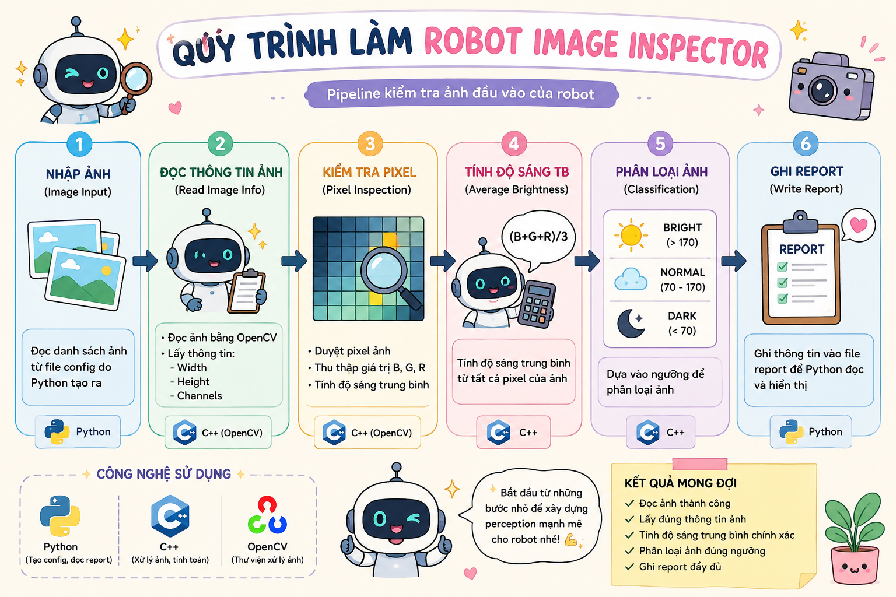

# 🤖 Bài 1: Robot Image Inspector — Kiểm tra ảnh đầu vào của robot

> Mini Project mở đầu cho hướng **Humanoid Robot AI Perception**  
> Trọng tâm: **Python + C++ + Computer Vision** ở mức nền tảng nhưng đã có **OOP, Function, Module, Loop, If/Else** ngay từ bài đầu.

---

# 📌 Mục lục

- [1. Mô tả](#1-mô-tả)
- [2. Pipeline perception của bài](#2-pipeline-perception-của-bài)
- [3. Kiến thức cần](#3-kiến-thức-cần)
  - [3.1 C++](#31-c)
  - [3.2 Python](#32-python)
  - [3.3 CV C++](#33-cv-c)
  - [3.4 CV Python](#34-cv-python)
- [4. Cấu trúc folder](#4-cấu-trúc-folder)
- [5. Yêu cầu](#5-yêu-cầu)
  - [5.1 Python — BaseConfigBuilder](#51-python--baseconfigbuilder)
  - [5.2 Python — ImageConfigBuilder](#52-python--imageconfigbuilder)
  - [5.3 Python — main_config_builder.py](#53-python--main_config_builderpy)
  - [5.4 C++ — ImageInfo](#54-c--imageinfo)
  - [5.5 C++ — BaseSensor](#55-c--basesensor)
  - [5.6 C++ — CameraSensor](#56-c--camerasensor)
  - [5.7 C++ — ImageInspector](#57-c--imageinspector)
  - [5.8 C++ — main.cpp](#58-c--maincpp)
- [6. Điều kiện bắt buộc](#6-điều-kiện-bắt-buộc)
- [7. Output mong muốn](#7-output-mong-muốn)
- [8. Vai trò trong Humanoid Robot AI Perception](#8-vai-trò-trong-humanoid-robot-ai-perception)
- [9. Checklist hoàn thành](#9-checklist-hoàn-thành)
- [10. Gợi ý mở rộng](#10-gợi-ý-mở-rộng)

---

# 1. Mô tả

Trong **Humanoid Robot AI Perception**, trước khi robot có thể:

- detect object,
- detect human,
- tính depth,
- tracking mục tiêu,
- hay xây perception pipeline hoàn chỉnh,

thì robot phải **kiểm tra được ảnh đầu vào từ camera**.

Bài này giúp bạn làm quen với vai trò cơ bản của **Python**, **C++**, **CV Python** và **CV C++** trong một pipeline perception đơn giản:

- **Python** phụ trách tạo config và report input.
- **C++** phụ trách runtime xử lý ảnh giống phần chạy thật trên robot.
- **Computer Vision** phụ trách đọc ảnh, kiểm tra pixel, kiểm tra kích thước ảnh và phân loại ảnh sáng/tối.

<p align="center">
  
</p>

---

# 2. Pipeline perception của bài

```text
Image Input
→ Read Image Info
→ Pixel Inspection
→ Compute Average Brightness
→ Bright / Dark Classification
→ Write Simple Report
```

---

# 3. Kiến thức cần

## 3.1 C++

- variable
- string
- function
- if / else
- for loop
- class / object
- inheritance cơ bản
- `std::vector` cơ bản
- file reading cơ bản

---

## 3.2 Python

- variable
- string
- function
- if / else
- for loop
- list / dictionary cơ bản
- class / object
- inheritance cơ bản
- file writing cơ bản
- module cơ bản

---

## 3.3 CV C++

- `cv::imread`
- `cv::Mat`
- `image.rows`
- `image.cols`
- `image.channels()`
- truy cập pixel bằng `image.at<cv::Vec3b>(y, x)`
- kiểm tra ảnh rỗng bằng `image.empty()`

---

## 3.4 CV Python

- `cv2.imread`
- `image.shape`
- truy cập pixel bằng `image[y, x]`
- kiểm tra ảnh lỗi bằng `if image is None`
- ghi file config ảnh

---

# 4. Cấu trúc folder

```text
mini_project_01_robot_image_inspector/
│
├─ README.md
│
├─ assets/
│  └─ images/
│     ├─ scene_01.jpg
│     ├─ scene_02.jpg
│     └─ scene_03.jpg
│
├─ config/
│  └─ image_config.txt
│
├─ reports/
│  └─ image_report.txt
│
├─ python/
│  ├─ main_config_builder.py
│  └─ tools/
│     ├─ config_builder.py
│     └─ report_template.py
│
└─ cpp/
   ├─ main.cpp
   ├─ include/
   │  ├─ BaseSensor.hpp
   │  ├─ CameraSensor.hpp
   │  ├─ ImageInfo.hpp
   │  └─ ImageInspector.hpp
   │
   └─ src/
      ├─ CameraSensor.cpp
      └─ ImageInspector.cpp
```

---

# 5. Yêu cầu

# 5.1 Python — `BaseConfigBuilder`

**File:**

```text
python/tools/config_builder.py
```

Tạo class:

```python
class BaseConfigBuilder:
```

## Thuộc tính cần có

```python
project_name
image_folder
output_config_path
```

## Hàm cần có

### `show_project_info()`
**Hành vi:**
- In tên project
- In folder chứa ảnh
- In đường dẫn file config

---

# 5.2 Python — `ImageConfigBuilder`

**File:**

```text
python/tools/config_builder.py
```

Class này kế thừa từ `BaseConfigBuilder`:

```python
class ImageConfigBuilder(BaseConfigBuilder):
```

## Thuộc tính cần có

```python
image_names
```

## Hàm cần có

### `add_image(image_name)`
**Hành vi:**
- Thêm tên ảnh vào list `image_names`
- Nếu tên ảnh rỗng thì không thêm

### `write_config()`
**Hành vi:**
- Tạo file `config/image_config.txt`
- Ghi từng ảnh theo format:

```text
assets/images/scene_01.jpg
assets/images/scene_02.jpg
assets/images/scene_03.jpg
```

## Bắt buộc
- Có `for loop` để duyệt danh sách ảnh
- Có `if / else` để kiểm tra tên ảnh hợp lệ
- Có function riêng để ghi file

---

# 5.3 Python — `main_config_builder.py`

**File:**

```text
python/main_config_builder.py
```

## Yêu cầu
- Import `ImageConfigBuilder`
- Tạo object builder
- Thêm 3 ảnh:
  - `scene_01.jpg`
  - `scene_02.jpg`
  - `scene_03.jpg`
- Gọi `write_config()`
- In thông báo hoàn thành

## Pipeline Python

```text
Create Builder
→ Add Image Names
→ Validate Image Names
→ Write Config File
```

---

# 5.4 C++ — `ImageInfo`

**File:**

```text
cpp/include/ImageInfo.hpp
```

Tạo struct:

```cpp
struct ImageInfo
```

## Thuộc tính

```cpp
std::string image_path;
int width;
int height;
int channels;
double average_brightness;
std::string brightness_label;
```

## Ý nghĩa
- `image_path`: đường dẫn ảnh
- `width`: chiều rộng ảnh
- `height`: chiều cao ảnh
- `channels`: số channel
- `average_brightness`: độ sáng trung bình
- `brightness_label`: nhãn `DARK`, `NORMAL`, `BRIGHT`

---

# 5.5 C++ — `BaseSensor`

**File:**

```text
cpp/include/BaseSensor.hpp
```

Tạo class:

```cpp
class BaseSensor
```

## Thuộc tính

```cpp
protected:
    std::string sensor_name;
```

## Hàm cần có

```cpp
BaseSensor(const std::string& name);
std::string get_name() const;
virtual void print_info() const;
```

## Hành vi
- Lưu tên sensor
- Trả về tên sensor
- In thông tin sensor

---

# 5.6 C++ — `CameraSensor`

**File:**

```text
cpp/include/CameraSensor.hpp
cpp/src/CameraSensor.cpp
```

Class này kế thừa:

```cpp
class CameraSensor : public BaseSensor
```

## Thuộc tính

```cpp
private:
    int camera_id;
    std::string camera_role;
```

## Hàm cần có

```cpp
CameraSensor(const std::string& name, int id, const std::string& role);
void print_info() const override;
```

## Hành vi
- Lưu camera id
- Lưu vai trò camera, ví dụ:

```text
Humanoid Head Camera
```

- Override `print_info()` để in thông tin camera

---

# 5.7 C++ — `ImageInspector`

**File:**

```text
cpp/include/ImageInspector.hpp
cpp/src/ImageInspector.cpp
```

## Thuộc tính cần có

```cpp
private:
    std::vector<ImageInfo> image_infos;
```

## Hàm cần có

### `std::vector<std::string> read_image_list(const std::string& config_path);`

**Hành vi:**
- Đọc file `config/image_config.txt`
- Trả về danh sách đường dẫn ảnh
- Dùng `while` hoặc `for loop` để đọc từng dòng
- Nếu dòng rỗng thì bỏ qua

### `ImageInfo inspect_image(const std::string& image_path);`

**Hành vi:**
- Đọc ảnh bằng `cv::imread`
- Nếu ảnh lỗi thì gán `brightness_label = "INVALID_IMAGE"`
- Nếu ảnh hợp lệ:
  - lấy width
  - lấy height
  - lấy channels
  - tính độ sáng trung bình
  - phân loại ảnh

### `double compute_average_brightness(const cv::Mat& image);`

**Hành vi:**
- Duyệt pixel bằng **nested loop**
- Với ảnh màu, lấy trung bình 3 channel BGR
- Trả về độ sáng trung bình

### `std::string classify_brightness(double average_brightness);`

**Hành vi:**
- Nếu `brightness < 85` → `DARK`
- Nếu `brightness` từ `85` đến `170` → `NORMAL`
- Nếu `brightness > 170` → `BRIGHT`

### `void process_all_images(const std::string& config_path);`

**Hành vi:**
- Đọc danh sách ảnh
- Duyệt từng ảnh
- Gọi `inspect_image()`
- Lưu kết quả vào `image_infos`

### `void write_report(const std::string& report_path);`

**Hành vi:**
- Ghi report ra file:

```text
reports/image_report.txt
```

## Report cần có

```text
Image Path:
Width:
Height:
Channels:
Average Brightness:
Brightness Label:
```

---

# 5.8 C++ — `main.cpp`

**File:**

```text
cpp/main.cpp
```

## Yêu cầu
- Tạo object `CameraSensor`
- In thông tin camera
- Tạo object `ImageInspector`
- Gọi:

```cpp
process_all_images("../config/image_config.txt");
write_report("../reports/image_report.txt");
```

## Pipeline C++

```text
Create Camera Sensor
→ Read Image Config
→ Load Image
→ Inspect Image Info
→ Compute Brightness
→ Classify Image
→ Write Report
```

---

# 6. Điều kiện bắt buộc

Project bắt buộc có:

- OOP trong Python
- OOP trong C++
- Inheritance trong Python
- Inheritance trong C++
- Function tách nhỏ rõ ràng
- Module Python
- Header / Source C++ tách file
- Loop xử lý danh sách ảnh
- Nested loop duyệt pixel
- If / else phân loại ảnh
- Report output

---

# 7. Output mong muốn

## Sau khi chạy Python

```text
Config file created successfully.
```

File được tạo:

```text
config/image_config.txt
```

## Sau khi chạy C++

```text
Camera Sensor: Humanoid Head Camera
Processing image: assets/images/scene_01.jpg
Processing image: assets/images/scene_02.jpg
Processing image: assets/images/scene_03.jpg
Report saved to reports/image_report.txt
```

File report:

```text
reports/image_report.txt
```

## Ví dụ nội dung report

```text
Image Path: assets/images/scene_01.jpg
Width: 640
Height: 480
Channels: 3
Average Brightness: 126.45
Brightness Label: NORMAL
--------------------------------
```

---

# 8. Vai trò trong Humanoid Robot AI Perception

## Python đóng vai trò

```text
Config Builder
→ chuẩn bị danh sách ảnh đầu vào
→ tạo file config
→ mô phỏng phần chuẩn bị dữ liệu perception
```

## C++ đóng vai trò

```text
Runtime Perception Module
→ đọc ảnh
→ kiểm tra ảnh
→ xử lý pixel
→ phân loại ảnh
→ ghi report
```

## Computer Vision đóng vai trò

```text
Image Understanding Foundation
→ hiểu ảnh là ma trận pixel
→ hiểu width / height / channels
→ đọc pixel
→ tính brightness
```

---

# 9. Checklist hoàn thành

- [ ] Tạo đúng cấu trúc folder
- [ ] Python tạo được `image_config.txt`
- [ ] Python có class cha và class con
- [ ] C++ có `BaseSensor`
- [ ] C++ có `CameraSensor`
- [ ] C++ có `ImageInspector`
- [ ] C++ đọc được danh sách ảnh từ config
- [ ] C++ đọc ảnh bằng OpenCV
- [ ] C++ tính được brightness trung bình
- [ ] C++ phân loại ảnh `DARK / NORMAL / BRIGHT`
- [ ] C++ ghi được report
- [ ] Code có function rõ ràng
- [ ] Code có loop
- [ ] Code có if / else
- [ ] Code có OOP
- [ ] Code có module

---

# 10. Gợi ý mở rộng

## 1. Đếm số pixel sáng và pixel tối
Ví dụ:
- pixel > 200 → bright pixel
- pixel < 50 → dark pixel

## 2. Thêm nhãn mới

```text
TOO_DARK
GOOD_FOR_DETECTION
TOO_BRIGHT
```

## 3. Lưu thêm ảnh grayscale output

## 4. Thêm nhiều loại camera hơn

```text
Left Eye Camera
Right Eye Camera
Depth Camera
```

## 5. Thêm report tổng kết

```text
Total Images:
Valid Images:
Invalid Images:
Dark Images:
Normal Images:
Bright Images:
```

---

# 🚀 Sau bài này bạn sẽ có gì?

Sau khi làm xong Bài 1, bạn sẽ có nền tảng để đi tiếp các bài kiểu:

```text
Bài 2  → Robot Color Object Detector
Bài 3  → Edge / Contour Inspector
Bài 4  → Shape Detector
Bài 5  → Feature Detector
Bài 6  → Camera Geometry Inspector
Bài 7  → Stereo / Depth Starter
Bài 8  → Human / Object Perception Pipeline
```

và quan trọng nhất là bạn sẽ bắt đầu quen với tư duy:

```text
Python  -> chuẩn bị dữ liệu / config / report
C++     -> runtime perception module
CV      -> đọc ảnh / xử lý ảnh / rút trích thông tin
```
