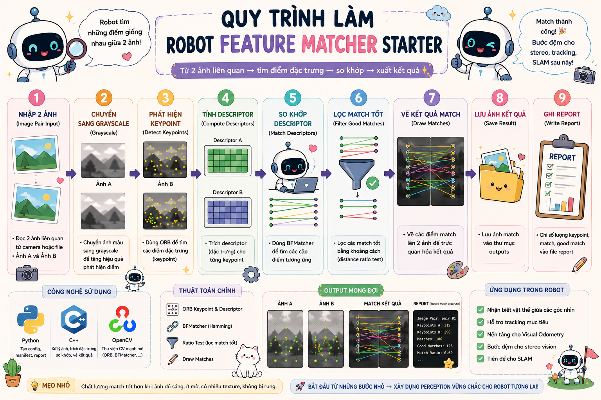
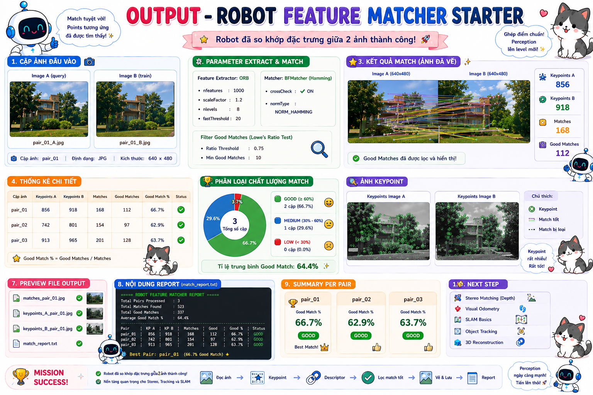

# 🤖 Bài 5: Robot Feature Matcher Starter — So khớp đặc trưng ảnh cho Humanoid Robot AI Perception

> Mini Project số 5 trong **Đợt 1 — Bài 1 → Bài 5**  
> Trọng tâm: dùng **Python + C++ + Computer Vision cơ bản** để xây một module perception giúp robot **phát hiện keypoint, trích descriptor và so khớp đặc trưng giữa 2 ảnh**.  
> Nếu **Bài 4** là bước robot hiểu **hình dạng vật thể**, thì **Bài 5** là bước robot bắt đầu hiểu **sự tương ứng giữa hai ảnh** — nền cực quan trọng cho tracking, stereo vision, visual odometry và SLAM sau này.

---

# 📌 Mục lục

- [1. Mô tả](#1-mô-tả)
- [2. Bài 5 nằm ở đâu trong Đợt 1](#2-bài-5-nằm-ở-đâu-trong-đợt-1)
- [3. Mục tiêu perception của bài](#3-mục-tiêu-perception-của-bài)
- [4. Pipeline perception của bài](#4-pipeline-perception-của-bài)
- [5. Kiến thức cần](#5-kiến-thức-cần)
  - [5.1 C++](#51-c)
  - [5.2 Python](#52-python)
  - [5.3 CV C++](#53-cv-c)
  - [5.4 CV Python](#54-cv-python)
- [6. Sau bài này bạn sẽ hiểu gì trong AI Perception](#6-sau-bài-này-bạn-sẽ-hiểu-gì-trong-ai-perception)
- [7. Cấu trúc folder](#7-cấu-trúc-folder)
- [8. Yêu cầu mini-project](#8-yêu-cầu-mini-project)
  - [8.1 Python — Feature Match Config Builder](#81-python--feature-match-config-builder)
  - [8.2 Python — Image Pair Manifest Builder](#82-python--image-pair-manifest-builder)
  - [8.3 Python — main_config_builder.py](#83-python--main_config_builderpy)
  - [8.4 C++ — BaseSensor](#84-c--basesensor)
  - [8.5 C++ — CameraSensor](#85-c--camerasensor)
  - [8.6 C++ — FeatureMatchConfig](#86-c--featurematchconfig)
  - [8.7 C++ — ImagePairRecord](#87-c--imagepairrecord)
  - [8.8 C++ — FeatureMatchResult](#88-c--featurematchresult)
  - [8.9 C++ — BaseFeatureMatcher](#89-c--basefeaturematcher)
  - [8.10 C++ — FeatureMatcher](#810-c--featurematcher)
  - [8.11 C++ — MatchReportWriter](#811-c--matchreportwriter)
  - [8.12 C++ — main.cpp](#812-c--maincpp)
- [9. Điều kiện bắt buộc](#9-điều-kiện-bắt-buộc)
- [10. Output mong muốn](#10-output-mong-muốn)
- [11. Vai trò của bài này trong Humanoid Robot](#11-vai-trò-của-bài-này-trong-humanoid-robot)
- [12. Checklist hoàn thành](#12-checklist-hoàn-thành)
- [13. Gợi ý mở rộng](#13-gợi-ý-mở-rộng)

---

# 1. Mô tả

Ở **Bài 4**, bạn đã có một module có thể:

- đọc ảnh
- tìm contour
- approximate polygon
- classify shape
- vẽ nhãn shape lên ảnh

Bài 5 nâng perception lên một bước rất quan trọng:

> Robot không chỉ cần biết **“ảnh này có hình gì”**, mà còn cần biết **“điểm nào trong ảnh A tương ứng với điểm nào trong ảnh B”**.

Mini-project này yêu cầu bạn xây một hệ thống nhỏ để robot:

- đọc **2 ảnh liên quan**
- phát hiện **keypoint**
- trích **descriptor**
- so khớp descriptor giữa 2 ảnh
- lọc match tốt
- vẽ ảnh match
- lưu report số lượng keypoint / match / good match

Ví dụ robot có:
- 2 ảnh của cùng một vật thể ở 2 góc nhìn khác nhau
- 2 frame liên tiếp từ camera
- ảnh trái và phải có vùng giống nhau

thì module này phải tìm được **các cặp điểm tương ứng** giữa 2 ảnh đó.

<p align="center">
  
</p>

---

# 2. Bài 5 nằm ở đâu trong Đợt 1

## Đợt 1 = Bài 1 → Bài 5
Đây là cụm nền tảng perception cơ bản:

- **Bài 1** — Robot Image Inspector
- **Bài 2** — Robot Color Object Detector
- **Bài 3** — Robot Edge & Contour Inspector
- **Bài 4** — Robot Shape Detector
- **Bài 5** — Robot Feature Matcher Starter

Tức là **Bài 5** là bài kết thúc Đợt 1, nơi robot bắt đầu chạm vào tư duy rất quan trọng của thị giác máy tính:

```text
image A ↔ image B correspondence
```

---

# 3. Mục tiêu perception của bài

Sau khi làm xong bài này, bạn phải hiểu được luồng perception:

```text
Image A + Image B
→ Detect Keypoints
→ Compute Descriptors
→ Match Descriptors
→ Filter Good Matches
→ Draw Match Visualization
→ Save Matching Report
```

Đây là nền cho:
- stereo correspondence
- visual tracking
- visual odometry
- SLAM
- image alignment
- object re-identification kiểu classical

---

# 4. Pipeline perception của bài

```text
Image Pair Input
→ Read Image A and Image B
→ Convert to Grayscale
→ Detect Keypoints
→ Compute Descriptors
→ Match Descriptors
→ Filter Matches
→ Draw Matched Keypoints
→ Save Match Image + Report
```

---

# 5. Kiến thức cần

# 5.1 C++

- class / object
- constructor
- inheritance
- `std::vector`
- `std::string`
- function
- if / else
- loop
- struct
- header / source tách file

---

# 5.2 Python

- class / object
- inheritance
- list
- dict
- string
- function
- file write
- loop
- if / else
- module

---

# 5.3 CV C++

- `cv::imread`
- `cv::cvtColor`
- feature detector / descriptor:
  - `ORB` *(khuyên dùng cho bài này vì dễ dùng và nằm trong OpenCV phổ biến)*
- matcher:
  - `BFMatcher`
- `cv::drawMatches`
- `cv::imwrite`

> Để bài dễ triển khai, bạn nên dùng **ORB + BFMatcher**.

---

# 5.4 CV Python

Python vẫn không phải runtime matcher chính, nhưng dùng để:
- build config matching
- build manifest các cặp ảnh
- quản lý input cho module C++

---

# 6. Sau bài này bạn sẽ hiểu gì trong AI Perception

Sau Bài 5, bạn phải nắm được 3 ý quan trọng:

## 1. Robot có thể so khớp “điểm đặc trưng” giữa 2 ảnh
Không chỉ nhìn từng ảnh độc lập, mà còn biết:
- điểm nào xuất hiện ở cả 2 ảnh
- vùng nào tương ứng giữa 2 góc nhìn / 2 frame

## 2. Feature matching là nền của stereo và tracking
Sau này khi học stereo / depth, bạn sẽ gặp đúng tinh thần này:
- ảnh trái ↔ ảnh phải
- frame t ↔ frame t+1

## 3. Perception không chỉ là detection, mà còn là correspondence
Đây là bước đầu tiên để robot học “liên kết thông tin giữa nhiều ảnh”.

---

# 7. Cấu trúc folder

```text
mini_project_05_robot_feature_matcher_starter/
│
├─ README.md
│
├─ assets/
│  ├─ test_pairs/
│  │  ├─ pair_01_left.jpg
│  │  ├─ pair_01_right.jpg
│  │  ├─ pair_02_left.jpg
│  │  └─ pair_02_right.jpg
│  └─ outputs/
│     ├─ match_pair_01.jpg
│     ├─ match_pair_02.jpg
│     └─ feature_match_report.txt
│
├─ config/
│  ├─ feature_match_config.txt
│  └─ image_pair_manifest.txt
│
├─ python/
│  ├─ main_config_builder.py
│  └─ tools/
│     ├─ config_builder.py
│     └─ report_template.py
│
└─ cpp/
   ├─ main.cpp
   ├─ include/
   │  ├─ BaseSensor.hpp
   │  ├─ CameraSensor.hpp
   │  ├─ FeatureMatchConfig.hpp
   │  ├─ ImagePairRecord.hpp
   │  ├─ FeatureMatchResult.hpp
   │  ├─ BaseFeatureMatcher.hpp
   │  ├─ FeatureMatcher.hpp
   │  └─ MatchReportWriter.hpp
   │
   └─ src/
      ├─ CameraSensor.cpp
      ├─ FeatureMatcher.cpp
      └─ MatchReportWriter.cpp
```

---

# 8. Yêu cầu mini-project

# 8.1 Python — Feature Match Config Builder

**File:**

```text
python/tools/config_builder.py
```

Tạo class cha:

```python
class BaseConfigBuilder:
```

## Thuộc tính cần có

```python
project_name
feature_match_config_path
image_pair_manifest_path
```

## Hàm cần có

### `show_project_info()`
- in tên project
- in đường dẫn config

---

Tạo class con:

```python
class FeatureMatchConfigBuilder(BaseConfigBuilder):
```

## Thuộc tính cần có

```python
feature_match_config
```

`feature_match_config` là một `dict`, ví dụ:

```python
{
    "detector_type": "ORB",
    "max_features": 500,
    "matcher_type": "BF",
    "distance_threshold": 50
}
```

## Hàm cần có

### `set_feature_match_config(detector_type, max_features, matcher_type, distance_threshold)`
**Hành vi:**
- lưu config vào dict
- kiểm tra:
  - `detector_type` hợp lệ, ví dụ `"ORB"`
  - `max_features > 0`
  - `matcher_type` hợp lệ, ví dụ `"BF"`
  - `distance_threshold > 0`

### `write_feature_match_config()`
**Format gợi ý**
```text
detector_type=ORB
max_features=500
matcher_type=BF
distance_threshold=50
```

---

# 8.2 Python — Image Pair Manifest Builder

Tiếp tục trong file:

```text
python/tools/config_builder.py
```

Tạo class:

```python
class ImagePairManifestBuilder(BaseConfigBuilder):
```

## Thuộc tính cần có

```python
image_pairs
```

`image_pairs` là một **list các dict**, ví dụ:

```python
[
    {
        "pair_name": "pair_01",
        "left_image": "assets/test_pairs/pair_01_left.jpg",
        "right_image": "assets/test_pairs/pair_01_right.jpg"
    },
    {
        "pair_name": "pair_02",
        "left_image": "assets/test_pairs/pair_02_left.jpg",
        "right_image": "assets/test_pairs/pair_02_right.jpg"
    }
]
```

## Hàm cần có

### `add_image_pair(pair_name, left_image, right_image)`
- thêm một cặp ảnh test

### `write_image_pair_manifest()`
**Format gợi ý**
```text
pair_01|assets/test_pairs/pair_01_left.jpg|assets/test_pairs/pair_01_right.jpg
pair_02|assets/test_pairs/pair_02_left.jpg|assets/test_pairs/pair_02_right.jpg
```

---

# 8.3 Python — `main_config_builder.py`

## Yêu cầu
- set feature match config
- thêm ít nhất **2 cặp ảnh**
- ghi đủ:
  - `config/feature_match_config.txt`
  - `config/image_pair_manifest.txt`

---

# 8.4 C++ — `BaseSensor`

**File:**

```text
cpp/include/BaseSensor.hpp
```

Tạo class:

```cpp
class BaseSensor
```

## Thuộc tính

```cpp
protected:
    std::string sensor_name;
```

## Hàm cần có

```cpp
BaseSensor(const std::string& name);
std::string get_name() const;
virtual void print_info() const;
```

---

# 8.5 C++ — `CameraSensor`

**File:**

```text
cpp/include/CameraSensor.hpp
cpp/src/CameraSensor.cpp
```

Tạo class kế thừa:

```cpp
class CameraSensor : public BaseSensor
```

## Thuộc tính

```cpp
private:
    int camera_id;
    std::string camera_role;
```

## Hàm cần có

```cpp
CameraSensor(const std::string& name, int id, const std::string& role);
void print_info() const override;
```

---

# 8.6 C++ — `FeatureMatchConfig`

**File:**

```text
cpp/include/FeatureMatchConfig.hpp
```

Tạo struct:

```cpp
struct FeatureMatchConfig
```

## Thuộc tính cần có

```cpp
std::string detector_type;
int max_features;
std::string matcher_type;
double distance_threshold;
```

---

# 8.7 C++ — `ImagePairRecord`

**File:**

```text
cpp/include/ImagePairRecord.hpp
```

Tạo struct:

```cpp
struct ImagePairRecord
```

## Thuộc tính cần có

```cpp
std::string pair_name;
std::string left_image_path;
std::string right_image_path;
```

---

# 8.8 C++ — `FeatureMatchResult`

**File:**

```text
cpp/include/FeatureMatchResult.hpp
```

Tạo struct:

```cpp
struct FeatureMatchResult
```

## Thuộc tính cần có

```cpp
std::string pair_name;
int keypoints_left_count;
int keypoints_right_count;
int raw_match_count;
int good_match_count;
double mean_good_match_distance;
bool is_valid;
```

---

# 8.9 C++ — `BaseFeatureMatcher`

**File:**

```text
cpp/include/BaseFeatureMatcher.hpp
```

Tạo class trừu tượng:

```cpp
class BaseFeatureMatcher
```

## Hàm cần có

```cpp
virtual void load_feature_match_config(const std::string& path) = 0;
virtual void load_image_pair_manifest(const std::string& path) = 0;
virtual void run_matching() = 0;
virtual ~BaseFeatureMatcher() = default;
```

---

# 8.10 C++ — `FeatureMatcher`

**File:**

```text
cpp/include/FeatureMatcher.hpp
cpp/src/FeatureMatcher.cpp
```

Tạo class kế thừa:

```cpp
class FeatureMatcher : public BaseFeatureMatcher
```

## Thuộc tính cần có

```cpp
private:
    FeatureMatchConfig match_config;
    std::vector<ImagePairRecord> image_pairs;
    std::vector<FeatureMatchResult> match_results;
```

---

## Hàm cần có

### `FeatureMatchConfig read_feature_match_config(const std::string& path);`
- đọc `config/feature_match_config.txt`

### `std::vector<ImagePairRecord> read_image_pair_manifest(const std::string& path);`
- đọc `config/image_pair_manifest.txt`

### `void load_feature_match_config(const std::string& path) override;`
### `void load_image_pair_manifest(const std::string& path) override;`

---

### `cv::Ptr<cv::Feature2D> create_feature_detector() const;`
**Hành vi**
- nếu `detector_type == "ORB"` → tạo ORB với `max_features`

---

### `std::vector<cv::DMatch> filter_good_matches(
    const std::vector<cv::DMatch>& matches
) const;`

**Hành vi gợi ý**
- giữ các match có `distance <= distance_threshold`

---

### `FeatureMatchResult build_match_result(
    const std::string& pair_name,
    int keypoints_left_count,
    int keypoints_right_count,
    int raw_match_count,
    const std::vector<cv::DMatch>& good_matches
) const;`

**Hành vi**
- tính `good_match_count`
- tính `mean_good_match_distance`
- gán `is_valid`

---

### `void process_single_pair(const ImagePairRecord& pair_record);`
## Hành vi tổng quát
1. đọc ảnh trái / phải
2. chuyển grayscale nếu cần
3. tạo ORB detector
4. detect + compute keypoints / descriptors cho 2 ảnh
5. dùng BFMatcher để match descriptor
6. lọc good matches
7. tạo `FeatureMatchResult`
8. vẽ ảnh match bằng `cv::drawMatches`
9. lưu ảnh output

---

### `void run_matching() override;`
- loop qua toàn bộ cặp ảnh
- gọi `process_single_pair()`

### Getter

```cpp
const std::vector<FeatureMatchResult>& get_match_results() const;
```

---

# 8.11 C++ — `MatchReportWriter`

**File:**

```text
cpp/include/MatchReportWriter.hpp
cpp/src/MatchReportWriter.cpp
```

Tạo class:

```cpp
class MatchReportWriter
```

## Hàm cần có

### `void write_report(
    const std::string& report_path,
    const std::vector<FeatureMatchResult>& match_results
);`

## Format gợi ý

```text
[Feature Match]
Pair: pair_01
Keypoints Left: 421
Keypoints Right: 398
Raw Matches: 421
Good Matches: 138
Mean Good Match Distance: 31.42
Valid: true
----------------------------------------
```

---

# 8.12 C++ — `main.cpp`

## Yêu cầu
- tạo `CameraSensor`
- in thông tin camera
- tạo `FeatureMatcher`
- load:
  - `config/feature_match_config.txt`
  - `config/image_pair_manifest.txt`
- chạy matching
- tạo `MatchReportWriter`
- ghi report

## Pipeline `main.cpp`

```text
Create CameraSensor
→ Load Feature Match Config
→ Load Image Pair Manifest
→ Run Feature Matching
→ Save Match Images
→ Write Match Report
```

---

# 9. Điều kiện bắt buộc

Project bắt buộc phải có:

- OOP trong Python
- OOP trong C++
- Inheritance trong Python
- Inheritance trong C++
- Function tách rõ
- Module Python
- Header / Source C++ tách file
- `loop`
- `if / else`
- `std::vector`
- `list` / `dict`
- keypoint detection
- descriptor matching
- match filtering
- result/report rõ ràng

---

# 10. Output mong muốn

## File config
```text
config/feature_match_config.txt
config/image_pair_manifest.txt
```

## Ảnh output
```text
assets/outputs/match_pair_01.jpg
assets/outputs/match_pair_02.jpg
```

## File report
```text
assets/outputs/feature_match_report.txt
```

---

## Ví dụ nội dung `feature_match_config.txt`

```text
detector_type=ORB
max_features=500
matcher_type=BF
distance_threshold=50
```

---

## Ví dụ nội dung `image_pair_manifest.txt`

```text
pair_01|assets/test_pairs/pair_01_left.jpg|assets/test_pairs/pair_01_right.jpg
pair_02|assets/test_pairs/pair_02_left.jpg|assets/test_pairs/pair_02_right.jpg
```

---

## Ví dụ nội dung `feature_match_report.txt`

```text
[Feature Match]
Pair: pair_01
Keypoints Left: 421
Keypoints Right: 398
Raw Matches: 421
Good Matches: 138
Mean Good Match Distance: 31.42
Valid: true
----------------------------------------

[Feature Match]
Pair: pair_02
Keypoints Left: 356
Keypoints Right: 340
Raw Matches: 356
Good Matches: 121
Mean Good Match Distance: 28.77
Valid: true
----------------------------------------
```

<p align="center">
  
</p>

---

# 11. Vai trò của bài này trong Humanoid Robot

## Python đóng vai trò gì?
Python ở đây đóng vai trò:
- tạo config feature matching
- tạo manifest cặp ảnh
- quản lý input cho module perception

Tức là Python làm phần:
```text
Perception Config / Pair Dataset Preparation
```

## C++ đóng vai trò gì?
C++ là runtime perception chính:
- đọc cặp ảnh
- detect keypoint
- compute descriptor
- match descriptor
- filter match
- vẽ ảnh match + ghi report

Tức là C++ làm phần:
```text
Image Correspondence Perception Module
```

## Computer Vision đóng vai trò gì?
CV ở đây giúp robot chuyển từ “ảnh đơn” sang “mối liên hệ giữa hai ảnh”:
- keypoint = điểm đặc trưng
- descriptor = mô tả vùng quanh keypoint
- matching = tìm điểm tương ứng

Tức là CV làm phần:
```text
Image A ↔ Image B Correspondence
```

---

# 12. Checklist hoàn thành

- [ ] Tạo đúng cấu trúc folder
- [ ] Python tạo được `feature_match_config.txt`
- [ ] Python tạo được `image_pair_manifest.txt`
- [ ] Python có class cha / class con
- [ ] Python có list / dict / function / loop / if else
- [ ] C++ có `BaseSensor`
- [ ] C++ có `CameraSensor`
- [ ] C++ có `BaseFeatureMatcher`
- [ ] C++ có `FeatureMatcher`
- [ ] C++ có `FeatureMatchConfig`
- [ ] C++ có `ImagePairRecord`
- [ ] C++ có `FeatureMatchResult`
- [ ] C++ load được match config
- [ ] C++ load được image pair manifest
- [ ] C++ detect được keypoints
- [ ] C++ compute được descriptors
- [ ] C++ match được descriptors
- [ ] C++ lọc được good matches
- [ ] C++ vẽ được match image
- [ ] C++ lưu được match image
- [ ] C++ ghi được feature match report

---

# 13. Gợi ý mở rộng

## 1. Thử KNN Match + ratio test
Sau khi xong bản cơ bản, bạn có thể nâng cấp:
- `BFMatcher.knnMatch`
- Lowe ratio test

## 2. Thử detector khác
Nếu môi trường hỗ trợ, bạn có thể thử:
- AKAZE
- BRISK

## 3. Match giữa 2 frame video liên tiếp
Thay vì 2 ảnh tĩnh, bạn có thể dùng:
- frame_t
- frame_t+1

để mô phỏng tracking / odometry đơn giản.

## 4. Chuẩn bị cho Đợt 2
Sau Bài 5, bạn kết thúc **Đợt 1** và bước sang **Đợt 2**.  
Nếu giữ đúng roadmap bạn đang xây, cụm **Bài 6 → Bài 10** sẽ là nhóm:
- camera geometry
- image coordinate / camera parameter
- stereo correspondence cơ bản
- disparity nền tảng

---

# 🚀 Sau bài này bạn sẽ có gì?

Sau khi hoàn thành **Bài 5**, bạn sẽ khép lại **Đợt 1** với chuỗi:

```text
Bài 1 → Robot Image Inspector
Bài 2 → Robot Color Object Detector
Bài 3 → Robot Edge & Contour Inspector
Bài 4 → Robot Shape Detector
Bài 5 → Robot Feature Matcher Starter
```

Tức là bạn đi từ:

```text
“đọc ảnh, contour, shape”
```

sang

```text
“biết tìm điểm tương ứng giữa hai ảnh”
```

Đây là bước rất quan trọng trước khi sang **Đợt 2** — nơi bạn bắt đầu đi vào **camera geometry** và **stereo vision foundation**.
