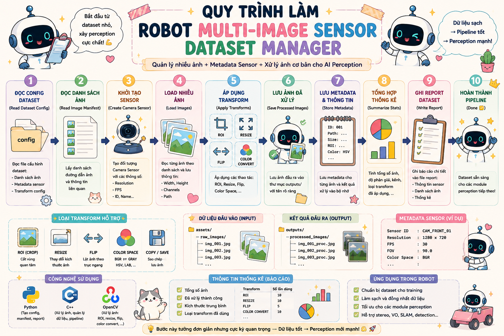
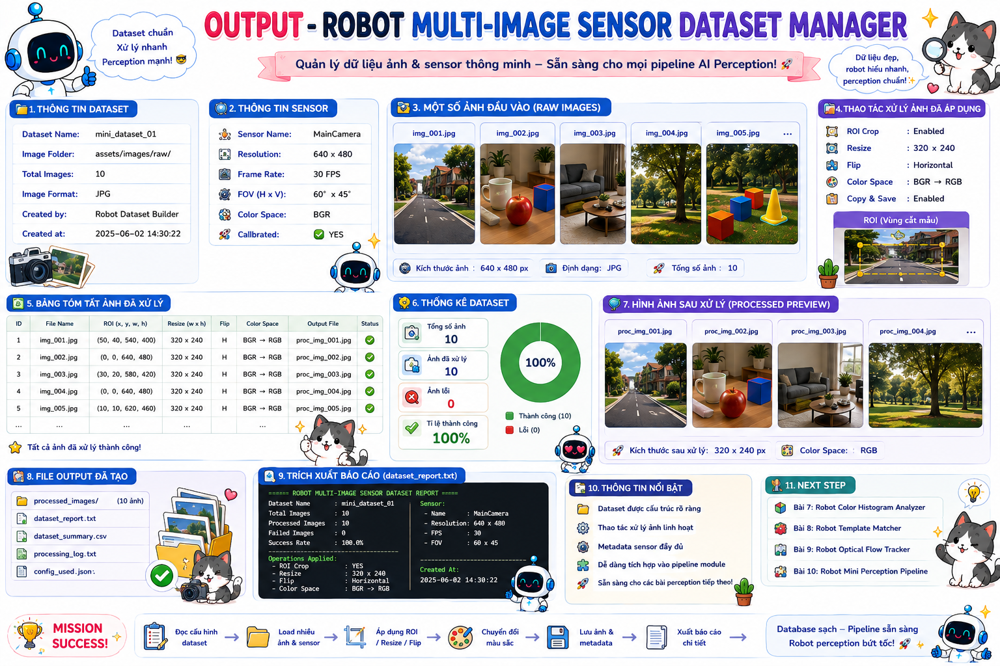

# 🤖 Bài 6: Robot Multi-Image Sensor Dataset Manager — Quản lý dữ liệu ảnh và sensor cho Humanoid Robot AI Perception

> Mini Project số 6 trong **Đợt 2 — Bài 6 → Bài 10**  
> **Bài 6 phải kết hợp kiến thức của Đợt 1 + Đợt 2** theo đúng quy ước bạn đã chốt.  
> Trọng tâm của bài này là xây một module giúp robot **quản lý nhiều ảnh, metadata sensor và các thao tác ROI / resize / color-space cơ bản** — tức là bước chuyển từ các mini-project perception đơn ảnh ở Đợt 1 sang **quản lý input perception có cấu trúc hơn** ở Đợt 2.

---

# 📌 Mục lục

- [1. Mô tả](#1-mô-tả)
- [2. Bài 6 nằm ở đâu trong roadmap](#2-bài-6-nằm-ở-đâu-trong-roadmap)
- [3. Vì sao Bài 6 phải kết hợp Đợt 1 + Đợt 2](#3-vì-sao-bài-6-phải-kết-hợp-đợt-1--đợt-2)
- [4. Mục tiêu perception của bài](#4-mục-tiêu-perception-của-bài)
- [5. Pipeline perception của bài](#5-pipeline-perception-của-bài)
- [6. Kiến thức cần](#6-kiến-thức-cần)
  - [6.1 C++](#61-c)
  - [6.2 Python](#62-python)
  - [6.3 CV C++](#63-cv-c)
  - [6.4 CV Python](#64-cv-python)
- [7. Kiến thức Đợt 1 và Đợt 2 được dùng như thế nào](#7-kiến-thức-đợt-1-và-đợt-2-được-dùng-như-thế-nào)
- [8. Sau bài này bạn sẽ hiểu gì trong AI Perception](#8-sau-bài-này-bạn-sẽ-hiểu-gì-trong-ai-perception)
- [9. Cấu trúc folder](#9-cấu-trúc-folder)
- [10. Yêu cầu mini-project](#10-yêu-cầu-mini-project)
  - [10.1 Python — BaseConfigBuilder](#101-python--baseconfigbuilder)
  - [10.2 Python — SensorDatasetConfigBuilder](#102-python--sensordatasetconfigbuilder)
  - [10.3 Python — main_config_builder.py](#103-python--main_config_builderpy)
  - [10.4 C++ — BaseSensor](#104-c--basesensor)
  - [10.5 C++ — CameraSensor](#105-c--camerasensor)
  - [10.6 C++ — ImageRecord](#106-c--imagerecord)
  - [10.7 C++ — ImageTransformConfig](#107-c--imagetransformconfig)
  - [10.8 C++ — ProcessedImageResult](#108-c--processedimageresult)
  - [10.9 C++ — BaseDatasetProcessor](#109-c--basedatasetprocessor)
  - [10.10 C++ — MultiImageSensorDatasetManager](#1010-c--multiimagesensordatasetmanager)
  - [10.11 C++ — DatasetReportWriter](#1011-c--datasetreportwriter)
  - [10.12 C++ — main.cpp](#1012-c--maincpp)
- [11. Điều kiện bắt buộc](#11-điều-kiện-bắt-buộc)
- [12. Output mong muốn](#12-output-mong-muốn)
- [13. Vai trò của bài này trong Humanoid Robot](#13-vai-trò-của-bài-này-trong-humanoid-robot)
- [14. Checklist hoàn thành](#14-checklist-hoàn-thành)
- [15. Gợi ý mở rộng](#15-gợi-ý-mở-rộng)

---

# 1. Mô tả

Ở **Đợt 1**, bạn đã làm 5 mini-project thiên về **perception trên từng ảnh**:

- đọc ảnh
- color object detection
- edge / contour
- shape detection
- feature matching

Sang **Đợt 2**, roadmap chuyển trọng tâm sang:

- quản lý dữ liệu ảnh tốt hơn
- dùng **list / dict / vector / array**
- xử lý nhiều ảnh thay vì 1 ảnh
- thêm **type casting / strings / functions nhiều tham số**
- làm các thao tác ảnh cơ bản như:
  - **ROI**
  - **resize**
  - **flip**
  - **color space conversion**
  - **copy / save ảnh**

Vì vậy **Bài 6** sẽ là một mini-project rất “đúng chất giao giữa Đợt 1 và Đợt 2”:

> Xây một **Multi-Image Sensor Dataset Manager** giúp robot quản lý một tập ảnh từ camera, áp dụng các thao tác xử lý cơ bản, lưu metadata sensor, và xuất report cho perception pipeline.

---

# 2. Bài 6 nằm ở đâu trong roadmap

## Quy ước hiện tại
- **Đợt 1 = Bài 1 → Bài 5**
- **Đợt 2 = Bài 6 → Bài 10**
- **Đợt 3 = Bài 11 → Bài 15**
- **Đợt 4 = Bài 16 → Bài 20**

Vì vậy:

## **Bài 6 = Bài đầu tiên của Đợt 2**
nhưng **bắt buộc phải kết hợp kiến thức của Đợt 1 + Đợt 2**.

<p align="center">
  
</p>

---

# 3. Vì sao Bài 6 phải kết hợp Đợt 1 + Đợt 2

## Đợt 1 cho bạn:
- class / inheritance
- function / loop / if else
- đọc ảnh
- color / contour / shape / feature
- tư duy perception module

## Đợt 2 thêm vào:
- Python strings / list / dict / type casting
- C++ arrays / vectors / const / auto
- CV: ROI, resize, crop, rotate, flip, color spaces, basic image operations

Tức là **Bài 6** không nên nhảy ngay sang một detector mới, mà nên làm một project kiểu:

```text
Quản lý ảnh + metadata + transform ảnh + lưu output
```

để bạn luyện đúng phần “data handling cho perception”.

---

# 4. Mục tiêu perception của bài

Sau khi làm xong bài này, bạn phải hiểu được luồng:

```text
Image Dataset + Sensor Metadata
→ Read Image Manifest
→ Read Transform Config
→ Load Multiple Images
→ Apply Basic Image Operations
→ Build Processed Dataset Outputs
→ Save Processed Images + Report
```

Bài này giúp bạn hiểu một điều rất quan trọng trong AI Perception:

> Trước khi robot detect hay estimate depth, nó phải có **input pipeline sạch và có tổ chức**.

---

# 5. Pipeline perception của bài

```text
Sensor Dataset Config
→ Read Image Records
→ Read Transform Config
→ Create Camera Sensor Object
→ Load Each Image
→ Apply ROI / Resize / Flip / Color Conversion
→ Save Processed Image
→ Store Metadata + Processing Summary
→ Write Dataset Report
```

---

# 6. Kiến thức cần

# 6.1 C++

- class / object
- constructor
- inheritance
- `std::vector`
- `std::string`
- `const`
- `auto`
- function
- if / else
- loop
- struct
- header / source tách file

---

# 6.2 Python

- class / object
- inheritance
- list
- dict
- string
- type casting
- function nhiều tham số
- file write
- loop
- if / else
- module

---

# 6.3 CV C++

- `cv::imread`
- `cv::imwrite`
- `cv::cvtColor`
- `cv::resize`
- ROI bằng `cv::Rect`
- `cv::flip`
- copy ảnh
- grayscale / BGR / HSV

---

# 6.4 CV Python

Python không phải runtime xử lý ảnh chính, nhưng sẽ dùng để:
- build config dataset
- build image manifest
- build transform config
- ghi metadata đầu vào

---

# 7. Kiến thức Đợt 1 và Đợt 2 được dùng như thế nào

# 7.1 Phần lấy từ Đợt 1

## Python
- class / inheritance
- function
- if else / loop
- config builder style

## C++
- `BaseSensor`
- `CameraSensor`
- class detector/processor style
- struct kết quả

## CV
- đọc / lưu ảnh
- lấy shape ảnh
- truy cập thông tin ảnh

---

# 7.2 Phần lấy từ Đợt 2

## Python
- list / dict mạnh hơn
- string split / join / replace
- type casting khi parse config text

## C++
- vector để lưu nhiều ảnh
- array / vector loop
- `const` / `auto`

## CV
- ROI
- crop
- resize
- flip
- color space conversion
- copy ảnh

---

# 8. Sau bài này bạn sẽ hiểu gì trong AI Perception

Sau Bài 6, bạn phải nắm được 4 ý rất quan trọng:

## 1. Perception project không bắt đầu bằng detector
Nó thường bắt đầu bằng **dataset / sensor input management**.

## 2. Ảnh đầu vào cần được chuẩn hóa trước
Ví dụ:
- crop ROI
- resize về cùng kích thước
- đổi grayscale / HSV
- lật ảnh nếu cần

## 3. Metadata sensor cũng là một phần của pipeline
Robot cần biết:
- ảnh đến từ camera nào
- ảnh thuộc frame nào
- ảnh có ROI gì
- ảnh đã transform ra sao

## 4. Một module “quản lý input perception” là nền cho các bài stereo / depth sau này
Sau này bạn sẽ làm:
- left/right image pair
- camera config
- calibration image set
- disparity input set

Bài 6 là bước đệm cho tất cả những thứ đó.

---

# 9. Cấu trúc folder

```text
mini_project_06_robot_multi_image_sensor_dataset_manager/
│
├─ README.md
│
├─ assets/
│  ├─ raw_images/
│  │  ├─ frame_01.jpg
│  │  ├─ frame_02.jpg
│  │  ├─ frame_03.jpg
│  │  └─ frame_04.jpg
│  │
│  └─ outputs/
│     ├─ processed_frame_01.jpg
│     ├─ processed_frame_02.jpg
│     ├─ processed_frame_03.jpg
│     ├─ processed_frame_04.jpg
│     └─ dataset_report.txt
│
├─ config/
│  ├─ sensor_dataset_manifest.txt
│  └─ image_transform_config.txt
│
├─ python/
│  ├─ main_config_builder.py
│  └─ tools/
│     ├─ config_builder.py
│     └─ report_template.py
│
└─ cpp/
   ├─ main.cpp
   ├─ include/
   │  ├─ BaseSensor.hpp
   │  ├─ CameraSensor.hpp
   │  ├─ ImageRecord.hpp
   │  ├─ ImageTransformConfig.hpp
   │  ├─ ProcessedImageResult.hpp
   │  ├─ BaseDatasetProcessor.hpp
   │  ├─ MultiImageSensorDatasetManager.hpp
   │  └─ DatasetReportWriter.hpp
   │
   └─ src/
      ├─ CameraSensor.cpp
      ├─ MultiImageSensorDatasetManager.cpp
      └─ DatasetReportWriter.cpp
```

---

# 10. Yêu cầu mini-project

# 10.1 Python — `BaseConfigBuilder`

**File:**

```text
python/tools/config_builder.py
```

Tạo class cha:

```python
class BaseConfigBuilder:
```

## Thuộc tính cần có

```python
project_name
dataset_manifest_path
transform_config_path
```

## Hàm cần có

### `show_project_info()`
- in tên project
- in đường dẫn các file config

---

# 10.2 Python — `SensorDatasetConfigBuilder`

**File:**

```text
python/tools/config_builder.py
```

Tạo class con:

```python
class SensorDatasetConfigBuilder(BaseConfigBuilder):
```

## Thuộc tính cần có

```python
image_records
transform_config
```

---

## `image_records`
Là **list các dict**, ví dụ:

```python
[
    {
        "frame_name": "frame_01",
        "image_path": "assets/raw_images/frame_01.jpg",
        "sensor_name": "head_rgb_camera",
        "sensor_id": 0
    },
    {
        "frame_name": "frame_02",
        "image_path": "assets/raw_images/frame_02.jpg",
        "sensor_name": "head_rgb_camera",
        "sensor_id": 0
    }
]
```

## `transform_config`
Là `dict`, ví dụ:

```python
{
    "roi_x": 40,
    "roi_y": 30,
    "roi_width": 220,
    "roi_height": 180,
    "resize_width": 320,
    "resize_height": 240,
    "flip_code": 1,
    "output_color_mode": "GRAY"
}
```

---

## Hàm cần có

### `add_image_record(frame_name, image_path, sensor_name, sensor_id)`
**Hành vi**
- thêm một record ảnh vào `image_records`
- kiểm tra:
  - chuỗi không rỗng
  - `sensor_id >= 0`

### `set_transform_config(
    roi_x, roi_y, roi_width, roi_height,
    resize_width, resize_height,
    flip_code, output_color_mode
)`
**Hành vi**
- lưu config transform
- kiểm tra:
  - ROI width / height > 0
  - resize width / height > 0
  - `flip_code` thuộc `{-1, 0, 1}`
  - `output_color_mode` thuộc `{"BGR", "GRAY", "HSV"}`

### `write_dataset_manifest()`
**Format gợi ý**
```text
frame_01|assets/raw_images/frame_01.jpg|head_rgb_camera|0
frame_02|assets/raw_images/frame_02.jpg|head_rgb_camera|0
frame_03|assets/raw_images/frame_03.jpg|head_rgb_camera|0
```

### `write_transform_config()`
**Format gợi ý**
```text
roi_x=40
roi_y=30
roi_width=220
roi_height=180
resize_width=320
resize_height=240
flip_code=1
output_color_mode=GRAY
```

---

# 10.3 Python — `main_config_builder.py`

## Yêu cầu
- tạo ít nhất **4 image records**
- set transform config
- ghi đủ:
  - `config/sensor_dataset_manifest.txt`
  - `config/image_transform_config.txt`

---

# 10.4 C++ — `BaseSensor`

**File:**

```text
cpp/include/BaseSensor.hpp
```

Tạo class:

```cpp
class BaseSensor
```

## Thuộc tính

```cpp
protected:
    std::string sensor_name;
```

## Hàm cần có

```cpp
BaseSensor(const std::string& name);
std::string get_name() const;
virtual void print_info() const;
```

---

# 10.5 C++ — `CameraSensor`

**File:**

```text
cpp/include/CameraSensor.hpp
cpp/src/CameraSensor.cpp
```

Tạo class kế thừa:

```cpp
class CameraSensor : public BaseSensor
```

## Thuộc tính cần có

```cpp
private:
    int camera_id;
    std::string camera_role;
```

## Hàm cần có

```cpp
CameraSensor(const std::string& name, int id, const std::string& role);
void print_info() const override;
```

---

# 10.6 C++ — `ImageRecord`

**File:**

```text
cpp/include/ImageRecord.hpp
```

Tạo struct:

```cpp
struct ImageRecord
```

## Thuộc tính cần có

```cpp
std::string frame_name;
std::string image_path;
std::string sensor_name;
int sensor_id;
```

---

# 10.7 C++ — `ImageTransformConfig`

**File:**

```text
cpp/include/ImageTransformConfig.hpp
```

Tạo struct:

```cpp
struct ImageTransformConfig
```

## Thuộc tính cần có

```cpp
int roi_x;
int roi_y;
int roi_width;
int roi_height;
int resize_width;
int resize_height;
int flip_code;
std::string output_color_mode;
```

---

# 10.8 C++ — `ProcessedImageResult`

**File:**

```text
cpp/include/ProcessedImageResult.hpp
```

Tạo struct:

```cpp
struct ProcessedImageResult
```

## Thuộc tính cần có

```cpp
std::string frame_name;
std::string input_image_path;
std::string output_image_path;
std::string sensor_name;
int sensor_id;
int original_width;
int original_height;
int processed_width;
int processed_height;
std::string output_color_mode;
bool is_valid;
```

---

# 10.9 C++ — `BaseDatasetProcessor`

**File:**

```text
cpp/include/BaseDatasetProcessor.hpp
```

Tạo class trừu tượng:

```cpp
class BaseDatasetProcessor
```

## Hàm cần có

```cpp
virtual void load_dataset_manifest(const std::string& path) = 0;
virtual void load_transform_config(const std::string& path) = 0;
virtual void process_dataset() = 0;
virtual ~BaseDatasetProcessor() = default;
```

---

# 10.10 C++ — `MultiImageSensorDatasetManager`

**File:**

```text
cpp/include/MultiImageSensorDatasetManager.hpp
cpp/src/MultiImageSensorDatasetManager.cpp
```

Tạo class kế thừa:

```cpp
class MultiImageSensorDatasetManager : public BaseDatasetProcessor
```

## Thuộc tính cần có

```cpp
private:
    std::vector<ImageRecord> image_records;
    ImageTransformConfig transform_config;
    std::vector<ProcessedImageResult> processed_results;
```

---

## Hàm cần có

### `std::vector<ImageRecord> read_dataset_manifest(const std::string& path);`
**Hành vi**
- đọc `sensor_dataset_manifest.txt`
- parse từng dòng thành `ImageRecord`

### `ImageTransformConfig read_transform_config(const std::string& path);`
**Hành vi**
- đọc `image_transform_config.txt`
- parse config text thành struct

### `void load_dataset_manifest(const std::string& path) override;`
### `void load_transform_config(const std::string& path) override;`

---

### `cv::Mat apply_roi(const cv::Mat& image) const;`
**Hành vi**
- dùng ROI config để crop ảnh
- nếu ROI vượt quá biên ảnh thì phải xử lý an toàn:
  - clamp lại
  - hoặc đánh dấu ảnh invalid

---

### `cv::Mat apply_resize(const cv::Mat& image) const;`
- resize ảnh theo config

### `cv::Mat apply_flip(const cv::Mat& image) const;`
- flip theo `flip_code`

### `cv::Mat convert_output_color_mode(const cv::Mat& image) const;`
## Hành vi
- nếu `GRAY` → BGR sang grayscale
- nếu `HSV` → BGR sang HSV
- nếu `BGR` → giữ nguyên

---

### `ProcessedImageResult build_result(
    const ImageRecord& record,
    const cv::Mat& original_image,
    const cv::Mat& processed_image,
    const std::string& output_image_path,
    bool is_valid
) const;`

**Hành vi**
- đóng gói metadata ảnh đầu vào / đầu ra

---

### `void process_single_image(const ImageRecord& record);`
## Hành vi tổng quát
1. đọc ảnh từ `record.image_path`
2. nếu ảnh lỗi → tạo result invalid
3. nếu ảnh hợp lệ:
   - crop ROI
   - resize
   - flip
   - convert color mode
   - lưu output ảnh
   - tạo `ProcessedImageResult`

---

### `void process_dataset() override;`
- loop qua toàn bộ `image_records`
- gọi `process_single_image()`

### Getter

```cpp
const std::vector<ProcessedImageResult>& get_processed_results() const;
```

---

# 10.11 C++ — `DatasetReportWriter`

**File:**

```text
cpp/include/DatasetReportWriter.hpp
cpp/src/DatasetReportWriter.cpp
```

Tạo class:

```cpp
class DatasetReportWriter
```

## Hàm cần có

### `void write_report(
    const std::string& report_path,
    const std::vector<ProcessedImageResult>& processed_results
);`

## Format gợi ý

```text
[Processed Image]
Frame: frame_01
Input Image: assets/raw_images/frame_01.jpg
Output Image: assets/outputs/processed_frame_01.jpg
Sensor: head_rgb_camera
Sensor ID: 0
Original Size: 640x480
Processed Size: 320x240
Color Mode: GRAY
Valid: true
----------------------------------------
```

---

# 10.12 C++ — `main.cpp`

## Yêu cầu
- tạo ít nhất **1 CameraSensor**
- in thông tin camera
- tạo `MultiImageSensorDatasetManager`
- load:
  - `config/sensor_dataset_manifest.txt`
  - `config/image_transform_config.txt`
- chạy `process_dataset()`
- tạo `DatasetReportWriter`
- ghi report ra:
  - `assets/outputs/dataset_report.txt`

## Pipeline `main.cpp`

```text
Create CameraSensor
→ Load Dataset Manifest
→ Load Transform Config
→ Process Dataset
→ Save Processed Images
→ Write Dataset Report
```

---

# 11. Điều kiện bắt buộc

Project bắt buộc phải có:

- OOP trong Python
- OOP trong C++
- Inheritance trong Python
- Inheritance trong C++
- Function tách rõ
- Module Python
- Header / Source C++ tách file
- `loop`
- `if / else`
- `list` / `dict`
- `std::vector`
- đọc nhiều ảnh từ manifest
- ROI / resize / flip / color conversion
- metadata sensor cho từng ảnh
- report tổng hợp dataset

---

# 12. Output mong muốn

## File config
```text
config/sensor_dataset_manifest.txt
config/image_transform_config.txt
```

## Ảnh output
```text
assets/outputs/processed_frame_01.jpg
assets/outputs/processed_frame_02.jpg
assets/outputs/processed_frame_03.jpg
assets/outputs/processed_frame_04.jpg
```

## File report
```text
assets/outputs/dataset_report.txt
```

---

## Ví dụ `sensor_dataset_manifest.txt`

```text
frame_01|assets/raw_images/frame_01.jpg|head_rgb_camera|0
frame_02|assets/raw_images/frame_02.jpg|head_rgb_camera|0
frame_03|assets/raw_images/frame_03.jpg|head_rgb_camera|0
frame_04|assets/raw_images/frame_04.jpg|head_rgb_camera|0
```

---

## Ví dụ `image_transform_config.txt`

```text
roi_x=40
roi_y=30
roi_width=220
roi_height=180
resize_width=320
resize_height=240
flip_code=1
output_color_mode=GRAY
```

---

## Ví dụ `dataset_report.txt`

```text
[Processed Image]
Frame: frame_01
Input Image: assets/raw_images/frame_01.jpg
Output Image: assets/outputs/processed_frame_01.jpg
Sensor: head_rgb_camera
Sensor ID: 0
Original Size: 640x480
Processed Size: 320x240
Color Mode: GRAY
Valid: true
----------------------------------------

[Processed Image]
Frame: frame_02
Input Image: assets/raw_images/frame_02.jpg
Output Image: assets/outputs/processed_frame_02.jpg
Sensor: head_rgb_camera
Sensor ID: 0
Original Size: 640x480
Processed Size: 320x240
Color Mode: GRAY
Valid: true
----------------------------------------
```

<p align="center">
  
</p>

---

# 13. Vai trò của bài này trong Humanoid Robot

## Python đóng vai trò gì?
Python ở đây đóng vai trò:

- tạo **manifest nhiều ảnh**
- tạo **transform config**
- quản lý metadata sensor
- chuẩn bị input cho module C++

Tức là Python làm phần:

```text
Perception Dataset / Config Builder
```

---

## C++ đóng vai trò gì?
C++ là runtime chính của bài này:

- đọc dataset manifest
- load nhiều ảnh
- crop / resize / flip / convert color
- lưu processed outputs
- ghi report

Tức là C++ làm phần:

```text
Perception Input Processing Runtime
```

---

## Computer Vision đóng vai trò gì?
CV ở đây chưa đi sâu vào detector mới, mà đóng vai trò:

- **chuẩn hóa ảnh đầu vào**
- **chuyển đổi representation ảnh**
- **tạo input sạch cho perception module tiếp theo**

Tức là CV làm phần:

```text
Raw Image → Perception-Ready Image
```

---

# 14. Checklist hoàn thành

- [ ] Tạo đúng cấu trúc folder
- [ ] Python tạo được `sensor_dataset_manifest.txt`
- [ ] Python tạo được `image_transform_config.txt`
- [ ] Python có class cha / class con
- [ ] Python có list / dict / string / function / loop / if else
- [ ] C++ có `BaseSensor`
- [ ] C++ có `CameraSensor`
- [ ] C++ có `ImageRecord`
- [ ] C++ có `ImageTransformConfig`
- [ ] C++ có `ProcessedImageResult`
- [ ] C++ có `BaseDatasetProcessor`
- [ ] C++ có `MultiImageSensorDatasetManager`
- [ ] C++ load được dataset manifest
- [ ] C++ load được transform config
- [ ] C++ crop ROI được
- [ ] C++ resize được ảnh
- [ ] C++ flip được ảnh
- [ ] C++ convert được BGR / GRAY / HSV
- [ ] C++ lưu được processed image
- [ ] C++ build được report cho từng ảnh

---

# 15. Gợi ý mở rộng

## 1. Thêm nhiều sensor khác nhau
Ví dụ:
- `head_rgb_camera`
- `left_eye_camera`
- `debug_camera`

## 2. Thêm cờ bật / tắt transform
Ví dụ config có:
- `enable_roi`
- `enable_flip`
- `enable_resize`

## 3. Lưu histogram brightness đơn giản
Bạn có thể thêm một trường metric:
- mean intensity
- min / max intensity

## 4. Chuẩn bị cho Bài 7
Sau Bài 6, bước rất hợp lý cho **Bài 7** là đi tiếp theo hướng:

```text
Robot Color & ROI Analyzer
```

hoặc

```text
Robot Image Batch Transformation Console
```

để tiếp tục tận dụng:
- strings
- dict / list
- vector
- ROI / HSV / resize
- OOP dataset processor
- và bắt đầu gắn lại với detector / analyzer.

---

# 🚀 Sau bài này bạn sẽ có gì?

Sau khi hoàn thành **Bài 6**, bạn sẽ bắt đầu **Đợt 2** bằng một project rất đúng nhịp:

- không nhảy quá sớm vào geometry / stereo
- không lặp lại y hệt Đợt 1
- mà xây một **input management module cho perception**

Tức là bạn đi từ:

```text
Đợt 1 = perception trên từng ảnh
```

sang

```text
Đợt 2 = quản lý tập ảnh + sensor metadata + transform ảnh đầu vào
```

Đây là bước rất quan trọng trước khi các bài tiếp theo trong Đợt 2 bắt đầu chạm mạnh hơn vào:
- ROI analysis
- image batch processing
- feature / registration style workflow
- và chuẩn bị cho camera geometry ở các đợt sau.
