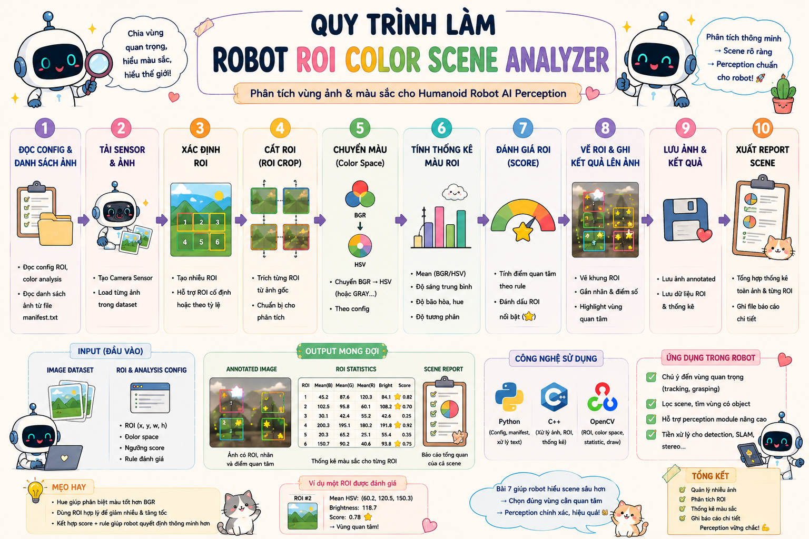
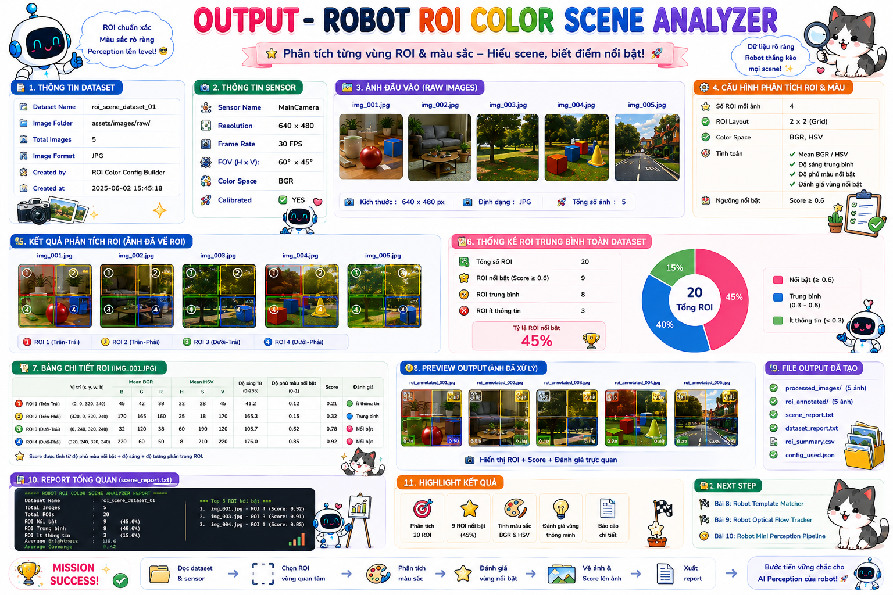

# 🤖 Bài 7: Robot ROI Color Scene Analyzer — Phân tích vùng ảnh và màu sắc cho Humanoid Robot AI Perception

> Mini Project số 7 trong **Đợt 2 — Bài 6 → Bài 10**  
> **Bài 7 tiếp tục kết hợp kiến thức của Đợt 1 + Đợt 2** theo đúng rule bạn đã chốt.  
> Nếu **Bài 6** tập trung vào **quản lý nhiều ảnh + sensor metadata + transform cơ bản**, thì **Bài 7** nâng thêm một nấc perception: robot sẽ **phân tích từng vùng ROI trong ảnh, đo thống kê màu sắc, sinh cảnh báo vùng màu nổi bật và xuất report scene-level**.

---

# 📌 Mục lục

- [1. Mô tả](#1-mô-tả)
- [2. Bài 7 nằm ở đâu trong roadmap](#2-bài-7-nằm-ở-đâu-trong-roadmap)
- [3. Vì sao Bài 7 là bước tiếp theo hợp lý sau Bài 6](#3-vì-sao-bài-7-là-bước-tiếp-theo-hợp-lý-sau-bài-6)
- [4. Mục tiêu perception của bài](#4-mục-tiêu-perception-của-bài)
- [5. Pipeline perception của bài](#5-pipeline-perception-của-bài)
- [6. Kiến thức cần](#6-kiến-thức-cần)
  - [6.1 C++](#61-c)
  - [6.2 Python](#62-python)
  - [6.3 CV C++](#63-cv-c)
  - [6.4 CV Python](#64-cv-python)
- [7. Kiến thức Đợt 1 và Đợt 2 được dùng như thế nào](#7-kiến-thức-đợt-1-và-đợt-2-được-dùng-như-thế-nào)
- [8. Sau bài này bạn sẽ hiểu gì trong AI Perception](#8-sau-bài-này-bạn-sẽ-hiểu-gì-trong-ai-perception)
- [9. Cấu trúc folder](#9-cấu-trúc-folder)
- [10. Yêu cầu mini-project](#10-yêu-cầu-mini-project)
  - [10.1 Python — BaseConfigBuilder](#101-python--baseconfigbuilder)
  - [10.2 Python — ROIColorSceneConfigBuilder](#102-python--roicolorsceneconfigbuilder)
  - [10.3 Python — main_config_builder.py](#103-python--main_config_builderpy)
  - [10.4 C++ — BaseSensor](#104-c--basesensor)
  - [10.5 C++ — CameraSensor](#105-c--camerasensor)
  - [10.6 C++ — ImageRecord](#106-c--imagerecord)
  - [10.7 C++ — ROIConfig](#107-c--roiconfig)
  - [10.8 C++ — ColorAnalysisConfig](#108-c--coloranalysisconfig)
  - [10.9 C++ — ROIAnalysisResult](#109-c--roianalysisresult)
  - [10.10 C++ — SceneAnalysisResult](#1010-c--sceneanalysisresult)
  - [10.11 C++ — BaseSceneAnalyzer](#1011-c--basesceneanalyzer)
  - [10.12 C++ — ROIColorSceneAnalyzer](#1012-c--roicolorsceneanalyzer)
  - [10.13 C++ — SceneReportWriter](#1013-c--scenereportwriter)
  - [10.14 C++ — main.cpp](#1014-c--maincpp)
- [11. Điều kiện bắt buộc](#11-điều-kiện-bắt-buộc)
- [12. Output mong muốn](#12-output-mong-muốn)
- [13. Vai trò của bài này trong Humanoid Robot](#13-vai-trò-của-bài-này-trong-humanoid-robot)
- [14. Checklist hoàn thành](#14-checklist-hoàn-thành)
- [15. Gợi ý mở rộng](#15-gợi-ý-mở-rộng)

---

# 1. Mô tả

Ở **Bài 6**, bạn đã xây một module kiểu **dataset/input manager** có thể:

- đọc nhiều ảnh từ manifest
- lưu metadata sensor
- crop ROI
- resize / flip / đổi color mode
- lưu ảnh đã xử lý
- ghi report dataset

Bài 7 sẽ giữ nguyên tinh thần “quản lý dữ liệu perception có cấu trúc”, nhưng **không dừng ở transform ảnh** nữa.  
Bây giờ robot sẽ bắt đầu **phân tích nội dung của từng ROI**.

Mini-project này yêu cầu bạn xây một hệ thống nhỏ để robot:

- đọc nhiều ảnh từ manifest
- chia / chọn **ROI vùng quan tâm**
- chuyển ROI sang **HSV** hoặc giữ **BGR / GRAY** tùy config
- tính **thống kê màu** cho từng ROI:
  - mean BGR / HSV
  - độ sáng trung bình
  - độ phủ của mask màu nổi bật (nếu có)
- xác định ROI nào “đáng chú ý” theo rule
- vẽ ROI lên ảnh
- lưu ảnh annotated + scene report

Ví dụ robot nhìn một scene trên bàn hoặc trước mặt:

- ROI trái có nhiều màu đỏ → có thể là marker / object nổi bật
- ROI giữa sáng mạnh → có vật phản quang / vùng cần chú ý
- ROI phải gần như trống / ít thông tin

thì module này phải **đánh giá từng ROI** chứ không chỉ xử lý ảnh như một khối duy nhất.

<p align="center">
  
</p>

---

# 2. Bài 7 nằm ở đâu trong roadmap

## Quy ước hiện tại
- **Đợt 1 = Bài 1 → Bài 5**
- **Đợt 2 = Bài 6 → Bài 10**
- **Đợt 3 = Bài 11 → Bài 15**
- **Đợt 4 = Bài 16 → Bài 20**

Vì vậy:

## **Bài 7 = Bài thứ hai của Đợt 2**
và **tiếp tục kết hợp kiến thức Đợt 1 + Đợt 2**.

---

# 3. Vì sao Bài 7 là bước tiếp theo hợp lý sau Bài 6

## Bài 6 đã giúp bạn:
- quản lý nhiều ảnh
- quản lý sensor metadata
- crop / resize / flip / convert ảnh
- lưu processed dataset

## Bài 7 nâng thêm một nấc:
- vẫn làm việc trên **nhiều ảnh**
- vẫn dùng **manifest + config**
- nhưng bắt đầu thêm:
  - **ROI analysis**
  - **scene statistics**
  - **color-based region scoring**
  - **annotated report theo từng vùng**

Tức là Bài 7 là bước rất hợp lý để chuyển từ:

```text
Image Dataset Manager
```

sang

```text
Image Scene Analyzer
```

---

# 4. Mục tiêu perception của bài

Sau khi làm xong bài này, bạn phải hiểu được luồng:

```text
Image Dataset + Sensor Metadata
→ Read ROI / Color Analysis Config
→ Load Multiple Images
→ Extract Multiple ROIs per Image
→ Compute ROI Color Statistics
→ Mark Interesting ROIs
→ Build Scene-Level Analysis Results
→ Save Annotated Images + Report
```

Bài này giúp bạn hiểu một kiểu module rất thường gặp trong robot vision:

> Robot không chỉ cần “ảnh đã transform”, mà còn cần **đánh giá scene theo từng vùng quan tâm** để chuẩn bị cho detection, tracking, grasping hoặc attention.

---

# 5. Pipeline perception của bài

```text
Sensor Dataset Config
→ Read Image Records
→ Read ROI Config + Color Analysis Config
→ Create Camera Sensor Object
→ Load Each Image
→ Generate / Read ROIs
→ Extract ROI Patch
→ Convert ROI Color Space
→ Compute ROI Statistics
→ Score ROI / Flag Interesting Region
→ Draw ROI Overlay on Scene
→ Save Annotated Image
→ Write Scene Report
```

---

# 6. Kiến thức cần

# 6.1 C++

- class / object
- constructor
- inheritance
- `std::vector`
- `std::string`
- `const`
- `auto`
- function
- if / else
- loop
- struct
- header / source tách file

---

# 6.2 Python

- class / object
- inheritance
- list
- dict
- string
- type casting
- function nhiều tham số
- file write
- loop
- if / else
- module

---

# 6.3 CV C++

- `cv::imread`
- `cv::imwrite`
- ROI bằng `cv::Rect`
- `cv::cvtColor`
- `cv::mean`
- `cv::inRange`
- `cv::rectangle`
- `cv::putText`
- `cv::resize` *(nếu bạn muốn chuẩn hóa ROI patch)*
- BGR / HSV / GRAY

---

# 6.4 CV Python

Python không phải runtime phân tích scene chính, nhưng sẽ dùng để:
- build manifest dataset
- build ROI config
- build color analysis config
- chuẩn bị metadata đầu vào

---

# 7. Kiến thức Đợt 1 và Đợt 2 được dùng như thế nào

# 7.1 Phần lấy từ Đợt 1

## Python
- class / inheritance
- function
- if else / loop
- config builder style

## C++
- `BaseSensor`
- `CameraSensor`
- struct kết quả
- class processor/analyzer style

## CV
- đọc / lưu ảnh
- color conversion
- annotated output

---

# 7.2 Phần lấy từ Đợt 2

## Python
- list / dict mạnh hơn
- string split / join / replace
- type casting khi parse config text

## C++
- vector để lưu nhiều ảnh, nhiều ROI
- `const` / `auto`
- struct metadata / config

## CV
- ROI
- color space conversion
- mean color statistics
- mask màu theo ngưỡng
- scene overlay / region annotation

---

# 8. Sau bài này bạn sẽ hiểu gì trong AI Perception

Sau Bài 7, bạn phải nắm được 5 ý rất quan trọng:

## 1. Robot có thể phân tích scene theo từng vùng
Thay vì coi cả ảnh là một khối, robot có thể tách:
- ROI trái
- ROI giữa
- ROI phải
- ROI custom theo config

## 2. Mean color / brightness là tín hiệu perception rất cơ bản nhưng hữu ích
Nó có thể giúp:
- chọn vùng đáng chú ý
- kiểm tra điều kiện ánh sáng
- phát hiện vùng có marker màu mạnh

## 3. ROI analysis là bước tiền xử lý rất thực tế
Trước khi detect object thật, robot thường phải:
- crop vùng quan tâm
- đánh giá scene quality
- bỏ qua vùng trống / vùng không quan trọng

## 4. Scene report là một output perception có giá trị
Không chỉ lưu ảnh, mà còn lưu:
- ROI nào nổi bật
- ROI nào sáng / tối
- ROI nào có nhiều màu mục tiêu

## 5. Đây là cầu nối tốt giữa data handling và detector
Bài 7 giúp bạn tiến dần từ:
- “quản lý ảnh”
đến
- “đọc scene và đưa ra đánh giá perception ban đầu”

---

# 9. Cấu trúc folder

```text
mini_project_07_robot_roi_color_scene_analyzer/
│
├─ README.md
│
├─ assets/
│  ├─ raw_images/
│  │  ├─ scene_01.jpg
│  │  ├─ scene_02.jpg
│  │  ├─ scene_03.jpg
│  │  └─ scene_04.jpg
│  │
│  └─ outputs/
│     ├─ annotated_scene_01.jpg
│     ├─ annotated_scene_02.jpg
│     ├─ annotated_scene_03.jpg
│     ├─ annotated_scene_04.jpg
│     └─ scene_report.txt
│
├─ config/
│  ├─ sensor_dataset_manifest.txt
│  ├─ roi_config.txt
│  └─ color_analysis_config.txt
│
├─ python/
│  ├─ main_config_builder.py
│  └─ tools/
│     ├─ config_builder.py
│     └─ report_template.py
│
└─ cpp/
   ├─ main.cpp
   ├─ include/
   │  ├─ BaseSensor.hpp
   │  ├─ CameraSensor.hpp
   │  ├─ ImageRecord.hpp
   │  ├─ ROIConfig.hpp
   │  ├─ ColorAnalysisConfig.hpp
   │  ├─ ROIAnalysisResult.hpp
   │  ├─ SceneAnalysisResult.hpp
   │  ├─ BaseSceneAnalyzer.hpp
   │  ├─ ROIColorSceneAnalyzer.hpp
   │  └─ SceneReportWriter.hpp
   │
   └─ src/
      ├─ CameraSensor.cpp
      ├─ ROIColorSceneAnalyzer.cpp
      └─ SceneReportWriter.cpp
```

---

# 10. Yêu cầu mini-project

# 10.1 Python — `BaseConfigBuilder`

**File:**

```text
python/tools/config_builder.py
```

Tạo class cha:

```python
class BaseConfigBuilder:
```

## Thuộc tính cần có

```python
project_name
dataset_manifest_path
roi_config_path
color_analysis_config_path
```

## Hàm cần có

### `show_project_info()`
- in tên project
- in đường dẫn các file config

---

# 10.2 Python — `ROIColorSceneConfigBuilder`

**File:**

```text
python/tools/config_builder.py
```

Tạo class con:

```python
class ROIColorSceneConfigBuilder(BaseConfigBuilder):
```

## Thuộc tính cần có

```python
image_records
roi_regions
color_analysis_config
```

---

## `image_records`
Là **list các dict**, ví dụ:

```python
[
    {
        "frame_name": "scene_01",
        "image_path": "assets/raw_images/scene_01.jpg",
        "sensor_name": "head_rgb_camera",
        "sensor_id": 0
    },
    {
        "frame_name": "scene_02",
        "image_path": "assets/raw_images/scene_02.jpg",
        "sensor_name": "head_rgb_camera",
        "sensor_id": 0
    }
]
```

## `roi_regions`
Là **list các dict**, mỗi dict mô tả một ROI template, ví dụ:

```python
[
    {
        "roi_name": "left_region",
        "x": 0,
        "y": 0,
        "width": 200,
        "height": 240
    },
    {
        "roi_name": "center_region",
        "x": 200,
        "y": 0,
        "width": 200,
        "height": 240
    },
    {
        "roi_name": "right_region",
        "x": 400,
        "y": 0,
        "width": 200,
        "height": 240
    }
]
```

## `color_analysis_config`
Là `dict`, ví dụ:

```python
{
    "analysis_color_space": "HSV",
    "target_color_label": "red",
    "lower_h": 0,
    "lower_s": 120,
    "lower_v": 70,
    "upper_h": 10,
    "upper_s": 255,
    "upper_v": 255,
    "brightness_threshold": 120.0,
    "mask_ratio_threshold": 0.08
}
```

---

## Hàm cần có

### `add_image_record(frame_name, image_path, sensor_name, sensor_id)`
**Hành vi**
- thêm một record ảnh
- kiểm tra:
  - chuỗi không rỗng
  - `sensor_id >= 0`

### `add_roi_region(roi_name, x, y, width, height)`
**Hành vi**
- thêm một ROI template
- kiểm tra:
  - `width > 0`, `height > 0`
  - `x >= 0`, `y >= 0`

### `set_color_analysis_config(
    analysis_color_space,
    target_color_label,
    lh, ls, lv,
    uh, us, uv,
    brightness_threshold,
    mask_ratio_threshold
)`
**Hành vi**
- lưu config phân tích màu
- kiểm tra:
  - `analysis_color_space` thuộc `{"BGR", "GRAY", "HSV"}`
  - threshold hợp lệ
  - `mask_ratio_threshold >= 0`

### `write_dataset_manifest()`
**Format gợi ý**
```text
scene_01|assets/raw_images/scene_01.jpg|head_rgb_camera|0
scene_02|assets/raw_images/scene_02.jpg|head_rgb_camera|0
scene_03|assets/raw_images/scene_03.jpg|head_rgb_camera|0
```

### `write_roi_config()`
**Format gợi ý**
```text
left_region|0|0|200|240
center_region|200|0|200|240
right_region|400|0|200|240
```

### `write_color_analysis_config()`
**Format gợi ý**
```text
analysis_color_space=HSV
target_color_label=red
lower_h=0
lower_s=120
lower_v=70
upper_h=10
upper_s=255
upper_v=255
brightness_threshold=120
mask_ratio_threshold=0.08
```

---

# 10.3 Python — `main_config_builder.py`

## Yêu cầu
- tạo ít nhất **4 image records**
- tạo ít nhất **3 ROI template**
- set color analysis config
- ghi đủ:
  - `config/sensor_dataset_manifest.txt`
  - `config/roi_config.txt`
  - `config/color_analysis_config.txt`

---

# 10.4 C++ — `BaseSensor`

**File:**

```text
cpp/include/BaseSensor.hpp
```

Tạo class:

```cpp
class BaseSensor
```

## Thuộc tính

```cpp
protected:
    std::string sensor_name;
```

## Hàm cần có

```cpp
BaseSensor(const std::string& name);
std::string get_name() const;
virtual void print_info() const;
```

---

# 10.5 C++ — `CameraSensor`

**File:**

```text
cpp/include/CameraSensor.hpp
cpp/src/CameraSensor.cpp
```

Tạo class kế thừa:

```cpp
class CameraSensor : public BaseSensor
```

## Thuộc tính cần có

```cpp
private:
    int camera_id;
    std::string camera_role;
```

## Hàm cần có

```cpp
CameraSensor(const std::string& name, int id, const std::string& role);
void print_info() const override;
```

---

# 10.6 C++ — `ImageRecord`

**File:**

```text
cpp/include/ImageRecord.hpp
```

Tạo struct:

```cpp
struct ImageRecord
```

## Thuộc tính cần có

```cpp
std::string frame_name;
std::string image_path;
std::string sensor_name;
int sensor_id;
```

---

# 10.7 C++ — `ROIConfig`

**File:**

```text
cpp/include/ROIConfig.hpp
```

Tạo struct:

```cpp
struct ROIConfig
```

## Thuộc tính cần có

```cpp
std::string roi_name;
int x;
int y;
int width;
int height;
```

---

# 10.8 C++ — `ColorAnalysisConfig`

**File:**

```text
cpp/include/ColorAnalysisConfig.hpp
```

Tạo struct:

```cpp
struct ColorAnalysisConfig
```

## Thuộc tính cần có

```cpp
std::string analysis_color_space;
std::string target_color_label;

int lower_h;
int lower_s;
int lower_v;

int upper_h;
int upper_s;
int upper_v;

double brightness_threshold;
double mask_ratio_threshold;
```

---

# 10.9 C++ — `ROIAnalysisResult`

**File:**

```text
cpp/include/ROIAnalysisResult.hpp
```

Tạo struct:

```cpp
struct ROIAnalysisResult
```

## Thuộc tính cần có

```cpp
std::string frame_name;
std::string roi_name;

cv::Rect roi_rect;

double mean_channel_1;
double mean_channel_2;
double mean_channel_3;

double brightness_mean;
double target_mask_ratio;

bool is_bright_region;
bool is_target_color_region;
bool is_interesting;
```

> Gợi ý:
> - Nếu color space là `GRAY` thì có thể chỉ dùng `mean_channel_1`, còn `mean_channel_2`, `mean_channel_3` đặt 0.
> - `is_interesting` có thể được định nghĩa bằng rule:
>   - `is_bright_region == true` **hoặc**
>   - `is_target_color_region == true`

---

# 10.10 C++ — `SceneAnalysisResult`

**File:**

```text
cpp/include/SceneAnalysisResult.hpp
```

Tạo struct:

```cpp
struct SceneAnalysisResult
```

## Thuộc tính cần có

```cpp
std::string frame_name;
std::string image_path;
std::string output_image_path;
std::string sensor_name;
int sensor_id;

int image_width;
int image_height;

int roi_count;
int interesting_roi_count;

bool is_valid;

std::vector<ROIAnalysisResult> roi_results;
```

---

# 10.11 C++ — `BaseSceneAnalyzer`

**File:**

```text
cpp/include/BaseSceneAnalyzer.hpp
```

Tạo class trừu tượng:

```cpp
class BaseSceneAnalyzer
```

## Hàm cần có

```cpp
virtual void load_dataset_manifest(const std::string& path) = 0;
virtual void load_roi_config(const std::string& path) = 0;
virtual void load_color_analysis_config(const std::string& path) = 0;
virtual void analyze_dataset() = 0;
virtual ~BaseSceneAnalyzer() = default;
```

---

# 10.12 C++ — `ROIColorSceneAnalyzer`

**File:**

```text
cpp/include/ROIColorSceneAnalyzer.hpp
cpp/src/ROIColorSceneAnalyzer.cpp
```

Tạo class kế thừa:

```cpp
class ROIColorSceneAnalyzer : public BaseSceneAnalyzer
```

## Thuộc tính cần có

```cpp
private:
    std::vector<ImageRecord> image_records;
    std::vector<ROIConfig> roi_configs;
    ColorAnalysisConfig color_analysis_config;
    std::vector<SceneAnalysisResult> scene_results;
```

---

## Hàm cần có

### `std::vector<ImageRecord> read_dataset_manifest(const std::string& path);`
- đọc `sensor_dataset_manifest.txt`

### `std::vector<ROIConfig> read_roi_config(const std::string& path);`
- đọc `roi_config.txt`

### `ColorAnalysisConfig read_color_analysis_config(const std::string& path);`
- đọc `color_analysis_config.txt`

### `void load_dataset_manifest(const std::string& path) override;`
### `void load_roi_config(const std::string& path) override;`
### `void load_color_analysis_config(const std::string& path) override;`

---

### `cv::Rect clamp_roi_to_image(const ROIConfig& roi_cfg, const cv::Mat& image) const;`
**Hành vi**
- đảm bảo ROI không vượt biên ảnh
- nếu ROI hoàn toàn vô hiệu → trả rect rỗng hoặc đánh dấu invalid

---

### `cv::Mat extract_roi_patch(const cv::Mat& image, const cv::Rect& roi_rect) const;`
- crop ROI patch từ ảnh

### `cv::Mat convert_roi_color_space(const cv::Mat& roi_patch) const;`
## Hành vi
- nếu config là `HSV` → BGR sang HSV
- nếu `GRAY` → BGR sang GRAY
- nếu `BGR` → giữ nguyên

---

### `double compute_brightness_mean(const cv::Mat& roi_patch_bgr) const;`
**Hành vi**
- tính độ sáng trung bình của ROI
- gợi ý:
  - chuyển sang grayscale rồi lấy mean
  - hoặc lấy mean kênh V / intensity

---

### `double compute_target_mask_ratio(const cv::Mat& roi_patch_bgr) const;`
**Hành vi**
- nếu config target color là color-based (ví dụ red trong HSV):
  1. convert ROI sang HSV
  2. tạo mask bằng `cv::inRange`
  3. tính:
     ```text
     mask_ratio = số pixel mask != 0 / tổng số pixel ROI
     ```

---

### `ROIAnalysisResult analyze_single_roi(
    const std::string& frame_name,
    const ROIConfig& roi_cfg,
    const cv::Mat& full_image
) const;`

## Hành vi tổng quát
1. clamp ROI
2. crop ROI
3. convert color space theo config
4. tính mean channel
5. tính brightness mean
6. tính target mask ratio
7. gán:
   - `is_bright_region`
   - `is_target_color_region`
   - `is_interesting`

---

### `void draw_roi_overlay(
    cv::Mat& image,
    const ROIAnalysisResult& roi_result
) const;`

## Hành vi
- vẽ ROI rectangle
- ghi text như:
  - tên ROI
  - brightness
  - mask ratio
  - hoặc flag `"interesting"`

---

### `SceneAnalysisResult analyze_single_scene(const ImageRecord& record);`
## Hành vi tổng quát
1. đọc ảnh scene
2. nếu ảnh lỗi → tạo result invalid
3. loop qua toàn bộ `roi_configs`
4. gọi `analyze_single_roi(...)`
5. đếm số ROI interesting
6. vẽ overlay toàn bộ ROI lên ảnh
7. lưu annotated image
8. build `SceneAnalysisResult`

---

### `void analyze_dataset() override;`
- loop qua toàn bộ `image_records`
- gọi `analyze_single_scene(...)`

### Getter

```cpp
const std::vector<SceneAnalysisResult>& get_scene_results() const;
```

---

# 10.13 C++ — `SceneReportWriter`

**File:**

```text
cpp/include/SceneReportWriter.hpp
cpp/src/SceneReportWriter.cpp
```

Tạo class:

```cpp
class SceneReportWriter
```

## Hàm cần có

### `void write_report(
    const std::string& report_path,
    const std::vector<SceneAnalysisResult>& scene_results
);`

## Format gợi ý

```text
[Scene Analysis]
Frame: scene_01
Input Image: assets/raw_images/scene_01.jpg
Output Image: assets/outputs/annotated_scene_01.jpg
Sensor: head_rgb_camera
Sensor ID: 0
Image Size: 640x480
ROI Count: 3
Interesting ROI Count: 2
Valid: true

  [ROI]
  Name: left_region
  Rect: x=0, y=0, w=200, h=240
  Mean Channels: 112.4, 98.1, 76.5
  Brightness Mean: 101.8
  Target Mask Ratio: 0.12
  Bright Region: false
  Target Color Region: true
  Interesting: true

  [ROI]
  Name: center_region
  Rect: x=200, y=0, w=200, h=240
  Mean Channels: 180.1, 175.3, 168.0
  Brightness Mean: 172.4
  Target Mask Ratio: 0.01
  Bright Region: true
  Target Color Region: false
  Interesting: true

----------------------------------------
```

---

# 10.14 C++ — `main.cpp`

## Yêu cầu
- tạo ít nhất **1 CameraSensor**
- in thông tin camera
- tạo `ROIColorSceneAnalyzer`
- load:
  - `config/sensor_dataset_manifest.txt`
  - `config/roi_config.txt`
  - `config/color_analysis_config.txt`
- chạy `analyze_dataset()`
- tạo `SceneReportWriter`
- ghi report ra:
  - `assets/outputs/scene_report.txt`

## Pipeline `main.cpp`

```text
Create CameraSensor
→ Load Dataset Manifest
→ Load ROI Config
→ Load Color Analysis Config
→ Analyze Scene Dataset
→ Save Annotated Scene Images
→ Write Scene Report
```

---

# 11. Điều kiện bắt buộc

Project bắt buộc phải có:

- OOP trong Python
- OOP trong C++
- Inheritance trong Python
- Inheritance trong C++
- Function tách rõ
- Module Python
- Header / Source C++ tách file
- `loop`
- `if / else`
- `list` / `dict`
- `std::vector`
- nhiều ảnh từ manifest
- nhiều ROI trên mỗi ảnh
- color statistics / brightness statistics
- target color mask ratio
- scene-level report

---

# 12. Output mong muốn

## File config
```text
config/sensor_dataset_manifest.txt
config/roi_config.txt
config/color_analysis_config.txt
```

## Ảnh output
```text
assets/outputs/annotated_scene_01.jpg
assets/outputs/annotated_scene_02.jpg
assets/outputs/annotated_scene_03.jpg
assets/outputs/annotated_scene_04.jpg
```

## File report
```text
assets/outputs/scene_report.txt
```

---

## Ví dụ `sensor_dataset_manifest.txt`

```text
scene_01|assets/raw_images/scene_01.jpg|head_rgb_camera|0
scene_02|assets/raw_images/scene_02.jpg|head_rgb_camera|0
scene_03|assets/raw_images/scene_03.jpg|head_rgb_camera|0
scene_04|assets/raw_images/scene_04.jpg|head_rgb_camera|0
```

---

## Ví dụ `roi_config.txt`

```text
left_region|0|0|200|240
center_region|200|0|200|240
right_region|400|0|200|240
```

---

## Ví dụ `color_analysis_config.txt`

```text
analysis_color_space=HSV
target_color_label=red
lower_h=0
lower_s=120
lower_v=70
upper_h=10
upper_s=255
upper_v=255
brightness_threshold=120
mask_ratio_threshold=0.08
```

---

## Ví dụ `scene_report.txt`

```text
[Scene Analysis]
Frame: scene_01
Input Image: assets/raw_images/scene_01.jpg
Output Image: assets/outputs/annotated_scene_01.jpg
Sensor: head_rgb_camera
Sensor ID: 0
Image Size: 640x480
ROI Count: 3
Interesting ROI Count: 2
Valid: true

  [ROI]
  Name: left_region
  Rect: x=0, y=0, w=200, h=240
  Mean Channels: 112.4, 98.1, 76.5
  Brightness Mean: 101.8
  Target Mask Ratio: 0.12
  Bright Region: false
  Target Color Region: true
  Interesting: true

  [ROI]
  Name: center_region
  Rect: x=200, y=0, w=200, h=240
  Mean Channels: 180.1, 175.3, 168.0
  Brightness Mean: 172.4
  Target Mask Ratio: 0.01
  Bright Region: true
  Target Color Region: false
  Interesting: true

----------------------------------------
```

<p align="center">
  
</p>

---

# 13. Vai trò của bài này trong Humanoid Robot

## Python đóng vai trò gì?
Python ở đây đóng vai trò:

- tạo **manifest nhiều ảnh scene**
- tạo **ROI config**
- tạo **color analysis config**
- chuẩn bị metadata cho module C++

Tức là Python làm phần:

```text
Scene Dataset / ROI Config Builder
```

---

## C++ đóng vai trò gì?
C++ là runtime chính của bài này:

- đọc dataset manifest
- load scene images
- loop qua nhiều ROI
- tính thống kê màu / brightness / target mask ratio
- vẽ overlay lên scene
- lưu report

Tức là C++ làm phần:

```text
Scene-Level ROI Perception Runtime
```

---

## Computer Vision đóng vai trò gì?
CV ở đây đóng vai trò:

- **cắt ROI**
- **đổi color space**
- **đo đặc trưng thống kê vùng ảnh**
- **tạo tín hiệu “vùng nào đáng chú ý”**

Tức là CV làm phần:

```text
Scene Image → Region-Level Visual Evidence
```

---

# 14. Checklist hoàn thành

- [ ] Tạo đúng cấu trúc folder
- [ ] Python tạo được `sensor_dataset_manifest.txt`
- [ ] Python tạo được `roi_config.txt`
- [ ] Python tạo được `color_analysis_config.txt`
- [ ] Python có class cha / class con
- [ ] Python có list / dict / string / function / loop / if else
- [ ] C++ có `BaseSensor`
- [ ] C++ có `CameraSensor`
- [ ] C++ có `ImageRecord`
- [ ] C++ có `ROIConfig`
- [ ] C++ có `ColorAnalysisConfig`
- [ ] C++ có `ROIAnalysisResult`
- [ ] C++ có `SceneAnalysisResult`
- [ ] C++ có `BaseSceneAnalyzer`
- [ ] C++ có `ROIColorSceneAnalyzer`
- [ ] C++ load được dataset manifest
- [ ] C++ load được ROI config
- [ ] C++ load được color analysis config
- [ ] C++ clamp / crop ROI được
- [ ] C++ tính được mean channels
- [ ] C++ tính được brightness mean
- [ ] C++ tính được target color mask ratio
- [ ] C++ đánh dấu được ROI interesting
- [ ] C++ vẽ được overlay ROI
- [ ] C++ lưu được annotated scene image
- [ ] C++ build được scene report

---

# 15. Gợi ý mở rộng

## 1. Thêm nhiều target color
Ví dụ thay vì chỉ `red`, bạn có thể hỗ trợ:
- red
- blue
- yellow

và mỗi ROI sẽ lưu nhiều `mask_ratio`.

## 2. Tạo ROI động theo tỉ lệ ảnh
Thay vì hard-code:
- chia ảnh thành 3 cột
- hoặc 2x2 grid

## 3. Kết hợp với Bài 2
Nếu muốn perception “đúng chất robot” hơn, bạn có thể:
- ROI nào có `target_mask_ratio` cao → chạy **Color Object Detector** trong ROI đó

## 4. Chuẩn bị cho Bài 8
Sau Bài 7, bước rất hợp lý cho **Bài 8** là đi tiếp theo hướng:

```text
Robot ROI Object Proposal Builder
```

hoặc

```text
Robot Multi-Frame Color Attention Analyzer
```

để bắt đầu kết hợp:
- ROI analysis
- contour / shape / color detector
- và dữ liệu nhiều ảnh / nhiều frame.

---

# 🚀 Sau bài này bạn sẽ có gì?

Sau khi hoàn thành **Bài 7**, bạn sẽ đi tiếp trong **Đợt 2** theo một hướng rất đúng nhịp:

- **Bài 6**: quản lý nhiều ảnh + transform ảnh + metadata sensor
- **Bài 7**: phân tích scene theo từng ROI + đo màu / độ sáng / vùng nổi bật

Tức là bạn đi từ:

```text
“quản lý input perception”
```

sang

```text
“đánh giá scene theo từng vùng quan tâm”
```

Đây là bước rất tốt trước khi các bài tiếp theo trong Đợt 2 bắt đầu chạm sâu hơn vào:
- proposal vùng vật thể
- phân tích nhiều frame
- stereo-ready data organization
- và perception logic gần với robot hơn.
