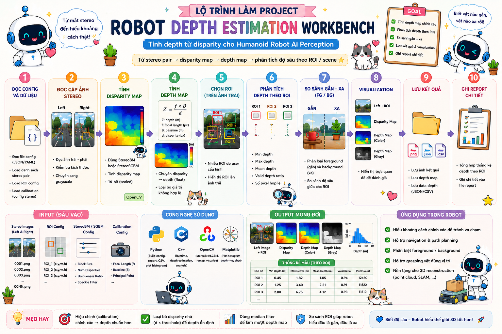

# 🤖 Bài 12: Robot Depth Estimation Workbench — Tính depth từ disparity cho Humanoid Robot AI Perception

> Mini Project số 12 trong **Đợt 3 — Bài 11 → Bài 15**  
> **Bài 12 tiếp tục kết hợp kiến thức của Đợt 1 + Đợt 2 + Đợt 3** theo đúng rule bạn đã chốt.  
> Nếu **Bài 11** đã giúp robot tính **disparity map** và phân tích disparity theo ROI, thì **Bài 12** sẽ tiến thêm một bước rất quan trọng trong stereo perception:
>
> **từ disparity → tính depth → phân tích độ sâu theo ROI / object region / scene.**

---

# 📌 Mục lục

- [1. Bài 12 lấy gì từ Đợt 3](#1-bài-12-lấy-gì-từ-đợt-3)
- [2. Mô tả](#2-mô-tả)
- [3. Bài 12 nằm ở đâu trong roadmap](#3-bài-12-nằm-ở-đâu-trong-roadmap)
- [4. Vì sao Bài 12 là bước tiếp theo hợp lý sau Bài 11](#4-vì-sao-bài-12-là-bước-tiếp-theo-hợp-lý-sau-bài-11)
- [5. Mục tiêu perception của bài](#5-mục-tiêu-perception-của-bài)
- [6. Pipeline perception của bài](#6-pipeline-perception-của-bài)
- [7. Kiến thức cần](#7-kiến-thức-cần)
  - [7.1 C++](#71-c)
  - [7.2 Python](#72-python)
  - [7.3 CV C++](#73-cv-c)
  - [7.4 CV Python](#74-cv-python)
- [8. Kiến thức Đợt 1 + Đợt 2 + Đợt 3 được dùng như thế nào](#8-kiến-thức-đợt-1--đợt-2--đợt-3-được-dùng-như-thế-nào)
- [9. Sau bài này bạn sẽ hiểu gì trong AI Perception](#9-sau-bài-này-bạn-sẽ-hiểu-gì-trong-ai-perception)
- [10. Cấu trúc folder](#10-cấu-trúc-folder)
- [11. Yêu cầu mini-project](#11-yêu-cầu-mini-project)
  - [11.1 Python — BaseConfigBuilder](#111-python--baseconfigbuilder)
  - [11.2 Python — DepthWorkbenchConfigBuilder](#112-python--depthworkbenchconfigbuilder)
  - [11.3 Python — main_config_builder.py](#113-python--main_config_builderpy)
  - [11.4 C++ — BaseSensor](#114-c--basesensor)
  - [11.5 C++ — StereoCameraSensor](#115-c--stereocamerasensor)
  - [11.6 C++ — StereoFrameRecord](#116-c--stereoframerecord)
  - [11.7 C++ — ROIConfig](#117-c--roiconfig)
  - [11.8 C++ — StereoBMConfig](#118-c--stereobmconfig)
  - [11.9 C++ — StereoCalibrationConfig](#119-c--stereocalibrationconfig)
  - [11.10 C++ — DepthROIStats](#1110-c--depthroistats)
  - [11.11 C++ — DepthSceneResult](#1111-c--depthsceneresult)
  - [11.12 C++ — BaseDepthEstimator](#1112-c--basedepthestimator)
  - [11.13 C++ — StereoDepthWorkbench](#1113-c--stereodepthworkbench)
  - [11.14 C++ — DepthReportWriter](#1114-c--depthreportwriter)
  - [11.15 C++ — main.cpp](#1115-c--maincpp)
- [12. Điều kiện bắt buộc](#12-điều-kiện-bắt-buộc)
- [13. Output mong muốn](#13-output-mong-muốn)
- [14. Vai trò của bài này trong Humanoid Robot](#14-vai-trò-của-bài-này-trong-humanoid-robot)
- [15. Checklist hoàn thành](#15-checklist-hoàn-thành)
- [16. Gợi ý mở rộng](#16-gợi-ý-mở-rộng)

---

# 1. Bài 12 lấy gì từ Đợt 3

Sau Bài 11, roadmap Đợt 3 của bạn đang đi đúng trục:

- **Stereo Vision & Depth**
  - `Stereo Camera`
  - `Disparity`
  - `Block Matching`
  - `SGM`
  - `Depth Estimation`
  - `Depth Map`
  - chuẩn bị sang `Point Cloud`

Vì vậy **Bài 12** sẽ lấy đúng phần tiếp theo:

## Phần mới của Đợt 3 mà Bài 12 dùng
### Computer Vision
- **Depth Estimation**
- công thức depth từ stereo:
  ```text
  Z = (f * B) / d
  ```
- suy nghĩ theo ROI depth statistics
- so sánh foreground / background depth

### Python
- tiếp tục làm:
  - config builder
  - report helper
  - có thể chuẩn bị CSV / summary
- nếu muốn có thể dùng `matplotlib` để plot histogram depth

### C++
- vẫn dùng lại:
  - OOP
  - vector
  - module runtime
  - struct config / result

> Bài 12 **chưa nhảy sang point cloud**.  
> Nó là bước trung gian rất quan trọng:
>
> ```text
> stereo pair
> → disparity map
> → depth map
> → depth analysis theo ROI
> ```

---

# 2. Mô tả

Ở **Bài 11**, bạn đã có một module có thể:

- đọc stereo pair
- tính disparity map
- chọn ROI
- tính:
  - min disparity
  - max disparity
  - mean disparity
  - valid disparity ratio
- lưu disparity visualization + report

Bài 12 sẽ **đi tiếp từ disparity sang depth**.

Mini-project này yêu cầu bạn xây một hệ thống nhỏ để robot:

- đọc **cặp ảnh stereo**
- tính **disparity map**
- dùng **focal length** và **baseline** để suy ra **depth map**
- chọn nhiều ROI
- phân tích depth theo ROI:
  - min depth
  - max depth
  - mean depth
  - valid depth ratio
- so sánh ROI gần / xa
- lưu:
  - ảnh left overlay
  - disparity visualization
  - depth visualization
  - report

Ví dụ robot nhìn mặt bàn với 2 vật thể:

- ROI A chứa vật gần camera → depth trung bình nhỏ hơn
- ROI B chứa vật xa hơn → depth trung bình lớn hơn

Từ đó robot bắt đầu hiểu:

```text
object nào gần hơn
object nào xa hơn
vùng nào là foreground / background
```
<p align="center">
  
</p>

---

# 3. Bài 12 nằm ở đâu trong roadmap

## Quy ước hiện tại
- **Đợt 1 = Bài 1 → Bài 5**
- **Đợt 2 = Bài 6 → Bài 10**
- **Đợt 3 = Bài 11 → Bài 15**
- **Đợt 4 = Bài 16 → Bài 20**

Vì vậy:

## **Bài 12 = bài thứ hai của Đợt 3**
và phải **kết hợp lại kiến thức của Đợt 1 + Đợt 2 + Đợt 3**.

---

# 4. Vì sao Bài 12 là bước tiếp theo hợp lý sau Bài 11

## Bài 10 cho bạn:
- proposal correspondence trái / phải

## Bài 11 cho bạn:
- disparity map
- disparity ROI statistics

## Bài 12 nâng thêm một nấc:
- dùng disparity để tính **depth**
- biến stereo image pair thành **thông tin khoảng cách tương đối / gần- xa**

Đây là bước rất hợp lý vì trong stereo perception thật, chuỗi suy nghĩ là:

```text
left-right image pair
→ disparity
→ depth
→ 3D reasoning
```

Bài 11 dừng ở disparity, còn Bài 12 là nơi robot bắt đầu **định lượng khoảng cách**.

---

# 5. Mục tiêu perception của bài

Sau khi làm xong bài này, bạn phải hiểu được luồng:

```text
Stereo Pair Dataset + ROI Config + StereoBM Config + Calibration Config
→ Load Left / Right Image Pair
→ Compute Disparity Map
→ Convert Disparity to Depth
→ Normalize Depth for Visualization
→ Extract ROI Regions on Depth Map
→ Compute ROI Depth Statistics
→ Compare ROI Distances
→ Save Left Overlay + Disparity + Depth Outputs + Report
```

Bài này giúp bạn hiểu một module cực quan trọng trong stereo AI perception:

> **Depth map** là cầu nối trực tiếp từ stereo vision sang 3D perception cho robot.

---

# 6. Pipeline perception của bài

```text
Stereo Pair Config
→ Read Stereo Pair Records
→ Read ROI Config
→ Read StereoBM Config
→ Read Stereo Calibration Config
→ Create Stereo Camera Sensor Object
→ For Each Stereo Pair:
    → Load Left / Right Image
    → Compute Disparity Map
    → Convert Disparity to Depth Map
    → Build Disparity Visualization
    → Build Depth Visualization
    → For Each ROI:
        → Extract ROI on Depth Map
        → Compute ROI Depth Statistics
    → Draw ROI Overlay on Left Image
    → Save Outputs
→ Write Depth Report
```

---

# 7. Kiến thức cần

# 7.1 C++

- class / object
- constructor
- inheritance
- `std::vector`
- `std::string`
- `const`
- `auto`
- function
- if / else
- loop
- struct
- header / source tách file

---

# 7.2 Python

- class / object
- inheritance
- list
- dict
- string
- type casting
- function nhiều tham số
- file write
- loop
- if / else
- module

---

# 7.3 CV C++

Ngoài những thứ của Bài 11, Bài 12 bắt đầu chạm rõ hơn vào:

- `cv::StereoBM` hoặc `cv::StereoSGBM`
- disparity map xử lý ở dạng float
- **depth computation**
- normalize / visualize depth
- ROI depth statistics

---

# 7.4 CV Python

Python không phải runtime depth chính, nhưng có thể dùng để:
- build config
- tổng hợp report
- vẽ histogram depth / disparity bằng `matplotlib`

---

# 8. Kiến thức Đợt 1 + Đợt 2 + Đợt 3 được dùng như thế nào

# 8.1 Phần lấy từ Đợt 1

## Python
- class / inheritance
- function
- loop / if else
- config builder style

## C++
- class sensor
- struct config / result
- file chia header / source

## CV
- đọc ảnh
- grayscale
- ROI
- save image

---

# 8.2 Phần lấy từ Đợt 2

## Python
- list / dict / string parsing
- manifest nhiều stereo pairs

## C++
- vector để lưu nhiều scene result
- runtime nhiều ảnh
- config parsing

## CV
- stereo pair handling
- ROI workflow
- left-right image pipeline

---

# 8.3 Phần mới của Đợt 3

## Python
- có thể dùng matplotlib để plot depth summary

## C++
- dùng OOP để tổ chức stereo depth runtime rõ ràng hơn

## CV
- **disparity → depth**
- **ROI depth statistics**
- **depth visualization**

---

# 9. Sau bài này bạn sẽ hiểu gì trong AI Perception

Sau Bài 12, bạn phải nắm được 8 ý rất quan trọng:

## 1. Disparity không phải mục tiêu cuối
Robot thường cần **depth** hơn là disparity thô.

## 2. Công thức depth là lõi của stereo geometry
Ở mức cơ bản:

```text
Z = (f * B) / d
```

- `Z`: depth
- `f`: focal length
- `B`: baseline
- `d`: disparity

## 3. Disparity nhỏ → depth lớn hơn
Nếu disparity giảm, vật thường ở xa hơn.

## 4. Depth map cho phép robot so sánh khoảng cách giữa các vùng
Ví dụ:
- ROI object
- ROI background
- ROI mặt bàn

## 5. ROI depth statistics là nền cho reasoning
Ví dụ:
- chọn object gần nhất
- phát hiện obstacle gần robot
- ước lượng độ cao tương đối nếu kết hợp geometry sau này

## 6. Depth map khác với point cloud
Depth map vẫn là biểu diễn 2D + giá trị độ sâu.  
Point cloud sẽ là bước tiếp theo.

## 7. Calibration ảnh hưởng trực tiếp đến depth
Nếu baseline / focal length sai, depth cũng sai.

## 8. Đây là cầu nối trực tiếp sang point cloud và camera-to-robot reasoning
Sau Bài 12, bạn sẽ rất thuận lợi để sang:
- point cloud
- back-projection
- camera to robot coordinate

---

# 10. Cấu trúc folder

```text
mini_project_12_robot_depth_estimation_workbench/
│
├─ README.md
│
├─ assets/
│  ├─ stereo_pairs/
│  │  ├─ pair_01_left.jpg
│  │  ├─ pair_01_right.jpg
│  │  ├─ pair_02_left.jpg
│  │  ├─ pair_02_right.jpg
│  │  └─ ...
│  │
│  └─ outputs/
│     ├─ pair_01_left_roi_overlay.jpg
│     ├─ pair_01_disparity_visualization.jpg
│     ├─ pair_01_depth_visualization.jpg
│     ├─ pair_02_left_roi_overlay.jpg
│     ├─ pair_02_disparity_visualization.jpg
│     ├─ pair_02_depth_visualization.jpg
│     └─ depth_report.txt
│
├─ config/
│  ├─ stereo_pair_manifest.txt
│  ├─ roi_config.txt
│  ├─ stereo_bm_config.txt
│  └─ stereo_calibration_config.txt
│
├─ python/
│  ├─ main_config_builder.py
│  └─ tools/
│     ├─ config_builder.py
│     └─ report_template.py
│
└─ cpp/
   ├─ main.cpp
   ├─ include/
   │  ├─ BaseSensor.hpp
   │  ├─ StereoCameraSensor.hpp
   │  ├─ StereoFrameRecord.hpp
   │  ├─ ROIConfig.hpp
   │  ├─ StereoBMConfig.hpp
   │  ├─ StereoCalibrationConfig.hpp
   │  ├─ DepthROIStats.hpp
   │  ├─ DepthSceneResult.hpp
   │  ├─ BaseDepthEstimator.hpp
   │  ├─ StereoDepthWorkbench.hpp
   │  └─ DepthReportWriter.hpp
   │
   └─ src/
      ├─ StereoCameraSensor.cpp
      ├─ StereoDepthWorkbench.cpp
      └─ DepthReportWriter.cpp
```

---

# 11. Yêu cầu mini-project

# 11.1 Python — `BaseConfigBuilder`

**File:**

```text
python/tools/config_builder.py
```

Tạo class cha:

```python
class BaseConfigBuilder:
```

## Thuộc tính cần có

```python
project_name
stereo_manifest_path
roi_config_path
stereo_bm_config_path
stereo_calibration_config_path
```

## Hàm cần có

### `show_project_info()`
- in tên project
- in đường dẫn config

---

# 11.2 Python — `DepthWorkbenchConfigBuilder`

**File:**

```text
python/tools/config_builder.py
```

Tạo class con:

```python
class DepthWorkbenchConfigBuilder(BaseConfigBuilder):
```

## Thuộc tính cần có

```python
stereo_pairs
roi_regions
stereo_bm_config
stereo_calibration_config
```

---

## `stereo_pairs`
Là list các dict:

```python
[
    {
        "pair_name": "pair_01",
        "left_image_path": "assets/stereo_pairs/pair_01_left.jpg",
        "right_image_path": "assets/stereo_pairs/pair_01_right.jpg",
        "sensor_name": "head_stereo_camera",
        "sensor_id": 0
    }
]
```

## `roi_regions`
Ví dụ:

```python
[
    {
        "roi_name": "object_region",
        "x": 160,
        "y": 80,
        "width": 220,
        "height": 180
    }
]
```

## `stereo_bm_config`
Ví dụ:

```python
{
    "matcher_type": "StereoBM",
    "num_disparities": 64,
    "block_size": 15,
    "min_disparity": 0,
    "texture_threshold": 10,
    "uniqueness_ratio": 12
}
```

## `stereo_calibration_config`
Ví dụ:

```python
{
    "focal_length_px": 700.0,
    "baseline_m": 0.12,
    "depth_scale": 1.0
}
```

> `depth_scale` cho phép bạn scale output nếu muốn, nhưng có thể để 1.0.

---

## Hàm cần có

### `add_stereo_pair(pair_name, left_image_path, right_image_path, sensor_name, sensor_id)`
- thêm stereo pair
- kiểm tra chuỗi không rỗng
- `sensor_id >= 0`

### `add_roi_region(roi_name, x, y, width, height)`
- thêm ROI
- kiểm tra hợp lệ

### `set_stereo_bm_config(
    matcher_type,
    num_disparities,
    block_size,
    min_disparity,
    texture_threshold,
    uniqueness_ratio
)`
- giống Bài 11

### `set_stereo_calibration_config(
    focal_length_px,
    baseline_m,
    depth_scale
)`
**Hành vi**
- lưu calibration config
- kiểm tra:
  - `focal_length_px > 0`
  - `baseline_m > 0`
  - `depth_scale > 0`

### `write_stereo_manifest()`
**Format gợi ý**
```text
pair_01|assets/stereo_pairs/pair_01_left.jpg|assets/stereo_pairs/pair_01_right.jpg|head_stereo_camera|0
pair_02|assets/stereo_pairs/pair_02_left.jpg|assets/stereo_pairs/pair_02_right.jpg|head_stereo_camera|0
```

### `write_roi_config()`
**Format gợi ý**
```text
object_region|160|80|220|180
background_region|380|80|180|180
left_region|0|80|180|180
```

### `write_stereo_bm_config()`
- giống Bài 11

### `write_stereo_calibration_config()`
**Format gợi ý**
```text
focal_length_px=700.0
baseline_m=0.12
depth_scale=1.0
```

---

# 11.3 Python — `main_config_builder.py`

## Yêu cầu
- tạo ít nhất **3 stereo pairs**
- tạo ít nhất **3 ROI**
- set stereo BM config
- set stereo calibration config
- ghi đủ:
  - `config/stereo_pair_manifest.txt`
  - `config/roi_config.txt`
  - `config/stereo_bm_config.txt`
  - `config/stereo_calibration_config.txt`

---

# 11.4 C++ — `BaseSensor`

**File:**

```text
cpp/include/BaseSensor.hpp
```

- giống các bài trước

---

# 11.5 C++ — `StereoCameraSensor`

**File:**

```text
cpp/include/StereoCameraSensor.hpp
cpp/src/StereoCameraSensor.cpp
```

## Thuộc tính cần có

```cpp
private:
    int stereo_id;
    std::string left_camera_name;
    std::string right_camera_name;
```

---

# 11.6 C++ — `StereoFrameRecord`

**File:**

```text
cpp/include/StereoFrameRecord.hpp
```

## Thuộc tính cần có

```cpp
std::string pair_name;
std::string left_image_path;
std::string right_image_path;
std::string sensor_name;
int sensor_id;
```

---

# 11.7 C++ — `ROIConfig`

**File:**

```text
cpp/include/ROIConfig.hpp
```

## Thuộc tính cần có

```cpp
std::string roi_name;
int x;
int y;
int width;
int height;
```

---

# 11.8 C++ — `StereoBMConfig`

**File:**

```text
cpp/include/StereoBMConfig.hpp
```

Tạo struct:

```cpp
struct StereoBMConfig
```

## Thuộc tính cần có

```cpp
std::string matcher_type;
int num_disparities;
int block_size;
int min_disparity;
int texture_threshold;
int uniqueness_ratio;
```

---

# 11.9 C++ — `StereoCalibrationConfig`

**File:**

```text
cpp/include/StereoCalibrationConfig.hpp
```

Tạo struct:

```cpp
struct StereoCalibrationConfig
```

## Thuộc tính cần có

```cpp
double focal_length_px;
double baseline_m;
double depth_scale;
```

---

# 11.10 C++ — `DepthROIStats`

**File:**

```text
cpp/include/DepthROIStats.hpp
```

Tạo struct:

```cpp
struct DepthROIStats
```

## Thuộc tính cần có

```cpp
std::string pair_name;
std::string roi_name;
cv::Rect roi_rect;

double min_depth;
double max_depth;
double mean_depth;
double valid_ratio;

bool is_valid;
```

### Giải thích
- `valid_ratio` = tỉ lệ pixel depth hợp lệ trong ROI
- depth hợp lệ có thể là depth > 0 và hữu hạn

---

# 11.11 C++ — `DepthSceneResult`

**File:**

```text
cpp/include/DepthSceneResult.hpp
```

Tạo struct:

```cpp
struct DepthSceneResult
```

## Thuộc tính cần có

```cpp
std::string pair_name;

std::string left_image_path;
std::string right_image_path;

std::string left_overlay_output_path;
std::string disparity_output_path;
std::string depth_output_path;

std::string sensor_name;
int sensor_id;

int image_width;
int image_height;

int roi_count;
bool is_valid;

std::vector<DepthROIStats> roi_stats;
```

---

# 11.12 C++ — `BaseDepthEstimator`

**File:**

```text
cpp/include/BaseDepthEstimator.hpp
```

Tạo class trừu tượng:

```cpp
class BaseDepthEstimator
```

## Hàm cần có

```cpp
virtual void load_stereo_manifest(const std::string& path) = 0;
virtual void load_roi_config(const std::string& path) = 0;
virtual void load_stereo_bm_config(const std::string& path) = 0;
virtual void load_stereo_calibration_config(const std::string& path) = 0;
virtual void run_depth_estimation() = 0;
virtual ~BaseDepthEstimator() = default;
```

---

# 11.13 C++ — `StereoDepthWorkbench`

**File:**

```text
cpp/include/StereoDepthWorkbench.hpp
cpp/src/StereoDepthWorkbench.cpp
```

Tạo class kế thừa:

```cpp
class StereoDepthWorkbench : public BaseDepthEstimator
```

## Thuộc tính cần có

```cpp
private:
    std::vector<StereoFrameRecord> stereo_records;
    std::vector<ROIConfig> roi_configs;
    StereoBMConfig stereo_bm_config;
    StereoCalibrationConfig stereo_calibration_config;

    std::vector<DepthSceneResult> scene_results;
```

---

## Hàm cần có

### Load / Read config
- `read_stereo_manifest(...)`
- `read_roi_config(...)`
- `read_stereo_bm_config(...)`
- `read_stereo_calibration_config(...)`
- các hàm `load_...(...) override`

---

## Stereo disparity part

### `cv::Rect clamp_roi_to_image(const ROIConfig& roi_cfg, const cv::Mat& image) const;`

### `cv::Mat compute_disparity_map(
    const cv::Mat& left_bgr,
    const cv::Mat& right_bgr
) const;`
- tương tự Bài 11

### `cv::Mat build_disparity_visualization(const cv::Mat& disparity_map) const;`
- normalize disparity để hiển thị

---

## Depth part

### `cv::Mat compute_depth_map(const cv::Mat& disparity_map) const;`

## Hành vi gợi ý
1. tạo depth map kiểu `CV_32F`
2. duyệt từng pixel disparity
3. nếu disparity hợp lệ và > 0:
   ```text
   depth = (focal_length_px * baseline_m) / disparity
   depth *= depth_scale
   ```
4. nếu disparity không hợp lệ:
   - depth = 0 hoặc một giá trị sentinel

---

### `cv::Mat build_depth_visualization(const cv::Mat& depth_map) const;`

## Hành vi
- normalize depth map về khoảng hiển thị
- convert sang `CV_8U`
- có thể invert nếu muốn “gần sáng / xa tối” hoặc ngược lại
- có thể apply colormap

---

### `DepthROIStats analyze_single_roi(
    const std::string& pair_name,
    const ROIConfig& roi_cfg,
    const cv::Mat& depth_map
) const;`

## Hành vi tổng quát
1. clamp ROI
2. crop ROI trên depth map
3. duyệt từng pixel depth
4. chỉ lấy pixel hợp lệ
5. tính:
   - min depth
   - max depth
   - mean depth
   - valid_ratio
6. build `DepthROIStats`

---

### `void draw_roi_overlay(
    cv::Mat& left_image,
    const std::vector<DepthROIStats>& roi_stats
) const;`

## Hành vi
- vẽ ROI lên ảnh trái
- ghi:
  - tên ROI
  - mean depth
  - valid ratio

---

### `DepthSceneResult process_single_stereo_pair(
    const StereoFrameRecord& record
);`

## Hành vi tổng quát
1. đọc ảnh trái / phải
2. nếu lỗi → result invalid
3. compute disparity map
4. compute depth map
5. build disparity visualization
6. build depth visualization
7. loop qua ROI
8. analyze depth theo ROI
9. vẽ ROI overlay lên ảnh trái
10. lưu:
   - left overlay
   - disparity visualization
   - depth visualization
11. build `DepthSceneResult`

---

### `void run_depth_estimation() override;`
- loop qua stereo pairs

### Getter

```cpp
const std::vector<DepthSceneResult>& get_scene_results() const;
```

---

# 11.14 C++ — `DepthReportWriter`

**File:**

```text
cpp/include/DepthReportWriter.hpp
cpp/src/DepthReportWriter.cpp
```

Tạo class:

```cpp
class DepthReportWriter
```

## Hàm cần có

### `void write_report(
    const std::string& report_path,
    const std::vector<DepthSceneResult>& scene_results
);`

## Format gợi ý

```text
[Depth Scene]
Pair Name: pair_01
Left Image: assets/stereo_pairs/pair_01_left.jpg
Right Image: assets/stereo_pairs/pair_01_right.jpg
Left Overlay Output: assets/outputs/pair_01_left_roi_overlay.jpg
Disparity Output: assets/outputs/pair_01_disparity_visualization.jpg
Depth Output: assets/outputs/pair_01_depth_visualization.jpg
Sensor: head_stereo_camera
ROI Count: 3
Valid: true

  [ROI Depth]
  ROI Name: object_region
  Rect: x=160, y=80, w=220, h=180
  Min Depth: 0.62
  Max Depth: 1.54
  Mean Depth: 0.93
  Valid Ratio: 0.79
  Valid: true

----------------------------------------
```

---

# 11.15 C++ — `main.cpp`

## Yêu cầu
- tạo ít nhất **1 StereoCameraSensor**
- in thông tin sensor
- tạo `StereoDepthWorkbench`
- load:
  - `config/stereo_pair_manifest.txt`
  - `config/roi_config.txt`
  - `config/stereo_bm_config.txt`
  - `config/stereo_calibration_config.txt`
- chạy `run_depth_estimation()`
- tạo `DepthReportWriter`
- ghi report ra:
  - `assets/outputs/depth_report.txt`

## Pipeline `main.cpp`

```text
Create StereoCameraSensor
→ Load Stereo Pair Manifest
→ Load ROI Config
→ Load StereoBM Config
→ Load Stereo Calibration Config
→ Run Depth Estimation Workbench
→ Save Left Overlay + Disparity + Depth Outputs
→ Write Depth Report
```

---

# 12. Điều kiện bắt buộc

Project bắt buộc phải có:

- OOP trong Python
- OOP trong C++
- Inheritance trong Python
- Inheritance trong C++
- Function tách rõ
- Module Python
- Header / Source C++ tách file
- `loop`
- `if / else`
- `list` / `dict`
- `std::vector`
- nhiều stereo pairs từ manifest
- disparity map computation
- depth map computation
- ROI depth statistics
- disparity visualization
- depth visualization
- report scene-level

---

# 13. Output mong muốn

## File config
```text
config/stereo_pair_manifest.txt
config/roi_config.txt
config/stereo_bm_config.txt
config/stereo_calibration_config.txt
```

## Ảnh output
```text
assets/outputs/pair_01_left_roi_overlay.jpg
assets/outputs/pair_01_disparity_visualization.jpg
assets/outputs/pair_01_depth_visualization.jpg
assets/outputs/pair_02_left_roi_overlay.jpg
assets/outputs/pair_02_disparity_visualization.jpg
assets/outputs/pair_02_depth_visualization.jpg
```

## File report
```text
assets/outputs/depth_report.txt
```

---

## Ví dụ `stereo_calibration_config.txt`

```text
focal_length_px=700.0
baseline_m=0.12
depth_scale=1.0
```

---

## Ví dụ `depth_report.txt`

```text
[Depth Scene]
Pair Name: pair_01
Left Image: assets/stereo_pairs/pair_01_left.jpg
Right Image: assets/stereo_pairs/pair_01_right.jpg
Left Overlay Output: assets/outputs/pair_01_left_roi_overlay.jpg
Disparity Output: assets/outputs/pair_01_disparity_visualization.jpg
Depth Output: assets/outputs/pair_01_depth_visualization.jpg
Sensor: head_stereo_camera
ROI Count: 3
Valid: true

  [ROI Depth]
  ROI Name: object_region
  Rect: x=160, y=80, w=220, h=180
  Min Depth: 0.62
  Max Depth: 1.54
  Mean Depth: 0.93
  Valid Ratio: 0.79
  Valid: true

----------------------------------------
```

---

# 14. Vai trò của bài này trong Humanoid Robot

## Python đóng vai trò gì?
Python ở đây đóng vai trò:

- tạo **stereo pair manifest**
- tạo **ROI config**
- tạo **StereoBM config**
- tạo **stereo calibration config**
- có thể hỗ trợ vẽ histogram / summary

Tức là Python làm phần:

```text
Depth Workbench Config Builder + Report Helper
```

---

## C++ đóng vai trò gì?
C++ là runtime chính của bài này:

- đọc stereo pair
- compute disparity map
- convert disparity sang depth
- phân tích depth theo ROI
- lưu overlay + disparity + depth outputs + report

Tức là C++ làm phần:

```text
Stereo Depth Runtime Workbench
```

---

## Computer Vision đóng vai trò gì?
CV ở đây đóng vai trò:

- **biến stereo pair thành disparity**
- **biến disparity thành depth**
- **phân tích độ sâu trong từng vùng ảnh**
- **bắt đầu suy luận khoảng cách cho robot**

Tức là CV làm phần:

```text
Left/Right Stereo Pair → Disparity → Depth → ROI Depth Analysis
```

---

# 15. Checklist hoàn thành

- [ ] Tạo đúng cấu trúc folder
- [ ] Python tạo được `stereo_pair_manifest.txt`
- [ ] Python tạo được `roi_config.txt`
- [ ] Python tạo được `stereo_bm_config.txt`
- [ ] Python tạo được `stereo_calibration_config.txt`
- [ ] Python có class cha / class con
- [ ] Python có list / dict / string / function / loop / if else
- [ ] C++ có `BaseSensor`
- [ ] C++ có `StereoCameraSensor`
- [ ] C++ có `StereoFrameRecord`
- [ ] C++ có `ROIConfig`
- [ ] C++ có `StereoBMConfig`
- [ ] C++ có `StereoCalibrationConfig`
- [ ] C++ có `DepthROIStats`
- [ ] C++ có `DepthSceneResult`
- [ ] C++ có `BaseDepthEstimator`
- [ ] C++ có `StereoDepthWorkbench`
- [ ] C++ load được stereo manifest
- [ ] C++ load được ROI config
- [ ] C++ load được stereo BM config
- [ ] C++ load được stereo calibration config
- [ ] C++ compute được disparity map
- [ ] C++ compute được depth map
- [ ] C++ build được disparity visualization
- [ ] C++ build được depth visualization
- [ ] C++ tính được ROI depth statistics
- [ ] C++ vẽ được ROI overlay
- [ ] C++ lưu được output images
- [ ] C++ build được depth report

---

# 16. Gợi ý mở rộng

## 1. Hỗ trợ cả StereoBM và StereoSGBM
Bạn có thể cho project chạy 2 mode rồi so sánh kết quả disparity / depth.

## 2. Thêm histogram depth cho từng ROI
Python đọc report hoặc file CSV rồi plot histogram bằng matplotlib.

## 3. Kết hợp proposal từ Bài 10
Thay vì ROI cố định, bạn có thể dùng proposal box làm vùng đo depth.

## 4. Chuẩn bị cho Bài 13
Sau Bài 12, bước hợp lý nhất cho **Bài 13** là:

```text
Robot Point Cloud Starter
```

tức là:
- lấy depth
- back-project pixel / ROI sang 3D
- bắt đầu sinh point cloud cơ bản

---

# 🚀 Sau bài này bạn sẽ có gì?

Sau khi hoàn thành **Bài 12**, bạn sẽ tiếp tục Đợt 3 theo đúng trục stereo-depth:

- **Bài 11**: disparity map + ROI disparity analysis
- **Bài 12**: **depth map + ROI depth analysis**

Tức là bạn đã đi từ:

```text
left-right disparity reasoning
```

sang

```text
distance reasoning cho từng vùng ảnh
```

Đây là nền rất đẹp để sang **Bài 13** làm **Point Cloud Starter** — nơi bạn bắt đầu đưa depth map sang **3D representation** thật sự.
