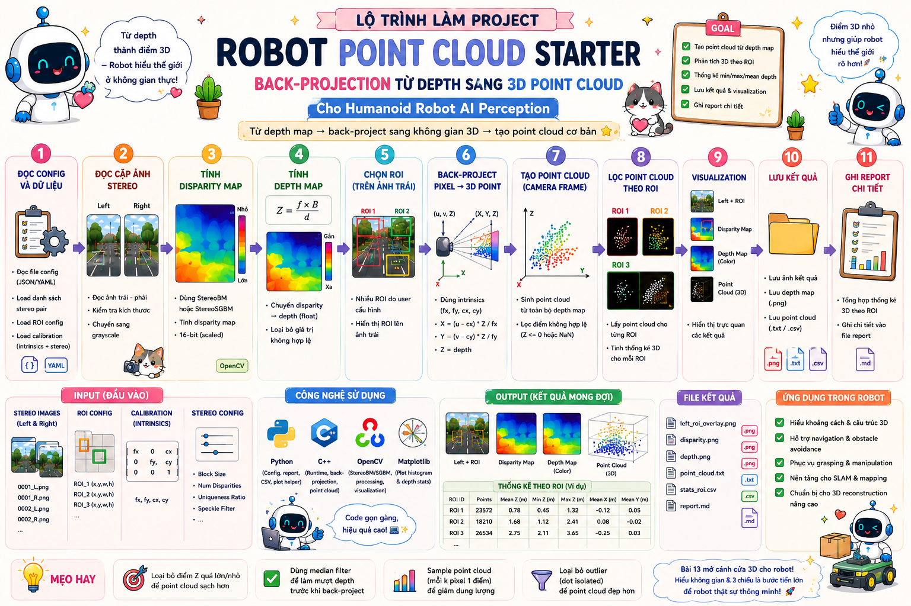
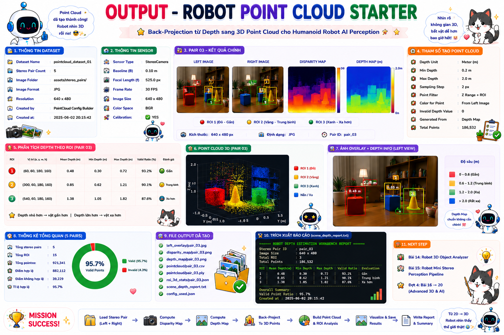

# 🤖 Bài 13: Robot Point Cloud Starter — Back-Projection từ Depth sang 3D Point Cloud cho Humanoid Robot AI Perception

> Mini Project số 13 trong **Đợt 3 — Bài 11 → Bài 15**  
> **Bài 13 tiếp tục kết hợp kiến thức của Đợt 1 + Đợt 2 + Đợt 3** theo đúng rule bạn đã chốt.  
> Nếu **Bài 12** đã giúp robot đi từ **disparity → depth map → ROI depth analysis**, thì **Bài 13** sẽ đẩy tiếp sang bước cực kỳ quan trọng trong stereo perception:
>
> **từ depth map → back-project sang không gian 3D → tạo point cloud cơ bản cho robot.**

---

# 📌 Mục lục

- [1. Bài 13 lấy gì từ Đợt 3](#1-bài-13-lấy-gì-từ-đợt-3)
- [2. Mô tả](#2-mô-tả)
- [3. Bài 13 nằm ở đâu trong roadmap](#3-bài-13-nằm-ở-đâu-trong-roadmap)
- [4. Vì sao Bài 13 là bước tiếp theo hợp lý sau Bài 12](#4-vì-sao-bài-13-là-bước-tiếp-theo-hợp-lý-sau-bài-12)
- [5. Mục tiêu perception của bài](#5-mục-tiêu-perception-của-bài)
- [6. Pipeline perception của bài](#6-pipeline-perception-của-bài)
- [7. Kiến thức cần](#7-kiến-thức-cần)
  - [7.1 C++](#71-c)
  - [7.2 Python](#72-python)
  - [7.3 CV C++](#73-cv-c)
  - [7.4 CV Python](#74-cv-python)
- [8. Kiến thức Đợt 1 + Đợt 2 + Đợt 3 được dùng như thế nào](#8-kiến-thức-đợt-1--đợt-2--đợt-3-được-dùng-như-thế-nào)
- [9. Sau bài này bạn sẽ hiểu gì trong AI Perception](#9-sau-bài-này-bạn-sẽ-hiểu-gì-trong-ai-perception)
- [10. Cấu trúc folder](#10-cấu-trúc-folder)
- [11. Yêu cầu mini-project](#11-yêu-cầu-mini-project)
  - [11.1 Python — BaseConfigBuilder](#111-python--baseconfigbuilder)
  - [11.2 Python — PointCloudConfigBuilder](#112-python--pointcloudconfigbuilder)
  - [11.3 Python — main_config_builder.py](#113-python--main_config_builderpy)
  - [11.4 C++ — BaseSensor](#114-c--basesensor)
  - [11.5 C++ — StereoCameraSensor](#115-c--stereocamerasensor)
  - [11.6 C++ — StereoFrameRecord](#116-c--stereoframerecord)
  - [11.7 C++ — ROIConfig](#117-c--roiconfig)
  - [11.8 C++ — StereoBMConfig](#118-c--stereobmconfig)
  - [11.9 C++ — StereoCalibrationConfig](#119-c--stereocalibrationconfig)
  - [11.10 C++ — CameraIntrinsics](#1110-c--cameraintrinsics)
  - [11.11 C++ — Point3D](#1111-c--point3d)
  - [11.12 C++ — ROI3DStats](#1112-c--roi3dstats)
  - [11.13 C++ — PointCloudSceneResult](#1113-c--pointcloudsceneresult)
  - [11.14 C++ — BasePointCloudBuilder](#1114-c--basepointcloudbuilder)
  - [11.15 C++ — StereoPointCloudBuilder](#1115-c--stereopointcloudbuilder)
  - [11.16 C++ — PointCloudReportWriter](#1116-c--pointcloudreportwriter)
  - [11.17 C++ — main.cpp](#1117-c--maincpp)
- [12. Điều kiện bắt buộc](#12-điều-kiện-bắt-buộc)
- [13. Output mong muốn](#13-output-mong-muốn)
- [14. Vai trò của bài này trong Humanoid Robot](#14-vai-trò-của-bài-này-trong-humanoid-robot)
- [15. Checklist hoàn thành](#15-checklist-hoàn-thành)
- [16. Gợi ý mở rộng](#16-gợi-ý-mở-rộng)

---

# 1. Bài 13 lấy gì từ Đợt 3

Sau Bài 12, trục Đợt 3 của bạn đang là:

- **Stereo Camera**
- **Disparity**
- **Depth Estimation**
- chuẩn bị sang:
  - **Back Projection**
  - **3D Coordinate Recovery**
  - **Point Cloud Generation**

Vì vậy **Bài 13** lấy đúng phần tiếp theo:

## Phần mới của Đợt 3 mà Bài 13 dùng
### Computer Vision / 3D Vision
- **Back Projection**
- **3D Coordinate Recovery**
- **Point Cloud cơ bản**
- camera intrinsics:
  - `fx, fy, cx, cy`
- chuyển từ:
  ```text
  pixel + depth
  ```
  sang
  ```text
  X, Y, Z trong camera frame
  ```

### Python
- tiếp tục làm:
  - config builder
  - ROI / sampling config
  - report helper

### C++
- vẫn dùng:
  - OOP
  - vector
  - struct config / result
  - runtime pipeline

> Bài 13 **chưa ép bạn làm PCL hay point cloud viewer nặng**.  
> Mục tiêu là:
>
> ```text
> stereo pair
> → disparity
> → depth
> → back-project thành point cloud cơ bản
> ```

---

# 2. Mô tả

Ở **Bài 12**, bạn đã có một module có thể:

- đọc stereo pair
- tính disparity map
- chuyển disparity sang depth map
- chọn ROI
- tính depth statistics
- lưu depth visualization + report

Bài 13 sẽ **đi tiếp từ depth sang 3D point cloud**.

Mini-project này yêu cầu bạn xây một hệ thống nhỏ để robot:

- đọc **cặp ảnh stereo**
- tính **disparity map**
- tính **depth map**
- dùng **intrinsics + depth** để **back-project pixel thành điểm 3D**
- sinh **point cloud cơ bản**
- lấy point cloud theo từng ROI
- tính thống kê 3D theo ROI:
  - số lượng điểm hợp lệ
  - min/max/mean depth Z
  - min/max X
  - min/max Y
- lưu:
  - left ROI overlay
  - disparity visualization
  - depth visualization
  - file point cloud text / csv
  - report

Ví dụ robot nhìn một chiếc hộp trên bàn:

- ROI object → point cloud tập trung ở vùng depth gần
- ROI background → point cloud sâu hơn, Z lớn hơn

Từ đó robot bắt đầu hiểu:

```text
pixel này trong ảnh tương ứng điểm nào trong không gian camera
vật thể ở trước camera cách bao xa
vùng nào trong ảnh tạo ra cụm điểm 3D gần robot
```
<p align="center">
  
</p>

---

# 3. Bài 13 nằm ở đâu trong roadmap

## Quy ước hiện tại
- **Đợt 1 = Bài 1 → Bài 5**
- **Đợt 2 = Bài 6 → Bài 10**
- **Đợt 3 = Bài 11 → Bài 15**
- **Đợt 4 = Bài 16 → Bài 20**

Vì vậy:

## **Bài 13 = bài thứ ba của Đợt 3**
và phải **kết hợp lại kiến thức của Đợt 1 + Đợt 2 + Đợt 3**.

---

# 4. Vì sao Bài 13 là bước tiếp theo hợp lý sau Bài 12

## Bài 11 cho bạn:
- disparity map

## Bài 12 cho bạn:
- depth map
- depth ROI statistics

## Bài 13 nâng thêm một nấc:
- từ depth map, **biến từng pixel thành điểm 3D**
- tức là bắt đầu bước sang **3D representation**

Đây là bước rất hợp lý vì trong stereo perception thật, chuỗi suy nghĩ là:

```text
left-right image pair
→ disparity
→ depth
→ 3D point in camera frame
→ point cloud / 3D scene reasoning
```

---

# 5. Mục tiêu perception của bài

Sau khi làm xong bài này, bạn phải hiểu được luồng:

```text
Stereo Pair Dataset + ROI Config + StereoBM Config + Calibration Config + Intrinsics
→ Load Left / Right Image Pair
→ Compute Disparity Map
→ Convert Disparity to Depth
→ Back-Project Valid Pixels to 3D Points
→ Build ROI-Level Point Clouds
→ Compute ROI 3D Statistics
→ Save Overlay + Disparity + Depth + Point Cloud + Report
```

Bài này giúp bạn hiểu một module cực quan trọng trong stereo AI perception:

> **Point cloud** là bước đầu tiên để robot chuyển từ ảnh 2D sang biểu diễn hình học 3D của môi trường.

---

# 6. Pipeline perception của bài

```text
Stereo Pair Config
→ Read Stereo Pair Records
→ Read ROI Config
→ Read StereoBM Config
→ Read Stereo Calibration Config
→ Read Camera Intrinsics
→ Create Stereo Camera Sensor Object
→ For Each Stereo Pair:
    → Load Left / Right Image
    → Compute Disparity Map
    → Convert Disparity to Depth Map
    → Back-Project Valid Depth Pixels to 3D Points
    → Split / Analyze Points by ROI
    → Compute ROI 3D Statistics
    → Save Point Cloud File
    → Save Overlay + Disparity + Depth Outputs
→ Write Point Cloud Report
```

---

# 7. Kiến thức cần

# 7.1 C++

- class / object
- constructor
- inheritance
- `std::vector`
- `std::string`
- `const`
- `auto`
- function
- if / else
- loop
- struct
- header / source tách file

---

# 7.2 Python

- class / object
- inheritance
- list
- dict
- string
- type casting
- function nhiều tham số
- file write
- loop
- if / else
- module

---

# 7.3 CV C++

Ngoài những thứ của Bài 12, Bài 13 bắt đầu chạm rõ hơn vào:

- disparity map dạng float
- depth map dạng float
- **back projection**
- thao tác pixel `(u, v)` → điểm `(X, Y, Z)`
- export point cloud đơn giản

---

# 7.4 CV Python

Python không phải runtime point cloud chính, nhưng có thể dùng để:
- build config
- tạo file intrinsics / calibration
- tổng hợp summary

---

# 8. Kiến thức Đợt 1 + Đợt 2 + Đợt 3 được dùng như thế nào

# 8.1 Phần lấy từ Đợt 1

## Python
- class / inheritance
- function
- loop / if else
- config builder style

## C++
- class sensor
- struct config / result
- file chia header / source

## CV
- đọc ảnh
- grayscale
- ROI
- save image

---

# 8.2 Phần lấy từ Đợt 2

## Python
- list / dict / string parsing
- manifest nhiều stereo pairs

## C++
- vector để lưu nhiều scene result
- runtime nhiều ảnh
- config parsing

## CV
- stereo pair handling
- ROI workflow
- proposal / region thinking

---

# 8.3 Phần mới của Đợt 3

## Python
- thêm config cho intrinsics / point sampling

## C++
- tổ chức point cloud runtime bằng OOP

## CV / 3D Vision
- **depth → 3D point**
- **camera frame point cloud**
- **ROI 3D statistics**

---

# 9. Sau bài này bạn sẽ hiểu gì trong AI Perception

Sau Bài 13, bạn phải nắm được 9 ý rất quan trọng:

## 1. Depth map chưa phải đích cuối
Depth map vẫn là ảnh 2D có giá trị độ sâu.  
Muốn reasoning 3D tốt hơn, robot thường cần point cloud hoặc tọa độ 3D.

## 2. Back projection là bước lõi
Từ pixel `(u, v)` và depth `Z`, bạn có thể suy ra:

```text
X = (u - cx) * Z / fx
Y = (v - cy) * Z / fy
Z = depth
```

## 3. Camera intrinsics quyết định cách pixel biến thành tọa độ 3D
Bạn phải hiểu vai trò của:
- `fx`
- `fy`
- `cx`
- `cy`

## 4. Point cloud là tập hợp các điểm 3D
Mỗi điểm có thể là:
```text
(X, Y, Z)
```
và nếu muốn có thể gắn thêm:
```text
(R, G, B)
```

## 5. ROI point cloud giúp robot phân tích object / vùng quan tâm riêng
Thay vì dùng toàn ảnh, robot có thể chỉ quan tâm point cloud của:
- object region
- floor region
- obstacle region

## 6. Z thường là depth theo camera frame
Trong bài starter này, bạn nên coi:
- `Z` = khoảng cách dọc trục nhìn của camera
- `X` = ngang ảnh
- `Y` = dọc ảnh

## 7. Point cloud là cầu nối sang camera-to-robot transform
Sau khi có điểm 3D trong camera frame, bước tiếp theo rất tự nhiên là:
- transform sang robot frame / base frame

## 8. Point cloud có thể rất dày, nên cần sampling
Không nhất thiết back-project mọi pixel.  
Bạn có thể:
- lấy mỗi 2 pixel / 4 pixel
- chỉ lấy pixel depth hợp lệ trong ROI

## 9. Đây là cầu nối trực tiếp sang camera-to-robot coordinate và object 3D localization
Sau Bài 13, bạn sẽ rất thuận lợi để sang:
- camera → robot transform
- point cloud filtering
- object 3D center estimation

---

# 10. Cấu trúc folder

```text
mini_project_13_robot_point_cloud_starter/
│
├─ README.md
│
├─ assets/
│  ├─ stereo_pairs/
│  │  ├─ pair_01_left.jpg
│  │  ├─ pair_01_right.jpg
│  │  ├─ pair_02_left.jpg
│  │  ├─ pair_02_right.jpg
│  │  └─ ...
│  │
│  └─ outputs/
│     ├─ pair_01_left_roi_overlay.jpg
│     ├─ pair_01_disparity_visualization.jpg
│     ├─ pair_01_depth_visualization.jpg
│     ├─ pair_01_point_cloud.txt
│     ├─ pair_02_left_roi_overlay.jpg
│     ├─ pair_02_disparity_visualization.jpg
│     ├─ pair_02_depth_visualization.jpg
│     ├─ pair_02_point_cloud.txt
│     └─ point_cloud_report.txt
│
├─ config/
│  ├─ stereo_pair_manifest.txt
│  ├─ roi_config.txt
│  ├─ stereo_bm_config.txt
│  ├─ stereo_calibration_config.txt
│  └─ camera_intrinsics_config.txt
│
├─ python/
│  ├─ main_config_builder.py
│  └─ tools/
│     ├─ config_builder.py
│     └─ report_template.py
│
└─ cpp/
   ├─ main.cpp
   ├─ include/
   │  ├─ BaseSensor.hpp
   │  ├─ StereoCameraSensor.hpp
   │  ├─ StereoFrameRecord.hpp
   │  ├─ ROIConfig.hpp
   │  ├─ StereoBMConfig.hpp
   │  ├─ StereoCalibrationConfig.hpp
   │  ├─ CameraIntrinsics.hpp
   │  ├─ Point3D.hpp
   │  ├─ ROI3DStats.hpp
   │  ├─ PointCloudSceneResult.hpp
   │  ├─ BasePointCloudBuilder.hpp
   │  ├─ StereoPointCloudBuilder.hpp
   │  └─ PointCloudReportWriter.hpp
   │
   └─ src/
      ├─ StereoCameraSensor.cpp
      ├─ StereoPointCloudBuilder.cpp
      └─ PointCloudReportWriter.cpp
```

---

# 11. Yêu cầu mini-project

# 11.1 Python — `BaseConfigBuilder`

**File:**

```text
python/tools/config_builder.py
```

Tạo class cha:

```python
class BaseConfigBuilder:
```

## Thuộc tính cần có

```python
project_name
stereo_manifest_path
roi_config_path
stereo_bm_config_path
stereo_calibration_config_path
camera_intrinsics_config_path
```

## Hàm cần có

### `show_project_info()`
- in tên project
- in đường dẫn config

---

# 11.2 Python — `PointCloudConfigBuilder`

**File:**

```text
python/tools/config_builder.py
```

Tạo class con:

```python
class PointCloudConfigBuilder(BaseConfigBuilder):
```

## Thuộc tính cần có

```python
stereo_pairs
roi_regions
stereo_bm_config
stereo_calibration_config
camera_intrinsics_config
point_sampling_config
```

---

## `stereo_pairs`
Là list các dict như Bài 12.

## `roi_regions`
Ví dụ:

```python
[
    {
        "roi_name": "object_region",
        "x": 160,
        "y": 80,
        "width": 220,
        "height": 180
    }
]
```

## `stereo_bm_config`
Giống Bài 12.

## `stereo_calibration_config`
Ví dụ:

```python
{
    "focal_length_px": 700.0,
    "baseline_m": 0.12,
    "depth_scale": 1.0
}
```

## `camera_intrinsics_config`
Ví dụ:

```python
{
    "fx": 700.0,
    "fy": 700.0,
    "cx": 320.0,
    "cy": 240.0
}
```

## `point_sampling_config`
Ví dụ:

```python
{
    "pixel_step": 2,
    "max_depth_m": 5.0,
    "min_depth_m": 0.1
}
```

---

## Hàm cần có

### `add_stereo_pair(pair_name, left_image_path, right_image_path, sensor_name, sensor_id)`
- thêm stereo pair
- kiểm tra hợp lệ

### `add_roi_region(roi_name, x, y, width, height)`
- thêm ROI
- kiểm tra hợp lệ

### `set_stereo_bm_config(...)`
- giống Bài 12

### `set_stereo_calibration_config(focal_length_px, baseline_m, depth_scale)`
- giống Bài 12

### `set_camera_intrinsics_config(fx, fy, cx, cy)`
**Hành vi**
- lưu intrinsics
- kiểm tra:
  - `fx > 0`
  - `fy > 0`

### `set_point_sampling_config(pixel_step, min_depth_m, max_depth_m)`
**Hành vi**
- lưu sampling config
- kiểm tra:
  - `pixel_step >= 1`
  - `min_depth_m > 0`
  - `max_depth_m > min_depth_m`

### `write_stereo_manifest()`
- giống Bài 12

### `write_roi_config()`
- giống Bài 12

### `write_stereo_bm_config()`
- giống Bài 12

### `write_stereo_calibration_config()`
- giống Bài 12

### `write_camera_intrinsics_config()`
**Format gợi ý**
```text
fx=700.0
fy=700.0
cx=320.0
cy=240.0
```

### `write_point_sampling_config()`
**Format gợi ý**
```text
pixel_step=2
min_depth_m=0.1
max_depth_m=5.0
```

> Bạn có thể ghi point sampling vào cùng file intrinsics config hoặc tách file riêng.  
> Trong bài này mình khuyến nghị **tách file riêng** để rõ hơn:
>
> ```text
> config/point_sampling_config.txt
> ```

---

# 11.3 Python — `main_config_builder.py`

## Yêu cầu
- tạo ít nhất **3 stereo pairs**
- tạo ít nhất **3 ROI**
- set:
  - stereo BM config
  - stereo calibration config
  - camera intrinsics config
  - point sampling config
- ghi đủ:
  - `config/stereo_pair_manifest.txt`
  - `config/roi_config.txt`
  - `config/stereo_bm_config.txt`
  - `config/stereo_calibration_config.txt`
  - `config/camera_intrinsics_config.txt`
  - `config/point_sampling_config.txt`

---

# 11.4 C++ — `BaseSensor`

**File:**

```text
cpp/include/BaseSensor.hpp
```

- giống các bài trước

---

# 11.5 C++ — `StereoCameraSensor`

**File:**

```text
cpp/include/StereoCameraSensor.hpp
cpp/src/StereoCameraSensor.cpp
```

## Thuộc tính cần có

```cpp
private:
    int stereo_id;
    std::string left_camera_name;
    std::string right_camera_name;
```

---

# 11.6 C++ — `StereoFrameRecord`

**File:**

```text
cpp/include/StereoFrameRecord.hpp
```

## Thuộc tính cần có

```cpp
std::string pair_name;
std::string left_image_path;
std::string right_image_path;
std::string sensor_name;
int sensor_id;
```

---

# 11.7 C++ — `ROIConfig`

**File:**

```text
cpp/include/ROIConfig.hpp
```

## Thuộc tính cần có

```cpp
std::string roi_name;
int x;
int y;
int width;
int height;
```

---

# 11.8 C++ — `StereoBMConfig`

**File:**

```text
cpp/include/StereoBMConfig.hpp
```

- giống Bài 12

---

# 11.9 C++ — `StereoCalibrationConfig`

**File:**

```text
cpp/include/StereoCalibrationConfig.hpp
```

- giống Bài 12

---

# 11.10 C++ — `CameraIntrinsics`

**File:**

```text
cpp/include/CameraIntrinsics.hpp
```

Tạo struct:

```cpp
struct CameraIntrinsics
```

## Thuộc tính cần có

```cpp
double fx;
double fy;
double cx;
double cy;
```

---

# 11.11 C++ — `Point3D`

**File:**

```text
cpp/include/Point3D.hpp
```

Tạo struct:

```cpp
struct Point3D
```

## Thuộc tính cần có

```cpp
float x;
float y;
float z;

int u;
int v;

bool is_valid;
std::string roi_name;
```

### Giải thích
- `(x, y, z)` là tọa độ 3D trong **camera frame**
- `(u, v)` là pixel gốc trên ảnh trái
- `roi_name` cho biết điểm này đến từ ROI nào

---

# 11.12 C++ — `ROI3DStats`

**File:**

```text
cpp/include/ROI3DStats.hpp
```

Tạo struct:

```cpp
struct ROI3DStats
```

## Thuộc tính cần có

```cpp
std::string pair_name;
std::string roi_name;

int point_count;

double min_x;
double max_x;
double min_y;
double max_y;
double min_z;
double max_z;
double mean_z;

bool is_valid;
```

---

# 11.13 C++ — `PointCloudSceneResult`

**File:**

```text
cpp/include/PointCloudSceneResult.hpp
```

Tạo struct:

```cpp
struct PointCloudSceneResult
```

## Thuộc tính cần có

```cpp
std::string pair_name;

std::string left_image_path;
std::string right_image_path;

std::string left_overlay_output_path;
std::string disparity_output_path;
std::string depth_output_path;
std::string point_cloud_output_path;

std::string sensor_name;
int sensor_id;

int image_width;
int image_height;

int roi_count;
int total_point_count;
bool is_valid;

std::vector<ROI3DStats> roi_stats;
```

---

# 11.14 C++ — `BasePointCloudBuilder`

**File:**

```text
cpp/include/BasePointCloudBuilder.hpp
```

Tạo class trừu tượng:

```cpp
class BasePointCloudBuilder
```

## Hàm cần có

```cpp
virtual void load_stereo_manifest(const std::string& path) = 0;
virtual void load_roi_config(const std::string& path) = 0;
virtual void load_stereo_bm_config(const std::string& path) = 0;
virtual void load_stereo_calibration_config(const std::string& path) = 0;
virtual void load_camera_intrinsics_config(const std::string& path) = 0;
virtual void load_point_sampling_config(const std::string& path) = 0;
virtual void run_point_cloud_build() = 0;
virtual ~BasePointCloudBuilder() = default;
```

---

# 11.15 C++ — `StereoPointCloudBuilder`

**File:**

```text
cpp/include/StereoPointCloudBuilder.hpp
cpp/src/StereoPointCloudBuilder.cpp
```

Tạo class kế thừa:

```cpp
class StereoPointCloudBuilder : public BasePointCloudBuilder
```

## Thuộc tính cần có

```cpp
private:
    std::vector<StereoFrameRecord> stereo_records;
    std::vector<ROIConfig> roi_configs;
    StereoBMConfig stereo_bm_config;
    StereoCalibrationConfig stereo_calibration_config;
    CameraIntrinsics camera_intrinsics;

    int pixel_step;
    double min_depth_m;
    double max_depth_m;

    std::vector<PointCloudSceneResult> scene_results;
```

---

## Hàm cần có

### Load / Read config
- `read_stereo_manifest(...)`
- `read_roi_config(...)`
- `read_stereo_bm_config(...)`
- `read_stereo_calibration_config(...)`
- `read_camera_intrinsics_config(...)`
- `read_point_sampling_config(...)`
- các hàm `load_...(...) override`

---

## Stereo disparity / depth part

### `cv::Rect clamp_roi_to_image(const ROIConfig& roi_cfg, const cv::Mat& image) const;`

### `cv::Mat compute_disparity_map(const cv::Mat& left_bgr, const cv::Mat& right_bgr) const;`
- giống Bài 12

### `cv::Mat compute_depth_map(const cv::Mat& disparity_map) const;`
- giống Bài 12

### `cv::Mat build_disparity_visualization(const cv::Mat& disparity_map) const;`
- giống Bài 12

### `cv::Mat build_depth_visualization(const cv::Mat& depth_map) const;`
- giống Bài 12

---

## Back projection / point cloud part

### `Point3D back_project_pixel_to_point(
    int u,
    int v,
    float depth_value,
    const std::string& roi_name
) const;`

## Hành vi
Dùng công thức:

```text
X = (u - cx) * Z / fx
Y = (v - cy) * Z / fy
Z = depth
```

với:
- `Z = depth_value`
- `X, Y, Z` nằm trong **camera frame**

---

### `std::vector<Point3D> build_roi_point_cloud(
    const std::string& roi_name,
    const cv::Rect& roi_rect,
    const cv::Mat& depth_map
) const;`

## Hành vi tổng quát
1. duyệt pixel trong ROI theo bước `pixel_step`
2. lấy `depth_value`
3. nếu depth hợp lệ và nằm trong `[min_depth_m, max_depth_m]`
   - back-project thành `Point3D`
4. push vào vector

---

### `ROI3DStats analyze_roi_point_cloud(
    const std::string& pair_name,
    const std::string& roi_name,
    const std::vector<Point3D>& points
) const;`

## Hành vi tổng quát
Tính:
- `point_count`
- `min_x`, `max_x`
- `min_y`, `max_y`
- `min_z`, `max_z`
- `mean_z`

---

### `void draw_roi_overlay(
    cv::Mat& left_image,
    const std::vector<ROI3DStats>& roi_stats
) const;`

## Hành vi
- vẽ ROI lên ảnh trái
- ghi:
  - tên ROI
  - số lượng điểm
  - mean Z

---

### `void save_point_cloud_as_txt(
    const std::string& output_path,
    const std::vector<Point3D>& all_points
) const;`

## Format gợi ý
```text
x y z u v roi_name
0.12 -0.03 0.85 210 160 object_region
0.13 -0.02 0.86 212 160 object_region
...
```

---

### `PointCloudSceneResult process_single_stereo_pair(
    const StereoFrameRecord& record
);`

## Hành vi tổng quát
1. đọc ảnh trái / phải
2. compute disparity map
3. compute depth map
4. build disparity / depth visualization
5. loop qua ROI:
   - build ROI point cloud
   - analyze ROI point cloud
6. gộp tất cả point thành `all_points`
7. lưu point cloud txt
8. vẽ overlay lên ảnh trái
9. lưu outputs
10. build `PointCloudSceneResult`

---

### `void run_point_cloud_build() override;`
- loop qua stereo pairs

### Getter

```cpp
const std::vector<PointCloudSceneResult>& get_scene_results() const;
```

---

# 11.16 C++ — `PointCloudReportWriter`

**File:**

```text
cpp/include/PointCloudReportWriter.hpp
cpp/src/PointCloudReportWriter.cpp
```

Tạo class:

```cpp
class PointCloudReportWriter
```

## Hàm cần có

### `void write_report(
    const std::string& report_path,
    const std::vector<PointCloudSceneResult>& scene_results
);`

## Format gợi ý

```text
[Point Cloud Scene]
Pair Name: pair_01
Left Image: assets/stereo_pairs/pair_01_left.jpg
Right Image: assets/stereo_pairs/pair_01_right.jpg
Left Overlay Output: assets/outputs/pair_01_left_roi_overlay.jpg
Disparity Output: assets/outputs/pair_01_disparity_visualization.jpg
Depth Output: assets/outputs/pair_01_depth_visualization.jpg
Point Cloud Output: assets/outputs/pair_01_point_cloud.txt
Sensor: head_stereo_camera
ROI Count: 3
Total Point Count: 1840
Valid: true

  [ROI 3D Stats]
  ROI Name: object_region
  Point Count: 720
  Min X: -0.18
  Max X: 0.05
  Min Y: -0.12
  Max Y: 0.09
  Min Z: 0.62
  Max Z: 1.08
  Mean Z: 0.84
  Valid: true

----------------------------------------
```

---

# 11.17 C++ — `main.cpp`

## Yêu cầu
- tạo ít nhất **1 StereoCameraSensor**
- in thông tin sensor
- tạo `StereoPointCloudBuilder`
- load:
  - `config/stereo_pair_manifest.txt`
  - `config/roi_config.txt`
  - `config/stereo_bm_config.txt`
  - `config/stereo_calibration_config.txt`
  - `config/camera_intrinsics_config.txt`
  - `config/point_sampling_config.txt`
- chạy `run_point_cloud_build()`
- tạo `PointCloudReportWriter`
- ghi report ra:
  - `assets/outputs/point_cloud_report.txt`

## Pipeline `main.cpp`

```text
Create StereoCameraSensor
→ Load Stereo Pair Manifest
→ Load ROI Config
→ Load StereoBM Config
→ Load Stereo Calibration Config
→ Load Camera Intrinsics Config
→ Load Point Sampling Config
→ Run Point Cloud Build
→ Save Left Overlay + Disparity + Depth + Point Cloud
→ Write Point Cloud Report
```

---

# 12. Điều kiện bắt buộc

Project bắt buộc phải có:

- OOP trong Python
- OOP trong C++
- Inheritance trong Python
- Inheritance trong C++
- Function tách rõ
- Module Python
- Header / Source C++ tách file
- `loop`
- `if / else`
- `list` / `dict`
- `std::vector`
- nhiều stereo pairs từ manifest
- disparity map computation
- depth map computation
- back projection sang 3D
- ROI point cloud
- ROI 3D statistics
- lưu point cloud txt
- report scene-level

---

# 13. Output mong muốn

## File config
```text
config/stereo_pair_manifest.txt
config/roi_config.txt
config/stereo_bm_config.txt
config/stereo_calibration_config.txt
config/camera_intrinsics_config.txt
config/point_sampling_config.txt
```

## Ảnh / point cloud output
```text
assets/outputs/pair_01_left_roi_overlay.jpg
assets/outputs/pair_01_disparity_visualization.jpg
assets/outputs/pair_01_depth_visualization.jpg
assets/outputs/pair_01_point_cloud.txt
```

## File report
```text
assets/outputs/point_cloud_report.txt
```

---

## Ví dụ `camera_intrinsics_config.txt`

```text
fx=700.0
fy=700.0
cx=320.0
cy=240.0
```

## Ví dụ `point_sampling_config.txt`

```text
pixel_step=2
min_depth_m=0.1
max_depth_m=5.0
```

## Ví dụ `pair_01_point_cloud.txt`

```text
x y z u v roi_name
0.12 -0.03 0.85 210 160 object_region
0.13 -0.02 0.86 212 160 object_region
0.14 -0.01 0.87 214 160 object_region
```

<p align="center">
  
</p>

---

# 14. Vai trò của bài này trong Humanoid Robot

## Python đóng vai trò gì?
Python ở đây đóng vai trò:

- tạo manifest stereo pairs
- tạo ROI config
- tạo stereo BM config
- tạo calibration + intrinsics config
- tạo point sampling config

Tức là Python làm phần:

```text
Point Cloud Pipeline Config Builder
```

---

## C++ đóng vai trò gì?
C++ là runtime chính của bài này:

- compute disparity
- compute depth
- back-project thành điểm 3D
- tạo point cloud theo ROI / scene
- lưu point cloud + report

Tức là C++ làm phần:

```text
Stereo Point Cloud Runtime Builder
```

---

## Computer Vision đóng vai trò gì?
CV ở đây đóng vai trò:

- **biến stereo pair thành disparity**
- **biến disparity thành depth**
- **biến depth thành point cloud**
- **bắt đầu dựng hình học 3D sơ cấp cho robot**

Tức là CV làm phần:

```text
Left/Right Stereo Pair → Disparity → Depth → 3D Point Cloud
```

---

# 15. Checklist hoàn thành

- [ ] Tạo đúng cấu trúc folder
- [ ] Python tạo được `stereo_pair_manifest.txt`
- [ ] Python tạo được `roi_config.txt`
- [ ] Python tạo được `stereo_bm_config.txt`
- [ ] Python tạo được `stereo_calibration_config.txt`
- [ ] Python tạo được `camera_intrinsics_config.txt`
- [ ] Python tạo được `point_sampling_config.txt`
- [ ] Python có class cha / class con
- [ ] Python có list / dict / string / function / loop / if else
- [ ] C++ có `BaseSensor`
- [ ] C++ có `StereoCameraSensor`
- [ ] C++ có `StereoFrameRecord`
- [ ] C++ có `ROIConfig`
- [ ] C++ có `StereoBMConfig`
- [ ] C++ có `StereoCalibrationConfig`
- [ ] C++ có `CameraIntrinsics`
- [ ] C++ có `Point3D`
- [ ] C++ có `ROI3DStats`
- [ ] C++ có `PointCloudSceneResult`
- [ ] C++ có `BasePointCloudBuilder`
- [ ] C++ có `StereoPointCloudBuilder`
- [ ] C++ load được stereo manifest
- [ ] C++ load được ROI config
- [ ] C++ load được stereo BM config
- [ ] C++ load được stereo calibration config
- [ ] C++ load được camera intrinsics config
- [ ] C++ load được point sampling config
- [ ] C++ compute được disparity map
- [ ] C++ compute được depth map
- [ ] C++ back-project được pixel thành điểm 3D
- [ ] C++ build được ROI point cloud
- [ ] C++ tính được ROI 3D statistics
- [ ] C++ lưu được point cloud txt
- [ ] C++ build được point cloud report

---

# 16. Gợi ý mở rộng

## 1. Thêm màu RGB cho point cloud
Bạn có thể lưu:
```text
X Y Z R G B
```
thay vì chỉ `X Y Z`.

## 2. Xuất `.ply`
Nếu muốn point cloud mở bằng CloudCompare / MeshLab, bạn có thể export thêm file `.ply`.

## 3. Dùng proposal box từ Bài 10 thay cho ROI cố định
Tức là point cloud gắn trực tiếp với object proposal.

## 4. Chuẩn bị cho Bài 14
Sau Bài 13, bước hợp lý nhất cho **Bài 14** là:

```text
Robot Camera-to-Robot 3D Transform Starter
```

tức là:
- đã có point cloud trong **camera frame**
- giờ transform sang **robot / base frame**

---

# 🚀 Sau bài này bạn sẽ có gì?

Sau khi hoàn thành **Bài 13**, bạn sẽ tiếp tục Đợt 3 theo đúng trục stereo-3D:

- **Bài 11**: disparity map + ROI disparity analysis
- **Bài 12**: depth map + ROI depth analysis
- **Bài 13**: **point cloud starter từ depth**

Tức là bạn đã đi từ:

```text
stereo pair → disparity → depth
```

sang

```text
stereo pair → disparity → depth → point cloud 3D
```

Đây là nền rất đẹp để sang **Bài 14** làm **Camera-to-Robot 3D Transform Starter** — nơi bạn bắt đầu chuyển điểm 3D từ **camera frame** sang **robot/base frame** thật sự.
